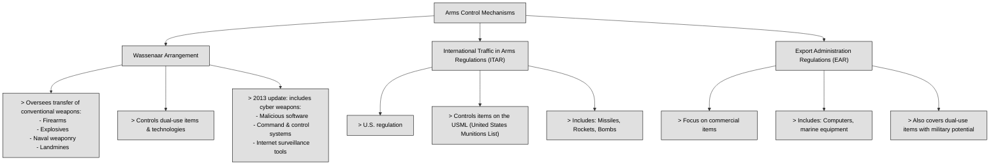
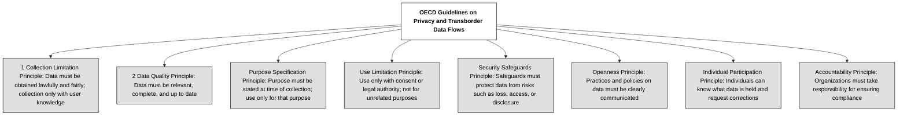

## 1.4.1 Cybercrimes and data breaches ##

:necktie: As a security professional, you are anticipated to communicate effectively with C-level executives, operational personnel, and external stakeholders such as lawyers. However, it is equally important to recognize your limitations and know when to seek legal advice when necessary.

Every organization should be addressing essential inquiries such as:
- What measures are in place to safeguard our information and assets?
- What are the information security challenges specific to our organization within a global framework?
- What is the current state of the threat landscape?

This scrutiny is crucial due to the lucrative nature of cybercrime, which often leads organizations to refrain from acknowledging victimization or pursuing cybercriminals.
While it's impossible to thwart every attack, implementing effective security measures can deter cyber intrusions by rendering them:
- Unprofitable
- Labor-intensive
- Cost-prohibitive

In essence, organizations must not present themselves as easy targets for cyber threats.

:necktie: You may never achieve complete invulnerability for your company, but it's essential to find the appropriate compromise to ensure your company is adequately protected.

Criminals may target computers directly or exploit them to facilitate traditional criminal activities. Whether driven by profit or notoriety, malicious actors can leverage readily available tools, requiring minimal technical expertise to inflict significant damage on the digital landscape. Moreover, with nation-state actors continuously enhancing their capabilities to target information and infrastructure, today's information security professionals face an increasingly challenging task in safeguarding their environments from compromise.

The laws highlighted in the following table pertain to federal regulations in the United States. It's important to note that nearly every state in the country has implemented legislation addressing computer security matters. Due to the internet's worldwide influence, many computer-related crimes transcend state boundaries, thus falling within federal jurisdiction and undergoing prosecution in federal courts. Nonetheless, certain situations may see state laws imposing more stringent regulations and penalties compared to federal laws.

| **Federal Law** | **Year** | **Description** |
|------------------|---------|------------------|
| **Computer Crime and Abuse Act (CCCA)** | 1984 | Outlined prohibited actions including: - Unauthorized access to classified or financial federal systems - Accessing federally used computers without authorization - Perpetrating fraud using federal computers - Causing over $1,000 damage to federal systems - Altering medical records impacting care - Trafficking computer passwords tied to interstate commerce or federal systems |
| **Computer Fraud and Abuse Act (CFAA)** | 1986 | Extended the CCCA by increasing the damage threshold to $5,000 and expanding scope to all "federal interest" computers, including: - Any computer used by the U.S. government or financial institutions - Offenses obstructing those systems - Cases involving multiple computers, even across state lines |
| **CFAA Amendments** *(Computer Abuse Amendments Act)* | 1994 | Added provisions to: - Prohibit malicious code creation - Expand jurisdiction to interstate commerce systems - Allow imprisonment regardless of intent - Enable civil remedies for victims (injunctions, compensation) |
| **National Information Infrastructure Protection Act** | 1996 | Expanded the CFAA to: - Cover international commerce systems - Protect critical infrastructure (railroads, pipelines, grids, telecom) - Classify intentional/reckless damage to national infrastructure as felonies |
| **Federal Information Security Management Act (FISMA)** | 2002 | Mandated NIST to define security standards. Key components: - Periodic risk assessments - Security policy development - Security training and testing - Incident response processes - Continuity planning for information systems |
| **Federal Cybersecurity Laws** *(FISMA Modernization, Cybersecurity Enhancement Act, National Cybersecurity Protection Act)* | 2014 | Modernized federal cybersecurity with: - DHS taking primary responsibility (except DoD and intelligence) - NIST tasked with voluntary cybersecurity standards (SP 800 series) - Creation of the National Cybersecurity and Communications Integration Center (DHS) for coordination of cybersecurity risks and incidents |

:brain: Scope and fines of the cybercrimes law in the table above are commisurated to the year in which they have been released.

:link: According to GDPR, ‘personal data breach’ means a breach of security leading to the accidental or unlawful destruction, loss, alteration, unauthorised disclosure of, or access to, personal data transmitted, stored or otherwise processed. https://gdpr-info.eu/art-4-gdpr/

### Open Questions ###
1. How can organizations make themselves less attractive targets for cybercriminals, even if complete invulnerability is unattainable?

  
Show answer

Organizations can deter cyber intrusions by implementing security measures that make attacks unprofitable, labor-intensive, and cost-prohibitive. This involves layering security controls, establishing robust incident response plans, and fostering a culture of security awareness.

2. Why is understanding federal jurisdiction important in the context of computer-related crimes?

  
Show answer

Understanding federal jurisdiction is crucial because many computer-related crimes cross state lines due to the internet's global reach. Federal laws like the CFAA provide a framework for prosecuting these offenses in federal courts, ensuring consistent enforcement and addressing the complexities of cybercrime.

3. Explain the key expansions introduced by the National Information Infrastructure Protection Act of 1996.

  
Show answer

The National Information Infrastructure Protection Act of 1996 expanded the CFAA's scope to include computer systems used in international commerce, extended protections to critical infrastructure beyond computing systems, and classified intentional or reckless damage to such infrastructure as felonies.

4. What are the primary responsibilities outlined for NIST under the Federal Information Security Management Act (FISMA) of 2002?

  
Show answer

Under FISMA, NIST is responsible for developing guidelines for implementing information security programs, including conducting risk assessments, establishing policies and procedures, providing security awareness training, and ensuring the continuity of operations for organizational information systems.

5. What were the primary objectives of the cybersecurity legislation signed by President Barack Obama in 2014?

  
Show answer

The 2014 cybersecurity legislation aimed to modernize federal cybersecurity efforts by centralizing responsibility under the Department of Homeland Security, tasking NIST with coordinating voluntary cybersecurity standards, and establishing a national center for cybersecurity collaboration between government agencies and civilian organizations.

6. How does the Computer Fraud and Abuse Act (CFAA) of 1986 differ from the Computer Crime and Abuse Act (CCCA) of 1984?

  
Show answer

The CFAA of 1986 expanded upon the CCCA of 1984 by increasing the damage threshold from $1,000 to $5,000 and broadening the scope from federal computers processing sensitive data to all "federal interest" computers, including those used by financial institutions and systems involved in interstate commerce.

7. What significant changes were introduced by the CFAA Amendments of 1994?

  
Show answer

The CFAA Amendments of 1994 prohibited the creation of malicious code, expanded jurisdiction to any computer involved in interstate commerce, allowed imprisonment regardless of intent, and granted victims the right to pursue civil remedies.

---

## 1.4.2 Licensing and Intellectual Property requirements ##

Intellectual property (IP) encompasses intangible assets like company names, creative works, and proprietary formulas or techniques. Laws exist to protect the rights of IP owners, ensuring fairness and preventing unauthorized use or reproduction of their creations.

:bulb: With the advancement of AI, intellectual property is evolving rapidly. Be prepared to encounter related questions in your exams and address it in your cybersecurity career.

:link: Take some time to give a look at: [https://www.copyright.gov/](https://www.copyright.gov/)

The Digital Millennium Copyright Act (DMCA) is a comprehensive United States copyright law enacted in 1998 to address copyright issues arising from the rapid growth of the internet and digital technologies. It criminalizes the production and dissemination of technology, devices, or services intended to circumvent measures that control access to copyrighted works, as well as the act of circumventing such measures. Additionally, the DMCA provides safe harbors from liability for internet service providers and online platforms that host user-generated content, as long as they comply with certain requirements, including implementing a notice-and-takedown procedure for addressing copyright infringement claims.

The following table will show what, how and and how trade secrets, patents, copyrights, and trademarks protect:

| **Symbol**     | **Name**        | **Duration**                                                                                                     | **Applies To**                                                                                                          | **Notes**                                                                                                                                                                                                                  | **Attacks**                                                                                                           |
|----------------|------------------|-------------------------------------------------------------------------------------------------------------------|--------------------------------------------------------------------------------------------------------------------------|------------------------------------------------------------------------------------------------------------------------------------------------------------------------------------------------------------------------------|------------------------------------------------------------------------------------------------------------------------|
| ©              | Copyright         | Life of the author + 70 years Work for hire: 95 years from publication or 120 years from creation (whichever is shorter) | Literary, musical, dramatic, pictorial, sculptural, motion pictures, sound recordings, architectural works              | Protects original works from unauthorized duplication Automatically applies upon creation Ownership defaults to creator unless it's work-for-hire (i.e., created as part of employment)                               | **Piracy** – Unauthorized copying or use of the material                                                             |
| ™ (unregistered) ® (registered) | Trademark         | 10 years (renewable indefinitely)                                                                                  | Words, slogans, logos                                                                                                    | Must not be similar to existing marks Must not be merely descriptive Registration provides legal standing Can be renewed indefinitely                                                                             | **Counterfeiting** – Fake products posing as real brand **Dilution** – Generic use of brand names (e.g., "Xerox") |
| *(none)*        | Patent            | 20 years                                                                                                          | Processes, machines, manufactured items                                                                                  | Must be new, useful, and non-obvious Provides exclusive rights to the invention for a limited period Requires formal application and approval                                                                         | **Infringement** – Unauthorized use, even unintentionally                                                           |
| *(none)*        | Trade Secret      | Indefinite (as long as it is kept secret and protected via NDA/NCA)                                               | Confidential business info (e.g., formulas, recipes, processes)                                                          | No formal registration required Used to protect information you never want disclosed (e.g., Coca-Cola recipe) Enforced through contracts (NDAs/NCAs) Best for software and proprietary methods                       | **Espionage** – Theft of confidential information for competitive advantage                                         |

:brain: A patent is the strongest form of Intellectual Property Protection.

Security professionals should possess knowledge of the legal aspects concerning software licensing agreements.
#### There are four prevalent types of license agreements in use today:
- Contractual license agreements involve a written contract delineating responsibilities between the software vendor and customer, commonly utilized for expensive or specialized software packages.
- Shrink-wrap license agreements are displayed on the exterior of software packaging and typically include a clause implying agreement upon breaking the shrink-wrap seal.
- Click-through (or browser wrap) license agreements, increasingly common, present contract terms either on the software box or within documentation, requiring users to actively acknowledge agreement during installation.
- Cloud services license agreements extend click-through agreements, often omitting written agreements and displaying legal terms on-screen for users to review, typically leading to users quickly clicking through without thorough examination.

| **License Type**         | **Description**                                                                                                                                                       | **Common Use**                                   |
|--------------------------|-----------------------------------------------------------------------------------------------------------------------------------------------------------------------|--------------------------------------------------|
| **Contractual License**  | A written contract outlining responsibilities between vendor and customer.                                                                                            | Expensive or specialized software packages       |
| **Shrink-Wrap License**  | Terms printed on the software packaging; agreement is implied by breaking the shrink-wrap seal.                                                                       | Packaged, boxed software                         |
| **Click-Through License** (a.k.a. Browser Wrap) | Terms are shown on-screen or in documentation; user must click “I agree” during installation.                                                                    | Widely used in downloadable/installable software |
| **Cloud Services License** | Extends click-through model; terms are shown on-screen during use or setup, often without a separate written contract. Users often skip reading.                     | SaaS and cloud-based services                    |

:brain: Remember the 4 types of license agreement: Contract, Shrink-wrap, click-through, cloud services.

Other used types of licenses are:
- **Perpetual License**: A one-time purchase that grants the user the right to use the software indefinitely, though support and updates may expire unless renewed separately.

- **Subscription License**: A recurring payment model (e.g., monthly or yearly) where the user can use the software only while the subscription is active, often including support and updates.

- **Open-Source License**: Allows users to access, modify, and share the software's source code under specific conditions set by licenses like GPL, MIT, or Apache.

- **Freeware**: Software that is free to use but usually closed-source and with restrictions on modification, redistribution, or commercial use.

- **Enterprise License Agreement (ELA)**: A custom agreement for large organizations that bundles multiple licenses and services under negotiated terms and pricing.

- **End User License Agreement (EULA)**: A legal contract that defines how the end user is allowed to use the software, including rights, restrictions, and liabilities.

- **Concurrent Use License**: A license that permits a specific number of users to access the software simultaneously, regardless of how many total users have it installed.

- **Named User License**: A license assigned to a specific individual, allowing them to use the software on multiple devices, but not transferable to others.

:bulb: In a written contract, the customer typically has the opportunity to actively participate in the creation of the contract by negotiating its terms and signing the final document. However, in shrink-wrap and click-through agreements, the customer's role is limited to accepting the terms of the contract as presented by the seller or service provider. These agreements are often presented in a pre-packaged format, such as when purchasing software online (shrink-wrap) or agreeing to terms and conditions before accessing a website or app (click-through). In these cases, the customer's only option is to either accept the contract as is or decline the offer.

### Open Questions ###
1. What is the significance of the Digital Millennium Copyright Act (DMCA) in the context of intellectual property protection in the digital age?

  
Show answer

The DMCA, enacted in 1998, criminalizes the production and distribution of technologies designed to circumvent copyright protection measures. It also establishes safe harbor provisions for online platforms that host user-generated content if they comply with specific requirements, including a notice-and-takedown system for copyright infringement claims.

2. Differentiate between trademarks and copyrights in terms of what they protect and their duration.

  
Show answer

Trademarks protect distinctive marks, symbols, or slogans used to identify and differentiate goods or services in the marketplace, offering protection for 10 years, renewable indefinitely. Copyrights protect original creative works, granting authors exclusive rights for their lifetime plus 70 years, and vary in duration for works made for hire

3. Briefly describe the three main requirements for an invention to be eligible for patent protection.

  
Show answer

To be eligible for patent protection, an invention must meet three criteria: novelty (it must be new), utility (it must have a practical purpose), and non-obviousness (it must not be readily apparent to someone skilled in the relevant field).

4. Why are trade secrets considered a valuable form of intellectual property protection, and what measures can be taken to safeguard them?

  
Show answer

Trade secrets offer indefinite protection for confidential information that provides a competitive edge, such as formulas, processes, or customer lists. Safeguarding measures include non-disclosure agreements (NDAs) and non-compete agreements (NCAs) to restrict access and prevent unauthorized disclosure or use.

5. Explain the concept of "works for hire" in copyright law and how ownership is determined in such cases.

  
Show answer

"Works for hire" refer to creations made by employees within the scope of their employment or commissioned works under contract. In these cases, the employer or commissioning party holds the copyright ownership rather than the individual creator.

6. What distinguishes a contractual license agreement from a shrink-wrap license agreement in software licensing?

  
Show answer

Contractual license agreements involve a written contract negotiated between the software vendor and customer, outlining specific terms and conditions for software use. In contrast, shrink-wrap license agreements are typically pre-printed terms and conditions found on the exterior of software packaging, where opening the package implies acceptance of the terms.

7. How do click-through license agreements function, and what are some potential concerns associated with them?

  
Show answer

Click-through agreements, commonly used for software downloads and online services, present terms and conditions on-screen, requiring users to actively click "I agree" or a similar button to proceed. Concerns arise as users often click through without thoroughly reading the terms, potentially agreeing to unfavorable conditions.

8. Provide an example of trademark counterfeiting and explain how it harms the original brand.

  
Show answer

Counterfeiting occurs when products are intentionally designed to deceive consumers into believing they are purchasing genuine branded goods. For instance, producing fake luxury handbags bearing a renowned designer's logo constitutes trademark counterfeiting, harming the brand's reputation and profits.

9. What is the primary risk associated with patent infringement, and what are the potential consequences for infringers?

  
Show answer

Patent infringement occurs when an individual or entity uses, sells, or manufactures a patented invention without the patent holder's authorization. The primary risk is facing legal action from the patent holder, potentially leading to injunctions, substantial financial damages, and legal fees.

10. Explain the concept of "fair use" in copyright law and provide an example of its application.

  
Show answer

"Fair use" is a legal doctrine in copyright law that permits the limited use of copyrighted material without the copyright holder's permission for purposes such as criticism, commentary, news reporting, teaching, scholarship, or research. An example is using brief excerpts from a copyrighted book in a scholarly article for analysis or critique.

---

## 1.4.3 Import/export controls ##

The identical computers and encryption technologies utilized in powering the internet and facilitating e-commerce possess significant potential as formidable tools when wielded by a military force. Country-based rules and laws concerning import and export controls are established to regulate the movement of products, technologies, and information across borders, typically aimed at safeguarding national security, individual privacy, and economic interests.

The Wassenaar Arrangement aims to enhance "international security and stability" by overseeing the transfer of conventional weapons like firearms, explosives, naval weaponry, and landmines, as well as dual-use items and technologies. In 2013, the agreement underwent revisions to encompass cyber weapons, which include malicious software, command-and-control systems, and Internet surveillance tools.
The **International Traffic in Arms Regulations (ITAR)** is a US regulation designed to oversee the export of items listed in the United States Munitions List (USML), including missiles, rockets, and bombs, to maintain control over their dissemination.
The **Export Administration Regulations (EAR)** primarily addresses items intended for commercial use, such as computers and marine equipment, but also covers products with potential military applications, even if initially designed for commercial purposes.

Both the EAR and the ITAR mandate that U.S. residents seek permission before disseminating controlled technology or technical data to foreign individuals within the United States. When such information is shared with a foreign person, it is considered an export to the individual's country or countries of citizenship. To prevent a "deemed export" scenario, organizations providing information to foreign nationals must obtain a license from the U.S. government before disclosing controlled technology or technical data to nonimmigrants.

| Regulation                              | Weapons | Software/Hardware | USML (U.S. Munitions List) | Commercial Use |
|----------------------------------------|:-------:|:-----------------:|:---------------------------:|:--------------:|
| **Wassenaar Arrangement**              |   ●     |        ●          |                             |                |
| **International Traffic in Arms (ITAR)**|   ●     |                   |             ●               |                |
| **Export Administration Regulations (EAR)**|       |                   |                             |       ●        |

:link: The Department of Commerce's website at www.bis.doc.gov provides a comprehensive list of countries along with their respective computer export tiers.

### Open Questions ###
1. What is the dual nature of technology used in the internet and e-commerce, and how does this relate to military applications?

  
Show answer

The same technologies that drive the internet and e-commerce, such as powerful computers and advanced encryption, can also be utilized for military purposes, including cyber warfare and surveillance. This duality makes these technologies subject to export controls to prevent potential misuse.

2. What is the primary objective of country-based import and export control laws?

  
Show answer

Import and export control laws are primarily designed to safeguard national security, protect individual privacy, and promote economic interests. These regulations aim to control the flow of sensitive goods, technologies, and information across national borders.

3. How does the Wassenaar Arrangement contribute to international security and stability?

  
Show answer

The Wassenaar Arrangement promotes international security and stability by regulating the transfer of conventional weapons and dual-use goods and technologies, including cyber weapons. By fostering transparency and cooperation among member countries, the arrangement aims to prevent the proliferation of arms and sensitive technologies that could destabilize global security.

4. What specific types of items fall under the purview of the International Traffic in Arms Regulations (ITAR)?

  
Show answer

The ITAR controls the export of items specifically listed on the United States Munitions List (USML). This list includes military equipment like missiles, rockets, bombs, firearms, and other defense articles that are deemed critical to national security.

5. Explain the primary focus of the Export Administration Regulations (EAR) and its overlap with items having military applications.

  
Show answer

The EAR primarily focuses on items intended for commercial use, such as computers, electronics, and marine equipment. However, it also covers products with potential military applications, even if originally designed for commercial purposes. This dual-use nature requires careful scrutiny to prevent the diversion of commercially available technology for military or other unauthorized purposes.

6. What is the concept of a "deemed export" and under what circumstances does it occur?

  
Show answer

A "deemed export" occurs when controlled technology or technical data is shared with a foreign national within the United States. This sharing is considered equivalent to physically exporting the information to the individual's home country, triggering export control regulations.

7. What action is required to prevent a "deemed export" situation when sharing controlled information with foreign nationals in the United States?

  
Show answer

To prevent a "deemed export" situation, organizations must obtain a license from the U.S. government before disclosing controlled technology or technical data to non-immigrant foreign nationals in the United States. This license ensures that the transfer of sensitive information is authorized and complies with export control regulations.

8. What is the USML and what does it stand for?

  
Show answer

USML stands for the United States Munitions List. It is a comprehensive list maintained by the U.S. government outlining defense articles, services, and related technical data subject to export controls under the International Traffic in Arms Regulations (ITAR).

9. Differentiate between items typically found on the USML and those regulated by the EAR

  
Show answer

Items on the USML are primarily military in nature, such as weapons systems, ammunition, and military vehicles. The EAR, on the other hand, typically regulates commercial items like computers, electronics, and software, although some may have potential military applications. The key distinction lies in the intended use and potential for military adaptation.

10. Where can one find a detailed list of countries categorized by their computer export tiers?

  
Show answer

A comprehensive list of countries categorized by their computer export tiers can be found on the website of the Department of Commerce's Bureau of Industry and Security (BIS) at www.bis.doc.gov. This resource provides detailed information on export controls and licensing requirements for specific destinations.

---

## 1.4.4 Transborder data flow ##

For numerous years, authorities have aimed to control the transfer of data collected within their territories to foreign nations. In certain instances, regulations aimed to safeguard individuals' private information, while in others, the state's interest lay in accessing the data for legitimate governmental needs. The advent of cloud computing and extensive data collection by public and private entities has intensified scrutiny on the transfer of such information.

The global economy thrives on data, which serves as a fundamental component of trade, generating substantial revenue even when lacking privacy-related content. Moreover, data considered legal in one jurisdiction could be deemed illegal in another, making the safeguarding of data movement a major policy priority.

**Data Sovereignty** is the extent to which data is subject to the laws of a country, regardless of its storage location.Data sovereignty entails the recognition that data owners or controllers must be cognizant of pertinent regulations to ensure adherence and prevent breaches of restrictions governing data usage and processing. Depending on the jurisdiction, data owners may be required to demonstrate compliance with these regulations by accounting for their data. It's essential to understand that data sovereignty can transcend the borders of the country where the data is physically stored. For instance, data belonging to a European Union resident housed in the United States is subject to both EU and US data sovereignty regulations. It's crucial to distinguish data sovereignty from data privacy, as data privacy laws such as the European Union’s General Data Protection Regulation (GDPR) prioritize responsible data safeguarding for individuals, while data sovereignty determines the scope of these data privacy laws.

**Data residency** pertains to where data is physically stored and processed, ensuring compliance with legal and regulatory frameworks based on its location. This concept is crucial in cloud computing and international data transfers, impacting data privacy, security, and compliance with local laws. Organizations must adhere to data residency requirements to maintain data sovereignty and protect privacy rights, as failure to comply can result in legal consequences and reputational harm.

**Data localization** involves storing and processing data within a specific country's borders, driven by regulatory, security, and national interest factors. It aims to exert control over data, enhance national security, ensure privacy, and support economic interests within the jurisdiction.

In summary, data residency outlines the intended geographical storage and processing of data, data sovereignty is about the rights and control over data based on the jurisdiction of the data storage and processing, and data localization mandates data to remain within a specific location and jurisdiction.

| Concept             | Definition                                                                                                  | Key Focus                             | Example                                                                                       | Distinction From Others                                                                                                                                             |
|---------------------|-------------------------------------------------------------------------------------------------------------|----------------------------------------|-----------------------------------------------------------------------------------------------|---------------------------------------------------------------------------------------------------------------------------------------------------------------------|
| **Data Sovereignty** | The extent to which data is subject to a country’s laws, regardless of where it is stored.                | Legal jurisdiction and compliance      | EU citizen's data stored in the U.S. is still subject to EU laws.                            | Goes beyond physical location; relates to **who has authority over the data**, not where it's stored. Distinct from **data privacy**.                              |
| **Data Residency**   | The physical/geographical location where data is stored and processed.                                     | Location-based legal compliance        | An organization stores Canadian user data in Canadian servers to meet local legal standards. | Focuses on **where** data lives. Supports data sovereignty, but doesn't define legal control over it.                                                              |
| **Data Localization**| The requirement to store and process data strictly within a country’s borders.                             | National control and security          | India mandates that financial data of its citizens must remain within India.                 | A **strict form** of data residency. Legally enforces that data cannot cross borders. Often motivated by national security and economic policies.                   |

:bulb: CISOs and security professionals need to adopt a comprehensive strategy for data security. This begins by categorizing and charting the organization's data, pinpointing its storage and movement, and understanding its sensitivity, location, legal obligations, and business requirements. This analysis aids in recognizing data necessitating specific measures for residency, sovereignty, or localization, as well as third parties involved in managing the organization’s data.

### Open Questions ###
1. How has the evolution of technology impacted concerns surrounding data transfer?

  
Show answer

The advent of cloud computing and extensive data collection has intensified scrutiny on the transfer of data across borders due to concerns about privacy and government access.

2. Define data sovereignty. How does it relate to the physical location of data?

  
Show answer

Data sovereignty is the extent to which data is subject to the laws of a country, regardless of where it is physically stored. Data sovereignty acknowledges that even if data is stored outside a country's borders, it may still be subject to that country's laws.

3. Explain the relationship between data sovereignty and data privacy.

  
Show answer

Data sovereignty determines the scope and applicability of data privacy laws. While data privacy laws like the GDPR focus on safeguarding individual data, data sovereignty dictates which privacy laws apply based on the data's jurisdiction.

4. What is data residency and why is it particularly important in cloud computing?

  
Show answer

Data residency refers to the physical location where data is stored and processed. It is crucial in cloud computing because data can be distributed across multiple locations, requiring organizations to comply with various legal and regulatory frameworks.

5. What are the potential consequences for organizations that fail to comply with data residency requirements?

  
Show answer

Organizations that fail to comply with data residency requirements may face legal penalties, reputational damage, and loss of customer trust.

6. Define data localization. What are the key motivations behind it?

  
Show answer

Data localization requires data to be stored and processed within the borders of a specific country. It is driven by factors such as regulatory compliance, national security concerns, data privacy protection, and promoting domestic economic interests.

---

## 1.4.5 Issues related to privacy (e.g., General Data Protection Regulation (GDPR), California Consumer Privacy Act, Personal Information Protection Law, Protection of Personal Information Act) ##

Privacy, a longstanding principle in Western culture, dictates that information pertaining to an individual should be safeguarded from disclosure, a concept spanning millennia. However, with the advent of new technologies, this notion of privacy has been significantly challenged. Modern advancements, such as ubiquitous cellular phone tracking and detailed shopping monitoring, pose unprecedented threats to personal privacy, while governmental surveillance, including widespread facial recognition technology, further encroaches upon individual liberties. Security professionals face the formidable task of ensuring organizational activities align with pertinent privacy laws while mitigating risks associated with managing personal information across its lifecycle.

:bulb: Privacy, akin to Intellectual Property, faces significant disruption due to the pervasive influence of AI.

The following table recaps the international frameworks exist that define privacy expectations:

| **Framework**                        | **Description**                                                                                                                                                                                                 |
|-------------------------------------|-----------------------------------------------------------------------------------------------------------------------------------------------------------------------------------------------------------------|
| **Universal Declaration of Human Rights** | Everyone is entitled to protection against arbitrary intrusion into their privacy, family life, home, or correspondence, as well as safeguarding their honor and reputation.                                   |
| **OECD Privacy Principles**         | Widely adopted in international privacy laws and programs. Its eight principles cover aspects such as: lawful and fair data collection, data quality, purpose specification, use limitation, security safeguards, openness, individual participation, and accountability. |
| **Asia-Pacific Economic Cooperation (APEC)** | Emphasizes the protection of personally identifiable information during cross-border transfers. It highlights organizational accountability and introduces the concept of proportionality in data breach penalties. |

:link: The OECD Privacy Guidelines can be found at https://www.oecd.org/digital/privacy/

In the following we recap the most common worldwide privacy laws. These privacy laws aim to protect individuals' privacy rights, establish accountability for organizations processing personal data, and promote transparency and trust in the digital ecosystem. Compliance with these laws is crucial for businesses operating within their jurisdictions to avoid significant financial penalties and reputational damage:

**General Data Protection Regulation (GDPR)**: The GDPR is a comprehensive data protection law enacted by the European Union (EU) to regulate the processing of personal data of individuals within the EU and European Economic Area (EEA). It imposes strict requirements on organizations handling personal data, including consent for data processing, data subject rights, data breach notification, and obligations for data controllers and processors. Non-compliance can result in severe penalties, including hefty fines of up to 4% of annual global turnover or €20 million, whichever is higher.

**California Consumer Privacy Act (CCPA)**: The CCPA is a landmark privacy law in the United States that grants California residents certain rights regarding their personal information. It requires businesses to disclose data collection and sharing practices, provide opt-out mechanisms for selling personal information, and allow consumers to access, delete, and control their data. The CCPA applies to companies meeting specific criteria, including those with annual gross revenues exceeding $25 million or those handling large volumes of personal information.

**Personal Information Protection Law (PIPL) - China**: The PIPL is China's comprehensive privacy legislation aimed at regulating the processing of personal information within the country. It establishes principles for the lawful collection, use, processing, and transfer of personal data and imposes obligations on organizations to protect individuals' rights. The law introduces concepts such as explicit consent, data localization requirements, and heightened penalties for non-compliance, including fines of up to 5% of annual revenue or ¥50 million.

**Protection of Personal Information Act (POPIA)**: The POPIA is South Africa's data protection law designed to safeguard the privacy rights of individuals and regulate the processing of personal information. It sets out conditions for lawful data processing, data subject rights, security measures, and requirements for data breaches notification. Organizations must comply with POPIA's provisions, which include hefty fines and potential imprisonment for contraventions.

| **Privacy Law**                                  | **Jurisdiction**            | **Description**                                                                                                                                                                                                                                                                                                                                                                                                 |
|--------------------------------------------------|-----------------------------|------------------------------------------------------------------------------------------------------------------------------------------------------------------------------------------------------------------------------------------------------------------------------------------------------------------------------------------------------------------------------------------------------------------|
| **General Data Protection Regulation (GDPR)**    | European Union (EU) / EEA   | A comprehensive regulation governing the processing of personal data. Requires consent, ensures data subject rights, mandates breach notifications, and sets strict responsibilities for data controllers and processors. Non-compliance may result in fines up to €20 million or 4% of global annual turnover.                                                                                                 |
| **California Consumer Privacy Act (CCPA)**       | United States (California)  | Grants California residents rights over their personal information. Requires transparency in data collection and sharing, opt-out options for data sale, and access or deletion rights for consumers. Applies to companies meeting revenue or data processing thresholds, such as $25 million+ in annual revenue or handling large volumes of data.                                                                |
| **Personal Information Protection Law (PIPL)**   | China                       | China’s comprehensive data privacy law. Requires explicit consent, regulates cross-border data transfers, imposes strict data protection duties, and enforces data localization in certain cases. Non-compliance may lead to fines up to ¥50 million or 5% of annual revenue.                                                                                                                                    |
| **Protection of Personal Information Act (POPIA)**| South Africa                | Regulates lawful data processing, ensures individual rights, mandates breach notifications, and outlines security obligations. Non-compliance can lead to heavy fines or imprisonment. Aims to align with global standards for personal data protection while addressing South African legal context.                                                                                                               |

Privacy laws, including the GDPR, seek to strike a balance between the rights of data subjects, the responsibilities of data controllers, and the oversight of supervisory authorities. This equilibrium ensures that individuals have control over their personal data, organizations process it lawfully and transparently, and regulators enforce compliance to safeguard privacy rights:

:link: For a wide and interactive view of worldwide data privacy laws give a look at: Data Protection Laws of the World

The following infographic summarize the types of data we need to prioritize safeguarding within our company:

The following table contains some common terms in use in the privacy field (many definitions are taken from GDPR and shared with other laws and regulations):

| **Term**                    | **Definition**                                                                                                                                                                                                                                                                                                                                                                                       |
|-----------------------------|--------------------------------------------------------------------------------------------------------------------------------------------------------------------------------------------------------------------------------------------------------------------------------------------------------------------------------------------------------------------------------------------------------|
| **Data Controller (Data Owner)** | The natural or legal person, public authority, agency, or other body which, alone or jointly with others, determines the purposes and means of the processing of personal data.                                                                                                                                                                                                                 |
| **Data Processor**          | A natural or legal person, public authority, agency, or other body which processes personal data on behalf of the controller.                                                                                                                                                                                                                                                                        |
| **Data Protection Officer (DPO)** | An individual designated to oversee data protection and privacy matters within an organization, ensuring compliance with relevant regulations such as GDPR.                                                                                                                                                                                                                                      |
| **Data Custodian**          | Responsible for implementing and maintaining safeguards for data based on the instructions of the data owner. Must have clearly defined responsibilities.                                                                                                                                                                                                                                            |
| **Data Subject**            | The individual to whom personal data relates.                                                                                                                                                                                                                                                                                                                                                         |
| **Personal Data**           | Any information relating to an identified or identifiable natural person (‘data subject’); an identifiable person can be recognized, directly or indirectly, by reference to identifiers such as name, ID number, location data, online identifier, or attributes unique to physical, physiological, genetic, mental, economic, cultural, or social identity.                                                |
| **Processing**              | Any operation performed on personal data, whether automated or not, including collection, recording, organization, storage, adaptation, retrieval, consultation, use, disclosure, dissemination, alignment, restriction, erasure, or destruction.                                                                                                                |

A **Privacy Impact Assessment (PIA)** is a process conducted by an organization to assess whether personal data is adequately protected and to mitigate potential risks associated with it. The objectives of a PIA include identifying and evaluating privacy-related risks, determining appropriate controls to mitigate these risks, and ensuring organizational compliance with privacy regulations. 
The steps involved in a PIA encompass: 
- identifying the need for the assessment
- describing the data processing activities
- evaluating necessity and proportionality
- consulting relevant stakeholders
- identifying and assessing risks
- implementing measures to mitigate these risks
- documenting outcomes
- ongoing monitoring and review.

:bulb: The terms Privacy Impact Assessment (PIA), Data Privacy Impact Assessment, and Data Protection Impact Assessment (DPIA) are often used interchangeably, but they can have distinct meanings depending on the context and jurisdiction.
Privacy Impact Assessment (PIA): A PIA is a process that helps organizations identify and mitigate privacy risks associated with the collection, use, and disclosure of personal information. It evaluates how personal data is handled to ensure compliance with privacy laws and to protect individuals' privacy rights. PIAs are commonly used in various countries, including the United States and Canada.
Data Protection Impact Assessment (DPIA): A DPIA is a specific type of impact assessment mandated by the General Data Protection Regulation (GDPR) in the European Union. It focuses on processing activities that are likely to result in a high risk to the rights and freedoms of individuals. The DPIA assesses the necessity and proportionality of processing and helps in identifying and mitigating risks to data subjects.
Data Privacy Impact Assessment: This term is less commonly used and can be seen as a hybrid of PIA and DPIA. It generally refers to an assessment that considers both privacy and data protection aspects, but its exact definition can vary depending on the organization's practices and the legal framework in place.

:brain: There is no need to remember the 8 standard steps of a PIA but it is mandatory to remember that a PIA is a process conducted by an organization to assess whether personal data is adequately protected.

### Open Questions ###
1. What is the core principle of privacy as rooted in Western culture?

  
Show answer

The core principle is that information pertaining to an individual should be safeguarded from disclosure, ensuring their autonomy and dignity are preserved across millennia.

2. How has modern technology challenged traditional notions of privacy?

  
Show answer

Technologies such as mobile phone tracking, targeted shopping behavior monitoring, and widespread facial recognition have made it easier to collect and exploit personal data without explicit consent, posing serious threats to personal privacy.

3. What is the purpose of a Privacy Impact Assessment (PIA)?

  
Show answer

A PIA is conducted to identify and mitigate risks to personal data and ensure that processing activities comply with privacy laws. It helps organizations proactively address privacy concerns before launching projects involving personal data.

4. What makes the GDPR one of the strictest privacy laws in the world?

  
Show answer

The GDPR mandates explicit consent, transparency, accountability, and robust data subject rights, and imposes severe financial penalties—up to €20 million or 4% of global turnover—for non-compliance.

5. How does the OECD Privacy Principles framework contribute to international privacy practices?

  
Show answer

The OECD framework provides eight guiding principles—such as purpose limitation, security safeguards, and accountability—that form the basis of many global privacy laws, promoting fair and lawful personal data processing across borders.

6. What is the difference between a Data Controller and a Data Processor?

  
Show answer

A Data Controller determines the purpose and means of data processing, while a Data Processor acts on behalf of the controller and follows their instructions when handling personal data.

7. Why is the concept of proportionality important in privacy regulations like APEC's framework?

  
Show answer

Proportionality ensures that data protection measures are appropriate to the severity of potential risks, avoiding overregulation while still enforcing meaningful accountability and breach penalties.

8. Which key rights does the California Consumer Privacy Act (CCPA) grant to California residents?

  
Show answer

The CCPA allows residents to access their personal data, request its deletion, opt out of its sale, and receive clear information on how businesses collect and share their data.

9. What is the primary focus of the Personal Information Protection Law (PIPL) in China?

  
Show answer

The PIPL regulates personal data handling within China, requiring explicit consent, enforcing data localization, and imposing stringent obligations and penalties to protect individuals' privacy rights.

10. How are the terms PIA, DPIA, and Data Privacy Impact Assessment related?

  
Show answer

They all refer to assessments of privacy risks, but vary by jurisdiction: PIA is broader and used globally, DPIA is specific to GDPR, and Data Privacy Impact Assessment is a hybrid term that may incorporate both privacy and protection considerations.

---

## 1.4.6 Contractual, legal, industry standards, and regulatory requirements ##

A comprehensive security program must align with a variety of external requirements that influence how data is handled, protected, and governed. The table below outlines the key categories of such requirements—contractual, legal, industry standards, and regulatory—along with their descriptions to serve as essential inputs for your security strategy.

| **Requirement**           | **Description**                                                                                                                                                                                                                         | **Classification**          | **Description**                                                                                                                                                   |
|---------------------------|-----------------------------------------------------------------------------------------------------------------------------------------------------------------------------------------------------------------------------------------|------------------------------|-------------------------------------------------------------------------------------------------------------------------------------------------------------------|
| Contractual Requirements  | Are obligations outlined in agreements between parties, such as service level agreements (SLAs), vendor contracts, and non-disclosure agreements (NDAs).                                                                              |                              |                                                                                                                                                                   |
| Legal Requirements        | Legal requirements encompass laws and regulations governing data protection, privacy, intellectual property, and cybersecurity.                                                                                                         | Criminal Law                 | Encompasses regulations against offenses like homicide, assault, theft, and arson.                                                                                |
|                           |                                                                                                                                                                                                                                         | Civil Law (Tort Law)         | Pertains to matters such as contractual disagreements, property dealings, employment issues, estate management, and probate proceedings.                         |
|                           |                                                                                                                                                                                                                                         | Administrative Law           | Grants government bodies certain powers to establish regulations.                                                                                                 |
| Industry Standards        | Are guidelines and best practices established by professional organizations and bodies within specific sectors. Examples include ISO/IEC 27001 for information security management systems and NIST Cybersecurity Framework.          |                              |                                                                                                                                                                   |
| Regulatory Requirements   | Are mandates set forth by government agencies and regulatory bodies to ensure compliance with specific standards and protocols (examples are PCI DSS and SOX).                                                                          |                              |                                                                                                                                                                   |

The following table tries to recap the charcteristics of Standards, Directives, Frameworks, Laws and Regulations.

| Feature     | Standard                                                  | Framework                                                    | Regulation                                                              | Directive                                                                 | Law                                                                    |
| :---------- | :-------------------------------------------------------- | :----------------------------------------------------------- | :---------------------------------------------------------------------- | :------------------------------------------------------------------------ | :--------------------------------------------------------------------- |
| What is it? | A set of agreed-upon best practices, specifications, or rules. | A set of guidelines or principles for managing security.     | Mandatory rules set by a governing body that must be followed.          | A formal instruction or order issued by an authority or body.             | A legal rule or system that governs behavior in society.               |
| Examples    | ISO 27001, NIST SP 800-53, PCI DSS                       | NIST Cybersecurity Framework, COBIT, CIS Controls            | GDPR, HIPAA, PCI DSS (when enforced)                                    | EU Directives like the GDPR Directive, NIS Directive                      | Data Protection Act, Computer Misuse Act, Cybersecurity Laws           |
| Purpose     | To define best practices or benchmarks for security.      | To guide the implementation of cybersecurity practices.      | To enforce legal compliance, protect data, and prevent harm.            | To direct actions towards a specific security goal or measure.            | To regulate behavior, ensure national security and protect citizens.   |
| Applicability | Global or industry-specific, depending on the standard.   | Broad applicability for organizational cybersecurity.        | Mandatory for organizations in specific jurisdictions or industries.    | Binding on member states of the relevant authority.                       | Jurisdiction-specific, applicable within a country or region.          |
| Compliance  | Voluntary compliance, often leading to certification.     | Voluntary but recommended for better security posture.       | Legally enforced, with penalties for non-compliance.                    | Enforced by the organization issuing the directive/posture.               | Enforced by government authorities, legal penalties for violations.    |
| Assessment  | Audits for certification (ISO 27001, PCI DSS).            | Self-assessment or third-party assessments.                  | Regulatory audits, investigations by government bodies.                 | Monitoring by relevant regulatory authority.                              | Legal audits, court orders, compliance checks.                         |

### Open Questions ###
1. Explain what are contractual requirements and provide two examples.

  
Show answer

Contractual requirements are obligations outlined in agreements between parties. Examples include service level agreements (SLAs) and vendor contracts.

2. Differentiate between legal and regulatory requirements.

  
Show answer

Legal requirements are broad laws and regulations established by governments, while regulatory requirements are specific mandates set by government agencies to ensure compliance within particular sectors or industries.

3. List the three primary branches of legal requirements, and briefly describe each.

  
Show answer

The three primary branches are: Criminal Law (addresses offenses like theft and fraud), Civil Law (deals with disputes between individuals or organizations, such as contract breaches), and Administrative Law (empowers government bodies to create regulations).

4. Why are industry standards important in the context of security? Provide an example.

  
Show answer

Industry standards provide guidelines and best practices developed by professional organizations, helping organizations establish a baseline level of security. An example is the ISO/IEC 27001 standard for information security management systems.

5. How do service level agreements (SLAs) contribute to security within contractual obligations?

  
Show answer

SLAs define the expected level of service for security aspects like system availability, incident response times, and data protection measures, ensuring vendors or service providers meet specific security performance standards.

6. Explain how non-disclosure agreements (NDAs) play a role in protecting sensitive information.

  
Show answer

NDAs establish legal confidentiality obligations, prohibiting the unauthorized disclosure of sensitive information such as trade secrets, customer data, or internal security practices.

7. Why is understanding the difference between criminal and civil law relevant to security professionals?

  
Show answer

Understanding the difference is crucial because security breaches can lead to both criminal charges (if illegal activities are involved) and civil lawsuits (for damages caused by negligence or breach of contract).

8. How does the NIST Cybersecurity Framework assist organizations in enhancing their security posture?

  
Show answer

The NIST Cybersecurity Framework provides a voluntary and adaptable set of guidelines, best practices, and standards to help organizations improve their cybersecurity risk management by identifying, protecting, detecting, responding to, and recovering from threats.

9. Briefly explain the role of administrative law in shaping security regulations.

  
Show answer

Administrative law grants government agencies the authority to develop and enforce specific regulations related to data protection, privacy, critical infrastructure security, and other areas impacting national security and public interest.

