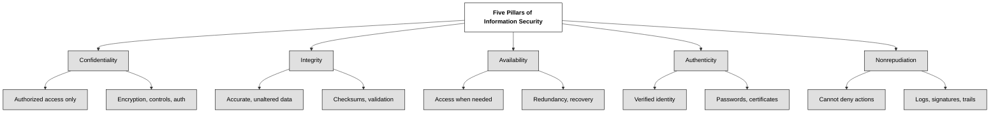

## 1.2.1 Confidentiality, integrity, and availability, authenticity, and nonrepudiation

The five pillars of information security are the principles that guide the design, implementation, and management of secure systems. Each one of the 5 pillars addresses an aspect of information security, ensuring that data and systems remain protected from various threats. Here's an explanation of each:
1. **Confidentiality** ensures that information is accessible only to those authorized to access it. This means protecting data from unauthorized disclosure or access, whether intentional or accidental. Techniques such as encryption, access controls, and user authentication help maintain confidentiality by ensuring that sensitive information remains secure and inaccessible to unauthorized users.
2. **Integrity** refers to maintaining the accuracy, reliability and completeness of data over its entire lifecycle. It involves protecting data from unauthorized modification, deletion, or tampering. Integrity safeguards data from both intentional and unintentional undesired modifications. Ensuring data integrity involves implementing controls such as data validation, checksums, and digital signatures to detect and prevent unauthorized changes to data.
3. **Availability** ensures that information and resources are accessible to authorized users when needed. This third pillar focuses on ensuring timely access to data and services. Measures such as redundancy, fault tolerance, and disaster recovery planning help maintain availability by ensuring continuous access to systems and resources.
4. **Authenticity** verifies the identity of users and ensures that data or communications originate from a trusted source. It involves confirming the legitimacy of individuals, devices, or processes involved in accessing or transmitting information. Authentication mechanisms such as passwords, biometrics, and digital certificates help in establishing the authenticity of users and entities.
5. **Nonrepudiation** ensures that individuals cannot deny their actions or transactions. It provides evidence to prove that a specific action occurred and that the parties involved cannot refute their involvement. Nonrepudiation mechanisms such as digital signatures, audit trails, and transaction logs help establish accountability and provide a means to trace actions back to their originators. By ensuring nonrepudiation individuals are accountable for their actions in digital transactions.

>[!SUCCESS] Every cybersecurity expert should retain knowledge of the five pillars of information security, comprehend their significance, and demonstrate the capability to correctly associate practical examples with the respective pillar.

The five pillars theory represents an extension of the former CIA (Confidentiality, Integrity, Availability) triad concept. 

>[!WARNING] Information Security is often confused solely with Confidentiality, but it is important to know that while confidentiality protects data from unauthorized access, integrity ensures its accuracy and reliability, and availability ensures that information is accessible when needed.

The three “old” pillars (Confidentiality, Integrity and Availability) ,making the CIA triad, are interrelated, with availability being essential for upholding the other two. Therefore, to achieve comprehensive security, organizations must prioritize all three pillars of the CIA triad. 

DAD (Disclosure, Alteration, Destruction) represents the opposite of the CIA triad (Confidentiality, Integrity, and Availability). **Disclosure** refers to unauthorized access to information, **Alteration** involves unauthorized modifications, and **Destruction** is the unauthorized deletion or damage of data. DAD is useful because it helps security professionals understand the potential threats to the system and data.

| **CIA Triad**       | **Definition**                      | **DAD Threats** | **Definition**                     |
| ------------------- | ----------------------------------- | --------------- | ---------------------------------- |
| **Confidentiality** | Access only for authorized users    | **Disclosure**  | Unauthorized access to information |
| **Integrity**       | Data remains accurate and unaltered | **Alteration**  | Unauthorized modification of data  |
| **Availability**    | Resources accessible when needed    | **Destruction** | Unauthorized deletion or damage    |

>[!WARNING] Excessive focus on security can sometimes lead to its own set of challenges. Emphasizing confidentiality too much may inadvertently limit availability, while an excessive focus on integrity can also restrict availability. Similarly, prioritizing availability excessively may compromise both confidentiality and integrity.

| Concept         | ISO 27001 Definition                                                                       | NIST Definition                                                                                                  | Synthetic Definition                                     | Related Terms                                                  | Opposite       | Protected By                                                   |
| --------------- | ------------------------------------------------------------------------------------------ | ---------------------------------------------------------------------------------------------------------------- | -------------------------------------------------------- | -------------------------------------------------------------- | -------------- | -------------------------------------------------------------- |
| Confidentiality | Property that information is not made available or disclosed to unauthorized individuals.  | The property that data or information is not made available or disclosed to unauthorized persons or processes.   | Information is available only to authorized users.       | Sensitivity, Discretion, Criticality, Concealment, Privacy     | Disclosure     | Encryption, Access Control                                     |
| Integrity       | Property of accuracy and completeness.                                                     | The property that data or information have not been altered or destroyed in an unauthorized manner.              | Information is accurate and complete.                    | Accuracy, Truthfulness, Validity, Accountability               | Alteration     | Hashing, Configuration Management, Change Management           |
| Availability    | Property of being accessible and usable on demand by an authorized entity.                 | The property that data or information is accessible and usable upon demand by an authorized person.              | Authorized users have access to information when needed. | Accessibility, Reliability, Uptime, Continuity, Responsiveness | Destruction    | Access Control, RAID, Clustering, Load Balancing, Backups      |
| Authenticity    | Property that an entity is what it claims to be.                                           | The property of being genuine and able to be verified and trusted; confidence in validity of message originator. | Information is authentic and originates from its source. | Genuineness, Truthfulness, Originality, Trustworthiness        | Inauthenticity | Digital Signatures, Chain of Custody, Blockchain, Watermarking |
| Non-repudiation | Ability to prove the occurrence of a claimed event or action and its originating entities. | Assurance the sender is provided with proof of delivery and the recipient with proof of sender’s identity.       | A subject cannot deny performing an action or event.     | Accountability, Traceability, Assurance, Immutability          | Repudiation    | MFA, 3rd party witnessing                                      |

🔗 A well detailed explanation of the CIA triad can be found for free in [NIST SP 800-33 (withdrawn in 2018)](https://csrc.nist.gov/pubs/sp/800/33/final)

While the CIA Triad (Confidentiality, Integrity, Availability) is the foundation of information security, Donn Parker introduced the **Parkerian Hexad**, which expands on these principles by adding three more security attributes:

- `Confidentiality` – Ensuring information is only accessible to authorized users.
- `Integrity` – Protecting data from unauthorized modification.
- `Availability` – Ensuring systems and data are accessible when needed.
- `Possession` (or Control) – Ensuring ownership and control of data, preventing unauthorized possession even if confidentiality is intact.
- `Authenticity` – Verifying that data, communications, and identities are genuine.
- `Utility` – Ensuring that data is useful and in a functional format for its intended purpose.
  
The Hexad provides a broader, more nuanced view of information security, especially in modern environments where data ownership, authenticity, and usability are just as critical as confidentiality and integrity.

Having explored the 5 Pillars of Information Security and their foundational role in protecting information, it's essential to understand how these principles are enforced in practice. This is where the IAAA Framework comes into play, providing the mechanisms to implement and uphold the pillars effectively.

The **IAAA framework** consists of four essential steps in access control and accountability:
- **Identification:** This step involves individuals `claiming an identity` when attempting to access a secured system or resource. Identification typically involves providing a username, ID number, or other unique identifier.
- **Authentication:** After identification, authentication `verifies the claimed identity` to ensure it is legitimate. Authentication methods can include passwords, biometrics, security tokens, or other means to confirm the identity of the user.
- **Authorization:** Once authentication is successful, authorization `determines the access rights and permissions` granted to the authenticated identity. Authorization specifies what actions the user is allowed or denied regarding the system or resource based on their identity and role.
- **Accountability:** Accountability (or accounting) involves `tracking and recording` activities and events related to system access and usage. This step includes auditing and logging actions taken by users to maintain a record of who accessed what, when, and for what purpose. Accountability helps enforce security policies, investigate incidents, and hold individuals responsible for their actions.

Together, these four steps—Identification, Authentication, Authorization, and Accountability—form the foundation of access control and ensure secure and accountable usage of information systems and resources.

You may also come across the IAAAA framework, where the key distinction is the Auditing component. This focuses on monitoring and reviewing activities to ensure compliance and security. As a result, IAAAA offers a more comprehensive approach, enhancing accountability through regular checks and balances.

Historically, the AAA framework (Authentication, Authorization, Accountability) was the predecessor to IAAA and IAAAA. Interestingly, when searching IAAA in IETF documents, no results are found, whereas searching for AAA returns five pages of results.

>[!SUCCESS] **Auditing vs Monitoring.**
**Auditing** is a systematic and retrospective process. It involves reviewing logs, records, and activities to ensure compliance with security policies, detect anomalies, and verify that processes are working as intended. Auditing typically occurs periodically (e.g., weekly, monthly) and focuses on accountability and long-term security improvements.
**Monitoring** is a real-time or near-real-time process. It involves actively observing systems, networks, and activities to detect and respond to potential threats or unusual behavior as they occur. Monitoring is proactive and is used to identify and mitigate issues before they escalate.

Identity Assurance pertains to the degree of certainty a system possesses regarding a user's claimed identity, ensuring that they are indeed who they profess to be.
- At **Identity Assurance Level 1 (IAL1)**, users rely solely on self-assertion. While there is no external verification, users' asserted identities are accepted, allowing for the entry of fictitious information during registration.
- Moving up to **Identity Assurance Level 2 (IAL2)**, verification becomes mandatory. Users must substantiate their claimed identities by providing evidence, such as scanned government documents like a driver's license or confirming their address with a mailed verification code.
- **Identity Assurance Level 3 (IAL3)** demands in-person validation. This necessitates a physical visit, where users present their photo ID to a clerk, complete paperwork, which is then cross-checked against government or public databases, often requiring additional supporting documentation.

**Authenticator Assurance Levels (AAL)** denote the extent to which users manage authenticators, such as passwords.
- **AAL1** offers moderate confidence, typically involving a single factor like a password, allowing for one or two-factor authentication.
- **AAL2** ensures elevated confidence, mandating the provision of at least two factors.
- **AAL3** delivers the utmost confidence, necessitating two factors alongside a cryptographic key and a physical device. This comprehensive approach, when coupled with a username/password combination, yields the highest level of authentication certainty.

🔗 The Identity Assurance Level (IAL) and Authenticator Assurance Level (AAL) levels 1, 2, and 3 are defined in the [NIST Special Publication (SP) 800-63-3: Digital Identity Guidelines](https://pages.nist.gov/800-63-3/)

Other important concepts such as defense in depth, abstraction, data hiding, and obfuscation form the foundation of secure architectures. These principles are part of authoritative standards like ISO/IEC 27001 and NIST guidelines, let's go through them. 

**Defense in depth** is a concept that emphasizes the use of multiple layers of security controls and mechanisms to protect data and systems. Rather than relying on a single line of defense, this approach states that if one control fails, others must be in place to mitigate the risk. This concept aligns with the principle of layered security.
The implementation of defense in depth usually spans three key layers:
- **Physical Controls:** that are are tangible security measures such as locks, access badges, and surveillance systems to restrict unauthorized physical access to facilities and resources.
- **Technical Controls:** involving the use of technology, such as firewalls, intrusion detection systems (IDS), and encryption, to protect digital assets from cyber threats.
- **Administrative Controls:** such as policies, procedures, and training programs designed to manage personnel behavior and ensure compliance with security protocols.

According to NIST, the defense in depth strategy improves resilience by ensuring that multiple barriers must be overcome by an attacker to compromise a system. It also supports the principle of least privilege and the secure management of vulnerabilities.

**Abstraction** refers to the process of simplifying complex systems by exposing only the necessary and relevant details to users or systems, while hiding the underlying complexity. This principle is commonly employed in access control and system design to reduce complexity and minimize security risks.
For example, users interact with an operating system through high-level commands without needing direct access to its kernel-level functions. By abstracting these interactions, the system can enforce security controls more effectively, preventing unauthorized access to critical components.
Abstraction is also used in data structures and object-oriented programming to encapsulate details and reduce attack surfaces. ISO/IEC 27001 highlights abstraction as a means to streamline operations while maintaining security.

**Data hiding** focuses on concealing specific details of data or processes to limit access and reduce the risk of exposure to unauthorized parties. This principle ensures that only authorized users or systems have access to sensitive information, adhering to the principle of "need-to-know."
Examples of data hiding include:
- Masking sensitive information, such as Social Security numbers, in user interfaces.
- Segregating network traffic to isolate sensitive data.
- Using access control mechanisms to restrict visibility into database schemas or records.
- Data hiding is focused on security by minimizing the exposure of sensitive information. 

> [!WARNING] Data hiding is a concept different from **security through obscurity** that is is a practice in which the security of a system or component relies on keeping its design, implementation, or flaws hidden from potential attackers. Security through obscurity is generally discouraged because it does not provide true security. While it may temporarily deter unsophisticated attackers, it fails against determined adversaries who can uncover hidden elements through reverse engineering, analysis, or brute force.  

Examples of security through obscurity are: 
- Hidden URLs: Using obscure or unlinked URLs to restrict access to sensitive resources without implementing proper authentication controls. - 
- Renaming Admin Accounts: Changing the default administrator username without implementing additional access controls.
- Proprietary Protocols: Relying on a custom, undocumented communication protocol to secure data transmission without encryption.

>[!SUCCESS] Whatever your approach to cybersecurity, always remember the importance of **measuring security**. Security should deliver measurable benefits, and these benefits must be tracked using clear metrics.

### Open Questions ###
1. What are the five pillars of information security and what do they represent?

  
Show answer

The five pillars are: Confidentiality, ensuring information is accessible only to authorized individuals; Integrity, maintaining the accuracy and completeness of data; Availability, ensuring authorized users have timely access to information; Authenticity, verifying the identity of users and the source of data; and Non-repudiation, proving actions or transactions and preventing denial of involvement.

2. Differentiate between the CIA triad and the DAD triad in information security.

  
Show answer

The CIA triad stands for Confidentiality, Integrity, and Availability, representing the core principles of information security. The DAD triad represents the opposite: Disclosure, Alteration, and Destruction, highlighting potential threats to information systems.

3. Explain the concept of defense in depth and provide examples of its implementation across different layers.

  
Show answer

Defense in depth employs multiple layers of security controls to protect data. Examples include physical controls like locks and surveillance, technical controls like firewalls and encryption, and administrative controls such as policies and training.

4. How do abstraction and data hiding contribute to enhancing security in information systems?

  
Show answer

Abstraction simplifies complex systems by hiding unnecessary details, reducing complexity and minimizing security risks. Data hiding conceals specific data details, limiting access to sensitive information and adhering to the need-to-know principle

5. What is the purpose of the IAAA framework and what are its four key steps?

  
Show answer

The IAAA framework provides mechanisms for access control and accountability. Its four steps are Identification, claiming an identity; Authentication, verifying the claimed identity; Authorization, determining access rights; and Accountability, tracking and recording user activities.

6. Describe the differences between Identity Assurance Levels (IAL) 1, 2, and 3.

  
Show answer

IAL1 relies on self-assertion without external verification. IAL2 requires evidence to support the claimed identity. IAL3 necessitates in-person validation with government or public databases.

7. Explain the significance of Authenticator Assurance Levels (AAL) and their role in authentication.

  
Show answer

AALs denote the level of control users have over authenticators. AAL1 uses single-factor authentication. AAL2 mandates at least two factors. AAL3 requires two factors and a cryptographic key with a physical device for the highest authentication confidence.

8. Differentiate between auditing and monitoring in the context of information security.

  
Show answer

Auditing is a retrospective review of logs and activities to ensure compliance and detect anomalies. Monitoring is a real-time observation of systems to identify and respond to potential threats.

9. Why is "security through obscurity" generally discouraged as a reliable security practice?

  
Show answer

Security through obscurity relies on hiding system details, which is unreliable as determined adversaries can uncover these details. It fails to provide true security and is discouraged in favor of robust security practices.

10. Why is it important to measure the effectiveness of security measures, and how can this be achieved?

  
  
Show answer

Measuring security effectiveness allows for demonstrating its value and identifying areas for improvement. This can be achieved through metrics such as the number of prevented incidents, mean time to detect and remediate threats, and compliance with security standards.

