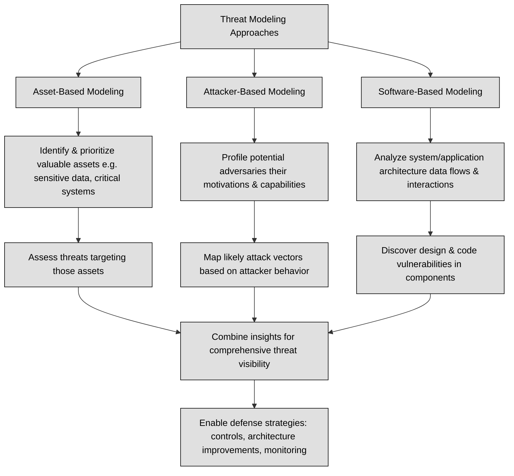

## 1.10 Understand and apply threat modeling concepts and methodologies ##

Threat modeling is a security process that involves identifying, categorizing, and analyzing potential threats. It can be conducted proactively during the design and development phase or reactively once a product is deployed. The process aims to assess the potential harm, probability of occurrence, priority of concern, and methods to mitigate or eliminate threats. A defensive approach to threat modeling occurs early in the development stages, focusing on predicting threats and integrating specific defenses during coding and crafting. 

There are several common ways to approach threat modeling, each with a unique focus. Asset-based threat modeling begins by identifying valuable assets, such as sensitive data or critical systems, and assessing the threats that could compromise them. 
Attacker-based threat modeling focuses on understanding potential adversaries, including their motivations, capabilities, and likely attack vectors, to predict and mitigate their actions. Software-based threat modeling analyzes the application or system architecture to identify vulnerabilities in its design, code, or interactions with other components. Each method offers valuable insights, and combining them can provide a comprehensive view of potential threats.

Microsoft developed the STRIDE threat model, which includes six categories: Spoofing, Tampering, Repudiation, Information Disclosure, Denial of Service (DoS), and Elevation of privilege. Another methodology, the Process for Attack Simulation and Threat Analysis (PASTA), comprises seven stages, each with specific objectives and deliverables. Additionally, Visual, Agile, and Simple Threat (VAST) integrates threat and risk management into an Agile programming environment. Security teams employ various methods to identify threats, including focusing on attackers, assets, and software. Understanding these threats allows organizations to document potential attack vectors, often using diagramming techniques to list the technologies under threat.

The following table recaps some threat models:

| Threat Model                 | Description |
|-----------------------------|-------------|
| **STRIDE**                  | STRIDE is a mnemonic-based method developed by Microsoft to categorize threats: **Spoofing**, **Tampering**, **Repudiation**, **Information Disclosure**, **Denial of Service**, and **Elevation of Privilege**—helping teams systematically identify where systems may fail.|
| **PASTA**                   | PASTA (Process for Attack Simulation & Threat Analysis) is a seven-stage, risk-centric methodology that aligns threat modeling with business objectives—covering objectives definition, application decomposition, threat analysis, attack modeling, and risk mitigation planning.|
| **VAST**                    | VAST (Visual, Agile & Simple Threat modeling) is built for scale in Agile environments—integrating threat modeling continuously across teams and tools throughout the development lifecycle. |
| **DREAD**                   | DREAD is a quantitative rating system measuring threats based on **Damage potential**, **Reproducibility**, **Exploitability**, **Affected users**, and **Discoverability**—producing an average score to prioritize risks. |
| **TRIKE**                   | TRIKE is an open‑source, risk-based methodology combining a stakeholder-defined requirement model with an implementation model (often a Data Flow Diagram) to assign acceptable risk levels and audit compliance.|

Reduction analysis is a method used in threat modeling to break down a system into its fundamental components to identify potential vulnerabilities. The process focuses on understanding how different parts of the system interact and where risks might emerge. Key concepts include trust boundaries, dataflow paths, input points, and privileged operations. Here's a detailed explanation:

A **trust boundary** is the line that separates areas of differing trust levels in a system. Crossing this boundary introduces potential risks because data or requests may come from untrusted or less-trusted sources. For example:

- Crossing from the internet (untrusted) into an internal database (trusted).
- Transitions between user roles, such as guest and admin.

**Dataflow paths** represent the movement of data through a system, showing how information is transferred between components. Mapping these paths helps identify where sensitive data might be exposed or altered. Examples include:

- HTTP requests moving from the client to a web server.
- Data transfers between a front-end application and a back-end database.

**Input points** are locations where external entities interact with the system, providing data or instructions. These points are critical because they are often exploited by attackers. Examples include:

- Login forms, file upload features, and APIs.
- Sensors or hardware components receiving external signals.

**Privileged operations** are actions requiring elevated permissions, such as modifying system settings, accessing restricted data, or managing user roles. These operations are high-value targets for attackers. Examples include:

- Granting admin access to a user.
- Writing to system configuration files.

:link: The following image, from owasp.org depicts User Login Data Flow Diagram for a College Library Website:

:link: The OWASP threat modeling process describes a structured approach to application threat modeling that enables you to identify, quantify, and address the security risks associated with an application: https://owasp.org/www-community/Threat_Modeling_Process

### Open Questions ###

1. What is the primary goal of threat modeling, and when can it be conducted in the development lifecycle?

  
Show answer

The primary goal of threat modeling is to identify, categorize, and analyze potential threats to a system. It can be conducted proactively during design and development or reactively after deployment.

2. Briefly explain the difference between attacker-based and asset-based threat modeling.

  
Show answer

Attacker-based threat modeling focuses on understanding the motivations, capabilities, and attack vectors of potential adversaries. In contrast, asset-based threat modeling centers on identifying valuable assets and the threats that could compromise them.

3. What are the six threat categories defined by the STRIDE model?

  
Show answer

The STRIDE model defines six threat categories: Spoofing, Tampering, Repudiation, Information Disclosure, Denial of Service (DoS), and Elevation of Privilege.

4. What does the acronym PASTA stand for, and what is its core focus?

  
Show answer

PASTA stands for Process for Attack Simulation and Threat Analysis. It is a seven-stage methodology primarily focused on assessing risks based on asset value.

5. How does the VAST approach differ from traditional threat modeling methodologies?

  
Show answer

VAST (Visual, Agile, and Simple Threat) integrates threat and risk management directly into an Agile programming environment, making it more dynamic and adaptable compared to traditional methods.

6. What are the five criteria evaluated in the DREAD rating system?

  
Show answer

The DREAD rating system evaluates five criteria: Damage potential, Reproducibility, Exploitability, Affected Users, and Discoverability.

7. What is the purpose of reduction analysis in the context of threat modeling?

  
Show answer

Reduction analysis breaks down a system into its fundamental components to better understand the system's logic, interactions, and potential vulnerabilities. This detailed examination helps pinpoint where risks might emerge.

8. Define the concept of a trust boundary and provide an example.

  
Show answer

A trust boundary is the line that separates areas of differing trust levels in a system. Crossing this boundary introduces potential security risks. An example is the transition from the internet (untrusted) to an internal database (trusted).

9. Why are input points considered high-risk areas from a security perspective?

  
Show answer

Input points are high-risk areas because they provide a direct interface for external entities to interact with the system, offering opportunities for attackers to inject malicious data or commands.

10. Give an example of a privileged operation and explain why it is an attractive target for attackers.

  
Show answer

Granting admin access to a user is an example of a privileged operation. It's an attractive target for attackers because it grants them significant control over the system, potentially allowing them to bypass security measures and access sensitive information.

