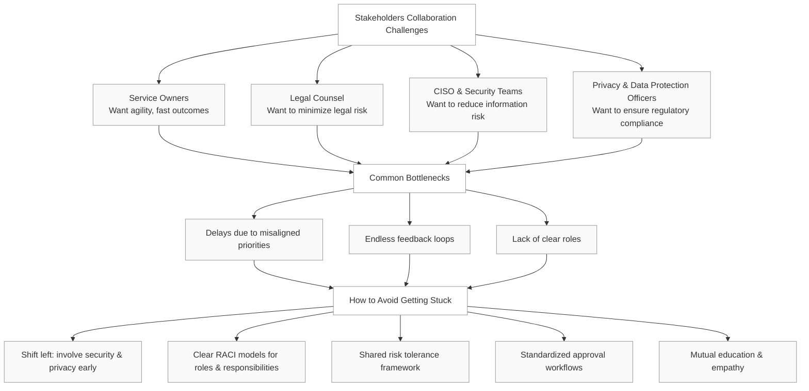

## 1-D-1 Breaking the Bottleneck: How Service Owners, Legal Teams, CISOs, and Privacy Officers Can Collaborate Effectively Without Getting Stuck ##

In organizations, the alignment between service owners, company lawyers, CISOs, and privacy or data protection teams is essential. Yet, this collaboration is often where momentum dies. 

Let’s explore why this happens — and more importantly, how to fix it.

The Roles and Their Pain Points
1. Service Owners
These are the product or system owners tasked with delivering value — fast. They want agility, speed-to-market, and minimal red tape. They may lack the legal or security expertise to judge whether their designs are compliant or secure.

2. Legal Counsel
Corporate lawyers assess contracts, terms of use, IP, liability, and regulatory risk. Their priorities lie in minimizing legal exposure. They may not fully understand how the technology works, yet are expected to quicly approve deployments.

3. CISOs and Security Teams
The CISO is responsible for reducing information risk — ensuring that data is not exposed, or made unavailable. They push for controls, monitoring, secure coding, and minimal attack surfaces. 

4. Privacy & Data Protection Officers
Often reporting to the legal department or a regulatory committee, this role ensures data protection laws like GDPR are enforced. They care about lawful bases for processing, data minimization, retention limits, and user rights. Their decisions may block tools or integrations.

How to Avoid the Bottleneck
1. Shift Left with Security and Privacy
The earlier security and privacy concerns are brought into the product lifecycle, the smoother the process becomes. Don’t wait for an audit to learn your architecture is non-compliant — involve CISOs and privacy leads during design and procurement phases.

2. Use Clear RACI Models
Everyone must understand their role in the decision-making process. Who is responsible for data classification? Who approves vendor onboarding? Who signs off on DPIAs? Having a RACI chart prevents tasks from falling into “not-my-job” territory.

3. Create a Shared Risk Tolerance Framework
Align all parties on what types of risks are acceptable. Can the company tolerate storing non-sensitive logs in the cloud? What’s the SLA for patching vulnerabilities? By defining this framework, you reduce endless debates over risk thresholds.

4. Standardize Approval Workflows
Build standardized processes for common scenarios. 

5. Foster Empathy Through Education
Service owners should get basic privacy and infosec training. CISOs should understand the business drivers and delivery pressures. Legal teams should gain enough tech context to ask the right questions. A little mutual understanding goes a long way.

Conclusion: Collaboration Is the New Compliance
Today’s enterprises are too complex to be governed by siloed teams making isolated decisions. Effective governance — especially in digital services — is built on collaboration and mutual respect.

By investing in early alignment, shared processes, and transparent communication between service owners, legal advisors, security leaders, and privacy professionals, companies can stop spinning in circles and start delivering secure, compliant, and valuable services — faster.

