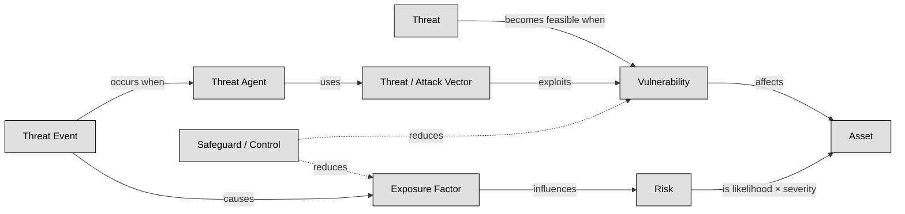

## 1.9 Understand and apply risk management concepts ##

A risk-based approach in cybersecurity is essential because it turns abstract fears into clear, manageable tasks: first you assess what could go wrong (like which valuable assets are vulnerable, how likely bad things might happen, and what their impact would be), and then you respond in a smart way—by mitigating, transferring, accepting, or avoiding the risk based on your priorities and resources .

Think of it like locking your house (assets) after figuring out which doors or windows (vulnerabilities) a burglar (threat agent) might use (attack vector), instead of leaving everything locked just because "that's how you do it." You measure how exposed you are, put in alarms or cameras (controls), and stay alert to new tricks criminals invent—this keeps you efficient, proactive, and aligned with business goals.

It all revolves around these human concepts:
- Asset: The things you care about and need to protect—like data, systems, or brand reputation 
- Vulnerability: A weakness—such as outdated software or poor passwords—that could let someone in 
- Threat (and threat agent): The potential danger—a hacker, natural event, or even an insider—and the actor behind it
- Attack vector: The route used—like phishing emails or open network ports—to launch the attack 
- Risk: The chance that a threat will exploit a vulnerability and harm your assets—and how bad that harm would be 
- Control (or safeguard): What you do to reduce vulnerabilities or block threats—technical tools, policies, training 
- Exposure: How much of your asset is actually open to threats, given its vulnerabilities.
- Attack event: When someone actually hits you—this is when theory becomes real harm.

By weaving together these concepts, a risk-based strategy becomes a living process.

:link: Some other important concepts like risk appetite, risk tolerance and risk capacity are concepts not so easy to grasp, this infographic will help you: https://it.pinterest.com/pin/397794579603964748/

---

## 1.9.1 Threat and vulnerability identification ##

Threats are potential events that may lead to undesired outcomes for a specific asset, whether intentional or accidental. Think of threats as dangers that could harm a target, similar to a weapon. Vulnerabilities represent weaknesses in an asset or the absence of safeguards, such as flaws, limitations, or errors, making it susceptible to harm.
Threats and vulnerabilities are interrelated: a threat becomes feasible when a vulnerability exists. Threats exploit vulnerabilities, leading to exposure, which is the risk. Safeguards mitigate risks by protecting assets from threats. Threat agents intentionally exploit vulnerabilities, while threat events encompass both accidental occurrences and intentional exploitation of vulnerabilities. Threat vectors, also known as attack vectors, are the paths or means by which an attack gains access to a target to cause harm.
Exposure refers to susceptibility to asset loss due to threats, representing the potential for harm. The quantitative risk analysis value of exposure factor (EF) is derived from this concept. Risk is the likelihood that a threat will exploit a vulnerability to cause harm to an asset and the severity of potential damage. The higher the potential harm, the greater the risk.

:link: NIST SP 800-30r1 provides a list of threat categories, concepts and examples: https://csrc.nist.gov/pubs/sp/800/30/r1/final

### Open Questions ###
1. What is the key difference between a threat and a vulnerability?

  
Show answer

A threat is a potential event that could cause harm, while a vulnerability is a weakness that makes an asset susceptible to that harm.

2. How do threats and vulnerabilities interact to create risk?

  
Show answer

Threats exploit existing vulnerabilities. When a threat successfully utilizes a vulnerability, it leads to risk, which is the likelihood of harm occurring.

3. Explain the concept of a safeguard and its role in risk management.

  
Show answer

A safeguard is a protective measure that mitigates risk by reducing vulnerabilities or neutralizing threats. Examples include firewalls, security cameras, and data encryption.

4. Differentiate between a threat agent and a threat event.

  
Show answer

A threat agent is an entity that intentionally exploits vulnerabilities, like a hacker or malicious software. A threat event encompasses both intentional actions by threat agents and accidental occurrences that could lead to harm.

5. Define a threat vector and provide an example.

  
Show answer

A threat vector is the path or method used by a threat agent to gain access to a target. For instance, a phishing email could be a threat vector used to steal credentials.

6. What is exposure in the context of risk assessment, and how is it quantified?

  
Show answer

Exposure refers to the potential for asset loss due to a threat. It represents the susceptibility to harm. The Exposure Factor (EF) is a quantitative value used in risk analysis to express this susceptibility.

7. Describe the relationship between risk and the potential severity of harm.

  
Show answer

Risk is directly proportional to the potential severity of harm. A threat that can cause significant damage poses a higher risk than one with limited potential impact.

8. Why is understanding the distinction between threats, vulnerabilities, and risk important for security professionals?

  
Show answer

Understanding these distinctions allows security professionals to accurately assess and prioritize risks, develop effective mitigation strategies, and allocate resources appropriately.

9. Can a threat exist without a corresponding vulnerability? Explain.

  
Show answer

A threat can exist theoretically without a corresponding vulnerability. However, it cannot materialize or cause harm without a weakness to exploit.

10. Provide a real-world example illustrating a threat, a vulnerability, and the resulting risk.

  
Show answer

Threat: A cybercriminal attempting to steal customer data. Vulnerability: A website with weak password security. Risk: The likelihood of the cybercriminal successfully exploiting the weak passwords to steal sensitive data.

---

## 1.9.2 Risk analysis, assessment, and scope ##

Risk in the context of security is the potential for harm resulting from a threat exploiting a vulnerability within a system. This concept is often quantified as the product of the probability of harm and the severity of that harm. Addressing either the threat or vulnerability directly through mitigation efforts reduces risk. Threats exploit vulnerabilities, leading to exposure, which is the essence of risk, and safeguarding assets against threats is key to risk mitigation. While it's impossible to eliminate all risks entirely, organizations can manage them by identifying acceptable and unacceptable risks, typically through a combination of quantitative and qualitative risk analysis methodologies. Quantitative analysis assigns tangible dollar values to asset losses, while qualitative analysis assesses subjective factors. Most organizations utilize a blend of both methodologies to prioritize risks based on asset-threat pairings and rank them in order of criticality, aiming to minimize the overall risk exposure.
In the process of risk ranking, quantitative analysis involves determining the anticipated annual cost of risk to the organization, known as the Annualized Loss Expectancy (ALE). This can be computed using the formula:

**ALE = SLE x ARO**

**ALE =  (AV x EF) x ARO**

Here, the acronyms correspond to:
- AV: Asset Value: The estimated financial worth or value of an asset within an organization.
- EF: Exposure Factor: The percentage of asset value likely to be lost in the event of a security breach.
- SLE: Single Loss Expectancy: The anticipated monetary loss from a single occurrence of a security incident.
- ARO: Annualized Rate of Occurrence: The estimated frequency or likelihood of a security incident occurring within a year.
- ALE: Annualized Loss Expectancy: The projected annual financial impact resulting from potential security incidents, calculated by multiplying the SLE by the ARO.

### Open Questions ###

1. Briefly describe the two main approaches to risk analysis: quantitative and qualitative.

  
Show answer

Quantitative risk analysis uses numerical data to determine the financial impact and probability of losses. Qualitative analysis considers subjective factors and the impact on intangible assets like reputation.

2. What does the acronym SLE stand for, and how is it calculated?

  
Show answer

SLE stands for Single Loss Expectancy and represents the estimated monetary loss from a single security incident. It is calculated by multiplying the Asset Value (AV) by the Exposure Factor (EF): SLE = AV x EF.

3. What is the significance of the Annualized Rate of Occurrence (ARO) in risk assessment?

  
Show answer

The Annualized Rate of Occurrence (ARO) is a crucial element in risk assessment because it estimates how frequently a particular security incident is expected to occur within a year.

4. How does the Annualized Loss Expectancy (ALE) help organizations prioritize risk mitigation efforts?

  
Show answer

ALE (Annualized Loss Expectancy) helps organizations prioritize risk mitigation efforts by providing an estimated annual financial impact of potential security incidents. Higher ALE values indicate more critical risks requiring immediate attention.

5. Provide the complete formula for calculating the ALE, explaining each component.

  
Show answer

The formula for calculating ALE is: ALE = SLE x ARO, where SLE is the Single Loss Expectancy and ARO is the Annualized Rate of Occurrence

---
