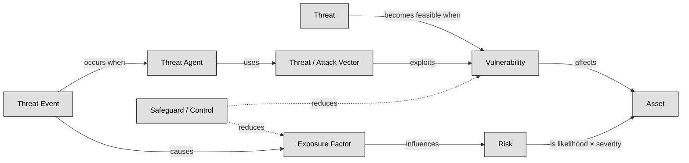
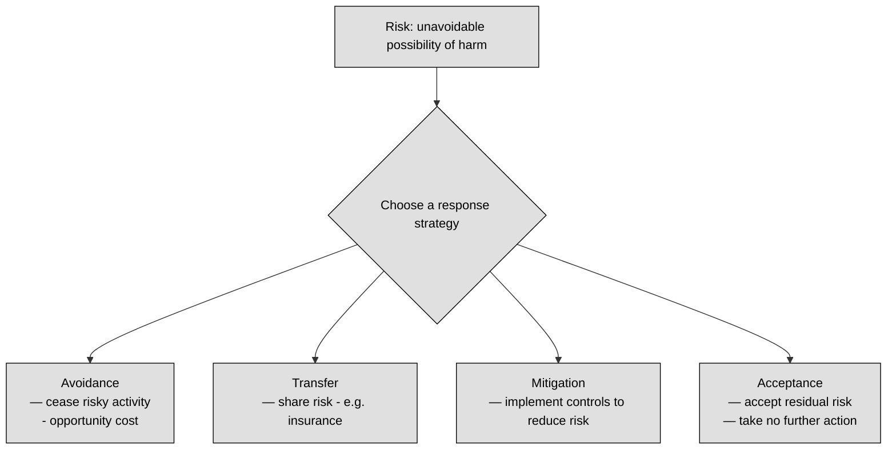
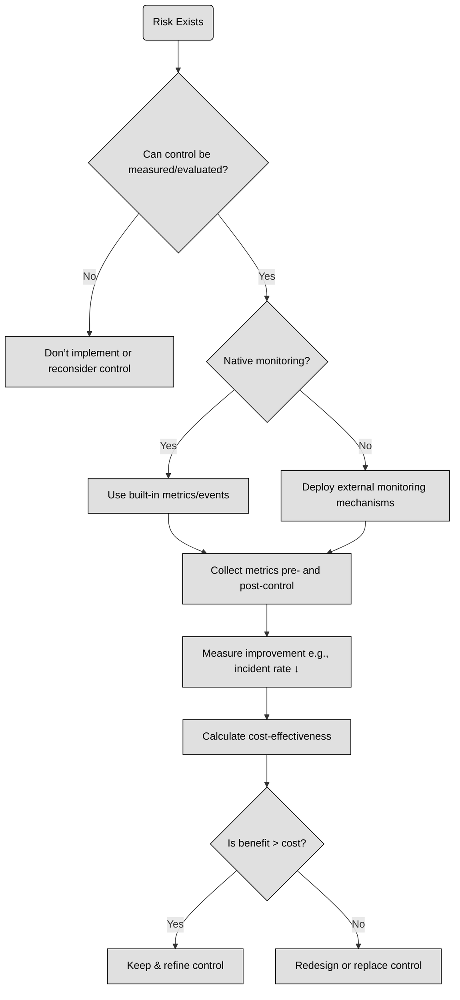

## 1.9 Understand and apply risk management concepts ##

A risk-based approach in cybersecurity is essential because it turns abstract fears into clear, manageable tasks: first you assess what could go wrong (like which valuable assets are vulnerable, how likely bad things might happen, and what their impact would be), and then you respond in a smart way—by mitigating, transferring, accepting, or avoiding the risk based on your priorities and resources .

Think of it like locking your house (assets) after figuring out which doors or windows (vulnerabilities) a burglar (threat agent) might use (attack vector), instead of leaving everything locked just because "that's how you do it." You measure how exposed you are, put in alarms or cameras (controls), and stay alert to new tricks criminals invent—this keeps you efficient, proactive, and aligned with business goals.

It all revolves around these human concepts:
- Asset: The things you care about and need to protect—like data, systems, or brand reputation 
- Vulnerability: A weakness—such as outdated software or poor passwords—that could let someone in 
- Threat (and threat agent): The potential danger—a hacker, natural event, or even an insider—and the actor behind it
- Attack vector: The route used—like phishing emails or open network ports—to launch the attack 
- Risk: The chance that a threat will exploit a vulnerability and harm your assets—and how bad that harm would be 
- Control (or safeguard): What you do to reduce vulnerabilities or block threats—technical tools, policies, training 
- Exposure: How much of your asset is actually open to threats, given its vulnerabilities.
- Attack event: When someone actually hits you—this is when theory becomes real harm.

By weaving together these concepts, a risk-based strategy becomes a living process.

:link: Some other important concepts like risk appetite, risk tolerance and risk capacity are concepts not so easy to grasp, this infographic will help you: https://it.pinterest.com/pin/397794579603964748/

---

## 1.9.1 Threat and vulnerability identification ##

Threats are potential events that may lead to undesired outcomes for a specific asset, whether intentional or accidental. Think of threats as dangers that could harm a target, similar to a weapon. Vulnerabilities represent weaknesses in an asset or the absence of safeguards, such as flaws, limitations, or errors, making it susceptible to harm.
Threats and vulnerabilities are interrelated: a threat becomes feasible when a vulnerability exists. Threats exploit vulnerabilities, leading to exposure, which is the risk. Safeguards mitigate risks by protecting assets from threats. Threat agents intentionally exploit vulnerabilities, while threat events encompass both accidental occurrences and intentional exploitation of vulnerabilities. Threat vectors, also known as attack vectors, are the paths or means by which an attack gains access to a target to cause harm.
Exposure refers to susceptibility to asset loss due to threats, representing the potential for harm. The quantitative risk analysis value of exposure factor (EF) is derived from this concept. Risk is the likelihood that a threat will exploit a vulnerability to cause harm to an asset and the severity of potential damage. The higher the potential harm, the greater the risk.

:link: NIST SP 800-30r1 provides a list of threat categories, concepts and examples: https://csrc.nist.gov/pubs/sp/800/30/r1/final

### Open Questions ###
1. What is the key difference between a threat and a vulnerability?

  
Show answer

A threat is a potential event that could cause harm, while a vulnerability is a weakness that makes an asset susceptible to that harm.

2. How do threats and vulnerabilities interact to create risk?

  
Show answer

Threats exploit existing vulnerabilities. When a threat successfully utilizes a vulnerability, it leads to risk, which is the likelihood of harm occurring.

3. Explain the concept of a safeguard and its role in risk management.

  
Show answer

A safeguard is a protective measure that mitigates risk by reducing vulnerabilities or neutralizing threats. Examples include firewalls, security cameras, and data encryption.

4. Differentiate between a threat agent and a threat event.

  
Show answer

A threat agent is an entity that intentionally exploits vulnerabilities, like a hacker or malicious software. A threat event encompasses both intentional actions by threat agents and accidental occurrences that could lead to harm.

5. Define a threat vector and provide an example.

  
Show answer

A threat vector is the path or method used by a threat agent to gain access to a target. For instance, a phishing email could be a threat vector used to steal credentials.

6. What is exposure in the context of risk assessment, and how is it quantified?

  
Show answer

Exposure refers to the potential for asset loss due to a threat. It represents the susceptibility to harm. The Exposure Factor (EF) is a quantitative value used in risk analysis to express this susceptibility.

7. Describe the relationship between risk and the potential severity of harm.

  
Show answer

Risk is directly proportional to the potential severity of harm. A threat that can cause significant damage poses a higher risk than one with limited potential impact.

8. Why is understanding the distinction between threats, vulnerabilities, and risk important for security professionals?

  
Show answer

Understanding these distinctions allows security professionals to accurately assess and prioritize risks, develop effective mitigation strategies, and allocate resources appropriately.

9. Can a threat exist without a corresponding vulnerability? Explain.

  
Show answer

A threat can exist theoretically without a corresponding vulnerability. However, it cannot materialize or cause harm without a weakness to exploit.

10. Provide a real-world example illustrating a threat, a vulnerability, and the resulting risk.

  
Show answer

Threat: A cybercriminal attempting to steal customer data. Vulnerability: A website with weak password security. Risk: The likelihood of the cybercriminal successfully exploiting the weak passwords to steal sensitive data.

---

## 1.9.2 Risk analysis, assessment, and scope ##

Risk in the context of security is the potential for harm resulting from a threat exploiting a vulnerability within a system. This concept is often quantified as the product of the probability of harm and the severity of that harm. Addressing either the threat or vulnerability directly through mitigation efforts reduces risk. Threats exploit vulnerabilities, leading to exposure, which is the essence of risk, and safeguarding assets against threats is key to risk mitigation. While it's impossible to eliminate all risks entirely, organizations can manage them by identifying acceptable and unacceptable risks, typically through a combination of quantitative and qualitative risk analysis methodologies. Quantitative analysis assigns tangible dollar values to asset losses, while qualitative analysis assesses subjective factors. Most organizations utilize a blend of both methodologies to prioritize risks based on asset-threat pairings and rank them in order of criticality, aiming to minimize the overall risk exposure.
In the process of risk ranking, quantitative analysis involves determining the anticipated annual cost of risk to the organization, known as the Annualized Loss Expectancy (ALE). This can be computed using the formula:

**ALE = SLE x ARO**

**ALE =  (AV x EF) x ARO**

Here, the acronyms correspond to:
- AV: Asset Value: The estimated financial worth or value of an asset within an organization.
- EF: Exposure Factor: The percentage of asset value likely to be lost in the event of a security breach.
- SLE: Single Loss Expectancy: The anticipated monetary loss from a single occurrence of a security incident.
- ARO: Annualized Rate of Occurrence: The estimated frequency or likelihood of a security incident occurring within a year.
- ALE: Annualized Loss Expectancy: The projected annual financial impact resulting from potential security incidents, calculated by multiplying the SLE by the ARO.

### Open Questions ###

1. Briefly describe the two main approaches to risk analysis: quantitative and qualitative.

  
Show answer

Quantitative risk analysis uses numerical data to determine the financial impact and probability of losses. Qualitative analysis considers subjective factors and the impact on intangible assets like reputation.

2. What does the acronym SLE stand for, and how is it calculated?

  
Show answer

SLE stands for Single Loss Expectancy and represents the estimated monetary loss from a single security incident. It is calculated by multiplying the Asset Value (AV) by the Exposure Factor (EF): SLE = AV x EF.

3. What is the significance of the Annualized Rate of Occurrence (ARO) in risk assessment?

  
Show answer

The Annualized Rate of Occurrence (ARO) is a crucial element in risk assessment because it estimates how frequently a particular security incident is expected to occur within a year.

4. How does the Annualized Loss Expectancy (ALE) help organizations prioritize risk mitigation efforts?

  
Show answer

ALE (Annualized Loss Expectancy) helps organizations prioritize risk mitigation efforts by providing an estimated annual financial impact of potential security incidents. Higher ALE values indicate more critical risks requiring immediate attention.

5. Provide the complete formula for calculating the ALE, explaining each component.

  
Show answer

The formula for calculating ALE is: ALE = SLE x ARO, where SLE is the Single Loss Expectancy and ARO is the Annualized Rate of Occurrence

---

## 1.9.3 Risk response and treatment (e.g., cybersecurity insurance) ##

Following the risk analysis process, security should implement the most cost-effective treatments, with the appropriate approach determined by the value of the asset and the type of risk identified in prior steps.

While it's impossible to completely eliminate risk, it can be managed through various approaches:

- Avoidance: Opting to discontinue activities that expose the asset to risk. While this can prevent risk, it may also entail missing out on significant opportunities (opportunity cost).
- Transfer: Sharing some risk with another party, typically an insurance company, to mitigate potential losses.
- Mitigation: Implementing controls to reduce risk to an acceptable level.
- Acceptance: Choosing to take no action or no further action regarding the risk associated with a particular asset.

:brain: Remember the 4 terms above: avoidance, transfer, mitigation, acceptance but be aware that during your exam and your career you’ll find many synonyms.

### Open Questions ###
1. What is the primary factor in determining the appropriate risk treatment approach?

  
Show answer

The value of the asset and the type of risk identified are the primary factors in determining the appropriate approach to risk treatment.

2. Explain the concept of "opportunity cost" in the context of risk avoidance.

  
Show answer

Opportunity cost, in the context of risk avoidance, refers to the potential benefits or profits that a company might forgo by choosing to avoid activities that carry a certain risk.

3. How does risk transfer typically function in a business setting?

  
Show answer

Risk transfer typically involves a contractual agreement with another entity, often an insurance company, where the risk of potential loss is shared in exchange for a premium payment.

4. Provide an example of risk mitigation in practice.

  
Show answer

Installing a firewall to protect sensitive data is an example of risk mitigation. Other examples include implementing access controls, data encryption, and employee training programs.

5. In what circumstances might risk acceptance be a valid strategy?

  
Show answer

Risk acceptance may be a valid strategy when the cost of mitigating or transferring the risk is disproportionately high compared to the potential impact of the risk itself, or when the risk is considered low and unlikely to occur.

6. What is the relationship between asset value and risk treatment decisions?

  
Show answer

Higher-value assets generally warrant more robust and costly risk treatment measures, while lower-value assets might justify less stringent approaches. The level of risk associated with an asset also influences the choice of treatment.

7. Can risk be entirely eliminated? Explain your answer.

  
Show answer

It is generally impossible to completely eliminate risk. Every business activity inherently carries some degree of risk, and unforeseen circumstances can always arise.

8. Why is it crucial to analyze risk before implementing treatments?

  
Show answer

Analyzing risk before implementing treatments is crucial to understand the nature and severity of the threats, assess the potential impact on assets, and make informed decisions about the most effective and cost-efficient ways to manage those risks.

9. Describe the potential drawbacks of relying solely on risk transfer as a treatment strategy.

  
Show answer

Relying solely on risk transfer, such as insurance, can be costly in terms of premium payments. Additionally, it might not cover all potential losses or indirect costs associated with a risk event, and it doesn't address the underlying causes of the risk.

10. How can an organization determine what constitutes an "acceptable level" of risk?

  
Show answer

An organization determines an "acceptable level" of risk through a combination of factors, including its risk appetite, industry standards, regulatory requirements, and the cost-benefit analysis of various risk treatment options.

---

## 1.9.4 Applicable types of controls (e.g., preventive, detection, corrective) ##

Security controls are designed to reduce the likelihood that a vulnerability will be exploited by a threat. By implementing security controls, organizations can mitigate the risk of vulnerabilities being exploited and protect their assets from harm.
The aim of security control, as stated by NIST, is to preserve Confidentiality , Integrity and Availability of information. The term control is interchangeable with the following terms: countermeasure, safeguard, security mechanism, protection mechanism.In the table below we can see a common classification of Security Controls. There are infinite possible classifications, what we’ll see is just the most common classification in the infosec field:

Usually, security controls are classified in 2 different ways: security control types and security control functions, and this classification should be enough for your infosec certification or interview.

Control types, reported in the y axis of the table, usually answer the question “how are we protecting our assets” and are divided in:

- **Physical Controls** are tangible measure used to protect (or detect) unauthorized access to physical systems or areas.
- **Technical Controls** include the measures implemented through technology, such as software, hardware, or network systems to protect assets.
- **Administrative Controls** are measures (usually documents) implemented through policies, procedures, and other organizational measures defining personnel or business practices in line with the organization security goals.

The second way of classifying security controls is by Control functions, depicted in the x axis of the table, which are preventative, detective, and corrective. Despite their name, they usually are related at the time in which an incident happened, more specifically security control functions help us in classifying countermeasures happening before, during and after an incident or an unauthorized activity. Let’s shortly describe them.

- **Preventative controls** comprehend any security measure designed to stop any unwanted activity from occurring.
- **Detective Controls** are the solutions to detect and alert to unwanted or unauthorized activity in progress after occurrence.
- **Corrective Controls** are the measures to repair damage or restore resources to their prior state following an unauthorized activity.

As we previously said there isn’t a standard classification nor taxonomy for security controls, for example to make things a bit more complicated (but do not worry they are not too complicated) (ISC)2 classifies controls in 7 types based on the timing of unauthorized behaviors by motive, opportunity and means (MOM). You find them in this table:

| Control Type     | When Applied         | Purpose                                         | Examples                              |
|------------------|----------------------|--------------------------------------------------|----------------------------------------|
| Directive        | Before                | Guide behavior via policies and awareness       | Security policies, signage, posters    |
| Deterrent        | Before                | Discourage violations with perceived consequences | Guards, mantraps, warning banners      |
| Preventive       | Before                | Stop threats before they occur                  | Firewalls, IPS, antivirus              |
| Detective        | During / After        | Detect and report active or past events         | IDS, SIEM reviews, honeypots           |
| Corrective       | During / After        | Halt impact and restore operations              | Quarantine infected systems, terminate processes |
| Recovery         | After                 | Restore to normal operation                      | Backups, system shadowing, DR plans    |
| Compensating     | Before / During / After | Provide alternate protection when standard controls are missing or insufficient | PINs replacing weak passwords, layered controls |

:brain: Trying to memorize any Security Control categorization, or also memorizing where a security Control is located in the table below is an exercise not useful at all.

:necktie: There are some concepts that we should always take in mind when dealing with Security Controls, they are:

- The same control may fill within different classifications: Never overthink about the right classification of a control when studying for your certification or when talking to an InfoSec practitioner.
- All control types are preventive by nature.
- Preventive and Detective controls are complementary (always, when possible, first prevent and then detect).
- Implementing Security Controls must always be cost effective, it means that based on the value of the asset you are protecting the costs of implementing a security control must be less than its benefit.
- Usually Controls are used in layers, combining multiple security controls to develop defense in depth (so that if a layer fails the next one will help in preventing a breach). To better understand this concept, you can imagine a rainbow, to reach the pot of gold you must pass through many different layers.

A Security Control Framework is a collection of security controls and implementation and audit guidelines usually organized as a template to help organizations in mitigating their risks.
Usually, Organizations select and customize security control frameworks based on their organizational needings. The selection process is also known as scoping while the customization process may be also called tailoring. Alternatively, Organizations could also build up a proprietary Security Control Framework. In the following we briefly describe 5 common Security Control Frameworks.

1. NIST Cybersecurity Framework (CSF): Developed by the National Institute of Standards and Technology (NIST), is a risk-based framework that helps organizations identify, assess, and prioritize their cybersecurity risks and implement appropriate controls to mitigate those risks. It is designed to be flexible and adaptable, and can be customized to fit the specific needs and priorities of an organization.

2. NIST SP 800–53: more detailed and prescriptive than NIST CSF,provides a comprehensive set of security and privacy controls for federal information systems and organizations. the controls were meant for agencies in order to comply with the Federal Information Processing Standards (FIPS) but many other organizations have voluntarily accepted it to assist them improve the security of their systems. It is organized into 20 control families, each of which addresses a specific area of concern, listed below:
AC Access Control
AT Awareness and Training
AU Audit and Accountability
CA Assessment, Authorization, and Monitoring
CM Configuration Management
CP Contingency Planning
IA Identification and Authentication
IR Incident Response
MA Maintenance
PE Physical and Environmental Protection
PL Planning
PM Program Management
PS Personnel Security
PT PII Processing and Transparency
RA Risk Assessment
SA System and Services Acquisition
SC System and Communications Protection
SI System and Information Integrity
Every family contains many controls (in total there are more than 1000 controls), this allows practitioners to use SP 800–53 also as a comprehensive checklist. In order to apply these controls NIST SP 800–53 prescribes a four-step process:
1. Select the appropriate security control baselines.
2. Tailor the baselines.
3. Document the security control selection process.
4. Apply the controls.

3. ISO/IEC 27001 is an international standard that provides a framework for establishing, implementing, maintaining, and continually improving an organization’s information security management system (ISMS). It includes a set of controls and guidelines for protecting sensitive information and assets, and can be used to help organizations comply with regulatory requirements and industry standards. It has 4 control categories and 93 controls. The 4 control categories are:
- Organizational Controls
- People Controls
- Physical Controls
- Technological Controls

4. COBIT was developed by the Information Systems Audit and Control Association (ISACA), provides a set of best practices for managing and governing information and technology (IT) assets. COBIT is not purely security focused: it deals with all aspects of information technology, security being only one component. COBIT is a set of practices that can be followed to carry out IT governance, which requires proper security practices. It includes a set of control objectives and related control practices that can be used to help organizations align their IT activities with their business objectives and mitigate risks.

5. The Center for Internet Security (CIS) is a nonprofit organization that, among other things, maintains a list of 18 security controls (comparable to the NIST 800–53 families )to mitigate the threat of the majority of common cyberattacks. The controls are divided in 3 families, which are:
Basic: These key controls should be implemented by every organization to achieve minimum essential security.
Foundational: These controls embody technical best practices to improve an organization’s security.
Organizational: These controls focus on people and processes to maintain and improve cybersecurity.
Under these 20 controls, CIS provides many subcontrols.

Everyone of the 5 frameworks above mentioned has its own certifications, SMEs (subject matter experts) and consultants. What was reported above was just a quick excursus to complete the topic of security controls.

:link: Do Security Controls sometimes make you feel stupid ?: https://medium.com/@lorenzoleonelli/do-security-controls-sometimes-make-you-feel-stupid-507a9987d709

### Open Questions ###
1. Explain the three core security principles that security controls aim to preserve.

  
Show answer

Security controls aim to preserve confidentiality, ensuring information is accessed only by authorized individuals; integrity, ensuring information is accurate and protected from unauthorized alteration; and availability, ensuring authorized users can access information when needed

2. Differentiate between technical controls and administrative controls. Provide an example of each.

  
Show answer

Technical controls are implemented through technology, such as firewalls or intrusion detection systems. Administrative controls involve policies and procedures, like security awareness training or password policies.

3. Why is it crucial to implement security controls in layers, following the principle of defense in depth?

  
Show answer

Layered security, or defense in depth, provides redundancy and resilience. If one control fails, others can still mitigate the threat, reducing the risk of a successful breach.

4. What is the primary purpose of a Security Control Framework, and how does it assist organizations?

  
Show answer

A Security Control Framework provides a structured set of guidelines and best practices to help organizations implement and manage security controls effectively, mitigating risks and protecting assets.

5. Compare and contrast the NIST Cybersecurity Framework (CSF) and NIST SP 800-53.

  
Show answer

NIST CSF is a high-level, flexible framework that helps organizations manage cybersecurity risk. NIST SP 800-53 is a more detailed and prescriptive set of security controls specifically for federal information systems, but widely adopted by other organizations.

6. What are the four control categories in the ISO/IEC 27001 standard? Briefly describe each.

  
Show answer

ISO/IEC 27001's four control categories are: Organizational controls, establishing management framework for security; People controls, addressing personnel security awareness and training; Physical controls, protecting physical assets like facilities and equipment; and Technological controls, utilizing software and hardware for security.

7. How does COBIT relate to security practices within an organization?

  
Show answer

COBIT is a broader IT governance framework that includes security practices as a key component. By following COBIT, organizations can ensure their IT activities align with business objectives while maintaining proper security measures.

8. Explain the three families of security controls defined by the Center for Internet Security (CIS).

  
Show answer

CIS defines Basic controls, essential for minimal security; Foundational controls, technical best practices for enhanced security; and Organizational controls, focusing on people and processes to maintain and improve security.

9. Why is it important to consider cost-effectiveness when implementing security controls?

  
Show answer

Security control implementation must be cost-effective to ensure the cost of controls does not exceed the value of the assets being protected. This requires balancing security needs with budgetary constraints.

10. Why should you avoid memorizing specific security control categorizations or table locations?

  
Show answer

Memorizing specific categorizations is less important than understanding the core concepts and principles behind security controls. The focus should be on applying those principles to real-world scenarios and adapting to the specific needs of an organization.

---

## 1.9.5 Control assessments (e.g., security and privacy) ##

A security control assessment (SCA) involves formally evaluating the individual components of a security infrastructure against established standards or expectations. This assessment can be conducted alongside or separately from comprehensive security evaluations like penetration tests or vulnerability assessments. The primary objectives of an SCA include validating the effectiveness of security measures, assessing the organization's risk management processes, and generating a report outlining the strengths and weaknesses of the deployed security infrastructure. Results from an SCA may indicate the continued effectiveness of security controls or highlight areas requiring remediation. Additionally, SCAs should consider the impact of security controls on privacy, ensuring alignment with regulations, contracts, and organizational privacy policies.

:link: Generally, an SCA is a process implemented by federal agencies based on NIST SP 800-53 Rev. 5: https://csrc.nist.gov/pubs/sp/800/53/r5/upd1/final

### Open Questions ###

1. What is the primary purpose of a Security Control Assessment (SCA)?

  
Show answer

The primary purpose of an SCA is to formally evaluate the individual components of a security infrastructure against established standards or expectations to determine their effectiveness.

2. How does an SCA differ from a penetration test?

  
Show answer

While both assess security, an SCA focuses on evaluating the effectiveness of existing security controls against standards, whereas a penetration test simulates real-world attacks to identify vulnerabilities.

3. List three key objectives of an SCA.

  
Show answer

Three key objectives of an SCA are: validating the effectiveness of security measures, assessing the organization's risk management processes, and generating a report outlining strengths and weaknesses of the security infrastructure.

4. What are two potential outcomes of conducting an SCA?

  
Show answer

An SCA can indicate the continued effectiveness of security controls or highlight areas requiring remediation.

5. Explain how privacy considerations factor into an SCA.

  
Show answer

SCAs must consider the impact of security controls on privacy, ensuring alignment with regulations, contracts, and organizational privacy policies.

6. Why is it important to evaluate security controls against established standards?

  
Show answer

Evaluating against standards ensures a consistent and recognized benchmark for security control effectiveness, allowing for comparison and identification of potential weaknesses.

7. Provide an example of a situation where an SCA might be necessary.

  
Show answer

An SCA might be necessary after a significant system change, a suspected security breach, or as part of regular security audits.

8. What type of information is typically included in an SCA report?

  
Show answer

An SCA report typically includes details of the assessment methodology, findings on the effectiveness of each control, recommendations for remediation, and an overall risk assessment.

9. Who are the typical stakeholders involved in an SCA?

  
Show answer

Stakeholders involved in an SCA can include security personnel, IT staff, management, auditors, and potentially external consultants.

10. How can an organization utilize the results of an SCA to improve its security posture?

  
Show answer

Organizations can use SCA results to prioritize remediation efforts, update security policies, allocate resources effectively, and demonstrate compliance with regulations.

---

## 1.9.6 Continuous monitoring and measurement ##

Security controls must offer measurable benefits to justify their implementation. If a control cannot be quantified, evaluated, or compared, it may not enhance security effectively. Consider whether a control provides native monitoring or requires external monitoring when selecting countermeasures. Effectiveness measurements for countermeasures often involve assessing degrees of improvement rather than precise numbers of breaches prevented. Monitoring events before and after control implementation is necessary to accurately measure benefits. Evaluating the cost-effectiveness of a control involves comparing the security improvement gained with the expense of deployment.

👔 *Implement and forget* is definetely a bad approach with security countermeasures.

### Open Questions ###

1. Why is it crucial for security controls to offer measurable benefits?

  
Show answer

Measurable benefits justify the implementation of security controls. Without quantifiable improvements, it is difficult to determine if the control is actually enhancing security.

2. What are the potential drawbacks of implementing a security control that cannot be quantified or evaluated?

  
Show answer

Controls that lack quantifiable metrics cannot be effectively evaluated for their impact on security. This makes it difficult to justify their cost and assess their contribution to the overall security posture.

3. What aspect of monitoring should be considered when choosing between different security countermeasures?

  
Show answer

When choosing countermeasures, consider whether a control offers native monitoring capabilities or requires external monitoring tools. This impacts the cost and complexity of implementation.

4. How are the effectiveness measurements for countermeasures typically assessed?

  
Show answer

Effectiveness is often assessed by measuring the degree of improvement in security rather than relying on precise numbers of prevented breaches. This acknowledges the difficulty in quantifying all security incidents.

5. Why is it important to monitor events both before and after implementing a security control?

  
Show answer

Monitoring before implementation provides a baseline for comparison, while monitoring after implementation reveals the control's impact on security events. This comparison allows for a more accurate measurement of benefits.

6. What factors are involved in evaluating the cost-effectiveness of a security control?

  
Show answer

Cost-effectiveness involves comparing the security improvement gained from the control against the expenses associated with its deployment, including initial costs, maintenance, and operational expenses.

7. Explain the concept of "degrees of improvement" in the context of security control effectiveness.

  
Show answer

"Degrees of improvement" acknowledges that security benefits aren't always absolute. A control might reduce the frequency or severity of attacks, or improve detection rates, rather than completely eliminating threats.

8. What might be a reason a security control with measurable benefits is not implemented?

  
Show answer

Even with measurable benefits, a control might not be implemented due to budget constraints, compatibility issues with existing systems, or a lack of skilled personnel to manage the control.

9. Why is it important to compare different security countermeasures before selection?

  
Show answer

Comparing different countermeasures allows organizations to choose the option that offers the best balance between security improvement, cost-effectiveness, and integration with existing infrastructure.

---

## 1.9.7 Reporting (e.g., internal, external) ##

Risk reporting is a critical task following a risk analysis, involving the creation and presentation of a comprehensive report to relevant parties. While some organizations limit risk reporting to internal use, others may be required to report findings externally. The report should be accurate, timely, and clear, supporting informed decision-making and regularly updated. Additionally, a risk register or risk log inventories identified risks, tracks risk management activities, and serves as a historical record. It can be shared to enhance evaluation of threats and risks, while a risk matrix or heat map provides a visual representation of risk assessment results.

:necktie: Risk reporting is a fundamental skill for a security professional because it enables effective communication of potential threats, vulnerabilities, and mitigation strategies to stakeholders, facilitating informed decision-making and proactive risk management.

### Open Questions ###
1. What is the primary purpose of risk reporting?

  
Show answer

The primary purpose of risk reporting is to communicate the results of a risk analysis to relevant parties, enabling informed decision-making regarding risk mitigation and management strategies.

2. Explain the importance of accuracy, timeliness, and clarity in risk reports.

  
Show answer

Accurate, timely, and clear risk reports ensure that stakeholders have a reliable and understandable basis for making decisions related to risks. Accuracy ensures the information is dependable, timeliness allows for prompt action, and clarity promotes understanding and avoids misinterpretations.

3. Differentiate between internal and external risk reporting.

  
Show answer

Internal risk reporting is intended for stakeholders within the organization, such as management, employees, and internal audit. External risk reporting involves communicating risk information to parties outside the organization, such as regulators, investors, or the public.

4. What is a risk register and what information does it typically contain?

  
Show answer

A risk register is a document or database that inventories identified risks, tracks risk management activities, and serves as a historical record of risk assessments and mitigation efforts. It typically includes information like risk description, likelihood, impact, assigned owner, mitigation plans, and current status.

5. How does a risk register contribute to evaluating threats and risks?

  
Show answer

A risk register enhances the evaluation of threats and risks by providing a centralized repository of risk information, enabling stakeholders to monitor existing risks, track their evolution, and assess the effectiveness of implemented risk management strategies.

6. What is the function of a risk matrix or heat map in risk management?

  
Show answer

A risk matrix or heat map provides a visual representation of risk assessment results, often by plotting the likelihood and impact of each risk on a grid. This allows for quick identification and prioritization of risks based on their potential severity.

7. Describe the relationship between a risk analysis and a risk report.

  
Show answer

A risk analysis identifies, assesses, and prioritizes potential risks, while a risk report presents the findings of this analysis in a structured format for communication and decision-making.

8. Who are the typical recipients of internal risk reports?

  
Show answer

Typical recipients of internal risk reports include management teams at various levels, project managers, risk management committees, and relevant department heads.

9. Provide an example of a situation where external risk reporting might be required.

  
Show answer

External risk reporting might be required in situations where regulations mandate disclosure of specific risks, when seeking investment funding, or when transparency with stakeholders is crucial for maintaining trust and reputation.

10. How does regular updating of risk reports contribute to effective risk management?

  
Show answer

Regular updating of risk reports ensures that the information remains current and relevant, reflecting changes in the risk landscape, the effectiveness of mitigation measures, and the emergence of new risks. This continuous feedback loop supports proactive risk management and informed decision-making.

