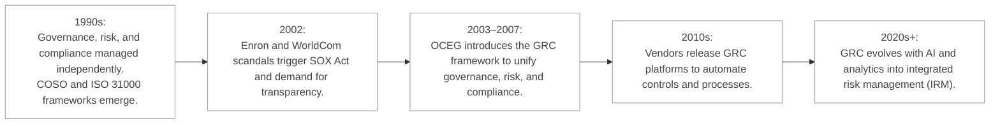
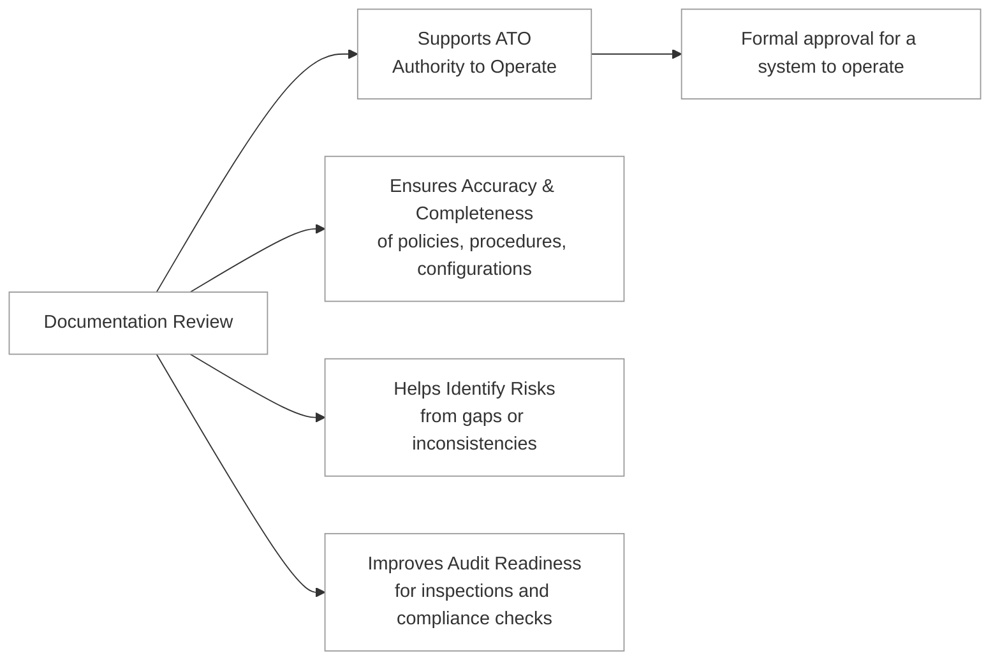
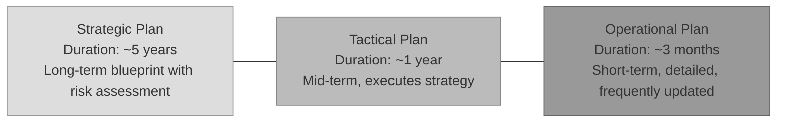
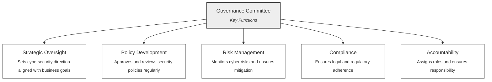

Security governance is the name commonly given to the  framework of practices and processes through which an organization plans, supports, evaluates, and manages its security efforts. 
Closely aligned with corporate and IT governance, it ensures that security initiatives are integrated into the broader goals of the organization. 
Effective security governance requires a holistic approach, embedding security into every aspect of the organization’s operations and aligning it with legislative, regulatory, and compliance requirements.

:necktie: Security must be baked in your company: in its software, processes, policies, departments and personnel.

:bulb: “GRC is the integrated collection of capabilities that enable an organization to reliably achieve objectives, address uncertainty, and act with integrity.”

GRC includes:

- Governance: Ensuring that organizational activities support the business goals.

- Risk : Identifying, analyzing, and addressing risks that could interfere with operations.

- Compliance: Adhering to laws, regulations, and internal policies.

Below you can find a short timeline of GRC:

**Third-party governance** refers to the oversight and management of external entities that interact with an organization. This includes vendors, contractors, partners, and service providers who access or handle sensitive data or systems. Third-party governance is critical because these entities often introduce additional risks that can impact the organization’s security.
Key aspects of third-party governance include:

- Risk Assessments: Evaluating the security measures and risks associated with third-party entities.
- Service Level Agreements (SLAs): Clearly defining security expectations and responsibilities.
- Continuous Monitoring: Ensuring that third-party compliance with security requirements is maintained over time.

Without robust third-party governance, an organization’s security can be undermined by vulnerabilities in its external partnerships.

**Documentation review** is a critical component of security governance, especially in the context of obtaining an **Authority to Operate (ATO)**. An ATO is a formal declaration that an information system is approved to operate within a specific environment, often required in government or highly regulated industries. Documentation review usually ensures:
- Accuracy and Completeness: Policies, procedures, and system configurations must be thoroughly documented to demonstrate compliance.
- Risk Identification: Gaps or inconsistencies in documentation can reveal potential vulnerabilities.
- Audit Readiness: Comprehensive documentation facilitates audits and inspections by regulatory bodies.

By conducting regular documentation reviews, organizations can validate that their security measures are effective and aligned with compliance requirements.

### Open Questions ###
1. How does security governance relate to an organization's overall goals?

  
Show answer

Security governance aligns security initiatives with broader organizational goals, ensuring security efforts contribute to overall success.

2. Why is it crucial to integrate security into various aspects of a company, including software, processes, and personnel?

  
Show answer

Integrating security into various facets creates a comprehensive and robust security posture, minimizing vulnerabilities across different areas.

3. Provide an example of how external factors influence an organization's security governance.

  
Show answer

Laws like GDPR or industry-specific regulations like HIPAA directly shape security governance by mandating specific security practices and controls.

4. What is the significance of third-party governance in maintaining an organization's security posture?

  
Show answer

Third-party governance addresses the risks introduced by external entities, ensuring they meet the organization's security standards and don't compromise its security.

5. Explain the purpose of conducting risk assessments in the context of third-party governance.

  
Show answer

Risk assessments in third-party governance identify potential vulnerabilities and security gaps associated with third-party entities, informing mitigation strategies.

6. What role do Service Level Agreements (SLAs) play in third-party governance?

  
Show answer

SLAs define clear security expectations and responsibilities for both the organization and the third party, establishing a contractual framework for security management.

7. Why is continuous monitoring of third parties essential for effective security governance?

  
Show answer

Continuous monitoring ensures that third parties consistently adhere to security requirements, even as circumstances and risks evolve over time.

8. What is an Authority to Operate (ATO), and in what situations is it typically required?

  
Show answer

An ATO is a formal authorization to operate an information system within a defined environment, typically required in government and highly regulated sectors to ensure security compliance.

9. How does documentation review contribute to ensuring the effectiveness of security measures?

  
Show answer

Documentation review verifies the accuracy and completeness of security policies, procedures, and configurations, identifying potential gaps or inconsistencies.

10. Why is audit readiness an important consideration in security governance?

  
  
Show answer

Audit readiness ensures an organization can readily demonstrate compliance with security regulations and standards during audits and inspections.

---
## 1.3.1 Alignment of the security function to business strategy, goals, mission, and objectives ##

**Security management planning** ensures the proper development, implementation, and enforcement of a security policy, aligning security functions with the organization's strategy, goals, mission, and objectives. This process involves crafting and deploying security measures based on factors such as business cases, budget constraints, and resource availability. Employing a **top-down approach** is often the most effective method for security management planning, with upper management taking the lead in initiating and defining organizational policies. These policies serve as guiding principles for all levels of the organizational hierarchy. Middle management is tasked with refining the security policy into standards, baselines, guidelines, and procedures. Operational managers or security professionals then execute the configurations outlined in the security management documentation, while end users are responsible for adhering to all organizational security policies.

:necktie: A top-down approach in information security helps establish a culture of security from the highest levels of the organization down to individual employees, fostering a comprehensive and proactive approach to safeguarding sensitive information and assets.

The **Strategic Plan** serves as a durable, long-term blueprint that articulates the organization's security purpose, aligning it with the overarching goals, mission, and objectives. With a typical lifespan of approximately five years, contingent upon annual maintenance and updates, it remains a crucial framework for guiding security initiatives and includes a comprehensive risk assessment.

In contrast, the **Tactical Plan**, a mid-term strategy, furnishes details on achieving the objectives outlined in the Strategic Plan or can be formulated ad hoc in response to unforeseen circumstances. Typically viable for about a year, it provides a focused approach to executing the broader strategic vision.

The **Operational Plan**, on the other hand, constitutes a short-term, meticulously delineated strategy derived from the Strategic and Tactical Plans. Although its relevance is fleeting, necessitating frequent updates (monthly or quarterly), it serves as the cornerstone for operational activities, ensuring alignment with tactical objectives.

:necktie: Hierarchies play a crucial role in the CISSP approach, remember that plans, roles, documentation, and clearance levels must be appropriately structured and aligned within the organization chart.

Scoping and tailoring are employed to align security objectives with organizational goals:
**Scoping** is a process review of a list of security baseline controls and selecting only those controls that apply to the IT system you're trying to protect.
**Tailoring** refers to modifying the list of security controls within a baseline to align with the organization mission.

:link: The G20/OECD Principles of Corporate Governance help policy makers evaluate and improve the legal, regulatory and institutional framework for corporate governance. They identify the key building blocks for a sound corporate governance framework and offer practical guidance for implementation at the national level: [G20/OECD Principles of Corporate Governance 2023
](https://www.oecd.org/publications/g20-oecd-principles-of-corporate-governance-2023-ed750b30-en.htm)

### Open Questions ###
1. Describe the key difference between the Strategic Plan and the Tactical Plan in security management.

  
Show answer

The Strategic Plan is a long-term blueprint outlining the organization's overall security goals, while the Tactical Plan focuses on the mid-term and provides specific details on how to achieve the objectives set forth in the Strategic Plan.

2. Explain the role of middle management in the top-down approach to security management.

  
Show answer

Middle management translates the high-level security policy set by upper management into specific standards, baselines, guidelines, and procedures that can be implemented by operational staff.

3. What is the purpose of scoping and tailoring in information security?

  
Show answer

Scoping and tailoring ensure that security controls are relevant and efficient. Scoping selects only necessary controls, while tailoring modifies them to align with the organization's specific mission and risk profile.

4. How does the Operational Plan relate to the Strategic and Tactical Plans?

  
Show answer

The Operational Plan is a short-term, actionable plan derived from the Strategic and Tactical Plans. It focuses on the day-to-day operations necessary to achieve the objectives outlined in the higher-level plans.

5. Why is a top-down approach considered effective in establishing a culture of security within an organization?

  
Show answer

A top-down approach ensures that security is a priority for leadership, which sets a clear tone and expectation for the entire organization. This fosters a proactive security culture where everyone understands their role in protecting sensitive information.

6. Who is ultimately responsible for adhering to organizational security policies in a top-down approach?

  
Show answer

Ultimately, all members of the organization, including end-users, are responsible for adhering to the established security policies in a top-down approach.

7. Why are hierarchies considered crucial in the CISSP approach to security management?

  
Show answer

Hierarchies ensure clear lines of responsibility and accountability. They define the roles and permissions related to security management, planning, documentation, and clearance levels, contributing to a well-structured and manageable security framework.

---

## 1.3.2 Organizational processes (e.g., acquisitions, divestitures, governance committees) ##

Security governance is vital for organizations to address various aspects, including acquisitions, divestitures, and governance committees. 
In an **acquisition**, a company purchases another company's assets, resulting in the acquired company's dissolution. The acquiring company may choose to retain the acquired business's name. Conversely, in a **merger**, two companies combine assets to establish a new entity. Mergers are common when both companies possess comparable influence and scale. **Divestiture** involves either fully or partially selling off a product line, business unit, division, or subsidiary. It's often viewed as a preferred growth strategy over diversification, involving the complete or partial transfer of assets, personnel, facilities, and inventory. The primary goal of divestiture is to discontinue a business segment, freeing up resources for more advantageous and profitable ventures.

Let's explore how these processes intersect with cybersecurity measures:

Acquisitions and Mergers: Acquisitions and mergers introduce heightened risks such as information disclosure, data loss, and downtime. Without proper security considerations, the risks associated with obtained products persist throughout their deployment lifecycle. To mitigate these risks, it's essential to conduct thorough evaluations and integrate security assessments during the acquisition process.

Divestitures: Divestitures involve selling off parts of an organization, necessitating stringent security measures to prevent data leakage and maintain confidentiality. Cybersecurity professionals must collaborate closely with business and legal teams to identify and mitigate potential vulnerabilities. Additionally, segmenting the Information Security Management System (ISMS) ensures compliance without revealing sensitive information during audits.

When assessing a third party for security integration, take into account the following procedures as effective chances to evaluate the 3rd party:
1. Conduct an On-Site Assessment: Visit the organization's premises to conduct interviews with staff and observe their operational practices.
2. Review Document Exchange: Investigate how data and documents are exchanged, along with the formal procedures for conducting assessments and reviews.
3. Review Processes and Policies: Request copies of security policies, processes, procedures, as well as documentation of incidents and responses for thorough examination.
4. Third-Party Audit: Engage an independent third-party auditor, accredited by the American Institute of Certified Public Accountants (AICPA), to conduct an impartial review of the entity's security infrastructure based on Service Organization Control (SOC) reports.

**System and Organization Controls (SOC)** reports are independent audit reports that evaluate the security, availability, and compliance of an organization’s systems, particularly cloud service providers and third-party vendors. These reports are critical in risk management, vendor assessments, and regulatory compliance.
There are three main types of SOC reports, each serving different purposes:

**SOC 1: Financial Reporting Controls**
- Purpose: Evaluates controls related to financial transactions and reporting.
- Audience: Accounting and finance teams, auditors, and companies relying on a vendor for financial processing (e.g., payroll, accounting systems).
- Example: A payroll processing service undergoes a SOC 1 audit to prove its system properly calculates and processes salaries without errors.

**SOC 2: Security, Availability, and Privacy Controls**
- Purpose: Focuses on security, availability, processing integrity, confidentiality, and privacy of data (based on the AICPA Trust Services Criteria).
- Audience: IT, cybersecurity, and compliance teams evaluating third-party vendors.
- Types:
SOC 2 Type I: Evaluates security controls at a single point in time (design effectiveness).
SOC 2 Type II: Evaluates controls over a longer period (3-12 months) to verify operational effectiveness.
- Example: A cloud service provider (e.g., AWS, Google Cloud) undergoes a SOC 2 audit to prove it secures customer data properly.

**SOC 3: Publicly Available SOC 2 Report**
- Purpose: A high-level summary of SOC 2 findings, meant for public distribution.
- Audience: Potential customers and stakeholders who want to confirm a company’s security posture without seeing detailed audit results.
- Example: A SaaS company publishes a SOC 3 report on its website to reassure customers about its security compliance.

SOC reports are a crucial part of third-party risk management and compliance.

| SOC Type  | Purpose                                                                                     | Audience                                                                                           | Types (if any)                                               | Example                                                                                              |
|-----------|---------------------------------------------------------------------------------------------|----------------------------------------------------------------------------------------------------|---------------------------------------------------------------|------------------------------------------------------------------------------------------------------|
| SOC 1     | Evaluates controls related to financial transactions and reporting.                         | Accounting and finance teams, auditors, and companies relying on a vendor for financial processing | –                                                             | A payroll processing service undergoes a SOC 1 audit to prove its system properly calculates salaries. |
| SOC 2     | Focuses on security, availability, processing integrity, confidentiality, and privacy of data (AICPA Trust Services Criteria). | IT, cybersecurity, and compliance teams evaluating third-party vendors                             | Type I: Design effectiveness at a point in time    Type II: Operational effectiveness over time | A cloud provider undergoes a SOC 2 audit to prove it secures customer data properly.                  |
| SOC 3     | High-level summary of SOC 2 findings for public distribution.                               | Potential customers and stakeholders                                                                | –                                                             | A SaaS company publishes a SOC 3 report online to reassure customers about its security compliance.  |

:link: In its Service Trust Portal Microsoft explains how its cloud services protect your data, and how you can manage cloud data security and compliance for your organization. You can find all available reports (included SOC reports) here: https://servicetrust.microsoft.com/

:bulb: **Audit the auditor:** You are accountable to verify the credibility and integrity of those responsible for evaluating or assessing your organization's activities, processes, or compliance.

There are two more important concepts to understand when talking about organizational processes: business enablement and process enhancement.
Business Enablement refers to the process of empowering an organization to take on new opportunities, markets, or capabilities. It involves leveraging technology, innovation, or strategic changes to open new possibilities. This concept goes beyond optimizing existing operations; it creates value by enabling activities or services that were previously out of reach.
Process Enhancement refers to improving existing processes to increase efficiency, reduce waste, and enhance the quality of outcomes. This typically involves process re-engineering—redesigning workflows, systems, or operations to achieve better performance.

| Category     | Business Enablement                          | Process Enhancement                        |
|--------------|-----------------------------------------------|---------------------------------------------|
| **Objective**| Create new opportunities and capabilities     | Improve existing operations                 |
| **Focus**    | Innovation and new value creation             | Optimization and efficiency                 |
| **Approach** | Strategic and forward-looking                 | Tactical and performance-oriented           |
| **Examples** | Entering a new market   Launching new tech | Automating workflows   Reducing waste    |
| **Outcome**  | Expands business horizons                     | Boosts competitiveness and margins          |

Governance committees play a crucial role in overseeing organizational structures and practices (also during mergers, acquisition and divestitures). A governance committee is a group of stakeholders responsible for overseeing an organization's cybersecurity strategy, policies, and compliance. It ensures that cybersecurity efforts align with the organization's goals, risk appetite, and regulatory requirements.
Key Functions of a Governance Committee are usually:
- Strategic Oversight: Sets the direction for cybersecurity initiatives, ensuring they support business objectives.
- Policy Development: Approves and reviews security policies and ensures they are updated regularly.
- Risk Management: Monitors cybersecurity risks and ensures appropriate mitigation measures are in place.
- Compliance: Ensures adherence to regulatory and legal requirements for cybersecurity.
- Accountability: Assigns roles and responsibilities for cybersecurity and holds teams accountable for implementation and performance.

Who Typically Participates in a governance committee:
- Senior executives (e.g., CIO, CISO, or CTO)
- Legal and compliance officers
- Risk management professionals
- Representatives from business units
- Board members in larger organizations
- Governance committees provide valuable insights and recommendations to ensure a secure environment. Collaborating with governance committees enhances transparency and accountability in security governance processes.

:necktie: A governance committee is more likely to be present in companies that face high risks, regulatory pressures, or operational complexity. It reflects a mature and proactive approach to cybersecurity management.

SABSA (Sherwood Applied Business Security Architecture) is a framework and methodology used to develop a risk-driven, business-aligned enterprise security architecture. It focuses on integrating security into business processes by linking security solutions directly to business goals, risks, and requirements.
The framework is structured around six layers, starting from Business Requirements and cascading down to Operational Security Controls. It uses a matrix approach, and emphasizes aligning security strategies with business objectives through its lifecycle phases: Strategy and Planning, Design, Implementation, and Management.
The following table summarizes the SABSA model’s core structure:

| Layer                  | Focus                                 | Key Question                  | Output                                         |
|------------------------|----------------------------------------|-------------------------------|------------------------------------------------|
| **Business Requirements** | Business goals and drivers             | What are the business needs?  | Business goals, risks, and objectives          |
| **Security Conceptual**   | Security strategies to meet business goals | What needs to be secured?     | Security architecture aligned to business      |
| **Logical Architecture**  | Security services and functions         | How should it be secured?     | Security policies and service definitions      |
| **Physical Architecture** | Technology and infrastructure design    | With what resources?          | Security solutions and tools                   |
| **Component Architecture**| System-specific implementations         | How is it implemented?        | Technology configurations and integration      |
| **Operational Architecture**| Management and operations             | How is it managed?            | Processes, monitoring, and response plans      |

:link: The Sabsa site  https://sabsa.org/ provides resources, training, certification, and information about the SABSA framework, a methodology for creating risk-driven, business-aligned security architectures.

### Open Questions ###
1. Differentiate between acquisitions and mergers in the context of business operations.

  
Show answer

An acquisition involves one company purchasing another, leading to the acquired company's dissolution. In contrast, a merger combines two companies' assets to create a new entity, typically when both companies have comparable influence and size.

2. Explain the primary objective of divestiture and why it is often preferred over diversification.

  
Show answer

Divestiture aims to discontinue a business segment by selling it off entirely or partially. This frees up resources for more profitable and strategic ventures. It is often favored over diversification because it allows companies to focus on core competencies and streamline operations.

3. How do acquisitions and mergers pose cybersecurity risks? Provide specific examples.

  
Show answer

Acquisitions and mergers introduce risks like information disclosure, data loss, and downtime. For example, integrating disparate IT systems can create vulnerabilities, and employee layoffs or changes in access control can lead to data breaches.

4. Why is stringent cybersecurity crucial during divestitures?

  
Show answer

During divestitures, safeguarding sensitive data and maintaining confidentiality are paramount. Failure to implement robust cybersecurity measures can result in data leakage to competitors or unauthorized parties, damaging reputation and incurring legal liabilities.

5. What are the key steps to consider when evaluating a third party for security integration?

  
Show answer

Key steps include conducting on-site assessments, reviewing document exchange protocols, examining security policies and incident response documentation, and engaging an independent third-party auditor for a comprehensive review.

6. What does "Audit the auditor" mean in the context of third-party security assessments?

  
Show answer

"Audit the auditor" emphasizes the need to verify the credibility and integrity of the third-party auditor responsible for assessing your organization's security posture. This ensures the objectivity and reliability of the assessment findings.

7. Distinguish between business enablement and process enhancement.

  
Show answer

Business enablement focuses on leveraging technology and innovation to unlock new opportunities and capabilities. It goes beyond optimizing existing processes and aims to create new value propositions. Conversely, process enhancement involves improving existing processes to increase efficiency and quality of outcomes.

8. What is a governance committee in the realm of cybersecurity?

  
Show answer

A governance committee in cybersecurity is a group of stakeholders responsible for overseeing an organization's cybersecurity strategy, policies, and compliance. They ensure that cybersecurity efforts align with business goals, risk appetite, and regulatory requirements.

9. List three key functions of a cybersecurity governance committee.

  
Show answer

Three key functions are: (1) Strategic Oversight: setting the direction for cybersecurity initiatives; (2) Risk Management: monitoring cybersecurity risks and ensuring appropriate mitigation measures; (3) Compliance: ensuring adherence to regulatory and legal cybersecurity requirements.

10. Describe the SABSA framework and its primary focus.

  
  
Show answer

The SABSA (Sherwood Applied Business Security Architecture) framework provides a structured methodology for developing a risk-driven, business-aligned enterprise security architecture. It focuses on integrating security into business processes by directly linking security solutions to business goals, risks, and requirements.

