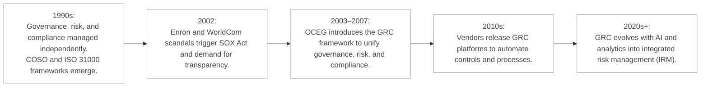
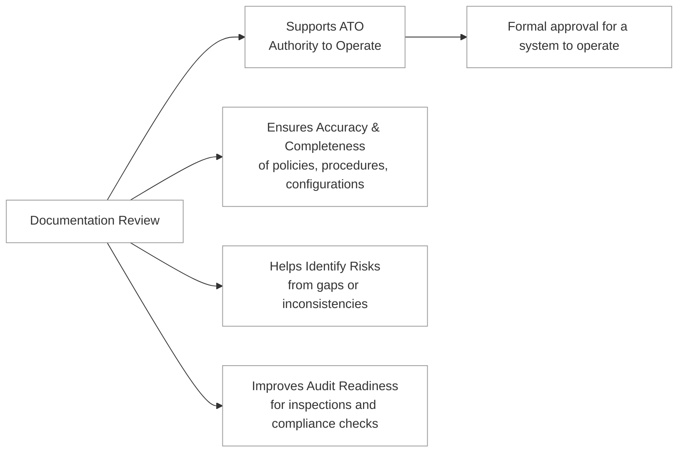

Security governance is the name commonly given to the  framework of practices and processes through which an organization plans, supports, evaluates, and manages its security efforts. 
Closely aligned with corporate and IT governance, it ensures that security initiatives are integrated into the broader goals of the organization. 
Effective security governance requires a holistic approach, embedding security into every aspect of the organization’s operations and aligning it with legislative, regulatory, and compliance requirements.

:necktie: Security must be baked in your company: in its software, processes, policies, departments and personnel.

:bulb: “GRC is the integrated collection of capabilities that enable an organization to reliably achieve objectives, address uncertainty, and act with integrity.”

GRC includes:

- Governance: Ensuring that organizational activities support the business goals.

- Risk : Identifying, analyzing, and addressing risks that could interfere with operations.

- Compliance: Adhering to laws, regulations, and internal policies.

Below you can find a short timeline of GRC:

**Third-party governance** refers to the oversight and management of external entities that interact with an organization. This includes vendors, contractors, partners, and service providers who access or handle sensitive data or systems. Third-party governance is critical because these entities often introduce additional risks that can impact the organization’s security.
Key aspects of third-party governance include:

- Risk Assessments: Evaluating the security measures and risks associated with third-party entities.
- Service Level Agreements (SLAs): Clearly defining security expectations and responsibilities.
- Continuous Monitoring: Ensuring that third-party compliance with security requirements is maintained over time.

Without robust third-party governance, an organization’s security can be undermined by vulnerabilities in its external partnerships.

**Documentation review** is a critical component of security governance, especially in the context of obtaining an **Authority to Operate (ATO)**. An ATO is a formal declaration that an information system is approved to operate within a specific environment, often required in government or highly regulated industries. Documentation review usually ensures:
- Accuracy and Completeness: Policies, procedures, and system configurations must be thoroughly documented to demonstrate compliance.
- Risk Identification: Gaps or inconsistencies in documentation can reveal potential vulnerabilities.
- Audit Readiness: Comprehensive documentation facilitates audits and inspections by regulatory bodies.

By conducting regular documentation reviews, organizations can validate that their security measures are effective and aligned with compliance requirements.

### Open Questions ###
1. How does security governance relate to an organization's overall goals?

  
Show answer

Security governance aligns security initiatives with broader organizational goals, ensuring security efforts contribute to overall success.

2. Why is it crucial to integrate security into various aspects of a company, including software, processes, and personnel?

  
Show answer

Integrating security into various facets creates a comprehensive and robust security posture, minimizing vulnerabilities across different areas.

3. Provide an example of how external factors influence an organization's security governance.

  
Show answer

Laws like GDPR or industry-specific regulations like HIPAA directly shape security governance by mandating specific security practices and controls.

4. What is the significance of third-party governance in maintaining an organization's security posture?

  
Show answer

Third-party governance addresses the risks introduced by external entities, ensuring they meet the organization's security standards and don't compromise its security.

5. Explain the purpose of conducting risk assessments in the context of third-party governance.

  
Show answer

Risk assessments in third-party governance identify potential vulnerabilities and security gaps associated with third-party entities, informing mitigation strategies.

6. What role do Service Level Agreements (SLAs) play in third-party governance?

  
Show answer

SLAs define clear security expectations and responsibilities for both the organization and the third party, establishing a contractual framework for security management.

7. Why is continuous monitoring of third parties essential for effective security governance?

  
Show answer

Continuous monitoring ensures that third parties consistently adhere to security requirements, even as circumstances and risks evolve over time.

8. What is an Authority to Operate (ATO), and in what situations is it typically required?

  
Show answer

An ATO is a formal authorization to operate an information system within a defined environment, typically required in government and highly regulated sectors to ensure security compliance.

9. How does documentation review contribute to ensuring the effectiveness of security measures?

  
Show answer

Documentation review verifies the accuracy and completeness of security policies, procedures, and configurations, identifying potential gaps or inconsistencies.

10. Why is audit readiness an important consideration in security governance?

  
  
Show answer

Audit readiness ensures an organization can readily demonstrate compliance with security regulations and standards during audits and inspections.

