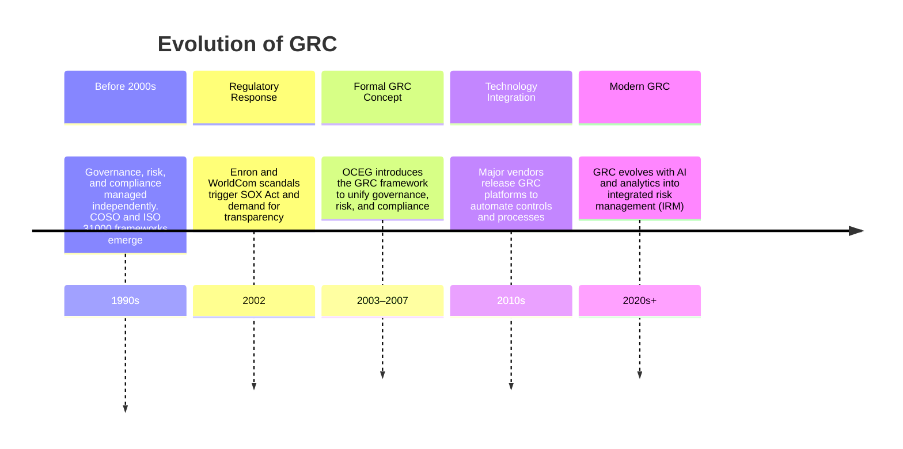

Security governance is the name commonly given to the  framework of practices and processes through which an organization plans, supports, evaluates, and manages its security efforts. 
Closely aligned with corporate and IT governance, it ensures that security initiatives are integrated into the broader goals of the organization. 
Effective security governance requires a holistic approach, embedding security into every aspect of the organization’s operations and aligning it with legislative, regulatory, and compliance requirements.

:necktie: Security must be baked in your company: in its software, processes, policies, departments and personnel.

:bulb: “GRC is the integrated collection of capabilities that enable an organization to reliably achieve objectives, address uncertainty, and act with integrity.”

GRC includes:

- Governance: Ensuring that organizational activities support the business goals.

- Risk : Identifying, analyzing, and addressing risks that could interfere with operations.

- Compliance: Adhering to laws, regulations, and internal policies.

**Third-party governance** refers to the oversight and management of external entities that interact with an organization. This includes vendors, contractors, partners, and service providers who access or handle sensitive data or systems. Third-party governance is critical because these entities often introduce additional risks that can impact the organization’s security.
Key aspects of third-party governance include:

- Risk Assessments: Evaluating the security measures and risks associated with third-party entities.
- Service Level Agreements (SLAs): Clearly defining security expectations and responsibilities.
- Continuous Monitoring: Ensuring that third-party compliance with security requirements is maintained over time.

Without robust third-party governance, an organization’s security can be undermined by vulnerabilities in its external partnerships.

**Documentation review** is a critical component of security governance, especially in the context of obtaining an **Authority to Operate (ATO)**. An ATO is a formal declaration that an information system is approved to operate within a specific environment, often required in government or highly regulated industries. Documentation review usually ensures:
- Accuracy and Completeness: Policies, procedures, and system configurations must be thoroughly documented to demonstrate compliance.
- Risk Identification: Gaps or inconsistencies in documentation can reveal potential vulnerabilities.
- Audit Readiness: Comprehensive documentation facilitates audits and inspections by regulatory bodies.

By conducting regular documentation reviews, organizations can validate that their security measures are effective and aligned with compliance requirements.

