An investigation will vary based on incident type. As an example, for a financial services company, a financial system compromise might cause a regulatory investigation. A system breach or website compromise might cause a criminal investigation. Each type of investigation has special considerations:

- **Administrative**: An administrative investigation has a primary purpose of providing the appropriate authorities with incident information. Thereafter, the authorities will determine the proper action, if any. Administrative investigations are often tied to HR scenarios, such as when a manager has been accused of improprieties.

- **Criminal**: A criminal investigation occurs when a crime has been committed and you are working with a law enforcement agency to convict the alleged perpetrator. In such a case, it is common to gather evidence for a court of law, and to share the evidence with the defense. Therefore, you need to gather and handle the information using methods that ensure the evidence can be used in court. Remember that in a criminal case, a suspect must be proven guilty beyond a reasonable doubt. This is more difficult than showing a preponderance of evidence, which is often the standard in a civil case.

- **Civil**: In a civil case, one person or entity sues another. For example, one company might sue another for a trademark violation. A civil case is typically about monetary damages, and doesn't involve criminality. In a civil case, a preponderance of evidence is required to secure a victory. This differs from criminal cases, where a suspect is innocent until proven guilty beyond a reasonable doubt.

- **Industry Standards**: An industry standards investigation is intended to determine whether an organization is adhering to a specific industry standard or set of standards, such as logging and auditing failed logon attempts. Because industry standards represent well-understood and widely implemented best practices, many organizations try to adhere to them even when they are not required to do so in order to improve security, and reduce operational and other risks.

- **Regulatory**: A regulatory investigation is conducted by a regulatory body, such as the Securities and Exchange Commission (SEC) or Financial Industry Regulatory Authority (FINRA), against an organization suspected of an infraction. In such cases, the organization is required to comply with the investigation, for example, by not hiding or destroying evidence.

```mermaid 
flowchart TD
    A[Types of Investigations]:::center

    A --> B1[Administrative]:::type
    A --> B2[Criminal]:::type
    A --> B3[Civil]:::type
    A --> B4[Industry Standards]:::type
    A --> B5[Regulatory]:::type

    B1 --> D1["Purpose: Inform authorities, often HR-related"]:::desc
    B1 --> D2["Triggered by: Internal issues (e.g., manager misconduct)"]:::desc

    B2 --> D3["Purpose: Convict perpetrator through court system"]:::desc
    B2 --> D4["Standard: Beyond reasonable doubt"]:::desc
    B2 --> D5["Evidence: Must be court-admissible and shareable with defense"]:::desc

    B3 --> D6["Purpose: Resolve disputes over damages or rights"]:::desc
    B3 --> D7["Example: Trademark or contract disputes"]:::desc
    B3 --> D8["Standard: Preponderance of evidence"]:::desc

    B4 --> D9["Purpose: Check adherence to best practices (e.g., logging failures)"]:::desc
    B4 --> D10["Often voluntary but beneficial for reducing risks"]:::desc

    B5 --> D11["Conducted by: Regulatory bodies (e.g., SEC, FINRA)"]:::desc
    B5 --> D12["Obligations: Must comply; can't destroy or hide evidence"]:::desc

    classDef center fill:#ffffff,color:#000000,stroke:#000000,stroke-width:1px,font-weight:bold
    classDef node fill:#e0e0e0,color:#000000,stroke:#000000,stroke-width:1px
```

:bulb: To practice, create a consolidated table by combining the information from this paragraph and [(#1.4.6 Contractual, legal, industry standards, and regulatory requirements)](https://github.com/lorenzoleonelli/CISSP-Zero-to-Hero/blob/main/DOMAIN1%3A%20The%20Cybersecurity%20Manager/1.4%20Understand%20legal%2C%20regulatory%2C%20and%20compliance%20issues%20that%20pertain%20to%20information%20security%20in%20a%20holistic%20context.md#146-contractual-legal-industry-standards-and-regulatory-requirements)
