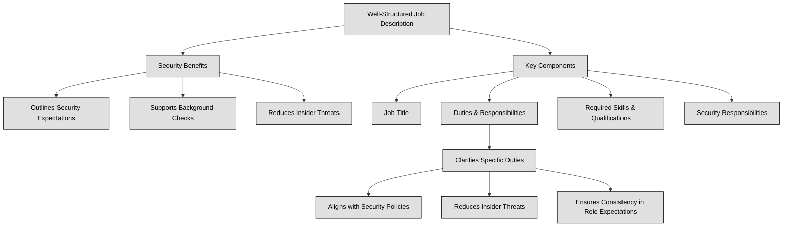

## 1.8 Contribute to and enforce personnel security policies and procedures ##

People are frequently perceived as the weakest link in any security framework. Regardless of the implementation of physical or logical controls, individuals can find ways to bypass, circumvent, or undermine them, or even disable them. Malicious actors regularly target users through phishing and spear phishing campaigns, social engineering, and various other forms of attacks. No one is immune to these threats. Once attackers gain access to an account, they can exploit it to traverse the network and escalate their privileges. However, with proper training and motivation, individuals can also serve as a crucial security asset, actively safeguarding not only their own interests but also those of the organization. Additionally, advancements in AI have minimized the gap between humans and computers, further influencing security dynamics (in future it won’t be possible anymore to define people as the weakest link in a security framework).
Ensuring security starts before an employee even joins an organization. During the hiring process, it's crucial to define clear job descriptions and responsibilities to align expectations and minimize security risks.
A well-structured job description helps:
- Outline security expectations – Candidates understand their role in protecting sensitive information.
- Support background checks – Helps verify if a candidate’s experience and trustworthiness align with security needs.
- Reduce insider threats – By ensuring only qualified, security-aware individuals take on critical roles.

A well-defined job description should include:
- Job Title – Clearly identifies the role.
- Duties & Responsibilities – Lists specific tasks and expectations.
- Required Skills & Qualifications – Specifies expertise needed.
- Security Responsibilities – Defines how the role interacts with security policies.

**Job responsibilities** define the specific duties, tasks, and expectations assigned to a particular role within an organization. These responsibilities are crucial because they clarify what an employee is expected to do and, in a security context, help determine the level of access they should have to sensitive systems and data.
Including job responsibilities in the job description ensures:
- Alignment with Security Policies – Employees understand their role in protecting data and following cybersecurity protocols.
- Reduced Risk of Insider Threats – Clearly defined duties prevent unauthorized activities.
- Consistency in Role Expectations – Everyone understands who is responsible for what.

