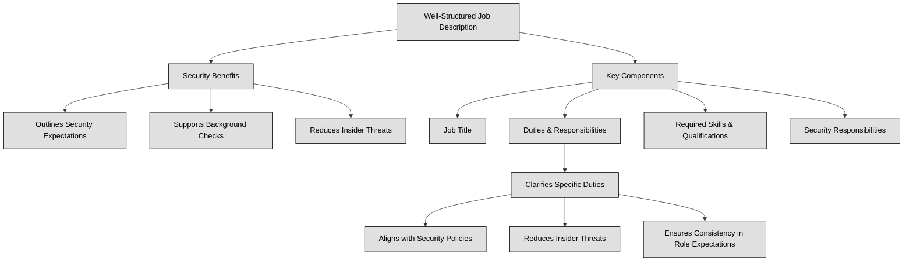

## 1.8 Contribute to and enforce personnel security policies and procedures ##

People are frequently perceived as the weakest link in any security framework. Regardless of the implementation of physical or logical controls, individuals can find ways to bypass, circumvent, or undermine them, or even disable them. Malicious actors regularly target users through phishing and spear phishing campaigns, social engineering, and various other forms of attacks. Phishing is a broad scam where attackers pose as trustworthy entities—often via email, text, or website—to trick individuals into revealing sensitive info like passwords or financial details. Spear phishing, on the other hand, is a highly targeted form of phishing: attackers research a specific individual or group and craft personalized messages that appear to come from someone they know or trust, dramatically increasing the success rate.

No one is immune to these threats. Once attackers gain access to an account, they can exploit it to traverse the network and escalate their privileges. However, with proper training and motivation, individuals can also serve as a crucial security asset, actively safeguarding not only their own interests but also those of the organization. Additionally, advancements in AI have minimized the gap between humans and computers, further influencing security dynamics (in future it won’t be possible anymore to define people as the weakest link in a security framework).
Ensuring security starts before an employee even joins an organization. During the hiring process, it's crucial to define clear job descriptions and responsibilities to align expectations and minimize security risks.
A well-structured job description helps:
- Outline security expectations – Candidates understand their role in protecting sensitive information.
- Support background checks – Helps verify if a candidate’s experience and trustworthiness align with security needs.
- Reduce insider threats – By ensuring only qualified, security-aware individuals take on critical roles.

A well-defined job description should include:
- Job Title – Clearly identifies the role.
- Duties & Responsibilities – Lists specific tasks and expectations.
- Required Skills & Qualifications – Specifies expertise needed.
- Security Responsibilities – Defines how the role interacts with security policies.

**Job responsibilities** define the specific duties, tasks, and expectations assigned to a particular role within an organization. These responsibilities are crucial because they clarify what an employee is expected to do and, in a security context, help determine the level of access they should have to sensitive systems and data.
Including job responsibilities in the job description ensures:
- Alignment with Security Policies – Employees understand their role in protecting data and following cybersecurity protocols.
- Reduced Risk of Insider Threats – Clearly defined duties prevent unauthorized activities.
- Consistency in Role Expectations – Everyone understands who is responsible for what.



:necktie: Never refer to personnel as the weakest link in your security chain, as this can demotivate them. Instead, empower them by emphasizing that the organization's security relies on their efforts and vigilance.

:brain: Individuals represent both the most vulnerable point in your information security chain and the most critical asset to safeguard during a security incident.

### Open Questions ###
1. Explain why individuals are often considered the weakest link in security.
<details>
  <summary>Show answer</summary>
Individuals are often considered the weakest link due to susceptibility to social engineering, phishing attacks, and errors in judgment. They can unintentionally bypass security protocols or fall victim to manipulation, providing attackers with entry points.
</details>

2. Describe two common social engineering techniques used to exploit human vulnerabilities.
<details>
  <summary>Show answer</summary>
Phishing: Deceptive emails or messages disguised as legitimate sources, aiming to trick recipients into revealing sensitive information or downloading malware. Baiting: Offering something desirable (e.g., free downloads, prizes) to lure individuals into compromising their security.
</details>

3. What is the difference between phishing and spear phishing attacks?
<details>
  <summary>Show answer</summary>
Phishing targets a wide audience with generic messages, while spear phishing is highly targeted, using personalized information to deceive specific individuals.
</details>

4. Explain the negative consequences of referring to personnel as "the weakest link."
<details>
  <summary>Show answer</summary>
Labeling personnel as "the weakest link" demotivates and creates a blame culture. It undermines their sense of responsibility, making them less likely to actively participate in security efforts.
</details>

5. Provide an example of how an individual can be a security asset.
<details>
  <summary>Show answer</summary>
An employee who is aware of phishing tactics, identifies a suspicious email, and reports it to the IT department prevents a potential security breach, demonstrating their value as a security asset.
</details>

---

## 1.8.1 Candidate screening and hiring ##

The introduction of new personnel poses a security risk; hence, every organization necessitates personnel security policies, standards, procedures, or guidelines to identify and alleviate this risk through appropriate security measures.These documents ought to detail job descriptions, classification, work tasks, responsibilities, collusion prevention, candidate screening, background checks, security clearances, employment agreements, and nondisclosure agreements. Thoroughly screening employment candidates is vital during the hiring process. Ensure to conduct comprehensive background checks encompassing criminal records, job history verification, education authentication, certification validation, and confirmation of other accolades whenever feasible. Furthermore, it is essential to contact some of the provided references.

:bulb: Thorough screening and in-depth interviews are essential to ensure that only suitable candidates are hired.

```
:necktie: When evaluating job candidates, organizations must operate within legal boundaries—some screening practices are permitted, while others may violate privacy laws and employment regulations.
**Permitted Screening Practices (Varies by jurisdiction):**
- Background checks (criminal history, employment verification)
- Reference checks (verifying previous work experience)
- Education verification
- Legally required security clearances (for specific roles)

**Restricted or Illegal Practices:**
- Discriminatory questions (race, religion, gender, marital status, etc.)
- Invasive personal data collection without consent
- Medical or genetic testing (unless legally justified)
```

👔Screening activities should match the **sensitivity and risk level of the job role**. Higher-risk positions (e.g., those handling confidential data or financial transactions) may require more in-depth background checks, while lower-risk roles need only basic verification.
