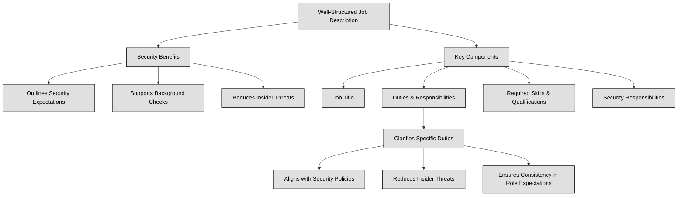

## 1.8 Contribute to and enforce personnel security policies and procedures ##

People are frequently perceived as the weakest link in any security framework. Regardless of the implementation of physical or logical controls, individuals can find ways to bypass, circumvent, or undermine them, or even disable them. Malicious actors regularly target users through phishing and spear phishing campaigns, social engineering, and various other forms of attacks. Phishing is a broad scam where attackers pose as trustworthy entities—often via email, text, or website—to trick individuals into revealing sensitive info like passwords or financial details. Spear phishing, on the other hand, is a highly targeted form of phishing: attackers research a specific individual or group and craft personalized messages that appear to come from someone they know or trust, dramatically increasing the success rate.

No one is immune to these threats. Once attackers gain access to an account, they can exploit it to traverse the network and escalate their privileges. However, with proper training and motivation, individuals can also serve as a crucial security asset, actively safeguarding not only their own interests but also those of the organization. Additionally, advancements in AI have minimized the gap between humans and computers, further influencing security dynamics (in future it won’t be possible anymore to define people as the weakest link in a security framework).
Ensuring security starts before an employee even joins an organization. During the hiring process, it's crucial to define clear job descriptions and responsibilities to align expectations and minimize security risks.
A well-structured job description helps:
- Outline security expectations – Candidates understand their role in protecting sensitive information.
- Support background checks – Helps verify if a candidate’s experience and trustworthiness align with security needs.
- Reduce insider threats – By ensuring only qualified, security-aware individuals take on critical roles.

A well-defined job description should include:
- Job Title – Clearly identifies the role.
- Duties & Responsibilities – Lists specific tasks and expectations.
- Required Skills & Qualifications – Specifies expertise needed.
- Security Responsibilities – Defines how the role interacts with security policies.

**Job responsibilities** define the specific duties, tasks, and expectations assigned to a particular role within an organization. These responsibilities are crucial because they clarify what an employee is expected to do and, in a security context, help determine the level of access they should have to sensitive systems and data.
Including job responsibilities in the job description ensures:
- Alignment with Security Policies – Employees understand their role in protecting data and following cybersecurity protocols.
- Reduced Risk of Insider Threats – Clearly defined duties prevent unauthorized activities.
- Consistency in Role Expectations – Everyone understands who is responsible for what.

:necktie: Never refer to personnel as the weakest link in your security chain, as this can demotivate them. Instead, empower them by emphasizing that the organization's security relies on their efforts and vigilance.

:brain: Individuals represent both the most vulnerable point in your information security chain and the most critical asset to safeguard during a security incident.

### Open Questions ###
1. Explain why individuals are often considered the weakest link in security.

  
Show answer

Individuals are often considered the weakest link due to susceptibility to social engineering, phishing attacks, and errors in judgment. They can unintentionally bypass security protocols or fall victim to manipulation, providing attackers with entry points.

2. Describe two common social engineering techniques used to exploit human vulnerabilities.

  
Show answer

Phishing: Deceptive emails or messages disguised as legitimate sources, aiming to trick recipients into revealing sensitive information or downloading malware. Baiting: Offering something desirable (e.g., free downloads, prizes) to lure individuals into compromising their security.

3. What is the difference between phishing and spear phishing attacks?

  
Show answer

Phishing targets a wide audience with generic messages, while spear phishing is highly targeted, using personalized information to deceive specific individuals.

4. Explain the negative consequences of referring to personnel as "the weakest link."

  
Show answer

Labeling personnel as "the weakest link" demotivates and creates a blame culture. It undermines their sense of responsibility, making them less likely to actively participate in security efforts.

5. Provide an example of how an individual can be a security asset.

  
Show answer

An employee who is aware of phishing tactics, identifies a suspicious email, and reports it to the IT department prevents a potential security breach, demonstrating their value as a security asset.

---

## 1.8.1 Candidate screening and hiring ##

The introduction of new personnel poses a security risk; hence, every organization necessitates personnel security policies, standards, procedures, or guidelines to identify and alleviate this risk through appropriate security measures.These documents ought to detail job descriptions, classification, work tasks, responsibilities, collusion prevention, candidate screening, background checks, security clearances, employment agreements, and nondisclosure agreements. Thoroughly screening employment candidates is vital during the hiring process. Ensure to conduct comprehensive background checks encompassing criminal records, job history verification, education authentication, certification validation, and confirmation of other accolades whenever feasible. Furthermore, it is essential to contact some of the provided references.

:bulb: Thorough screening and in-depth interviews are essential to ensure that only suitable candidates are hired.

:necktie: When evaluating job candidates, organizations must operate within legal boundaries—some screening practices are permitted, while others may violate privacy laws and employment regulations.
**Permitted Screening Practices (Varies by jurisdiction):**
- Background checks (criminal history, employment verification)
- Reference checks (verifying previous work experience)
- Education verification
- Legally required security clearances (for specific roles)

**Restricted or Illegal Practices:**
- Discriminatory questions (race, religion, gender, marital status, etc.)
- Invasive personal data collection without consent
- Medical or genetic testing (unless legally justified)

👔Screening activities should match the **sensitivity and risk level of the job role**. Higher-risk positions (e.g., those handling confidential data or financial transactions) may require more in-depth background checks, while lower-risk roles need only basic verification.

### Open Questions ###
1. Why are personnel security policies necessary for organizations?

  
Show answer

Personnel security policies are necessary to identify and mitigate the security risks posed by new employees. These policies outline procedures and guidelines for various security aspects related to personnel.

2. What are two key components that should be included in a job description from a security perspective?

  
Show answer

From a security perspective, a job description should clearly outline the tasks and responsibilities associated with the position, as well as the level of access to sensitive information the role entails. This helps determine the necessary security measures and clearances.

3. Explain the importance of collusion prevention within an organization.

  
Show answer

Collusion prevention strategies aim to prevent employees from working together to bypass security controls or commit fraud. This involves segregating duties, implementing checks and balances, and fostering a culture of accountability.

4. What is the purpose of a background check during the hiring process?

  
Show answer

Background checks help verify the information provided by a candidate and identify any potential red flags that could pose a security risk. This includes criminal history, employment history discrepancies, or fabricated credentials.

5. List three types of information that should be verified during a background check.

  
Show answer

Three types of information that should be verified during a background check are: criminal records, employment history, and education credentials. This ensures the candidate's claims are accurate and helps assess their trustworthiness.

6. Why is it important to contact references provided by a candidate?

  
Show answer

Contacting references allows employers to gain additional insights into the candidate's character, work ethic, and past performance. References can offer valuable information that may not be apparent from the candidate's application or interview.

7. What is a security clearance and why might it be required for certain positions?

  
Show answer

A security clearance is an official determination that an individual is eligible to access classified information. Certain positions involving sensitive data or national security may require specific clearance levels.

8. What is the purpose of an employment agreement?

  
Show answer

An employment agreement outlines the terms and conditions of employment, including salary, benefits, responsibilities, and grounds for termination. This legally binds both the employer and employee to the agreed upon terms.

9. What is a non-disclosure agreement and what does it typically cover?

  
Show answer

A non-disclosure agreement (NDA) is a legally binding contract that prohibits employees from disclosing confidential company information to unauthorized individuals. This protects sensitive data, trade secrets, and intellectual property.

10. Besides background checks, what other security measures can be taken during the hiring process?

  
Show answer

Other security measures during the hiring process can include conducting psychological evaluations, verifying professional licenses, drug testing, and providing security awareness training to new hires.

---

## 1.8.2 Employment agreements and policy driven requirements ##

An employment agreement outlines various aspects of employment, including job responsibilities, compensation, benefits, and termination details. In some cases, such agreements are for a specific duration, such as in contracts or short-term positions. They provide a structured framework for terminating underperforming employees when necessary. The comprehensiveness of an employment agreement correlates with decreased risks, such as the potential for wrongful termination lawsuits. For instance, clear policies regarding email retention can discourage terminated employees from inadvertently taking company data.
Example employment agreements include non-compete clauses, codes of conduct like an acceptable use policy (AUP) dictating proper use of company resources, and nondisclosure agreements (NDAs) safeguarding confidential information from disclosure by current or former employees. These agreements serve to protect both the organization's interests and the employees' rights and obligations.

Furthermore, policies centered on personnel are frequently reinforced by:
- Noncompete agreements (NCA).
- Ethical guideline and requirement questionnaires and agreements.
- Agreements and controls governing vendors, consultants, and contractors.

Throughout an employee’s tenure at an organization, implementing strong access control mechanisms is essential to reduce risks such as fraud, unauthorized actions, or policy violations. Organizations achieve this by enforcing policies that limit access, distribute responsibilities, and regularly change roles.

Some possible controls to mitigate Personnel related risks are:

1. **Separation of Duties (SoD)**
This principle ensures that no single individual has complete control over critical processes. By dividing responsibilities among multiple employees, organizations prevent any one person from having unchecked authority, reducing the risk of fraud or policy breaches. For example, in financial transactions, the employee who requests a payment should not be the same person who approves and processes it.

2. **Job Rotation**
By periodically rotating employees into different roles or responsibilities, organizations can prevent fraud and insider threats. When employees know that others will review their work after a certain period, it discourages misconduct. Additionally, job rotation helps in cross-training employees, making teams more resilient to unexpected absences.

3. **Least Privilege**
This security principle ensures that employees only receive the minimum level of access necessary to perform their tasks—no more, no less. By restricting access rights, organizations reduce the attack surface and limit the damage a compromised or malicious user can cause. For example, an entry-level IT support employee should not have administrative rights over an entire network.

4. **Need to Know**
Closely related to the principle of least privilege, "need to know" restricts access to sensitive or classified information based on job requirements. Employees are granted access only to the specific information they need to perform their roles. For example, a marketing manager does not need access to payroll data, just as a system administrator does not need to view confidential business contracts.

💡Understanding UBA & UEBA

What is **UBA (User Behavior Analytics)**?
UBA (User Behavior Analytics) is a security approach that analyzes patterns in user activities to detect anomalous or potentially malicious behavior. Instead of focusing on traditional security events like failed logins, UBA monitors how users normally interact with systems and flags deviations that may indicate insider threats, compromised accounts, or data exfiltration attempts.
Example: If an employee who typically accesses customer records during business hours suddenly starts downloading large amounts of data at midnight, UBA would flag this as unusual and potentially risky.

What is **UEBA (User and Entity Behavior Analytics)**?
UEBA (User and Entity Behavior Analytics) expands on UBA by including both user behavior and system entity behavior (such as servers, IoT devices, or applications). This provides a more comprehensive security approach, detecting threats that involve both human actions and automated systems.

Example: If a company server suddenly starts sending high amounts of data to an unknown external IP, UEBA can flag this, even if it wasn’t triggered by a specific user action.

Why Are UBA & UEBA Important for Companies?
Detecting Insider Threats – Identifies unusual access patterns or privilege misuse.
Preventing Data Breaches – Detects abnormal file access or exfiltration attempts.
Enhancing Threat Intelligence – Complements traditional SIEM solutions with behavioral context.
Reducing False Positives – Uses machine learning to differentiate between legitimate and suspicious behavior.
Improving Incident Response – Provides actionable insights for security teams to respond quickly.

### Open Questions ###
1. What are the primary functions of an employment agreement?

  
Show answer

Employment agreements outline the terms of employment, including responsibilities, compensation, benefits, and termination procedures. They provide a clear framework for both employer and employee.

2. How can an employment agreement mitigate the risk of wrongful termination lawsuits?

  
Show answer

By explicitly stating the terms of employment and termination, including grounds for dismissal, an employment agreement can reduce ambiguity and protect the employer from claims of unfair or arbitrary termination.

3. Explain the concept of an "acceptable use policy" (AUP) within an employment agreement.

  
Show answer

An AUP outlines acceptable use of company resources, such as computers, internet access, and email. It sets boundaries and expectations for employee behavior while using company property.

4. Differentiate between a non-compete clause and a nondisclosure agreement (NDA).

  
Show answer

A non-compete clause restricts an employee from working for competitors or starting a competing business for a specified period after leaving the company. An NDA prohibits the disclosure of confidential company information.

5. Why is it crucial for employment agreements to be comprehensive?

  
Show answer

Comprehensiveness in employment agreements ensures clarity, minimizes misunderstandings, and reduces the risk of legal disputes by addressing potential issues in advance.

6. How does an employment agreement protect both the employer and the employee?

  
Show answer

Employment agreements protect the employer by defining employee obligations and safeguarding company interests. They protect employees by outlining their rights, compensation, and benefits, ensuring fair treatment.

7. What types of agreements and controls might be applied to vendors and consultants?

  
Show answer

Vendors, consultants, and contractors may be subject to confidentiality agreements, non-solicitation clauses, intellectual property ownership agreements, and performance standards outlined in their contracts.

8. What is the purpose of including ethical guideline and requirement questionnaires in personnel policies?

  
Show answer

Ethical guideline and requirement questionnaires ensure that employees understand and agree to the company's ethical standards and code of conduct, fostering a culture of compliance and integrity.

9. What is the relationship between employment agreements and personnel policies?

  
Show answer

Personnel policies expand upon the framework established by employment agreements, providing detailed procedures and guidelines related to specific areas like workplace behavior, safety, and disciplinary actions.

10. Provide an example of how an employment agreement can safeguard company data.

  
Show answer

Clear policies regarding email retention and data handling within an employment agreement can prevent terminated employees from accidentally or intentionally taking company data with them upon leaving.

---

## 1.8.3 Onboarding, transfers, and termination processes ##

The **Onboarding** process involves integrating a new employee into the organization smoothly and consistently by establishing documented procedures.
**Transfer** refers to an employee transitioning from one job to another within the organization, often necessitating adjustments to account access to uphold appropriate least privilege principles.
**Offboarding** entails removing an employee's identity from the Identity and Access Management (IAM) system upon their departure from the organization. It may also apply when an employee transitions to a new role. Whether the departure is amicable or sudden, it is essential to ensure that the ex-employee is escorted off the premises and not permitted to return. This procedure helps maintain security and safeguard organizational assets.

:link: in Identity and Access Management (IAM) - refer to CISSP Domain 5- , the terms Onboarding, Transfer, and Offboarding are equivalent to Join, Move, Leave (JML)

### Open Questions ###
1. What are the key objectives of a well-structured onboarding process?

  
Show answer

Onboarding aims to integrate new employees smoothly and consistently, fostering a positive first impression and setting them up for success. Documented procedures ensure a standardized experience and cover essential aspects like introductions, paperwork, training, and access provisioning.

2. Why is it crucial to update access privileges during employee transfers?

  
Show answer

Updating access privileges during transfers is vital to maintain security and uphold the principle of least privilege. Employees should only have access to the resources necessary for their current role, preventing unauthorized access to sensitive data or systems.

3. Explain the concept of "least privilege" and its relevance to employee lifecycle management.

  
Show answer

The principle of least privilege minimizes security risks by granting users only the permissions needed for their job functions. This limits potential damage from accidental or malicious actions, enhancing overall system security throughout the employee lifecycle.

4. What are the potential security risks associated with inadequate offboarding procedures?

  
Show answer

Inadequate offboarding can lead to data breaches, unauthorized access to systems, and reputational damage. Former employees retaining access can exploit vulnerabilities or misuse confidential information, posing a significant threat to the organization.

5. How does an effective IAM system contribute to secure employee lifecycle management?

  
Show answer

An effective IAM system streamlines employee lifecycle management by providing centralized control over user identities and access. It enables automated provisioning and de-provisioning of access based on roles and responsibilities, ensuring consistent and secure management of permissions.

6. What steps might be included in the onboarding process to ensure a new employee feels welcomed and integrated?

  
Show answer

A comprehensive onboarding process might include welcoming events, introductions to team members, clear role expectations, access to necessary resources and tools, and ongoing support and mentorship to help new hires acclimate successfully.

7. What considerations should be made when transferring an employee to a role with different security clearance levels?

  
Show answer

When transferring employees to roles with different security clearance levels, it's crucial to assess the required access for the new position and promptly adjust permissions accordingly. This may involve granting additional access, revoking existing access, or modifying existing privileges to align with the principle of least privilege.

8. Describe some best practices for handling the return of company property during the offboarding process.

  
Show answer

Best practices for handling the return of company property during offboarding include creating a clear inventory of company assets assigned to the employee, establishing a formal procedure for returning items, and documenting the return process to prevent disputes or misunderstandings.

9. How can an organization ensure that offboarding is handled respectfully, even in cases of involuntary termination?

  
Show answer

Organizations can ensure respectful offboarding, even in involuntary terminations, by communicating decisions clearly and empathetically, providing support during the transition, and adhering to legal and ethical guidelines. Maintaining professionalism and dignity throughout the process helps preserve the organization's reputation and minimize potential legal issues.

10. What are the potential legal or compliance issues that can arise from improper offboarding practices?

  
Show answer

Improper offboarding practices can lead to legal issues related to data protection, intellectual property theft, and wrongful termination claims. Failure to revoke access properly can result in data breaches, violating privacy regulations and exposing the organization to fines and reputational damage.

