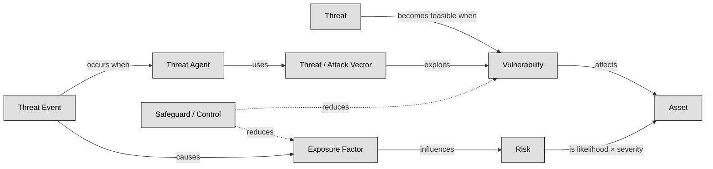

## 1.9 Understand and apply risk management concepts ##

A risk-based approach in cybersecurity is essential because it turns abstract fears into clear, manageable tasks: first you assess what could go wrong (like which valuable assets are vulnerable, how likely bad things might happen, and what their impact would be), and then you respond in a smart way—by mitigating, transferring, accepting, or avoiding the risk based on your priorities and resources .

Think of it like locking your house (assets) after figuring out which doors or windows (vulnerabilities) a burglar (threat agent) might use (attack vector), instead of leaving everything locked just because "that's how you do it." You measure how exposed you are, put in alarms or cameras (controls), and stay alert to new tricks criminals invent—this keeps you efficient, proactive, and aligned with business goals.

It all revolves around these human concepts:
- Asset: The things you care about and need to protect—like data, systems, or brand reputation 
- Vulnerability: A weakness—such as outdated software or poor passwords—that could let someone in 
- Threat (and threat agent): The potential danger—a hacker, natural event, or even an insider—and the actor behind it
- Attack vector: The route used—like phishing emails or open network ports—to launch the attack 
- Risk: The chance that a threat will exploit a vulnerability and harm your assets—and how bad that harm would be 
- Control (or safeguard): What you do to reduce vulnerabilities or block threats—technical tools, policies, training 
- Exposure: How much of your asset is actually open to threats, given its vulnerabilities.
- Attack event: When someone actually hits you—this is when theory becomes real harm.

By weaving together these concepts, a risk-based strategy becomes a living process.

:link: Some other important concepts like risk appetite, risk tolerance and risk capacity are concepts not so easy to grasp, this infographic will help you: https://it.pinterest.com/pin/397794579603964748/

---

## 1.9.1 Threat and vulnerability identification ##

Threats are potential events that may lead to undesired outcomes for a specific asset, whether intentional or accidental. Think of threats as dangers that could harm a target, similar to a weapon. Vulnerabilities represent weaknesses in an asset or the absence of safeguards, such as flaws, limitations, or errors, making it susceptible to harm.
Threats and vulnerabilities are interrelated: a threat becomes feasible when a vulnerability exists. Threats exploit vulnerabilities, leading to exposure, which is the risk. Safeguards mitigate risks by protecting assets from threats. Threat agents intentionally exploit vulnerabilities, while threat events encompass both accidental occurrences and intentional exploitation of vulnerabilities. Threat vectors, also known as attack vectors, are the paths or means by which an attack gains access to a target to cause harm.
Exposure refers to susceptibility to asset loss due to threats, representing the potential for harm. The quantitative risk analysis value of exposure factor (EF) is derived from this concept. Risk is the likelihood that a threat will exploit a vulnerability to cause harm to an asset and the severity of potential damage. The higher the potential harm, the greater the risk.

:link: NIST SP 800-30r1 provides a list of threat categories, concepts and examples: https://csrc.nist.gov/pubs/sp/800/30/r1/final

