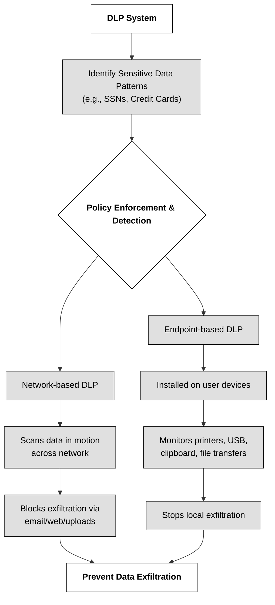

The first step towards effective data handling is **data maintenance**, which encompasses `organizing and caring for data from its creation to its eventual disposal`. This includes implementing access controls and classifying data based on its sensitivity. For example, a network with proper security controls can safeguard data by separating classified and unclassified networks, preventing unauthorized access.

Data loss prevention (DLP) systems play a crucial role in detecting and blocking data exfiltration attempts.These systems work by identifying specific data patterns, such as Social Security numbers or credit card details, and flagging any attempts to send this information outside the organization. DLP systems come in two primary types: network-based and endpoint-based. Network-based DLP scans all outgoing data, while endpoint-based DLP focuses on data leaving specific devices, such as printers or USB drives.

To further enhance data security, organizations employ marking and labeling techniques. This involves placing easily identifiable labels on assets, both physical and digital, to indicate their security level and handling instructions. For example, a backup tape containing confidential information should have a clear label indicating its sensitivity. Proper labeling not only aids in data protection but also ensures efficient and cost-effective asset handling by eliminating ambiguity about the data's sensitivity.

> ℹ Labeling and Marking in information security refer to the processes of categorizing and visually identifying data or assets to ensure they are handled, stored, and accessed appropriately according to their sensitivity or classification level. They are critical for maintaining data confidentiality, integrity, and availability.

**Labeling** is the act of `assigning a classification or designation to information based on its sensitivity and security requirements`. **Marking** is  `physical or digital placement of classification indicators on information or assets to visually alert users of its sensitivity`. Labeling is more comprehensive and enforces security through system automation, while marking is simpler, requiring manual user interpretation and adherence to security policies.

| Category                       | Labeling (System)                                                                                                               | Marking (Process)                                                                                                                          |
| ------------------------------ | ------------------------------------------------------------------------------------------------------------------------------- | ------------------------------------------------------------------------------------------------------------------------------------------ |
| **Readability**                | System- and human-readable metadata                                                                                             | Human-readable only                                                                                                                        |
| **Subject/Object Association** | Associates security attributes with both subjects and objects in internal data structures :contentReference[oaicite:1]{index=1} | Associates security attributes with objects in a human-readable form (e.g., document header, footer) :contentReference[oaicite:2]{index=2} |
| **Enforcement Type**           | System-based enforcement via metadata and policy engines                                                                        | Organization-based process enforcement (manual or procedural) :contentReference[oaicite:3]{index=3}                                        |

**Data storage** is another critical aspect of asset protection.Organizations need to establish clear policies and procedures for storing sensitive information, both physically and digitally. This includes choosing appropriate storage locations, implementing encryption for data at rest, and securing encryption keys using robust controls like hardware security modules (HSMs).

**Data declassification** is the process of lowering the sensitivity level of an asset. This is necessary when data no longer requires the same level of protection or when it reaches the end of its lifecycle. Declassification involves thorough documentation and often multiple levels of approval, ensuring that data is handled appropriately based on its updated classification.

> ⚠ A strong asset security posture relies on a holistic approach, encompassing both technical controls and robust policies and procedures.

🔗 Resources like the [NIST Special Publication 800-88 Rev. 1: "Guidelines for Media Sanitization"](https://csrc.nist.gov/pubs/sp/800/88/r1/final) offer comprehensive guidance on data destruction and sanitization.  Additionally, staying informed about industry standards like [PCI DSS](https://www.pcisecuritystandards.org/) and [HIPAA](https://www.hhs.gov/hipaa/index.html), which outline specific requirements for handling sensitive data, is crucial.

### Open Questions ###

1. What are the two primary categories of Data Loss Prevention (DLP) systems, and how do they differ in their implementation?

  
Show answer

Network-based DLP scans all outgoing data at the network perimeter, looking for specific patterns. Endpoint-based DLP focuses on monitoring and controlling data activities on individual devices like computers and printers.

2. Explain the concept of "data downgrading" and why organizations should have policies in place to prevent it.

  
Show answer

Data downgrading refers to the unauthorized or accidental reduction of the security classification of sensitive data. Organizations need policies to prevent this to ensure consistent protection and avoid accidental disclosure of confidential information.

3. What are the three main methods for handling sensitive information and provide a brief explanation for each?

  
Show answer

The three main methods are marking and labeling, which makes it easy to identify the sensitivity of information, handling, which includes secure transportation and usage of sensitive data, and storage, involving secure physical and logical protection of assets.

4. Describe the purpose of data sanitization and why it's essential before reusing or disposing of media containing sensitive data.

  
Show answer

Data sanitization removes sensitive data from media before reuse or disposal, ensuring that even sophisticated techniques cannot recover the data, protecting organizations from data breaches and compliance violations.

5. What is data remanence, and why does it pose a security risk even after deleting data from storage media?

  
Show answer

Data remanence refers to residual data remaining on storage media even after deletion or formatting. This poses a security risk because unauthorized individuals could potentially recover sensitive information using specialized tools.

6. Why might an organization choose to declassify data, and what are the potential consequences if declassification isn't handled properly?

  
Show answer

Organizations may declassify data when it no longer holds the same sensitivity level or has reached the end of its retention period. Improper declassification could lead to the application of unnecessary controls or, conversely, the inadequate protection of sensitive information.

7. Explain how data de-identification techniques like anonymization and masking help protect sensitive information while still allowing for data analysis.

  
Show answer

De-identification techniques like anonymization (replacing identifiers with random values) and masking (concealing specific parts of data) help protect individual identities while preserving data usability for analysis and research purposes.

