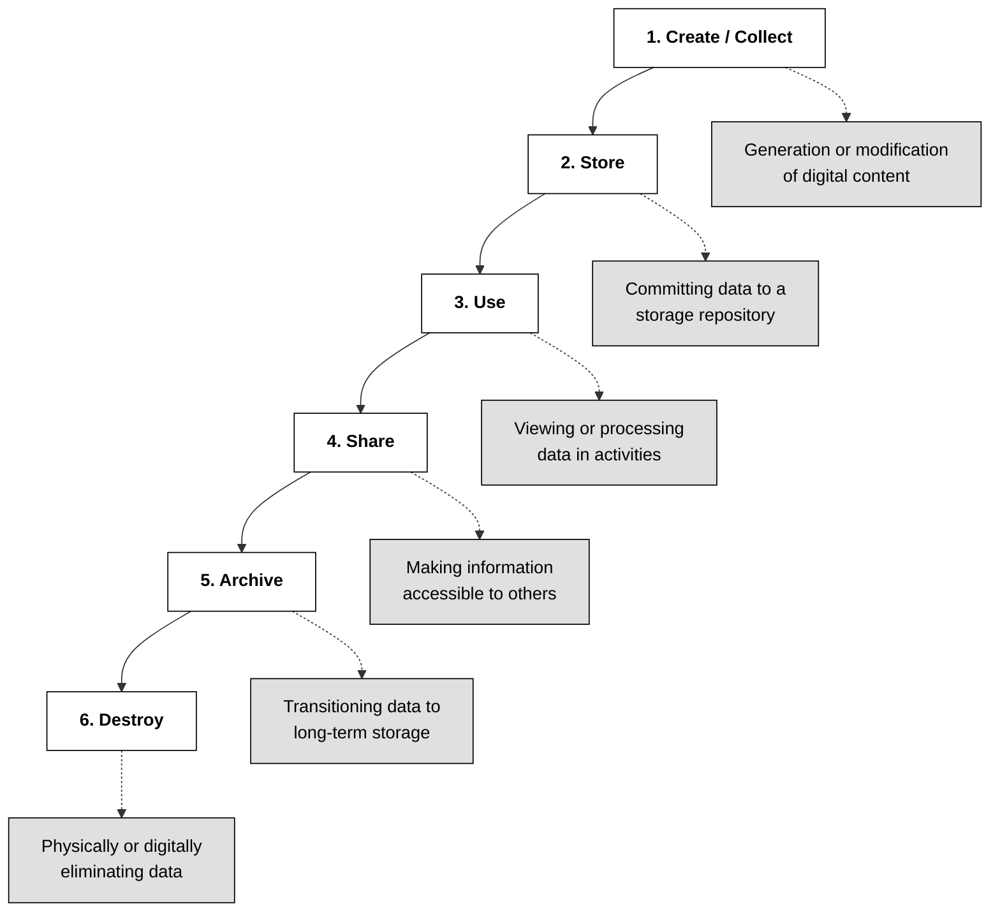
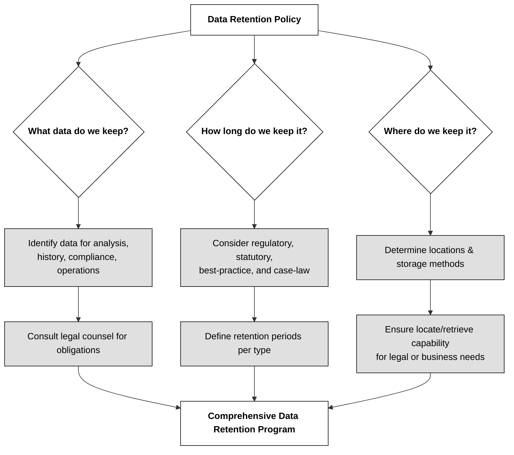
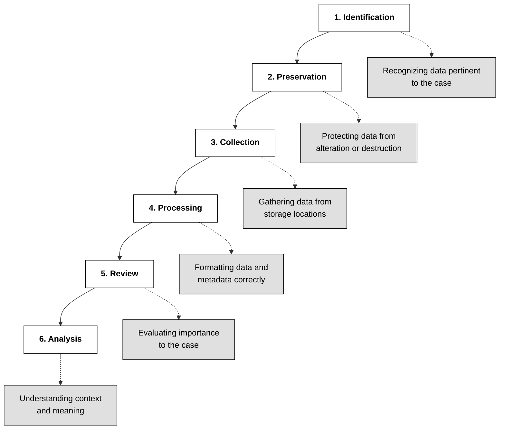

## 2.4.1 Data roles (i.e., owners, controllers, custodians, processors, users/subjects) ##

In the realm of cybersecurity, understanding the roles and responsibilities associated with data management is paramount. These roles encompass a spectrum of individuals, each playing a crucial part in ensuring the security and integrity of an organization's valuable asset - data. Let's delve into the key players involved and their distinct contributions.

**Data Owners** sit at the apex of this hierarchy, `bearing the ultimate responsibility for data`. Often, this mantle falls upon senior leaders such as the CEO, president, or department heads. Their responsibilities are multifaceted, encompassing data classification, ensuring appropriate security controls based on classification and organizational security policies, and defining rules for data use and protection. A critical aspect of their role is collaborating with system owners to establish security controls for data access and use. Data owners are also accountable for their data and can be held liable for negligence if sensitive information under their purview is misused or disclosed without authorization. They wield the authority to grant or deny access to their data, emphasizing their pivotal role in data governance.

**Data Controllers** are the architects of data processing, `determining the purpose, conditions, and methods of handling personal data`. This role gained significant prominence with the General Data Protection Regulation (GDPR), highlighting the importance of adhering to principles like lawfulness, fairness, transparency, data minimization, accuracy, storage limitations, integrity, and confidentiality. Data controllers engage in data processing agreements with data processors to ensure robust privacy protections for personal data. While often synonymous with data owners, this distinction becomes crucial when organizations outsource data processing responsibilities to third parties, such as cloud service providers or managed service providers. In such scenarios, the data owner may delegate the responsibility of establishing data processing requirements to a third party, but ultimately retains accountability for the data's security.

**Data Custodians** are the `guardians of data, ensuring its security and integrity within the IT infrastructure`. Their responsibilities are primarily technical, focusing on tasks such as data storage, backup, and maintenance of audit logs. They operate under the guidance of data owners and business requirements, implementing security controls and ensuring auditability of data and its usage. Typically residing within the IT department, data custodians play a critical role in translating data management policies into tangible security measures.

**Data Processors** `handle data on behalf of the data owner`, responsible for tasks like transferring, transmitting, or manipulating data. Their role is crucial in data protection, especially in sectors like healthcare and banking, where data exchange is essential for various operations. Data processors, however, do not share the legal responsibility and accountability of data controllers. They operate under the direction of the data controller, who dictates the purpose and methods of data processing. A prime example is cloud providers, often categorized as data processors due to their role in handling data based on instructions from the data controller. It's worth noting that individuals within organizations may assume both processor and controller roles depending on the context. For instance, an HR firm acts as a data controller for their employee data but transitions to a data processor role when handling client data for outsourced HR tasks, with the client retaining the data controller status.

**Data Users** are the `individuals who consume or utilize data` for specific purposes. They rely on data processors to ensure data availability and performance, often holding them accountable through service-level agreements (SLAs) and contractual obligations. Their focus is on leveraging data to achieve their objectives, making them the ultimate beneficiaries of secure and reliable data management practices.

**Data Subjects**, as defined by the GDPR, are `the individuals whose personal information is collected and processed`. The core objective of data protection regulations like the GDPR is to safeguard the privacy and rights of data subjects. Understanding the data subject's perspective is crucial for ensuring ethical and responsible data handling practices.

| Role              | Responsibility Summary                                                                                                                                           |
|-------------------|-------------------------------------------------------------------------------------------------------------------------------------------------------------------|
| **Data Owner / Controller** | Senior individual (e.g. department head or CEO) accountable for classifying data, enforcing security controls, defining usage policies, and granting or denying access; handles legal liability and compliance. :contentReference[oaicite:1]{index=1} |
| **Data Custodian** | IT or technical staff responsible for implementing owner's policies—managing storage, backups, access controls, audit logs, system availability, and integrity. :contentReference[oaicite:2]{index=2} |
| **Data Processor** | Third-party or internal team that handles or processes data according to the controller's instructions—typically without decision-making power over purpose or use. :contentReference[oaicite:3]{index=3} |
| **Data User**      | Individuals consuming data to perform tasks, relying on access provided; they must comply with usage policies and SLAs, but are not responsible for broader data governance. |
| **Data Subject**   | Individual whose personal data is processed. Their rights drive regulations like GDPR and influence data governance expectations. :contentReference[oaicite:4]{index=4} |

🔗 Compare these roles with the ones depicted in 1.3.3 in [1.3 Evaluate, apply, and sustain security governance principles](../DOMAIN1%20-%20Security%20and%20Risk%20Management/1.3%20Evaluate,%20apply,%20and%20sustain%20security%20governance%20principles.md)

🔗 [GDPR Chapter 2](https://eur-lex.europa.eu/legal-content/EN/TXT/?uri=CELEX:02016R0679-20160504) should be clear for everyone covering a role related to Data Protection

Protecting the data lifecycle necessitates a collaborative effort from all these stakeholders. While data owners and controllers establish policies and guidelines, data custodians implement technical security measures, and data processors ensure data is handled and shared appropriately. Data users benefit from these efforts, while data subjects deserve respect and protection. 

> ⚠ While companies have the freedom to define their own data roles, it is advisable to align these roles with legal and regulatory requirements to prevent confusion, misunderstandings, and potential liabilities.

> ℹ  Under GDPR, **personal data is always owned by the data subject**, meaning that individuals retain control over their own personal information. This regulation ensures that the data subject has rights over how their data is collected, stored, and used, with organizations being responsible for safeguarding it and obtaining consent for processing.

### Open Questions ###

1. Differentiate between the roles of a data owner and a data custodian.

  
Show answer

Data owners have ultimate responsibility for data, including setting rules for its use and protection. Data custodians, on the other hand, are responsible for the day-to-day management and technical implementation of data security measures as directed by the data owner.

2. Explain the concept of "due care" in the context of asset management. Provide an example.

  
Show answer

Due care in asset management refers to taking reasonable measures to protect valuable assets. An example is maintaining an accurate and up-to-date asset inventory to ensure proper tracking and management of sensitive information.

3. How does the General Data Protection Regulation (GDPR) define a data processor?

  
Show answer

The GDPR defines a data processor as a natural or legal person, public authority, agency, or other body that processes personal data solely on behalf of the data controller.

4. Describe the responsibilities of a data controller according to the GDPR.

  
Show answer

Data controllers determine the purpose and means of processing personal data. They are responsible for adhering to GDPR principles, including lawfulness, fairness, transparency, data minimization, accuracy, storage limitation, integrity, and confidentiality.

5. What are the potential consequences for companies that violate privacy rules outlined in the GDPR?

  
Show answer

Companies violating GDPR privacy rules face significant fines, up to 4% of their global annual revenue. They can also face reputational damage and legal action from affected individuals.

6. Differentiate between a user and a subject in the context of data access.

  
Show answer

A user is any individual who accesses data through a computing system to perform tasks. A subject, in a broader sense, includes any entity that accesses a resource, such as programs, processes, or computers.

7. What are the key responsibilities of a data processor in safeguarding data?

  
Show answer

Data processors ensure the secure transfer, transmission, and handling of data on behalf of the data owner. They are responsible for adhering to contractual agreements and maintaining data confidentiality, integrity, and availability.

8. Why is it important to train data processors on acceptable data handling practices?

  
Show answer

Training data processors ensures they understand acceptable data handling practices and comply with relevant policies and regulations. This minimizes risks associated with accidental or intentional data misuse.

9. What is the significance of respecting data subjects in the context of data privacy?

  
Show answer

Respecting data subjects means recognizing their right to privacy and ensuring their personal information is handled ethically and responsibly. It is fundamental to building trust and maintaining compliance with data protection laws.

---

## 2.4.2 Data collection ##

A critical aspect of safeguarding data lies in understanding and managing the data lifecycle, a concept encompassing the journey of data from its creation to its ultimate disposal. This lifecycle, provides a framework for implementing security controls at every stage, minimizing risks, and adhering to legal and ethical obligations.

The image below recap the Data lifecycle: 

The data lifecycle begins with **data collection (or data creation)**, which encompasses data creation, acquisition, aggregation, or any instance where data enters an organization's system. This initial phase is where secure defaults, privacy by design, and other security principles are critical. Embedding security measures from the outset, rather than as an afterthought, is a cornerstone of best practices and regulatory requirements. It's also crucial to obtain consent or have a legitimate legal basis for collecting data, as emphasized by regulations like the GDPR.

Data classification, typically conducted during data collection or creation, is essential for applying appropriate security controls. Additionally, tagging data with relevant attributes and establishing access restrictions are crucial steps in this phase. 

🔗 Review what you have learned in [2.1 Identify and classify information and assets](2.1%20Identify%20and%20classify%20information%20and%20assets.md)

> ℹ The decisions made during data collection will have implications throughout the entire lifecycle. 

By understanding and effectively managing the data lifecycle, Security professionals can contribute significantly to securing their organizations' information assets. This involves implementing appropriate security controls at every stage, adhering to relevant legal and regulatory frameworks, and fostering a culture of data security awareness throughout the organization. 

One of the fundamental principles of data security is **data minimization**, which advocates for collecting only the data absolutely necessary for business operations. This approach, enshrined in many privacy regulations worldwide, is not just a best practice; it is often a legal requirement. 

Privacy brings many laws and regulations. This legal patchwork necessitates a thorough understanding of the applicable laws in the jurisdictions where an organization operates, especially when outsourcing services or storing data across borders. Imagine an e-commerce company that collects extensive customer information, including credit card details, for every purchase. A data breach in this scenario could lead to significant liabilities and reputational damage. Conversely, a company that only collects data for its intended purpose, like processing payments through a secure third-party processor without storing sensitive information, effectively mitigates the risk of losing valuable customer data.

> ✓ To establish a robust data security posture, organizations must define a clear and comprehensive data privacy policy, often divided into internal and external documents to address employee and customer data separately.

A data privacy policy should answer crucial questions regarding the types of data collected, the purpose of collection, data sharing practices, data ownership, subject rights, data retention periods, and relevant legal and regulatory frameworks.

> ⚠ An approach like "*keeping it just in case it becomes useful someday*" is not acceptable for data management or asset collection.

### Open Questions ###

1. Why is it crucial to limit data collection?

  
Show answer

Limiting data collection minimizes the risk of data breaches and protects individual privacy. By collecting only essential data, organizations reduce their liability and comply with privacy regulations.

2. Provide an example of how an e-commerce company can minimize data breach risks.

  
Show answer

An e-commerce company can minimize data breach risks by using a third-party credit card processor and avoiding storing sensitive credit card information on their servers. This limits their exposure in case of a security incident.

3. What are the potential consequences of collecting and storing excessive customer data?

  
Show answer

Collecting and storing excessive customer data increases the potential impact of data breaches, leading to financial losses, reputational damage, and legal liabilities for the company.

4. How do privacy laws impact data collection practices?

  
Show answer

Privacy laws dictate how organizations can collect, use, and store personal data. They often mandate obtaining consent, minimizing data collection, and implementing security measures to protect sensitive information.

5. Explain the concept of "privacy by design" in the context of the data lifecycle.

  
Show answer

"Privacy by design" means incorporating privacy considerations into the initial design and development stages of systems and processes. This ensures data protection is built-in rather than added as an afterthought.

6. Why is data classification important in the data collection phase?

  
Show answer

Data classification during collection helps determine appropriate security controls based on the sensitivity and value of the data. It ensures sensitive data is handled with extra care and protection.

7. What is the purpose of obtaining consent in data collection, particularly from a privacy perspective?

  
Show answer

Obtaining consent in data collection demonstrates respect for individual privacy rights and ensures transparency. It allows individuals to make informed decisions about how their data is used.

8. What key questions should a comprehensive privacy policy address?

  
Show answer

A comprehensive privacy policy should address: what data is collected, why it's collected, how it's used and shared, data ownership, subject rights, data retention periods, data destruction procedures, and relevant laws and regulations.

9. Explain the significance of having separate internal and external privacy policy documents.

  
Show answer

Separate internal and external privacy policies cater to the specific needs and rights of employees and customers, ensuring clear and transparent communication about data practices for each group.

10. How does the location of third-party service providers impact data privacy concerns?

  
Show answer

The location of third-party service providers raises data privacy concerns due to varying international privacy laws. Organizations must ensure providers comply with relevant regulations to protect data transferred across borders.

---

## 2.4.3 Data location ##

Data location refers to the physical or geographical whereabouts of data at rest and data backups or copies. This seemingly simple concept has far-reaching implications for organizations, especially when handling sensitive data like personal information, healthcare records, or national security secrets. Understanding data location is crucial for ensuring compliance with international regulations and upholding data security best practices.

Several factors contribute to the complexity of data location. Firstly, many countries have enacted data localization laws. These laws mandate that specific types of data, often related to citizens' personal information, be stored and processed within the country's geographical boundaries. Examples of such legislation can be found in China and Russia. The rationale behind data localization often stems from national security concerns, data sovereignty, and the desire to protect citizens' privacy.
China's Cybersecurity Law, enacted in 2016, serves as a prime example of data localization in action. This law grants the Chinese government significant control over cybersecurity practices within the country, particularly for industries deemed "critical information infrastructure" (CII). These industries, including energy, finance, transportation, and healthcare, possess data that could pose risks to national security or public interest if compromised. Foreign companies operating within these sectors in China are obligated to either establish local servers and data centers or collaborate with Chinese data management companies like Alibaba or Tencent. This exemplifies the stringent requirements that data localization laws can impose on international businesses.

:link: Curious about privacy and data location laws in the world ? https://www.dlapiperdataprotection.com/

In addition to data localization, data sovereignty laws further complicate the landscape. These laws stipulate that any entity, regardless of their location, handling specific data types, typically personal data of a country's citizens, must comply with that nation's regulations. Meeting these multifaceted requirements can be challenging, even impossible, without a robust data classification system in place.

> ⚠ Cloud service providers can play a crucial role in both enabling and hindering compliance with data location mandates.

> ✓ The Data controller is in any case accountable for PII, he/she can delegate responsibility for Data processing.

When properly leveraged, cloud services can restrict specific data classifications to a particular region or country, ensuring adherence to data localization rules. Conversely, if data location is not carefully considered during cloud solution architecture, sensitive data might end up stored in unintended locations, potentially leading to legal repercussions and financial penalties for data owners.

> ℹ **Data location** is simply the `geographic place where data is stored`, which can be local (on your device), or remote (in a cloud server). **Data localization**, however, is a `legal or governmental requirement that mandates specific types of data`, often personal data, must be collected, processed, and stored within a country's borders, restricting its cross-border transfer

Beyond legal and regulatory compliance, data location significantly impacts disaster recovery and business continuity. Organizations often maintain backups of their critical data at different locations to mitigate risks associated with natural disasters, cyberattacks, or other disruptive events. The geographical distance between the primary data storage and the backup location is a crucial consideration. For example, storing a backup copy in the same building as the primary data center would defeat the purpose of having a backup if a fire or other localized disaster were to occur. Ideally, backup data should be located far enough from the primary site to minimize the likelihood of both locations being affected by the same event. This concept extends to cloud storage, where organizations need to verify the physical location of their cloud backups to ensure they reside in a geographically separate area.

> ⚠ Data location considerations should be interwoven into every stage of data management, from initial data classification to cloud architecture design and disaster recovery planning. 

> ℹ **Data localization** refers to the practice of storing and processing data within the geographical boundaries of a specific country or region, often due to legal or regulatory requirements. **Data sovereignty**, on the other hand, is a broader concept that asserts that data is subject to the laws and regulations of the country in which it is collected or processed, regardless of where it is stored. While data localization focuses on the physical location of data storage, data sovereignty is concerned with the legal authority and control over data.

Laws and regulations governing data location and sovereignty are constantly evolving. Continuous research and staying updated on legal developments in relevant jurisdictions are crucial.

### Open Questions ###

1. What is the importance of off-site data backups, and how does geographical distance play a role in effective backup strategies?

  
Show answer

Off-site data backups protect against data loss from disasters like fires or floods that could impact the primary data storage location. Geographical distance between the primary site and the backup location is crucial to ensure the backup isn't affected by the same event. A backup stored in the same building as the primary data is useless if the building is destroyed.

2. Explain the concept of data localization/residency and provide an example of a regulation that enforces it.

  
Show answer

Data localization/residency refers to laws requiring data about a country's citizens or residents to be collected, processed, and/or stored within that country's borders. China's Cybersecurity Law is an example, mandating certain industries to store data within China, impacting how foreign companies manage data.

3. Why might an organization choose to replicate data across multiple data centers, particularly those situated in different geographical regions?

  
Show answer

Replicating data across geographically diverse data centers ensures data availability even if one data center experiences an outage due to regional issues like natural disasters or power failures. This redundancy increases resilience and minimizes downtime.

4. How does China's Cybersecurity Law address data localization, and what implications does it hold for foreign companies operating within China?

  
Show answer

China's Cybersecurity Law enforces data localization by requiring critical information infrastructure (CII) data to be stored within China. This compels foreign companies to either establish data centers in China or partner with Chinese companies for local data management.

5. Explain the significance of data controllers possessing encryption keys in the context of data localization/residency and data destruction requirements.

  
Show answer

When data controllers hold encryption keys, they have direct control over data accessibility. If a country mandates data destruction before international transfer, deleting the key effectively renders the data unusable, ensuring compliance with data localization/residency regulations.

6. What challenges might organizations face when attempting to meet data localization requirements without a clear data classification system?

  
Show answer

Without a clear data classification system, organizations may struggle to identify which data falls under specific localization requirements. This can lead to unintentional non-compliance, potentially exposing them to legal and financial penalties.

7. Describe how cloud service providers can be leveraged to assist organizations in complying with data localization mandates.

  
Show answer

Cloud service providers can offer infrastructure and services that confine data to specific geographic locations. This allows organizations to meet data localization mandates by selecting cloud regions or data centers that align with regulatory requirements.

8. What potential consequences might arise if an organization fails to consider data location when designing its cloud architecture?

  
Show answer

Failure to account for data location in cloud architecture can result in sensitive data being stored in unintended locations, potentially violating data localization laws. This could lead to legal repercussions, financial penalties, and reputational damage.

9. Why is data location a critical consideration, especially when handling sensitive data types such as personal, healthcare, or national security information?

  
Show answer

Data location is crucial for sensitive data because different countries have varying data protection and privacy regulations. Storing such data in unauthorized locations can breach these laws, compromising privacy and security.

10. How does the burden of proof differ between criminal and civil cases?

  
Show answer

Data localization laws mandate data storage within a specific country's borders. For example, Russia requires personal data of Russian citizens to be stored within Russia. Data sovereignty laws, like the GDPR in Europe, extend jurisdiction over data processing even if it occurs outside the country's physical borders, requiring compliance with its data protection rules.

---

## 2.4.4 Data Maintenance ##

The Use phase in the secure data lifecycle is where data truly comes alive. After being carefully collected and stored, it's in this phase that data is processed, analyzed, and shared across your organization to fulfill its intended purpose. However, ensuring the security and integrity of your data during this dynamic stage can be quite a challenge. We can think of it like a city - the more activity and movement there is, the more crucial it becomes to maintain order and safety.

:necktie: Maintaining data security during the "Use" phase requires a delicate balance between functionality and security. 

Let's say you have customer information stored in multiple systems across your organization. If a customer's details change, it's vital to update that information everywhere, not just in one system. Failing to do so can lead to confusion, errors, and even potential legal issues. Imagine a scenario where incorrect data about an individual is shared with law enforcement or other organizations, leading to severe consequences. This highlights the importance of having a robust plan for maintaining data accuracy and addressing any errors promptly.

Protecting sensitive data within an organization requires strategic segregation and controlled access measures. Consider the analogy of a building with different security levels. The most sensitive areas, like a server room, require strict access controls and may be physically separated from less sensitive areas. Similarly, organizations can implement network segmentation to isolate sensitive data from the rest of the network. Techniques like air gaps, where physically separate networks are used to house classified and unclassified data, provide enhanced protection against unauthorized access. As usual with countermeasures,  while air gaps provide robust security, they can also create challenges when it comes to data updates and transfers. 

Organizations must continuously review and update their data policies to ensure they remain relevant and effective. This involves not only staying abreast of industry best practices and emerging threats but also regularly assessing how well personnel adhere to established policies. Think of it as ongoing maintenance for your security infrastructure - regular inspections, adjustments, and repairs are necessary to keep everything running smoothly and protect your valuable data assets.

Practical ways for taking care of your data are:
- `Data Loss Prevention (DLP) solutions`: These tools can help detect and prevent sensitive data from leaving your organization's control, whether intentionally or accidentally.
- `User training and awareness programs`: Educating employees about data security policies, best practices, and common threats is crucial to fostering a security-conscious culture.
- `Regular security audits and penetration testing`: These assessments can help identify vulnerabilities in your systems and processes, allowing you to proactively address them before they can be exploited.

The list above is not exhaustive and includes only a few examples.

### Open Questions ###

1. Why is maintaining data accuracy crucial for an organization's operations and legal standing?

  
Show answer

Accurate data is vital for informed decision-making, efficient processes, and compliance with regulations. Inaccurate data can lead to operational disruptions, financial losses, and legal liabilities.

2. Explain the potential consequences of inaccurate data entry, using a real-world example.

  
Show answer

Inaccurate data entry can have severe consequences. The example of a police clerk mistakenly entering the information of an innocent citizen as a convicted murderer highlights how such errors can lead to long-term harm, denying individuals opportunities and impacting their lives.

3. How do data inconsistencies arise in systems with multiple data stores, and what mechanisms can address this?

  
Show answer

Data inconsistencies can occur in systems with multiple data stores due to factors like delayed replication or server outages. Mechanisms like automatic inconsistency resolution and data rollback capabilities help maintain data integrity across these distributed systems.

4. What are the challenges in protecting sensitive data when it's distributed across an organization's network?

  
Show answer

Protecting sensitive data distributed across multiple servers and endpoints becomes challenging because it increases the attack surface and complicates the application of consistent security controls. Centralized storage simplifies the security management.

5. Describe the concept of an "air gap" and its purpose in network security.

  
Show answer

An "air gap" is a physical separation between networks, ensuring that classified and unclassified systems have no physical connections. This prevents unauthorized data transfer and limits the risk of cyberattacks reaching sensitive data.

6. What are three methods for transferring data to a classified network from an unclassified one?

  
Show answer

Data transfer to a classified network can be done manually using USB devices, through a unidirectional network bridge allowing one-way data flow, or via a technical guard solution that filters and allows only authorized data transfer.

7. Why is it essential to routinely review data policies within an organization?

  
Show answer

Regularly reviewing data policies ensures they remain aligned with current threats, legal requirements, and organizational needs. This practice promotes awareness among personnel and helps identify gaps in data protection strategies.

8. What is the primary focus of the "Use" phase in the secure data lifecycle?

  
Show answer

The "Use" phase of the secure data lifecycle focuses on managing and maintaining data security during its active utilization, ensuring access control, applying appropriate security measures, and balancing security with functionality.

9. Explain the principle of "least privilege" in the context of data security.

  
Show answer

The "least privilege" principle advocates granting users only the minimum level of data access required to perform their tasks. This minimizes potential damage from unauthorized access or accidental data breaches

10. How does data encryption present a challenge in balancing security with data usability?

  
Show answer

Encryption enhances data security but can hinder its usability for analysis and processing. Organizations must carefully consider this trade-off, potentially implementing selective encryption or decryption processes to facilitate data use while maintaining security.

---

## 2.4.5 Data Retention ##

Data retention is a critical aspect of asset management and security. Organizations must establish comprehensive data retention policies and procedures that outline what data to keep, how long to keep it, and where to keep it. 

> ✓Data retention policies should be aligned with legal, regulatory, and contractual requirements, as well as business needs and privacy considerations. 

There is no universal standard for data retention, as requirements vary across countries and industries. However, organizations should adhere to documented data retention policies and conduct regular audits to ensure compliance. When outsourcing data storage, it's crucial to specify in the contract the retention period and data eradication process after terminating the service.
Determining the appropriate data retention period requires careful consideration. A common approach is to identify data sets subject to mandated retention requirements and handle them accordingly. For all other data, retention periods should minimally satisfy business requirements, which may differ across various business units. For instance, research and development data might be retained longer than customer service call recordings.

Data retention policies should address three key questions:
1. **What data do we keep?** This involves identifying data needed for analysis, historical knowledge, regulatory compliance, and business operations. Legal counsel should be involved to ensure all legal obligations are met. 
2. **How long do we keep this data?** This requires considering statutory, regulatory, and best practice guidelines, as well as case law. Retention periods vary depending on the type of data. 
3. **Where do we keep this data?** The focus here is on the manner in which data is stored and its accessibility for retrieval. Retained data should be easy to locate and retrieve to comply with legal requests or business needs.

Effective data retention policies strike a balance between business needs and employee or customer privacy. They should ensure that data is retained deliberately, specifically, and enforceably, with mechanisms for prompt and proper disposal of data that should not be retained. Data retention policies must address the challenges posed by the volume, velocity, variety, veracity, and value of data. Organizations should adopt a retention policy that enables the creation of big data stores as needed while balancing risks, costs, and value. This involves considering privacy, legal liability, e-discovery implications, data usefulness, storage costs, and data removal procedures. 

To ensure the accessibility of retained data, several factors should be considered: 
1. **Taxonomy**: A scheme for classifying data based on categories such as functional, chronological, or organizational. 
2. **Classification**: Assigning sensitivity classifications to data to determine appropriate controls during use and archiving. 
3. **Normalization**: Converting data into a standardized format for efficient storage and retrieval. 
4. **Indexing**: Creating indexes to facilitate quick and efficient data searching.

:bulb: Windows indexing is a process that creates an index of files and their contents to improve search speed and efficiency. It scans the files on the computer, storing metadata (like file names, types, and locations) and, in some cases, the actual content of documents, so they can be quickly retrieved. This index is updated periodically, ensuring that search queries return fast, relevant results without having to scan the entire file system each time.

E-discovery, the process of producing electronically stored information (ESI) relevant to a legal proceeding, can be streamlined with robust data retention policies and procedures. 
**The Electronic Discovery Reference Model (EDRM)** outlines eight steps involved in e-discovery:
1. Identification of relevant data. 
2. Preservation of data to prevent destruction. 
3. Collection of data from various storage locations. 
4. Processing to ensure correct data and metadata format. 
5. Review for relevance. 
6. Analysis for context. 
7. Production of the final data set. 
8. Presentation. 

Regulations such as the Federal Information Security Management Act (FISMA) and the Health Insurance Portability and Accountability Act (HIPAA) impose specific data retention requirements. FISMA, through NIST SP 800-53, mandates a minimum retention period of three years for federal agencies and government contractors. HIPAA requires covered entities to retain HIPAA-related data for at least six years from creation. The General Data Protection Regulation (GDPR) emphasizes data minimization, requiring organizations to retain personal data only as long as necessary to fulfill the original purpose of collection.

:necktie: When different laws and regulations impose varying and sometimes contrasting data retention periods, the data owner should carefully assess and prioritize compliance requirements for each jurisdiction or regulatory framework. They should create a comprehensive data retention policy that aligns with all applicable laws, ensuring that the data retention periods for different types of data are met. In cases where conflicting requirements arise, a risk-based approach should be taken, balancing legal obligations, business needs, and privacy concerns.

Organizations should regularly review and update their data retention policies and procedures to ensure they remain effective and compliant with evolving regulations. Data minimization is a key principle in data security, as reducing the amount of data stored minimizes the potential impact of security breaches. 

:necktie: For data, as with assets, an approach based on "*keep it just in case it may serve in future*" is not acceptable.

In the following infographic are depicted the possible ways to ensure compliance while safeguarding Personally Identifiable Information (PII) within your company:

### Open Questions ###

1. Why is it insufficient to simply have a data retention policy without actively ensuring its implementation?

  
Show answer

Simply having a data retention policy without enforcement is insufficient because it fails to ensure compliance. Regular audits and documentation are crucial to verify adherence to the policy and mitigate legal or security risks.

2. What are the three fundamental questions a data retention policy answers?

  
Show answer

A data retention policy answers: what data is kept, for how long, and where it is stored.

3. Why is the "where" of data retention not just about location but also about accessibility?

  
Show answer

The "where" of data retention is about accessibility because simply storing data is not enough; it must be retrievable quickly and efficiently when needed, especially for legal or operational purposes.

4. Provide two examples of reasons why an organization might retain data beyond legal obligations.

  
Show answer

Reasons for retaining data beyond legal obligations include historical analysis to understand trends and inform future decisions, or preserving research data that may be valuable in the future.

5. What were the two traditional, and now largely unacceptable, data retention longevity approaches?

  
Show answer
The two traditional data retention longevity approaches were "keep nothing" and "keep everything."

6. Explain why both the "keep nothing" and "keep everything" approaches are problematic.

  
Show answer

"Keep nothing" is problematic as it can hinder legal defense and demonstrating due diligence. "Keep everything" leads to excessive storage costs and complicates e-discovery due to the sheer volume of data.

7. Define the five characteristics that define big data.

  
Show answer

The five characteristics of big data are volume (size), velocity (speed of data addition), variety (different formats), veracity (reliability), and value (usefulness).

8. Why is the value of big data a critical factor in retention decisions?

  
Show answer

The value of big data is critical in retention decisions because storing and processing large datasets can be expensive. Retention should be justified by the potential insights and value the data can provide.

9. What is e-discovery, and how can a robust data retention policy simplify this process?

  
Show answer

E-discovery is the process of producing electronically stored information (ESI) relevant to a legal proceeding. A robust data retention policy simplifies this process by ensuring data is well-organized, categorized, and easily retrievable, minimizing time and costs.

10. Why is it essential to regularly review and update data retention policies and procedures?

  
Show answer

Regular review and updates to data retention policies are essential to accommodate changes in laws and regulations, evolving technologies, and changing business needs, ensuring continued effectiveness and compliance.

---

## 2.4.6 Data Remanence ##

Data remanence is a critical concept in cybersecurity, particularly when dealing with sensitive information. It refers to the residual data that persists on storage media even after deletion or formatting attempts. This poses a significant security risk as unauthorized individuals could potentially recover this data, leading to privacy breaches and data theft.

:necktie: Managers handling data remanence should implement a formalized process that includes asset tracking, secure data sanitization methods, and compliance checks to ensure alignment with organizational policies and regulatory standards.

The persistence of data remanence stems from the way operating systems handle file deletion. When a file is deleted, the operating system typically only removes pointers to the data's location on the storage medium, leaving the actual data intact. This means the data remains physically present on the drive, hidden from normal view but still accessible through specialized tools. This vulnerability is exacerbated by the fact that most data deletion operations don't erase data but simply mark the memory as available for reuse, without overwriting or erasing the original data.
For instance, in a File Allocation Table (FAT) file system, deleting a file merely replaces the first character of the filename in the directory table with a reserved character, marking it as deleted. However, the data blocks containing the file's content remain untouched, making it susceptible to recovery. This principle extends to modern file systems and databases, where **data marked as deleted can still survive in storage**.

The potential consequences of data remanence necessitate robust data destruction methods, especially when dealing with regulated data or information with higher sensitivity classifications.  Regulatory frameworks such as the Gramm-Leach-Bliley Act (GLBA), HIPAA, and the Fair Credit Reporting Act in the U.S., and BS EN 15713 in Europe, and many more, mandate specific procedures for secure data destruction to protect sensitive information. These regulations often require certified data destruction processes with documented evidence, such as a certificate of destruction, to ensure compliance.

Several techniques can be employed to mitigate the risk of data remanence:
1. **Overwriting**: This involves replacing the data on storage media with random or fixed patterns of 1s and 0s multiple times, rendering the original data unrecoverable.
2. **Degaussing**: Applying a powerful magnetic force to magnetic media, like hard drives, effectively wipes the data and may even render the drive unusable. This method is particularly effective for traditional magnetic storage devices but is not suitable for SSDs.
3. **Encryption**: Encrypting data and storing the encryption key separately provides a secure way to render data unreadable if the key is securely deleted. This is particularly useful in cloud environments where physical access to storage devices is limited.
4. **Physical Destruction**: This is considered the most foolproof method and involves physically destroying the storage media through shredding, incineration, or exposure to corrosive chemicals. This method ensures complete data destruction and is often required for highly sensitive data.

:necktie: The specific data destruction methods required vary depending on the sensitivity of the information, applicable regulations, and the type of storage media being used. 

The rise of cloud computing presents unique challenges for data remanence mitigation. In cloud environments, users typically lack physical access to storage hardware, limiting their control over data destruction processes. Cryptographic erasure, achieved by deleting the encryption key for encrypted data stored in the cloud, is often the preferred solution in such scenarios.

:bulb: Encryption may not completely solve the issue of data remanence for data stored in the cloud because, even though encryption protects data while it is in transit or at rest, the encrypted data could still be inadvertently left behind or improperly erased during the deletion process. In cloud environments, data is often distributed across multiple servers and data centers, making it harder to ensure that all copies, backups, or replicas are fully wiped. Additionally, cloud providers may retain metadata or fragments of encrypted data. Finally, in multi-tenant environments, the shared infrastructure could result in residual data remaining on hardware even after the data is deleted, leading to potential exposure during hardware decommissioning or reuse.

It is crucial to remember that **no data destruction method is entirely foolproof**. Improper execution of overwriting techniques or the use of faulty equipment can leave data remnants. It's essential to verify the effectiveness of data destruction processes to ensure the desired level of data sanitization is achieved.

In addition to the techniques mentioned above, understanding the concept of **slack space** is important. Slack space is the unused space within a disk cluster after a file is written. Sensitive data from memory can sometimes be stored in slack space, potentially leading to data leakage. This highlights the need to avoid processing classified data on unclassified systems and to implement secure data handling practices. This includes implementing appropriate data destruction techniques, ensuring secure data handling practices, and continuously monitoring and verifying the effectiveness of data sanitization processes.

:necktie: Effective data remanence management requires a multi-faceted approach that combines technical measures with procedural controls and adherence to relevant regulations.

:link: [NIST Special Publication 800‑88r2, "Guidelines for Media Sanitization"](https://csrc.nist.gov/pubs/sp/800/88/r2/final)) is the NIST reference about sanitization.

### Open Questions ###

1. Define data remanence and explain why it poses a security threat.

  
Show answer

Data remanence is the residual data that remains on storage media even after attempts to delete or erase it. It poses a security threat because this leftover data can be recovered using specialized tools, potentially exposing sensitive information.

2. Describe how file deletion works in a typical file system and why it doesn't guarantee data removal.

  
Show answer

File deletion in a typical file system usually only removes the file's entry from the directory, marking the space as available for reuse. The actual data remains on the storage media until overwritten. This makes the data recoverable until overwritten.

3. Explain the difference between overwriting and degaussing as data destruction methods.

  
Show answer

Overwriting involves repeatedly replacing the data on the storage media with random or specific patterns to make the original data unrecoverable. Degaussing uses a strong magnetic field to erase data stored on magnetic media.

4. Why is physical destruction considered the most reliable way to eliminate data remanence?

  
Show answer

Physical destruction is considered the most reliable because it eliminates the storage media itself, rendering any data recovery impossible. Methods include shredding, crushing, or incineration.

5. What is the primary challenge of addressing data remanence in cloud environments?

  
Show answer

The primary challenge in cloud environments is the lack of physical control over storage devices. Cloud providers manage the infrastructure, making traditional data destruction methods like physical destruction or degaussing infeasible.

6. Describe cryptographic erasure and explain how it mitigates data remanence risks in cloud settings.

  
Show answer

Cryptographic erasure involves encrypting the data and then securely deleting the encryption key. Without the key, the data is essentially unreadable and unusable, mitigating data remanence risks in cloud environments.

7. Why are traditional degaussing methods ineffective for sanitizing SSDs?

  
Show answer

Degaussing uses magnetic fields to erase data, which is effective for magnetic storage media. However, SSDs use electronic circuitry to store data, rendering degaussing methods ineffective.

8. Briefly explain the concept of slack space and how it can contribute to data remanence issues.

  
Show answer

Slack space is the unused space within a disk cluster that has been allocated to a file. It can contain remnants of previous data or even sensitive information that was in the computer's memory. This residual data in slack space contributes to data remanence.

9. Name at least two regulations or standards that address data destruction requirements.

  
Show answer

  Two examples are NIST Special Publication 800-88 (Guidelines for Media Sanitization) and HIPAA (Health Insurance Portability and Accountability Act).

10. Why is it essential to verify the effectiveness of data destruction processes?

  
Show answer

Verification is essential to ensure that the chosen data destruction method was successful in completely removing data from the media. This helps organizations maintain compliance with data security standards and regulations and minimizes the risk of data breaches.

---

## 2.4.7 Data Destruction ##

Data destruction, the final stage of the data lifecycle, is often neglected, but it's a crucial aspect of data security. 

:bulb: When data is no longer needed, either due to regulations or because it's no longer functionally relevant, it becomes a magnet for hackers, especially since it's often the least protected resource in an environment. Stale data, like an abandoned house, becomes an easy target for those with malicious intent. By properly destroying this unneeded data, you not only reduce your organization's risk exposure, but you also decrease storage and data maintenance costs.

Why is data destruction so important? The answer lies in the potential consequences of improper data disposal. Imagine sensitive information, such as customer financial records or proprietary business secrets, falling into the wrong hands. It could lead to identity theft, financial fraud, espionage, and a host of other serious problems.
This is where the concept of risk management, a core principle of the CISSP exam and Data Protection, comes into play. By understanding the potential consequences of improper data destruction, you can better assess and mitigate the risks associated with data security.

The methods used to ensure complete data destruction vary depending on the data's classification and the organization's security policies. Highly classified data, for instance, might require the complete physical destruction of the storage media, ensuring that no residual data can be recovered. Methods like shredding or incineration are commonly used for this purpose. For data classified at a lower level, using software tools to overwrite data files might be sufficient. These tools essentially replace the existing data with random characters, making the original data unrecoverable.

However, data destruction is not always as straightforward as wiping a hard drive or shredding a document. Data can be fragmented and spread across various systems, making it challenging to ensure complete destruction across all locations. Data can reside on servers, backups, cloud storage, and even personal devices. Residual data, which can persist even after attempts to erase it, adds another layer of complexity. This means that even after you think you've deleted data, remnants of it might still exist, potentially recoverable by skilled individuals.

Moreover, transferring data to another party, such as when migrating to a new service provider or selling accounts, introduces additional considerations. In these scenarios, organizations need to ensure that the data is properly destroyed on their own systems after the transfer, adhering to mandatory retention periods and any relevant regulations.
No matter the reason for data destruction, the bottom line is that the data must be rendered sufficiently difficult to recover for an adversary, ensuring that the risk of such recovery is acceptable to the organization. This requires a thorough understanding of the technical details of how and where data is stored .

### Open Questions ###

1. Why is data destruction important?

  
Show answer

Data destruction is crucial for protecting sensitive information and preventing unauthorized access. When data is no longer needed, proper destruction ensures it cannot be recovered and misused, mitigating security risks and potential legal liabilities.

2. How do data classification levels impact destruction methods? Provide an example.

  
Show answer

Data classification levels determine the sensitivity of the information and, consequently, the required destruction methods. Higher classification levels demand more rigorous and thorough destruction techniques. For example, highly classified data might require complete physical destruction of the storage media, while lower-level data could be overwritten with specialized software.

3. What is data sanitization and how does it relate to data destruction?

  
Show answer

Data sanitization is the process of securely removing data from storage media to ensure its irrecoverability. It is a key element of data destruction, as it guarantees the data's elimination before the media is disposed of or reused.

4. What are two key considerations when an organization decides to destroy data?

  
Show answer

The two primary considerations are ensuring complete data destruction and employing the correct destruction methods. This involves verifying the data is irretrievable and aligning the destruction methods with the data's sensitivity and relevant regulations.

5. Explain how data destruction requirements might differ between physical media and individual files.

  
Show answer

Destroying data on physical media like hard drives often involves physical destruction or secure erasure techniques. Individual files, however, may reside in multiple locations, requiring comprehensive identification and deletion across all systems to ensure complete destruction.

6. Why might an organization transfer data to another party before destroying it?

  
Show answer

Data transfers often occur when services are migrated to a new provider or when accounts are sold to other companies. In such cases, the original organization might transfer the data and subsequently destroy their own copies after a mandatory retention period.

7. What factors determine how an organization chooses to destroy its data?

  
Show answer

Data destruction methods are determined by the organization's risk management strategy, the sensitivity and classification of the data, industry regulations, and the potential cost and resources required for different destruction methods.

8. Describe three methods of destroying data stored on physical hard drives.

  
Show answer

Three common methods include: a) Wiping - overwriting the drive with random data, b) Degaussing - using a powerful magnetic field to erase data, and c) Shredding - physically destroying the drive into small pieces.

9. What is the relationship between data destruction and an organization's risk management strategy?

  
Show answer

Data destruction is a critical component of a comprehensive risk management strategy. Properly destroying sensitive data reduces the risk of data breaches, unauthorized access, and potential legal consequences, thus contributing to the overall security posture of the organization.

10. Why is stale data a security risk?

  
Show answer

Stale data poses a security risk because it often lacks the same level of protection as active data and can become an easy target for attackers. It increases an organization's attack surface and may contain sensitive information that could be exploited if compromised.

