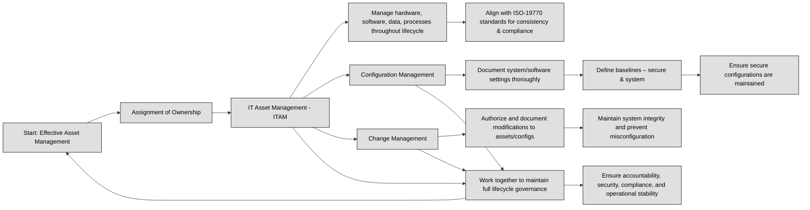

## 2.3.1 Information and Asset Ownership ##

Asset ownership is a central concept to proper information security. But who exactly owns an asset? While legal ownership may reside with the corporation that purchases a server, the life-cycle owner is the employee or department responsible for its daily operation. This distinction highlights the practical aspect of asset ownership: responsibility for the effective management of the asset throughout its life cycle.

Identifying the asset owner is crucial because it pinpoints the individual ultimately accountable for its protection. While the CEO or authorized delegates hold formal ownership responsibility as defined by governance documents and legal regulations, they often delegate data protection tasks.

:brain: The CEO or their delegates retain formal ownership but delegate data protection tasks to data owners responsible for securing sensitive information.

For instance, the IT department might own servers, with senior management within that department responsible for their protection. These individuals, the data owners, play a critical role in safeguarding sensitive information. Their responsibilities may include:
- Maintaining an up-to-date inventory of information assets. 
- Classifying information assets based on sensitivity levels.
- Implementing and monitoring safeguards to ensure confidentiality, integrity, and availability of the information asset.
- Authorizing and revoking access to information based on business need. 
- Adapting security measures in response to evolving environmental and legal/compliance landscapes.

Effective asset management encompasses both tangible and intangible assets, starting with a comprehensive inventory and extending to protection throughout their lifecycle. Tangible assets include hardware and software, while intangible assets encompass data, patents, copyrights, and even a company's reputation. Successfully managing these assets is crucial for preventing losses and maintaining the organization's overall security.

:necktie: Intangible assets, such as intellectual property, brand reputation, and customer relationships, often drive a company's competitive advantage and long-term profitability, making them more valuable than physical assets. Unlike tangible assets, which depreciate over time, intangible assets can appreciate in value and generate significant revenue without direct physical limitations.

To streamline hardware asset management, many organizations employ automated **Configuration Management Systems (CMS)**. While primarily used for configuration management, these systems connect to hardware systems to verify settings, providing an efficient way to track and manage assets.

:bulb: A CMS typically integrates with a Configuration Management Database (CMDB), which stores detailed information about each CI and its relationships. This system helps organizations improve change management, reduce downtime, and enhance security by ensuring that all configurations are properly documented, monitored, and controlled.

### Open Questions ###
1. What is the difference between legal ownership and life cycle ownership of an asset?

  
Show answer

Legal ownership refers to the entity that holds legal title to the asset, while life cycle ownership refers to the individual or department responsible for the asset's day-to-day management. For instance, a corporation might legally own a server, while the IT department is responsible for its daily operations.

2. Who holds ultimate responsibility for data security within an organization?

  
Show answer

Senior management, such as the CEO, President, or Department Head, holds ultimate responsibility for data security within an organization.

3. Provide an example of a tangible asset and an intangible asset.

  
Show answer

A tangible asset is a physical object, like a computer server, while an intangible asset is a non-physical asset, like a company's reputation or a patent.

4. What is the primary purpose of an automated configuration management system (CMS)?

  
Show answer

The primary purpose of an automated configuration management system (CMS) is to assist with configuration management, ensuring systems are configured correctly and consistently. They also play a role in hardware asset management by connecting to and checking the configuration settings of hardware systems.

5. How does the provisioning of IT resources affect an organization's security posture?

  
Show answer

"The provisioning (and deprovisioning) of IT resources directly impacts an organization's security posture as it introduces new assets and potential vulnerabilities. Secure provisioning processes are vital to maintaining a strong security stance.

6. What is the role of a data custodian in relation to data security?

  
Show answer

Data custodians are responsible for the day-to-day management of data, performing tasks delegated by the data owner. This includes activities like implementing access controls, performing backups, and managing data storage.

7. What are the key components of data governance?

  
Show answer

Key components of data governance include defining access permissions, establishing acceptable use policies, and implementing data retention schedules. These practices ensure data is handled appropriately and complies with legal and regulatory requirements.

8. Who typically has formal ownership responsibility for information assets within an organization?

  
Show answer

The chief executive officer (CEO) or their authorized delegates typically hold formal ownership responsibility for information assets within an organization, as defined by the organization's governance documents and legal/compliance requirements.

9. List three responsibilities of asset owners related to data security.

  
Show answer

Three key responsibilities of asset owners include maintaining an up-to-date information asset inventory, identifying the classification level of the information asset, and defining and implementing appropriate safeguards to ensure the confidentiality, integrity, and availability of the information asset.

10. Why is it important for asset owners to continuously evaluate the environment and legal/compliance landscape?

  
Show answer

Continuous evaluation of the environment and legal/compliance landscape is critical for asset owners to adapt security measures to evolving threats, new technologies, and changes in regulations, ensuring ongoing data protection.

---

## 2.3.2 Asset Inventory ##

Asset inventory encompasses the meticulous tracking of all physical and virtual assets within an organization. This includes hardware like computers and servers, software such as operating systems and applications, and even intangible assets like patents and copyrights.
A complete and current asset inventory is necessary for effective security control implementation and monitoring. Without this comprehensive understanding of what needs protection, organizations cannot guarantee the security of their critical assets. This is precisely why asset inventory management is highlighted as the top priority in the widely recognized CIS 20 Controls list.

:link: The CIS20 control list is now actually a CIS 18 control list and can be found [here](https://www.cisecurity.org/controls/cis-controls-list)

:necktie: An asset inventory should collect essential information such as the asset's name, unique identifier (e.g., serial number), location, owner or responsible party, asset type (hardware or software), and its status (active, retired, under maintenance). Additional details may include the asset’s purchase date, warranty information, and configuration details for IT assets like software versions or network settings. However, collecting too many fields can lead to unnecessary complexity, making it harder to maintain and use the inventory effectively. Focusing on key attributes ensures the inventory remains manageable, relevant, and up-to-date without overwhelming users with excessive details that offer little value for asset management or security purposes.

Managing hardware assets efficiently involves employing tools and processes to track these assets throughout their lifecycle. Organizations commonly utilize databases and inventory applications for this purpose. A popular technique involves **bar-code** systems. Each piece of equipment is tagged with a unique barcode containing details such as model, serial number, and location. Regular scans with barcode readers help verify the organization's control over its hardware. A more advanced method leverages **Radio-frequency Identification (RFID)** tags, which transmit information wirelessly to RFID readers. While RFID systems incur higher costs compared to barcode systems, they offer a significant advantage in terms of time efficiency for conducting inventory checks.

| Feature               | Barcodes                                    | QR Codes                                      | RFID                                            |
|-----------------------|---------------------------------------------|-----------------------------------------------|-------------------------------------------------|
| **Type of Technology**| Optical, 1D line scanning                   | Optical, 2D camera scanning                   | Radio‑Frequency (no line-of-sight needed)      |
| **Storage Capacity**  | Limited (~20–25 characters)                 | High (up to ~4,000–7,000 characters)          | Moderate to high, depending on tag type (read/write possible) :contentReference[oaicite:1]{index=1} |
| **Reading Requirement**| Must be in line-of-sight and close range    | Must be in line-of-sight and close range      | Can be read from a distance, no direct sight needed :contentReference[oaicite:2]{index=2} |
| **Cost**              | Very low                                     | Low                                           | Moderate to high (tag + reader infrastructure)  :contentReference[oaicite:3]{index=3} |
| **Applications**      | Retail, inventory, shipping                  | Marketing, payments, authentication           | Asset tracking, logistics, contactless payments :contentReference[oaicite:4]{index=4} |
| **Durability**        | Low—prone to scuffing or fading              | Better—often readable even when partially damaged | High—tags withstand harsh environments and wear  :contentReference[oaicite:5]{index=5} |
| **Simultaneous Reads**| One at a time                                | One at a time                                 | Multiple tags at once via bulk reading           :contentReference[oaicite:6]{index=6} |

:bulb: Radio Frequency Identification (RFID) is a technology that uses electromagnetic fields to automatically identify and track objects, animals, or people via RFID tags. These tags contain a microchip and an antenna, allowing them to store and transmit data wirelessly to an RFID reader. When the reader emits a radio signal, the tag responds with its stored information, which is then processed by a system for inventory management, access control, or asset tracking. RFID tags can be passive (powered by the reader's signal) or active (with their own battery for longer range). This technology is widely used in supply chains, contactless payments, security access systems, and even smart passports.

Prior to disposing of any hardware, **sanitization** is essential. This process involves meticulously removing all data to prevent unauthorized access to sensitive information. Checklists are valuable tools for ensuring thorough sanitization, encompassing steps for hard drives, non-volatile memory, and removable media.. Portable media containing sensitive data, such as USB drives, should also be treated as assets and incorporated into the inventory management system.

:link: For detailed procedures on drive sanitization, refer to [NIST 800-88r1](https://csrc.nist.gov/pubs/sp/800/88/r1/final) section 2.4.

Software assets encompass operating systems and applications used by an organization. Managing these assets effectively necessitates focusing on software licensing and preventing the use of unauthorized software. Organizations invest in software licenses, often utilizing license keys for activation, which typically involve communication with a licensing server to curb piracy. Protecting these license keys is crucial as leakage can invalidate the organization's software usage rights.
Monitoring license compliance is another critical aspect of software asset management, both for legal and security reasons. For instance, if an organization possesses a license for five software installations but has only activated one, the remaining activations could be exploited if the key is compromised. This highlights the need to treat license keys as valuable assets and safeguard them appropriately.
Ensuring that systems are free from unauthorized software is equally important. Various tools exist to remotely inspect systems, identifying unauthorized software and aiding organizations in maintaining compliance with [software licensing regulations](https://github.com/lorenzoleonelli/CISSP-Zero-to-Hero/edit/main/DOMAIN1%3A%20Security%20and%20Risk%20Management/1.04%20Understand%20legal%2C%20regulatory%2C%20and%20compliance%20issues%20that%20pertain%20to%20information%20security%20in%20a%20holistic%20context.md#there-are-four-prevalent-types-of-license-agreements-in-use-today).

Intangible assets, such as intellectual property, patents, trademarks, and a company's reputation, as we already said, also require careful management. Although these assets lack a physical form, they hold significant value for an organization and need protection. Assigning a monetary value to intangible assets can be challenging, often involving estimations of their potential benefits to the organization.
For instance, the value of a patent can be estimated based on the revenue generated from products based on that patent. In the United States, patents have a validity period of 20 years, which can also factor into the valuation process.

:link: See also [1.4.2](https://github.com/lorenzoleonelli/CISSP-Zero-to-Hero/blob/main/DOMAIN1%3A%20Security%20and%20Risk%20Management/1.04%20Understand%20legal%2C%20regulatory%2C%20and%20compliance%20issues%20that%20pertain%20to%20information%20security%20in%20a%20holistic%20context.md#142-licensing-and-intellectual-property-requirements)

Maintaining patents requires periodic fee payments, emphasizing the importance of diligent tracking to avoid potential loss. Large organizations typically report intangible asset values on their balance sheets in accordance with **Generally Accepted Accounting Principles (GAAP)**. This practice ensures regular review and highlights the significance of intangible assets in an organization's overall financial health.

:link: More info about GAAP is available [here](https://en.wikipedia.org/wiki/Generally_Accepted_Accounting_Principles_(United_States))

Given the scale and dynamic nature of asset inventories, automated tools may be indispensable. These tools, including system enumeration and endpoint management systems, provide visibility into the organization's assets and facilitate the discovery of any new or undocumented assets. Asset information is gathered through agents, client software, integration with various scanning tools, or data feeds from vendors in the case of cloud-based assets. Organizations often leverage a combination of existing tools like Active Directory, vulnerability scanners, and software license management tools to build their asset inventory system.
The choice of specific tools depends on the organization's needs and existing infrastructure. However, **a crucial element is establishing a single, authoritative system of record for the asset inventory**. This system serves as the ultimate source of truth, resolving any conflicts that may arise from data collected by different tools. It's crucial to ensure the accuracy and completeness of data in the system of record, as it forms the basis for official reports and audit responses.

Beyond the tools themselves, effective inventory management hinges on well-defined processes. This includes establishing clear guidelines for updating the inventory, including the frequency of updates and procedures for manually notifying the system when assets are added, removed, or significantly modified. In dynamic environments with frequent software deployments and fluctuating endpoint numbers, using automated tools to discover, track, and provision assets is often preferred. 

:necktie: Knowing your assets is the first step in effectively protecting them. (This is so important and so often forgotten in companies)

### Open Questions ###
1. Explain the importance of sanitizing hardware before disposal.

  
Show answer

Sanitizing hardware before disposal is crucial to prevent unauthorized access to sensitive information that may be stored on the device. This involves completely removing all data to ensure data confidentiality and protect the organization from potential data breaches.

2. Describe two methods commonly used for tracking hardware assets.

  
Show answer

Two commonly used methods for tracking hardware assets are bar-code systems and RFID tags. Bar-code systems involve attaching barcodes to assets and scanning them to update their location and status. RFID tags use radio frequencies to transmit asset information to readers, enabling faster and more automated inventory tracking.

3. What challenges exist in managing intangible assets, and how do organizations address these challenges?

  
Show answer

Intangible assets like intellectual property are challenging to manage due to the difficulty in assigning them a monetary value. Organizations address this by estimating the potential benefits these assets will bring, such as revenue generated from a patented product. Senior management typically oversees intangible asset valuation.

4. Why is it essential to monitor software license compliance?

  
Show answer

Monitoring software license compliance is essential to avoid legal issues and potential penalties. Using software beyond the scope of the license agreement can result in lawsuits and financial repercussions. It also ensures that the organization is using software legally and ethically.

5. How can organizations ensure they are not running unauthorized software on their systems?

  
Show answer

Organizations can prevent unauthorized software from running on their systems by utilizing tools that remotely inspect systems and detect software installations. These tools compare installed software against a list of approved applications and flag any unauthorized programs, helping organizations maintain compliance with software licensing agreements.

6. What are the key benefits of using an automated tool for asset inventory management?

  
Show answer

Automated asset inventory management tools offer several benefits. They streamline the inventory process, reducing manual effort and potential errors. They can automatically discover new assets, track asset details, and generate reports, leading to improved accuracy, efficiency, and better control over the organization's assets.

7. What kind of information should be collected for each asset in the inventory?

  
Show answer

The asset inventory should include comprehensive information for each asset, covering both technical and operational details. This includes hardware specifications (manufacturer, model, serial number, location), software details (publisher, version, license information), and operational data (asset owner, data sensitivity, business purpose).

8. What is a "system of record" in the context of asset inventory, and why is it important?

  
Show answer

A "system of record" in asset inventory management is the designated authoritative source of asset information. It acts as the single source of truth for all asset data and is used for reporting, audits, and data requests. Having a system of record ensures data consistency and reliability across the organization.

9. Briefly describe how the asset inventory management process might differ for virtualized environments compared to on-premises assets.

  
Show answer

Asset inventory management in virtualized environments often involves utilizing automated tools like Puppet, Chef, or Ansible for dynamic asset discovery, provisioning, and tracking. These tools are designed to handle the fluctuating nature of virtual assets. On-premises asset management may rely more on manual processes or traditional inventory tools.

10. Why is it important to update the asset inventory regularly and notify the administrator of significant asset changes?

  
Show answer

Regularly updating the asset inventory and notifying the administrator of significant changes is essential to maintain its accuracy and reliability. Assets are constantly changing – being added, removed, updated, or relocated. Keeping the inventory current ensures that it reflects the actual state of the organization's assets, which is critical for security, compliance, and operational efficiency.

---

## 2.3.3 Asset Management ##

An asset, like for example a  server, starts its journey from procurement, moving through various phases like design, operation, maintenance, and finally disposal. Each stage presents unique security challenges. Imagine neglecting to securely dispose of an old hard drive – sensitive data could easily fall into the wrong hands! That's why a robust asset management program is crucial.

:necktie: Asset management is not just about keeping an inventory; it's about actively managing assets throughout their entire lifecycle, ensuring their security and maximizing their value.

:bulb: **ISO 55000** is a set of international standards for asset management that provides a framework for organizations to establish, implement, and continuously improve their asset management systems. It focuses on optimizing the lifecycle of assets, ensuring that they deliver value while minimizing risks and costs. The standard covers aspects such as strategic alignment, governance, and performance measurement, aiming to help organizations maximize the value of their assets.

**ISO 19770** is a set of international standards focused on IT asset management (ITAM), providing guidelines for managing software and hardware assets within an organization. The standard helps organizations optimize the use of their IT assets, ensure compliance with licensing agreements, and reduce risks related to unauthorized software. It includes standards like ISO 19770-1, which outlines a framework for IT asset management, and ISO 19770-2, which defines a standard for software identification tags.

ISO 55000 focuses on asset management across all types of assets, including physical and non-physical assets, aiming to optimize their lifecycle and value. In contrast, ISO 19770 specifically targets IT asset management, providing guidelines for managing and tracking software and hardware assets within an organization to ensure compliance and optimize their use.

:link: Learn more about [ITIL Asset Management](https://www.axelos.com/resource-hub/blog/it-asset-management-and-itil-4-guiding-principles)

Effective asset management involves several key activities:
1. **Assignment of Ownership**: Clearly defining who is responsible for each asset ensures accountability and streamlines security processes.
2. **IT Asset Management (ITAM)**: ITAM focuses on governing and managing all your IT assets, both tangible and intangible. This includes hardware, software, data, and even the processes associated with them. Think of ITAM as the meticulous librarian who keeps track of every book, ensures they're in good condition, and knows when it's time to retire them. ITAM isn't just a best practice; it's got international standards backing it up! The ISO 19770 family of standards provides a comprehensive framework for managing IT assets, helping organizations control risks and costs. This includes establishing processes, defining terminology, and even setting standards for software identification tags, ensuring you know exactly what software is running on your hardware.
3. **Configuration Management**: This involves meticulously documenting and controlling system and software configurations. Imagine a network with misconfigured devices – a security nightmare waiting to happen! Configuration management ensures that systems are set up securely and remain that way, minimizing vulnerabilities.Remember the importance of secure configurations? Baselines are your blueprints for achieving this. A system baseline outlines the specific versions and settings required for building a system correctly. A security baseline, on the other hand, defines the minimum security controls needed to protect a system. Think of them as the safety regulations ensuring your "IT building" stands strong against threats. Organizations often use checklists and guides, like those from the National Checklist Program (NCP), to establish and maintain secure baselines.
4. **Change Management**: Change is inevitable in any IT environment, but uncontrolled change can wreak havoc on your security posture. Change management establishes standardized processes for making modifications to assets, ensuring that all changes are authorized, implemented correctly, and documented thoroughly.

:bulb: Manually checking configurations for hundreds of systems? That's where the **Security Content Automation Protocol (SCAP)** steps in. SCAP allows security products to automatically verify configurations against established baselines, streamlining the process and reducing the risk of human error.

:necktie: Asset security is a dynamic field, constantly evolving alongside technological advancements. Staying informed about new threats and best practices is crucial. Remember, the security of your organization's valuable assets rests in your hands – and with the knowledge and tools you gain, you'll be well-equipped to safeguard them effectively.

:brain: An asset is anything of value to an organization that needs protection, including tangible items like hardware and facilities, intangible resources such as data, intellectual property, and software, as well as personnel and reputation.

### Open Questions ###
1. Describe the importance of tracking information assets throughout their entire lifecycle.

  
Show answer

Tracking information assets throughout their lifecycle enhances cybersecurity resilience. This practice increases asset visibility, identifies vulnerabilities, enables quicker responses to security alerts, and reveals active applications.

2. What is the role of ISO 55000 in asset management?

  
Show answer

ISO 55000 provides valuable guidance for the proper management of physical assets, encompassing both IT and non-IT infrastructure components like power and plumbing utilities.

3. Why is it crucial to manage even unplanned or discovered assets?

  
Show answer

Even unplanned assets, which may arise in agile environments, must be managed to ensure comprehensive asset security. Unmanaged assets can introduce vulnerabilities and compliance issues.

4. Define Information Technology Asset Management (ITAM) and its core function.

  
Show answer

ITAM comprises a set of business practices dedicated to governing and managing IT assets, including hardware, software, data, and associated processes. Its core function is to ensure asset accountability, maintenance, upgrades, and appropriate retirement.

5. Explain the purpose and components of the ISO 19770 standard family.

  
Show answer

ISO 19770 is a family of standards designed to help organizations manage IT asset-related risks and costs. It includes five parts covering best practices, software identification tags (SWID), software entitlement terminology, resource utilization reporting, and general ITAM vocabulary.

6. How does configuration management contribute to asset security?

  
Show answer

Configuration management ensures controlled and documented system and software configurations. This practice is vital to asset security as it prevents configuration drifts that can introduce vulnerabilities and complicate security management

7. Differentiate between system baselines and security baselines.

  
Show answer

A system baseline defines the approved versions and settings of configuration items for proper system construction. In contrast, a security baseline outlines the minimum security controls needed to protect a given system.

8. What is the function of change management in asset security?

  
Show answer

Change management involves standardized processes for modifying assets, preventing arbitrary changes, and minimizing disruptions. In asset security, it helps maintain a secure and controlled environment by ensuring that changes don't inadvertently introduce vulnerabilities.

9. What potential issues can arise from improper change management?

  
Show answer

Improper change management can lead to discrepancies between inventory records and actual environments. It can also increase the risk of security breaches as changes may not be adequately assessed for their security implications.

10. What is a Configuration Management Database (CMDB) and its role according to ITIL?

  
Show answer

A Configuration Management Database (CMDB), as advocated by ITIL, is a repository that documents inventory and tracks planned deployments and changes. It aids in maintaining an accurate and up-to-date view of the IT environment.

