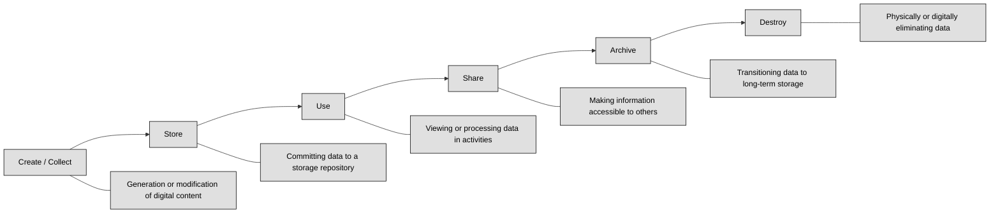

## 2.4.1 Data roles (i.e., owners, controllers, custodians, processors, users/subjects) ##

In the realm of cybersecurity, understanding the roles and responsibilities associated with data management is paramount. These roles encompass a spectrum of individuals, each playing a crucial part in ensuring the security and integrity of an organization's valuable asset - data. Let's delve into the key players involved and their distinct contributions.

**Data Owners** sit at the apex of this hierarchy, bearing the ultimate responsibility for data. Often, this mantle falls upon senior leaders such as the CEO, president, or department heads. Their responsibilities are multifaceted, encompassing data classification, ensuring appropriate security controls based on classification and organizational security policies, and defining rules for data use and protection. A critical aspect of their role is collaborating with system owners to establish security controls for data access and use. Data owners are also accountable for their data and can be held liable for negligence if sensitive information under their purview is misused or disclosed without authorization. They wield the authority to grant or deny access to their data, emphasizing their pivotal role in data governance.

**Data Controllers** are the architects of data processing, determining the purpose, conditions, and methods of handling personal data. This role gained significant prominence with the General Data Protection Regulation (GDPR), highlighting the importance of adhering to principles like lawfulness, fairness, transparency, data minimization, accuracy, storage limitations, integrity, and confidentiality. Data controllers engage in data processing agreements with data processors to ensure robust privacy protections for personal data. While often synonymous with data owners, this distinction becomes crucial when organizations outsource data processing responsibilities to third parties, such as cloud service providers or managed service providers. In such scenarios, the data owner may delegate the responsibility of establishing data processing requirements to a third party, but ultimately retains accountability for the data's security.

**Data Custodians** are the guardians of data, ensuring its security and integrity within the IT infrastructure.. Their responsibilities are primarily technical, focusing on tasks such as data storage, backup, and maintenance of audit logs. They operate under the guidance of data owners and business requirements, implementing security controls and ensuring auditability of data and its usage. Typically residing within the IT department, data custodians play a critical role in translating data management policies into tangible security measures.

**Data Processors** handle data on behalf of the data owner, responsible for tasks like transferring, transmitting, or manipulating data. Their role is crucial in data protection, especially in sectors like healthcare and banking, where data exchange is essential for various operations. Data processors, however, do not share the legal responsibility and accountability of data controllers. They operate under the direction of the data controller, who dictates the purpose and methods of data processing. A prime example is cloud providers, often categorized as data processors due to their role in handling data based on instructions from the data controller.. It's worth noting that individuals within organizations may assume both processor and controller roles depending on the context. For instance, an HR firm acts as a data controller for their employee data but transitions to a data processor role when handling client data for outsourced HR tasks, with the client retaining the data controller status.

**Data Users** are the individuals who consume or utilize data for specific purposes. They rely on data processors to ensure data availability and performance, often holding them accountable through service-level agreements (SLAs) and contractual obligations. Their focus is on leveraging data to achieve their objectives, making them the ultimate beneficiaries of secure and reliable data management practices.

**Data Subjects**, as defined by the GDPR, are the individuals whose personal information is collected and processed. The core objective of data protection regulations like the GDPR is to safeguard the privacy and rights of data subjects. Understanding the data subject's perspective is crucial for ensuring ethical and responsible data handling practices.

| Role              | Responsibility Summary                                                                                                                                           |
|-------------------|-------------------------------------------------------------------------------------------------------------------------------------------------------------------|
| **Data Owner / Controller** | Senior individual (e.g. department head or CEO) accountable for classifying data, enforcing security controls, defining usage policies, and granting or denying access; handles legal liability and compliance. :contentReference[oaicite:1]{index=1} |
| **Data Custodian** | IT or technical staff responsible for implementing owner's policies—managing storage, backups, access controls, audit logs, system availability, and integrity. :contentReference[oaicite:2]{index=2} |
| **Data Processor** | Third-party or internal team that handles or processes data according to the controller's instructions—typically without decision-making power over purpose or use. :contentReference[oaicite:3]{index=3} |
| **Data User**      | Individuals consuming data to perform tasks, relying on access provided; they must comply with usage policies and SLAs, but are not responsible for broader data governance. |
| **Data Subject**   | Individual whose personal data is processed. Their rights drive regulations like GDPR and influence data governance expectations. :contentReference[oaicite:4]{index=4} |

:link: Compare these roles with the ones depicted in [1.3.3 Organizational Roles and Responsibilities](https://github.com/lorenzoleonelli/CISSP-Zero-to-Hero/blob/main/DOMAIN1%3A%20Security%20and%20Risk%20Management/1.03%20Evaluate%2C%20apply%2C%20and%20sustain%20security%20governance%20principles.md#133-organizational-roles-and-responsibilities)

:link: [GDPR Chapter 2](https://eur-lex.europa.eu/legal-content/EN/TXT/?uri=CELEX:02016R0679-20160504) should be clear for everyone covering a role related to Data Protection

Protecting the data lifecycle necessitates a collaborative effort from all these stakeholders. While data owners and controllers establish policies and guidelines, data custodians implement technical security measures, and data processors ensure data is handled and shared appropriately. Data users benefit from these efforts, while data subjects deserve respect and protection. 

:necktie: While companies have the freedom to define their own data roles, it is advisable to align these roles with legal and regulatory requirements to prevent confusion, misunderstandings, and potential liabilities.

:brain: Under GDPR, **personal data is always owned by the data subject**, meaning that individuals retain control over their own personal information. This regulation ensures that the data subject has rights over how their data is collected, stored, and used, with organizations being responsible for safeguarding it and obtaining consent for processing.

### Open Questions ###
1. Differentiate between the roles of a data owner and a data custodian.

  
Show answer

Data owners have ultimate responsibility for data, including setting rules for its use and protection. Data custodians, on the other hand, are responsible for the day-to-day management and technical implementation of data security measures as directed by the data owner.

2. Explain the concept of "due care" in the context of asset management. Provide an example.

  
Show answer

Due care in asset management refers to taking reasonable measures to protect valuable assets. An example is maintaining an accurate and up-to-date asset inventory to ensure proper tracking and management of sensitive information.

3. How does the General Data Protection Regulation (GDPR) define a data processor?

  
Show answer

The GDPR defines a data processor as a natural or legal person, public authority, agency, or other body that processes personal data solely on behalf of the data controller.

4. Describe the responsibilities of a data controller according to the GDPR.

  
Show answer

Data controllers determine the purpose and means of processing personal data. They are responsible for adhering to GDPR principles, including lawfulness, fairness, transparency, data minimization, accuracy, storage limitation, integrity, and confidentiality.

5. What are the potential consequences for companies that violate privacy rules outlined in the GDPR?

  
Show answer

Companies violating GDPR privacy rules face significant fines, up to 4% of their global annual revenue. They can also face reputational damage and legal action from affected individuals.

6. Explain the purpose of IT governance methods like COBIT.

  
Show answer

IT governance methods like COBIT help align IT activities with business goals, including balancing security requirements with operational needs. They provide a framework for managing IT risks and ensuring data security.

7. Differentiate between a user and a subject in the context of data access.

  
Show answer

A user is any individual who accesses data through a computing system to perform tasks. A subject, in a broader sense, includes any entity that accesses a resource, such as programs, processes, or computers.

8. What are the key responsibilities of a data processor in safeguarding data?

  
Show answer

Data processors ensure the secure transfer, transmission, and handling of data on behalf of the data owner. They are responsible for adhering to contractual agreements and maintaining data confidentiality, integrity, and availability.

9. Why is it important to train data processors on acceptable data handling practices?

  
Show answer

Training data processors ensures they understand acceptable data handling practices and comply with relevant policies and regulations. This minimizes risks associated with accidental or intentional data misuse.

10. What is the significance of respecting data subjects in the context of data privacy?

  
Show answer

Respecting data subjects means recognizing their right to privacy and ensuring their personal information is handled ethically and responsibly. It is fundamental to building trust and maintaining compliance with data protection laws.

---

## 2.4.2 Data collection ##

A critical aspect of safeguarding data lies in understanding and managing the data lifecycle, a concept encompassing the journey of data from its creation to its ultimate disposal. This lifecycle, provides a framework for implementing security controls at every stage, minimizing risks, and adhering to legal and ethical obligations.

The image below recap the Data lifecycle:

The data lifecycle begins with **data collection (or data creation)**, which encompasses data creation, acquisition, aggregation, or any instance where data enters an organization's system. This initial phase is where secure defaults, privacy by design, and other security principles are critical. Embedding security measures from the outset, rather than as an afterthought, is a cornerstone of best practices and regulatory requirements. It's also crucial to obtain consent or have a legitimate legal basis for collecting data, as emphasized by regulations like the GDPR.

Data classification, typically conducted during data collection or creation, is essential for applying appropriate security controls. Additionally, tagging data with relevant attributes and establishing access restrictions are crucial steps in this phase. 

:link: Review what you have learned in [2.1.1 Data Classification]
