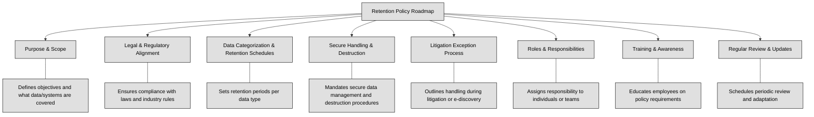

## 2.5 Ensure appropriate asset retention ##

Asset retention encompasses the strategic management of data, physical and electronic records, hardware, and even personnel access to sensitive information. This practice is not merely about hoarding information; it's about striking a balance between preservation and disposal, ensuring data is readily available when needed and securely purged when it's no longer necessary.

One of the most powerful tools in an organization's asset retention arsenal is a well-crafted and diligently implemented retention policy. This policy usually serves as a roadmap, outlining procedures for data handling throughout its lifecycle, from creation to destruction. 
**Key components of a comprehensive retention policy include**:
1. **Clear purpose statement and scope**: Defining the policy's objectives and identifying the data, systems, and personnel it covers.
2. **Legal and regulatory alignment**: Ensuring compliance with applicable laws and industry regulations.
3. **Data categorization and retention schedules**: Establishing specific retention periods for different data types based on sensitivity, legal requirements, and operational needs.
4. **Secure handling and destruction procedures**: Mandating secure procedures for data management and disposal throughout its lifecycle, including during destruction.
5. **Litigation exception process**: Outlining procedures for handling data in legal proceedings, including e-discovery requests.
6. **Roles and responsibilities**: Defining clear responsibilities for individuals involved in data retention activities, including a central data retention team, if applicable.
7. **Training and awareness**: Educating employees on their roles in adhering to the policy and emphasizing the importance of secure data handling practices.
8. **Regular review and updates**: Continuously evaluating the policy's effectiveness and adapting it to evolving business needs, legal requirements, and technological advancements.

A well-defined retention policy offers numerous advantages:
1. Minimizing legal and financial risks: By adhering to legal mandates and demonstrating responsible data management, organizations can reduce the risk of litigation, fines, and reputational damage.
2. Supporting business continuity: Retaining vital records ensures business operations can continue smoothly in the event of disruptions or disasters. Business continuity planning, a related discipline, leverages asset retention principles to safeguard critical information.
3. Preserving institutional memory: Maintaining access to historical data can be invaluable for decision-making, trend analysis, and fostering organizational learning.
4. Facilitating investigations: In the aftermath of security incidents or legal disputes, retained data can provide crucial evidence for forensic analysis and legal proceedings.

:bulb: ISO 15489-1:2016 is an international standard for records management that provides guidelines on how organizations should create, manage, and maintain records throughout their lifecycle, ensuring they are accessible, authentic, and reliable. It defines the principles and practices of records management, emphasizing the need for a structured approach to organizing, preserving, and disposing of records in both physical and digital formats. The standard aims to help organizations ensure compliance with legal, regulatory, and operational requirements related to records management.

:bulb: DoD Instruction 5015.02 is a directive from the U.S. Department of Defense that establishes policies and procedures for records management within the DoD. It provides a framework for the creation, maintenance, and disposition of records, ensuring that all DoD components comply with federal regulations and guidelines for managing records. The instruction ensures that records are properly preserved, accessible, and disposed of in accordance with legal and operational needs.

While retaining vital data is essential, indiscriminate data retention can be detrimental. The costs associated with storing and protecting massive volumes of data can quickly outweigh their value. Additionally, the longer data is retained, the greater the risk of data breaches and legal exposure.
Asset retention considerations extend beyond data to include physical assets like hardware. Understanding the nuances of end-of-life (EOL) and end-of-support (EOS) for hardware is very important. EOL signifies the point when a vendor ceases production and support for a product, while EOS marks the termination of software updates and security patches. Continuing to use assets beyond their EOS exposes organizations to significant security vulnerabilities as unpatched systems become easy targets for exploitation.

:link: [NIST SP 800-92](https://csrc.nist.gov/pubs/sp/800/92/final) seeks to assist organizations in understanding the need for sound computer security log management

**Secure decommissioning** is a vital final step in the asset lifecycle, ensuring the safe and responsible disposal of hardware assets. This process involves:
1. **Data sanitization**: Completely erasing sensitive data from storage devices to prevent unauthorized access after disposal.
2. **Physical destruction**: For highly sensitive data, physical destruction of storage media might be necessary to ensure complete data eradication.
3. **Inventory management**: Maintaining accurate records of decommissioned assets to prevent accidental reuse or disposal of sensitive equipment.
Failure to properly decommission assets can lead to unintended data retention, posing significant risks. 

### Open Questions ###
1. What is asset retention?

  
Show answer

Asset retention means keeping and managing all of an organization's data—whether digital records, physical documents, hardware, or even user access rights—in a way that balances what’s necessary to preserve and what should be securely disposed of when no longer needed.

2. Why does a retention policy matter beyond storage?

  
Show answer

A well-crafted retention policy acts as a strategic roadmap for how data is handled through its entire lifecycle—from creation to destruction. It ensures legal compliance, supports operational continuity, protects institutional memory, and securely disposes of data when it's no longer useful.

3. What must a comprehensive retention policy include?

  
Show answer

It should define its purpose and scope clearly; align with laws and regulations; categorize data with specific retention schedules; enforce secure handling and destruction; incorporate litigation hold procedures; assign roles and responsibilities; train staff; and ensure regular policy review and updates.

4. What are the benefits of a solid retention policy?

  
Show answer

It minimizes legal and financial risk, helps maintain business operations during disruptions, preserves valuable historical insights, and supports forensic investigations—all while avoiding the high costs and risks of unnecessary data storage or outdated hardware.

5. Why is secure decommissioning essential for hardware?

  
Show answer

Proper hardware decommissioning—through data sanitization, physical destruction of storage devices, and inventory tracking—prevents accidental data leakage and ensures outdated or end-of-support equipment doesn’t leave an organization exposed.

