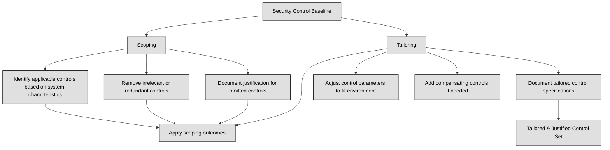

## 2.6.1 Data States ##

Data can exist in three states: data at rest, data in motion, and data in use. Each state presents unique security challenges and requires different protection mechanisms.

:necktie: For each data state, you must ensure its Confidentiality, Integrity, and Availability.

**Data at rest** refers to data that is stored on a device or in a storage medium, such as hard drives, solid-state drives, backup tapes, or cloud storage. This data is not actively being used or transmitted, making it a prime target for attackers who gain physical access to the storage device or compromise the system remotely. **Encryption is the most effective way to protect data at rest**. By encrypting data, even if an attacker gains access to the storage device, they cannot read the data without the encryption key.. Modern operating systems and third-party software offer encryption solutions for individual files, entire volumes, or even whole-disk encryption. 

Organizations should have policies requiring encryption of sensitive data, such as personally identifiable information (PII) and protected health information (PHI). Encrypting all data stored anywhere, an "encrypt everywhere" approach, mitigates the risk of accidental storage of sensitive information in unencrypted volumes.
Examples of data at rest protection measures include:
1. Full disk encryption: Encrypting an entire hard drive volume.
2. Self-encrypting drives (SEDs): Hard drives or solid-state drives that automatically encrypt and decrypt data without additional software.
3. File-level encryption: Encrypting individual files.
4. Field-level encryption: Encrypting specific data fields within a file.
5. Access control: Restricting physical and logical access to storage devices and systems.

**Data in motion**, also known as **data in transit** or data in flight, refers to data that is being transmitted over a network. This includes data transmitted over internal networks, the internet, and to the cloud. 
Data in motion is particularly vulnerable as it travels outside the protected confines of networks and can be intercepted by attackers. Strong encryption, such as Transport Layer Security (TLS) and IPSec, is crucial for protecting data in motion. TLS uses digital certificates to authenticate the server, while IPSec provides secure connections between networks or devices. Data in motion is usually encrypted by:
1. Transport Layer Security (TLS): A cryptographic protocol that secures communications over the internet, commonly used for HTTPS websites.
2. IPSec: A suite of protocols that provide secure communication between devices or networks, often used for VPNs.
3. Virtual Private Networks (VPNs): Create secure connections between remote users and corporate resources or between geographically dispersed networks, providing secure communication over untrusted networks like the internet.

**Data in use** refers to data that is actively being processed by an application or system and is temporarily stored in volatile memory, such as RAM, CPU caches, or registers. Protecting data in use is challenging because it needs to be decrypted before processing, making it vulnerable to attacks that target the system's memory. While encryption cannot directly protect data in use, strategies like decrypting data at the last moment before processing and encrypting it as soon as it leaves the CPU registers can enhance security. However, this approach is computationally expensive and requires specialized hardware, such as cryptographic co-processors.
Emerging technologies, such as homomorphic encryption, offer promising solutions for protecting data in use. Homomorphic encryption allows computations on encrypted data without decryption, meaning the data remains encrypted throughout the processing. Although not yet practical for widespread use, advancements in homomorphic encryption could revolutionize data security in the future. Homomorphic encryption enables computations on encrypted data without decryption, preserving data confidentiality throughout processing.

**Side-channel attacks** pose a significant threat to data in use. These attacks exploit information leaked by a cryptosystem, such as power consumption or processing time, to deduce sensitive information, including encryption keys. For example, the Heartbleed vulnerability demonstrated how attackers could exploit memory vulnerabilities to access sensitive data from other processes running on the same system. Similarly, attacks like Meltdown, Spectre, and BranchScope leverage hardware features in modern CPUs to exploit memory access patterns and steal data in use.

:bulb: Audio data can be kept private by using headphones to prevent eavesdropping, while protecting written data often requires physical measures like protective screens or privacy filters.

The following table recaps what we have seen so far:

| Data State       | Definition                                                                                             | Risks                                                                 | Protection Measures                                                                                             |
|------------------|--------------------------------------------------------------------------------------------------------|------------------------------------------------------------------------|------------------------------------------------------------------------------------------------------------------|
| **At rest**      | Data stored on devices or storage media (e.g., drives, tapes, cloud) not currently moving or being used  | Physical theft, unauthorized system access, ransomware                | Full-disk encryption, self-encrypting drives, file/field-level encryption, access control, "encrypt everywhere" |
| **In motion**    | Data being transmitted over networks (internal, internet, or cloud)  | Interception, man-in-the-middle, packet sniffing                     | TLS/HTTPS, IPSec/VPN, secure communication tunnels                                                               |
| **In use**       | Data loaded into memory (RAM, CPU cache) while being processed  | Memory scraping, side-channel attacks                                | Last-moment decryption, secure enclaves (TEE), emerging approaches like homomorphic encryption                 |
| **Common goal** | Ensure **Confidentiality**, **Integrity**, and **Availability** (CIA triad) for every data state       | —                                                                      | Encryption and robust access control across all states                                                           |

### Open Questions ###

1. Explain the difference between data at rest and data in transit.

  
Show answer

Data at rest refers to data stored on a device or system and not actively being used. Data in transit is data that is actively being transmitted over a network.

2. List three methods of data encryption and briefly describe their scope of protection.

  
Show answer

Full-disk encryption: Encrypts an entire storage drive. 

File-level encryption: Encrypts individual files. 
  
Field-level encryption: Encrypts specific data fields within a file.

3. What is the primary purpose of using encryption as a security control?

  
Show answer

Encryption is primarily used to protect the confidentiality of data by making it unreadable without the proper decryption key. This prevents unauthorized access and disclosure of sensitive information.

4. Describe two technologies that can be used to secure data in transit.

  
Show answer

TLS (HTTPS) and VPNs are two common technologies used to secure data in transit. TLS encrypts data exchanged between web browsers and servers, while VPNs create secure, encrypted tunnels over public networks.

5. What is the main challenge associated with securing data in use?

  
Show answer

The main challenge with securing data in use is that data is typically decrypted in memory for processing, making it vulnerable to attacks.

6. What is a TPM and how can it be used for data security?

  
Show answer

A TPM is a hardware chip that provides secure storage of cryptographic keys and can be used for full-disk encryption. It helps authenticate the platform during boot-up, ensuring that the system hasn't been tampered with.

7. Differentiate between link encryption and end-to-end encryption.

  
Show answer

Link encryption encrypts data at each hop in a network path, while end-to-end encryption ensures that only the sender and the intended recipient can decrypt the data.

8. Briefly describe how a man-in-the-middle attack works.

  
Show answer

In a man-in-the-middle attack, the attacker intercepts communication between two parties and potentially impersonates one or both to gain access to sensitive information.

9. What is a side-channel attack, and why is it a concern for data security?

  
Show answer

A side-channel attack exploits information leakage from a system's physical implementation, like power consumption or timing differences. It can be used to infer sensitive data or compromise cryptographic keys.

10. What is homomorphic encryption, and what potential advantage does it offer?

  
Show answer

Homomorphic encryption allows computations to be performed on encrypted data without decryption. This has the potential to enable secure processing of sensitive data without compromising confidentiality.

---

## 2.6.2 Scoping and Tailoring ##

As a security expert, you play a crucial role in ensuring that security controls are not just implemented, but implemented effectively. This involves adapting general security recommendations from frameworks and guidelines to your organization's specific context. Two key processes in this adaptation are scoping and tailoring.

Scoping involves determining which security controls are applicable to the systems and assets you need to protect. It's about eliminating controls that are redundant or unnecessary for your environment. For instance, if your system doesn't allow concurrent logins, there's no need for a control addressing concurrent session management. Scoping demands careful consideration and documented justification for omitting any controls from the baseline.
Tailoring, on the other hand, focuses on modifying the implementation of controls to align with the organization's specific requirements. This might involve adjusting the control's parameters or substituting it with a compensating control that achieves a similar security outcome. Imagine an organization with a central office and a remote site. The baseline control set might work perfectly for the central office but prove impractical for the remote location. Tailoring allows for adjustments, such as implementing compensating controls, to address the unique circumstances of the remote site.

Scoping and tailoring work hand in hand, first identifying relevant controls and then fine-tuning their implementation.

Key Considerations for Scoping and Tailoring:
1. Organizational Mission and Objectives: Security controls should support the organization's core functions and strategic goals.
2. Risk Assessment: The selection and modification of controls should be driven by a thorough understanding of the organization's risk profile, including threats, vulnerabilities, and impact assessments.
3. Resource Constraints: Consider the organization's budget, staffing, and technical capabilities when making decisions about scoping and tailoring.
4. Operational Impact: Evaluate how the chosen controls will affect the organization's day-to-day operations and ensure they do not create undue burdens.
5. Documentation: Meticulously document all scoping and tailoring decisions, including the rationale behind them. This documentation is essential for demonstrating compliance, facilitating audits, and ensuring continuity.

:necktie: Convenience should never be the driving force behind removing or altering security controls. Any changes must be justified based on operational needs and their potential impact on risk. 

### Open Questions ###
1. What is the primary purpose of tailoring security controls?

  
Show answer

Tailoring security controls aims to customize a set of baseline security controls to align with an organization's specific security requirements, risk tolerance, and operational context. It ensures that the controls are effectively implemented and relevant to the organization's needs.

2. Explain the relationship between tailoring and an organization's mission.

  
Show answer

Tailoring ensures the chosen security controls align directly with the organization's mission. By considering the organization's goals and objectives, tailoring helps select controls that protect the most critical assets and processes, ensuring the organization can achieve its mission securely.

3. What is the key difference between scoping and tailoring in security control implementation?

  
Show answer

Scoping involves selecting the relevant security controls from a broader standard or baseline and eliminating those that are not applicable. Tailoring, on the other hand, involves modifying the selected controls to better address the organization's specific requirements and constraints.

4. Provide an example of a situation where compensating controls might be necessary in the tailoring process.

  
Show answer

Compensating controls might be necessary when a baseline control cannot be implemented in a specific environment. For example, if a remote office lacks the infrastructure for a specific control, a compensating control with equivalent security measures can be implemented.

5. Why is it important to document the decisions made during the scoping and tailoring process?

  
Show answer

Documenting scoping and tailoring decisions provides transparency and accountability for the security choices made. This documentation helps auditors understand the rationale behind the implemented controls and demonstrates compliance efforts.

6. If a baseline recommends a control that is already implemented more comprehensively, how should this be addressed during tailoring?

  
Show answer

If a control is already implemented more comprehensively than the baseline recommendation, this should be documented during tailoring. The organization can justify retaining the existing implementation, demonstrating that it meets or exceeds the baseline requirements.

7. What is the significance of "control value" in the context of tailoring?

  
Show answer

"Control value" refers to the specific parameter or setting of a security control. Tailoring may involve adjusting these values to align with the organization's risk tolerance and operational needs. For example, the number of allowed login attempts before an account lockout can be modified.

8. Why is it essential to rigorously defend decisions to omit controls from a baseline?

  
Show answer

Rigorously defending decisions to omit controls from a baseline is crucial to ensure that security risks are not overlooked. Organizations must provide clear and documented justification, demonstrating that alternative controls or risk mitigation strategies are in place.

9. In what scenario might a company need to scope a security standard received from a parent company?

  
Show answer

A company might need to scope a parent company's security standard if the subsidiary company has different policies or practices. For example, if the parent company allows BYOD (Bring Your Own Device) but the subsidiary company prohibits it, the BYOD sections would be removed during the scoping process.

---

## 2.6.3 Standards Selection ##

When establishing a security control baseline for an organization, one approach is to adopt an existing framework. A security framework is a structured set of documented policies and procedures that outline how an enterprise should manage its security posture. These frameworks often prioritize overall processes and best practices rather than specific controls. They serve as a foundation for assessing and improving the organization's security management system. Organizations can choose a recognized framework or combine elements from various frameworks to create a baseline that suits their specific needs. There are many well-established security frameworks available, each with its own strengths and weaknesses. Choosing the right framework depends on factors like the sensitivity of the assets being protected, industry requirements, regulatory factors, and cost-benefit considerations.

:link: See also [1.3.4 Security control frameworks](https://github.com/lorenzoleonelli/CISSP-Zero-to-Hero/blob/main/DOMAIN1%3A%20Security%20and%20Risk%20Management/1.03%20Evaluate%2C%20apply%2C%20and%20sustain%20security%20governance%20principles.md#134-security-control-frameworks-eg-international-organization-for-standardization-iso-national-institute-of-standards-and-technology-nist-control-objectives-for-information-and-related-technology-cobit-sherwood-applied-business-security-architecture-sabsa-payment-card-industry-pci-federal-risk-and-authorization-management-program-fedramp)

To illustrate, several U.S. and internationally recognized frameworks are commonly used. The **Department of Defense Risk Management Framework (DoD RMF)** is specifically tailored to establishing a baseline and adapting security controls in alignment with the DoD's mission. 
The **NIST SP 800-37, Risk Management Framework**, while similar to the DoD RMF, has broader applicability, extending to both public and private sector organizations. 
Federal government agencies outside of the DoD are subject to the **Federal Information Security Management Act (FISMA)** framework, of which NIST SP 800-37 is a fundamental directive. The **NIST Cybersecurity Framework** (CSF) focuses on providing security and privacy guidelines primarily aimed at assisting private sector companies in bolstering their security measures. The NIST CSF is structured around five core functions: identify, protect, detect, respond, and recover . 
The **UK 10 Steps to Cyber Security**, published by the UK's National Cyber Security Centre, is a government-issued advisory document intended to guide organizations in prioritizing major threats to mitigate the most significant risks. While this document is specifically targeted at UK organizations and considered official guidance, it is not meant to be a comprehensive solution on its own. However, it serves as a valuable component within a portfolio of security controls to establish a baseline.

In addition to security frameworks, there are numerous regional and industry-specific standards that provide more specific recommendations or even mandatory requirements for security controls. These standards, such as PCI DSS, HIPAA, and GDPR, often go beyond the broader guidelines provided by frameworks. A few prominent security standards include: **NIST SP 800-53 Rev 5**, Security and Privacy Controls for Federal Information Systems and Organizations, which catalogs security controls for all U.S. federal information systems, excluding those related to national security. Organizations use this standard to establish, tailor, and supplement their baseline security controls based on their risk assessments. NIST SP 800-53A Rev 4, Assessing Security and Privacy Controls in Federal Information Systems and Organizations: Building Effective Assessment Plans, serves as a complementary guide, offering procedures for assessing security and privacy controls employed within U.S. federal information systems and organizations. These assessment procedures, conducted at different stages of the system development lifecycle, align with the controls outlined in NIST SP 800-53, Revision 5. While primarily aimed at U.S. federal agencies, this standard is also applicable to private sector organizations.
**FIPS Publication 199**, Standards for Security Categorization of Federal Information and Information Systems, provides a standardized approach for categorizing U.S. federal information and information systems based on an agency's level of concern for confidentiality, integrity, and availability. It also considers the potential impact on agency assets and operations if their information and information systems were to be compromised. Although primarily directed at U.S. government agencies, this directive can be valuable and applicable to private sector organizations as well. FIPS Publication 200, Minimum Security Requirements for Federal Information and Information Systems, an integral part of the NIST RMF, emphasizes enhanced security measures during the development, implementation, and operation of more secure information systems. This standard defines 17 families of security controls encompassing confidentiality, integrity, and availability of U.S. federal information systems, along with the information they process, store, and transmit. Despite being a U.S. government standard, it serves as a useful reference for any country or industry.

In the realm of international standards, **ISO 27001, Information technology - Security techniques - Information security management systems - Requirements**, specifies the requirements for establishing, implementing, maintaining, and continually improving an information security management system within the context of an organization. It also includes requirements for assessing and treating information security risks tailored to the organization's specific needs. The requirements outlined in ISO/IEC 27001 are generic and intended to be applicable to all organizations, regardless of their type, size, or nature. Furthermore, it is applicable to global organizations irrespective of their national jurisdiction or industry. 

**ISO 27002, Information Technology: Security techniques - Code of practice for information security controls**, offers guidelines for organizational information security standards and information security management practices. This includes the selection, implementation, and management of controls, taking into consideration the organization's information security risk environment(s). The code of practice is designed for organizations that aim to select controls as part of implementing an information security management system based on ISO 27001. It can also be adapted by organizations that wish to implement commonly accepted information security controls and develop their own information security management guidelines.

When selecting security controls within a baseline, organizations need to consider external security standards. External elements often establish mandatory requirements for an organization, such as the Payment Card Industry Data Security Standard (PCI DSS), which outlines requirements that businesses must adhere to when processing major credit cards. Similarly, organizations that handle data belonging to EU citizens are obligated to comply with the requirements of the General Data Protection Regulation (GDPR). Of course, not all organizations are subject to these standards. Organizations that do not process credit card transactions are not required to comply with PCI DSS. Likewise, organizations that do not collect or process EU citizens’ data do not need to adhere to GDPR requirements. Organizations need to identify the standards that are applicable to their operations and ensure that their chosen security controls fully align with those standards.

Even in cases where an organization is not legally obligated to comply with a specific standard, adopting a well-designed community standard can be beneficial. For example, U.S. government organizations are required to comply with numerous standards outlined in NIST SP 800 documents. These same documents are widely used by organizations in the private sector to guide the development and implementation of their own security standards. The selection of information asset protection standards should prioritize balancing the value of the information with the cost of protecting it. Asset inventories and classification standards play a crucial role in determining the appropriate security controls.

The abundance of good security frameworks underscores the importance of understanding their advantages and disadvantages, as well as their potential for customization to address specific information security challenges. Each framework can be tailored to suit the unique variables present in an organization, including regulatory and compliance requirements, cost considerations, risk tolerance, and business mission. Security practitioners must possess the expertise to evaluate frameworks against organizational requirements and implement solutions that achieve the desired level of asset security.

### Open Questions ###
1. What is a security framework and how does it differ from a security standard?

  
Show answer

A security framework is a collection of documented policies and procedures outlining how to manage an enterprise’s security, focusing on overall processes and best practices. Security standards, on the other hand, are more specific and often mandate the implementation of particular security controls.

2. Why might an organization choose to adopt a recognized security framework even if they are not required to do so?

  
Show answer

Organizations may voluntarily adopt recognized security frameworks to leverage industry best practices, enhance their security posture, demonstrate a commitment to security to stakeholders, and potentially benefit from reduced insurance premiums or regulatory compliance advantages.

3. What are three examples of widely recognized security frameworks?

  
Show answer

Three widely recognized security frameworks are: NIST Risk Management Framework (RMF), NIST Cybersecurity Framework (CSF), and ISO 27001.

4. Describe the key focus of the NIST Cybersecurity Framework (CSF).

  
Show answer

The NIST CSF focuses on providing security and privacy guidelines that primarily assist private-sector companies in improving their security posture.

5. What are the five core functions outlined in the NIST CSF?

  
Show answer

The five core functions of the NIST CSF are: Identify, Protect, Detect, Respond, and Recover.

6. What are two examples of U.S. government security standards that are also relevant for private-sector organizations?

  
Show answer

NIST SP 800-53 and NIST SP 800-53A are two examples of U.S. government security standards that are highly relevant for private-sector organizations due to their comprehensive control catalog and assessment procedures.

7. Explain the purpose of ISO 27001 and its applicability to organizations.

  
Show answer

ISO 27001 outlines the requirements for establishing, implementing, maintaining, and continually improving an Information Security Management System (ISMS) within an organization. It is applicable to all organizations regardless of their type, size, or nature.

8. How does ISO 27002 complement ISO 27001 in terms of information security management?

  
Show answer

ISO 27002 provides guidelines for organizational information security standards and information security management practices, including the selection, implementation, and management of controls. It complements ISO 27001 by offering practical guidance on implementing the controls specified in the framework.

9. What factors should an organization consider when evaluating the applicability and effectiveness of different security frameworks?

  
Show answer

When evaluating security frameworks, organizations should consider factors like the sensitivity of assets to be protected, industry requirements, regulatory factors (e.g., jurisdiction), and cost/benefit analysis.

10. Why is it crucial to balance the value of information with the cost of protecting it when selecting information asset protection standards?

  
Show answer

Balancing the value of information with the cost of protecting it is crucial to ensure cost-effective security measures. Protecting all information with the highest level of security can be prohibitively expensive and unnecessary, while underprotecting valuable assets can lead to significant losses.

---

## 2.6.4 Data Protection methods ##

Data security controls are essential for protecting the confidentiality, integrity, and availability of data. These controls should be implemented throughout the data lifecycle, from creation to disposal.
Digital assets, defined as anything existing in digital form with intrinsic value requiring restricted access, need various controls to ensure data preservation and prevent compromise. Storage media, encompassing electronic and non-electronic forms, requires specific considerations for protection. Unauthorized access prevention is paramount, achievable through physical, administrative, and technical controls. 

Digital asset libraries, often managed by a librarian, can help organizations protect their digital assets. Libraries often implement check-out procedures, especially for licensed software, to track asset usage and demonstrate due diligence in compliance with licensing agreements and confidential information protection.
Storage media management is critical, requiring clear marking, logging, integrity verification, and secure data erasure when no longer needed. Failure to properly erase data from obsolete equipment before disposal can lead to data disclosure risks, legal and ethical violations. Overwriting techniques, including secure overwriting algorithms, are necessary for data erasure.

Secure disposal methods are also required for non-digital forms of information, like paper, microfilm, and microfiche. Dumpster diving, the act of searching through trash for valuable information, highlights the importance of shredding or burning sensitive information before disposal. 

Organizations can leverage several technologies and methodologies to strengthen their data protection strategies:
1. **Encryption**: Encryption transforms data into an unreadable format, making it incomprehensible to unauthorized individuals. This is a fundamental method for protecting data confidentiality. [14]
2. **Data Loss Prevention (DLP)**: DLP technologies and practices prevent sensitive data loss or unauthorized access. These solutions identify, classify, and protect data throughout its lifecycle, covering data at rest, in transit, and in use. DLP implementations typically involve discovery and classification, monitoring, and enforcement stages.
3. **Digital Rights Management (DRM)**: DRM focuses on controlling the use, modification, and distribution of intellectual property. It employs techniques like licensing, persistent online authentication, continuous audit trails, and automatic expiration to protect copyrighted works from unauthorized use. DRM methods, like steganography and metadata embedding, can help detect and enforce copyright protection. 
4. **Information Rights Management (IRM)**: IRM is a related technology to DRM that protects sensitive data from unauthorized access by controlling who can view, copy, delete, or modify the data. 
5. **Cloud Access Security Broker (CASB)**: CASBs act as intermediaries between cloud users and cloud services, monitoring and enforcing security policies for cloud-based data. They provide visibility into cloud usage, enhance data security, protect against threats, and aid in compliance with regulatory requirements. There are three primary types of CASB solutions: forward proxy, reverse proxy, and API-based, each with their advantages and deployment considerations.

:bulb: A Data Loss Prevention (DLP) system works by monitoring, detecting, and blocking the unauthorized transmission of sensitive data across networks or endpoints. It uses content inspection techniques such as pattern matching, keyword recognition, and contextual analysis to identify sensitive information like credit card numbers, personal identifiers, or intellectual property. DLP systems enforce policies by applying rules that determine what data can be accessed, shared, or transferred, based on its classification or type. These systems typically operate at various levels, such as endpoint DLP (on individual devices) or network DLP (monitoring network traffic), and may include features like encryption or alerts to prevent data leaks.

:bulb: **Cloud Access Security Broker (CASB)** solutions are critical for managing and securing access to cloud services and enforcing security policies across cloud environments. There are three primary types of CASB solutions: forward proxy, reverse proxy, and API-based solutions. Each type operates differently, with distinct advantages and deployment considerations.
1. Forward Proxy CASB: A forward proxy CASB sits between the user and the cloud application. It intercepts user requests to cloud services and applies security policies such as authentication, encryption, or malware scanning before allowing access. The solution is typically deployed on the network perimeter, monitoring outbound traffic. It works well for enforcing security policies across known cloud applications, but it can be challenging to deploy when users are on unmanaged devices or mobile networks. It is most effective when controlling access to a specific set of cloud apps and in environments with high traffic to cloud services. However, it may not cover unsanctioned apps or traffic encrypted via SSL/TLS without deep packet inspection.
2. Reverse Proxy CASB: A reverse proxy CASB is deployed in front of cloud applications, controlling access to those applications. Unlike a forward proxy, which sits between the user and the cloud service, a reverse proxy intercepts requests from the cloud services to ensure they are legitimate and meet security requirements before being granted access. This method allows security policies to be enforced for cloud applications without requiring configuration changes on users' devices. A reverse proxy CASB works best for controlling access to cloud applications for users in the organization but may have limitations when it comes to monitoring the traffic of external users or applications that bypass this method. It is often easier to implement for companies with a smaller number of cloud services but can struggle with large, complex environments with many apps.
3. API-based CASB: API-based CASB solutions leverage application programming interfaces (APIs) to interact directly with cloud services. This type of CASB allows organizations to enforce security policies by directly accessing the cloud service’s management layer via APIs, providing deep visibility and control over data and user activity. With an API-based approach, the CASB can monitor data stored in the cloud, enforce encryption, detect threats, and apply access controls. It is particularly effective in cloud-native environments, as it can provide more granular visibility of data activities and prevent data loss in cloud apps. However, it may require more integration work to connect with various cloud platforms, and it may not provide the same level of protection for real-time user traffic as forward or reverse proxies.

### Open Questions ###
1. Describe the three core stages of a Data Loss Prevention (DLP) implementation.

  
Show answer

DLP implementation involves: (1) Discovery and Classification: identifying and categorizing sensitive data; (2) Monitoring: inspecting data movement and usage to detect policy violations; (3) Enforcement: taking actions such as blocking or alerting based on policy violations and data sensitivity.

2. Differentiate between DLP at rest, in transit, and in use.

  
Show answer

DLP at rest: secures data stored on devices through encryption and access control. DLP in transit: monitors network traffic to prevent unauthorized data transfer. DLP in use: protects data being actively used on endpoints, controlling actions like copy/paste and screen capture.

3. What is a Cloud Access Security Broker (CASB) and what are its four primary functions?

  
Show answer

A CASB acts as an intermediary between cloud users and services, enforcing security policies and protecting data in the cloud. Its four functions are: Visibility: providing insight into cloud usage; Data security: preventing data exfiltration; Threat protection: guarding against insider threats; Compliance: ensuring adherence to regulatory requirements.

4. What is a Cloud Access Security Broker (CASB) and what are its four primary functions?

  
Show answer

Forward proxy CASB: resides on user devices, inspecting traffic through encryption. Reverse proxy CASB: integrates with identity services, routing traffic through the CASB. API-based CASB: directly interacts with cloud service APIs to monitor data within the cloud. Each offers varying levels of control, deployment complexity, and compatibility.

5. Explain the concept of Digital Rights Management (DRM) and provide some methods associated with DRM solutions.

  
Show answer

DRM aims to protect the copyright of digital works by controlling access, usage, and distribution. Methods include DRM licenses, persistent online authentication, continuous audit trails, automatic expiration, and digital watermarks to deter unauthorized use and piracy.

6. What are the arguments for and against the use of DRM?

  
Show answer

Arguments for DRM: Prevents revenue loss from piracy, protects intellectual property, and allows for greater control over content distribution. Arguments against DRM: Restricts fair use by legitimate consumers, may be circumvented, and can create inconvenience for authorized users.

