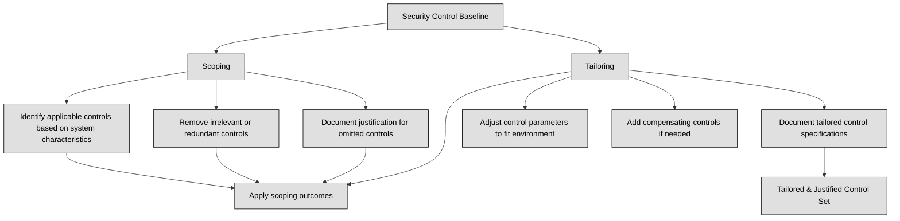

## 2.6.1 Data States ##

Data can exist in three states: data at rest, data in motion, and data in use. Each state presents unique security challenges and requires different protection mechanisms.

:necktie: For each data state, you must ensure its Confidentiality, Integrity, and Availability.

Data at rest refers to data that is stored on a device or in a storage medium, such as hard drives, solid-state drives, backup tapes, or cloud storage. This data is not actively being used or transmitted, making it a prime target for attackers who gain physical access to the storage device or compromise the system remotely. Encryption is the most effective way to protect data at rest. By encrypting data, even if an attacker gains access to the storage device, they cannot read the data without the encryption key.. Modern operating systems and third-party software offer encryption solutions for individual files, entire volumes, or even whole-disk encryption. 

Organizations should have policies requiring encryption of sensitive data, such as personally identifiable information (PII) and protected health information (PHI).. Encrypting all data stored anywhere, an "encrypt everywhere" approach, mitigates the risk of accidental storage of sensitive information in unencrypted volumes.
Examples of data at rest protection measures include:
1. Full disk encryption: Encrypting an entire hard drive volume.
2. Self-encrypting drives (SEDs): Hard drives or solid-state drives that automatically encrypt and decrypt data without additional software.
3. File-level encryption: Encrypting individual files.
4. Field-level encryption: Encrypting specific data fields within a file.
5. Access control: Restricting physical and logical access to storage devices and systems.

Data in motion, also known as data in transit or data in flight, refers to data that is being transmitted over a network. This includes data transmitted over internal networks, the internet, and to the cloud. 
Data in motion is particularly vulnerable as it travels outside the protected confines of networks and can be intercepted by attackers. Strong encryption, such as Transport Layer Security (TLS) and IPSec, is crucial for protecting data in motion. TLS uses digital certificates to authenticate the server, while IPSec provides secure connections between networks or devices. Data in motion is usually encrypted by:
1. Transport Layer Security (TLS): A cryptographic protocol that secures communications over the internet, commonly used for HTTPS websites.
2. IPSec: A suite of protocols that provide secure communication between devices or networks, often used for VPNs.
3. Virtual Private Networks (VPNs): Create secure connections between remote users and corporate resources or between geographically dispersed networks, providing secure communication over untrusted networks like the internet.

Data in use refers to data that is actively being processed by an application or system and is temporarily stored in volatile memory, such as RAM, CPU caches, or registers. Protecting data in use is challenging because it needs to be decrypted before processing, making it vulnerable to attacks that target the system's memory. While encryption cannot directly protect data in use, strategies like decrypting data at the last moment before processing and encrypting it as soon as it leaves the CPU registers can enhance security. However, this approach is computationally expensive and requires specialized hardware, such as cryptographic co-processors.
Emerging technologies, such as homomorphic encryption, offer promising solutions for protecting data in use. Homomorphic encryption allows computations on encrypted data without decryption, meaning the data remains encrypted throughout the processing. Although not yet practical for widespread use, advancements in homomorphic encryption could revolutionize data security in the future. Homomorphic encryption enables computations on encrypted data without decryption, preserving data confidentiality throughout processing.

| Data State       | Definition                                                                                             | Risks                                                                 | Protection Measures                                                                                             |
|------------------|--------------------------------------------------------------------------------------------------------|------------------------------------------------------------------------|------------------------------------------------------------------------------------------------------------------|
| **At rest**      | Data stored on devices or storage media (e.g., drives, tapes, cloud) not currently moving or being used :contentReference[oaicite:1]{index=1} | Physical theft, unauthorized system access, ransomware                | Full-disk encryption, self-encrypting drives, file/field-level encryption, access control, "encrypt everywhere" |
| **In motion**    | Data being transmitted over networks (internal, internet, or cloud) :contentReference[oaicite:2]{index=2} | Interception, man-in-the-middle, packet sniffing                     | TLS/HTTPS, IPSec/VPN, secure communication tunnels                                                               |
| **In use**       | Data loaded into memory (RAM, CPU cache) while being processed :contentReference[oaicite:3]{index=3} | Memory scraping, side-channel attacks                                | Last-moment decryption, secure enclaves (TEE), emerging approaches like homomorphic encryption                 |
| **Common goal** | Ensure **Confidentiality**, **Integrity**, and **Availability** (CIA triad) for every data state       | —                                                                      | Encryption and robust access control across all states                                                           |

**Side-channel attacks** pose a significant threat to data in use. These attacks exploit information leaked by a cryptosystem, such as power consumption or processing time, to deduce sensitive information, including encryption keys. For example, the Heartbleed vulnerability demonstrated how attackers could exploit memory vulnerabilities to access sensitive data from other processes running on the same system. Similarly, attacks like Meltdown, Spectre, and BranchScope leverage hardware features in modern CPUs to exploit memory access patterns and steal data in use.

:bulb: Audio data can be kept private by using headphones to prevent eavesdropping, while protecting written data often requires physical measures like protective screens or privacy filters.

### Open Questions ###

1. Explain the difference between data at rest and data in transit.

  
Show answer

Data at rest refers to data stored on a device or system and not actively being used. Data in transit is data that is actively being transmitted over a network.

2. List three methods of data encryption and briefly describe their scope of protection.

  
Show answer

Full-disk encryption: Encrypts an entire storage drive. * File-level encryption: Encrypts individual files. * Field-level encryption: Encrypts specific data fields within a file.

3. What is the primary purpose of using encryption as a security control?

  
Show answer

Encryption is primarily used to protect the confidentiality of data by making it unreadable without the proper decryption key. This prevents unauthorized access and disclosure of sensitive information.

4. Describe two technologies that can be used to secure data in transit.

  
Show answer

TLS (HTTPS) and VPNs are two common technologies used to secure data in transit. TLS encrypts data exchanged between web browsers and servers, while VPNs create secure, encrypted tunnels over public networks.

5. What is the main challenge associated with securing data in use?

  
Show answer

The main challenge with securing data in use is that data is typically decrypted in memory for processing, making it vulnerable to attacks.

6. What is a TPM and how can it be used for data security?

  
Show answer

A TPM is a hardware chip that provides secure storage of cryptographic keys and can be used for full-disk encryption. It helps authenticate the platform during boot-up, ensuring that the system hasn't been tampered with.

7. Differentiate between link encryption and end-to-end encryption.

  
Show answer

Link encryption encrypts data at each hop in a network path, while end-to-end encryption ensures that only the sender and the intended recipient can decrypt the data.

8. Briefly describe how a man-in-the-middle attack works.

  
Show answer

In a man-in-the-middle attack, the attacker intercepts communication between two parties and potentially impersonates one or both to gain access to sensitive information.

9. What is a side-channel attack, and why is it a concern for data security?

  
Show answer

A side-channel attack exploits information leakage from a system's physical implementation, like power consumption or timing differences. It can be used to infer sensitive data or compromise cryptographic keys.

10. What is homomorphic encryption, and what potential advantage does it offer?

  
Show answer

Homomorphic encryption allows computations to be performed on encrypted data without decryption. This has the potential to enable secure processing of sensitive data without compromising confidentiality.

---

## 2.6.2 Scoping and Tailoring ##

As a security expert, you play a crucial role in ensuring that security controls are not just implemented, but implemented effectively. This involves adapting general security recommendations from frameworks and guidelines to your organization's specific context. Two key processes in this adaptation are scoping and tailoring.

Scoping involves determining which security controls are applicable to the systems and assets you need to protect. It's about eliminating controls that are redundant or unnecessary for your environment. For instance, if your system doesn't allow concurrent logins, there's no need for a control addressing concurrent session management. Scoping demands careful consideration and documented justification for omitting any controls from the baseline.
Tailoring, on the other hand, focuses on modifying the implementation of controls to align with the organization's specific requirements. This might involve adjusting the control's parameters or substituting it with a compensating control that achieves a similar security outcome. Imagine an organization with a central office and a remote site. The baseline control set might work perfectly for the central office but prove impractical for the remote location. Tailoring allows for adjustments, such as implementing compensating controls, to address the unique circumstances of the remote site.

Scoping and tailoring work hand in hand, first identifying relevant controls and then fine-tuning their implementation.

Key Considerations for Scoping and Tailoring:
1. Organizational Mission and Objectives: Security controls should support the organization's core functions and strategic goals.
2. Risk Assessment: The selection and modification of controls should be driven by a thorough understanding of the organization's risk profile, including threats, vulnerabilities, and impact assessments.
3. Resource Constraints: Consider the organization's budget, staffing, and technical capabilities when making decisions about scoping and tailoring.
4. Operational Impact: Evaluate how the chosen controls will affect the organization's day-to-day operations and ensure they do not create undue burdens.
5. Documentation: Meticulously document all scoping and tailoring decisions, including the rationale behind them. This documentation is essential for demonstrating compliance, facilitating audits, and ensuring continuity.

:necktie: Convenience should never be the driving force behind removing or altering security controls. Any changes must be justified based on operational needs and their potential impact on risk. 

### Open Questions ###
1. What is the primary purpose of tailoring security controls?

  
Show answer

Tailoring security controls aims to customize a set of baseline security controls to align with an organization's specific security requirements, risk tolerance, and operational context. It ensures that the controls are effectively implemented and relevant to the organization's needs.

2. Explain the relationship between tailoring and an organization's mission.

  
Show answer

Tailoring ensures the chosen security controls align directly with the organization's mission. By considering the organization's goals and objectives, tailoring helps select controls that protect the most critical assets and processes, ensuring the organization can achieve its mission securely.

3. What is the key difference between scoping and tailoring in security control implementation?

  
Show answer

Scoping involves selecting the relevant security controls from a broader standard or baseline and eliminating those that are not applicable. Tailoring, on the other hand, involves modifying the selected controls to better address the organization's specific requirements and constraints.

4. Provide an example of a situation where compensating controls might be necessary in the tailoring process.

  
Show answer

Compensating controls might be necessary when a baseline control cannot be implemented in a specific environment. For example, if a remote office lacks the infrastructure for a specific control, a compensating control with equivalent security measures can be implemented.

5. Why is it important to document the decisions made during the scoping and tailoring process?

  
Show answer

Documenting scoping and tailoring decisions provides transparency and accountability for the security choices made. This documentation helps auditors understand the rationale behind the implemented controls and demonstrates compliance efforts.

6. If a baseline recommends a control that is already implemented more comprehensively, how should this be addressed during tailoring?

  
Show answer

If a control is already implemented more comprehensively than the baseline recommendation, this should be documented during tailoring. The organization can justify retaining the existing implementation, demonstrating that it meets or exceeds the baseline requirements.

7. What is the significance of "control value" in the context of tailoring?

  
Show answer

"Control value" refers to the specific parameter or setting of a security control. Tailoring may involve adjusting these values to align with the organization's risk tolerance and operational needs. For example, the number of allowed login attempts before an account lockout can be modified.

8. Why is it essential to rigorously defend decisions to omit controls from a baseline?

  
Show answer

Rigorously defending decisions to omit controls from a baseline is crucial to ensure that security risks are not overlooked. Organizations must provide clear and documented justification, demonstrating that alternative controls or risk mitigation strategies are in place.

9. In what scenario might a company need to scope a security standard received from a parent company?

  
Show answer

A company might need to scope a parent company's security standard if the subsidiary company has different policies or practices. For example, if the parent company allows BYOD (Bring Your Own Device) but the subsidiary company prohibits it, the BYOD sections would be removed during the scoping process.

---

## 2.6.3 Standards Selection ##

When establishing a security control baseline for an organization, one approach is to adopt an existing framework. A security framework is a structured set of documented policies and procedures that outline how an enterprise should manage its security posture. These frameworks often prioritize overall processes and best practices rather than specific controls. They serve as a foundation for assessing and improving the organization's security management system. Organizations can choose a recognized framework or combine elements from various frameworks to create a baseline that suits their specific needs. There are many well-established security frameworks available, each with its own strengths and weaknesses. Choosing the right framework depends on factors like the sensitivity of the assets being protected, industry requirements, regulatory factors, and cost-benefit considerations.

:link: See also
