## 2.D.1 Mastering Configuration Management: The Hidden Shield of Your IT Security ##

Configuration management is the quiet guardian of your IT environment — it keeps your systems secure, consistent, and dependable. 

In ISO27001 you find it under **Annex A 8: Technological Controls**, it ensures that every component — hardware, software, networks, and services — operates correctly, follows security standards, and resists unauthorized or accidental changes.

At its heart, configuration management is about **standardization**. Organizations should create and maintain approved templates or images for devices and software — from laptops and network switches to smartphones and servers. These templates must be reviewed and updated regularly to stay ahead of emerging threats, vulnerabilities, and technology changes.

A **baseline configuration** defines what “secure and approved” looks like for servers, workstations, mobile devices, cloud assets, and applications. These baselines should be well-documented and version-controlled using a **Configuration Management Database (CMDB)**. When changes occur, a **change control process** must assess their impact, require formal approval, and ensure testing before rollout. Ongoing monitoring and verification help maintain alignment with approved baselines and prevent configuration drift — one of the silent causes of security incidents.

**Access control** plays a vital role in enforcing configuration policies. Administrative privileges should be limited to the few who truly need them. Disable insecure accounts (like “guest”), use Just-In-Time (JIT) access for temporary admin rights, and keep detailed logs to create an audit trail of privileged activity.

Another key practice is system hardening — stripping away unnecessary services, software, and protocols, changing default passwords, and enforcing automatic logoff after inactivity. Regular audits and automated inventories help ensure software compliance and detect unlicensed or unauthorized installations.

Finally, managing change is not just about process — it’s about **protection**. Every modification should be planned, tested, approved, and reviewed for potential risks before implementation. This disciplined approach preserves system stability and safeguards your organization from vulnerabilities introduced by well-intentioned but uncontrolled updates.

```mermaid

flowchart LR
    A[🛠️ Configuration Management] --> B[🎯 Purpose]
    B --> B1[Maintain security & operational integrity]
    B --> B2[Ensure compliance with standards]
    B --> B3[Prevent unauthorized or accidental changes]

    A --> C[📦 Standardization]
    C --> C1[Use approved templates & images]
    C --> C2[Cover servers, devices, network & mobile]
    C --> C3[Review & update regularly]

    A --> D[📊 Baseline Configurations]
    D --> D1[Define secure approved settings]
    D --> D2[Document & version control via CMDB]
    D --> D3[Monitor to prevent configuration drift]

    A --> E[🔄 Change Control]
    E --> E1[Plan, test & approve all modifications]
    E --> E2[Assess risk before deployment]
    E --> E3[Keep detailed documentation]

    A --> F[🔐 Access Control]
    F --> F1[Limit admin accounts]
    F --> F2[Disable insecure accounts - e.g. guest]
    F --> F3[Use Just-In-Time -JIT- privileges]
    F --> F4[Log privileged activity for audits]

    A --> G[🧱 System Hardening]
    G --> G1[Disable unnecessary services & software]
    G --> G2[Change default passwords]
    G --> G3[Enforce auto-logoff after inactivity]
    G --> G4[Conduct audits & inventories for compliance]

    A --> H[🧩 Outcome]
    H --> H1[Stable & secure IT environment]
    H --> H2[Reduced vulnerabilities]
    H --> H3[Improved operational consistency]

    classDef center fill:#ffffff,color:#000000,stroke:#000000,stroke-width:1px,font-weight:bold
    classDef node fill:#e0e0e0,color:#000000,stroke:#000000,stroke-width:1px
```

