## 2.D.2 Mobile wallets (e.g., Apple Pay, Google Pay): tokenization in action ##

**🧾 Phase 1 – Card Enrollment (Creating the Token)**

When you first add your card to a mobile wallet (e.g., Apple Pay, Google Pay):

1. You enter your card details into the wallet app (either typing them or scanning the card).

2. The wallet (token requestor) sends these details to a Token Service Provider (TSP) such as Visa Token Service (VTS) or Mastercard Digital Enablement Service (MDES).

3. The TSP checks with your issuing bank to confirm your identity (step-up authentication like an OTP or app approval).

4. The TSP creates a digital token (DPAN) that replaces your real card number (FPAN) and stores both securely in the Token Vault.

5. That token (DPAN) is sent back to your device and saved in the secure element (or in the cloud using Host Card Emulation).

From now on, every transaction from that device uses the token, not your real card number.

```mermaid
sequenceDiagram
    participant Cardholder
    participant XPay_Wallet as X-Pay Wallet (App)
    participant TSP as Token Service Provider (VTS/MDES)
    participant Token_Vault as Token Vault
    participant Issuer_Bank as Issuer Bank

    Cardholder->>XPay_Wallet: Enter card details (FPAN)
    XPay_Wallet->>TSP: Request tokenization (send encrypted FPAN)
    TSP->>Issuer_Bank: Verify card & authenticate user (OTP / App)
    Issuer_Bank-->>TSP: Validation OK
    TSP->>Token_Vault: Store mapping (FPAN ↔ DPAN)
    Token_Vault-->>TSP: Mapping stored
    TSP-->>XPay_Wallet: Return DPAN (token)
    XPay_Wallet-->>Cardholder: Card added successfully (token active)


```

**🏦 Phase 2 – Making a Payment (Using the Token)**

When you make a contactless or online payment:

1. You tap your phone or confirm payment in the app.

2. The wallet sends the token (DPAN) plus a one-time cryptogram (a digital signature) to the merchant’s POS.

3. The POS forwards the tokenized transaction to the payment network / TSP.

4. The TSP looks up the real FPAN in the Token Vault (this is called de-tokenization).

5. The TSP sends the real PAN and payment details to the issuer bank for authorization.

6. The bank approves or declines the transaction and the result travels back through the TSP and POS to your wallet.

🔐 Why Tokenization Is Powerful

- The real card number never leaves the bank’s control.

- Each device or merchant gets a unique token, limiting reuse.

- Tokens can be revoked or suspended if a device is lost.

- It supports both contactless and online transactions safely.
