## 3.1 Research, implement, and manage engineering processes using secure design principles ##

Security should be considered at every stage: design, development, testing, implementation, maintenance, and decommissioning. However, the most critical stage for security is the design phase. If security is not integrated from the beginning, retrofitting it later can be costly and ineffective.

👔Security professionals must align security architecture with business goals, ensuring compliance with governance initiatives in an efficient and cost-effective manner.

🔗 [James Anderson’s Computer Security Technology Planning Study (1972)](https://seclab.cs.ucdavis.edu/projects/history/papers/ande72.pdf) introduced fundamental principles for security architecture: security functions must not be bypassed, they should be small enough to be easily tested for defects, and they must always be invoked when needed.

*ISO/IEC 19249* provides a standardized approach to secure system design.ISO/IEC 19249 outlines five architectural principles:

- Domain Separation – Grouping components with similar security attributes and ensuring that communication between domains is strictly controlled.

- Layering – Structuring a system into different levels, each enforcing its own security policies, preventing higher layers from bypassing security mechanisms in lower layers.

- Encapsulation – Restricting direct access to components and ensuring that all interactions occur through defined interfaces that enforce security policies.

- Redundancy – Duplicating critical components to ensure system availability and integrity, such as RAID storage or high-availability clusters.

- Virtualization – Abstracting physical resources to enhance security, scalability, and efficiency, as seen in virtual machines and containerized environments.

```mermaid
flowchart TD
    A[ISO/IEC 19249 Architectural Principles]

    A --> B[Domain Separation]
    B --> B1[Group components with similar security attributes]
    B --> B2[Control communication strictly between domains]

    A --> C[Layering]
    C --> C1[Structure system in levels]
    C --> C2[Each level enforces its own security policies]
    C --> C3[Prevent bypassing lower layer security]

    A --> D[Encapsulation]
    D --> D1[Restrict direct access to components]
    D --> D2[Interactions via defined secure interfaces]

    A --> E[Redundancy]
    E --> E1[Duplicate critical components]
    E --> E2[Ensure availability and integrity]
    E --> E3[Examples: RAID, high-availability clusters]

    A --> F[Virtualization]
    F --> F1[Abstract physical resources]
    F --> F2[Enhance security, scalability, efficiency]
    F --> F3[Examples: VMs, containers]

    classDef center fill:#ffffff,color:#000000,stroke:#000000,stroke-width:1px,font-weight:bold
    classDef node fill:#e0e0e0,color:#000000,stroke:#000000,stroke-width:1px
```

In addition to architectural principles, ISO/IEC 19249 also defines five design principles:

- Least Privilege – Granting only the minimum necessary access for the shortest time needed.

- Attack Surface Minimization – Reducing potential entry points for attackers by disabling unnecessary services and simplifying system functions.

- Centralized Parameter Validation – Ensuring all inputs are properly checked to prevent vulnerabilities like SQL injection.

- Centralized General Security Services – Consolidating security functions like authentication, access control, and cryptographic operations to improve efficiency and consistency.

- Error and Exception Handling – Designing systems to detect, log, and handle errors securely without exposing sensitive information.

```mermaid
flowchart TD
    A[ISO/IEC 19249 Design Principles]

    A --> B[Least Privilege]
    B --> B1[Grant minimum necessary access]
    B --> B2[Access limited to shortest needed time]

    A --> C[Attack Surface Minimization]
    C --> C1[Reduce potential attacker entry points]
    C --> C2[Disable unnecessary services]
    C --> C3[Simplify system functions]

    A --> D[Centralized Parameter Validation]
    D --> D1[Check all inputs properly]
    D --> D2[Prevent vulnerabilities - e.g., SQL injection]

    A --> E[Centralized General Security Services]
    E --> E1[Consolidate security functions]
    E --> E2[Improve efficiency and consistency]
    E --> E3[Includes authentication, access control, crypto]

    A --> F[Error and Exception Handling]
    F --> F1[Detect and log errors securely]
    F --> F2[Handle errors without exposing sensitive info]

    classDef center fill:#ffffff,color:#000000,stroke:#000000,stroke-width:1px,font-weight:bold
    classDef node fill:#e0e0e0,color:#000000,stroke:#000000,stroke-width:1px
```

A well-designed security architecture incorporates these principles to balance security and functionality. By embedding security early in the system lifecycle and continuously updating it, organizations can protect their assets while maintaining operational efficiency.

In cybersecurity, we often talk about subjects and objects in terms of access control.

A **subject** is an active entity that requests access to something. This is usually a user, process, or system trying to interact with data or resources.

An **object** is a passive entity that contains or receives information, like a file, database, system, or application.

Think of it like this:

- If you open a file on your computer, you (the user) are the subject, and the file is the object.

- If a process (like a backup program) accesses your files, the backup process is the subject, and your files are the objects.

The relationship is always about who is trying to access what.

Transitive trust is when trust between two systems automatically extends to a third system. Imagine this:

You trust your best friend (A).

Your friend trusts their coworker (B).

Because you trust your friend, you also automatically trust their coworker (C), even if you've never met them.

In cybersecurity, this can happen with network authentication or permissions:

If System A trusts System B, and System B trusts System C, then System A might also trust System C—even if it wasn’t intended!

This can be risky because an attacker could compromise System C and use that trust chain to gain access to System A.

:bulb: In PKI, transitive trust occurs when a root certificate authority (CA) trusts an intermediate CA, which then issues certificates to end entities. Any entity that trusts the root CA also implicitly trusts certificates issued by the intermediate CA.

An **open system** is designed for interoperability, often supporting open standards, public APIs, and open-source components. While this fosters innovation and flexibility, it also expands the attack surface, requiring strong security controls to mitigate risks. A **closed system**, in contrast, restricts access to its internal workings, limiting integrations and external modifications, which can enhance security but reduce adaptability. In cybersecurity, open systems require robust API security measures, while closed systems rely on strict access controls to maintain integrity.

### 3.1.1 Threat modeling ###

:link: Refer also to [1.10 Understand and apply threat modeling concepts and methodologies](https://github.com/lorenzoleonelli/CISSP-Zero-to-Hero/blob/main/DOMAIN1%3A%20Security%20and%20Risk%20Management/1.10%20Understand%20and%20apply%20threat%20modeling%20concepts%20and%20methodologies.md#110-understand-and-apply-threat-modeling-concepts-and-methodologies)

Threat modeling is a way of identifying, analyzing, and prioritizing potential security threats and weaknesses in a system, application, or environment. It helps you understand where a system might be vulnerable, what risks those vulnerabilities present, and how you can address them to improve security. This process can be used both for securing new applications and reducing risks in existing ones.
There are several ways to approach threat modeling, but three of the most commonly used methods are STRIDE, DREAD, and PASTA.

**STRIDE** is a model created by Microsoft in the late '90s. The name STRIDE is an acronym that represents six types of security threats:

**Spoofing:** This happens when someone pretends to be someone else or something else by falsifying information. For example, pretending to be an authorized user. To defend against spoofing, you can use strong passwords, multi-factor authentication, and digital signatures.

**Tampering:** Tampering refers to the alteration of data by unauthorized users. To protect against tampering, strong access controls and regular monitoring/logging of activities are key.

**Repudiation:** This happens when a user denies performing an action, and there’s no way to prove they did. Implementing secure logging and digital signatures can prevent repudiation threats.

**Information Disclosure:** This occurs when sensitive data is exposed to unauthorized individuals. Encryption, data loss prevention (DLP), and strict access controls are common ways to mitigate this.

**Denial of Service (DoS):** DoS attacks aim to make a system unavailable to users. Protection measures include system redundancy, network filtering, and resource management.

**Elevation of Privilege:** This occurs when someone gains higher privileges than they are authorized for, often by exploiting a vulnerability. Strong access controls and input validation can prevent this.

STRIDE is a great starting point for asking “What could go wrong?” when developing or reviewing a system.

:link: [The STRIDE Model](https://learn.microsoft.com/en-us/azure/security/develop/threat-modeling-tool-threats)

The **DREAD** model is used to evaluate the severity of different threats by assigning numerical ratings (typically between 1 and 10) based on five key factors:

**Damage:** How much damage could the threat cause to the business?

**Reproducibility:** How easy is it for an attacker to repeat the attack?

**Exploitability:** How much effort is needed to exploit the threat?

**Affected Users:** How many users will be impacted by this threat?

**Discoverability:** How easy is it to find this vulnerability?

By scoring each of these factors, you can prioritize which threats are the most serious and need the most attention.

**PASTA (Process for Attack Simulation and Threat Analysis)** is a more detailed and comprehensive approach to threat modeling. Developed in 2012, it includes seven steps:

**Define Objectives:** This is where you identify business goals, security requirements, and possible impacts.

**Define Technical Scope:** You outline the technical environment, including all systems, devices, applications, and data that need protection.

**Application Decomposition:** You break down the system into components and map out data flows to understand how data moves and who accesses it.

**Threat Analysis:** This step involves gathering information about threats both from internal sources (like system logs) and external sources (like threat intelligence feeds).

**Vulnerability Analysis:** In this step, you identify vulnerabilities in the code, system configurations, and infrastructure that could be exploited by attackers.

**Attack Modeling:** Here, you simulate attacks to understand which vulnerabilities might be exploited and the potential impact of those attacks.

**Risk and Impact Analysis:** Finally, you refine your business impact analysis based on the previous steps, prioritize risks, and develop a plan to mitigate them.

| Model   | Element/Step                    | Description                                                                                             | Mitigations / Notes                                                                                  |
|---------|----------------------------------|---------------------------------------------------------------------------------------------------------|--------------------------------------------------------------------------------------------------------|
| **STRIDE** | **Spoofing**                     | Pretending to be someone/something else.                                                                | Use strong passwords, MFA, digital signatures.                                                       |
|         | **Tampering**                   | Unauthorized modification of data.                                                                      | Strong access control, monitoring, and logging.                                                      |
|         | **Repudiation**                 | Denying actions without proof.                                                                          | Secure logging, digital signatures.                                                                  |
|         | **Information Disclosure**      | Leaking sensitive data to unauthorized users.                                                           | Encryption, DLP tools, strict access controls.                                                       |
|         | **Denial of Service (DoS)**     | Making services unavailable to legitimate users.                                                        | Redundancy, network filtering, resource limits.                                                      |
|         | **Elevation of Privilege**      | Gaining higher access than authorized.                                                                  | Access control, input validation, patch vulnerabilities.                                             |
|         | 🔗 [The STRIDE Model](https://learn.microsoft.com/en-us/azure/security/develop/threat-modeling-tool-threats) |                                                                                                         |                                                                                                        |

| **DREAD** | **Damage**                       | How much damage can the attack cause?                                                                   | Assign a score from 1 (low) to 10 (high).                                                             |
|         | **Reproducibility**             | How easy is it to repeat the attack?                                                                    | Easily repeated = higher score.                                                                      |
|         | **Exploitability**              | How easy is it to exploit?                                                                              | Less effort = higher threat.                                                                         |
|         | **Affected Users**             | How many users will be impacted?                                                                        | More affected users = higher severity.                                                               |
|         | **Discoverability**            | How easy is it to find the vulnerability?                                                               | Easily found = higher priority.                                                                      |
|         |                                | **Use Case:** Helps prioritize threats by scoring each factor.                                          |                                                                                                        |

| **PASTA** | **1. Define Objectives**           | Identify business goals and security requirements.                                                      | Understand what needs protection.                                                                    |
|         | **2. Define Technical Scope**     | List systems, devices, apps, data involved.                                                             | Map the full environment.                                                                            |
|         | **3. Application Decomposition** | Break down the system into components and data flows.                                                   | Identify who interacts with what.                                                                    |
|         | **4. Threat Analysis**            | Gather threat intel (internal logs, external sources).                                                  | Combine contextual and threat data.                                                                  |
|         | **5. Vulnerability Analysis**     | Identify weak points in systems and code.                                                               | Security scans, config reviews.                                                                      |
|         | **6. Attack Modeling**            | Simulate how attacks could exploit vulnerabilities.                                                     | Helps assess likelihood and impact.                                                                  |
|         | **7. Risk and Impact Analysis**   | Prioritize risks and decide mitigation strategies.                                                      | Finalize the threat model and recommend actions.                                                     |
