## 3.1 Research, implement, and manage engineering processes using secure design principles ##

Security should be considered at every stage: design, development, testing, implementation, maintenance, and decommissioning. However, the most critical stage for security is the design phase. If security is not integrated from the beginning, retrofitting it later can be costly and ineffective.

👔Security professionals must align security architecture with business goals, ensuring compliance with governance initiatives in an efficient and cost-effective manner.

🔗 [James Anderson’s Computer Security Technology Planning Study (1972)](https://seclab.cs.ucdavis.edu/projects/history/papers/ande72.pdf) introduced fundamental principles for security architecture: security functions must not be bypassed, they should be small enough to be easily tested for defects, and they must always be invoked when needed.

*ISO/IEC 19249* provides a standardized approach to secure system design.ISO/IEC 19249 outlines five architectural principles:

- Domain Separation – Grouping components with similar security attributes and ensuring that communication between domains is strictly controlled.

- Layering – Structuring a system into different levels, each enforcing its own security policies, preventing higher layers from bypassing security mechanisms in lower layers.

- Encapsulation – Restricting direct access to components and ensuring that all interactions occur through defined interfaces that enforce security policies.

- Redundancy – Duplicating critical components to ensure system availability and integrity, such as RAID storage or high-availability clusters.

- Virtualization – Abstracting physical resources to enhance security, scalability, and efficiency, as seen in virtual machines and containerized environments.



```mermaid
flowchart TD
    A[ISO/IEC 19249 Architectural Principles]

    A --> B[Domain Separation]
    B --> B1[Group components with similar security attributes]
    B --> B2[Control communication strictly between domains]

    A --> C[Layering]
    C --> C1[Structure system in levels]
    C --> C2[Each level enforces its own security policies]
    C --> C3[Prevent bypassing lower layer security]

    A --> D[Encapsulation]
    D --> D1[Restrict direct access to components]
    D --> D2[Interactions via defined secure interfaces]

    A --> E[Redundancy]
    E --> E1[Duplicate critical components]
    E --> E2[Ensure availability and integrity]
    E --> E3[Examples: RAID, high-availability clusters]

    A --> F[Virtualization]
    F --> F1[Abstract physical resources]
    F --> F2[Enhance security, scalability, efficiency]
    F --> F3[Examples: VMs, containers]

    classDef center fill:#ffffff,color:#000000,stroke:#000000,stroke-width:1px,font-weight:bold
    classDef node fill:#e0e0e0,color:#000000,stroke:#000000,stroke-width:1px
```

In addition to architectural principles, ISO/IEC 19249 also defines five design principles:

- Least Privilege – Granting only the minimum necessary access for the shortest time needed.

- Attack Surface Minimization – Reducing potential entry points for attackers by disabling unnecessary services and simplifying system functions.

- Centralized Parameter Validation – Ensuring all inputs are properly checked to prevent vulnerabilities like SQL injection.

- Centralized General Security Services – Consolidating security functions like authentication, access control, and cryptographic operations to improve efficiency and consistency.

- Error and Exception Handling – Designing systems to detect, log, and handle errors securely without exposing sensitive information.

```mermaid
flowchart TD
    A[ISO/IEC 19249 Design Principles]

    A --> B[Least Privilege]
    B --> B1[Grant minimum necessary access]
    B --> B2[Access limited to shortest needed time]

    A --> C[Attack Surface Minimization]
    C --> C1[Reduce potential attacker entry points]
    C --> C2[Disable unnecessary services]
    C --> C3[Simplify system functions]

    A --> D[Centralized Parameter Validation]
    D --> D1[Check all inputs properly]
    D --> D2[Prevent vulnerabilities (e.g., SQL injection)]

    A --> E[Centralized General Security Services]
    E --> E1[Consolidate security functions]
    E --> E2[Improve efficiency and consistency]
    E --> E3[Includes authentication, access control, crypto]

    A --> F[Error and Exception Handling]
    F --> F1[Detect and log errors securely]
    F --> F2[Handle errors without exposing sensitive info]

    classDef center fill:#ffffff,color:#000000,stroke:#000000,stroke-width:1px,font-weight:bold
    classDef node fill:#e0e0e0,color:#000000,stroke:#000000,stroke-width:1px
```

A well-designed security architecture incorporates these principles to balance security and functionality. By embedding security early in the system lifecycle and continuously updating it, organizations can protect their assets while maintaining operational efficiency.

In cybersecurity, we often talk about subjects and objects in terms of access control.

A **subject** is an active entity that requests access to something. This is usually a user, process, or system trying to interact with data or resources.

An **object** is a passive entity that contains or receives information, like a file, database, system, or application.

Think of it like this:

If you open a file on your computer, you (the user) are the subject, and the file is the object.

If a process (like a backup program) accesses your files, the backup process is the subject, and your files are the objects.

The relationship is always about who is trying to access what.
