```mermaid
flowchart TD
    A[ISO/IEC 19249 Architectural Principles]

    A --> B[Domain Separation]
    B --> B1[Group components with similar security attributes]
    B --> B2[Control communication strictly between domains]

    A --> C[Layering]
    C --> C1[Structure system in levels]
    C --> C2[Each level enforces its own security policies]
    C --> C3[Prevent bypassing lower layer security]

    A --> D[Encapsulation]
    D --> D1[Restrict direct access to components]
    D --> D2[Interactions via defined secure interfaces]

    A --> E[Redundancy]
    E --> E1[Duplicate critical components]
    E --> E2[Ensure availability and integrity]
    E --> E3[Examples: RAID, high-availability clusters]

    A --> F[Virtualization]
    F --> F1[Abstract physical resources]
    F --> F2[Enhance security, scalability, efficiency]
    F --> F3[Examples: VMs, containers]

    classDef center fill:#ffffff,color:#000000,stroke:#000000,stroke-width:1px,font-weight:bold
    classDef node fill:#e0e0e0,color:#000000,stroke:#000000,stroke-width:1px
```

## 3.1 Research, implement, and manage engineering processes using secure design principles ##

Security should be considered at every stage: design, development, testing, implementation, maintenance, and decommissioning. However, the most critical stage for security is the design phase. If security is not integrated from the beginning, retrofitting it later can be costly and ineffective.

👔Security professionals must align security architecture with business goals, ensuring compliance with governance initiatives in an efficient and cost-effective manner.

🔗 [James Anderson’s Computer Security Technology Planning Study (1972)](https://seclab.cs.ucdavis.edu/projects/history/papers/ande72.pdf) introduced fundamental principles for security architecture: security functions must not be bypassed, they should be small enough to be easily tested for defects, and they must always be invoked when needed.

*ISO/IEC 19249* provides a standardized approach to secure system design.ISO/IEC 19249 outlines five architectural principles:

Domain Separation – Grouping components with similar security attributes and ensuring that communication between domains is strictly controlled.

Layering – Structuring a system into different levels, each enforcing its own security policies, preventing higher layers from bypassing security mechanisms in lower layers.

Encapsulation – Restricting direct access to components and ensuring that all interactions occur through defined interfaces that enforce security policies.

Redundancy – Duplicating critical components to ensure system availability and integrity, such as RAID storage or high-availability clusters.

Virtualization – Abstracting physical resources to enhance security, scalability, and efficiency, as seen in virtual machines and containerized environments.

