## 3.1 Research, implement, and manage engineering processes using secure design principles ##

Security should be considered at every stage: design, development, testing, implementation, maintenance, and decommissioning. However, the most critical stage for security is the design phase. If security is not integrated from the beginning, retrofitting it later can be costly and ineffective.

👔Security professionals must align security architecture with business goals, ensuring compliance with governance initiatives in an efficient and cost-effective manner.

🔗 [James Anderson’s Computer Security Technology Planning Study (1972)](https://seclab.cs.ucdavis.edu/projects/history/papers/ande72.pdf) introduced fundamental principles for security architecture: security functions must not be bypassed, they should be small enough to be easily tested for defects, and they must always be invoked when needed.

*ISO/IEC 19249* provides a standardized approach to secure system design. ISO/IEC 19249 outlines five architectural principles:

- **Domain Separation** – Grouping components with similar security attributes and ensuring that communication between domains is strictly controlled.

- **Layering** – Structuring a system into different levels, each enforcing its own security policies, preventing higher layers from bypassing security mechanisms in lower layers.

- **Encapsulation** – Restricting direct access to components and ensuring that all interactions occur through defined interfaces that enforce security policies.

- **Redundancy** – Duplicating critical components to ensure system availability and integrity, such as RAID storage or high-availability clusters.

- **Virtualization** – Abstracting physical resources to enhance security, scalability, and efficiency, as seen in virtual machines and containerized environments.

```mermaid
flowchart TD
    A[ISO/IEC 19249 Architectural Principles]

    A --> B[Domain Separation]
    B --> B1[Group components with similar security attributes]
    B --> B2[Control communication strictly between domains]

    A --> C[Layering]
    C --> C1[Structure system in levels]
    C --> C2[Each level enforces its own security policies]
    C --> C3[Prevent bypassing lower layer security]

    A --> D[Encapsulation]
    D --> D1[Restrict direct access to components]
    D --> D2[Interactions via defined secure interfaces]

    A --> E[Redundancy]
    E --> E1[Duplicate critical components]
    E --> E2[Ensure availability and integrity]
    E --> E3[Examples: RAID, high-availability clusters]

    A --> F[Virtualization]
    F --> F1[Abstract physical resources]
    F --> F2[Enhance security, scalability, efficiency]
    F --> F3[Examples: VMs, containers]

    classDef center fill:#ffffff,color:#000000,stroke:#000000,stroke-width:1px,font-weight:bold
    classDef node fill:#e0e0e0,color:#000000,stroke:#000000,stroke-width:1px
```

In addition to architectural principles, ISO/IEC 19249 also defines five design principles:

- **Least Privilege** – Granting only the minimum necessary access for the shortest time needed.

- **Attack Surface Minimization** – Reducing potential entry points for attackers by disabling unnecessary services and simplifying system functions.

- **Centralized Parameter Validation** – Ensuring all inputs are properly checked to prevent vulnerabilities like SQL injection.

- **Centralized General Security Services** – Consolidating security functions like authentication, access control, and cryptographic operations to improve efficiency and consistency.

- **Error and Exception Handling** – Designing systems to detect, log, and handle errors securely without exposing sensitive information.

```mermaid
flowchart TD
    A[ISO/IEC 19249 Design Principles]

    A --> B[Least Privilege]
    B --> B1[Grant minimum necessary access]
    B --> B2[Access limited to shortest needed time]

    A --> C[Attack Surface Minimization]
    C --> C1[Reduce potential attacker entry points]
    C --> C2[Disable unnecessary services]
    C --> C3[Simplify system functions]

    A --> D[Centralized Parameter Validation]
    D --> D1[Check all inputs properly]
    D --> D2[Prevent vulnerabilities - e.g., SQL injection]

    A --> E[Centralized General Security Services]
    E --> E1[Consolidate security functions]
    E --> E2[Improve efficiency and consistency]
    E --> E3[Includes authentication, access control, crypto]

    A --> F[Error and Exception Handling]
    F --> F1[Detect and log errors securely]
    F --> F2[Handle errors without exposing sensitive info]

    classDef center fill:#ffffff,color:#000000,stroke:#000000,stroke-width:1px,font-weight:bold
    classDef node fill:#e0e0e0,color:#000000,stroke:#000000,stroke-width:1px
```

A well-designed security architecture incorporates these principles to balance security and functionality. By embedding security early in the system lifecycle and continuously updating it, organizations can protect their assets while maintaining operational efficiency.

In cybersecurity, we often talk about subjects and objects in terms of access control.

A **subject** is an active entity that requests access to something. This is usually a user, process, or system trying to interact with data or resources.

An **object** is a passive entity that contains or receives information, like a file, database, system, or application.

Think of it like this:

- If you open a file on your computer, you (the user) are the subject, and the file is the object.

- If a process (like a backup program) accesses your files, the backup process is the subject, and your files are the objects.

The relationship is always about who is trying to access what.

**Transitive trust** is when trust between two systems automatically extends to a third system. Imagine this:

You(A) trust your best friend (B). Your friend trusts their coworker (C). Because you trust your friend, you also automatically trust their coworker (C), even if you've never met them.

In cybersecurity, this can happen with network authentication or permissions: If System A trusts System B, and System B trusts System C, then System A might also trust System C—even if it wasn’t intended!

This can be risky because an attacker could compromise System C and use that trust chain to gain access to System A.

:bulb: In PKI, transitive trust occurs when a root certificate authority (CA) trusts an intermediate CA, which then issues certificates to end entities. Any entity that trusts the root CA also implicitly trusts certificates issued by the intermediate CA.

An **open system** is designed for interoperability, often supporting open standards, public APIs, and open-source components. While this fosters innovation and flexibility, it also expands the attack surface, requiring strong security controls to mitigate risks. A **closed system**, in contrast, restricts access to its internal workings, limiting integrations and external modifications, which can enhance security but reduce adaptability. In cybersecurity, open systems require robust API security measures, while closed systems rely on strict access controls to maintain integrity.

## 3.1.1 Threat modeling ##

:link: Refer also to [1.10 Understand and apply threat modeling concepts and methodologies](https://github.com/lorenzoleonelli/CISSP-Zero-to-Hero/blob/main/DOMAIN1%3A%20Security%20and%20Risk%20Management/1.10%20Understand%20and%20apply%20threat%20modeling%20concepts%20and%20methodologies.md#110-understand-and-apply-threat-modeling-concepts-and-methodologies)

Threat modeling is a way of identifying, analyzing, and prioritizing potential security threats and weaknesses in a system, application, or environment. It helps you understand where a system might be vulnerable, what risks those vulnerabilities present, and how you can address them to improve security. This process can be used both for securing new applications and reducing risks in existing ones.
There are several ways to approach threat modeling, but three of the most commonly used methods are STRIDE, DREAD, and PASTA.

**STRIDE** is a model created by Microsoft in the late '90s. The name STRIDE is an acronym that represents six types of security threats:

**Spoofing:** This happens when someone pretends to be someone else or something else by falsifying information. For example, pretending to be an authorized user. To defend against spoofing, you can use strong passwords, multi-factor authentication, and digital signatures.

**Tampering:** Tampering refers to the alteration of data by unauthorized users. To protect against tampering, strong access controls and regular monitoring/logging of activities are key.

**Repudiation:** This happens when a user denies performing an action, and there’s no way to prove they did. Implementing secure logging and digital signatures can prevent repudiation threats.

**Information Disclosure:** This occurs when sensitive data is exposed to unauthorized individuals. Encryption, data loss prevention (DLP), and strict access controls are common ways to mitigate this.

**Denial of Service (DoS):** DoS attacks aim to make a system unavailable to users. Protection measures include system redundancy, network filtering, and resource management.

**Elevation of Privilege:** This occurs when someone gains higher privileges than they are authorized for, often by exploiting a vulnerability. Strong access controls and input validation can prevent this.

STRIDE is a great starting point for asking “What could go wrong?” when developing or reviewing a system.

:link: [The STRIDE Model](https://learn.microsoft.com/en-us/azure/security/develop/threat-modeling-tool-threats)

The **DREAD** model is used to evaluate the severity of different threats by assigning numerical ratings (typically between 1 and 10) based on five key factors:

**Damage:** How much damage could the threat cause to the business?

**Reproducibility:** How easy is it for an attacker to repeat the attack?

**Exploitability:** How much effort is needed to exploit the threat?

**Affected Users:** How many users will be impacted by this threat?

**Discoverability:** How easy is it to find this vulnerability?

By scoring each of these factors, you can prioritize which threats are the most serious and need the most attention.

**PASTA (Process for Attack Simulation and Threat Analysis)** is a more detailed and comprehensive approach to threat modeling. Developed in 2012, it includes seven steps:

**Define Objectives:** This is where you identify business goals, security requirements, and possible impacts.

**Define Technical Scope:** You outline the technical environment, including all systems, devices, applications, and data that need protection.

**Application Decomposition:** You break down the system into components and map out data flows to understand how data moves and who accesses it.

**Threat Analysis:** This step involves gathering information about threats both from internal sources (like system logs) and external sources (like threat intelligence feeds).

**Vulnerability Analysis:** In this step, you identify vulnerabilities in the code, system configurations, and infrastructure that could be exploited by attackers.

**Attack Modeling:** Here, you simulate attacks to understand which vulnerabilities might be exploited and the potential impact of those attacks.

**Risk and Impact Analysis:** Finally, you refine your business impact analysis based on the previous steps, prioritize risks, and develop a plan to mitigate them.

| Model   | Element/Step                    | Description                                                                                             | Mitigations / Notes                                                                                  |
|---------|----------------------------------|---------------------------------------------------------------------------------------------------------|--------------------------------------------------------------------------------------------------------|
| **STRIDE** | **Spoofing**                     | Pretending to be someone/something else.                                                                | Use strong passwords, MFA, digital signatures.                                                       |
|         | **Tampering**                   | Unauthorized modification of data.                                                                      | Strong access control, monitoring, and logging.                                                      |
|         | **Repudiation**                 | Denying actions without proof.                                                                          | Secure logging, digital signatures.                                                                  |
|         | **Information Disclosure**      | Leaking sensitive data to unauthorized users.                                                           | Encryption, DLP tools, strict access controls.                                                       |
|         | **Denial of Service (DoS)**     | Making services unavailable to legitimate users.                                                        | Redundancy, network filtering, resource limits.                                                      |
|         | **Elevation of Privilege**      | Gaining higher access than authorized.                                                                  | Access control, input validation, patch vulnerabilities.                                             |
| **DREAD** | **Damage**                       | How much damage can the attack cause?                                                                   | Assign a score from 1 (low) to 10 (high).                                                             |
|         | **Reproducibility**             | How easy is it to repeat the attack?                                                                    | Easily repeated = higher score.                                                                      |
|         | **Exploitability**              | How easy is it to exploit?                                                                              | Less effort = higher threat.                                                                         |
|         | **Affected Users**             | How many users will be impacted?                                                                        | More affected users = higher severity.                                                               |
|         | **Discoverability**            | How easy is it to find the vulnerability?                                                               | Easily found = higher priority.                                                                                                              
| **PASTA** | **1. Define Objectives**           | Identify business goals and security requirements.                                                      | Understand what needs protection.                                                                    |
|         | **2. Define Technical Scope**     | List systems, devices, apps, data involved.                                                             | Map the full environment.                                                                            |
|         | **3. Application Decomposition** | Break down the system into components and data flows.                                                   | Identify who interacts with what.                                                                    |
|         | **4. Threat Analysis**            | Gather threat intel (internal logs, external sources).                                                  | Combine contextual and threat data.                                                                  |
|         | **5. Vulnerability Analysis**     | Identify weak points in systems and code.                                                               | Security scans, config reviews.                                                                      |
|         | **6. Attack Modeling**            | Simulate how attacks could exploit vulnerabilities.                                                     | Helps assess likelihood and impact.                                                                  |
|         | **7. Risk and Impact Analysis**   | Prioritize risks and decide mitigation strategies.                                                      | Finalize the threat model and recommend actions.                                                     |

## 3.1.2 Least Privilege ##

The principle of least privilege is a fundamental concept in cybersecurity and is crucial for minimizing potential security risks. It refers to the practice of granting users, systems, or processes only the minimum access necessary to perform their tasks or functions—no more, no less. By limiting privileges to the bare minimum required for each role, least privilege helps reduce the attack surface and limits the potential damage from accidental or malicious actions. Least privilege is essential to the confidentiality, integrity, and availability of information. It aims to prevent unauthorized access to sensitive data, reduce opportunities for privilege escalation, and ensure that security breaches or system compromises have limited impact.

Here’s how the principle can be implemented in practice:

**Access Control:** Every user or process is assigned specific roles and permissions based on their job responsibilities. For example, an employee in the finance department might only have access to financial records and not to personnel files or other departments' data.

**Segregation of Duties:** In some cases, the principle of least privilege is reinforced through the segregation of duties, meaning that critical tasks or actions require more than one person to complete. This ensures that no single user can misuse their privileges to compromise the system.

**Temporary Privileges:** When higher access is needed for specific tasks, users may be granted elevated privileges temporarily, ensuring that these privileges are revoked once the task is completed. For example, an administrator might temporarily grant a user access to a system for troubleshooting and then remove it once the issue is resolved.

**Regular Audits:** It is important to regularly review and audit access rights to ensure they still align with current roles and responsibilities. Privileges should be adjusted when employees change roles, leave the organization, or when a job function no longer requires specific access.

**Principle of Minimal Permissions:** The idea is to grant the least amount of access required to perform a job. For example, if a user only needs to read files, they should not be granted write access, and certainly not administrative permission.

## 3.1.3 Defense in depth ##

Another key principle in cybersecurity is the idea of layered defense, also known as defense-in-depth. This approach emphasizes that protecting critical assets should never depend on a single control. If that control fails, the asset could be left exposed. Instead, multiple layers of security should be put in place, with each layer featuring a comprehensive set of controls—combining preventive, detective, and corrective measures.

:brain: Layers of security ensure that if one fails, others stand strong.

The concept of layered defense ensures that security is not a single point of failure. Each layer works to protect the asset in a different way, and even if one control is bypassed or fails, the next layer provides additional protection. By combining various types of security controls, we increase the overall resilience of the system, making it harder for attackers to compromise critical assets.

**Preventive controls** aim to stop attacks before they happen, like firewalls or access controls.

**Detective controls** identify and alert on suspicious activity, such as intrusion detection systems (IDS).

**Corrective controls** help restore systems after an attack or failure, like data backups and recovery procedures.

:link: See also [1.9.4 Applicable types of controls (e.g., preventive, detection, corrective)](https://github.com/lorenzoleonelli/CISSP-Zero-to-Hero/blob/main/DOMAIN1%3A%20Security%20and%20Risk%20Management/1.09%20Understand%20and%20apply%20risk%20management%20concepts.md#194-applicable-types-of-controls-eg-preventive-detection-corrective)

## 3.1.4 Secure Defaults ##

The secure-by-default principle ensures that systems are designed with strong security settings right from the start, without requiring users to manually enable security features or configure protections. This approach minimizes vulnerabilities by making the most secure options the default, even if they are not always the most convenient or high-performing settings.

:bulb: The tyranny of the default in information security refers to the tendency of users and organizations to stick with default settings, configurations, or behaviors, even when they are insecure. Defaults are powerful because they require effort to change, and most people assume they are safe or optimal.

Let’s think for example about password policies in modern operating systems. Many systems now require users to create strong passwords by default, enforcing rules such as a minimum length, complexity (uppercase, lowercase, numbers, and special characters), and expiration periods.
While these restrictions improve security by preventing weak passwords, they might not always be the most user-friendly option. Some users may find it inconvenient to remember complex passwords or to change them frequently. However, the system is designed this way to reduce the risk of unauthorized access. If an organization decides to relax these policies for usability reasons, it must make an intentional decision based on its security needs and risk tolerance..
By enforcing secure defaults, organizations reduce the risk of misconfigurations and human error, ensuring that systems remain protected even before additional security measures are applied.

:necktie: Never assume that the default settings, or a standard procedure are secure.

## 3.1.5 Fail Securely ##

When designing secure systems, it’s crucial to consider how they will respond to errors or unexpected failures. There are two main approaches to handling failures:

**Fail-Open** – In this approach, if a system encounters an error, it remains accessible. This is useful when availability is the top priority, such as in emergency services. For example, if an access control system at a hospital’s emergency room malfunctions, it may be designed to unlock doors instead of blocking entry to ensure that patients and medical staff can still move freely.

**Fail-Secure**  – Here, security takes priority, meaning that if an error occurs, the system defaults to blocking access. This approach is common in banking and cybersecurity systems. For example, if a firewall experiences a failure, it should default to denying all network traffic rather than allowing unrestricted access, reducing the risk of a security breach.

| Approach       | Description                                                                                  | Priority           | Example                                                                                           |
|----------------|----------------------------------------------------------------------------------------------|--------------------|---------------------------------------------------------------------------------------------------|
| **Fail-Open**   | System remains accessible when an error occurs.                                               | Availability        | An access control system in a hospital unlocks doors during failure to allow emergency access.    |
| **Fail-Secure** | System blocks access when an error occurs.                                                   | Security            | A firewall failure results in all traffic being blocked to prevent unauthorized access.           |

:brain: Fail-safe protects people, while fail-secure protects assets. The right choice depends on the system’s purpose and risk considerations. People's safety has always to be our first priority.

A key principle tied to this is default deny—which means that unless explicitly allowed, actions should be blocked. This is why firewalls often start with a "deny all" rule, requiring administrators to explicitly permit necessary traffic. Similarly, access to sensitive data should be granted only to authorized users instead of trying to block unauthorized ones reactively.

In general, security-focused systems should favor fail-secure designs to prevent unauthorized access, even in the event of an error. However, in some cases, availability is so critical that a fail-open design may be necessary. The right approach depends on the system’s purpose and the balance between security and usability.

:bulb: The try...catch mechanism in programming is used to handle errors gracefully by attempting to execute a block of code (try) and catching exceptions (catch) to prevent the application from crashing. It ensures that when an error occurs, the system does not expose sensitive data or weaken security— instead, it follows a controlled failure path, maintaining security protections even in unexpected situations.

## 3.1.6 Segregation of Duties ##

Segregation of Duties (SoD) is a fundamental security principle designed to reduce the risk of fraud, errors, and unauthorized activities by ensuring that no single individual has complete control over critical tasks. The idea is to divide responsibilities among multiple people so that a single person cannot execute a process from start to finish without oversight. This reduces the risk of abuse, whether intentional (e.g., fraud) or accidental (e.g., errors).

:brain: Never let one hand do what two should control.

SoD helps prevent conflicts of interest, fraudulent activities, and security breaches. If one person has too much control, they could manipulate data, bypass security controls, or conceal unauthorized actions. By requiring multiple individuals to complete a process, organizations ensure checks and balances, making it harder for any single individual to exploit the system.

For example,  a security administrator responsible for setting user permissions should not also be in charge of monitoring security logs. If the same person had both roles, they could grant themselves unauthorized access and erase any traces of their activity. Instead, one person should configure permissions, while another independently audits logs for suspicious activity.

## 3.1.7 Keep it simple and small ##

The Keep It Simple and Small (KISS) principle in cybersecurity emphasizes designing systems, security controls, and applications in the simplest way possible while minimizing unnecessary complexity. Complexity introduces more opportunities for security vulnerabilities, misconfigurations, and operational errors. The more complex a system is, the harder it is to secure, maintain, and audit. By keeping security solutions simple and minimizing the number of components, organizations can reduce attack surfaces and improve overall security.

Why Simplicity Matters in Cybersecurity ?

- Fewer Security Vulnerabilities – Complex systems have more lines of code, configurations, and dependencies, increasing the chances of security flaws. A simpler design is easier to analyze and secure.

- Easier Maintenance and Patching – A small, well-structured system is easier to update and patch compared to a large, overly complicated one with many interdependencies.

- Better Performance and Reliability – Simpler systems tend to run more efficiently and are less likely to fail due to unnecessary complexity.

- Improved Human Understanding – Security teams and administrators can more effectively manage and troubleshoot simple systems without unnecessary overhead.

For example, consider a company setting up a firewall to protect its network. Instead of using a complex set of rules with hundreds of exceptions, the company implements a simple default-deny policy—blocking all traffic by default and only allowing specific necessary services. This approach reduces the risk of misconfiguration and unauthorized access while making security policies easier to enforce and audit.

:necktie: Bruce Schneier stated: Complexity is the worst enemy of security. The more complex you make your system, the less secure it’s going to be, because you’ll have more vulnerabilities and make more mistakes somewhere in the system. . . . The simpler we can make systems, the more secure they are.

:bulb: The following concepts are related to the KISS principle.

*YAGNI (You Ain’t Gonna Need It)* is a software development principle from Extreme Programming (XP) that advises against implementing features or functionalities that are not immediately necessary. The idea is to avoid unnecessary complexity, reduce maintenance costs, and keep the codebase clean. Developers should focus only on what is required at the moment rather than adding speculative features that may never be used.

*The New Jersey Style* refers to a design philosophy that prioritizes simplicity and practicality over theoretical purity. It is based on the idea that a system should work well in real-world scenarios, even if it sacrifices some elegance. This term is often contrasted with more rigid, formal design approaches that focus on correctness over usability. A well-known example is the Unix philosophy of writing small, simple programs that do one thing well.

*The Rule of Least Power* suggests that when designing a system or writing code, developers should use the least powerful (most restricted) language or technology necessary to accomplish the task. Using simpler, more constrained languages makes code easier to analyze, secure, and maintain. For example, writing static HTML instead of JavaScript when possible improves security and performance.

*Computer minimalism* is the practice of designing and using computing systems with as little complexity as possible. This includes using lightweight operating systems, writing efficient code, and avoiding unnecessary software dependencies. The goal is to enhance performance, security, and maintainability while reducing resource consumption. Examples include minimalistic Linux distributions like Alpine Linux and simple text-based interfaces instead of graphical user interfaces.

*DRY (Don’t Repeat Yourself)* in software development emphasizes reducing duplication by ensuring that every piece of knowledge (code, data, logic) exists in a single place. This improves maintainability, reduces errors, and makes updates easier. For instance, instead of copying the same function across multiple files, developers should create a reusable function that can be referenced wherever needed.

## 3.1.8 Zero Trust or Trust but Verify ##

Zero Trust is an approach based on the idea that no entity—whether inside or outside an organization’s network—should be trusted by default. Instead of assuming that users or devices within a network are safe, Zero Trust continuously verifies every request before granting access. This principle helps protect against insider threats, lateral movement of attackers, and unauthorized access.

The Key Aspects of Zero Trust are:

**Verify Explicitly** – Every access request is authenticated, authorized, and continuously validated based on multiple factors such as identity, device security, and location.

**Least Privilege Access** – Users and systems only get the minimum access they need to perform their tasks. This reduces the risk of unauthorized data access.

**Assume Breach** – Organizations operate under the assumption that attackers may already be inside the network, so security controls should be designed to detect and limit potential damage.

**Micro-Segmentation** – Instead of having a flat, open network, systems are divided into smaller, isolated sections to minimize unauthorized access and lateral movement.

**Continuous Monitoring** – Security teams use real-time monitoring, analytics, and automated responses to detect and respond to threats quickly.

For example, imagine a company where employees work both in the office and remotely. Traditionally, employees connecting from the office network might automatically have access to internal applications. In a Zero Trust model, however:
Every employee, whether in the office or remote, must authenticate using multi-factor authentication (MFA).
Even after authentication, their device security posture is checked (e.g., is the device updated and free of malware?).
The system grants access only to specific resources needed for the task, based on role-based access control (RBAC).
If an employee tries to access a sensitive database they don’t typically use, the request might trigger additional verification or be blocked.
The Trust but Verify principle emphasizes that while trust may be granted to users, devices, or systems, it must always be validated through continuous monitoring and security checks. Originally coined during the Cold War for arms control agreements, this principle applies to cybersecurity by ensuring that even trusted entities are regularly verified to prevent unauthorized access, insider threats, or security breaches.

The Key Aspects of "Trust but Verify" are:

- Authentication and Authorization – Users and devices must prove their identity before being granted access, often through multi-factor authentication (MFA) and role-based access control (RBAC).

- Continuous Monitoring – Even after authentication, security tools such as SIEM (Security Information and Event Management) systems monitor activity to detect anomalies.

- Periodic Audits and Compliance Checks – Regular security assessments ensure that permissions and access controls remain appropriate over time.

:brain: Trust but Verify is a less strict version of Zero Trust, where access is conditionally granted but still monitored for risks.

For example, imagine an organization where employees use VPN access to work remotely. Instead of blindly trusting employees once they log in, the company applies "Trust but Verify":
- Employees must authenticate using MFA when connecting to the VPN.
- The system verifies device compliance, ensuring that security patches and antivirus software are up to date.
- Once inside the network, employees' activities are monitored for suspicious behavior—such as accessing unauthorized files or logging in from an unusual location.

## 3.1.9 Privacy by Design ##

Privacy by Design is a foundational concept in cybersecurity and data protection that emphasizes the integration of privacy protections into systems, processes, and technologies from the outset, rather than as an afterthought. This principle ensures that privacy concerns are embedded throughout the entire lifecycle of a product or service—from its design phase all the way through to its deployment and beyond.

Key Aspects of Privacy by Design:

**Proactive, Not Reactive:** Privacy by Design encourages organizations to anticipate and prevent privacy issues before they arise, rather than responding to them after a breach occurs. This means that privacy considerations should be at the forefront of decision-making from the very beginning.

**Data Minimization:** One of the core tenets of Privacy by Design is that organizations should only collect, store, and process the minimum amount of personal data necessary to achieve their objectives. This reduces the risk of data exposure and simplifies the overall security landscape.

**Default Privacy Settings:** Systems and applications should be configured with the highest level of privacy protection by default, ensuring that users’ personal data is safeguarded without requiring them to manually adjust privacy settings. This aligns with the principle of “secure by default.”

**End-to-End Security:** Privacy by Design also means incorporating robust security measures to protect personal data throughout its entire lifecycle, from collection and storage to transmission and disposal. Strong encryption, access controls, and regular security audits are essential to safeguard privacy.

**Transparency:** Organizations must be transparent about their data collection and processing practices, clearly informing users of how their personal information will be used, stored, and shared. This transparency helps build trust and ensures compliance with privacy regulations.

**User Control:** Giving users control over their own personal data is another critical element. Users should be able to access, correct, or delete their data, and they should have the ability to opt-out of data collection when possible.

Let’s consider the example of a healthcare app that collects and processes sensitive health information. A company developing this app would integrate privacy measures from the very beginning:

- Proactive Planning: During the design phase, the development team identifies potential privacy risks associated with collecting health data and integrates privacy protections such as data anonymization and encryption.

- Data Minimization: The app is designed to only request necessary data from users, such as basic health information, rather than collecting additional personal details that aren’t crucial for the app’s function.

- Default Privacy Settings: By default, the app ensures that data is stored securely, access is limited, and sharing settings are configured to protect the user’s privacy unless explicitly opted-in.

- End-to-End Security: The app uses encryption to protect data both at rest and in transit, ensuring that sensitive health information is never exposed to unauthorized parties.

- User Control: Users have access to their data at all times and can delete it or update their information whenever they wish.

- Transparency: The company provides a clear privacy policy that outlines how data will be collected, used, and protected, giving users the confidence that their sensitive health information is being handled responsibly.

## 3.1.10 Shared Responsibility ##

The principle of shared responsibility in cybersecurity refers to the idea that security is a joint effort between multiple parties, where the responsibilities for securing a system, data, and infrastructure are divided between the service provider and the customer. It’s a concept especially relevant in the context of cloud computing, managed services, and other outsourced IT environments. By understanding who is responsible for what, organizations can ensure that critical security measures are implemented effectively and that no security gaps are overlooked.

:necktie: Security is a team effort—your cloud, their infrastructure, our responsibility

Key Aspects of Shared Responsibility:

- Service Provider's Role: The service provider (e.g., a cloud service provider like Amazon Web Services, Microsoft Azure, or Google Cloud) is typically responsible for securing the infrastructure that underpins the service. This includes ensuring the physical security of data centers, the security of the hypervisor, and the network that supports the service. The service provider is also responsible for maintaining a secure and compliant environment at the hardware and software levels to prevent vulnerabilities.

- Customer's Role: The customer (e.g., an organization using cloud services) is responsible for securing everything that is built on top of the provided infrastructure. This typically includes the configuration of virtual machines, storage, applications, and user access controls. In the case of cloud computing, customers manage data, identity management, network configurations, and even certain parts of application security.

- Clear Division of Security Layers: The shared responsibility model clearly defines the layers of security that are managed by each party. For example, in a cloud environment the cloud provider is responsible for securing the infrastructure, such as the hardware, networking, and hypervisor and the customer is responsible for securing what is built on top of that infrastructure, such as their data, applications, and user authentication.

- Accountability and Control: Shared responsibility ensures that both parties are aware of their roles and are held accountable for meeting their respective security obligations. It also allows both the service provider and the customer to focus on areas where they have control and expertise, thereby improving overall security.

- Security Models and Agreements: Providers and customers often formalize the shared responsibility model through security documentation, contracts, and service-level agreements (SLAs). This helps avoid misunderstandings and ensures that both parties know exactly what security measures are in place.

## 3.1.11 Secure Access Service Edge ##

Secure Access Service Edge (SASE) is a cybersecurity framework that integrates network security and wide-area networking (WAN) into a single cloud-based service. Coined by Gartner in 2019, SASE addresses the evolving needs of modern businesses by providing secure access to applications and data regardless of user location.

Key Principles of SASE are:

- Cloud-Native Architecture – SASE is delivered as a cloud service, enabling scalability, flexibility, and ease of management.

- Zero Trust Network Access (ZTNA) – Ensures users and devices are authenticated before granting access to resources, reducing the risk of unauthorized access.

- Security Convergence – Combines multiple security functions such as Secure Web Gateway (SWG), Cloud Access Security Broker (CASB), Firewall as a Service (FWaaS), and Data Loss Prevention (DLP) into a single solution.

- Global Reach with Local Performance – Uses distributed cloud-based points of presence (PoPs) to optimize connectivity and performance for remote users.

- Identity-Driven Security – Access control is based on user identity, device, and security posture, rather than just network location.

