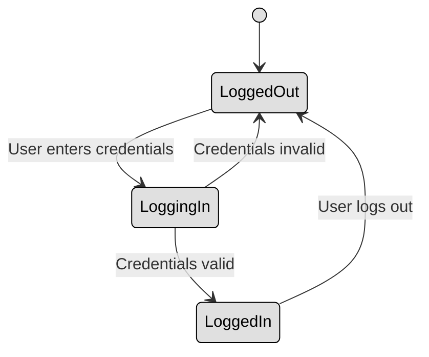

## 3.2 Understand the fundamental concepts of security models (e.g. Biba, STar Model, Bell Lapadula) ##

Security models provide structured frameworks to enforce security policies and ensure that systems operate securely. These models define rules for access control, information flow, and system security. 

A **state machine** model ensures that a system is always in a secure state. Think of a state as a snapshot of a system at a specific moment, including user permissions, data access levels, and active processes.
For a system to be considered secure, every transition between states (such as logging in, opening a file, or executing a program) must maintain security properties. This means that if a system starts in a secure state and follows the defined rules, it will always remain secure.

These are the main components of a state machine model:
| Component                 | Description                                                                   |
|--------------------------|-------------------------------------------------------------------------------|
| **States**                | The various conditions or modes a system can be in (e.g., logged in, locked). |
| **Events/Input**          | Triggers that cause state transitions (e.g., a login attempt).                |
| **Transitions**           | Rules that move the system from one state to another.                         |
| **Initial State**         | The default starting point (e.g., system off or user logged out).             |
| **Final/Accepting State** | End state or condition where a process completes.                             |

