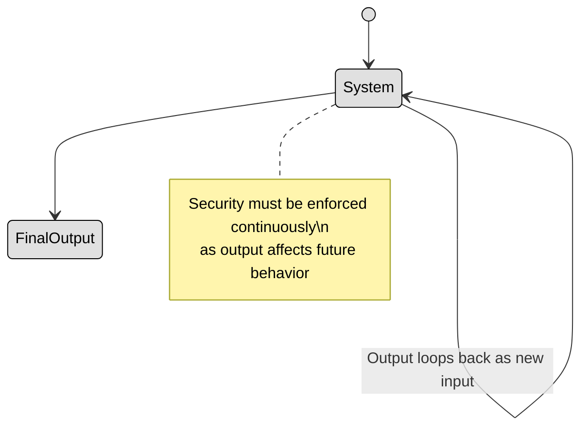

## 3.2 Understand the fundamental concepts of security models (e.g. Biba, STar Model, Bell Lapadula) ##

The **Trusted Computing Base (TCB)** refers to the core components of a system that are responsible for enforcing security. It includes:
- The Operating System Kernel
- Security mechanisms (e.g., access control, authentication)
- Hardware components that support security

If the TCB is compromised, the entire system is at risk, which is why it must be carefully designed and protected.


The **security perimeter** defines the boundary between trusted and untrusted areas of a system. It includes firewalls, encryption, access controls, and authentication mechanisms that protect internal systems from external threats.
For example a company's internal network (trusted) is separated from the internet (untrusted) by a firewall and VPN gateways, ensuring only authorized users can access internal resources.

---

**Security composition theories** help determine whether combining multiple secure systems results in an overall secure system. There are 3 composition theories:

- Cascading → System A feeds into System B. If A and B are secure, the combination should be secure.
- Feedback → System A and B influence each other. If not properly managed, security issues can arise.
- Hook-up → System A and B interact with a third system. It requires additional security evaluation.

Cascading Composition:
```mermaid
stateDiagram-v2
    [*] --> SystemA
    SystemA --> SystemB : Output of A → Input of B
    SystemB --> FinalOutput

    note right of SystemA
      System A processes input securely
    end note

    note right of SystemB
      System B must handle As output securely
    end not

    classDef center fill:#ffffff,color:#000000,stroke:#000000,stroke-width:1px,font-weight:bold
    classDef node fill:#e0e0e0,color:#000000,stroke:#000000,stroke-width:1px
```
Feedback Composition:


Hook-up composition:


---
**Security models** provide structured frameworks to enforce security policies and ensure that systems operate securely. These models define rules for access control, information flow, and system security. 

A **state machine** model ensures that a system is always in a secure state. Think of a state as a snapshot of a system at a specific moment, including user permissions, data access levels, and active processes.
For a system to be considered secure, every transition between states (such as logging in, opening a file, or executing a program) must maintain security properties. This means that if a system starts in a secure state and follows the defined rules, it will always remain secure.

These are the main components of a state machine model:
| Component                 | Description                                                                   |
|--------------------------|-------------------------------------------------------------------------------|
| **States**                | The various conditions or modes a system can be in (e.g., logged in, locked). |
| **Events/Input**          | Triggers that cause state transitions (e.g., a login attempt).                |
| **Transitions**           | Rules that move the system from one state to another.                         |
| **Initial State**         | The default starting point (e.g., system off or user logged out).             |
| **Final/Accepting State** | End state or condition where a process completes.                             |

In the following you can find a login system which is an example of a state machine model:


The **lattice** model is used in mandatory access control (MAC) systems, where data and users are assigned security labels. These labels determine who can access what, using a mathematical structure called a lattice.
The main idea is simple:

- Every user and object (files, databases, etc.) has a classification level (e.g., Top Secret, Secret, Confidential, Unclassified).

- Users can only access information at their level or lower (e.g., a Secret user can access Confidential data but not Top Secret data).

For example, in military organizations, a general with Top Secret clearance can access all classified information, while a soldier with Confidential clearance cannot see Secret or Top Secret data.

These are the main components of a state machine model:
| Component             | Description                                                                 |
|----------------------|-----------------------------------------------------------------------------|
| **Subjects**          | Active entities (e.g., users, processes) requesting access to objects.     |
| **Objects**           | Passive entities (e.g., files, databases) being accessed.                  |
| **Security Labels**   | Labels (e.g., Top Secret, Secret, Confidential) assigned to subjects/objects. |
| **Security Lattice**  | A structure defining the dominance relationship among labels.              |
| **Dominance Relation**| A rule that defines when a subject can access an object based on labels.   |
| **Access Rules**      | Determines if a subject can read/write an object based on the lattice.     |


**Information Flow** Models ensure that data flows in a secure manner, preventing leaks or unauthorized access. They focus on how information moves within a system rather than just access permissions.

Bell-LaPadula Model (Confidentiality Focused) → Prevents unauthorized reading of higher-classified data (No Read Up) and unauthorized writing to lower-classified data (No Write Down).

Biba Model (Integrity Focused) → Prevents users from modifying higher-integrity data (No Write Up) and from reading lower-integrity data (No Read Down).

For example e financial system using the Biba Model would prevent an intern from modifying critical accounting records, ensuring only senior accountants can make changes.

These are the main components of an information flow model:
| Component             | Description                                                                 |
|----------------------|-----------------------------------------------------------------------------|
| **Subjects**          | Active entities (e.g., users, programs) that send or receive information.  |
| **Objects**           | Passive entities (e.g., files, databases) involved in information exchange. |
| **Information Flow**  | The movement or transfer of data between subjects and/or objects.           |
| **Flow Policy**       | Rules that determine allowed and disallowed data flows based on labels or levels. |
| **Security Labels**   | Classifications assigned to subjects and objects (e.g., Confidential, Public). |
| **Channels**          | Logical paths or mechanisms used to transfer data.                          |
| **Direction of Flow** | Indicates whether flow is read, write, or communication between components. |


A **noninterference model** ensures that high-level users (e.g., admins, military officers) do not influence low-level users (e.g., general employees, soldiers) in a way that reveals sensitive data. The idea is that actions taken by high-privileged users should not affect what lower-privileged users see or do. This model is often used to prevent covert channels (hidden ways for users to communicate unauthorized information).

For example In a classified government database, if an admin searches for “Top Secret Spy List,” lower-level users should not notice changes in system response time (which might hint at the existence of such a list).

These are the main components of a non-interference model:
| Component             | Description                                                                 |
|----------------------|-----------------------------------------------------------------------------|
| **Subjects**          | Active entities (e.g., users, processes) interacting with the system.       |
| **High-Level Subjects (H)** | Subjects with access to sensitive or confidential data.                     |
| **Low-Level Subjects (L)** | Subjects with limited or no access to sensitive data.                        |
| **System States**     | Represent the observable behavior of the system.                             |
| **Actions**           | Operations performed by subjects (e.g., read, write, execute).               |
| **Non-Interference**  | Property stating that actions of high-level subjects must not affect what low-level subjects can observe. |
| **Observables**       | The outputs or state changes that low-level users can perceive.              |


