## 3.02 Understand the fundamental concepts of security models (e.g. Biba, Star Model, Bell Lapadula) ##

The **Trusted Computing Base (TCB)** refers to the core components of a system that are responsible for enforcing security. It includes:
- The Operating System Kernel
- Security mechanisms (e.g., access control, authentication)
- Hardware components that support security

If the TCB is compromised, the entire system is at risk, which is why it must be carefully designed and protected.

```mermaid
stateDiagram-v2
    [*] --> UserRequest
    
    UserRequest --> TCB_Evaluation : Request Resource
    
    state TCB_Evaluation {
        direction TB
        [*] --> PolicyCheck
        PolicyCheck --> Result
    }

    TCB_Evaluation --> AccessGranted : Policy Allows
    TCB_Evaluation --> AccessDenied : Policy Denies

    note right of TCB_Evaluation
        <b>TCB Requirements:</b>
        <br/>1. Evaluate all requests
        <br/>2. Tamper-proof
        <br/>3. Small enough to verify
    end note
```

The **security perimeter** defines the boundary between trusted and untrusted areas of a system. It includes firewalls, encryption, access controls, and authentication mechanisms that protect internal systems from external threats.
For example a company's internal network (trusted) is separated from the internet (untrusted) by a firewall and VPN gateways, ensuring only authorized users can access internal resources.

**Security composition theories** help determine whether combining multiple secure systems results in an overall secure system. There are 3 composition theories:

- Cascading → System A feeds into System B. If A and B are secure, the combination should be secure.
- Feedback → System A and B influence each other. If not properly managed, security issues can arise.
- Hook-up → System A and B interact with a third system. It requires additional security evaluation.

**Cascading Composition:**
```mermaid
stateDiagram-v2
    direction LR

    [*] --> SystemA
    SystemA --> SystemB : "Output A as Input B"
    SystemB --> FinalOutput

    note right of SystemA
        <b>System A:</b>
        <br/>Processes input
        <br/>at its own security level.
    end note

    note right of SystemB
        <b>System B:</b>
        <br/>Must maintain security
        <br/>of System A's data.
    end note
```
**Feedback Composition:**
```mermaid
stateDiagram-v2
    direction LR

    [*] --> SystemA
    SystemA --> SystemB : Processed Output
    SystemB --> SystemA : Feedback Loop
    SystemB --> FinalOutput

    note right of SystemA
        <b>Continuous Enforcement:</b>
        <br/>Outputs influence future
        <br/>inputs and behaviors.
    end note
```

**Hook-up composition:**
```mermaid
stateDiagram-v2
    direction TB

    state SharedEnvironment {
        [*] --> Secure_Mediation
    }

    [*] --> SystemA
    [*] --> SystemB
    
    SystemA --> SharedEnvironment : Input A
    SystemB --> SharedEnvironment : Input B
    
    SharedEnvironment --> FinalOutput

    note right of SharedEnvironment
        <b>Risk Point:</b>
        <br/>Must preserve Isolation,
        <br/>Confidentiality, & Integrity.
    end note
```

---
**Security models** provide structured frameworks to enforce security policies and ensure that systems operate securely. These models define rules for access control, information flow, and system security. 

A **state machine** model ensures that a system is always in a secure state. Think of a state as a snapshot of a system at a specific moment, including user permissions, data access levels, and active processes.
For a system to be considered secure, every transition between states (such as logging in, opening a file, or executing a program) must maintain security properties. This means that if a system starts in a secure state and follows the defined rules, it will always remain secure.

These are the main components of a state machine model:
| Component                 | Description                                                                   |
|--------------------------|-------------------------------------------------------------------------------|
| **States**                | The various conditions or modes a system can be in (e.g., logged in, locked). |
| **Events/Input**          | Triggers that cause state transitions (e.g., a login attempt).                |
| **Transitions**           | Rules that move the system from one state to another.                         |
| **Initial State**         | The default starting point (e.g., system off or user logged out).             |
| **Final/Accepting State** | End state or condition where a process completes.                             |

In the following you can find a login system which is an example of a state machine model:

```mermaid
stateDiagram-v2
    [*] --> LoggedOut
    
    LoggedOut --> LoggingIn : User Credentials
    
    state LoggingIn {
        [*] --> Verifying
    }

    LoggingIn --> LoggedIn : Valid
    LoggingIn --> LoggedOut : Invalid
    LoggedIn --> LoggedOut : Manual Logout / Timeout

    note right of LoggedIn
        <b>Active Session:</b>
        <br/>Enforce session timeout
        <br/>& secure token handling.
    end note
```

The **lattice** model is used in mandatory access control (MAC) systems, where data and users are assigned security labels. These labels determine who can access what, using a mathematical structure called a lattice.
The main idea is simple:

- Every user and object (files, databases, etc.) has a classification level (e.g., Top Secret, Secret, Confidential, Unclassified).

- Users can only access information at their level or lower (e.g., a Secret user can access Confidential data but not Top Secret data).

For example, in military organizations, a general with Top Secret clearance can access all classified information, while a soldier with Confidential clearance cannot see Secret or Top Secret data.

These are the main components of a state machine model:
| Component             | Description                                                                 |
|----------------------|-----------------------------------------------------------------------------|
| **Subjects**          | Active entities (e.g., users, processes) requesting access to objects.     |
| **Objects**           | Passive entities (e.g., files, databases) being accessed.                  |
| **Security Labels**   | Labels (e.g., Top Secret, Secret, Confidential) assigned to subjects/objects. |
| **Security Lattice**  | A structure defining the dominance relationship among labels.              |
| **Dominance Relation**| A rule that defines when a subject can access an object based on labels.   |
| **Access Rules**      | Determines if a subject can read/write an object based on the lattice.     |

```mermaid
stateDiagram-v2
    direction TB

    [*] --> RequestAccess
    RequestAccess --> CheckLabels : Evaluate Clearance vs Classification

    state CheckLabels {
        [*] --> DominanceCheck
        DominanceCheck --> Comparison : Subject Dominates Object?
    }

    CheckLabels --> AccessGranted : Rule Satisfied
    CheckLabels --> AccessDenied : Rule Violated

    note right of CheckLabels
        <b>MAC Evaluation:</b>
        <br/>Enforced by the TCB.
        <br/>Based on security labels
        <br/>(e.g., Secret vs Top Secret).
    end note
```

**Information Flow** Models ensure that data flows in a secure manner, preventing leaks or unauthorized access. They focus on how information moves within a system rather than just access permissions.

Bell-LaPadula Model (Confidentiality Focused) → Prevents unauthorized reading of higher-classified data (No Read Up) and unauthorized writing to lower-classified data (No Write Down).

Biba Model (Integrity Focused) → Prevents users from modifying higher-integrity data (No Write Up) and from reading lower-integrity data (No Read Down).

For example e financial system using the Biba Model would prevent an intern from modifying critical accounting records, ensuring only senior accountants can make changes.

These are the main components of an information flow model:
| Component             | Description                                                                 |
|----------------------|-----------------------------------------------------------------------------|
| **Subjects**          | Active entities (e.g., users, programs) that send or receive information.  |
| **Objects**           | Passive entities (e.g., files, databases) involved in information exchange. |
| **Information Flow**  | The movement or transfer of data between subjects and/or objects.           |
| **Flow Policy**       | Rules that determine allowed and disallowed data flows based on labels or levels. |
| **Security Labels**   | Classifications assigned to subjects and objects (e.g., Confidential, Public). |
| **Channels**          | Logical paths or mechanisms used to transfer data.                          |
| **Direction of Flow** | Indicates whether flow is read, write, or communication between components. |

```mermaid
stateDiagram-v2
    direction TB

    [*] --> FlowRequest
    FlowRequest --> CheckPolicy : Subject → Object Interaction

    state CheckPolicy {
        direction LR
        [*] --> ValidatePath
        ValidatePath --> SecurityMatrix : Check Directional Rules
    }

    CheckPolicy --> AllowedFlow : Authorized Transition
    CheckPolicy --> BlockedFlow : Security Policy Violation

    note right of CheckPolicy
        <b>Information Flow:</b>
        <br/>Prevents unauthorized data
        <br/>flow between security levels
        <br/>or system compartments.
    end note
```

A **noninterference model** ensures that high-level users (e.g., admins, military officers) do not influence low-level users (e.g., general employees, soldiers) in a way that reveals sensitive data. The idea is that actions taken by high-privileged users should not affect what lower-privileged users see or do. This model is often used to prevent covert channels (hidden ways for users to communicate unauthorized information).

For example In a classified government database, if an admin searches for “Top Secret Spy List,” lower-level users should not notice changes in system response time (which might hint at the existence of such a list).

These are the main components of a non-interference model:
| Component             | Description                                                                 |
|----------------------|-----------------------------------------------------------------------------|
| **Subjects**          | Active entities (e.g., users, processes) interacting with the system.       |
| **High-Level Subjects (H)** | Subjects with access to sensitive or confidential data.                     |
| **Low-Level Subjects (L)** | Subjects with limited or no access to sensitive data.                        |
| **System States**     | Represent the observable behavior of the system.                             |
| **Actions**           | Operations performed by subjects (e.g., read, write, execute).               |
| **Non-Interference**  | Property stating that actions of high-level subjects must not affect what low-level subjects can observe. |
| **Observables**       | The outputs or state changes that low-level users can perceive.              |

```mermaid
stateDiagram-v2
    direction LR

    state High_Security_Domain {
        [*] --> H_Action
        H_Action --> H_State_Change : Subject H performs action
    }

    state Low_Security_Domain {
        [*] --> L_Action
        L_Action --> L_State_Change : Subject L performs action
        L_State_Change --> L_Observation : Subject L observes result
    }

    note right of High_Security_Domain
        <b>Non-Interference:</b>
        <br/>High-level actions do <u>not</u>
        <br/>change the state observed
        <br/>by low-level subjects.
    end note

    note left of Low_Security_Domain
        <b>Isolation:</b>
        <br/>L sees only the results
        <br/>of L actions. No data
        <br/>leaks from H domain.
    end note
```

---

The **Bell–LaPadula Model (BLP)** is a mandatory access control (MAC) model designed to enforce confidentiality in secure systems. Developed in 1973 for military and government use, it prevents unauthorized access to classified data by restricting read and write operations based on security levels. 

Key Concepts of Bell–LaPadula:

- Goal: Protect confidentiality by ensuring users can only access data at or below their clearance level.
- Security Levels: Data and users are classified hierarchically (e.g., Top Secret, Secret, Confidential, Unclassified).
- Access Control: Uses Mandatory Access Control (MAC) and incorporates Discretionary Access Control (DAC) through the Discretionary Security Property.

The core Security rules of the model are:

1️. *No Read Up (Simple Security Property)*: Users cannot read data at a higher security level than their own. Prevents unauthorized users from accessing classified information. Example: A Secret-level analyst cannot read a Top Secret file.

2️. *No Write Down (Star Property, -Property)*: Users cannot write to a lower security level. Prevents leaks of sensitive information by blocking downgrades. Example: A Top Secret officer cannot save a classified report in an Unclassified document.

3️. *Discretionary Security Property (ds-property)*: Enforces additional access restrictions based on permissions set by the data owner. Even if a user has the right security level, they must also be granted access. Example: A Secret user cannot access a Secret document unless they have explicit permission.

Strengths  of the model:
- Enforces strict confidentiality (ideal for government/military).
- Prevents unauthorized access and leaks of classified data.
- Combines MAC and DAC for better security.

Limitations of the model:
- Does not protect data integrity (modifications are not controlled).
- Not suitable for commercial environments requiring flexible access.
- Vulnerable to covert channels, where users infer information indirectly.

```mermaid

stateDiagram-v2
    direction TB

    state "User (Secret Level)" as User
    state "File A (Top Secret)" as FileTS
    state "File B (Secret)" as FileS
    state "File C (Confidential)" as FileC

    User --> FileTS : "Block: Read (No Read Up)"
    User --> FileS : "Allow: Read/Write"
    User --> FileC : "Block: Write (No Write Down)"

    note right of FileTS
        <b>Simple Security:</b>
        <br/>No Read Up
    end note

    note right of FileC
        <b>Star Property (*):</b>
        <br/>No Write Down
    end note

    note left of User
        The user interacts with 
        objects above, at, and 
        below their clearance.
    end note
```

:brain: The Bell-LaPadula Model focuses on maintaining confidentiality by enforcing two (+1 ds-property) key rules: the "no read up" (a subject cannot read data at a higher security level) and the "no write down" (a subject cannot write data to a lower security level). It ensures data confidentiality by restricting access based on security clearances.

The **Biba Model** is a mandatory access control (MAC) model designed to enforce data integrity. Developed in 1977 by Kenneth Biba, it prevents unauthorized modifications to data by restricting read and write operations based on integrity levels. Unlike the Bell–LaPadula Model, which focuses on confidentiality, the Biba Model ensures that data remains accurate and unaltered. 

Key Concepts of the Biba Model

- Goal: Protect data integrity by ensuring users can only modify data at or above their integrity level.
- Integrity Levels: Data and users are classified hierarchically (e.g., High, Medium, Low).
- Access Control: Uses Mandatory Access Control (MAC) to restrict data modification.

The Core Security Rules of the Biba Model are:

1. *No Write Up (Star Integrity Property).* Users cannot write data at a higher integrity level than their own. Prevents untrusted users from modifying critical data.

2. *No Read Down (Simple Integrity Property, -Property).* Users cannot read data at a lower integrity level. Prevents contamination of high-integrity data by unreliable sources.

Strengths of the model:

- Ensures data integrity, making it ideal for financial and critical systems.
- Prevents unauthorized modifications and data corruption.
- Protects against malware by restricting low-integrity processes.

Limitations of the model:

- Does not address confidentiality (focuses only on integrity).
- Not suitable for systems where users need to access and modify lower-level data.
- Can be restrictive in dynamic environments where data needs to flow between different levels.

```mermaid
stateDiagram-v2
    direction TB

    state "User (Medium Integrity)" as User
    state "File A (High Integrity)" as FileHigh
    state "File B (Medium Integrity)" as FileMed
    state "File C (Low Integrity)" as FileLow

    User --> FileHigh : "Block: Write (No Write Up)"
    User --> FileMed : "Allow: Read/Write"
    User --> FileLow : "Block: Read (No Read Down)"

    note right of FileHigh
        <b>Star (*) Integrity:</b>
        <br/>No Write Up
    end note

    note right of FileLow
        <b>Simple Integrity:</b>
        <br/>No Read Down
    end note

    note left of User
        The goal is to prevent
        low-integrity data from
        contaminating the subject.
    end note
```

:brain: The Biba Model focuses on maintaining data integrity by enforcing two key rules: the "no write up" (a subject cannot write to a higher security level) and the "no read down" (a subject cannot read data at a lower security level). It ensures that data is not corrupted by unauthorized modifications.

The **Take-Grant Model** is an access control model used to analyze and enforce access rights in a system. It describes how rights can be transferred between subjects (users, processes) and objects (files, resources) within a system. This model is useful for understanding how permissions can propagate and whether unauthorized access can occur.

The Key Concepts of the Take-Grant Model are:

- Goal: Model and analyze how permissions spread between subjects and objects.
- Graph Representation: The system is represented as a directed graph, where:
    - Nodes represent subjects (users, processes) and objects (files, resources).
    - Edges (arrows) represent the rights that subjects have over objects.
- Access Rights: Can include read, write, execute, delete, or grant permissions.
- Two Main Operations: Take and Grant determine how permissions are transferred.

The Core Rules of the Take-Grant Model are:

1. Take Rule: A subject with take rights over another subject or object can acquire any rights from it.
2. Grant Rule: A subject with grant rights can give its access rights to another subject.
3. Create Rule: A subject can create new objects and assign permissions to them.
4. Remove Rule: A subject can remove rights it previously granted.

Strengths of the Take-Grant Model:

- Models access rights propagation clearly using a graph-based approach.
- Helps predict security risks by analyzing how permissions can spread.
- Efficient and simple to implement in many access control scenarios.

Limitations of the Take-Grant Model:

- Does not enforce access control policies, only analyzes them.
- Assumes all rights are transferable, which is not always the case in real-world systems.
- Not designed for mandatory access control (MAC) systems, where permissions are strictly defined by policies.

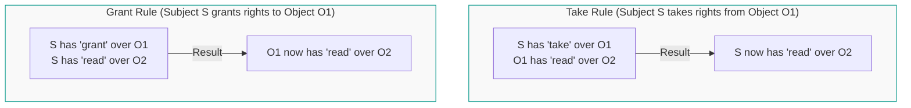

:brain: The Take-Grant Model is a permission-based access control model where subjects (users or processes) can take or grant access to objects (files, resources) based on their permissions. The model defines a set of rules that determine how permissions are transferred between subjects and objects, ensuring controlled access and authority delegation.

The **Clark-Wilson Model** is a security model designed to enforce data integrity in systems where accuracy, consistency, and authorized modifications are critical. Unlike models such as Bell–LaPadula (which focuses on confidentiality) or Biba (which focuses on integrity at a broad level), the Clark-Wilson Model ensures that only authorized users can make valid changes to data through well-defined processes. This makes it particularly useful in commercial systems, banking, and financial transactions.

Key Concepts of the Clark-Wilson Model are:

- Goal: Ensure data integrity by enforcing rules that prevent unauthorized changes.
- Separation of Duties: Users cannot modify critical data directly; instead, transactions must be approved and validated before execution.
- Transformation Procedures (TPs): Authorized processes that change data in a controlled way.
- Constrained Data Items (CDIs): Critical data that must be protected (e.g., bank records, financial transactions).
- Unconstrained Data Items (UDIs): Regular data that does not require strict controls.
- Integrity Verification Procedures (IVPs): Periodic checks that ensure data integrity is maintained.

Core Rules of the Clark-Wilson Model
1. Well-Formed Transactions: Users cannot modify critical data directly; all changes must go through authorized procedures (TPs).
2. Separation of Duties: Users cannot perform both critical functions (e.g., initiating and approving a transaction).
3. Access Control & Authentication: Only authorized users can execute Transformation Procedures (TPs) on Constrained Data Items (CDIs).
4. Integrity Verification Procedures (IVPs): The system must periodically verify data integrity and ensure that no unauthorized modifications have occurred.

Strengths of the Clark-Wilson model:

- Prevents unauthorized modifications by requiring approved transactions.
- Reduces fraud and insider threats by enforcing Separation of Duties.
- Ensures consistency and reliability, making it ideal for financial and enterprise systems.

Limitations of the Clark-Wilson model:
- More complex than other models due to its focus on transaction-based security.
- Requires strict enforcement of Transformation Procedures, which can slow down operations.
- Not designed for confidentiality, making it less useful for classified or government data protection.

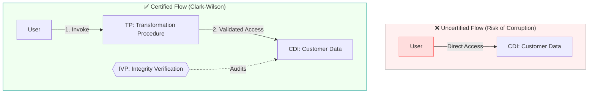

The **Brewer and Nash Model** is a conflict-of-interest security model designed to prevent users from accessing data that could create an ethical conflict. It ensures that a user cannot access sensitive information from competing organizations, preventing insider trading, financial conflicts, or biased decision-making.

Key Concepts of the Brewer and Nash Model are:
- Goal: Prevent conflicts of interest by restricting users from accessing data from competing organizations.
- Dynamic Access Control: A user’s past access history determines what they can access in the future.
- Company Dataset (CDS): A collection of files and data related to a single company.
- Conflict of Interest Class (COI): A group of companies that compete with each other (e.g., different banks, law firms, or consulting clients).
- Access Restriction: Once a user accesses one company’s data, they are blocked from accessing data from competitors within the same Conflict of Interest Class

Core Rules of the Brewer and Nash Model are:
1. Read Access Rule: A user can only read from one company within a Conflict of Interest Class (COI).
2. Write Access Rule: A user can only write to a dataset if they have not read any conflicting dataset.
3. Dynamic Security Enforcement: The model updates restrictions dynamically based on the user’s previous access history.

Strengths of the Brewer and Nash Model:

- Prevents conflicts of interest, making it ideal for law firms, auditors, and financial analysts.
- Dynamically adapts based on a user’s access history, providing strong security.
- Ensures ethical business practices by restricting access to sensitive competitor data.

Limitations of the Brewer and Nash Model:

- Not suitable for traditional access control since it focuses on conflicts of interest rather than general security.
- Hard to implement in large organizations with complex cross-business interactions.
- May restrict legitimate work if employees need to collaborate across different companies.

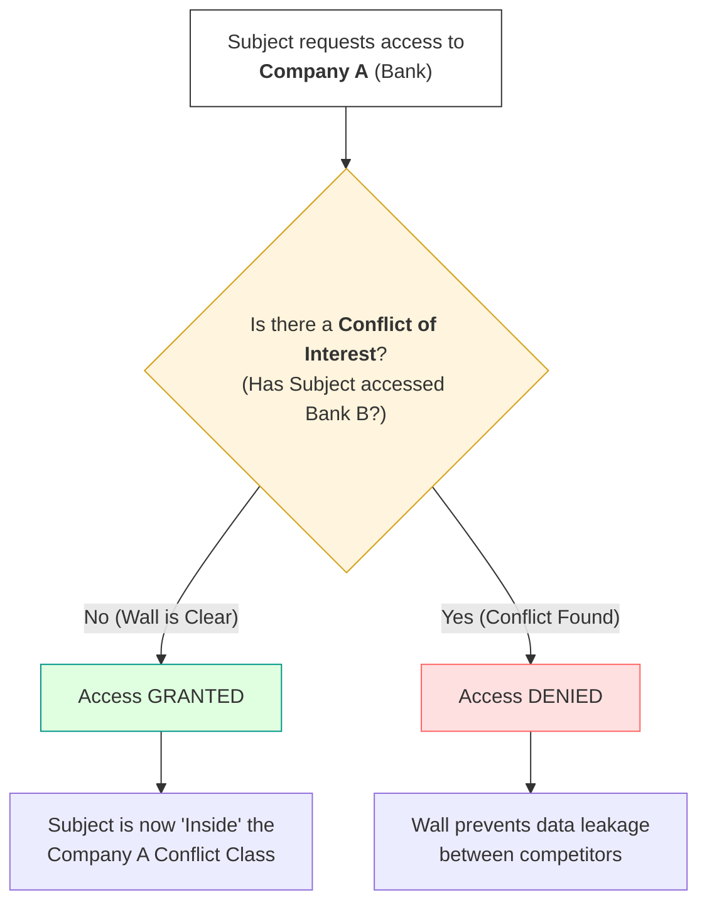

The **Graham-Denning Model** is an access control model that defines how subjects (users, processes) can securely create, delete, and manage access rights for objects (files, resources) in a system. It provides a set of rules that regulate how rights are assigned and removed, making it useful for operating systems, databases, and security policies that require structured access control mechanisms.

The Key Concepts of the Graham-Denning Model are:

- Goal: Control how subjects create, delete, and modify other subjects, objects, and their associated rights.
- Access Control Matrix (ACM): A table that tracks who has what permissions over different objects.
- Subjects: Users or processes that request access to objects.
- Objects: Files, databases, or system resources that require protection.
- Rights: Permissions such as read, write, execute, own, grant.

The model defines eight fundamental operations that manage subjects, objects, and their access rights.

Operations on Subjects and Objects
1. Create Object – A subject can create a new object (e.g., a file) and becomes its owner.
2. Create Subject – A subject can create another subject (e.g., a new user or process).
3. Delete Object – A subject can delete an object, removing all associated rights.
4. Delete Subject – A subject can delete another subject, revoking its permissions.

Operations on Access Rights
1. Read Access Rights – A subject can view the access rights assigned to an object.
2. Grant Access Rights – A subject can grant its own permissions to another subject.
3. Delete Access Rights – A subject can revoke previously assigned permissions.
4. Transfer Access Rights – A subject can pass its access rights to another subject, who then assumes control.

Strengths of the Graham-Denning model:
- Provides structured rules for managing access rights.
- Supports dynamic access control, allowing permissions to be updated as needed.
- Useful in multi-user environments, such as operating systems, cloud services, and databases.

Limitations of the Graham-Denning model:
- Does not enforce security policies on its own—it provides a framework, but implementation details must be defined.
- Focuses on access control, without addressing integrity or confidentiality like Bell–LaPadula or Biba.
- Can be complex when managing large-scale systems with many subjects and objects.

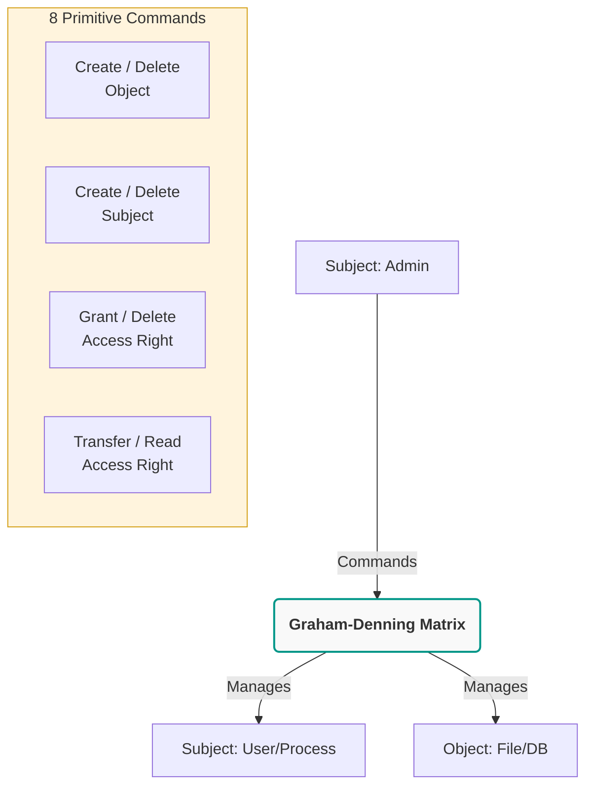

The **Harrison–Ruzzo–Ullman (HRU) Model** is an access control model that extends the Graham-Denning Model by focusing on how permissions change over time in a system. It defines a formal set of rules for creating, deleting, and modifying access rights, with an emphasis on security and computational feasibility.

The Key Concepts of the HRU Model are:
- Goal: Define a mathematical approach to managing access control while analyzing whether security policies can be enforced efficiently.
- Access Control Matrix (ACM): A table that tracks who has what permissions over different objects (similar to Graham-Denning).
- Subjects: Users or processes that request access to objects.
- Objects: Files, databases, or system resources that require protection.
- Rights: Permissions such as read, write, execute, grant, delete.

The HRU model builds on the eight operations of the Graham-Denning Model and adds a focus on security decidability, meaning it examines whether a system can always determine if it is secure. The Key Operations (Similar to Graham-Denning Model) are:
1. Create Object – A subject can create a new object and assign access rights.
2. Create Subject – A subject can create another subject.
3. Delete Object – A subject can delete an object.
4. Delete Subject – A subject can delete another subject.
5. Read Access Rights – A subject can view access rights for an object.
6. Grant Access Rights – A subject can grant its own permissions to another subject.
7. Delete Access Rights – A subject can revoke previously assigned permissions.
8. Transfer Access Rights – A subject can pass its access rights to another subject.

Strengths of the HRU Model:

- Extends Graham-Denning by formally analyzing security properties of access control.
- Allows flexible permission changes, making it useful in multi-user environments.
- Supports both discretionary (DAC) and mandatory (MAC) access control models.

Limitations of the HRU Model:

- Proves that access control security is undecidable, meaning in complex systems, it is impossible to predict if security breaches can occur.
- Can be complex to implement in large-scale systems with frequent changes.
- Not a complete security solution—it provides a framework but requires additional security policies for enforcement.

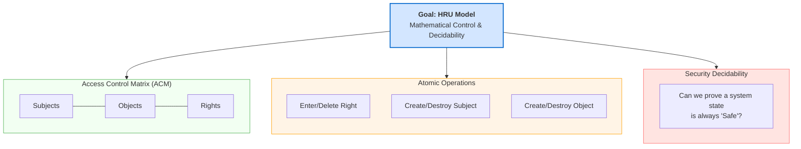

The following table recaps all the security model we have studied:

| **Model**                  | **Focus**                     | **Key Concepts**                                              | **Key Rules**                                  | **Use Case**                                     | **Pros**                                             | **Cons**                                                |
|---------------------------|-------------------------------|---------------------------------------------------------------|--------------------------------------------------|---------------------------------------------------|------------------------------------------------------|---------------------------------------------------------|
| **Bell–LaPadula (BLP)**   | Confidentiality               | Mandatory Access Control (MAC), Security Levels               | No Read Up (NRU), No Write Down (NWD)           | Military, Government, Classified Information     | Strong confidentiality enforcement                    | Does not address integrity or availability              |
| **Biba Model**            | Integrity                     | Prevents data corruption, Enforces trust levels               | No Write Up (NWU), No Read Down (NRD)           | Financial records, Data integrity systems        | Strong protection against data tampering              | Does not protect confidentiality                        |
| **Take-Grant Model**      | Access Rights Management      | Simplifies permission transfers                               | Take and Grant permissions                      | File systems, Basic access control               | Clear and efficient structure                          | Lacks complex security policies                         |
| **Clark-Wilson Model**    | Data Integrity and Control    | Well-formed transactions, Separation of Duties                | Enforces security through controlled procedures | Banking, Enterprise security                     | Prevents fraud and enforces process integrity         | Requires strong implementation mechanisms               |
| **Brewer-Nash (Chinese Wall)** | Conflict of Interest Prevention | Dynamic access based on user history                          | Restricts access to competing organizations     | Financial consulting, Legal firms, Auditing      | Prevents unethical behavior and insider threats       | Can be restrictive in collaborative environments        |
| **Graham-Denning Model**  | Access Control Management     | Subjects, Objects, and Access Rights                          | Create, Delete, Grant, Transfer Rights          | OS File Systems, Multi-user databases            | Flexible permission management                         | Lacks built-in enforcement of security policies         |
| **Harrison–Ruzzo–Ullman (HRU)** | Access Control & Security Analysis | Extends Graham-Denning, Security decidability         | Dynamic permission updates, Security state transitions | Multi-user systems, OS security              | Supports complex access control policies              | Proves that some security properties are undecidable    |

### Open Questions ###

1. How do security models help in defining access control policies within an organization?

  
Show answer

Security models help define access control policies by providing structured approaches to managing how subjects (users or processes) can interact with objects (files, databases, or systems). These models enforce specific rules that help balance confidentiality, integrity, and availability, ensuring that only authorized individuals can access sensitive resources. By using security models like Bell-LaPadula, organizations can define rules for read and write permissions, which are crucial in regulated industries.

2. What is the primary difference between the Bell-LaPadula and Biba models, and how do they apply to modern security systems?

  
Show answer

The Bell-LaPadula and Biba models focus on different aspects of security. Bell-LaPadula is centered around confidentiality and enforces policies like "no read up" and "no write down," ensuring users cannot access information beyond their clearance level. In contrast, the Biba model is focused on integrity and uses rules such as "no read down" and "no write up" to prevent unauthorized changes to data. Both models remain relevant in systems requiring clear distinctions between roles and data protection levels.

3. How does the Take-Grant model manage the delegation of access rights?

  
Show answer

The Take-Grant model controls access delegation by allowing subjects to either take or grant permissions to other subjects. This model works through a set of rules that determine how rights are transferred. If a subject has a specific permission (e.g., to read a file), they can pass that permission to another subject, but they may also be restricted from doing so based on the security rules in place, maintaining strict control over who has access to sensitive resources.

4. What role does the Lattice-based model play in multi-level security systems?

  
Show answer

Lattice-based models are used in multi-level security environments where objects have different security levels, and subjects may have varying clearance levels. The model ensures that access decisions are made based on the subject’s security clearance and the object’s sensitivity level. It helps to enforce rules such as “no read up” and “no write down,” ensuring that lower-level users cannot access more sensitive information, which is essential for environments with strict data classification.

5. How does the Clark-Wilson model ensure data integrity in access control systems?

  
Show answer

The Clark-Wilson model enforces data integrity by separating duties between users, ensuring that certain actions, such as data modifications, are only performed by authorized parties. It uses well-formed transaction rules to ensure that data is handled in a consistent and controlled way, reducing the risk of accidental or malicious corruption. This model is widely used in systems that require high data integrity, like financial applications.

6. What is the significance of mandatory access control (MAC) in security models?

  
Show answer

Mandatory access control (MAC) is significant in security models because it enforces access restrictions based on predefined rules, rather than user preferences. It reduces the risk of unauthorized access by enforcing rules that cannot be overridden by users or administrators, thus providing strong control over sensitive resources. MAC is especially valuable in high-security environments like military or government systems where strict confidentiality is paramount.

7. How can a security model be applied to cloud computing environments?

  
Show answer

Security models are crucial in cloud computing environments because they ensure that data and resources are protected across shared, distributed infrastructures. Models like Bell-LaPadula can enforce confidentiality between tenants, while other models can regulate the delegation of access rights and ensure that only authorized users can interact with specific cloud resources. This is important for compliance with regulations like GDPR or HIPAA in multi-tenant environments.

8. In what ways do security models like the Brewer-Nash model address conflicts of interest?

  
Show answer

The Brewer-Nash model addresses conflicts of interest by preventing individuals from accessing sensitive information that could create a conflict of interest in decision-making. Often used in business and governmental contexts, the model ensures that a user cannot access confidential data from competing departments or entities, thereby preventing situations where confidential information might be misused for personal or organizational gain.

9. What are the key limitations of using traditional security models in today's complex IT environments?

  
Show answer

Traditional security models may struggle with today’s complex IT environments, which often include cloud-based systems, remote workforces, and interconnected global networks. These environments present challenges such as dynamic access control, scalability, and the need for real-time security adaptations. While older models provide a strong theoretical framework, they must often be adapted or combined with modern techniques like zero-trust or risk-based models to meet today’s security needs.

10. How do security models help in ensuring the principle of least privilege is maintained?

  
Show answer

Security models play a crucial role in enforcing the principle of least privilege by clearly defining which users can access what resources and for what purposes. By applying security models such as the Bell-LaPadula or Biba model, organizations can restrict access based on the user's role and needs, ensuring that individuals only have the minimum level of access required to perform their job functions, thus reducing the risk of accidental or intentional misuse of sensitive information.

---

