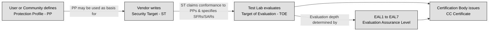
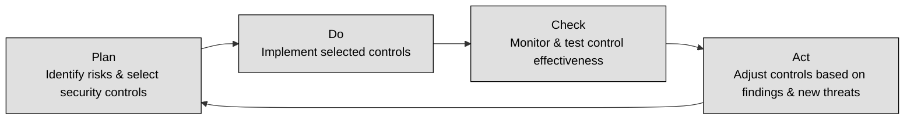

## 3.3 Select Controls based upon system security requirements ##

Security controls are essential for ensuring that IT systems meet security objectives, such as confidentiality, integrity, and availability (CIA). The process of selecting controls is influenced by security evaluation criteria, certification standards, authorization processes, and governance frameworks.

**TCSEC**, commonly called the Orange Book, was developed by the U.S. Department of Defense in the 1980s to assess security features in computer systems.The Key Concepts in TCSEC are:

- Focus: Primarily on confidentiality (protecting data from unauthorized access).
- Evaluation Levels: Classifies systems into categories based on security capabilities.
- Limitations: Does not cover integrity or availability and lacks guidance for network security.

| Class    | Description                                                                                             |
|----------|---------------------------------------------------------------------------------------------------------|
| **D**    | Minimal protection: reserved for systems evaluated but failing to qualify for higher classes :contentReference[oaicite:1]{index=1} |
| **C1 & C2** | Discretionary protection (DAC): – **C1**: basic Discretionary Access Control with user/data separation and identification/authentication; – **C2**: finer‑grained DAC, individual login accountability, auditing, object reuse, and resource isolation :contentReference[oaicite:2]{index=2} |
| **B1–B3** | Mandatory protection (MAC) and security labeling: – **B1**: labeled security protection with informal policy model and mandatory labeling; – **B2**: structured protection—formal security policy model, covert‑channel analysis, strengthened authentication, configuration management; – **B3**: security domains—reference‑monitor properties (tamper‑proof, complete mediation, analyzable), minimized trusted code, intrusion detection, trusted recovery procedures :contentReference[oaicite:3]{index=3} |
| **A1**   | Verified design: functionally equivalent to B3 but adds formal top‑level specification and formal verification methods for design and implementation, trusted distribution, and rigorous assurance techniques :contentReference[oaicite:4]{index=4} |

**ITSEC** was created by European countries to improve upon TCSEC. Unlike TCSEC, ITSEC:

- Evaluates integrity and availability, not just confidentiality.
- Separates functionality from assurance levels (how well security is tested).
- Provides modular evaluation, allowing different aspects of security to be assessed independently.

The table below makes a comparison between TCSEC and ITSEC:

| Feature        | TCSEC (Orange Book)                              | ITSEC                                                   |
|----------------|--------------------------------------------------|----------------------------------------------------------|
| **Focus**      | Confidentiality only                             | Confidentiality, Integrity, and Availability  |
| **Evaluation** | Fixed security classes                           | Modular evaluation: separate **Functionality (F)** and **Assurance (E)** levels  |
| **Flexibility**| Rigid, predefined hierarchy                      | More adaptable; customizable to specific system needs |

TCSEC and ITSEC were both replaced by **Common Criteria (CC)** as the global standard.
Common Criteria (CC) is an internationally recognized standard (ISO/IEC 15408) that evaluates IT products for security. It was created to unify TCSEC, ITSEC, and other national evaluation methods into a single framework.

The Components of Common Criteria are:

- Protection Profiles (PPs): Define security requirements for specific types of products (e.g., firewalls, operating systems).
- Security Targets (STs): Define security requirements for an individual product under evaluation.
- SFR (Security Functional Requirement): Specifies an individual security function the Target of Evaluation must provide—such as how roles are authenticated—with selections drawn from a standardized Common Criteria catalog that allows variability across evaluations 
- SAR (Security Assurance Requirement): Describes the assurance processes during development and evaluation (e.g. source code control, functional testing) that provide confidence the product correctly implements its claimed security functionalities, chosen from a CC-defined catalog 
- TOE (Target of Evaluation): The specific product or system being evaluated under Common Criteria, including its hardware, firmware, software (and documentation) that is subject to testing against its Security Targe
- Evaluation Assurance Levels (EALs): Rank products on a scale of EAL1 to EAL7 based on the depth of testing.

The following table recaps the Common Criteria Evaluation Assurance Levels:

| **EAL**  | **Description**                                      |
|----------|------------------------------------------------------|
| EAL1     | Functionally tested (lowest assurance)              |
| EAL2     | Structurally tested                                  |
| EAL3     | Methodically tested and checked                      |
| EAL4     | Methodically designed, tested, and reviewed          |
| EAL5     | Semi‑formally designed and tested                    |
| EAL6     | Semi‑formally verified design and tested             |
| EAL7     | Formally verified design and tested (highest assurance) |

CC is important and developed for the following reasons:

- Global recognition – Accepted by many countries for security certification.
- Standardized security assessments – Allows organizations to compare the security of different products.
- Flexibility – Vendors can define custom security targets.

Common Criteria is widely used in government procurement, financial institutions, and critical infrastructure.

:brain: The Common Criteria (CC) is a framework for evaluating and certifying the security of information technology products, focusing on defining security requirements and assurance levels to ensure trustworthiness and functionality.

:link: The [Common Criteria Portal](https://www.commoncriteriaportal.org/index.cfm)

---

Security frameworks are structured sets of guidelines, standards, and best practices that help organizations manage and protect their information systems. They offer a systematic approach to risk management, ensuring that security controls are properly implemented, maintained, and continually improved. By providing a blueprint for establishing a secure environment, these frameworks assist organizations in meeting regulatory requirements, reducing vulnerabilities, and safeguarding critical assets.

At their core, security frameworks outline processes for identifying risks, selecting appropriate controls, and monitoring the effectiveness of these controls. They typically include:

- Governance and Policy: Guidelines to align security initiatives with business objectives and regulatory requirements.
- Risk Management: Processes for assessing threats, vulnerabilities, and potential impacts, enabling organizations to prioritize security investments.
- Control Implementation: Detailed recommendations for deploying technical, administrative, and physical controls.
- Continuous Monitoring and Improvement: Strategies for regularly evaluating security posture and making iterative improvements, often using models like the Deming Cycle (Plan-Do-Check-Act).

Several widely recognized security frameworks serve various industries and regulatory environments:

- NIST 800-53: Developed by the National Institute of Standards and Technology (NIST), this framework provides a comprehensive catalog of security controls tailored for U.S. federal information systems. It is highly regarded for its detailed risk management approach and is also adopted by private sector organizations aiming for robust security postures.

- ISO/IEC 27001: This international standard specifies the requirements for establishing, implementing, maintaining, and continually improving an Information Security Management System (ISMS). ISO 27001 is used by organizations worldwide to systematically manage sensitive information, balancing the need for security with operational efficiency.

- COBIT (Control Objectives for Information and Related Technologies): COBIT focuses on IT governance and aligns IT practices with business objectives. It provides a framework for ensuring that IT investments support business goals while effectively managing risks and resources.

- PCI DSS (Payment Card Industry Data Security Standard): Specifically designed to protect cardholder data, PCI DSS outlines security requirements for organizations that handle credit card transactions. This framework is crucial for maintaining trust in payment systems and preventing data breaches in the financial sector.

The choice of framework often depends on an organization’s industry, regulatory landscape, and specific risk profile. Some organizations may adopt a single framework, while others integrate elements from multiple frameworks to address diverse aspects of security management. Regardless of the approach, the key is to create a robust, adaptable, and measurable security strategy that evolves with emerging threats and business changes.

🔗 Refer also to   [1.3 Evaluate, apply and sustain security governance principles](https://github.com/lorenzoleonelli/CISSP-Zero-to-Hero/blob/main/DOMAIN1%3A%20Security%20and%20Risk%20Management/1.03%20Evaluate%2C%20apply%2C%20and%20sustain%20security%20governance%20principles.md#134-security-control-frameworks-eg-international-organization-for-standardization-iso-national-institute-of-standards-and-technology-nist-control-objectives-for-information-and-related-technology-cobit-sherwood-applied-business-security-architecture-sabsa-payment-card-industry-pci-federal-risk-and-authorization-management-program-fedramp)

The **Deming Cycle (Plan-Do-Check-Act or PDCA)** is a continuous improvement model used in security management.
Applying PDCA to Security Controls consists in the following phases:
Plan – Identify risks and select appropriate security controls.
Do – Implement the selected security controls.
Check – Continuously monitor and test controls to ensure effectiveness.
Act – Adjust controls based on findings and emerging threats.

 :necktie: PDCA ensures that security controls remain effective as threats evolve.

 

