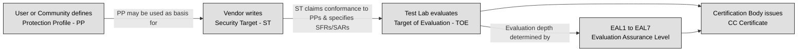
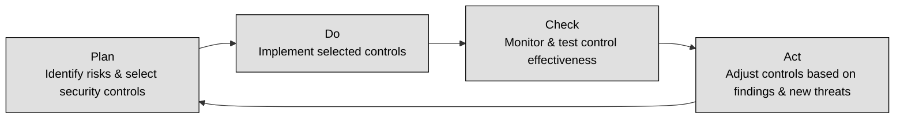

## 3.3 Select Controls based upon system security requirements ##

Security controls are essential for ensuring that IT systems meet security objectives, such as confidentiality, integrity, and availability (CIA). The process of selecting controls is influenced by security evaluation criteria, certification standards, authorization processes, and governance frameworks.

**TCSEC**, commonly called the Orange Book, was developed by the U.S. Department of Defense in the 1980s to assess security features in computer systems.The Key Concepts in TCSEC are:

- Focus: Primarily on confidentiality (protecting data from unauthorized access).
- Evaluation Levels: Classifies systems into categories based on security capabilities.
- Limitations: Does not cover integrity or availability and lacks guidance for network security.

| Class    | Description                                                                                             |
|----------|---------------------------------------------------------------------------------------------------------|
| **D**    | Minimal protection: reserved for systems evaluated but failing to qualify for higher classes|
| **C1 & C2** | Discretionary protection (DAC): – **C1**: basic Discretionary Access Control with user/data separation and identification/authentication; – **C2**: finer‑grained DAC, individual login accountability, auditing, object reuse, and resource isolation |
| **B1–B3** | Mandatory protection (MAC) and security labeling: – **B1**: labeled security protection with informal policy model and mandatory labeling; – **B2**: structured protection—formal security policy model, covert‑channel analysis, strengthened authentication, configuration management; – **B3**: security domains—reference‑monitor properties (tamper‑proof, complete mediation, analyzable), minimized trusted code, intrusion detection, trusted recovery procedures |
| **A1**   | Verified design: functionally equivalent to B3 but adds formal top‑level specification and formal verification methods for design and implementation, trusted distribution, and rigorous assurance techniques  |

**ITSEC** was created by European countries to improve upon TCSEC. Unlike TCSEC, ITSEC:

- Evaluates integrity and availability, not just confidentiality.
- Separates functionality from assurance levels (how well security is tested).
- Provides modular evaluation, allowing different aspects of security to be assessed independently.

The table below makes a comparison between TCSEC and ITSEC:

| Feature        | TCSEC (Orange Book)                              | ITSEC                                                   |
|----------------|--------------------------------------------------|----------------------------------------------------------|
| **Focus**      | Confidentiality only                             | Confidentiality, Integrity, and Availability  |
| **Evaluation** | Fixed security classes                           | Modular evaluation: separate **Functionality (F)** and **Assurance (E)** levels  |
| **Flexibility**| Rigid, predefined hierarchy                      | More adaptable; customizable to specific system needs |

TCSEC and ITSEC were both replaced by **Common Criteria (CC)** as the global standard.
Common Criteria (CC) is an internationally recognized standard (ISO/IEC 15408) that evaluates IT products for security. It was created to unify TCSEC, ITSEC, and other national evaluation methods into a single framework.

The Components of Common Criteria are:

- Protection Profiles (PPs): Define security requirements for specific types of products (e.g., firewalls, operating systems).
- Security Targets (STs): Define security requirements for an individual product under evaluation.
- SFR (Security Functional Requirement): Specifies an individual security function the Target of Evaluation must provide—such as how roles are authenticated—with selections drawn from a standardized Common Criteria catalog that allows variability across evaluations 
- SAR (Security Assurance Requirement): Describes the assurance processes during development and evaluation (e.g. source code control, functional testing) that provide confidence the product correctly implements its claimed security functionalities, chosen from a CC-defined catalog 
- TOE (Target of Evaluation): The specific product or system being evaluated under Common Criteria, including its hardware, firmware, software (and documentation) that is subject to testing against its Security Targe
- Evaluation Assurance Levels (EALs): Rank products on a scale of EAL1 to EAL7 based on the depth of testing.

The following table recaps the Common Criteria Evaluation Assurance Levels:

| **EAL**  | **Description**                                      |
|----------|------------------------------------------------------|
| EAL1     | Functionally tested (lowest assurance)              |
| EAL2     | Structurally tested                                  |
| EAL3     | Methodically tested and checked                      |
| EAL4     | Methodically designed, tested, and reviewed          |
| EAL5     | Semi‑formally designed and tested                    |
| EAL6     | Semi‑formally verified design and tested             |
| EAL7     | Formally verified design and tested (highest assurance) |

CC is important and developed for the following reasons:

- Global recognition – Accepted by many countries for security certification.
- Standardized security assessments – Allows organizations to compare the security of different products.
- Flexibility – Vendors can define custom security targets.

Common Criteria is widely used in government procurement, financial institutions, and critical infrastructure.

:brain: The Common Criteria (CC) is a framework for evaluating and certifying the security of information technology products, focusing on defining security requirements and assurance levels to ensure trustworthiness and functionality.

:brain: Common Criteria provides assurance that the process of specification, implementation and evaluation of a computer security product has been conducted in a rigorous and standard and repeatable manner at a level that is commensurate with the target environment for use. Common Criteria maintains a list of certified products, including operating systems, access control systems, databases, and key management systems.

:link: The [Common Criteria Portal](https://www.commoncriteriaportal.org/index.cfm)

---

**Security frameworks** are structured sets of guidelines, standards, and best practices that help organizations manage and protect their information systems. They offer a systematic approach to risk management, ensuring that security controls are properly implemented, maintained, and continually improved. By providing a blueprint for establishing a secure environment, these frameworks assist organizations in meeting regulatory requirements, reducing vulnerabilities, and safeguarding critical assets.

At their core, security frameworks outline processes for identifying risks, selecting appropriate controls, and monitoring the effectiveness of these controls. They typically include:

- Governance and Policy: Guidelines to align security initiatives with business objectives and regulatory requirements.
- Risk Management: Processes for assessing threats, vulnerabilities, and potential impacts, enabling organizations to prioritize security investments.
- Control Implementation: Detailed recommendations for deploying technical, administrative, and physical controls.
- Continuous Monitoring and Improvement: Strategies for regularly evaluating security posture and making iterative improvements, often using models like the Deming Cycle (Plan-Do-Check-Act).

Several widely recognized security frameworks serve various industries and regulatory environments:

- NIST 800-53: Developed by the National Institute of Standards and Technology (NIST), this framework provides a comprehensive catalog of security controls tailored for U.S. federal information systems. It is highly regarded for its detailed risk management approach and is also adopted by private sector organizations aiming for robust security postures.

- ISO/IEC 27001: This international standard specifies the requirements for establishing, implementing, maintaining, and continually improving an Information Security Management System (ISMS). ISO 27001 is used by organizations worldwide to systematically manage sensitive information, balancing the need for security with operational efficiency.

- COBIT (Control Objectives for Information and Related Technologies): COBIT focuses on IT governance and aligns IT practices with business objectives. It provides a framework for ensuring that IT investments support business goals while effectively managing risks and resources.

- PCI DSS (Payment Card Industry Data Security Standard): Specifically designed to protect cardholder data, PCI DSS outlines security requirements for organizations that handle credit card transactions. This framework is crucial for maintaining trust in payment systems and preventing data breaches in the financial sector.

The choice of framework often depends on an organization’s industry, regulatory landscape, and specific risk profile. Some organizations may adopt a single framework, while others integrate elements from multiple frameworks to address diverse aspects of security management. Regardless of the approach, the key is to create a robust, adaptable, and measurable security strategy that evolves with emerging threats and business changes.

🔗 Refer also to   [1.3 Evaluate, apply and sustain security governance principles](https://github.com/lorenzoleonelli/CISSP-Zero-to-Hero/blob/main/DOMAIN1%3A%20Security%20and%20Risk%20Management/1.03%20Evaluate%2C%20apply%2C%20and%20sustain%20security%20governance%20principles.md#134-security-control-frameworks-eg-international-organization-for-standardization-iso-national-institute-of-standards-and-technology-nist-control-objectives-for-information-and-related-technology-cobit-sherwood-applied-business-security-architecture-sabsa-payment-card-industry-pci-federal-risk-and-authorization-management-program-fedramp)

The **Deming Cycle (Plan-Do-Check-Act or PDCA)** is a continuous improvement model used in security management.
Applying PDCA to Security Controls consists in the following phases:
Plan – Identify risks and select appropriate security controls.
Do – Implement the selected security controls.
Check – Continuously monitor and test controls to ensure effectiveness.
Act – Adjust controls based on findings and emerging threats.

 :necktie: PDCA ensures that security controls remain effective as threats evolve.

 ### Open Questions ###

1. How does the TCSEC (Orange Book) influence the selection of security controls for an information system?

  
Show answer

TCSEC was one of the first frameworks to provide guidelines for selecting security controls based on the security classification of a system. Systems are categorized into levels (e.g., A, B, C, D) based on their security functionality, with each level requiring specific controls. These controls ensure that systems meet necessary standards for confidentiality, integrity, and availability, and they provide a structured approach to selecting security mechanisms based on the system's classification.

2. What role does ITSEC play in determining the appropriate security controls for different system categories?

  
Show answer

ITSEC expanded on TCSEC by offering a more flexible and detailed set of guidelines for evaluating security in systems. It introduces the concept of "assurance levels," which refer to the confidence that can be placed in the effectiveness of security controls. ITSEC emphasizes both functional security requirements and assurance measures, which guide the selection of controls that meet both the system’s security needs and evaluation criteria.

3. How do Common Criteria (CC) certifications impact the selection of security controls in both commercial and governmental environments?

  
Show answer

Common Criteria is a global standard for evaluating and certifying information security products and systems. It focuses on defining functional security requirements and providing assurance levels based on system evaluation. When selecting security controls, CC provides a detailed set of guidelines for assessing the functionality, trustworthiness, and security levels needed for a particular system, ensuring that these controls are appropriately mapped to the system's security goals.

4. How can security frameworks, such as NIST or ISO 27001, guide the process of selecting security controls?

  
Show answer

Security frameworks like NIST’s SP 800-53, ISO 27001, and COBIT provide structured, comprehensive approaches for selecting security controls across various sectors. These frameworks help organizations align their security controls with best practices, regulatory requirements, and operational needs. By adopting a security framework, organizations can systematically select and implement controls that meet both security and business requirements.

5. In what ways does the Deming Cycle (Plan-Do-Check-Act) help in continuously selecting and refining security controls?

  
Show answer

The Deming Cycle emphasizes continuous improvement, and it can be applied to the process of selecting and refining security controls. In the "Plan" phase, organizations assess their security requirements and select appropriate controls. In the "Do" phase, the controls are implemented, and in the "Check" phase, their effectiveness is evaluated. In the "Act" phase, adjustments are made to improve the controls, making it a cyclical and adaptive process that ensures controls remain effective in the face of evolving threats.

6. How does the classification of a system under TCSEC affect the types of security controls selected for it?

  
Show answer

TCSEC categorizes systems into different security classes, such as C2, B2, or A1, with each class requiring specific security controls. For example, higher classifications such as A1 require stringent security features like formal methods and detailed auditing mechanisms, while lower classifications, such as C2, may have less demanding requirements. This classification helps determine the necessary controls based on the system's sensitivity and criticality.

7. How do different security frameworks (e.g., NIST, ISO 27001, COBIT) address the selection of security controls across various layers of an organization’s IT environment?

  
Show answer

Frameworks like NIST and ISO 27001 offer guidance on selecting controls across multiple layers, such as governance, operations, and technology. NIST’s CSF (Cybersecurity Framework) helps organizations assess risk and select controls for all areas of IT security, from identity management to incident response. These frameworks align security controls with business objectives, ensuring comprehensive protection and compliance across the organization.

8. What challenges might arise when aligning security controls with international standards like ITSEC or Common Criteria?

  
Show answer

One of the challenges of aligning security controls with ITSEC and CC standards is their international scope and sometimes differing interpretations of security requirements. For example, while ITSEC is more focused on assurance, Common Criteria emphasizes both functional requirements and trust levels. These differing focuses can make it difficult to harmonize security controls across diverse regulatory environments or multi-national organizations.

9. How can the Deming Cycle be applied to the iterative process of selecting, testing, and improving security controls over time?

  
Show answer

The Deming Cycle is integral in continuously improving security controls by regularly assessing and refining them. Organizations can use the "Check" phase to conduct regular audits and penetration tests, ensuring that controls are still effective. As the threat landscape evolves, the "Act" phase allows security teams to implement updates, making sure that controls are up-to-date and relevant.

10. How do TCSEC, ITSEC, and CC standards complement or conflict with each other when selecting security controls for a complex system?

  
Show answer

TCSEC, ITSEC, and CC provide complementary guidance for selecting security controls by addressing both functional security needs and assurance levels. However, they can sometimes conflict in terms of focus. For example, TCSEC’s focus on trusted computing environments might not fully align with CC’s more flexible, vendor-driven approach.

