## 3.5 Assess and mitigate the vulnerabilities of security architectures, designs and solution elements ##

A **Single Point of Failure (SPOF)** is a part of a system that, if it fails, causes the entire system or a significant part of it to stop working. This makes the system vulnerable because there is no backup or redundancy to keep it running.
For example, imagine a business that relies on a single internet provider. If that provider goes down, the business loses access to the internet, affecting communication, transactions, and daily operations. In contrast, having multiple providers ensures that if one fails, another can take over, reducing downtime.
SPOFs exist in many areas, including hardware (like a single server hosting a critical application), software (like a single database without replication), and even personnel (like only one person knowing a crucial system's configuration). Eliminating SPOFs often involves redundancy, backup systems, and failover mechanisms to ensure that if one component fails, another takes its place.

:necktie: To minimize the risk of a Single Point of Failure (SPOF), implement redundancy across critical systems, such as using multiple internet providers, servers, and backup processes, ensuring system resilience even in the event of a failure. Regularly audit and reinforce security mechanisms to prevent bypass controls and race conditions, while utilizing countermeasures like synchronization, encryption, and shielding to protect against emanation-based threats.

**Bypass controls** refer to situations where security mechanisms can be intentionally or unintentionally circumvented, allowing unauthorized actions to occur. These can be designed for legitimate reasons, such as emergency access for administrators, but they can also be exploited by attackers.
A common example is a "backdoor" in software that allows an administrator to access a system even if standard authentication fails. While this might be useful for troubleshooting, attackers can exploit it to gain unauthorized access.
Bypass controls can also occur in physical security. Imagine a building with strict badge access but a propped-open back door. Even though strong controls exist at the main entrance, the bypassed control makes them ineffective.
To prevent security bypasses, organizations must regularly audit security controls, restrict backdoor access, and monitor for unusual activity that might indicate someone is avoiding standard security procedures.

A **race condition** happens when multiple processes or threads try to access or modify the same resource at the same time, leading to unpredictable behavior. This occurs because the system executes tasks in an order that was not intended, potentially causing errors or security vulnerabilities.
Imagine two people trying to withdraw money from the same bank account at the exact same time. If the system does not properly lock the account balance before processing transactions, both withdrawals might go through based on the same balance, even though there was only enough money for one transaction. This could lead to an overdraft or incorrect accounting.
In cybersecurity, race conditions can be exploited to gain unauthorized access, escalate privileges, or cause system failures. Attackers may repeatedly request access to a resource before security checks can complete, tricking the system into granting them access.
To prevent race conditions, developers use synchronization mechanisms such as locks, queues, and atomic operations to ensure that processes execute in the correct order and do not interfere with each other.

**Emanations** refer to unintentional signals or data leaks that electronic devices produce, which can be intercepted and used to extract sensitive information. These signals can come from radio frequencies, electrical signals, or even visual cues like screen reflections.
For example, an unshielded computer monitor can emit electromagnetic signals that, with the right equipment, can be reconstructed to display what is on the screen from a distance. Similarly, keyboards generate electromagnetic waves when typing, which can be intercepted to determine what keys are being pressed.
To protect against emanation-based attacks, organizations use shielding techniques such as Faraday cages, specialized hardware that blocks signal emissions, or encrypted transmissions to ensure that intercepted signals do not reveal useful information. The TEMPEST standard is an example of a government effort to protect against emanation risks, particularly in military and intelligence environments.
Emanations are often overlooked in security planning, but they present a real risk when dealing with highly sensitive environments. Proper countermeasures ensure that even if an attacker is nearby, they cannot easily capture or reconstruct confidential information.

```mermaid
graph TD
    A[Security Concepts Overview]

    A --> SPOF[Single Point of Failure - SPOF]
    SPOF --> SPOF1[Definition: A component whose failure disrupts the whole system]
    SPOF --> SPOF2[Examples: Single server, internet provider, lone expert]
    SPOF --> SPOF3[Mitigation: Redundancy, backups, failover systems]

    A --> BYPASS[Bypass Controls]
    BYPASS --> BYPASS1[Definition: Security mechanisms that can be circumvented]
    BYPASS --> BYPASS2[Examples: Software backdoors, propped open door]
    BYPASS --> BYPASS3[Mitigation: Audits, restrict backdoor use, monitor behavior]

    A --> RACE[Race Conditions]
    RACE --> RACE1[Definition: Concurrent access causes unpredictable behavior]
    RACE --> RACE2[Examples: Simultaneous withdrawals, privilege escalation]
    RACE --> RACE3[Mitigation: Locks, queues, atomic operations]

    A --> EMAN[Emanations]
    EMAN --> EMAN1[Definition: Unintentional data leaks from electronic signals]
    EMAN --> EMAN2[Examples: Monitor RF leaks, keyboard signal capture]
    EMAN --> EMAN3[Mitigation: Shielding, Faraday cages, encrypted signals, TEMPEST]

classDef center fill:#ffffff,color:#000000,stroke:#000000,stroke-width:1px,font-weight:bold
classDef node fill:#e0e0e0,color:#000000,stroke:#000000,stroke-width:1px
```

| **Concept**          | **Definition**                                                                                     | **Examples**                                                                                          | **Countermeasures**                                                                                  |
|----------------------|----------------------------------------------------------------------------------------------------|--------------------------------------------------------------------------------------------------------|--------------------------------------------------------------------------------------------------------|
| **SPOF**             | A single component whose failure causes a system-wide outage.                                      | Single internet provider, single server, lone administrator.                                          | Add redundancy, use failover systems, train multiple staff.                                            |
| **Bypass Controls**  | Mechanisms that can be circumvented, allowing unauthorized access.                                 | Software backdoors, propped-open doors bypassing badge access.                                        | Audit controls, restrict backdoor use, monitor activity.                                               |
| **Race Conditions**  | Unpredictable behavior from simultaneous access to shared resources.                               | Double withdrawal from same bank account, privilege escalation race attacks.                          | Use locks, queues, and atomic operations to manage access.                                             |
| **Emanations**       | Unintentional signals from devices that can leak sensitive data.                                   | EM leaks from monitors or keyboards intercepted remotely.                                              | Use Faraday cages, signal shielding, encrypted transmission, follow TEMPEST standards.                |

### Open Questions ###

1. Why is identifying and eliminating single points of failure (SPOFs) essential in designing resilient systems?

  
Show answer

Because SPOFs represent vulnerabilities that can bring down an entire system if one component fails. Eliminating them increases system availability and reliability by ensuring there are backups or failover mechanisms in place.

2. How can redundancy help mitigate the risk associated with SPOFs, and what are some practical examples?

  
Show answer

Redundancy involves having backup components that can take over in case of failure. For example, using multiple internet providers, redundant power supplies, or mirrored servers ensures that if one fails, the system keeps running.

3. What are bypass controls in cybersecurity, and why can they be both useful and dangerous?

  
Show answer

Bypass controls are mechanisms that allow users or systems to circumvent normal security processes. They’re useful for emergency access or maintenance but dangerous because attackers can exploit them to gain unauthorized access if not properly monitored and secured.

4. Can you describe a real-world scenario where a security bypass might unintentionally be introduced, and what the consequences might be?

  
Show answer

An example is when employees prop open a secure door for convenience, bypassing badge access. This could allow unauthorized individuals to enter, potentially leading to data theft or physical damage.

5. What is a race condition in computing, and how can it be exploited in a security context?

  
Show answer

A race condition occurs when the timing of multiple processes leads to unexpected outcomes. In security, attackers might exploit race conditions to access resources or execute actions before security checks complete, potentially leading to privilege escalation or data corruption.

6. What types of controls or practices help developers prevent race conditions in software?

  
Show answer

Developers use synchronization techniques like locks, semaphores, queues, and atomic operations to manage access to shared resources and ensure consistent, predictable behavior.

7. How can attackers exploit emanations, and what are the most effective defenses against these types of threats?

  
Show answer

Attackers can capture unintentional emissions like electromagnetic signals from monitors or keyboards to reconstruct sensitive data. Defenses include using shielded equipment, implementing Faraday cages, encrypting emissions, and following TEMPEST standards in sensitive environments.

---

## 3.5.1 Client-based systems ##

Client-based systems are systems where the client-side (usually the user's device or browser) plays a significant role in processing, data storage, or rendering. Examples include:

- Web applications (running in the browser)
- Mobile apps
- Desktop software that connects to a backend API

When you use a system where your computer (the client) connects to a central server, there are two main areas where security issues can arise:

- Problems with the client application itself – This includes software bugs, outdated applications, or insecure coding practices.
- Problems with the system running the client – Even if the software is well-designed, it won’t matter if the operating system or hardware is vulnerable.

1. Weaknesses in How the Client Operates. Some client security issues come from insecure behaviors or misconfigurations, such as:

- Storing sensitive data in a way that unauthorized users can easily access (e.g., leaving temporary files unprotected on the local system).
- Running outdated or unpatched software, which leaves known security holes open for attackers.

3. Problems with How the Client Communicates with the Server. Many vulnerabilities arise when the client connects to a remote server but fails to secure that communication properly. Issues include:

- Not verifying the identity of the server – The client could end up connecting to a fake (malicious) server.
- Not checking or sanitizing data from the server – If the client accepts any data without validation, attackers can send harmful input that may lead to security breaches.
- Lack of encryption – Without secure protocols, attackers can intercept and read sensitive data.
- Failure to detect if the data has been tampered with – If no integrity checks are in place, hackers could modify the information in transit.
- Executing commands from the server without validation – A compromised server could send malicious instructions that the client blindly follows.

Clients often rely on third-party components, such as libraries or plugins (e.g., Java). These add-ons must be included in a vulnerability management program, ensuring that any newly discovered flaws are patched quickly.

For **web-based applications**, browsers must be hardened by following security guidelines from trusted sources like the Center for Internet Security (CIS) and the Defense Information Systems Agency (DISA). Similarly, the underlying operating system should also be secured and kept up to date.

Beyond software security, protecting the client system also means implementing:
- Firewalls to block unauthorized network access.
- Physical security controls to prevent device theft or tampering.
- Full-disk encryption to protect stored data in case of a system compromise.

When organizations develop their **own client applications**, they must follow secure software development practices to prevent vulnerabilities from being introduced in the first place. A structured development approach, ensures that security is built into the software from the start.

:link: Refer also to chapter 8 TBD

:necktie: Assume the client is hostile — validate everything server-side

### Open Questions ###

1. What are some common vulnerabilities found in client applications, and how can they be mitigated?

  
Show answer

Common client-side vulnerabilities include storing sensitive data insecurely (like unprotected temp files), running outdated software, and using poorly coded applications. These can be mitigated by regularly applying patches, following secure coding practices, and avoiding the storage of unencrypted sensitive data on the client.

2. Why is it risky for a client application to connect to a server without verifying its identity?

  
Show answer

If the client does not verify the server’s identity, it may unknowingly connect to a malicious or fake server. This opens the door to man-in-the-middle (MITM) attacks, data theft, or receiving malicious instructions. Secure protocols like TLS with certificate validation help prevent this risk.

3. How can insecure communication between the client and server lead to data breaches?

  
Show answer

Without encryption and integrity checks, attackers can intercept, read, modify, or inject data in transit. This could expose sensitive information or allow attackers to alter data silently. Using TLS, input validation, and digital signatures helps secure communications and prevent tampering.

4. What role do third-party components (like plugins or libraries) play in client security, and how should organizations manage them?

  
Show answer

Third-party components often process data and extend application functionality, but they can introduce vulnerabilities if they’re outdated or poorly maintained. Organizations must track, patch, and test these components regularly as part of a vulnerability management program.

5. Besides software controls, what physical and system-level protections should be in place on client devices?

  
Show answer

To protect client systems, organizations should implement firewalls to block unauthorized access, full-disk encryption to protect stored data, and physical security (like locking workstations or restricting device access) to prevent theft or tampering.

---

## 3.5.2 Server-based systems ##

Server-based systems are computing architectures where the core processing, data storage, and application logic happen on a central server, rather than on the individual client devices.

Just like clients, servers have their own security risks. The main difference is perspective: while a client sends requests, the server processes and responds to them. However, both are just computers playing different roles in a system, meaning they face many of the same threats.

A critical security measure for a server is verifying who is connecting to it. This means checking both the device (client) and the user logging in. Servers achieve this through Identity and Access Management (IAM) techniques, which include:
- Authentication (e.g., usernames, passwords, multi-factor authentication).
- Secure communication using TLS (Transport Layer Security), which encrypts data and can use client-side certificates to confirm identity.

TLS also protects against eavesdropping and tampering, preventing Man-in-the-Middle (MITM) attacks, where an attacker intercepts and alters communication between the client and server.

Servers must never assume that data received from a client is safe, even if the client has passed authentication. Attackers can manipulate or inject malicious commands before they are encrypted and sent to the server. This is why **input validation** is critical. All incoming data should be checked for harmful content before being processed.

Servers are often targeted by Denial-of-Service (DoS) attacks, where attackers flood them with fake requests to overload the system. To reduce this risk, servers can implement:

- Rate-limiting to restrict how many requests a user can make in a short time.
- CAPTCHAs to differentiate between real users and automated bots.
- Traffic filtering to block suspicious patterns of activity.

A vulnerability management program is essential for keeping the server safe. This means regularly applying updates and security patches to fix weaknesses in both:
- Custom-built applications (if the organization develops its own server software).
- Third-party software (such as commercial off-the-shelf (COTS) products).

The server should also follow the principle of **least privilege**, meaning it should only have the minimum permissions needed to function. If the server needs higher privileges for a task, it should only use them temporarily and then return to a restricted mode.

To prevent data leakage and unauthorized access, the server should:

- Use file system permissions to restrict who can access or modify data.
- Log all key activities, such as failed login attempts and actions performed by users with special privileges.
- Monitor logs for unusual behavior that might indicate a security breach.
- Collect forensic data to help investigate and respond to security incidents.

Servers are not only vulnerable to cyber threats but also to physical risks, such as theft, power failures, and natural disasters. Organizations should:

- Secure server rooms with access controls.
- Use backup power solutions (like UPS systems).
- Follow best practices for server hardening, which means configuring the system securely to reduce attack surfaces.

:link: [CIS Benchmarks](https://www.cisecurity.org/cis-benchmarks) contain recommended security settings for different operating systems and software.

### Open Questions ###

1. Why is verifying the identity of both the device and user connecting to a server important for security?

  
Show answer

Because it ensures that only authorized users and devices can access the server. This is achieved through Identity and Access Management (IAM) tools like authentication, multi-factor authentication, and TLS with client certificates, which protect against impersonation and unauthorized access.

2. What measures should a server take to protect itself from malicious data sent by clients?

  
Show answer

A server should never trust input from clients. Even authenticated users can send harmful data. To mitigate this risk, servers must validate all incoming data, sanitize inputs, and use security filters to detect and block injection attacks (like SQL injection or command injection).

3. How can a server defend itself against Denial-of-Service (DoS) attacks?

  
Show answer

Servers can reduce DoS impact through rate limiting (restricting request frequency per user), using CAPTCHAs to filter out bots, and implementing traffic filtering to detect and block suspicious or high-volume traffic patterns indicative of automated attacks.

4. Why is a vulnerability management program crucial for server security?

  
Show answer

Because both custom and third-party server software can contain vulnerabilities. A good vulnerability management program ensures regular patching and updates, minimizing the window of exposure to known threats and helping maintain a strong security posture.

5. What are some key best practices to protect a server from both cyber and physical threats?

  
Show answer

Servers should follow the principle of least privilege, use file permissions, log critical activities, and monitor logs for anomalies. Physically, servers should be kept in secured rooms, with UPS systems for power continuity, and hardened configurations following security benchmarks from CIS and NIST.

---

## 3.5.3 Database Systems ##

Databases store valuable information, so keeping them secure is critical. Many security controls exist, but let's focus on the most important ones that apply to most database systems. Some Key Database Security Practices are:
1. Only Install What You Need: a database system often comes with many optional features, but enabling everything increases the attack surface. Disable or uninstall anything your application doesn't require to reduce vulnerabilities.
2. Keep Data and Logs Separate from System Files: store databases and log files on different partitions from the operating system. This helps with performance, security, and recovery in case of failures.
3. Lock Down File Permissions: ensure that only authorized users and database services can access database directories, log files, and configuration settings. Restrict access based on the principle of least privilege.
4. Use Dedicated, Low-Privilege Accounts: the database should run under a dedicated, unprivileged service account—never as a full administrator. This limits damage if the account is compromised.
5. Encrypt Connections with TLS: when databases communicate over a network, encrypt the data using TLS (Transport Layer Security). This prevents attackers from intercepting sensitive information.
6. Enforce Strong Authentication and Access Control
- Require strong passwords for all accounts and disable default accounts if they exist.
- Use multi-factor authentication (MFA) where possible.
- Assign user permissions based on the least privilege principle—only give users access to the data they absolutely need.
7. Remove Sample Databases and Unused Accounts: many database systems include test databases and default accounts that can be exploited if left enabled. Remove them immediately after installation.
8. Monitor and Log Activities
- Enable detailed logging of all critical operations.
- Send logs to a separate, secure logging system so database administrators cannot tamper with them.
- Regularly review logs for suspicious activity.
9. Use Secure Coding Practices to prevent SQL injection and other attacks:
- Use bind variables when writing queries to prevent attackers from injecting malicious code.
- Validate and sanitize all user input before processing.
10. Assign Unique Admin Accounts: each administrator should have a unique account rather than sharing a common “admin” user. This helps track actions and apply role-based access control (RBAC) properly.
11. Enforce Separation of Duties: avoid giving one person too much power over the database. For critical operations, require at least two administrators to approve or execute actions.
12. Follow Vendor-Specific Best Practices: Different databases (e.g., Oracle, SQL Server, MySQL, PostgreSQL) have unique security settings. Always check the vendor’s documentation and enable security features like Oracle's Data Dictionary Protection, which limits what even admins can do.

:link: Refer also to chapter 8 TBD

**Data at rest** refers to information stored in a database, whether in tables, files, or backups. Protecting this data is essential and can be done with the following key Methods:
- **Transparent Data Encryption (TDE):** Encrypts database files at the storage level. Many databases, like SQL Server and Oracle, support this feature.
- **Column-Level Encryption:** Encrypts specific columns containing sensitive data, such as passwords or credit card numbers.
- **Full-Disk Encryption:** Encrypts the entire storage drive where the database resides. This helps if someone physically steals the disk but does not protect against internal threats.

**Data in motion** refers to data being transmitted between a database and an application or another server. Encrypting this data ensures that attackers cannot intercept it. Key Methods to encrypt data in motion are:
- **Transport Layer Security (TLS):** Encrypts data traveling over the network, preventing eavesdropping. Always enable TLS for database connections.
- **VPNs and Secure Tunnels:** If your database traffic moves across external networks, a VPN adds another layer of encryption.

 There are some other threats that come from how databases work under the hood:
 | **Attack Type**         | **Description**                                                                                  | **How to Defend**                                                                                 |
|-------------------------|-------------------------------------------------------------------------------------------------------------------|----------------------------------------------------------------------------------------------------|
| **Concurrency Issues**  | Two people try to update data at the same time, and one change might overwrite the other.                        | Use locking, transactions, and isolation levels to manage simultaneous access.                    |
| **Aggregation Attacks** | Attacker collects small, harmless data to figure out something sensitive like a salary.                          | Use views to limit data exposure, apply query limits.                                              |
| **Inference Attacks**   | Attacker guesses private data by noticing changes in query results when filters are applied.                     | Use polyinstantiation, noise injection, or data masking to confuse pattern-based guessing.        |
| **Excessive Privileges**| Users or apps have more access than needed—if compromised, attackers get full access.                            | Apply least privilege, use RBAC (Role-Based Access Control), and audit permissions regularly.     |
| **Stored Procedure Abuse** | Malicious input is injected into database scripts to manipulate the system.                                  | Validate input, use parameterized queries, and restrict permissions on stored procedures.         |

### Open Questions ###

1. Why should you disable optional features in a database system?

  
Show answer

Optional features may look useful, but they can create new security holes. If your application doesn’t need them, it’s safer to disable or uninstall them. This reduces the attack surface—meaning there’s less for hackers to target.

2. What’s the risk of running a database with full administrator privileges?

  
Show answer

If the database is hacked and it's running with admin rights, attackers can take over the whole system. That’s why it’s better to use a special low-privilege account just for the database—it limits the damage if something goes wrong.

3. What’s the difference between data at rest and data in motion, and how do we protect them?

  
Show answer

Data at rest is stored data—like in tables or backups. We protect it using things like Transparent Data Encryption (TDE) or full-disk encryption. Data in motion is data traveling over a network, and we protect it using TLS or VPNs to stop eavesdroppers from stealing it.

4. What are aggregation and inference attacks, and how can you prevent them?

  
Show answer

Aggregation is when someone collects bits of data to guess something sensitive. Inference is when someone makes smart guesses by watching patterns. To prevent them, you can use views, add noise to results, or even show slightly different versions of the same data (polyinstantiation) to confuse attackers.

5. Why is it important to assign unique admin accounts instead of sharing one?

  
Show answer

When everyone uses the same “admin” login, there’s no way to know who did what. If each admin has their own account, you can track their actions, apply the right permissions, and hold the right person accountable if something goes wrong.

---

## 3.5.4 Cryptographic Systems ##

Cryptographic systems are essential for securing data, ensuring confidentiality, integrity, and authenticity. However, they are not foolproof. Weaknesses in cryptographic systems generally fall into three major categories: algorithm and protocol weaknesses, implementation weaknesses, and key management vulnerabilities. Each of these can be exploited by attackers if not properly managed.

**1. Algorithm and Protocol Weaknesses**
A. Outdated or Weak Algorithms. 
Not all encryption algorithms are secure forever. Advances in computing power, especially with quantum computing on the horizon, make some algorithms obsolete. Examples of weak or broken algorithms include:

- DES (Data Encryption Standard) – Once a widely used encryption standard, DES now has a small key size (56 bits), making it vulnerable to brute-force attacks.
- MD5 (Message Digest Algorithm 5) – This hashing algorithm is vulnerable to collision attacks, where two different inputs produce the same hash. Attackers can use this to forge digital signatures.
- SHA-1 (Secure Hash Algorithm 1) – Similar to MD5, SHA-1 is also susceptible to collision attacks, making it insecure for integrity verification.

B. Poorly Designed Protocols. 
Some encryption protocols have inherent weaknesses that attackers can exploit.

- WEP (Wired Equivalent Privacy) – Used for wireless network security, WEP has a flawed encryption method that makes it easy to crack using readily available tools.
- SSL (Secure Sockets Layer) versions 2.0 and 3.0 – These older versions of SSL have weaknesses such as man-in-the-middle (MITM) attack vulnerabilities and weak cipher support, leading to attacks like POODLE (Padding Oracle On Downgraded Legacy Encryption).
- PKI (Public Key Infrastructure) issues – Some public key cryptosystems rely on outdated or weak signature algorithms (e.g., RSA keys under 1024 bits), making them vulnerable to factorization attacks.

C. Side-Channel Attacks. 
Even if an encryption algorithm is mathematically strong, attackers can exploit the physical implementation of cryptographic operations:

- Timing Attacks – Observing the time taken by a system to process cryptographic operations to deduce secret information.
- Power Analysis Attacks – Monitoring power consumption patterns to extract cryptographic keys.
- Electromagnetic Attacks – Analyzing electromagnetic emissions from a device to recover sensitive data.

**2. Implementation Weaknesses**
Even a strong encryption algorithm can be rendered useless if it is implemented incorrectly. Mistakes in software or hardware can introduce vulnerabilities that attackers exploit.

A. Poor Random Number Generation. 
Cryptography relies on random numbers for key generation and encryption. If a system generates predictable random numbers, attackers can guess encryption keys. Weak sources of randomness include:
Using system time as a seed – Some implementations use the current timestamp to generate cryptographic keys, making it easier for attackers to predict.
Non-random entropy sources – If a system reuses entropy pools or lacks sufficient randomness, the resulting cryptographic operations may be insecure.

B. Hardcoded or Default Keys. 
Some developers hardcode cryptographic keys into software, making them easy for attackers to find if they gain access to the source code. Similarly, default encryption keys are often known publicly, allowing unauthorized decryption.

C. Flawed Key Exchange Implementations. 
Even strong encryption can be broken if key exchange mechanisms are weak. Examples include:

- Lack of forward secrecy – If a past encryption key is compromised, all previous encrypted communications should remain secure. Some implementations fail to ensure this, allowing attackers to decrypt past messages if they obtain a private key.
- Man-in-the-Middle (MITM) attacks – If an encryption protocol doesn’t properly authenticate key exchanges, an attacker can intercept and modify communications. A well-known example is the Logjam attack, which exploits weak Diffie-Hellman key exchanges.

D. Weak Cryptographic Storage. 
Some systems store encrypted data improperly, making it vulnerable:
Using weak or no encryption for stored passwords – Systems should store hashed and salted passwords rather than storing them in plaintext or using weak hashing algorithms.
Reusing encryption keys for multiple purposes – Using the same key for encrypting different types of data increases the risk of exposure if the key is compromised.

**3. Key Management Vulnerabilities**

A. Weak Key Sizes. 
The strength of encryption depends on the key length. If a key is too short, it can be brute-forced.
RSA keys under 2048 bits are now considered insecure.
AES keys under 128 bits should not be used for sensitive data.

B. Poor Key Storage Practices. 
Encryption keys should be stored securely, but poor practices often lead to their compromise:
Storing keys in configuration files – Attackers who gain access to the system can easily extract encryption keys from improperly protected files.
Leaving keys in memory too long – If an application does not securely erase cryptographic keys from memory after use, attackers can extract them via memory scraping techniques.

C. Key Reuse and Expired Keys. 
Reusing the same key for too long increases the likelihood of compromise. Best practices require regular key rotation to minimize risk.
Not retiring old keys properly – Even after a key is retired, failing to properly remove it from a system can allow unauthorized decryption.

D. Insecure Key Distribution. 
Encryption keys need to be securely shared between parties. Common mistakes include:
Sending encryption keys over unencrypted channels – If an encryption key is shared via email or a plaintext message, an attacker can intercept it.
Lack of proper authentication during key exchange – If an attacker can trick a system into accepting a fraudulent key, they can decrypt sensitive data.

E. Lack of a Centralized Key Management System (KMS). 
Organizations that manage multiple cryptographic keys should use a Key Management System (KMS) to enforce security policies. Without centralized control, keys may be stored improperly, leading to unauthorized access or loss.

| **Category**                        | **Weakness**                       | **Description / Examples**                                                                                                     |
| ----------------------------------- | ---------------------------------- | ------------------------------------------------------------------------------------------------------------------------------ |
| **Algorithm & Protocol Weaknesses** | **Outdated Algorithms**            | DES (56-bit key), MD5 (collision attacks), SHA-1 (insecure integrity). These are no longer safe due to modern computing power. |
|                                     | **Weak Protocols**                 | WEP (easily cracked), SSL 2.0/3.0 (MITM, POODLE attacks), weak PKI with short RSA keys.                                        |
|                                     | **Side-Channel Attacks**           | Attacks like timing analysis, power monitoring, or EM radiation can reveal secret keys without breaking the algorithm.         |
| **Implementation Weaknesses**       | **Poor Random Number Generation**  | Predictable keys if randomness is weak. E.g., using system time as seed.                                                       |
|                                     | **Hardcoded or Default Keys**      | Developers may accidentally (or lazily) embed keys in code. These keys can be easily discovered.                               |
|                                     | **Bad Key Exchange**               | Lacking forward secrecy or vulnerable to MITM (e.g., Logjam attack using weak Diffie-Hellman parameters).                      |
|                                     | **Weak Cryptographic Storage**     | Storing passwords in plaintext or using the same key for different purposes weakens data security.                             |
| **Key Management Issues**           | **Weak Key Sizes**                 | RSA keys < 2048 bits or AES < 128 bits are vulnerable to brute-force attacks.                                                  |
|                                     | **Poor Key Storage**               | Saving keys in config files or leaving them in memory too long makes them easy targets.                                        |
|                                     | **Key Reuse / Expired Keys**       | Using the same key too long without rotation increases risk of compromise.                                                     |
|                                     | **Insecure Key Distribution**      | Sending keys over unencrypted emails or failing to verify identity during key exchange can expose data.                        |
|                                     | **No Key Management System (KMS)** | Without a centralized system, organizations often misplace, mishandle, or leak encryption keys.                                |

### Open Questions ###

1. Why is using an outdated algorithm like MD5 or DES considered a serious risk in modern systems?

  
Show answer

Because these algorithms have known vulnerabilities that attackers can exploit easily, like collision attacks in MD5 or brute-forcing DES's small key space. Modern computing power makes these attacks fast and affordable.

2. What kind of real-world problems can occur if keys are hardcoded into an application?

  
Show answer

If attackers reverse-engineer the application, they can extract the key and decrypt sensitive data or forge messages. This is a common failure in IoT and poorly-secured mobile apps.

3. How do side-channel attacks bypass the strength of cryptographic algorithms?

  
Show answer

Instead of breaking the algorithm mathematically, attackers gather clues from physical signals like timing, power usage, or electromagnetic leaks to infer the key. These attacks exploit how the system behaves, not just the code.

4. What are the dangers of poor key distribution practices?

  
Show answer

If encryption keys are sent over unencrypted channels or shared without verifying identities (e.g., via email), they can be intercepted, leading to total compromise of encrypted data.

5. In what ways can a lack of a Key Management System (KMS) impact an organization’s security?

  
Show answer

Without a KMS, it's easy to lose track of keys, reuse them insecurely, or fail to revoke them after staff changes. This leads to poor accountability and increases the risk of unauthorized access or data breaches.

## 3.5.5 Operational Technology/Industrial Control System ##

**Operational Technology (OT)** refers to the hardware and software used to monitor and control physical processes in industries such as manufacturing, energy, transportation, and utilities. Unlike traditional IT systems, which handle data and communication, OT systems directly control machinery, industrial equipment, and critical infrastructure.

**Industrial Control Systems (ICS)** are a key component of OT. These systems manage and automate processes in industrial environments. ICS includes various technologies, such as Programmable Logic Controllers (PLCs), Distributed Control Systems (DCS), and Supervisory Control and Data Acquisition (SCADA) systems. Each of these plays a specific role in managing industrial operations. Key Components of ICS ARE:

**Programmable Logic Controllers (PLCs)**

These are small, specialized computers used to control industrial equipment.
They operate in real-time, making decisions based on sensor inputs.
PLCs are used in manufacturing lines, power plants, and water treatment facilities.

- Distributed Control Systems (DCS). A DCS is a network of interconnected controllers that manage complex industrial processes. It is commonly used in large-scale environments like oil refineries and chemical plants.
Unlike SCADA, which operates over long distances, DCS is focused on local process automation.

- Supervisory Control and Data Acquisition (SCADA). SCADA systems collect and analyze data from industrial equipment, allowing operators to monitor and control systems remotely. They are used in power grids, water supply systems, and transportation networks. SCADA enables centralized control over geographically dispersed assets.

:bulb: Segment the ICS network with firewalls and VLANs, allowing only necessary traffic from authorized devices. Use allowlisting to restrict access and disable unused ports to reduce attack risks.

OT and ICS systems were traditionally designed to operate in isolated environments, making security a lower priority. However, as these systems become more interconnected with IT networks and the internet, they are increasingly exposed to cybersecurity threats included:

1. Legacy Systems and Lack of Security by Design.
Many ICS components were designed decades ago with little consideration for cybersecurity.
Older PLCs, DCS, and SCADA systems often lack security features like encryption and authentication.
Patching and updating ICS systems is difficult because they run 24/7 and cannot be taken offline easily.
2. Poor Network Segmentation.
Insecure ICS networks are often directly connected to IT networks, allowing attackers to move laterally from IT systems to OT systems.
Many organizations do not properly isolate critical industrial networks from corporate or external networks.
3. Unprotected Remote Access.
Many ICS environments allow remote access for maintenance and monitoring.
If access is not secured (e.g., weak passwords, lack of multi-factor authentication), attackers can gain control over critical systems.
Unprotected SCADA interfaces can be exposed to the internet, allowing unauthorized access.
4. Lack of Encryption and Authentication.
Many ICS protocols (e.g., Modbus, DNP3) were designed for efficiency, not security, and do not include encryption or authentication mechanisms.
Attackers can intercept and manipulate communications between controllers and sensors.
5. Insider Threats and Human Error.
Employees, contractors, or vendors with access to ICS systems can intentionally or accidentally cause security incidents.
Poor security awareness among OT personnel increases the risk of social engineering attacks.
6. Malware and Ransomware Attacks.
ICS systems can be targeted by malware specifically designed to disrupt industrial operations.
Stuxnet is a well-known example of malware that targeted PLCs to physically damage centrifuges in an Iranian nuclear facility.
Ransomware attacks on OT environments can cause massive downtime and financial losses.
7. Supply Chain Vulnerabilities.
ICS components are often sourced from third-party vendors, and vulnerabilities in the supply chain can introduce security risks.
Malicious firmware updates or compromised hardware components can be used to exploit ICS systems.
8. Denial-of-Service (DoS) Attacks.
Attackers can overwhelm ICS networks with traffic, disrupting communication between control systems and industrial equipment.
Even a small disruption in critical infrastructure (e.g., power grids or water treatment plants) can have significant consequences.

### Open Questions ###

1. What is the main functional difference between a SCADA system and a Distributed Control System (DCS)?

  
Show answer

SCADA systems are designed for remote monitoring and control over large geographic areas (e.g., power grids), while DCS is focused on local automation in centralized environments like refineries and chemical plants.

2. Why are legacy ICS components, such as older PLCs and DCS systems, a security concern in modern environments?

  
Show answer

Because they were originally designed without cybersecurity in mind. Many lack encryption, authentication, and patching mechanisms, making them vulnerable to modern attacks even though they still perform critical functions.

3. How can poor network segmentation increase the risk of a successful ICS attack?

  
Show answer

If ICS networks are not properly segmented from IT networks, attackers can gain access to operational systems by first breaching the corporate network, then moving laterally into sensitive OT environments.

4. What makes remote access a common attack vector in ICS environments, and how can it be secured?

  
Show answer

Remote access is often enabled for maintenance, but without strong authentication (like MFA) or network controls, it provides a direct path for attackers. Securing it involves VPNs, MFA, strong passwords, and logging access attempts.

5. What was Stuxnet, and why is it considered a milestone in ICS cybersecurity?

  
Show answer

Stuxnet was a malware that specifically targeted PLCs used in Iranian nuclear facilities, causing physical damage to centrifuges. It demonstrated how cyberattacks could cause real-world destruction in industrial systems.

handled in a consistent and controlled way, reducing the risk of accidental or malicious corruption. This model is widely used in systems that require high data integrity, like financial applications.

