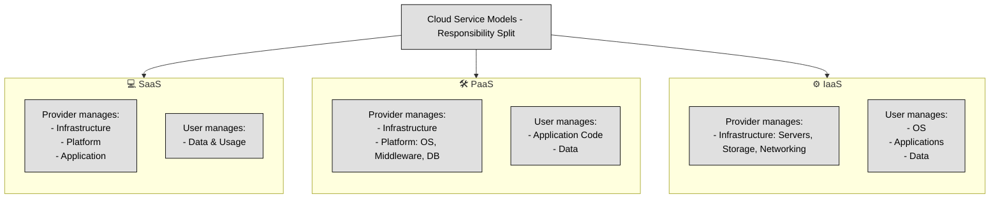
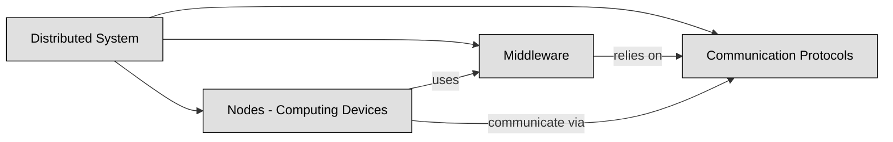
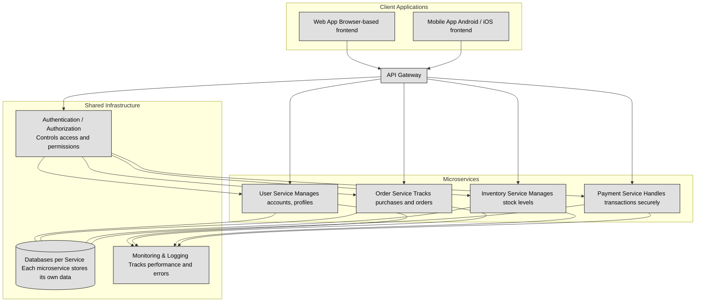
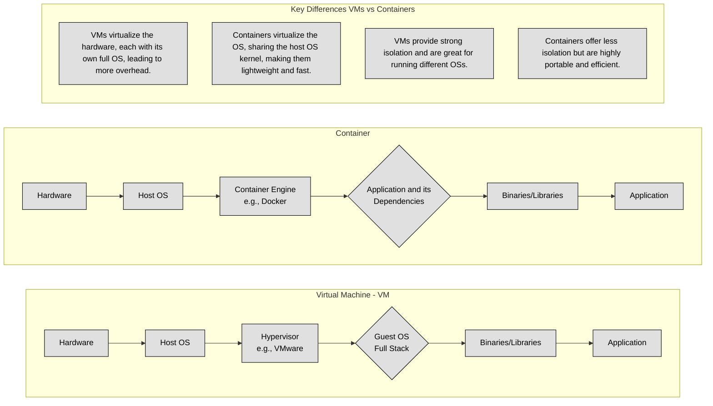
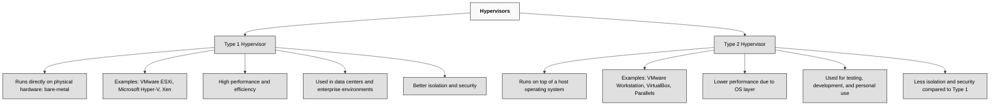
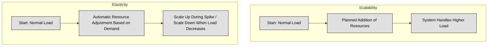

## 3.5 Assess and mitigate the vulnerabilities of security architectures, designs and solution elements ##

A **Single Point of Failure (SPOF)** is a part of a system that, if it fails, causes the entire system or a significant part of it to stop working. This makes the system vulnerable because there is no backup or redundancy to keep it running.
For example, imagine a business that relies on a single internet provider. If that provider goes down, the business loses access to the internet, affecting communication, transactions, and daily operations. In contrast, having multiple providers ensures that if one fails, another can take over, reducing downtime.

:necktie: SPOFs exist in many areas, including hardware (like a single server hosting a critical application), software (like a single database without replication), and even personnel (like only one person knowing a crucial system's configuration). 

:bulb: Eliminating SPOFs often involves redundancy, backup systems, and failover mechanisms to ensure that if one component fails, another takes its place.

:necktie: To minimize the risk of a Single Point of Failure (SPOF), implement redundancy across critical systems, such as using multiple internet providers, servers, and backup processes, ensuring system resilience even in the event of a failure. Regularly audit and reinforce security mechanisms to prevent bypass controls and race conditions, while utilizing countermeasures like synchronization, encryption, and shielding to protect against emanation-based threats.

**Bypass controls** refer to situations where security mechanisms can be intentionally or unintentionally circumvented, allowing unauthorized actions to occur. These can be designed for legitimate reasons, such as emergency access for administrators, but they can also be exploited by attackers.
A common example is a "backdoor" in software that allows an administrator to access a system even if standard authentication fails. While this might be useful for troubleshooting, attackers can exploit it to gain unauthorized access.
Bypass controls can also occur in physical security. Imagine a building with strict badge access but a propped-open back door. Even though strong controls exist at the main entrance, the bypassed control makes them ineffective.
To prevent security bypasses, organizations must regularly audit security controls, restrict backdoor access, and monitor for unusual activity that might indicate someone is avoiding standard security procedures.

A **race condition** happens when multiple processes or threads try to access or modify the same resource at the same time, leading to unpredictable behavior. This occurs because the system executes tasks in an order that was not intended, potentially causing errors or security vulnerabilities.
Imagine two people trying to withdraw money from the same bank account at the exact same time. If the system does not properly lock the account balance before processing transactions, both withdrawals might go through based on the same balance, even though there was only enough money for one transaction. This could lead to an overdraft or incorrect accounting.
In cybersecurity, race conditions can be exploited to gain unauthorized access, escalate privileges, or cause system failures. Attackers may repeatedly request access to a resource before security checks can complete, tricking the system into granting them access.
To prevent race conditions, developers use synchronization mechanisms such as locks, queues, and atomic operations to ensure that processes execute in the correct order and do not interfere with each other.

**Emanations** refer to unintentional signals or data leaks that electronic devices produce, which can be intercepted and used to extract sensitive information. These signals can come from radio frequencies, electrical signals, or even visual cues like screen reflections.
For example, an unshielded computer monitor can emit electromagnetic signals that, with the right equipment, can be reconstructed to display what is on the screen from a distance. Similarly, keyboards generate electromagnetic waves when typing, which can be intercepted to determine what keys are being pressed.
To protect against emanation-based attacks, organizations use shielding techniques such as Faraday cages, specialized hardware that blocks signal emissions, or encrypted transmissions to ensure that intercepted signals do not reveal useful information. The TEMPEST standard is an example of a government effort to protect against emanation risks, particularly in military and intelligence environments.
Emanations are often overlooked in security planning, but they present a real risk when dealing with highly sensitive environments. Proper countermeasures ensure that even if an attacker is nearby, they cannot easily capture or reconstruct confidential information.

```mermaid
graph TD
    A[Security Concepts Overview]

    A --> SPOF[Single Point of Failure - SPOF]
    SPOF --> SPOF1[Definition: A component whose failure disrupts the whole system]
    SPOF --> SPOF2[Examples: Single server, internet provider, lone expert]
    SPOF --> SPOF3[Mitigation: Redundancy, backups, failover systems]

    A --> BYPASS[Bypass Controls]
    BYPASS --> BYPASS1[Definition: Security mechanisms that can be circumvented]
    BYPASS --> BYPASS2[Examples: Software backdoors, propped open door]
    BYPASS --> BYPASS3[Mitigation: Audits, restrict backdoor use, monitor behavior]

    A --> RACE[Race Conditions]
    RACE --> RACE1[Definition: Concurrent access causes unpredictable behavior]
    RACE --> RACE2[Examples: Simultaneous withdrawals, privilege escalation]
    RACE --> RACE3[Mitigation: Locks, queues, atomic operations]

    A --> EMAN[Emanations]
    EMAN --> EMAN1[Definition: Unintentional data leaks from electronic signals]
    EMAN --> EMAN2[Examples: Monitor RF leaks, keyboard signal capture]
    EMAN --> EMAN3[Mitigation: Shielding, Faraday cages, encrypted signals, TEMPEST]

classDef center fill:#ffffff,color:#000000,stroke:#000000,stroke-width:1px,font-weight:bold
classDef node fill:#e0e0e0,color:#000000,stroke:#000000,stroke-width:1px
```

| **Concept**          | **Definition**                                                                                     | **Examples**                                                                                          | **Countermeasures**                                                                                  |
|----------------------|----------------------------------------------------------------------------------------------------|--------------------------------------------------------------------------------------------------------|--------------------------------------------------------------------------------------------------------|
| **SPOF**             | A single component whose failure causes a system-wide outage.                                      | Single internet provider, single server, lone administrator.                                          | Add redundancy, use failover systems, train multiple staff.                                            |
| **Bypass Controls**  | Mechanisms that can be circumvented, allowing unauthorized access.                                 | Software backdoors, propped-open doors bypassing badge access.                                        | Audit controls, restrict backdoor use, monitor activity.                                               |
| **Race Conditions**  | Unpredictable behavior from simultaneous access to shared resources.                               | Double withdrawal from same bank account, privilege escalation race attacks.                          | Use locks, queues, and atomic operations to manage access.                                             |
| **Emanations**       | Unintentional signals from devices that can leak sensitive data.                                   | EM leaks from monitors or keyboards intercepted remotely.                                              | Use Faraday cages, signal shielding, encrypted transmission, follow TEMPEST standards.                |

### Open Questions ###

1. Why is identifying and eliminating single points of failure (SPOFs) essential in designing resilient systems?

  
Show answer

Because SPOFs represent vulnerabilities that can bring down an entire system if one component fails. Eliminating them increases system availability and reliability by ensuring there are backups or failover mechanisms in place.

2. How can redundancy help mitigate the risk associated with SPOFs, and what are some practical examples?

  
Show answer

Redundancy involves having backup components that can take over in case of failure. For example, using multiple internet providers, redundant power supplies, or mirrored servers ensures that if one fails, the system keeps running.

3. What are bypass controls in cybersecurity, and why can they be both useful and dangerous?

  
Show answer

Bypass controls are mechanisms that allow users or systems to circumvent normal security processes. They’re useful for emergency access or maintenance but dangerous because attackers can exploit them to gain unauthorized access if not properly monitored and secured.

4. Can you describe a real-world scenario where a security bypass might unintentionally be introduced, and what the consequences might be?

  
Show answer

An example is when employees prop open a secure door for convenience, bypassing badge access. This could allow unauthorized individuals to enter, potentially leading to data theft or physical damage.

5. What is a race condition in computing, and how can it be exploited in a security context?

  
Show answer

A race condition occurs when the timing of multiple processes leads to unexpected outcomes. In security, attackers might exploit race conditions to access resources or execute actions before security checks complete, potentially leading to privilege escalation or data corruption.

6. What types of controls or practices help developers prevent race conditions in software?

  
Show answer

Developers use synchronization techniques like locks, semaphores, queues, and atomic operations to manage access to shared resources and ensure consistent, predictable behavior.

7. How can attackers exploit emanations, and what are the most effective defenses against these types of threats?

  
Show answer

Attackers can capture unintentional emissions like electromagnetic signals from monitors or keyboards to reconstruct sensitive data. Defenses include using shielded equipment, implementing Faraday cages, encrypting emissions, and following TEMPEST standards in sensitive environments.

---

## 3.5.1 Client-based systems ##

Client-based systems are systems where the client-side (usually the user's device or browser) plays a significant role in processing, data storage, or rendering. Examples include:

- Web applications (running in the browser)
- Mobile apps
- Desktop software that connects to a backend API

When your computer (the client) connects to a central server, security issues can appear in two main areas: the client itself and how it communicates with the server.

On the client side, problems may come from poorly written or outdated software, insecure configurations, or vulnerabilities in the operating system or hardware. Even well-designed software can’t protect data if the underlying system is compromised.

In communication with the server, risks arise when the connection is not properly secured. If the client doesn’t verify the server’s identity, it could connect to a fake one. Without data validation, attackers can send harmful input. Missing encryption allows eavesdropping, and without integrity checks, tampered data can go undetected. Some clients even execute commands from the server without verifying them, opening the door to remote attacks.

Clients often rely on **third-party components**, such as libraries or plugins (e.g., Java). These add-ons must be included in a vulnerability management program, ensuring that any newly discovered flaws are patched quickly.

For **web-based applications**, browsers must be hardened by following security guidelines from trusted sources like the Center for Internet Security (CIS) and the Defense Information Systems Agency (DISA). Similarly, the underlying operating system should also be secured and kept up to date.

Beyond software security, protecting the client system also means implementing:
- Firewalls to block unauthorized network access.
- Physical security controls to prevent device theft or tampering.
- Full-disk encryption to protect stored data in case of a system compromise.

When organizations develop their **own client applications**, they must follow secure software development practices to prevent vulnerabilities from being introduced in the first place. A structured development approach, ensures that security is built into the software from the start.

:link: Refer also to chapter [8.5.1 Security weaknesses and vulnerabilities at the source-code level](https://github.com/lorenzoleonelli/CISSP-Zero-to-Hero/blob/main/DOMAIN8%3A%20Software%20Development%20Security/8.5%20-%20Define%20and%20apply%20secure%20coding%20guidelines%20and%20standards.md#851-security-weaknesses-and-vulnerabilities-at-the-source-code-level)

:necktie: Assume the client is hostile — validate everything server-side !

### Open Questions ###

1. What are some common vulnerabilities found in client applications, and how can they be mitigated?

  
Show answer

Common client-side vulnerabilities include storing sensitive data insecurely (like unprotected temp files), running outdated software, and using poorly coded applications. These can be mitigated by regularly applying patches, following secure coding practices, and avoiding the storage of unencrypted sensitive data on the client.

2. Why is it risky for a client application to connect to a server without verifying its identity?

  
Show answer

If the client does not verify the server’s identity, it may unknowingly connect to a malicious or fake server. This opens the door to man-in-the-middle (MITM) attacks, data theft, or receiving malicious instructions. Secure protocols like TLS with certificate validation help prevent this risk.

3. How can insecure communication between the client and server lead to data breaches?

  
Show answer

Without encryption and integrity checks, attackers can intercept, read, modify, or inject data in transit. This could expose sensitive information or allow attackers to alter data silently. Using TLS, input validation, and digital signatures helps secure communications and prevent tampering.

4. What role do third-party components (like plugins or libraries) play in client security, and how should organizations manage them?

  
Show answer

Third-party components often process data and extend application functionality, but they can introduce vulnerabilities if they’re outdated or poorly maintained. Organizations must track, patch, and test these components regularly as part of a vulnerability management program.

5. Besides software controls, what physical and system-level protections should be in place on client devices?

  
Show answer

To protect client systems, organizations should implement firewalls to block unauthorized access, full-disk encryption to protect stored data, and physical security (like locking workstations or restricting device access) to prevent theft or tampering.

---

## 3.5.2 Server-based systems ##

Server-based systems are computing architectures where the core processing, data storage, and application logic happen on a central server, rather than on the individual client devices.

Just like clients, servers have their own security risks. The main difference is perspective: while a client sends requests, the server processes and responds to them. However, both are just computers playing different roles in a system, meaning they face many of the same threats.

A critical security measure for a server is verifying who is connecting to it. This means checking both the device (client) and the user logging in. Servers achieve this through Identity and Access Management (IAM) techniques, which include:
- Authentication (e.g., usernames, passwords, multi-factor authentication).
- Secure communication using TLS (Transport Layer Security), which encrypts data and can use client-side certificates to confirm identity.

TLS also protects against eavesdropping and tampering, preventing Man-in-the-Middle (MITM) attacks, where an attacker intercepts and alters communication between the client and server.

Servers must never assume that data received from a client is safe, even if the client has passed authentication. Attackers can manipulate or inject malicious commands before they are encrypted and sent to the server. This is why **input validation** is critical. All incoming data should be checked for harmful content before being processed.

Servers are often targeted by Denial-of-Service (DoS) attacks, where attackers flood them with fake requests to overload the system. To reduce this risk, servers can implement:

- Rate-limiting to restrict how many requests a user can make in a short time.
- CAPTCHAs to differentiate between real users and automated bots.
- Traffic filtering to block suspicious patterns of activity.

A vulnerability management program is essential for keeping the server safe. This means regularly applying updates and security patches to fix weaknesses in both:
- Custom-built applications (if the organization develops its own server software).
- Third-party software (such as commercial off-the-shelf (COTS) products).

The server should also follow the principle of **least privilege**, meaning it should only have the minimum permissions needed to function. If the server needs higher privileges for a task, it should only use them temporarily and then return to a restricted mode.

To prevent data leakage and unauthorized access, the server should:

- Use file system permissions to restrict who can access or modify data.
- Log all key activities, such as failed login attempts and actions performed by users with special privileges.
- Monitor logs for unusual behavior that might indicate a security breach.
- Collect forensic data to help investigate and respond to security incidents.

Servers are not only vulnerable to cyber threats but also to physical risks, such as theft, power failures, and natural disasters. Organizations should:

- Secure server rooms with access controls.
- Use backup power solutions (like UPS systems).
- Follow best practices for server hardening, which means configuring the system securely to reduce attack surfaces.

:link: [CIS Benchmarks](https://www.cisecurity.org/cis-benchmarks) contain recommended security settings for different operating systems and software.

### Open Questions ###

1. Why is verifying the identity of both the device and user connecting to a server important for security?

  
Show answer

Because it ensures that only authorized users and devices can access the server. This is achieved through Identity and Access Management (IAM) tools like authentication, multi-factor authentication, and TLS with client certificates, which protect against impersonation and unauthorized access.

2. What measures should a server take to protect itself from malicious data sent by clients?

  
Show answer

A server should never trust input from clients. Even authenticated users can send harmful data. To mitigate this risk, servers must validate all incoming data, sanitize inputs, and use security filters to detect and block injection attacks (like SQL injection or command injection).

3. How can a server defend itself against Denial-of-Service (DoS) attacks?

  
Show answer

Servers can reduce DoS impact through rate limiting (restricting request frequency per user), using CAPTCHAs to filter out bots, and implementing traffic filtering to detect and block suspicious or high-volume traffic patterns indicative of automated attacks.

4. Why is a vulnerability management program crucial for server security?

  
Show answer

Because both custom and third-party server software can contain vulnerabilities. A good vulnerability management program ensures regular patching and updates, minimizing the window of exposure to known threats and helping maintain a strong security posture.

5. What are some key best practices to protect a server from both cyber and physical threats?

  
Show answer

Servers should follow the principle of least privilege, use file permissions, log critical activities, and monitor logs for anomalies. Physically, servers should be kept in secured rooms, with UPS systems for power continuity, and hardened configurations following security benchmarks from CIS and NIST.

---

## 3.5.3 Database Systems ##

Databases store valuable information, so keeping them secure is critical. Many security controls exist, but let's focus on the most important ones that apply to most database systems. Some Key Database Security Practices are:
1. **Only Install What You Need:** a database system often comes with many optional features, but enabling everything increases the attack surface. Disable or uninstall anything your application doesn't require to reduce vulnerabilities.
2. **Keep Data and Logs Separate from System Files:** store databases and log files on different partitions from the operating system. This helps with performance, security, and recovery in case of failures.
3. **Lock Down File Permissions:** ensure that only authorized users and database services can access database directories, log files, and configuration settings. Restrict access based on the principle of least privilege.
4. **Use Dedicated, Low-Privilege Accounts:** the database should run under a dedicated, unprivileged service account—never as a full administrator. This limits damage if the account is compromised.
5. **Encrypt Connections with TLS:** when databases communicate over a network, encrypt the data using TLS (Transport Layer Security). This prevents attackers from intercepting sensitive information.
6. **Enforce Strong Authentication and Access Control**
- Require strong passwords for all accounts and disable default accounts if they exist.
- Use multi-factor authentication (MFA) where possible.
- Assign user permissions based on the least privilege principle—only give users access to the data they absolutely need.
7. **Remove Sample Databases and Unused Accounts:** many database systems include test databases and default accounts that can be exploited if left enabled. Remove them immediately after installation.
8. **Monitor and Log Activities**
- Enable detailed logging of all critical operations.
- Send logs to a separate, secure logging system so database administrators cannot tamper with them.
- Regularly review logs for suspicious activity.
9. **Use Secure Coding Practices to prevent SQL injection and other attacks:**
- Use bind variables when writing queries to prevent attackers from injecting malicious code.
- Validate and sanitize all user input before processing.
10. **Assign Unique Admin Accounts:** each administrator should have a unique account rather than sharing a common “admin” user. This helps track actions and apply role-based access control (RBAC) properly.
11. **Enforce Separation of Duties:** avoid giving one person too much power over the database. For critical operations, require at least two administrators to approve or execute actions.
12. **Follow Vendor-Specific Best Practices**: Different databases (e.g., Oracle, SQL Server, MySQL, PostgreSQL) have unique security settings. Always check the vendor’s documentation and enable security features like Oracle's Data Dictionary Protection, which limits what even admins can do.

:link: Refer also to [8.D.1 Databases Basics](https://github.com/lorenzoleonelli/CISSP-Zero-to-Hero/blob/main/DOMAIN8%3A%20Software%20Development%20Security/8.D.1%20Databases%20Basics.md#8d1-databases-basics)

**Data at rest** refers to information stored in a database, whether in tables, files, or backups. Protecting this data is essential and can be done with the following key Methods:
- **Transparent Data Encryption (TDE):** Encrypts database files at the storage level. Many databases, like SQL Server and Oracle, support this feature.
- **Column-Level Encryption:** Encrypts specific columns containing sensitive data, such as passwords or credit card numbers.
- **Full-Disk Encryption:** Encrypts the entire storage drive where the database resides. This helps if someone physically steals the disk but does not protect against internal threats.

**Data in motion** refers to data being transmitted between a database and an application or another server. Encrypting this data ensures that attackers cannot intercept it. Key Methods to encrypt data in motion are:
- **Transport Layer Security (TLS):** Encrypts data traveling over the network, preventing eavesdropping. Always enable TLS for database connections.
- **VPNs and Secure Tunnels:** If your database traffic moves across external networks, a VPN adds another layer of encryption.

 There are some other threats that come from how databases work under the hood:
 | **Attack Type**         | **Description**                                                                                  | **How to Defend**                                                                                 |
|-------------------------|-------------------------------------------------------------------------------------------------------------------|----------------------------------------------------------------------------------------------------|
| **Concurrency Issues**  | Two people try to update data at the same time, and one change might overwrite the other.                        | Use locking, transactions, and isolation levels to manage simultaneous access.                    |
| **Aggregation Attacks** | Attacker collects small, harmless data to figure out something sensitive like a salary.                          | Use views to limit data exposure, apply query limits.                                              |
| **Inference Attacks**   | Attacker guesses private data by noticing changes in query results when filters are applied.                     | Use polyinstantiation, noise injection, or data masking to confuse pattern-based guessing.        |
| **Excessive Privileges**| Users or apps have more access than needed—if compromised, attackers get full access.                            | Apply least privilege, use RBAC (Role-Based Access Control), and audit permissions regularly.     |
| **Stored Procedure Abuse** | Malicious input is injected into database scripts to manipulate the system.                                  | Validate input, use parameterized queries, and restrict permissions on stored procedures.         |

### Open Questions ###

1. Why should you disable optional features in a database system?

  
Show answer

Optional features may look useful, but they can create new security holes. If your application doesn’t need them, it’s safer to disable or uninstall them. This reduces the attack surface—meaning there’s less for hackers to target.

2. What’s the risk of running a database with full administrator privileges?

  
Show answer

If the database is hacked and it's running with admin rights, attackers can take over the whole system. That’s why it’s better to use a special low-privilege account just for the database—it limits the damage if something goes wrong.

3. What’s the difference between data at rest and data in motion, and how do we protect them?

  
Show answer

Data at rest is stored data—like in tables or backups. We protect it using things like Transparent Data Encryption (TDE) or full-disk encryption. Data in motion is data traveling over a network, and we protect it using TLS or VPNs to stop eavesdroppers from stealing it.

4. What are aggregation and inference attacks, and how can you prevent them?

  
Show answer

Aggregation is when someone collects bits of data to guess something sensitive. Inference is when someone makes smart guesses by watching patterns. To prevent them, you can use views, add noise to results, or even show slightly different versions of the same data (polyinstantiation) to confuse attackers.

5. Why is it important to assign unique admin accounts instead of sharing one?

  
Show answer

When everyone uses the same “admin” login, there’s no way to know who did what. If each admin has their own account, you can track their actions, apply the right permissions, and hold the right person accountable if something goes wrong.

---

## 3.5.4 Cryptographic Systems ##

Cryptographic systems are essential for securing data, ensuring confidentiality, integrity, and authenticity. However, they are not foolproof. Weaknesses in cryptographic systems generally fall into three major categories: algorithm and protocol weaknesses, implementation weaknesses, and key management vulnerabilities. Each of these can be exploited by attackers if not properly managed.

**1. Algorithm and Protocol Weaknesses**

A. Outdated or Weak Algorithms. 
Not all encryption algorithms are secure forever. Advances in computing power, especially with quantum computing on the horizon, make some algorithms obsolete. Examples of weak or broken algorithms include:

- DES (Data Encryption Standard) – Once a widely used encryption standard, DES now has a small key size (56 bits), making it vulnerable to brute-force attacks.
- MD5 (Message Digest Algorithm 5) – This hashing algorithm is vulnerable to collision attacks, where two different inputs produce the same hash. Attackers can use this to forge digital signatures.
- SHA-1 (Secure Hash Algorithm 1) – Similar to MD5, SHA-1 is also susceptible to collision attacks, making it insecure for integrity verification.

B. Poorly Designed Protocols. 
Some encryption protocols have inherent weaknesses that attackers can exploit.

- WEP (Wired Equivalent Privacy) – Used for wireless network security, WEP has a flawed encryption method that makes it easy to crack using readily available tools.
- SSL (Secure Sockets Layer) versions 2.0 and 3.0 – These older versions of SSL have weaknesses such as man-in-the-middle (MITM) attack vulnerabilities and weak cipher support, leading to attacks like POODLE (Padding Oracle On Downgraded Legacy Encryption).
- PKI (Public Key Infrastructure) issues – Some public key cryptosystems rely on outdated or weak signature algorithms (e.g., RSA keys under 1024 bits), making them vulnerable to factorization attacks.

C. Side-Channel Attacks. 
Even if an encryption algorithm is mathematically strong, attackers can exploit the physical implementation of cryptographic operations:

- Timing Attacks – Observing the time taken by a system to process cryptographic operations to deduce secret information.
- Power Analysis Attacks – Monitoring power consumption patterns to extract cryptographic keys.
- Electromagnetic Attacks – Analyzing electromagnetic emissions from a device to recover sensitive data.

**2. Implementation Weaknesses**
Even a strong encryption algorithm can be rendered useless if it is implemented incorrectly. Mistakes in software or hardware can introduce vulnerabilities that attackers exploit.

A. Poor Random Number Generation. 
Cryptography relies on random numbers for key generation and encryption. If a system generates predictable random numbers, attackers can guess encryption keys. Weak sources of randomness include:
Using system time as a seed – Some implementations use the current timestamp to generate cryptographic keys, making it easier for attackers to predict.
Non-random entropy sources – If a system reuses entropy pools or lacks sufficient randomness, the resulting cryptographic operations may be insecure.

B. Hardcoded or Default Keys. 
Some developers hardcode cryptographic keys into software, making them easy for attackers to find if they gain access to the source code. Similarly, default encryption keys are often known publicly, allowing unauthorized decryption.

C. Flawed Key Exchange Implementations. 
Even strong encryption can be broken if key exchange mechanisms are weak. Examples include:

- Lack of forward secrecy – If a past encryption key is compromised, all previous encrypted communications should remain secure. Some implementations fail to ensure this, allowing attackers to decrypt past messages if they obtain a private key.
- Man-in-the-Middle (MITM) attacks – If an encryption protocol doesn’t properly authenticate key exchanges, an attacker can intercept and modify communications. A well-known example is the Logjam attack, which exploits weak Diffie-Hellman key exchanges.

D. Weak Cryptographic Storage. 
Some systems store encrypted data improperly, making it vulnerable:
Using weak or no encryption for stored passwords – Systems should store hashed and salted passwords rather than storing them in plaintext or using weak hashing algorithms.
Reusing encryption keys for multiple purposes – Using the same key for encrypting different types of data increases the risk of exposure if the key is compromised.

**3. Key Management Vulnerabilities**

A. Weak Key Sizes. 
The strength of encryption depends on the key length. If a key is too short, it can be brute-forced.
RSA keys under 2048 bits are now considered insecure.
AES keys under 128 bits should not be used for sensitive data.

B. Poor Key Storage Practices. 
Encryption keys should be stored securely, but poor practices often lead to their compromise:
Storing keys in configuration files – Attackers who gain access to the system can easily extract encryption keys from improperly protected files.
Leaving keys in memory too long – If an application does not securely erase cryptographic keys from memory after use, attackers can extract them via memory scraping techniques.

C. Key Reuse and Expired Keys. 
Reusing the same key for too long increases the likelihood of compromise. Best practices require regular key rotation to minimize risk.
Not retiring old keys properly – Even after a key is retired, failing to properly remove it from a system can allow unauthorized decryption.

D. Insecure Key Distribution. 
Encryption keys need to be securely shared between parties. Common mistakes include:
Sending encryption keys over unencrypted channels – If an encryption key is shared via email or a plaintext message, an attacker can intercept it.
Lack of proper authentication during key exchange – If an attacker can trick a system into accepting a fraudulent key, they can decrypt sensitive data.

E. Lack of a Centralized Key Management System (KMS). 
Organizations that manage multiple cryptographic keys should use a Key Management System (KMS) to enforce security policies. Without centralized control, keys may be stored improperly, leading to unauthorized access or loss.

| **Category**                        | **Weakness**                       | **Description / Examples**                                                                                                     |
| ----------------------------------- | ---------------------------------- | ------------------------------------------------------------------------------------------------------------------------------ |
| **Algorithm & Protocol Weaknesses** | **Outdated Algorithms**            | DES (56-bit key), MD5 (collision attacks), SHA-1 (insecure integrity). These are no longer safe due to modern computing power. |
|                                     | **Weak Protocols**                 | WEP (easily cracked), SSL 2.0/3.0 (MITM, POODLE attacks), weak PKI with short RSA keys.                                        |
|                                     | **Side-Channel Attacks**           | Attacks like timing analysis, power monitoring, or EM radiation can reveal secret keys without breaking the algorithm.         |
| **Implementation Weaknesses**       | **Poor Random Number Generation**  | Predictable keys if randomness is weak. E.g., using system time as seed.                                                       |
|                                     | **Hardcoded or Default Keys**      | Developers may accidentally (or lazily) embed keys in code. These keys can be easily discovered.                               |
|                                     | **Bad Key Exchange**               | Lacking forward secrecy or vulnerable to MITM (e.g., Logjam attack using weak Diffie-Hellman parameters).                      |
|                                     | **Weak Cryptographic Storage**     | Storing passwords in plaintext or using the same key for different purposes weakens data security.                             |
| **Key Management Issues**           | **Weak Key Sizes**                 | RSA keys < 2048 bits or AES < 128 bits are vulnerable to brute-force attacks.                                                  |
|                                     | **Poor Key Storage**               | Saving keys in config files or leaving them in memory too long makes them easy targets.                                        |
|                                     | **Key Reuse / Expired Keys**       | Using the same key too long without rotation increases risk of compromise.                                                     |
|                                     | **Insecure Key Distribution**      | Sending keys over unencrypted emails or failing to verify identity during key exchange can expose data.                        |
|                                     | **No Key Management System (KMS)** | Without a centralized system, organizations often misplace, mishandle, or leak encryption keys.                                |

### Open Questions ###

1. Why is using an outdated algorithm like MD5 or DES considered a serious risk in modern systems?

  
Show answer

Because these algorithms have known vulnerabilities that attackers can exploit easily, like collision attacks in MD5 or brute-forcing DES's small key space. Modern computing power makes these attacks fast and affordable.

2. What kind of real-world problems can occur if keys are hardcoded into an application?

  
Show answer

If attackers reverse-engineer the application, they can extract the key and decrypt sensitive data or forge messages. This is a common failure in IoT and poorly-secured mobile apps.

3. How do side-channel attacks bypass the strength of cryptographic algorithms?

  
Show answer

Instead of breaking the algorithm mathematically, attackers gather clues from physical signals like timing, power usage, or electromagnetic leaks to infer the key. These attacks exploit how the system behaves, not just the code.

4. What are the dangers of poor key distribution practices?

  
Show answer

If encryption keys are sent over unencrypted channels or shared without verifying identities (e.g., via email), they can be intercepted, leading to total compromise of encrypted data.

5. In what ways can a lack of a Key Management System (KMS) impact an organization’s security?

  
Show answer

Without a KMS, it's easy to lose track of keys, reuse them insecurely, or fail to revoke them after staff changes. This leads to poor accountability and increases the risk of unauthorized access or data breaches.

---

## 3.5.5 Operational Technology/Industrial Control System ##

**Operational Technology (OT)** refers to the hardware and software used to monitor and control physical processes in industries such as manufacturing, energy, transportation, and utilities. Unlike traditional IT systems, which handle data and communication, OT systems directly control machinery, industrial equipment, and critical infrastructure.

**Industrial Control Systems (ICS)** are a key component of OT. These systems manage and automate processes in industrial environments. ICS includes various technologies, such as Programmable Logic Controllers (PLCs), Distributed Control Systems (DCS), and Supervisory Control and Data Acquisition (SCADA) systems. Each of these plays a specific role in managing industrial operations. Key Components of ICS ARE:

- Programmable Logic Controllers (PLCs). These are small, specialized computers used to control industrial equipment.
They operate in real-time, making decisions based on sensor inputs.
PLCs are used in manufacturing lines, power plants, and water treatment facilities.

- Distributed Control Systems (DCS). A DCS is a network of interconnected controllers that manage complex industrial processes. It is commonly used in large-scale environments like oil refineries and chemical plants.
Unlike SCADA, which operates over long distances, DCS is focused on local process automation.

- Supervisory Control and Data Acquisition (SCADA). SCADA systems collect and analyze data from industrial equipment, allowing operators to monitor and control systems remotely. They are used in power grids, water supply systems, and transportation networks. SCADA enables centralized control over geographically dispersed assets.

:bulb: Segment the ICS network with firewalls and VLANs, allowing only necessary traffic from authorized devices. Use allowlisting to restrict access and disable unused ports to reduce attack risks.

OT and ICS systems were traditionally designed to operate in isolated environments, making security a lower priority. However, as these systems become more interconnected with IT networks and the internet, they are increasingly exposed to cybersecurity threats included:

1. Legacy Systems and Lack of Security by Design.
Many ICS components were designed decades ago with little consideration for cybersecurity.
Older PLCs, DCS, and SCADA systems often lack security features like encryption and authentication.
Patching and updating ICS systems is difficult because they run 24/7 and cannot be taken offline easily.
2. Poor Network Segmentation.
Insecure ICS networks are often directly connected to IT networks, allowing attackers to move laterally from IT systems to OT systems.
Many organizations do not properly isolate critical industrial networks from corporate or external networks.
3. Unprotected Remote Access.
Many ICS environments allow remote access for maintenance and monitoring.
If access is not secured (e.g., weak passwords, lack of multi-factor authentication), attackers can gain control over critical systems.
Unprotected SCADA interfaces can be exposed to the internet, allowing unauthorized access.
4. Lack of Encryption and Authentication.
Many ICS protocols (e.g., Modbus, DNP3) were designed for efficiency, not security, and do not include encryption or authentication mechanisms.
Attackers can intercept and manipulate communications between controllers and sensors.
5. Insider Threats and Human Error.
Employees, contractors, or vendors with access to ICS systems can intentionally or accidentally cause security incidents.
Poor security awareness among OT personnel increases the risk of social engineering attacks.
6. Malware and Ransomware Attacks.
ICS systems can be targeted by malware specifically designed to disrupt industrial operations.
Stuxnet is a well-known example of malware that targeted PLCs to physically damage centrifuges in an Iranian nuclear facility.
Ransomware attacks on OT environments can cause massive downtime and financial losses.
7. Supply Chain Vulnerabilities.
ICS components are often sourced from third-party vendors, and vulnerabilities in the supply chain can introduce security risks.
Malicious firmware updates or compromised hardware components can be used to exploit ICS systems.
8. Denial-of-Service (DoS) Attacks.
Attackers can overwhelm ICS networks with traffic, disrupting communication between control systems and industrial equipment.
Even a small disruption in critical infrastructure (e.g., power grids or water treatment plants) can have significant consequences.

### Open Questions ###

1. What is the main functional difference between a SCADA system and a Distributed Control System (DCS)?

  
Show answer

SCADA systems are designed for remote monitoring and control over large geographic areas (e.g., power grids), while DCS is focused on local automation in centralized environments like refineries and chemical plants.

2. Why are legacy ICS components, such as older PLCs and DCS systems, a security concern in modern environments?

  
Show answer

Because they were originally designed without cybersecurity in mind. Many lack encryption, authentication, and patching mechanisms, making them vulnerable to modern attacks even though they still perform critical functions.

3. How can poor network segmentation increase the risk of a successful ICS attack?

  
Show answer

If ICS networks are not properly segmented from IT networks, attackers can gain access to operational systems by first breaching the corporate network, then moving laterally into sensitive OT environments.

4. What makes remote access a common attack vector in ICS environments, and how can it be secured?

  
Show answer

Remote access is often enabled for maintenance, but without strong authentication (like MFA) or network controls, it provides a direct path for attackers. Securing it involves VPNs, MFA, strong passwords, and logging access attempts.

5. What was Stuxnet, and why is it considered a milestone in ICS cybersecurity?

  
Show answer

Stuxnet was a malware that specifically targeted PLCs used in Iranian nuclear facilities, causing physical damage to centrifuges. It demonstrated how cyberattacks could cause real-world destruction in industrial systems.
handled in a consistent and controlled way, reducing the risk of accidental or malicious corruption. This model is widely used in systems that require high data integrity, like financial applications.

---

## 3.5.6 Cloud-based systems (e.g., Software as a Service (SaaS), Infrastructure as a Service (IaaS), Platform as a Service (PaaS)) ##

Cloud computing services are commonly delivered in three models, each providing different levels of abstraction, management, and control.

**1 Software as a Service (SaaS)**

SaaS refers to cloud-based software that users can access through the internet. Rather than purchasing and installing software on their own devices, users can subscribe to an application hosted in the cloud.

Characteristics:

- Access via Web Browser: SaaS applications are typically accessed through a browser, allowing users to access the application from any device with an internet connection.

- Fully Managed: The cloud service provider handles all aspects of the software, including maintenance, updates, and security patches.

- Subscription Model: SaaS operates on a subscription basis, where users pay for access to the software, often with tiered pricing based on features or usage.

Examples of SaaS:

- Google Workspace (formerly G Suite)
- Microsoft 365
- Salesforce

Vulnerabilities:

- Data Privacy and Compliance Risks: Data stored in the cloud may be subject to various jurisdictional regulations. Organizations must ensure that their cloud provider is compliant with data privacy laws such as GDPR, HIPAA, or CCPA.
- Limited Control: Since the service is managed by the provider, customers have limited control over updates, security features, and performance, which could result in disruptions or vulnerabilities.
- Multi-Tenancy Risk: In a shared environment, vulnerabilities in one client’s data or configurations can affect others. Although providers implement security measures, the risk of cross-tenant attacks exists.

**2 Infrastructure as a Service (IaaS)**

IaaS provides the underlying hardware infrastructure to run applications and services. Users are responsible for managing the operating system, applications, and data while the provider maintains the physical infrastructure.

Characteristics:

- Virtualized Resources: Users can rent virtualized computing resources such as virtual machines (VMs), storage, and networking components.
- Scalability and Flexibility: IaaS allows users to scale resources up or down based on demand, providing flexibility for dynamic workloads.
- Pay-as-you-go: The user only pays for the resources they use, which helps reduce operational costs.

Examples of IaaS:

- Amazon Web Services (AWS)
- Microsoft Azure
- Google Cloud Platform (GCP)

Vulnerabilities:

- Shared Resources: Since IaaS environments are often multi-tenant, there is a risk of data leakage or side-channel attacks from neighboring tenants if proper isolation measures are not in place.
- Insider Threats: Providers may have access to customer data and systems, creating potential risks if their staff is compromised or malicious.
- Misconfigurations: Improper configuration of virtual machines or cloud networking can lead to vulnerabilities such as open ports, improper access control, and exposed sensitive data.

**3 Platform as a Service (PaaS)**

PaaS provides a platform that allows customers to develop, run, and manage applications without worrying about the underlying infrastructure. It abstracts much of the complexity involved in infrastructure management and offers tools for developers.

Characteristics:

- Integrated Development Environment (IDE): PaaS often comes with a pre-configured development environment, which simplifies coding and deployment.
- Middleware and Databases: In addition to basic compute resources, PaaS typically includes middleware, databases, and other software components that developers can leverage.
- Developer-Focused: PaaS is designed to streamline the application development lifecycle, from coding to deployment.

Examples of PaaS:

- Google App Engine
- Heroku
- Microsoft Azure App Service

Vulnerabilities:

- Code Injection: PaaS platforms host applications written by users, making them vulnerable to code injection attacks if the application code is not properly secured.
- Data Leakage: The developer may inadvertently expose sensitive data or credentials if security best practices are not followed.
- Shared Infrastructure Risks: Similar to IaaS, PaaS environments may use shared infrastructure, which can lead to risks if tenants do not adequately isolate their applications.

| Model | Description | Key Characteristics | Examples | Common Vulnerabilities |
|-------|-------------|---------------------|----------|------------------------|
| **Software as a Service (SaaS)** | Cloud-based software accessible via the internet without local installation. | - Access via web browser - Fully managed by provider - Subscription-based pricing | Google Workspace, Microsoft 365, Salesforce | - Data privacy & compliance risks (GDPR, HIPAA, CCPA) - Limited control over updates & features - Multi-tenancy risk (cross-tenant attacks) |
| **Infrastructure as a Service (IaaS)** | Provides virtualized computing resources; user manages OS, apps, and data. | - Virtualized resources (VMs, storage, networking) - Scalable and flexible - Pay-as-you-go pricing | AWS, Microsoft Azure, Google Cloud Platform | - Shared resources risk (data leakage, side-channel attacks) - Insider threats from provider staff - Misconfigurations leading to exposed data |
| **Platform as a Service (PaaS)** | Platform for developing, running, and managing apps without handling infrastructure. | - Integrated Development Environment (IDE) - Includes middleware and databases - Developer-focused tools | Google App Engine, Heroku, Microsoft Azure App Service | - Code injection vulnerabilities - Data leakage from insecure coding - Shared infrastructure risks |

:brain: SaaS provides software over the internet, PaaS offers a platform for developing and deploying applications, and IaaS delivers virtualized computing resources like servers and storage on demand.

In addition to the service models, cloud systems can be deployed in different ways based on an organization's needs. These deployment models vary in terms of control, management, and the level of security they offer.

**1 Public Cloud**

The public cloud is owned and operated by third-party cloud providers and offers services to multiple organizations. This model is highly cost-effective as resources are shared among many tenants.

Characteristics:

- Shared Resources: Public clouds use shared infrastructure, where multiple customers’ workloads are hosted on the same hardware.
- Cost-Effective: As the infrastructure is shared, the cost is spread out, making it more affordable for smaller organizations or projects with varying resource needs.
- Scalability: Public cloud services are highly scalable, enabling organizations to adjust their resource usage based on demand.

Examples of Public Cloud Providers:
- Amazon Web Services (AWS)
- Google Cloud Platform (GCP)
- Microsoft Azure

Vulnerabilities:

- Data Security and Privacy Concerns: Storing sensitive data on a shared infrastructure can pose risks if the cloud provider’s security protocols are not robust enough.
- Limited Control Over Data: Customers have limited control over data security, maintenance, and where their data resides, which could be a concern for compliance.
- Network and Availability Risks: Public cloud services are dependent on internet connectivity, and any network failure can result in service downtime or data inaccessibility.

**2 Private Cloud**

A private cloud is dedicated to a single organization. It can be hosted on-premises or by a third-party provider. This deployment offers greater control over resources, security, and compliance.

Characteristics:

- Dedicated Resources: Unlike public clouds, private clouds use resources that are not shared with other customers.
Customization: Organizations can customize the infrastructure and services based on their specific needs.
- Increased Security and Control: With greater control over the environment, private clouds are more secure for handling sensitive data.

Examples of Private Cloud Providers:

- VMware Cloud
- Microsoft Azure Stack
- OpenStack

Vulnerabilities:

- High Cost: Building and maintaining a private cloud can be expensive due to the need for dedicated hardware, software, and personnel.
- Complexity: Managing and securing a private cloud requires a significant amount of technical expertise, which could strain an organization's resources.
- Limited Scalability: While private clouds can scale, they may not be as flexible or cost-effective as public clouds in responding to dynamic demand.

**3 Hybrid Cloud**

Hybrid clouds combine both public and private clouds, allowing organizations to move workloads between them depending on security, compliance, and operational needs. This model is ideal for businesses that require both flexibility and control.

Characteristics:

- Flexibility: Hybrid clouds allow organizations to run sensitive workloads on private clouds and less critical workloads on public clouds.
- Seamless Integration: The integration of both private and public clouds enables businesses to take advantage of the benefits of both while avoiding the limitations of each.
- Cost Efficiency: Hybrid clouds allow businesses to optimize costs by leveraging the public cloud for general-purpose services while using the private cloud for sensitive data and operations.

Vulnerabilities:

- Complexity in Management: Managing a hybrid environment can be complex due to the need to ensure compatibility between private and public clouds.
- Data Transfer Risks: Data transferred between public and private clouds can be vulnerable to interception or loss if not adequately encrypted and secured.
- Inconsistent Security Policies: Ensuring uniform security policies across both environments can be challenging, and lapses may lead to vulnerabilities.

| Model | Description | Key Characteristics | Examples | Common Vulnerabilities |
|-------|-------------|---------------------|----------|------------------------|
| **Public Cloud** | Owned and operated by third-party providers, offering services to multiple organizations via shared infrastructure. | - Shared resources - Cost-effective - Highly scalable | AWS, Google Cloud Platform, Microsoft Azure | - Data security & privacy concerns - Limited control over data location & security - Dependent on internet availability |
| **Private Cloud** | Dedicated to a single organization, hosted on-premises or by a third-party provider. | - Dedicated resources - Customizable infrastructure - Increased security & control | VMware Cloud, Microsoft Azure Stack, OpenStack | - High cost of setup & maintenance - Requires significant technical expertise - Limited scalability compared to public cloud |
| **Hybrid Cloud** | Combines public and private clouds, allowing workload movement based on needs. | - Flexibility for workload placement - Seamless integration between environments - Cost efficiency through resource optimization | *(Combination of public & private providers)* | - Complex management requirements - Data transfer security risks - Inconsistent security policies between environments |

:brain: Public cloud provides resources over the internet to the general public, private cloud offers dedicated resources for a single organization, and hybrid cloud combines both public and private clouds to allow data and applications to be shared between them.

### Open Questions ###

1. Which cloud service model gives the customer the least control over infrastructure and application management?

  
Show answer

Software as a Service (SaaS) — because the provider manages everything from infrastructure to the application itself, while the user only manages data and usage.

2. In which cloud deployment model are resources dedicated to a single organization, often resulting in higher costs and greater security control?

  
Show answer

Private Cloud — resources are not shared, and the organization can fully customize and secure the environment.

3. A company needs to rent virtual machines and storage but wants to install and manage its own operating systems and applications. Which cloud service model fits this requirement?

  
Show answer

Infrastructure as a Service (IaaS) — the provider manages the physical infrastructure, but the customer manages the OS, apps, and data.

4. Which cloud deployment model allows an organization to place sensitive workloads in a private cloud while running less critical workloads in a public cloud?

  
Show answer

Hybrid Cloud — it combines the control of private clouds with the flexibility and scalability of public clouds.

5. What is a common security risk for both PaaS and IaaS environments due to their multi-tenant nature?

  
Show answer

Shared infrastructure risk — vulnerabilities or poor isolation between tenants could lead to data leakage or cross-tenant attacks.

---

## 3.5.7 Distributed systems ##

A distributed system (aka **Distributed Computing Environment DCE**) consists of multiple independent computers (often referred to as nodes) that communicate over a network to coordinate and perform a task. These systems typically work together to ensure that resources such as computational power, storage, and data are shared and efficiently utilized. The key feature of distributed systems is the decentralization of resources, meaning there is no single point of control or failure.

Characteristics of Distributed Systems are:
- Multiple Autonomous Components: Each node in a distributed system operates independently, yet cooperatively, with other nodes.
- Scalability: Distributed systems are often designed to scale horizontally, allowing new nodes to be added as the system grows to handle increasing workloads.
- Fault Tolerance: Distributed systems are designed to maintain functionality even if one or more nodes fail. This is often achieved through redundancy and replication mechanisms.
- Concurrency: Distributed systems allow multiple processes to execute concurrently, providing efficient utilization of resources.
- Communication Over Networks: Nodes communicate with each other over networks using various protocols, such as TCP/IP, HTTP, or custom communication protocols.

Distributed systems consist of several components, each of which plays a crucial role in maintaining the system’s efficiency, security, and reliability.

1 **Nodes (Computing Devices)** can be any computing device, such as a server, desktop, or mobile device. Each node performs computations and stores data, but no node has complete control over the entire system. Nodes communicate with each other over a network to coordinate and complete tasks.

2 **Middleware** is a software layer that lies between the operating system and the applications on each node. It helps manage communication, data sharing, and synchronization across the distributed system. Middleware provides a common interface and allows different types of hardware and software to work together efficiently.

3 **Communication Protocols.** For nodes to communicate, distributed systems use a variety of communication protocols. These protocols define the rules for data exchange and ensure that messages are delivered accurately and securely across the network. Interface Definition Languages (IDLs) are often used to describe the services and data structures exchanged between components, making interactions language-agnostic. Technologies such as Remote Procedure Calls (RPC), CORBA, and DCOM use these definitions to enable seamless communication between distributed components as if they were running on the same machine.

:bulb: A brief overview of how RPC, CORBA, and DCOM work:
| Technology | Core Idea | How It Works | Key Features / Goals |
|------------|-----------|-------------|-----------------------|
| **RPC (Remote Procedure Call)** | Call remote functions as if local | Client calls stub → request marshalled → sent over network → server stub executes → result returned | Simple, language-neutral, hides networking details |
| **CORBA (Common Object Request Broker Architecture)** | Object-oriented RPC via an Object Request Broker (ORB) | Interfaces defined with IDL → ORB locates objects, marshals data, transports messages → results returned transparently | Cross-language, cross-platform, standardized by OMG |
| **DCOM (Distributed Component Object Model)** | Microsoft’s distributed extension of COM | COM interfaces exposed remotely → DCOM handles marshalling, authentication, transport → client uses interface as if local | Windows-focused, built-in security and component management |

Distributed systems can be **categorized** based on their architecture and the way they manage resources. The most common types include:

1 **Client-Server Systems.** In client-server systems, nodes are divided into two roles: clients and servers. Clients request services or resources, and servers provide these resources. This architecture is commonly used for applications where clients access centralized data or services.

2 **Peer-to-Peer (P2P) Systems.** In peer-to-peer systems, all nodes are equal and share resources with each other. Each node can act both as a client and as a server, depending on the situation. P2P systems are highly decentralized and are often used in file-sharing applications or distributed ledger technologies.

3 **Cloud-based Distributed Systems.** Cloud services like IaaS, PaaS, and SaaS, discussed in the previous section, are essentially large-scale distributed systems. These systems involve coordination between thousands of nodes to deliver services like storage, processing power, and software over the internet.

:link: [ISO SC 38](https://www.iso.org/committee/601355.html) serves as the focus, proponent, and systems integration entity on Cloud Computing, Distributed Platforms, and the application of these technologies. SC 38 provides guidance to JTC 1, IEC, ISO and other entities developing standards in these areas.

### Open Questions ###

1. What is the key feature that differentiates a distributed system from a centralized system?

  
Show answer

The decentralization of resources, meaning no single node has complete control or represents a single point of failure.

2. How does middleware contribute to the efficiency of a distributed system?

  
Show answer

Middleware provides a common interface that manages communication, synchronization, and data sharing across nodes, allowing different hardware and software to work together seamlessly.

3. Why are Interface Definition Languages (IDLs) important in distributed systems?

  
Show answer

IDLs describe services and data structures in a language-agnostic way, enabling technologies like RPC, CORBA, and DCOM to allow components written in different programming languages to communicate transparently.

4. What mechanisms help distributed systems remain functional even when some nodes fail?

  
Show answer

Fault tolerance mechanisms such as redundancy and replication ensure that the system continues to operate despite individual node failures.

5. How do client-server and peer-to-peer architectures differ in distributed systems?

  
Show answer

In client-server systems, clients request services from dedicated servers, while in peer-to-peer systems, all nodes are equal and can act as both clients and servers, leading to greater decentralization.

---

## 3.5.8 Internet of things ##

The Internet of Things (IoT) refers to a network of physical devices embedded with [sensors](https://github.com/lorenzoleonelli/CISSP-Zero-to-Hero/blob/main/DOMAIN3%3A%20Security%20Architecture%20and%20Engineering/3.D.2%20Understanding%20How%20Common%20IoT%20Sensors%20Work.md#3d2-understanding-how-common-iot-sensors-work), software, and other technologies that enable them to connect and exchange data over the internet. These devices can range from everyday household items like smart thermostats and refrigerators to complex industrial machinery used in manufacturing, healthcare, and energy systems. Securing these devices is becoming increasingly important.

One of the most defining features of IoT is its ability to connect objects that were traditionally not connected to the internet. This connectivity allows devices to communicate with each other and with centralized systems, enabling automation, remote monitoring, and real-time data exchange. The pervasive nature of IoT leads to significant advantages such as improved efficiency, and productivity in both consumer and industrial environments.
IoT devices are often designed to operate with minimal user intervention. Many are autonomous, meaning they collect and analyze data automatically, making decisions or sending alerts based on predefined rules. 

:necktie: Never trust the default settings on IoT devices: ensure that each device is properly configured and secured before connecting it to the network to prevent easy exploitation by attackers.

These devices are typically small, lightweight, and energy-efficient, enabling them to be deployed in large numbers. This is especially relevant in industrial settings, where thousands of IoT devices may be integrated into complex systems for monitoring, controlling, and optimizing processes. With the data collected from these devices, businesses can make data-driven decisions.

Connectivity and automation are further enabled by the diverse range of communication protocols used in IoT, such as Wi-Fi, Bluetooth, Zigbee, and cellular networks. Each protocol is designed to address specific needs in terms of range, power consumption, and data throughput. The variety of these protocols adds flexibility in the design and application of IoT solutions, but it also creates challenges in terms of managing and securing a multitude of device types and communication methods.

:bulb: The **“three dumb routers” configuration** is an IoT network security practice designed to isolate vulnerable smart devices (IoT) from your main network. It's sometimes called the triple-router setup and works like this:

1. Router #1 (ISP Gateway). This is your main internet router or modem/router combo from your ISP. Its only job is to pass the internet connection to the next router(s). No devices are connected directly to this router.

2. Router #2 (Primary / Trusted Network). Connected to Router #1. Hosts your trusted devices such as computers, phones, and tablets. Provides your "normal" home Wi-Fi or wired network.

3. Router #3 (IoT Network). Also connected to Router #1, but separate from Router #2. Hosts only IoT devices — cameras, smart bulbs, voice assistants, appliances. Prevents IoT devices (which often have weak security) from seeing or attacking your trusted devices on Router #2.

Despite its numerous benefits, IoT introduces several security concerns that need to be carefully managed. One of the primary vulnerabilities of IoT devices is their often inadequate security. Many IoT devices are designed with convenience and cost-effectiveness in mind, which can lead to security features being overlooked or underdeveloped. As a result, these devices can be susceptible to various types of attacks, including unauthorized access, data interception, and device manipulation.

One of the most concerning vulnerabilities is **weak authentication and authorization mechanisms**. Many IoT devices have default passwords that users rarely change, and in some cases, the devices lack proper authentication protocols altogether. This makes it easy for attackers to gain unauthorized access to devices, which can lead to various forms of exploitation, such as data theft, unauthorized control, or the ability to launch further attacks within a network.

The sheer number of IoT devices can also create a challenge for security teams. **Each device often requires its own management**, but many organizations lack the resources or infrastructure to properly track and monitor all devices. This increases the risk of devices being overlooked, left unpatched, or poorly configured, making them more vulnerable to exploitation. Additionally, when devices are compromised, they can become entry points into broader network attacks, allowing hackers to escalate their privileges and access more sensitive systems or data.

Another significant vulnerability is the **transmission of sensitive data**. Many IoT devices transmit data over the internet, often without proper encryption. This means that attackers can potentially intercept the data in transit, gaining access to sensitive information such as personal user details, business data, or even control over the devices themselves. Without robust encryption and secure communication protocols, data can be exposed to man-in-the-middle attacks, leading to significant risks for both individuals and organizations.

The **long lifecycle** of many IoT devices also presents a challenge. Once deployed, these devices may remain in operation for many years, but vendors may not continue providing software updates or security patches. This leaves devices vulnerable to known exploits, which can be particularly dangerous if they are deployed in critical infrastructure environments such as healthcare, transportation, or energy systems. Over time, the lack of ongoing support can result in an accumulation of security gaps that attackers can exploit.

Furthermore, the wide variety of IoT devices, each with different manufacturers, communication protocols, and hardware specifications, creates a **fragmented security landscape**. This complexity makes it difficult to apply standardized security measures across all devices, increasing the risk that some devices may not receive adequate protection. Managing the security of such a heterogeneous environment requires comprehensive policies, regular audits, and specialized tools to monitor the devices and ensure they are secure.

Lastly, IoT devices can be used as part of larger botnet attacks. The famous Mirai botnet attack, for example, exploited vulnerable IoT devices to carry out large-scale Distributed Denial-of-Service (DDoS) attacks. IoT devices, which are often left with weak security configurations, can be hijacked and controlled by attackers without the knowledge of the device owner, and they can then be used to flood websites or networks with traffic, disrupting services and causing financial damage.

The following table summarizes key IoT security prctices:
| Security Area                  | Best Practices / Recommendations |
|--------------------------------|---------------------------------|
| **Authentication & Access**    | Use strong, unique credentials; replace default passwords; implement access controls to limit interactions with devices. |
| **Encryption**                  | Apply robust encryption for data storage and transmission to protect sensitive information. |
| **Software Updates & Patching** | Regularly check for and apply firmware/software updates; ensure secure upgrade mechanisms without exposing the network. |
| **Network Segmentation**        | Isolate IoT devices on a separate network to limit potential impact if a device is compromised. |
| **Monitoring & Visibility**     | Deploy centralized monitoring solutions to track device status, detect vulnerabilities or unusual behavior, and ensure patch compliance. |

:link: The [NIST Cybersecurity for IoT Program’s](https://www.nist.gov/itl/applied-cybersecurity/nist-cybersecurity-iot-program) mission is to cultivate trust in the IoT and foster an environment that enables innovation on a global scale through standards, guidance, and related tools.

:link: [Shodan](https://www.shodan.io/) is a specialized search engine for Internet-connected devices. Unlike Google, which indexes websites, Shodan scans the internet for devices such as servers, webcams, routers, industrial control systems, and IoT devices. It collects metadata about open ports, services, software versions, and sometimes even default credentials.

### Open Questions ###

1. How can the "three dumb routers" configuration mitigate the security risks associated with IoT devices, and what are its potential drawbacks?

  
Show answer

The "three dumb routers" configuration (or triple-router setup) mitigates security risks by creating a separate, isolated network for IoT devices. This segmentation prevents less-secure IoT devices from directly interacting with and compromising more sensitive devices, like computers and phones, on the primary network. It acts as a defense-in-depth strategy, confining potential attacks to a dedicated IoT zone. A key drawback is the added complexity and cost of purchasing and managing multiple routers. It may also complicate communication between devices on different networks, such as a phone on the trusted network trying to control a smart light on the IoT network, often requiring more advanced routing or a dedicated hub.

2. Why are IoT devices often designed with inadequate security, and what is the long-term impact of this on a device's lifecycle?

  
Show answer

IoT devices are often designed with inadequate security due to a focus on convenience, cost-effectiveness, and speed to market. Manufacturers may prioritize features and low prices over robust security protocols. The long-term impact is a significant security risk over the device's lifecycle. Since these devices can be in use for many years, a lack of ongoing software updates and security patches from the vendor leaves them vulnerable to new and evolving threats. This makes them easy targets for attackers, turning them into potential entry points for network attacks or parts of a botnet.

3. What is a botnet attack, and why are IoT devices particularly susceptible to being used in such attacks?

  
Show answer

A botnet attack involves a network of private computers or devices (a botnet) infected with malicious software and controlled as a group without the owners' knowledge. These devices, known as "bots," can be used to perform various malicious tasks. IoT devices are particularly susceptible because they often have weak authentication, default passwords that are rarely changed, and lack proper security updates. Their sheer number and constant connectivity make them an ideal army for a botnet, allowing attackers to carry out large-scale Distributed Denial-of-Service (DDoS) attacks by flooding a target with massive amounts of traffic from all the compromised devices.

4. How does the fragmentation of communication protocols in the IoT landscape create security challenges?

  
Show answer

The wide variety of communication protocols (e.g., Wi-Fi, Bluetooth, Zigbee) in the IoT landscape creates a fragmented security landscape, making it difficult to apply standardized security measures. Each protocol has different specifications and security features, which means security teams must manage a diverse and heterogeneous environment. This complexity makes it harder to implement uniform policies, conduct regular security audits, and ensure all devices are adequately protected. The lack of a single, unified security framework increases the risk that some devices may be overlooked or poorly secured, creating potential entry points for attackers.

5. Beyond technical measures, what proactive steps can consumers and organizations take to secure their IoT devices and data?

  
Show answer

Both consumers and organizations should adopt proactive security habits. A crucial first step is to never trust default settings; always change default usernames and passwords immediately after setup. Regularly checking for and installing firmware or software updates is also vital, as these often contain security patches. Organizations should implement strong management and tracking policies to monitor every device on the network. Consumers should also be mindful of the data being collected and transmitted by their devices, ensuring that sensitive information is properly encrypted and that they are using secure, private networks.

## 3.5.9 Microservices (e.g. Application Programming Interfaces) ##

Microservices architecture is a design style in software development that structures an application as a collection of loosely coupled services. These services are small, independent, and built around business capabilities, enabling them to be developed, deployed, and maintained separately. This architecture **contrasts with the traditional monolithic approach**, where applications are tightly integrated and typically deployed as a single unit. Microservices have become increasingly popular because they offer scalability, flexibility, and agility in application development, especially in cloud environments.

:necktie: Use microservices when your application must scale different components independently and evolve quickly with minimal downtime, but stick to a monolithic approach when your system is small, tightly coupled, and simplicity of deployment is more valuable than granular scalability.

The defining feature of microservices is the decomposition of an application into multiple, smaller, and independently deployable services. Each microservice is built around a specific business function or capability, such as user authentication, payment processing, or inventory management. These services communicate with each other through well-defined APIs, often using protocols such as HTTP, REST, or messaging queues.
Each microservice can be developed, deployed, and scaled independently, which allows for greater flexibility and faster release cycles. This independence facilitates continuous integration and continuous deployment (CI/CD) pipelines, making it easier to update parts of an application without disrupting the entire system. Microservices are typically built using different technologies and programming languages, depending on the specific needs of each service, which adds to their flexibility and adaptability.

Here the example of a microservice architecture:

Microservices are designed to be **resilient and fault-tolerant**. Because they are independent, failures in one service do not necessarily bring down the entire application. This modularity ensures that microservices can be more easily maintained and updated, with minimal impact on other services in the system. The scalability of microservices allows them to handle varying levels of load by adding more instances of specific services without scaling the entire application.

Another characteristic of microservices is the emphasis on **automation**, particularly in areas like deployment, monitoring, and testing. Microservices are often deployed in cloud-native environments and containerized using technologies like Docker and Kubernetes, which help manage and orchestrate the deployment of services across a distributed infrastructure. These containers provide a consistent environment for running microservices, ensuring that they operate in the same way across different environments, such as development, staging, and production.

Microservices introduce also unique security challenges and vulnerabilities that must be addressed. The distributed nature of microservices means that each service can potentially become an attack surface, increasing the overall complexity of securing an application. 
One of the primary vulnerabilities is the **exposure of APIs**. Microservices rely heavily on APIs to communicate between services. If these APIs are not properly secured, they can become a vector for attack. Common vulnerabilities include weak authentication mechanisms, insufficient access controls, and unencrypted communication. APIs may be exposed to the public internet or be accessible internally within a private network, and either scenario can pose significant risks if not properly protected. Attackers could exploit vulnerabilities in API endpoints to gain unauthorized access, inject malicious data, or disrupt services.

Another challenge is the management of **authentication and authorization across multiple services**. In a monolithic application, user authentication is often centralized, but in a microservices architecture, each service may need to authenticate users or other services independently. This can lead to inconsistent security policies, making it harder to enforce strong authentication and authorization mechanisms. Additionally, if authentication tokens or credentials are not properly managed, attackers may exploit weaknesses to gain access to sensitive data or escalate their privileges.

The distributed nature of microservices also makes them more susceptible to attacks like **man-in-the-middle (MITM) attacks**. Since microservices communicate over the network, the data being transmitted can be intercepted or altered if not properly encrypted. Ensuring that communication between microservices is encrypted using secure protocols such as TLS is essential for mitigating this risk. Without proper encryption, attackers can tamper with data, steal sensitive information, or inject malicious code into the communication stream.

**Data consistency and integrity** can also be a concern in microservices architectures. Since data is often spread across multiple services, ensuring that data remains consistent and secure across all services is a complex task. For example, if one service is compromised, an attacker could alter the data in a way that affects other services. Distributed databases and messaging systems, commonly used in microservices, may not provide the same level of transactional consistency as traditional monolithic applications, leading to potential data integrity issues.

In addition to these vulnerabilities, microservices introduce security concerns related to the **deployment environment**. Since microservices are often containerized and run in cloud environments, the security of the underlying infrastructure becomes critical. Containers, if not properly configured or isolated, can provide an attacker with a path to access other containers or the host system. Misconfigurations or vulnerabilities in the container orchestration platform (such as Kubernetes) can also expose microservices to attacks. For example, attackers may exploit vulnerabilities in the orchestration system to access sensitive services, manipulate configurations, or deploy malicious containers.

Another significant vulnerability arises from the **complexity of managing the numerous services**, each with its own set of dependencies, configurations, and security settings. The interconnected nature of microservices can make it challenging to maintain a comprehensive view of the security posture across the entire application. If one service is poorly secured, it could become a stepping stone for attackers to move laterally within the system, compromising other services.

Lastly, **monitoring and logging** in a microservices environment are crucial but challenging. With so many independent services running, it becomes difficult to monitor and collect logs in a centralized manner. Without proper monitoring, suspicious activities may go undetected until an attack has already occurred. Moreover, attackers could potentially manipulate logs to hide their actions, making it harder to trace security incidents and respond effectively.

To mitigate the vulnerabilities associated with microservices, organizations must adopt a multi-layered security approach. This includes securing APIs through strong authentication mechanisms, such as OAuth 2.0 or mutual TLS, and implementing robust access control policies to ensure that only authorized users and services can interact with each microservice. Encryption should be enforced for all communication between services, using secure protocols like TLS to prevent data interception.
Additionally, managing authentication and authorization centrally through a tool like Identity and Access Management (IAM) can help streamline security across the microservices ecosystem. Service-to-service communication should be secured using tokens or certificates, and strict controls should be in place to prevent unauthorized services from accessing sensitive data.
Proper monitoring and logging are essential for detecting and responding to security incidents in a microservices environment. Centralized logging systems, like ELK Stack or Splunk, can aggregate logs from all services, enabling security teams to detect anomalies and investigate incidents more effectively. Real-time monitoring and alerting can also help detect suspicious activity and mitigate the impact of potential breaches.
Finally, ensuring the security of the underlying infrastructure, such as containers and orchestration platforms, is critical. Organizations should adopt best practices for container security, including using trusted container images, isolating containers, and configuring orchestration platforms like Kubernetes with strong security controls. Regular vulnerability assessments and updates should be performed to address any security gaps in the microservices infrastructure.

:necktie: Microservices can make auditing, patching, and data subject rights harder, so compliance requires extra attention to centralized governance and consistent security policies.

### Open Questions ###

1. Why are microservices considered more flexible and scalable than monolithic architectures?

  
Show answer

Microservices are built as small, independent services, each focused on a specific business capability. Because they can be developed, deployed, and scaled separately, organizations can increase resources only for the services that need it rather than scaling the entire application. This flexibility supports faster updates, continuous deployment, and improved fault isolation compared to monolithic architectures, where every change requires redeploying the entire system.

2. What challenges do microservices introduce in securing applications, and why are APIs a major concern?

  
Show answer

Microservices rely heavily on APIs to communicate with each other, creating many potential attack surfaces. If APIs lack proper authentication, access controls, or encryption, attackers can intercept or manipulate data, perform unauthorized actions, or disrupt services. Unlike monolithic systems with centralized security, each microservice must be individually protected, making it harder to maintain consistent security policies and prevent vulnerabilities from spreading across the system.

3. How does the use of containers and orchestration platforms like Kubernetes improve microservices deployment, and what security risks do they introduce?

  
Show answer

Containers provide a consistent runtime environment, ensuring that microservices behave the same in development, testing, and production. Orchestration tools like Kubernetes automate scaling, load balancing, and service discovery. However, if containers or orchestration platforms are misconfigured, attackers could exploit vulnerabilities to move laterally between services or gain control over critical infrastructure. This makes secure configuration, image validation, and regular updates essential.

4. Why is centralized monitoring and logging critical in a microservices environment, and what happens if it’s missing?

  
Show answer

With many independent services running, security events and failures can be scattered across multiple logs, making it difficult to detect and respond to incidents. Centralized monitoring and logging tools, such as ELK Stack or Splunk, collect data from all services into one place, allowing teams to detect anomalies and investigate attacks faster. Without this visibility, suspicious activity might go unnoticed until significant damage occurs.

5. In what situations would you still choose a monolithic approach instead of microservices?

  
Show answer

A monolithic architecture is more suitable for small, tightly coupled applications where simplicity is more important than granular scalability. When the team is small, deployment frequency is low, and the application doesn’t require independent scaling of components, a single deployable unit reduces complexity and operational overhead. This avoids the need for sophisticated orchestration, API management, and distributed security controls that microservices demand.

---

## 3.5.10 Containerization ##

Containerization is a technology that allows applications to be packaged with all their dependencies into a self-contained unit called a container. This makes it easy to deploy and run applications consistently across different environments. Popular tools for containerization include Docker and Kubernetes (or OpenShift), which provide the foundation for managing containers at scale.

:bulb: **Docker** is a containerization platform that allows applications to run in isolated environments called containers, ensuring consistency across different systems. It uses lightweight images, defined by Dockerfiles, and a layered filesystem to optimize storage and deployment. Docker enables rapid scaling and portability, making it ideal for microservices, CI/CD pipelines, and cloud-native development.

:bulb: **Kubernetes** is an open-source container orchestration platform that automates the deployment, scaling, and management of containerized applications. It uses a declarative configuration model with YAML manifests and ensures high availability through features like self-healing, load balancing, and rolling updates. Kubernetes operates through a cluster of nodes, managed by a control plane, where workloads run inside pods, providing flexibility and scalability across cloud and on-prem environments.

Containers are lightweight because they share the host’s operating system kernel, unlike virtual machines that require separate operating systems. This makes containers resource-efficient and quick to deploy, promoting scalability and portability. Containers allow for faster development cycles and are widely used in continuous integration/continuous deployment (CI/CD) pipelines. They are ideal for cloud-native applications, supporting the rapid scaling of services as demand changes.

Vulnerabilities of Containerization are:

1. Container Escape Vulnerabilities occurs when a malicious process in a container gains access to the host system or other containers. Since containers share the host’s OS kernel, vulnerabilities in the kernel or container runtime can lead to this type of breach, allowing attackers to escalate privileges and compromise the host system. Regular updates and patches for the OS and container runtime can help mitigate this risk.

2. Insecure Images. Containers rely on container images, which are snapshots of an application and its dependencies. If these images are not properly vetted, they may contain vulnerabilities or malware, especially if pulled from untrusted public registries. To mitigate this risk, use only trusted sources for container images and perform regular vulnerability scans.

3. Lack of Isolation. Although containers offer process and resource isolation, they share the host OS kernel, which can lead to security risks if containers are not properly isolated. Misconfigurations, such as running containers with excessive privileges, can allow attackers to move between containers or access the host. Proper configuration and the principle of least privilege are essential to minimize these risks.

4. Containers often communicate over networks, and if this communication is not properly secured, it can be intercepted or altered. Using secure protocols like TLS for encryption and implementing network policies to limit container-to-container communication can help secure these interactions.

5. Insufficient Logging and Monitoring. The dynamic nature of containerized environments makes monitoring and logging more complex. Containers can be created and destroyed quickly, which can make it difficult to detect suspicious activities or breaches. Organizations should implement centralized logging and continuous monitoring to detect anomalies and respond to potential threats.

6. Misconfigured Secrets Management. Containers often require sensitive data such as API keys or database credentials. If these secrets are not securely managed—such as by being hardcoded into container images—they can be exposed to attackers. Using a secrets management solution and avoiding storing secrets in plaintext or environment variables is crucial for securing sensitive data.

7. Inadequate Resource Allocation. Containers that consume too many resources can lead to system performance degradation or denial-of-service (DoS) attacks. Properly configuring resource limits for each container ensures that no single container can exhaust host resources and disrupt the entire system.

:necktie: containers should be configured with the principle of least privilege, and resources should be allocated carefully to prevent system overload.

### Open Questions ###

1. How does containerization differ from traditional virtual machines in terms of resource usage and performance?

  
Show answer

Containers share the host operating system kernel instead of running separate full operating systems like virtual machines. This makes them lighter, faster to start, and more resource-efficient, enabling higher application density on the same hardware.

2. What role does Docker play in containerization, and how does it support application development?

  
Show answer

Docker packages applications and their dependencies into lightweight containers, ensuring consistent behavior across environments. It uses layered images defined by Dockerfiles, which optimize storage and streamline deployment—ideal for microservices, CI/CD pipelines, and cloud-native development.

3. Why is Kubernetes important for managing containers at scale, and what features does it provide?

  
Show answer

Kubernetes automates container deployment, scaling, and lifecycle management using a declarative YAML configuration. It offers features like self-healing (restarting failed containers), load balancing, and rolling updates, ensuring high availability and efficient use of infrastructure.

4. What are common security vulnerabilities in containerized environments, and how can they be mitigated?

  
Show answer

Key risks include container escape, insecure images, misconfigured privileges, exposed secrets, and insufficient monitoring. Mitigation strategies include regular updates, using trusted images, applying least privilege, encrypting communications, centralized logging, and proper secrets management.

5. How does containerization support modern development practices such as CI/CD and cloud-native applications?

  
Show answer

Containers enable consistent builds that run identically across development, testing, and production, reducing integration issues. Their portability and rapid startup times allow continuous integration and continuous deployment pipelines to deliver updates faster and scale dynamically with demand.

---

## 3.5.11 Serverless ##

Serverless computing is a cloud computing model that **allows developers to build and run applications without managing the underlying infrastructure**. In serverless architectures, developers focus solely on writing code, while cloud providers handle the provisioning, scaling, and management of servers. Common serverless platforms include AWS Lambda, Azure Functions, and Google Cloud Functions.
In a serverless environment, functions or small units of code are triggered by events, such as an HTTP request or a message in a queue. These functions run in stateless containers that are ephemeral, meaning they are spun up for the duration of the task and then terminated once the task is complete. This enables highly scalable, efficient, and cost-effective applications, especially for workloads that experience unpredictable or varying traffic.
Serverless computing offers significant advantages in terms of reduced operational overhead, scalability, and cost optimization. However, it also introduces new security concerns that need to be addressed. 

The most defining characteristic of serverless computing is that it **abstracts away the server infrastructure**. With serverless computing, developers no longer need to worry about provisioning, scaling, or managing servers. This is handled automatically by the cloud provider. The "serverless" model actually involves servers, but the responsibility for managing them lies with the cloud provider.
Serverless computing operates on a pay-as-you-go model, where users are charged only for the execution time of their functions, based on the number of invocations and the resources consumed during execution. This can result in cost savings, as users only pay for the compute power they actually use, rather than maintaining idle servers.
The scalability of serverless platforms is automatic. As demand for the application increases, the cloud provider dynamically allocates resources to handle the load, scaling up or down as needed. This makes serverless ideal for applications with unpredictable or fluctuating traffic.
Serverless functions are typically short-lived and stateless. Each invocation is independent, meaning that the function does not retain any data or context between executions. This stateless nature can simplify application design, but it also presents challenges in terms of state management and data persistence.
Another benefit of serverless computing is rapid deployment. Developers can quickly deploy small units of code and focus on specific business logic, which accelerates development cycles and allows for faster updates to applications.

While serverless computing offers many benefits, it also introduces new vulnerabilities that must be addressed to ensure secure deployments.

1. **Increased Attack Surface.** Serverless applications rely on multiple components, such as APIs, cloud functions, and storage services, which can increase the attack surface. Each function or service exposed to the internet may become a potential target for attackers. In serverless environments, it is easy for attackers to find and exploit exposed functions, potentially gaining access to sensitive data or taking control of the application. To mitigate this risk, it is important to implement strong access controls, API security practices, and network segmentation to limit the exposure of critical functions.

2. **Lack of Visibility and Monitoring.** Serverless environments are highly abstracted, making it difficult to monitor the behavior of functions and track activity across multiple services. Since functions are ephemeral and often short-lived, traditional monitoring tools may struggle to capture logs and trace events, making it challenging to detect suspicious activity or diagnose performance issues.
Organizations must implement specialized monitoring solutions designed for serverless architectures. These tools should provide deep visibility into function execution, enable logging, and allow the detection of anomalies and malicious behavior.

3. **Third-Party Dependencies.** Serverless applications often rely on third-party services and APIs to function. These services may not always be secure, and vulnerabilities in third-party code or services can introduce risks into the application. If a third-party service is compromised, attackers may gain indirect access to serverless functions or sensitive data.
To reduce this risk, organizations should conduct thorough security assessments of third-party services and APIs, including regular vulnerability scanning and establishing service-level agreements (SLAs) that include security provisions.

4. **Insufficient Resource Isolation.** Although serverless functions run in isolated environments, the degree of isolation depends on the cloud provider and implementation. In some cases, functions could share underlying infrastructure resources, increasing the risk of cross-function attacks or privilege escalation. Misconfigurations or security gaps could allow an attacker to access data or other functions that they shouldn’t have access to.
Using the principle of least privilege when assigning permissions to functions and leveraging isolation features, such as Virtual Private Cloud (VPC) configurations, can help mitigate these risks.

5. **Data Exposure and Insecure APIs.** Many serverless applications involve data processing and storage in cloud services such as object storage or databases. If sensitive data is not properly encrypted, exposed data could be accessed by unauthorized users. Additionally, insecure APIs used to invoke serverless functions or interact with data storage could be a vector for attacks. To mitigate data exposure risks, data should always be encrypted both in transit and at rest. APIs should be protected using strong authentication, authorization, and encryption protocols, and should follow secure coding practices to prevent common vulnerabilities such as injection attacks.

6. **Function Permissions and Least Privilege.** Serverless functions typically require permissions to access various cloud resources, such as databases, storage, and other services. If a function is granted excessive permissions, it could be exploited by an attacker to gain unauthorized access to critical infrastructure or sensitive data. Overly permissive roles can also allow attackers to escalate privileges or pivot to other parts of the system.
To minimize this risk, organizations should assign functions only the minimum permissions required to complete their tasks. Identity and access management (IAM) roles should follow the principle of least privilege, ensuring that functions have access only to the resources necessary for their operation.

7. **Cold Start Latency.** Serverless functions experience what is known as "cold start" latency, where there is a delay when a function is invoked for the first time or after being idle for a period. Although this is more of a performance issue than a security vulnerability, attackers can potentially exploit these delays to launch denial-of-service (DoS) attacks by overwhelming the serverless functions with frequent requests, causing delays and slowing down service. Managing cold start latency involves optimizing function code and infrastructure, as well as monitoring function invocation patterns to detect and mitigate potential abuse.

:link: in the following table some NIST resources about serverless computing:

| Source Type          | Key Resource(s)                                              | Focus Area                                                      | Link                                                                                                                                                            |
| -------------------- | ------------------------------------------------------------ | --------------------------------------------------------------- | --------------------------------------------------------------------------------------------------------------------------------------------------------------- |
| **NIST**             | FaaS Serverless Control Framework (CSA)                      | Serverless security mapped to NIST SP 800-53 r5 controls        | [cloudsecurityalliance.org](https://cloudsecurityalliance.org/artifacts/faas-serverless-control-framework-set-based-on-nist-800-53-r5-controls)                 |
| **NIST**             | SP 800-204 – Security Strategies for Microservices           | Microservices security (applicable to serverless)               | [nist.gov](https://www.nist.gov/news-events/news/2019/08/security-strategies-microservices-based-application-systems-nist-publishes)                            |
| **NIST**             | SP 800-204C – DevSecOps Primitives for Cloud-Native Apps     | Secure development & deployment for serverless pipelines        | [nvlpubs.nist.gov](https://nvlpubs.nist.gov/nistpubs/SpecialPublications/NIST.SP.800-204C.pdf)                                                                  |
                                                                                                             |
### Open Questions ###

1. Why does the stateless and ephemeral nature of serverless functions complicate both state management and security monitoring?

  
Show answer

Because serverless functions do not retain data or context between executions, developers must use external storage systems (e.g., databases, caches) to manage application state. This decoupling adds complexity, as state consistency must be handled outside the function itself. From a security perspective, ephemeral containers make it harder to track activity or perform forensics—traditional monitoring tools may miss function-level logs or execution traces because functions spin up and terminate so quickly.

2. How can excessive IAM permissions in a serverless environment lead to privilege escalation or lateral movement by attackers?

  
Show answer

If a serverless function is granted broader permissions than necessary—such as full access to storage, databases, or other cloud services—an attacker who compromises that function could use its role to move laterally in the cloud environment. For example, they could access sensitive data or invoke other functions. Enforcing the principle of least privilege ensures that each function can only access the minimal resources required for its specific purpose, reducing the blast radius of a compromise.

3. What is “cold start” latency in serverless computing, and how could attackers exploit it to degrade application performance?

  
Show answer

Cold start latency occurs when a serverless function takes extra time to initialize because it hasn’t been invoked recently, requiring the cloud provider to allocate resources and load code. Attackers could exploit this by repeatedly triggering functions to induce constant cold starts, slowing down the application or causing denial-of-service (DoS)–like conditions. Mitigation strategies include keeping functions warm via scheduled triggers, minimizing package size, or using provisioned concurrency (where supported).

4. Why does reliance on third-party services and APIs increase the attack surface in serverless architectures, and how should organizations mitigate this risk?

  
Show answer

Many serverless applications depend on external APIs or services for core functionality. If a third-party service is compromised, attackers may indirectly gain access to the application or its data. Additionally, vulnerable open-source libraries packaged with serverless functions can introduce known exploits. Organizations should mitigate this by conducting thorough security reviews of third-party services, performing regular vulnerability scanning, maintaining strict SLAs with security requirements, and using automated dependency scanning tools to track and patch vulnerable libraries.

5. What challenges does insufficient resource isolation pose in serverless environments, and what measures can reduce this risk?

  
Show answer

In multi-tenant cloud environments, serverless functions may share underlying infrastructure. If isolation mechanisms are weak or misconfigured, an attacker could perform a cross-function attack or privilege escalation—gaining unauthorized access to other tenants’ data or services. To reduce this risk, organizations should:

Configure functions within Virtual Private Clouds (VPCs) to limit exposure.

Apply strict IAM policies to control access at the function level.

Use security features offered by the cloud provider (e.g., dedicated execution environments, runtime sandboxing).

Continuously review configurations to prevent privilege misassignments.

---

## 3.5.12 Embedded systems ##

Embedded systems are specialized computing devices designed to perform dedicated functions within a larger system. Unlike general-purpose computers, embedded systems are optimized for specific tasks, often with real-time constraints. They are typically found in devices like medical equipment, automobiles, industrial machines, household appliances, and IoT devices. 

One of the key characteristics of embedded systems is their **specialization**. These systems are built to perform a narrow range of tasks, such as controlling a car’s braking system, monitoring patient vital signs, or managing a heating and cooling system. Because of this, they are typically more reliable, efficient, and optimized than general-purpose computing systems.

Embedded systems are often **constrained in terms of resources**, such as processing power, memory, and storage. They must operate with minimal hardware while still meeting the performance and real-time requirements of their specific functions. This makes embedded systems highly cost-effective, as they are often designed with only the essential components needed for the task at hand.

**Real-time performance** is another defining characteristic of embedded systems. Many embedded systems need to meet strict timing requirements, where delays can result in failures or unsafe conditions. For instance, an embedded system in a car's airbag deployment mechanism must respond instantaneously to an impact sensor. Similarly, embedded systems in medical devices like pacemakers need to function with minimal delay to prevent adverse outcomes.

Embedded systems are often **long-lived**, with lifecycles extending many years beyond their initial deployment. This extended lifecycle means that they may continue to operate with outdated software, exposing them to known vulnerabilities if they are not regularly updated or patched.

:necktie: While implementing embedded systems, adopting industry-specific safety standards like ISO 26262 for automotive or DO-178C for avionics brings structured risk management and regulatory compliance, fostering stakeholder confidence and minimizing liability exposure.

While embedded systems offer specialized functionality and efficiency, they are not immune to security risks. The limited resources and long operational lifespans of embedded systems create unique challenges in maintaining their security. CISSP students should be aware of the following vulnerabilities:

1. **Lack of Security Patches and Updates.** Many embedded systems are deployed in critical environments and have long lifecycles. Over time, these systems may become outdated, and security vulnerabilities in their software may go unpatched. Since embedded devices often lack the capability to update themselves automatically or easily, they can remain exposed to known threats for extended periods. This is especially true for legacy systems, where the vendor may no longer provide support or patches.
To mitigate this risk, organizations should implement a strategy for regularly updating and patching embedded systems, including an effective patch management process that addresses the unique challenges of embedded environments.

2. **Insufficient Authentication and Authorization.** Embedded systems often lack robust authentication and authorization mechanisms. Since many embedded devices are designed to function autonomously or with minimal user interaction, they may not incorporate strong access control measures. This can allow unauthorized users or attackers to gain access to sensitive system configurations, control features, or even physical devices.
Strong authentication mechanisms, such as multi-factor authentication (MFA), and the implementation of the principle of least privilege should be considered for embedded systems that require access control.

3. **Physical Security Risks.** Because embedded systems are often deployed in physical environments, they can be vulnerable to tampering, theft, or physical access. Attackers who gain physical access to an embedded system may be able to extract sensitive information or introduce malicious code, such as through hardware backdoors or debug interfaces that are left exposed.
To protect against physical security risks, devices should be hardened against tampering, and physical access controls should be implemented. Additionally, encryption of sensitive data stored on embedded systems can mitigate the impact of data breaches.

4. **Insecure Communication.** Embedded systems often communicate with other devices, networks, and cloud services. If these communication channels are not properly secured, attackers may intercept or manipulate the data being transmitted. Many embedded systems use wireless communication technologies such as Bluetooth, Zigbee, or Wi-Fi, which can be vulnerable to attacks like eavesdropping or man-in-the-middle (MitM) attacks.
Encryption, secure communication protocols, and strong authentication mechanisms should be used to protect data in transit. Moreover, network segmentation and firewalls can be used to limit communication to trusted devices and services.

5. **Limited Resources for Security.** The constrained resources of embedded systems, such as processing power and memory, often limit the ability to implement robust security measures. For example, implementing advanced encryption or running resource-intensive security software may not be feasible in certain embedded environments. This makes embedded systems particularly vulnerable to denial-of-service (DoS) attacks or resource exhaustion.

6. **Lack of Security Features in Hardware.** Many embedded systems are built on older or lower-end hardware, which may not have built-in security features like secure boot, hardware-based encryption, or trusted execution environments. Without these security features, embedded systems may be more vulnerable to attacks such as firmware tampering or unauthorized code execution. Where possible, embedded systems should use hardware with built-in security features that support secure boot, hardware encryption, and other trusted hardware mechanisms. When hardware-based security is not available, additional software-level security measures must be implemented to protect the system.

7. **Supply Chain Risks.** Embedded systems often rely on third-party components, including hardware chips, software libraries, and firmware. If these components are compromised during the manufacturing process or via third-party updates, attackers could gain control over the entire system. Supply chain attacks targeting embedded systems are becoming increasingly common, especially with the rise of connected devices in IoT environments. To mitigate supply chain risks, organizations should source components from trusted suppliers and ensure that all components undergo thorough security vetting before being integrated into the system. Additionally, the use of trusted firmware and software libraries should be prioritized.

:brain: Embedded Systems security is challenging due to limited processing power, long lifespans, lack of updates, and hardcoded credentials, making them vulnerable to attacks. 

### Open Questions ###

1. What differentiates embedded systems from general-purpose computers?

  
Show answer

Embedded systems are purpose-built to perform specific, narrowly defined functions, while general-purpose computers are designed for a wide variety of tasks. Embedded systems are optimized for efficiency, reliability, and real-time performance, often with limited processing power, memory, and storage. This specialization allows them to meet strict performance requirements in environments like automobiles, medical devices, or industrial equipment.

2. Why are real-time constraints critical in many embedded systems?

  
Show answer

Real-time constraints ensure that the system responds within strict timing deadlines. Delays in embedded systems can cause unsafe conditions or functional failures—such as an airbag failing to deploy on impact or a pacemaker not pacing correctly. Real-time performance is often a non-negotiable requirement for safety-critical systems.

3. What are the main security challenges faced by embedded systems?

  
Show answer

Long lifecycles leading to outdated and unpatched software

Weak authentication and access control

Exposure to physical tampering or theft

Insecure communications susceptible to interception or manipulation

Limited hardware resources for implementing advanced security

Lack of hardware-level security features like secure boot or trusted execution

Supply chain risks from untrusted components

These challenges require a layered defense approach combining software updates, access control, secure communication protocols, tamper resistance, and trusted supply chains.

4. How can organizations mitigate security risks in embedded systems?

  
Show answer

Organizations should implement a structured patch management process, use strong authentication (e.g., MFA), encrypt sensitive data in storage and in transit, harden devices against physical tampering, and source components from trusted suppliers. Where possible, selecting hardware with built-in security features (secure boot, hardware encryption) enhances protection.

5. Why should managers adopt industry-specific standards like ISO 26262 or DO-178C?

  
Show answer

Standards such as ISO 26262 (automotive) and DO-178C (avionics) provide structured risk management, safety certification processes, and regulatory compliance frameworks. This fosters stakeholder confidence, reduces liability exposure, and ensures systems meet rigorous safety and security benchmarks. By embedding these standards into the development lifecycle, managers ensure long-term reliability and protect against operational and legal risks.

---

## 3.5.13 High-Performance Computing systems ##

High-Performance Computing (HPC) systems are designed to solve complex computational problems that require substantial processing power, large-scale storage, and high-speed networking. These systems are used in fields such as scientific research, financial modeling, weather forecasting, artificial intelligence (AI), and large-scale simulations. HPC systems are typically composed of clusters of powerful servers or nodes working in parallel to process vast amounts of data and perform computations at a speed that far exceeds that of typical personal computers or small servers.

One of the key characteristics of HPC systems is their ability to **process large volumes of data and perform complex computations simultaneously**, thanks to their parallel processing architecture. In an HPC system, a large problem is divided into smaller tasks that can be executed concurrently on multiple processors or nodes, significantly reducing computation time. This parallelism is often achieved using clusters of interconnected machines, which function as a single, unified system. HPC systems often rely on specialized hardware such as Graphics Processing Units (GPUs) or accelerators to handle computationally intensive workloads like deep learning, scientific simulations, or big data analytics.

HPC systems are designed to handle a wide **variety of workloads**, including batch processing, real-time analytics, and simulations. These systems often feature massive memory resources, high-speed interconnects (such as InfiniBand or high-speed Ethernet), and large storage systems to handle petabytes of data. The hardware is usually optimized for maximum throughput and minimal latency, making HPC systems well-suited for high-demand, data-intensive tasks.

Another important characteristic of HPC systems is **scalability.** HPC clusters are modular, meaning they can be expanded by adding more nodes or processing units as the computational workload increases. This scalability allows organizations to adjust the system's capacity based on evolving needs. Additionally, these systems are often used in distributed computing environments, where computing resources are spread across multiple locations and managed by centralized scheduling software.

HPC systems also require **advanced software tools** for job scheduling, workload management, and system monitoring. These tools help manage the complex environment of multiple interdependent tasks and ensure efficient resource allocation, load balancing, and fault tolerance.

### Open Questions ###

1. What is the primary purpose of High-Performance Computing (HPC) systems?

  
Show answer

HPC systems are designed to solve complex computational problems that require massive processing power, high-speed networking, and large-scale storage. They are used in fields like scientific research, weather forecasting, financial modeling, artificial intelligence, and large-scale simulations where ordinary computers would be too slow or inadequate.

2. How do HPC systems achieve high processing speeds?

  
Show answer

HPC systems use parallel processing architectures, where large computational problems are divided into smaller tasks that run simultaneously across multiple processors or nodes. This setup, often combined with specialized hardware like GPUs or accelerators, dramatically reduces computation time compared to sequential processing on a single machine.

3. Why is scalability an important feature of HPC systems?

  
Show answer

Scalability allows HPC clusters to grow by adding more nodes or processors as workloads increase. This modular design helps organizations adapt to evolving computational needs without having to replace the entire system, ensuring long-term flexibility and cost efficiency.

4. What role does specialized hardware play in HPC environments?

  
Show answer

Specialized hardware such as GPUs, high-speed interconnects (InfiniBand, high-speed Ethernet), and massive memory systems enable HPC environments to handle data-intensive and computation-heavy workloads. These components optimize throughput and minimize latency, making HPC ideal for tasks like deep learning and large-scale simulations.

5. Why are advanced software tools critical for managing HPC systems?

  
Show answer

HPC systems consist of many interconnected resources running interdependent tasks, which require job schedulers, workload managers, and monitoring tools to allocate resources efficiently, balance loads, ensure fault tolerance, and maximize system performance. Without these tools, managing the complexity of an HPC environment would be inefficient and error-prone.

---

## 3.5.14 Edge Computing Systems ##

Edge computing is a **decentralized computing model that brings computation and data storage closer to the data source, or "edge," of a network**, rather than relying solely on a central data center or cloud-based infrastructure. This paradigm is designed to reduce latency, optimize bandwidth, and improve the performance of applications that require real-time processing. Edge computing is particularly useful in IoT environments, autonomous vehicles, industrial automation, and smart cities, where low-latency data processing is crucial for decision-making.

Edge computing systems are designed to bring computation closer to the data source, which is typically a device or sensor that generates large volumes of data. The primary advantage of edge computing is that it reduces the amount of data that needs to be transmitted to centralized data centers or cloud platforms, thus lowering bandwidth costs and improving overall system responsiveness.

:brain: Edge computing processes data directly on or near the device where it’s generated, minimizing latency by reducing reliance on centralized data centers. **Fog computing** extends this by adding an intermediate layer of distributed nodes between edge devices and the cloud, enabling broader coordination, aggregation, and pre-processing of data across a local network.

In an edge computing setup, computing resources such as processing power, storage, and networking are distributed across a variety of devices, often including sensors, gateways, routers, and embedded systems. These devices perform local data processing, allowing for quicker analysis and decision-making at the edge of the network.
Edge computing systems also typically feature high levels of real-time data processing. For example, in industrial IoT applications, sensors deployed on machinery may process data locally to detect faults or abnormal behavior, triggering an immediate response to prevent damage. Similarly, in autonomous vehicles, edge computing can enable low-latency processing of sensor data (such as from cameras, LIDAR, and radar) to make real-time driving decisions.
Scalability is another important characteristic of edge computing systems. The number of devices and endpoints in an edge computing environment can vary greatly, and the system must be able to scale seamlessly as new devices are added to the network. This distributed nature of edge computing allows it to handle massive amounts of data and devices without overloading a central data center.

Common vulnerabilities when securing edge computing environments are depicted in the following table:
| # | Vulnerability / Risk                         | Key Issues                                                                                                   | Mitigations                                                                                                  |
|---|----------------------------------------------|--------------------------------------------------------------------------------------------------------------|--------------------------------------------------------------------------------------------------------------|
| 1 | Insecure Endpoints and Devices               | Limited resources hinder security; devices may be physically exposed and tampered with.                      | Strong authentication, regular patching, secure boot, trusted software loading.                              |
| 2 | Data Security and Privacy Risks              | Sensitive data processed locally; harder to enforce consistent policies.                                     | Encrypt data at rest/in transit, minimize data collection, configure devices to only process necessary data. |
| 3 | Insecure Communication and Network           | Public or unsecured networks expose data; multiple protocols increase attack surface.                        | Use TLS/IPsec, secure authenticated protocols, monitor network traffic for anomalies.                         |
| 4 | Distributed Denial-of-Service (DDoS) Attacks | Edge nodes can be overwhelmed by excessive traffic, disrupting real-time processing.                          | Traffic monitoring, anomaly detection, rate limiting, IP blocking, DDoS protection, redundancy/failover.     |
| 5 | Limited Security Resources                   | Resource constraints make traditional security tools difficult to deploy or maintain.                        | Lightweight security solutions, secure hardware modules, TEEs, centralized security management.               |
| 6 | Supply Chain Risks                           | Vulnerabilities can be introduced through compromised third-party components during manufacturing or supply. | Vet suppliers, scan devices pre-deployment, verify firmware/software integrity.                               |
| 7 | Lack of Centralized Control                   | Distributed devices make enforcing security policies and coordinated responses challenging.                   | Centralized management platforms, consistent policy enforcement, coordinated incident response plans.         |

:necktie: consider using edge computing when low latency, real-time processing, or data sovereignty are critical, ensuring security controls—like encryption, authentication, and continuous monitoring—are deployed directly on edge devices and integrated into your enterprise risk management framework.

### Open Questions ###

1. What is edge computing, and why is it important?

  
Show answer

Edge computing is a decentralized model that processes and stores data closer to where it’s generated, reducing latency, saving bandwidth, and improving real-time decision-making—critical for IoT, autonomous vehicles, and industrial automation.

2. How does edge computing differ from fog computing?

  
Show answer

Edge computing handles processing directly on or near devices, while fog computing adds an intermediate layer of distributed nodes between the devices and the cloud to coordinate, aggregate, and pre-process data more broadly.

3. What are the main benefits of edge computing for organizations?

  
Show answer

It reduces data transfer to central clouds (cutting bandwidth costs), improves responsiveness for time-sensitive applications, and scales easily to handle massive numbers of devices and data sources.

4. What security risks are associated with edge computing?

  
Show answer

Risks include insecure endpoints, weak data protection, unencrypted communications, vulnerability to DDoS attacks, limited device resources, supply chain tampering, and difficulty enforcing centralized security controls.

5. Why are advanced software tools critical for managing HPC systems?

  
Show answer

By implementing strong authentication, encryption, secure boot processes, anomaly detection, lightweight security tools, supplier vetting, centralized monitoring platforms, and coordinated incident response plans.

---

## 3.5.15 Virtualized Systems ##

Virtualization is a technology that allows multiple virtual instances of resources—such as servers, storage devices, or networks—to be created on a single physical system. By abstracting physical hardware, virtualization enables more efficient use of resources, improved scalability, and easier management. Virtualized systems are commonly used in data centers, cloud environments, and enterprise IT infrastructures to improve resource utilization, reduce costs, and simplify system administration.

**Server virtualization** is a technology that allows a single physical server to run multiple virtual machines (VMs), each with its own operating system and applications, sharing the underlying hardware resources efficiently. This approach improves resource utilization, reduces hardware costs, and simplifies management.

A **hypervisor** is the software layer that enables virtualization. It manages and allocates physical resources to VMs, ensuring isolation and performance. Hypervisors come in two main types: 

- Type 1 (bare-metal), which runs directly on hardware for high performance and security, and 

- Type 2 (hosted), which runs on a host operating system and is typically used for development, testing, or personal use.

:brain: VM sprawl (Virtual Machine sprawl) is a situation where an organization has too many virtual machines (VMs) deployed, often unmanaged or forgotten, leading to inefficiencies, security risks, and higher costs.

The most common types of virtualization include server virtualization, storage virtualization, and network virtualization:

1. Server Virtualization: This is the most common form of virtualization, where a hypervisor (also called a Virtual Machine Monitor or VMM) sits between the physical hardware and the virtual machines, managing their execution. The hypervisor allocates resources (such as CPU, memory, and storage) to VMs and ensures they run independently of each other.

2. Storage Virtualization: Involves combining multiple storage devices into a single virtual pool that can be managed more easily. This improves storage utilization, scalability, and disaster recovery capabilities.

3. Network Virtualization: Allows the creation of virtual networks that operate independently of physical networks. This can improve network resource management, flexibility, and efficiency.

One of the primary benefits of virtualization is its ability to create isolated environments for different workloads. Virtual machines, for instance, run in separate virtualized containers, which means that if one VM crashes or is compromised, the other VMs can continue running unaffected. This isolation enhances both security and fault tolerance.
Virtualization also improves scalability and flexibility. With a hypervisor in place, new VMs can be rapidly deployed on existing hardware, enabling organizations to quickly adapt to changing workloads. This agility is particularly important in cloud computing, where virtualized systems provide the foundation for Infrastructure as a Service (IaaS) offerings.
Furthermore, virtualized systems often have better disaster recovery capabilities. Since virtual machines can be backed up as files, administrators can easily replicate and restore them, providing a more efficient and cost-effective backup solution.

:brain: Difference between Elasticity and Scalability:

**Scalability** is the ability of a system to handle increasing workloads by adding resources, either vertically (more powerful servers) or horizontally (more servers). Scalability usually involves planned, gradual growth to meet expected demand.

**Elasticity** is the ability of a system to automatically adjust resources up or down in real time based on current demand, often in a cloud environment. Elasticity emphasizes automatic, dynamic resource allocation to handle sudden spikes or drops.

While virtualization provides many benefits, it also introduces unique security vulnerabilities. These vulnerabilities are related to the shared nature of virtualized resources, the complexity of managing virtualized environments, and the additional layers of software involved in virtualization.

1. Hypervisor Vulnerabilities. The hypervisor, or virtual machine monitor (VMM), is the critical component that manages the virtualized environment. It controls the allocation of resources and ensures that VMs are isolated from one another. However, if the hypervisor itself is compromised, it can affect all the virtual machines running on it. A vulnerability in the hypervisor may allow an attacker to escape from a VM and gain control over other VMs or even the underlying host system.
To protect against hypervisor vulnerabilities, regular updates and patches must be applied. Additionally, organizations should use strong access controls to limit who can interact with the hypervisor and ensure that only trusted administrators have access to critical virtualization management interfaces.

2. VM Escape Attacks. VM escape refers to a situation where an attacker within one virtual machine exploits a vulnerability to break out of the VM and gain access to the underlying host or other VMs running on the same host. This is a serious risk, as it allows attackers to bypass the isolation provided by virtualization.
To mitigate the risk of VM escape, administrators should implement strict access controls and segmentation between VMs. Additionally, using security tools designed to detect VM escape attempts and isolating sensitive workloads in separate virtualized environments can help reduce the impact of such attacks.

3. Shared Resources and Resource Contention. In virtualized environments, multiple VMs share the same physical resources, such as CPU, memory, storage, and network bandwidth. While this improves resource utilization, it also creates the possibility of resource contention. If one VM consumes an excessive amount of resources, it may impact the performance of other VMs running on the same host.
Resource contention can also be used as a vector for denial-of-service (DoS) attacks. An attacker could create a resource-intensive workload within a VM, intentionally depleting the resources of the host and causing performance degradation or outages for other VMs.
To address resource contention, administrators should implement resource allocation policies, such as limiting CPU and memory usage per VM, and use tools that provide monitoring and alerts for performance degradation. Resource isolation features, such as CPU pinning and memory hot-add, can help ensure that critical VMs have enough resources to function properly.

4. Snapshot and Image Management Risks. Virtual machines can be easily copied, cloned, and snapshotted, which is useful for backup and disaster recovery. However, if these snapshots are not properly managed, they can pose a security risk. Snapshots often contain sensitive data or configurations, and if they are not securely stored, they may be accessed by unauthorized users.
Additionally, malicious actors could potentially exploit vulnerabilities in the snapshot process to gain access to sensitive information or manipulate system configurations.
To mitigate these risks, organizations should implement policies for securely managing snapshots, including encrypting snapshot files and ensuring that snapshots are stored in secure, access-controlled locations. It is also essential to maintain proper access logs to monitor who is creating and accessing snapshots.

5. Increased Attack Surface. Virtualized systems introduce additional layers of software that can be targeted by attackers. These layers include the hypervisor, virtual machine management tools, and virtual network switches. Each of these components can introduce new attack vectors that must be secured and monitored.
To minimize the attack surface, it is essential to implement strong security measures at each layer of the virtualization stack. This includes applying patches and updates to the hypervisor and management software, using firewalls and intrusion detection systems (IDS) for virtual networks, and implementing network segmentation to isolate different virtualized environments.

6. Multi-Tenancy and Tenant Isolation Risks. In cloud environments that rely on virtualization, multiple customers or tenants share the same physical hardware. This multi-tenancy model provides significant cost savings but also introduces the risk that one tenant’s actions could affect others. For example, vulnerabilities in the virtual network layer or misconfigurations in the hypervisor could allow attackers to access the data or resources of other tenants.
To mitigate these risks, cloud providers should implement strong tenant isolation techniques, such as virtual private networks (VPNs), encryption, and dedicated physical hardware for sensitive workloads. Additionally, access controls should be enforced at the virtual machine and network level to ensure that each tenant’s resources remain isolated.

7. Complexity of Managing Virtualized Environments. As virtualization adds layers of abstraction, the complexity of managing virtualized environments increases. Administrators need to be well-versed in managing virtual machines, networking, and storage resources. Misconfigurations or oversights in this complex environment can create security gaps, allowing attackers to exploit vulnerabilities. To reduce the complexity of managing virtualized environments, organizations should invest in automation and orchestration tools that streamline the deployment, configuration, and management of virtual machines. Regular security audits and vulnerability assessments should also be conducted to identify and address potential issues before they can be exploited.

### Open Questions ###

1. How does virtualization improve disaster recovery, and why are virtual machine snapshots both beneficial and risky?

  
Show answer

Virtualization improves disaster recovery because virtual machines can be backed up and replicated as files, making restoration faster and more flexible. However, VM snapshots pose risks if not secured, as they can contain sensitive data and system configurations that attackers could exploit if improperly stored or accessed.

2. In what ways does VM sprawl negatively impact security and resource management in enterprise environments?

  
Show answer

VM sprawl leads to unmanaged virtual machines, which can consume excess resources, create licensing cost issues, and expose systems to unpatched vulnerabilities. Unmonitored VMs increase the attack surface and complicate auditing, leading to potential security gaps.

3. Explain why hypervisor vulnerabilities are considered more critical than vulnerabilities inside individual virtual machines.

  
Show answer

A hypervisor vulnerability can compromise every VM on a host, allowing attackers to bypass isolation mechanisms entirely. In contrast, vulnerabilities inside a single VM generally affect only that VM unless exploited to escalate privileges or perform VM escape.

4. How do scalability and elasticity differ in virtualized environments, and which is more suited for unpredictable workloads?

  
Show answer

Scalability is planned growth, where resources are added manually or systematically to handle predictable increases in workload. Elasticity is real-time adjustment, automatically scaling resources up or down to handle sudden spikes or drops, making it ideal for unpredictable workloads like web traffic surges.

5. What are the trade-offs between Type 1 and Type 2 hypervisors regarding performance, isolation, and use cases?

  
Show answer

Type 1 hypervisors (bare-metal) provide higher performance, stronger isolation, and are typically used in production data centers. Type 2 hypervisors (hosted) are easier to install on a desktop OS but introduce an extra software layer, reducing efficiency and security, making them better suited for development or testing environments.

