## 3.5 Assess and mitigate the vulnerabilities of security architectures, designs and solution elements ##

A **Single Point of Failure (SPOF)** is a part of a system that, if it fails, causes the entire system or a significant part of it to stop working. This makes the system vulnerable because there is no backup or redundancy to keep it running.
For example, imagine a business that relies on a single internet provider. If that provider goes down, the business loses access to the internet, affecting communication, transactions, and daily operations. In contrast, having multiple providers ensures that if one fails, another can take over, reducing downtime.
SPOFs exist in many areas, including hardware (like a single server hosting a critical application), software (like a single database without replication), and even personnel (like only one person knowing a crucial system's configuration). Eliminating SPOFs often involves redundancy, backup systems, and failover mechanisms to ensure that if one component fails, another takes its place.

:necktie: To minimize the risk of a Single Point of Failure (SPOF), implement redundancy across critical systems, such as using multiple internet providers, servers, and backup processes, ensuring system resilience even in the event of a failure. Regularly audit and reinforce security mechanisms to prevent bypass controls and race conditions, while utilizing countermeasures like synchronization, encryption, and shielding to protect against emanation-based threats.

**Bypass controls** refer to situations where security mechanisms can be intentionally or unintentionally circumvented, allowing unauthorized actions to occur. These can be designed for legitimate reasons, such as emergency access for administrators, but they can also be exploited by attackers.
A common example is a "backdoor" in software that allows an administrator to access a system even if standard authentication fails. While this might be useful for troubleshooting, attackers can exploit it to gain unauthorized access.
Bypass controls can also occur in physical security. Imagine a building with strict badge access but a propped-open back door. Even though strong controls exist at the main entrance, the bypassed control makes them ineffective.
To prevent security bypasses, organizations must regularly audit security controls, restrict backdoor access, and monitor for unusual activity that might indicate someone is avoiding standard security procedures.

A **race condition** happens when multiple processes or threads try to access or modify the same resource at the same time, leading to unpredictable behavior. This occurs because the system executes tasks in an order that was not intended, potentially causing errors or security vulnerabilities.
Imagine two people trying to withdraw money from the same bank account at the exact same time. If the system does not properly lock the account balance before processing transactions, both withdrawals might go through based on the same balance, even though there was only enough money for one transaction. This could lead to an overdraft or incorrect accounting.
In cybersecurity, race conditions can be exploited to gain unauthorized access, escalate privileges, or cause system failures. Attackers may repeatedly request access to a resource before security checks can complete, tricking the system into granting them access.
To prevent race conditions, developers use synchronization mechanisms such as locks, queues, and atomic operations to ensure that processes execute in the correct order and do not interfere with each other.

**Emanations** refer to unintentional signals or data leaks that electronic devices produce, which can be intercepted and used to extract sensitive information. These signals can come from radio frequencies, electrical signals, or even visual cues like screen reflections.
For example, an unshielded computer monitor can emit electromagnetic signals that, with the right equipment, can be reconstructed to display what is on the screen from a distance. Similarly, keyboards generate electromagnetic waves when typing, which can be intercepted to determine what keys are being pressed.
To protect against emanation-based attacks, organizations use shielding techniques such as Faraday cages, specialized hardware that blocks signal emissions, or encrypted transmissions to ensure that intercepted signals do not reveal useful information. The TEMPEST standard is an example of a government effort to protect against emanation risks, particularly in military and intelligence environments.
Emanations are often overlooked in security planning, but they present a real risk when dealing with highly sensitive environments. Proper countermeasures ensure that even if an attacker is nearby, they cannot easily capture or reconstruct confidential information.

```mermaid
graph TD
    A[Security Concepts Overview]

    A --> SPOF[Single Point of Failure - SPOF]
    SPOF --> SPOF1[Definition: A component whose failure disrupts the whole system]
    SPOF --> SPOF2[Examples: Single server, internet provider, lone expert]
    SPOF --> SPOF3[Mitigation: Redundancy, backups, failover systems]

    A --> BYPASS[Bypass Controls]
    BYPASS --> BYPASS1[Definition: Security mechanisms that can be circumvented]
    BYPASS --> BYPASS2[Examples: Software backdoors, propped open door]
    BYPASS --> BYPASS3[Mitigation: Audits, restrict backdoor use, monitor behavior]

    A --> RACE[Race Conditions]
    RACE --> RACE1[Definition: Concurrent access causes unpredictable behavior]
    RACE --> RACE2[Examples: Simultaneous withdrawals, privilege escalation]
    RACE --> RACE3[Mitigation: Locks, queues, atomic operations]

    A --> EMAN[Emanations]
    EMAN --> EMAN1[Definition: Unintentional data leaks from electronic signals]
    EMAN --> EMAN2[Examples: Monitor RF leaks, keyboard signal capture]
    EMAN --> EMAN3[Mitigation: Shielding, Faraday cages, encrypted signals, TEMPEST]

classDef center fill:#ffffff,color:#000000,stroke:#000000,stroke-width:1px,font-weight:bold
classDef node fill:#e0e0e0,color:#000000,stroke:#000000,stroke-width:1px
```

| **Concept**          | **Definition**                                                                                     | **Examples**                                                                                          | **Countermeasures**                                                                                  |
|----------------------|----------------------------------------------------------------------------------------------------|--------------------------------------------------------------------------------------------------------|--------------------------------------------------------------------------------------------------------|
| **SPOF**             | A single component whose failure causes a system-wide outage.                                      | Single internet provider, single server, lone administrator.                                          | Add redundancy, use failover systems, train multiple staff.                                            |
| **Bypass Controls**  | Mechanisms that can be circumvented, allowing unauthorized access.                                 | Software backdoors, propped-open doors bypassing badge access.                                        | Audit controls, restrict backdoor use, monitor activity.                                               |
| **Race Conditions**  | Unpredictable behavior from simultaneous access to shared resources.                               | Double withdrawal from same bank account, privilege escalation race attacks.                          | Use locks, queues, and atomic operations to manage access.                                             |
| **Emanations**       | Unintentional signals from devices that can leak sensitive data.                                   | EM leaks from monitors or keyboards intercepted remotely.                                              | Use Faraday cages, signal shielding, encrypted transmission, follow TEMPEST standards.                |

### Open Questions ###

1. Why is identifying and eliminating single points of failure (SPOFs) essential in designing resilient systems?

  
Show answer

Because SPOFs represent vulnerabilities that can bring down an entire system if one component fails. Eliminating them increases system availability and reliability by ensuring there are backups or failover mechanisms in place.

2. How can redundancy help mitigate the risk associated with SPOFs, and what are some practical examples?

  
Show answer

Redundancy involves having backup components that can take over in case of failure. For example, using multiple internet providers, redundant power supplies, or mirrored servers ensures that if one fails, the system keeps running.

3. What are bypass controls in cybersecurity, and why can they be both useful and dangerous?

  
Show answer

Bypass controls are mechanisms that allow users or systems to circumvent normal security processes. They’re useful for emergency access or maintenance but dangerous because attackers can exploit them to gain unauthorized access if not properly monitored and secured.

4. Can you describe a real-world scenario where a security bypass might unintentionally be introduced, and what the consequences might be?

  
Show answer

An example is when employees prop open a secure door for convenience, bypassing badge access. This could allow unauthorized individuals to enter, potentially leading to data theft or physical damage.

5. What is a race condition in computing, and how can it be exploited in a security context?

  
Show answer

A race condition occurs when the timing of multiple processes leads to unexpected outcomes. In security, attackers might exploit race conditions to access resources or execute actions before security checks complete, potentially leading to privilege escalation or data corruption.

6. What types of controls or practices help developers prevent race conditions in software?

  
Show answer

Developers use synchronization techniques like locks, semaphores, queues, and atomic operations to manage access to shared resources and ensure consistent, predictable behavior.

7. How can attackers exploit emanations, and what are the most effective defenses against these types of threats?

  
Show answer

Attackers can capture unintentional emissions like electromagnetic signals from monitors or keyboards to reconstruct sensitive data. Defenses include using shielded equipment, implementing Faraday cages, encrypting emissions, and following TEMPEST standards in sensitive environments.

---

## 3.5.1 Client-based systems ##

Client-based systems are systems where the client-side (usually the user's device or browser) plays a significant role in processing, data storage, or rendering. Examples include:

- Web applications (running in the browser)
- Mobile apps
- Desktop software that connects to a backend API

When you use a system where your computer (the client) connects to a central server, there are two main areas where security issues can arise:

- Problems with the client application itself – This includes software bugs, outdated applications, or insecure coding practices.
- Problems with the system running the client – Even if the software is well-designed, it won’t matter if the operating system or hardware is vulnerable.

1. Weaknesses in How the Client Operates. Some client security issues come from insecure behaviors or misconfigurations, such as:

- Storing sensitive data in a way that unauthorized users can easily access (e.g., leaving temporary files unprotected on the local system).
- Running outdated or unpatched software, which leaves known security holes open for attackers.

3. Problems with How the Client Communicates with the Server. Many vulnerabilities arise when the client connects to a remote server but fails to secure that communication properly. Issues include:

- Not verifying the identity of the server – The client could end up connecting to a fake (malicious) server.
- Not checking or sanitizing data from the server – If the client accepts any data without validation, attackers can send harmful input that may lead to security breaches.
- Lack of encryption – Without secure protocols, attackers can intercept and read sensitive data.
- Failure to detect if the data has been tampered with – If no integrity checks are in place, hackers could modify the information in transit.
- Executing commands from the server without validation – A compromised server could send malicious instructions that the client blindly follows.

Clients often rely on third-party components, such as libraries or plugins (e.g., Java). These add-ons must be included in a vulnerability management program, ensuring that any newly discovered flaws are patched quickly.

For **web-based applications**, browsers must be hardened by following security guidelines from trusted sources like the Center for Internet Security (CIS) and the Defense Information Systems Agency (DISA). Similarly, the underlying operating system should also be secured and kept up to date.

Beyond software security, protecting the client system also means implementing:
- Firewalls to block unauthorized network access.
- Physical security controls to prevent device theft or tampering.
- Full-disk encryption to protect stored data in case of a system compromise.

When organizations develop their **own client applications**, they must follow secure software development practices to prevent vulnerabilities from being introduced in the first place. A structured development approach, ensures that security is built into the software from the start.

:link: Refer also to chapter 8 TBD

:necktie: Assume the client is hostile — validate everything server-side

### Open Questions ###

1. What are some common vulnerabilities found in client applications, and how can they be mitigated?

  
Show answer

Common client-side vulnerabilities include storing sensitive data insecurely (like unprotected temp files), running outdated software, and using poorly coded applications. These can be mitigated by regularly applying patches, following secure coding practices, and avoiding the storage of unencrypted sensitive data on the client.

2. Why is it risky for a client application to connect to a server without verifying its identity?

  
Show answer

If the client does not verify the server’s identity, it may unknowingly connect to a malicious or fake server. This opens the door to man-in-the-middle (MITM) attacks, data theft, or receiving malicious instructions. Secure protocols like TLS with certificate validation help prevent this risk.

3. How can insecure communication between the client and server lead to data breaches?

  
Show answer

Without encryption and integrity checks, attackers can intercept, read, modify, or inject data in transit. This could expose sensitive information or allow attackers to alter data silently. Using TLS, input validation, and digital signatures helps secure communications and prevent tampering.

4. What role do third-party components (like plugins or libraries) play in client security, and how should organizations manage them?

  
Show answer

Third-party components often process data and extend application functionality, but they can introduce vulnerabilities if they’re outdated or poorly maintained. Organizations must track, patch, and test these components regularly as part of a vulnerability management program.

5. Besides software controls, what physical and system-level protections should be in place on client devices?

  
Show answer

To protect client systems, organizations should implement firewalls to block unauthorized access, full-disk encryption to protect stored data, and physical security (like locking workstations or restricting device access) to prevent theft or tampering.

---

## 3.5.2 Server-based systems ##

Server-based systems are computing architectures where the core processing, data storage, and application logic happen on a central server, rather than on the individual client devices.

Just like clients, servers have their own security risks. The main difference is perspective: while a client sends requests, the server processes and responds to them. However, both are just computers playing different roles in a system, meaning they face many of the same threats.

A critical security measure for a server is verifying who is connecting to it. This means checking both the device (client) and the user logging in. Servers achieve this through Identity and Access Management (IAM) techniques, which include:
- Authentication (e.g., usernames, passwords, multi-factor authentication).
- Secure communication using TLS (Transport Layer Security), which encrypts data and can use client-side certificates to confirm identity.

TLS also protects against eavesdropping and tampering, preventing Man-in-the-Middle (MITM) attacks, where an attacker intercepts and alters communication between the client and server.

Servers must never assume that data received from a client is safe, even if the client has passed authentication. Attackers can manipulate or inject malicious commands before they are encrypted and sent to the server. This is why **input validation** is critical. All incoming data should be checked for harmful content before being processed.

Servers are often targeted by Denial-of-Service (DoS) attacks, where attackers flood them with fake requests to overload the system. To reduce this risk, servers can implement:

- Rate-limiting to restrict how many requests a user can make in a short time.
- CAPTCHAs to differentiate between real users and automated bots.
- Traffic filtering to block suspicious patterns of activity.

A vulnerability management program is essential for keeping the server safe. This means regularly applying updates and security patches to fix weaknesses in both:
- Custom-built applications (if the organization develops its own server software).
- Third-party software (such as commercial off-the-shelf (COTS) products).

The server should also follow the principle of **least privilege**, meaning it should only have the minimum permissions needed to function. If the server needs higher privileges for a task, it should only use them temporarily and then return to a restricted mode.

To prevent data leakage and unauthorized access, the server should:

- Use file system permissions to restrict who can access or modify data.
- Log all key activities, such as failed login attempts and actions performed by users with special privileges.
- Monitor logs for unusual behavior that might indicate a security breach.
- Collect forensic data to help investigate and respond to security incidents.

Servers are not only vulnerable to cyber threats but also to physical risks, such as theft, power failures, and natural disasters. Organizations should:

- Secure server rooms with access controls.
- Use backup power solutions (like UPS systems).
- Follow best practices for server hardening, which means configuring the system securely to reduce attack surfaces.

:link: [CIS Benchmarks](https://www.cisecurity.org/cis-benchmarks) contain recommended security settings for different operating systems and software.

### Open Questions ###

1. Why is verifying the identity of both the device and user connecting to a server important for security?

  
Show answer

Because it ensures that only authorized users and devices can access the server. This is achieved through Identity and Access Management (IAM) tools like authentication, multi-factor authentication, and TLS with client certificates, which protect against impersonation and unauthorized access.

2. What measures should a server take to protect itself from malicious data sent by clients?

  
Show answer

A server should never trust input from clients. Even authenticated users can send harmful data. To mitigate this risk, servers must validate all incoming data, sanitize inputs, and use security filters to detect and block injection attacks (like SQL injection or command injection).

3. How can a server defend itself against Denial-of-Service (DoS) attacks?

  
Show answer

Servers can reduce DoS impact through rate limiting (restricting request frequency per user), using CAPTCHAs to filter out bots, and implementing traffic filtering to detect and block suspicious or high-volume traffic patterns indicative of automated attacks.

4. Why is a vulnerability management program crucial for server security?

  
Show answer

Because both custom and third-party server software can contain vulnerabilities. A good vulnerability management program ensures regular patching and updates, minimizing the window of exposure to known threats and helping maintain a strong security posture.

5. What are some key best practices to protect a server from both cyber and physical threats?

  
Show answer

Servers should follow the principle of least privilege, use file permissions, log critical activities, and monitor logs for anomalies. Physically, servers should be kept in secured rooms, with UPS systems for power continuity, and hardened configurations following security benchmarks from CIS and NIST.

---
