## 3.5 Assess and mitigate the vulnerabilities of security architectures, designs and solution elements ##

A **Single Point of Failure (SPOF)** is a part of a system that, if it fails, causes the entire system or a significant part of it to stop working. This makes the system vulnerable because there is no backup or redundancy to keep it running.
For example, imagine a business that relies on a single internet provider. If that provider goes down, the business loses access to the internet, affecting communication, transactions, and daily operations. In contrast, having multiple providers ensures that if one fails, another can take over, reducing downtime.
SPOFs exist in many areas, including hardware (like a single server hosting a critical application), software (like a single database without replication), and even personnel (like only one person knowing a crucial system's configuration). Eliminating SPOFs often involves redundancy, backup systems, and failover mechanisms to ensure that if one component fails, another takes its place.

:necktie: To minimize the risk of a Single Point of Failure (SPOF), implement redundancy across critical systems, such as using multiple internet providers, servers, and backup processes, ensuring system resilience even in the event of a failure. Regularly audit and reinforce security mechanisms to prevent bypass controls and race conditions, while utilizing countermeasures like synchronization, encryption, and shielding to protect against emanation-based threats.

**Bypass controls** refer to situations where security mechanisms can be intentionally or unintentionally circumvented, allowing unauthorized actions to occur. These can be designed for legitimate reasons, such as emergency access for administrators, but they can also be exploited by attackers.
A common example is a "backdoor" in software that allows an administrator to access a system even if standard authentication fails. While this might be useful for troubleshooting, attackers can exploit it to gain unauthorized access.
Bypass controls can also occur in physical security. Imagine a building with strict badge access but a propped-open back door. Even though strong controls exist at the main entrance, the bypassed control makes them ineffective.
To prevent security bypasses, organizations must regularly audit security controls, restrict backdoor access, and monitor for unusual activity that might indicate someone is avoiding standard security procedures.

A **race condition** happens when multiple processes or threads try to access or modify the same resource at the same time, leading to unpredictable behavior. This occurs because the system executes tasks in an order that was not intended, potentially causing errors or security vulnerabilities.
Imagine two people trying to withdraw money from the same bank account at the exact same time. If the system does not properly lock the account balance before processing transactions, both withdrawals might go through based on the same balance, even though there was only enough money for one transaction. This could lead to an overdraft or incorrect accounting.
In cybersecurity, race conditions can be exploited to gain unauthorized access, escalate privileges, or cause system failures. Attackers may repeatedly request access to a resource before security checks can complete, tricking the system into granting them access.
To prevent race conditions, developers use synchronization mechanisms such as locks, queues, and atomic operations to ensure that processes execute in the correct order and do not interfere with each other.

Emanations refer to unintentional signals or data leaks that electronic devices produce, which can be intercepted and used to extract sensitive information. These signals can come from radio frequencies, electrical signals, or even visual cues like screen reflections.
For example, an unshielded computer monitor can emit electromagnetic signals that, with the right equipment, can be reconstructed to display what is on the screen from a distance. Similarly, keyboards generate electromagnetic waves when typing, which can be intercepted to determine what keys are being pressed.
To protect against emanation-based attacks, organizations use shielding techniques such as Faraday cages, specialized hardware that blocks signal emissions, or encrypted transmissions to ensure that intercepted signals do not reveal useful information. The TEMPEST standard is an example of a government effort to protect against emanation risks, particularly in military and intelligence environments.
Emanations are often overlooked in security planning, but they present a real risk when dealing with highly sensitive environments. Proper countermeasures ensure that even if an attacker is nearby, they cannot easily capture or reconstruct confidential information.

```mermaid
graph TD
    A[Security Concepts Overview]

    A --> SPOF[Single Point of Failure - SPOF]
    SPOF --> SPOF1[Definition: A component whose failure disrupts the whole system]
    SPOF --> SPOF2[Examples: Single server, internet provider, lone expert]
    SPOF --> SPOF3[Mitigation: Redundancy, backups, failover systems]

    A --> BYPASS[Bypass Controls]
    BYPASS --> BYPASS1[Definition: Security mechanisms that can be circumvented]
    BYPASS --> BYPASS2[Examples: Software backdoors, propped open door]
    BYPASS --> BYPASS3[Mitigation: Audits, restrict backdoor use, monitor behavior]

    A --> RACE[Race Conditions]
    RACE --> RACE1[Definition: Concurrent access causes unpredictable behavior]
    RACE --> RACE2[Examples: Simultaneous withdrawals, privilege escalation]
    RACE --> RACE3[Mitigation: Locks, queues, atomic operations]

    A --> EMAN[Emanations]
    EMAN --> EMAN1[Definition: Unintentional data leaks from electronic signals]
    EMAN --> EMAN2[Examples: Monitor RF leaks, keyboard signal capture]
    EMAN --> EMAN3[Mitigation: Shielding, Faraday cages, encrypted signals, TEMPEST]

classDef center fill:#ffffff,color:#000000,stroke:#000000,stroke-width:1px,font-weight:bold
classDef node fill:#e0e0e0,color:#000000,stroke:#000000,stroke-width:1px
```

