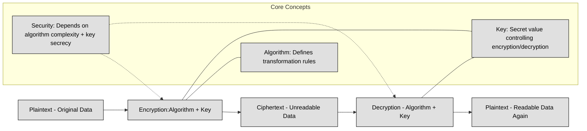
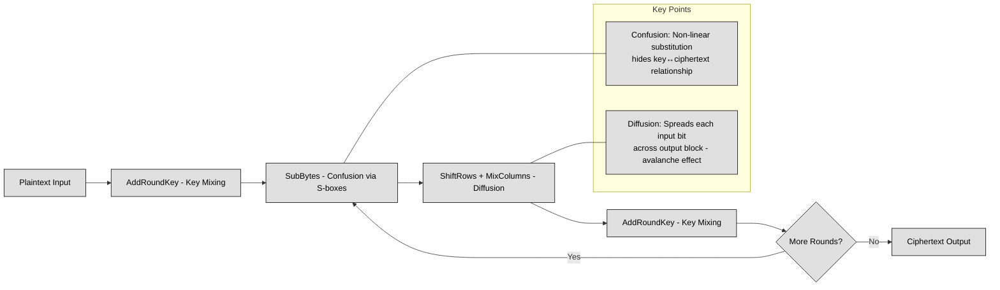

## 3.6 Select and determine cryptographic solutions ##

Cryptography is the science of securing information by transforming it into an unreadable format for unauthorized users while ensuring it remains accessible to those who have the proper credentials. It is one of the most fundamental aspects of cybersecurity, used to protect sensitive data, ensure secure communication, and verify identities.

The need for cryptography has existed since ancient times, from the early ciphers used by the Romans to modern-day encryption algorithms that secure online transactions and government communications. Today, cryptography is embedded in everything from email encryption and secure messaging apps to blockchain technology and cloud security.

Cryptography serves several crucial objectives in cybersecurity:
- **Confidentiality** ensures that information is accessible only to authorized individuals. Encryption transforms readable data (plaintext) into an unreadable form (ciphertext), making it useless to attackers without the proper key.
- **Integrity** guarantees that information has not been altered during transmission or storage. Cryptographic hash functions, such as SHA-256, create unique fingerprints of data, allowing users to verify its authenticity.
- **Authenticity** allows systems to confirm the identities of users and devices. Mechanisms like digital signatures and public-key infrastructure (PKI) help in verifying the legitimacy of communication parties.
- **Non-repudiation** prevents a sender from denying having sent a message. Digital signatures, combined with public-key cryptography, provide undeniable proof of message origin.

:link: Review [here](https://github.com/lorenzoleonelli/CISSP-Zero-to-Hero/blob/main/DOMAIN1%3A%20Security%20and%20Risk%20Management/1.02%20Understand%20and%20apply%20security%20concepts.md#121-confidentiality-integrity-and-availability-authenticity-and-nonrepudiation-5-pillars-of-information-security) the five pillars of Information Security

To understand cryptography, it is important to grasp several fundamental concepts that define how encryption and decryption work.
At the core of cryptography is the encryption process, which takes **plaintext** (original readable data) and transforms it into **ciphertext** using an algorithm and a key. The recipient then uses a decryption process to convert the ciphertext back into plaintext using the correct key. The security of the system depends on the complexity of the algorithm and the secrecy of the key.

Cryptography relies heavily on **Boolean algebra** and modular arithmetic. Boolean logic operates with binary values (0 and 1), and cryptographic algorithms often use bitwise operations such as AND, OR, XOR (exclusive OR), and NOT. XOR is particularly useful because it produces different outputs for different inputs, creating a simple yet effective way to perform encryption and decryption when combined with a key.
**Modular arithmetic**, particularly prime number operations, is fundamental in cryptographic functions. Public key cryptography, such as RSA, relies on the difficulty of factoring large prime numbers, while elliptic curve cryptography (ECC) uses the complexity of solving discrete logarithm problems.

The following table recaps Boolean Algebra (used for example in logical operations, stream ciphers, S-boxes):
| Operation | Symbol     | Description                                | Example                  |
| --------- | ---------- | ------------------------------------------ | ------------------------ |
| AND       | `·` or `∧` | Output is 1 if **both inputs are 1**       | `1 ∧ 1 = 1`, `1 ∧ 0 = 0` |
| OR        | `+` or `∨` | Output is 1 if **at least one input is 1** | `1 ∨ 0 = 1`, `0 ∨ 0 = 0` |
| NOT       | `¬` or `'` | Inverts the input                          | `¬1 = 0`, `¬0 = 1`       |
| XOR       | `⊕`        | Output is 1 if **inputs differ**           | `1 ⊕ 0 = 1`, `1 ⊕ 1 = 0` |
| NAND      | `↑`        | Inverse of AND                             | `1 ↑ 1 = 0`, `0 ↑ 1 = 1` |
| NOR       | `↓`        | Inverse of OR                              | `0 ↓ 0 = 1`, `1 ↓ 0 = 0` |

The following table recaps Modular Arithmetic (used in block ciphers, RSA, ECC):
| Concept                 | Formula         | Description                          | Example              |
| ----------------------- | --------------- | ------------------------------------ | -------------------- |
| Addition modulo n       | `(a + b) mod n` | Result wraps around after reaching n | `(7 + 5) mod 10 = 2` |
| Multiplication modulo n | `(a × b) mod n` | Same wrapping for multiplication     | `(4 × 6) mod 5 = 4`  |
| Subtraction modulo n    | `(a − b) mod n` | Negative results wrap around         | `(3 − 7) mod 5 = 1`  |
| Modular inverse         | `a⁻¹ mod n`     | Value x such that `(a×x) mod n = 1`  | If `a=3, n=7 → x=5`  |
| Exponentiation modulo n | `(a^k) mod n`   | Core of RSA, Diffie-Hellman          | `(3^4) mod 5 = 1`    |

A **key** is the most critical component of an encryption system. It acts as a secret value that determines how plaintext is transformed into ciphertext. The **key size** (e.g., 128-bit, 256-bit) directly impacts security; larger keys offer stronger encryption but require more computational resources. The **key space** refers to the total number of possible keys that an encryption algorithm can use. A larger key space makes brute-force attacks impractical, as trying every possible key would take an unreasonable amount of time.

:bulb: For example a key in AES-128 is 128 bits (16 bytes) long. An example of a 128-bit key in hexadecimal format is:

3A 5F 67 89 AB CD EF 12 34 56 78 9A BC DE F0 12

Here the Key Size is 128 bits long (16 bytes = 16 × 8 = 128 bits). The key size determines the strength of encryption. Larger key sizes increase security but also require more processing power.

The Key Space (The total number of possible keys) is 2^128 (because each bit in the key can be either 0 or 1).
2^128 ≈ 3.4 × 10^38 possible keys—an astronomically large number!

The **work factor** of an encryption algorithm represents the estimated time and computational power needed to break it. If breaking an encryption system requires more computational power than is feasible within a reasonable timeframe, it is considered secure. This is why modern cryptographic standards, such as AES-256, have high work factors that make brute-force attacks virtually impossible.

