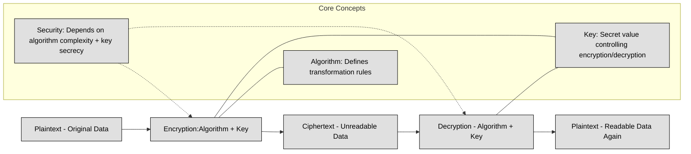

## 3.6 Select and determine cryptographic solutions ##

Cryptography is the science of securing information by transforming it into an unreadable format for unauthorized users while ensuring it remains accessible to those who have the proper credentials. It is one of the most fundamental aspects of cybersecurity, used to protect sensitive data, ensure secure communication, and verify identities.

The need for cryptography has existed since ancient times, from the early ciphers used by the Romans to modern-day encryption algorithms that secure online transactions and government communications. Today, cryptography is embedded in everything from email encryption and secure messaging apps to blockchain technology and cloud security.

Cryptography serves several crucial objectives in cybersecurity:
- **Confidentiality** ensures that information is accessible only to authorized individuals. Encryption transforms readable data (plaintext) into an unreadable form (ciphertext), making it useless to attackers without the proper key.
- **Integrity** guarantees that information has not been altered during transmission or storage. Cryptographic hash functions, such as SHA-256, create unique fingerprints of data, allowing users to verify its authenticity.
- **Authenticity** allows systems to confirm the identities of users and devices. Mechanisms like digital signatures and public-key infrastructure (PKI) help in verifying the legitimacy of communication parties.
- **Non-repudiation** prevents a sender from denying having sent a message. Digital signatures, combined with public-key cryptography, provide undeniable proof of message origin.

:link: Review [here](https://github.com/lorenzoleonelli/CISSP-Zero-to-Hero/blob/main/DOMAIN1%3A%20Security%20and%20Risk%20Management/1.02%20Understand%20and%20apply%20security%20concepts.md#121-confidentiality-integrity-and-availability-authenticity-and-nonrepudiation-5-pillars-of-information-security) the five pillars of Information Security

To understand cryptography, it is important to grasp several fundamental concepts that define how encryption and decryption work.
At the core of cryptography is the encryption process, which takes **plaintext** (original readable data) and transforms it into **ciphertext** using an algorithm and a key. The recipient then uses a decryption process to convert the ciphertext back into plaintext using the correct key. The security of the system depends on the complexity of the algorithm and the secrecy of the key.

Cryptography relies heavily on **Boolean algebra** and modular arithmetic. Boolean logic operates with binary values (0 and 1), and cryptographic algorithms often use bitwise operations such as AND, OR, XOR (exclusive OR), and NOT. XOR is particularly useful because it produces different outputs for different inputs, creating a simple yet effective way to perform encryption and decryption when combined with a key.
**Modular arithmetic**, particularly prime number operations, is fundamental in cryptographic functions. Public key cryptography, such as RSA, relies on the difficulty of factoring large prime numbers, while elliptic curve cryptography (ECC) uses the complexity of solving discrete logarithm problems.

The following table recaps Boolean Algebra (used for example in logical operations, stream ciphers, S-boxes):
| Operation | Symbol     | Description                                | Example                  |
| --------- | ---------- | ------------------------------------------ | ------------------------ |
| AND       | `·` or `∧` | Output is 1 if **both inputs are 1**       | `1 ∧ 1 = 1`, `1 ∧ 0 = 0` |
| OR        | `+` or `∨` | Output is 1 if **at least one input is 1** | `1 ∨ 0 = 1`, `0 ∨ 0 = 0` |
| NOT       | `¬` or `'` | Inverts the input                          | `¬1 = 0`, `¬0 = 1`       |
| XOR       | `⊕`        | Output is 1 if **inputs differ**           | `1 ⊕ 0 = 1`, `1 ⊕ 1 = 0` |
| NAND      | `↑`        | Inverse of AND                             | `1 ↑ 1 = 0`, `0 ↑ 1 = 1` |
| NOR       | `↓`        | Inverse of OR                              | `0 ↓ 0 = 1`, `1 ↓ 0 = 0` |

The following table recaps Modular Arithmetic (used in block ciphers, RSA, ECC):
| Concept                 | Formula         | Description                          | Example              |
| ----------------------- | --------------- | ------------------------------------ | -------------------- |
| Addition modulo n       | `(a + b) mod n` | Result wraps around after reaching n | `(7 + 5) mod 10 = 2` |
| Multiplication modulo n | `(a × b) mod n` | Same wrapping for multiplication     | `(4 × 6) mod 5 = 4`  |
| Subtraction modulo n    | `(a − b) mod n` | Negative results wrap around         | `(3 − 7) mod 5 = 1`  |
| Modular inverse         | `a⁻¹ mod n`     | Value x such that `(a×x) mod n = 1`  | If `a=3, n=7 → x=5`  |
| Exponentiation modulo n | `(a^k) mod n`   | Core of RSA, Diffie-Hellman          | `(3^4) mod 5 = 1`    |

A **key** is the most critical component of an encryption system. It acts as a secret value that determines how plaintext is transformed into ciphertext. The **key size** (e.g., 128-bit, 256-bit) directly impacts security; larger keys offer stronger encryption but require more computational resources. The **key space** refers to the total number of possible keys that an encryption algorithm can use. A larger key space makes brute-force attacks impractical, as trying every possible key would take an unreasonable amount of time.

:bulb: For example a key in AES-128 is 128 bits (16 bytes) long. An example of a 128-bit key in hexadecimal format is:

3A 5F 67 89 AB CD EF 12 34 56 78 9A BC DE F0 12

Here the Key Size is 128 bits long (16 bytes = 16 × 8 = 128 bits). The key size determines the strength of encryption. Larger key sizes increase security but also require more processing power.

The Key Space (The total number of possible keys) is 2^128 (because each bit in the key can be either 0 or 1).
2^128 ≈ 3.4 × 10^38 possible keys—an astronomically large number!

The **work factor** of an encryption algorithm represents the estimated time and computational power needed to break it. If breaking an encryption system requires more computational power than is feasible within a reasonable timeframe, it is considered secure. This is why modern cryptographic standards, such as AES-256, have high work factors that make brute-force attacks virtually impossible.

Two critical properties that strengthen encryption algorithms are confusion and diffusion.

- **Confusion** ensures a complex relationship between the encryption key and the ciphertext, making it difficult for an attacker to deduce the key by analyzing ciphertext patterns.
- **Diffusion** spreads plaintext information widely across ciphertext, so even small changes in the plaintext cause significant alterations in the ciphertext. This prevents attackers from identifying meaningful patterns.

An **initialization vector (IV)** is a random value used in encryption to ensure that identical plaintext messages produce different ciphertexts. This prevents attackers from detecting patterns in encrypted communications.
A nonce (number used once) serves a similar purpose but is typically used in authentication and key-exchange processes. It ensures that cryptographic operations cannot be replayed or reused in attacks.

Early encryption techniques relied on two primary methods: substitution and transposition.

**Substitution ciphers** replace elements of plaintext with other characters, numbers, or symbols. The Caesar cipher, which shifts letters by a fixed number of places, is a classic example.

**Transposition ciphers** rearrange plaintext elements to obscure the original message. The Rail Fence cipher is an example, where letters are written in a zigzag pattern before being read in a different sequence.

Modern encryption combines both methods in complex ways to create highly secure algorithms.

:bulb: A practical example of substitution and transposition ciphers:
| Cipher Type            | How It Works                                                       | Practical Example (Plaintext: "HELLO WORLD") | Ciphertext        |
|------------------------|--------------------------------------------------------------------|---------------------------------------------|-------------------|
| **Substitution Cipher** | Replaces each character with another using a fixed rule (e.g., shift by 3 in Caesar cipher). | Shift H→K, E→H, L→O, O→R, W→Z, R→U, D→G      | `KHOOR ZRUOG`     |
| **Transposition Cipher**| Rearranges the positions of characters without altering them (e.g., Rail Fence cipher with 2 rails). | Write zigzag: top rail `HLO WRD`, bottom rail `EL OL`, then read rows sequentially | `HLOWRDELOL`       |

**Kerckhoffs’s Principle** states that a cryptographic system should remain secure even if everything about it—except the key—is known. This principle ensures that encryption algorithms can be publicly scrutinized for weaknesses without compromising their security. Proprietary, undisclosed encryption methods are generally discouraged, as security through obscurity is not a reliable defense.

A **zero-knowledge proof** is a cryptographic method where one party can prove to another that they know a secret without revealing the secret itself. This concept is useful in authentication systems where users need to verify their identities without exposing passwords or private keys.

### Open Questions ###

1. What is cryptography and why is it important in cybersecurity?

  
Show answer

Cryptography is the science of securing information by transforming it into an unreadable format for unauthorized users while keeping it accessible to authorized parties. It is crucial for protecting sensitive data, securing communication, verifying identities, and ensuring trust in digital systems.

2. What are the four primary objectives of cryptography in cybersecurity?

  
Show answer

Confidentiality – ensures only authorized users can access information.

Integrity – guarantees data has not been altered.

Authenticity – confirms the identities of users or devices.

Non-repudiation – prevents senders from denying their actions.

3. How do encryption and decryption processes work?

  
Show answer

Encryption: Converts plaintext into unreadable ciphertext using an algorithm and a key.

Decryption: Converts ciphertext back into plaintext using the correct key.

The security depends on the algorithm’s strength and the secrecy of the key.

4. What role does a key play in cryptography, and why does key size matter?

  
Show answer

A key controls how plaintext is transformed into ciphertext. The key size (e.g., 128-bit, 256-bit) determines encryption strength—larger keys create exponentially larger key spaces (e.g., AES-128 has 2^128 ≈ 3.4×10^38 keys), making brute-force attacks infeasible.

5. What are confusion and diffusion in encryption algorithms?

  
Show answer

Confusion makes the relationship between the key and ciphertext complex, hiding key patterns.

Diffusion spreads plaintext influence across ciphertext so small plaintext changes cause major ciphertext changes, preventing pattern analysis.

6. What is the purpose of initialization vectors (IVs) and nonces?

  
Show answer

IVs and nonces introduce randomness into encryption or authentication processes to prevent repeated messages from producing identical ciphertext. This defends against replay attacks and pattern recognition.

7. How do substitution and transposition ciphers differ?

  
Show answer

Substitution ciphers replace each character with another (e.g., Caesar cipher shifting letters by 3: “HELLO” → “KHOOR”).

Transposition ciphers rearrange character positions without changing them (e.g., Rail Fence cipher writing zigzag: “HELLO WORLD” → “HLOWRDELOL”).

8. What does Kerckhoffs’s Principle state and why is it important?

  
Show answer

It states that a cryptographic system should remain secure even if everything about the system—except the key—is public knowledge. This ensures algorithms can be openly tested for flaws and discourages reliance on “security through obscurity.”

---

## 3.6.1 Cryptographic life cycle (e.g., keys, algorithm selection) ##
