## 3.6 Select and determine cryptographic solutions ##

Cryptography is the science of securing information by transforming it into an unreadable format for unauthorized users while ensuring it remains accessible to those who have the proper credentials. It is one of the most fundamental aspects of cybersecurity, used to protect sensitive data, ensure secure communication, and verify identities.

The need for cryptography has existed since ancient times, from the early ciphers used by the Romans to modern-day encryption algorithms that secure online transactions and government communications. Today, cryptography is embedded in everything from email encryption and secure messaging apps to blockchain technology and cloud security.

Cryptography serves several crucial objectives in cybersecurity:
- **Confidentiality** ensures that information is accessible only to authorized individuals. Encryption transforms readable data (plaintext) into an unreadable form (ciphertext), making it useless to attackers without the proper key.
- **Integrity** guarantees that information has not been altered during transmission or storage. Cryptographic hash functions, such as SHA-256, create unique fingerprints of data, allowing users to verify its authenticity.
- **Authenticity** allows systems to confirm the identities of users and devices. Mechanisms like digital signatures and public-key infrastructure (PKI) help in verifying the legitimacy of communication parties.
- **Non-repudiation** prevents a sender from denying having sent a message. Digital signatures, combined with public-key cryptography, provide undeniable proof of message origin.

:link: Review in [1.2.1 Confidentiality, integrity, and availability, authenticity, and nonrepudiation (5 Pillars of Information Security)](https://github.com/lorenzoleonelli/CISSP-Zero-to-Hero/blob/main/DOMAIN1%3A%20Security%20and%20Risk%20Management/1.02%20Understand%20and%20apply%20security%20concepts.md#121-confidentiality-integrity-and-availability-authenticity-and-nonrepudiation-5-pillars-of-information-security) the five pillars of Information Security

To understand cryptography, it is important to grasp several fundamental concepts that define how encryption and decryption work.
At the core of cryptography is the encryption process, which takes **plaintext** (original readable data) and transforms it into **ciphertext** using an algorithm and a key. The recipient then uses a decryption process to convert the ciphertext back into plaintext using the correct key. The security of the system depends on the complexity of the algorithm and the secrecy of the key.

Cryptography relies heavily on **Boolean algebra** and modular arithmetic. Boolean logic operates with binary values (0 and 1), and cryptographic algorithms often use bitwise operations such as AND, OR, XOR (exclusive OR), and NOT. XOR is particularly useful because it produces different outputs for different inputs, creating a simple yet effective way to perform encryption and decryption when combined with a key.
**Modular arithmetic**, particularly prime number operations, is fundamental in cryptographic functions. Public key cryptography, such as RSA, relies on the difficulty of factoring large prime numbers, while elliptic curve cryptography (ECC) uses the complexity of solving discrete logarithm problems.

The following table recaps Boolean Algebra (used for example in logical operations, stream ciphers, S-boxes):
| Operation | Symbol     | Description                                | Example                  |
| --------- | ---------- | ------------------------------------------ | ------------------------ |
| AND       | `·` or `∧` | Output is 1 if **both inputs are 1**       | `1 ∧ 1 = 1`, `1 ∧ 0 = 0` |
| OR        | `+` or `∨` | Output is 1 if **at least one input is 1** | `1 ∨ 0 = 1`, `0 ∨ 0 = 0` |
| NOT       | `¬` or `'` | Inverts the input                          | `¬1 = 0`, `¬0 = 1`       |
| XOR       | `⊕`        | Output is 1 if **inputs differ**           | `1 ⊕ 0 = 1`, `1 ⊕ 1 = 0` |
| NAND      | `↑`        | Inverse of AND                             | `1 ↑ 1 = 0`, `0 ↑ 1 = 1` |
| NOR       | `↓`        | Inverse of OR                              | `0 ↓ 0 = 1`, `1 ↓ 0 = 0` |

The following table recaps Modular Arithmetic (used in block ciphers, RSA, ECC):
| Concept                 | Formula         | Description                          | Example              |
| ----------------------- | --------------- | ------------------------------------ | -------------------- |
| Addition modulo n       | `(a + b) mod n` | Result wraps around after reaching n | `(7 + 5) mod 10 = 2` |
| Multiplication modulo n | `(a × b) mod n` | Same wrapping for multiplication     | `(4 × 6) mod 5 = 4`  |
| Subtraction modulo n    | `(a − b) mod n` | Negative results wrap around         | `(3 − 7) mod 5 = 1`  |
| Modular inverse         | `a⁻¹ mod n`     | Value x such that `(a×x) mod n = 1`  | If `a=3, n=7 → x=5`  |
| Exponentiation modulo n | `(a^k) mod n`   | Core of RSA, Diffie-Hellman          | `(3^4) mod 5 = 1`    |

A **key** is the most critical component of an encryption system. It acts as a secret value that determines how plaintext is transformed into ciphertext. The **key size** (e.g., 128-bit, 256-bit) directly impacts security; larger keys offer stronger encryption but require more computational resources. The **key space** refers to the total number of possible keys that an encryption algorithm can use. A larger key space makes brute-force attacks impractical, as trying every possible key would take an unreasonable amount of time.

:bulb: For example a key in AES-128 is 128 bits (16 bytes) long. An example of a 128-bit key in hexadecimal format is:

3A 5F 67 89 AB CD EF 12 34 56 78 9A BC DE F0 12

Here the Key Size is 128 bits long (16 bytes = 16 × 8 = 128 bits). The key size determines the strength of encryption. Larger key sizes increase security but also require more processing power.

The Key Space (The total number of possible keys) is 2^128 (because each bit in the key can be either 0 or 1).
2^128 ≈ 3.4 × 10^38 possible keys—an astronomically large number!

The **work factor** of an encryption algorithm represents the estimated time and computational power needed to break it. If breaking an encryption system requires more computational power than is feasible within a reasonable timeframe, it is considered secure. This is why modern cryptographic standards, such as AES-256, have high work factors that make brute-force attacks virtually impossible.

Two critical properties that strengthen encryption algorithms are confusion and diffusion.

- **Confusion** ensures a complex relationship between the encryption key and the ciphertext, making it difficult for an attacker to deduce the key by analyzing ciphertext patterns.
- **Diffusion** spreads plaintext information widely across ciphertext, so even small changes in the plaintext cause significant alterations in the ciphertext. This prevents attackers from identifying meaningful patterns.

An **initialization vector (IV)** is a random value used in encryption to ensure that identical plaintext messages produce different ciphertexts. This prevents attackers from detecting patterns in encrypted communications.
A **nonce (number used once)** serves a similar purpose but is typically used in authentication and key-exchange processes. It ensures that cryptographic operations cannot be replayed or reused in attacks.

Early encryption techniques relied on two primary methods: substitution and transposition.

- **Substitution ciphers** replace elements of plaintext with other characters, numbers, or symbols. The Caesar cipher, which shifts letters by a fixed number of places, is a classic example.

- **Transposition ciphers** rearrange plaintext elements to obscure the original message. The Rail Fence cipher is an example, where letters are written in a zigzag pattern before being read in a different sequence.

Modern encryption combines both methods in complex ways to create highly secure algorithms.

:bulb: A practical example of substitution and transposition ciphers:
| Cipher Type            | How It Works                                                       | Practical Example (Plaintext: "HELLO WORLD") | Ciphertext        |
|------------------------|--------------------------------------------------------------------|---------------------------------------------|-------------------|
| **Substitution Cipher** | Replaces each character with another using a fixed rule (e.g., shift by 3 in Caesar cipher). | Shift H→K, E→H, L→O, O→R, W→Z, R→U, D→G      | `KHOOR ZRUOG`     |
| **Transposition Cipher**| Rearranges the positions of characters without altering them (e.g., Rail Fence cipher with 2 rails). | Write zigzag: top rail `HLO WRD`, bottom rail `EL OL`, then read rows sequentially | `HLOWRDELOL`       |

The **Kerckhoffs’s Principle** states that a cryptographic system should remain secure even if everything about it—except the key—is known. This principle ensures that encryption algorithms can be publicly scrutinized for weaknesses without compromising their security. Proprietary, undisclosed encryption methods are generally discouraged, as **security through obscurity** is not a reliable defense.

A **zero-knowledge proof** is a cryptographic method where one party can prove to another that they know a secret without revealing the secret itself. This concept is useful in authentication systems where users need to verify their identities without exposing passwords or private keys.

### Open Questions ###

1. What is cryptography and why is it important in cybersecurity?

  
Show answer

Cryptography is the science of securing information by transforming it into an unreadable format for unauthorized users while keeping it accessible to authorized parties. It is crucial for protecting sensitive data, securing communication, verifying identities, and ensuring trust in digital systems.

2. What are the four primary objectives of cryptography in cybersecurity?

  
Show answer

- Confidentiality – ensures only authorized users can access information.

- Integrity – guarantees data has not been altered.

- Authenticity – confirms the identities of users or devices.

- Non-repudiation – prevents senders from denying their actions.

3. How do encryption and decryption processes work?

  
Show answer

Encryption: Converts plaintext into unreadable ciphertext using an algorithm and a key.

Decryption: Converts ciphertext back into plaintext using the correct key.

The security depends on the algorithm’s strength and the secrecy of the key.

4. What role does a key play in cryptography, and why does key size matter?

  
Show answer

A key controls how plaintext is transformed into ciphertext. The key size (e.g., 128-bit, 256-bit) determines encryption strength—larger keys create exponentially larger key spaces (e.g., AES-128 has 2^128 ≈ 3.4×10^38 keys), making brute-force attacks infeasible.

5. What are confusion and diffusion in encryption algorithms?

  
Show answer

Confusion makes the relationship between the key and ciphertext complex, hiding key patterns.

Diffusion spreads plaintext influence across ciphertext so small plaintext changes cause major ciphertext changes, preventing pattern analysis.

6. What is the purpose of initialization vectors (IVs) and nonces?

  
Show answer

IVs and nonces introduce randomness into encryption or authentication processes to prevent repeated messages from producing identical ciphertext. This defends against replay attacks and pattern recognition.

7. How do substitution and transposition ciphers differ?

  
Show answer

Substitution ciphers replace each character with another (e.g., Caesar cipher shifting letters by 3: “HELLO” → “KHOOR”).

Transposition ciphers rearrange character positions without changing them (e.g., Rail Fence cipher writing zigzag: “HELLO WORLD” → “HLOWRDELOL”).

8. What does Kerckhoffs’s Principle state and why is it important?

  
Show answer

It states that a cryptographic system should remain secure even if everything about the system—except the key—is public knowledge. This ensures algorithms can be openly tested for flaws and discourages reliance on “security through obscurity.”

---

## 3.6.1 Cryptographic life cycle (e.g., keys, algorithm selection) ##

Cryptography is not just about choosing a strong encryption algorithm; it involves a complete lifecycle that ensures the security and integrity of encrypted data throughout its existence. This lifecycle includes selecting the appropriate algorithm, managing encryption keys securely, and ensuring that encrypted data is handled correctly whether it is stored, transmitted, or actively being used.

The first step in the cryptographic lifecycle is selecting the right encryption algorithm. This choice depends on several factors, including security requirements, performance, compliance needs, and system constraints.

Encryption algorithms fall into two main categories:
1. **Symmetric Encryption:** The same key is used for both encryption and decryption. It is fast and efficient but requires secure key distribution. Common symmetric algorithms include AES (Advanced Encryption Standard), 3DES (Triple DES), and ChaCha20.
2. **Asymmetric Encryption:** Uses a pair of keys—one public and one private. This solves the key distribution problem but is computationally slower. Examples include RSA (Rivest-Shamir-Adleman), ECC (Elliptic Curve Cryptography).

**Hashing** is a one-way cryptographic function used for integrity verification rather than confidentiality. It ensures that data has not been modified but does not allow reversal to the original content. Secure hashing algorithms include SHA-256, SHA-3, and BLAKE2. Hashing is often used for password storage, digital signatures, and data integrity verification.

Selecting an encryption algorithm involves balancing security, efficiency, and compatibility:
- Security Strength: Algorithms should withstand brute-force and cryptanalytic attacks for a reasonable time frame. AES-256, for example, is currently considered secure against known attacks.
- Performance: Some algorithms are computationally expensive (e.g., RSA) and may not be suitable for resource-constrained environments like IoT devices.
- Regulatory Compliance: Certain industries require approved encryption standards. For example, FIPS 140-2 mandates the use of validated cryptographic algorithms in federal systems.
- Scalability: The algorithm should accommodate future security needs, such as transitioning to post-quantum cryptography when quantum computers become more practical.

Even the strongest encryption algorithm is useless if its keys are poorly managed. Key management is the most critical aspect of cryptographic security, covering key generation, distribution, storage, rotation, and disposal.

Keys should be generated using a **cryptographically secure random number generator (CSPRNG)** to prevent predictability. Poor randomness in key generation has led to real-world security breaches, such as weak SSH keys and predictable session tokens.

:bulb: A Cryptographically Secure Random Number Generator (CSPRNG) is an algorithm that generates random numbers with strong entropy, making them unpredictable and resistant to attacks such as statistical analysis and backtracking, ensuring their suitability for cryptographic applications like key generation, nonce creation, and secure token generation.

Once generated, keys must be securely stored. Best practices include:
- Hardware Security Modules (HSMs): Dedicated devices that store and manage cryptographic keys securely.
- Key Management Systems (KMS): Software-based solutions like AWS KMS and Microsoft Azure Key Vault provide secure key lifecycle management.
- Secure Enclaves: Technologies like Intel SGX and ARM TrustZone protect cryptographic operations within isolated hardware environments.

Securely distributing encryption keys is a major challenge, especially in asymmetric encryption. Common methods include:
- Public Key Infrastructure (PKI): Uses a certificate authority (CA) to distribute and authenticate public keys.
- Diffie-Hellman Key Exchange: A cryptographic protocol that allows two parties to establish a shared secret key over an untrusted network.
- Quantum Key Distribution (QKD): A future-proof method using quantum mechanics to exchange encryption keys securely.

Cryptographic keys should not be used indefinitely. Key rotation involves periodically generating new keys to minimize the impact of a compromised key. Organizations should follow:
- Time-based rotation: Replacing keys after a set period (e.g., every six months).
- Usage-based rotation: Replacing keys after a certain number of encryptions.
- Automatic expiration: Keys should have a defined lifespan to prevent reuse beyond their intended security period.

When a key is no longer needed or is suspected to be compromised, it should be revoked immediately. Key revocation is managed through certificate revocation lists (CRLs) and Online Certificate Status Protocol (OCSP) in PKI environments. Secure disposal techniques include zeroizing keys (overwriting memory) and physically destroying storage devices.

:link: Refer also to [3.6.3 Public key infrastructure (PKI) (e.g., quantum key distribution)](https://github.com/lorenzoleonelli/CISSP-Zero-to-Hero/blob/73aadeae0b75548d8e938bdc7e7c4bf771b80e49/DOMAIN3%3A%20Security%20Architecture%20and%20Engineering/3.06%20Select%20and%20determine%20cryptographic%20solutions.md#363-public-key-infrastructure-pki--eg-quantum-key-distribution)

### Open Questions ###

1. What are the main types of encryption algorithms and how do they differ?

  
Show answer

Symmetric encryption uses the same key for encryption and decryption (e.g., AES, ChaCha20), making it fast but requiring secure key distribution. Asymmetric encryption uses a public/private key pair (e.g., RSA, ECC), solving the key distribution problem but at a higher computational cost.

2. Why is key management more critical than simply choosing a strong algorithm?

  
Show answer

Even the strongest algorithm fails if keys are weak or mishandled. Proper key management ensures keys are securely generated (using CSPRNG), stored (using HSMs, KMS, or secure enclaves), distributed (via PKI or Diffie-Hellman), rotated regularly, and securely revoked or destroyed when compromised.

3. What role does hashing play in cryptography compared to encryption?

  
Show answer

Hashing is a one-way function used for integrity verification, ensuring data hasn't been altered (e.g., SHA-256, SHA-3). Unlike encryption, hashing does not provide confidentiality and cannot be reversed to retrieve the original data.

4. How do compliance and performance affect algorithm selection?

  
Show answer

Industries with strict regulations (e.g., FIPS 140-2 for federal systems) require validated algorithms, while resource-constrained environments (e.g., IoT) may need lightweight algorithms with lower computational cost. The chosen algorithm must balance security strength, efficiency, and future scalability, including readiness for post-quantum cryptography.

5. What are key rotation and revocation, and why are they important?

  
Show answer

Key rotation involves periodically replacing keys (time-based, usage-based, or with automatic expiration) to limit damage if a key is compromised. Key revocation immediately invalidates compromised or obsolete keys using mechanisms like CRLs or OCSP and secure disposal methods such as zeroizing or physical destruction.

---

## 3.6.2 Cryptographic methods (e.g., symmetric, asymmetric, elliptic curves, quantum) ##

Different cryptographic methods serve different purposes, each with its own strengths and weaknesses.

One of the most widely used approaches is symmetric encryption, which relies on a single key for both encryption and decryption. This makes it efficient for encrypting large amounts of data, but it creates a challenge when securely sharing the key between parties. The most well-known symmetric algorithms include the **Advanced Encryption Standard (AES)**, which is widely used for securing data at rest and in transit. Older algorithms like DES and 3DES have become obsolete due to security vulnerabilities.

Two fundamental approaches in symmetric encryption are stream ciphers and block ciphers. Both methods transform plaintext into ciphertext, but they operate in distinct ways, each with advantages and limitations. 
A **stream cipher** encrypts data one bit or byte at a time, making it well-suited for real-time applications like secure video calls, voice communications, and wireless encryption. It generates a continuous stream of key-dependent pseudorandom bits, called a keystream, which is combined with the plaintext using an operation like XOR (exclusive OR). Since the encryption process is continuous, stream ciphers can encrypt data of any length without padding. They are typically faster and require fewer computational resources than block ciphers, making them ideal for low-power devices and high-speed network transmissions. However, their security depends heavily on key management. If the same keystream is used more than once (a key reuse attack), attackers can exploit the repetition to break the encryption.

One of the most well-known stream ciphers is **RC4 (Rivest Cipher 4)**, which was widely used in protocols like WEP and SSL but is now considered insecure due to vulnerabilities in its key scheduling algorithm. Modern alternatives include **ChaCha20**, which provides better security and performance while avoiding the weaknesses of RC4.

:bulb: While stream ciphers are efficient, they are vulnerable to bit-flipping attacks, where an attacker can manipulate individual bits in transit without corrupting the rest of the message. Proper implementation, such as using a unique nonce (a number used once) and secure key management, is crucial to maintaining their security.

Unlike stream ciphers, **block ciphers** encrypt data in fixed-size blocks (e.g., 64-bit or 128-bit blocks). If the plaintext is shorter than the block size, padding is added to fill the remaining space. This makes block ciphers well-suited for encrypting structured data, such as files, databases, and email messages, where entire chunks of data need to be processed securely. Block ciphers apply multiple rounds of complex mathematical transformations, including substitution and transposition, to increase security. The encryption process introduces confusion (making the relationship between plaintext and ciphertext complex) and diffusion (spreading plaintext information across the ciphertext to prevent pattern detection).

One of the most widely used block ciphers is AES (Advanced Encryption Standard), which supports key sizes of 128, 192, or 256 bits. AES has become the standard for securing sensitive data in government, finance, and cloud storage. Other older block ciphers include DES (Data Encryption Standard) and 3DES, both of which are now considered weak due to small key sizes and susceptibility to brute-force attacks.

Block ciphers operate in different modes of operation, which define how blocks are processed. Some common modes include:

- ECB (Electronic Codebook): The simplest mode, but insecure because identical plaintext blocks produce identical ciphertext blocks.
- CBC (Cipher Block Chaining): Uses an initialization vector (IV) to add randomness, improving security over ECB.
- CTR (Counter Mode): Converts a block cipher into a stream cipher by generating a keystream, allowing parallel encryption for better performance.
- GCM (Galois/Counter Mode): Provides encryption and authentication, commonly used in TLS and VPNs.

Block ciphers provide strong security when implemented correctly, but they require proper key management and initialization vector selection to avoid vulnerabilities. Improper implementation, such as reusing IVs in certain modes, can weaken encryption significantly.

| Feature / Aspect               | **Stream Cipher**                                  | **Block Cipher**                                   |
| ------------------------------ | -------------------------------------------------- | -------------------------------------------------- |
| **Encryption method**          | Encrypts data bit-by-bit or byte-by-byte           | Encrypts fixed-size blocks (e.g., 128-bit)         |
| **Key usage**                  | Generates a keystream from key + IV                | Uses key directly with block cipher algorithm      |
| **Performance**                | Very fast for continuous or real-time streams      | Slower but more structured                         |
| **Modes of operation**         | Not required (acts like its own mode)              | Requires modes (ECB, CBC, GCM, etc.)               |
| **Diffusion / Error handling** | Errors affect only corresponding bits              | Errors corrupt entire block                        |
| **Use cases**                  | Video/audio streaming, VPN traffic, wireless comms | File encryption, disk encryption, secure messaging |
| **Examples**                   | RC4, ChaCha20                                      | AES, 3DES                                          |

While symmetric encryption is fast and efficient, it cannot solve the problem of secure key exchange over an untrusted network. This is where **asymmetric encryption** becomes essential. Asymmetric cryptography, also called public-key encryption, uses a pair of keys: 
- a **public key** that is shared openly and
- a **private key** that is kept secret.

- A sender can encrypt a message with the recipient’s public key, ensuring that only the recipient can decrypt it using their private key.

Asymmetric encryption is widely used for securing online communications, including TLS (which protects web traffic) and secure email protocols like PGP. It also enables digital signatures, which prove that a message or document has not been tampered with and verify the sender’s identity. However, asymmetric encryption is computationally expensive and much slower than symmetric encryption. To balance performance and security, many systems use asymmetric encryption to exchange symmetric keys, combining the benefits of both methods.

The following diagram depicts the differences between symmetric and asymmetric encryption and how asymmetric encryption can prevent MITM /man in the middle) attacks:

**Elliptic Curve Cryptography (ECC)** is a specialized form of asymmetric encryption that offers strong security with smaller key sizes. This makes it more efficient than traditional public-key algorithms like RSA. For example, ECC can provide the same level of security as a 2048-bit RSA key while using only a 256-bit ECC key. This efficiency makes ECC particularly useful for mobile devices, IoT, and blockchain applications where processing power and bandwidth are limited.

Another area of cryptographic research is **quantum cryptography**, which addresses the future threat posed by quantum computers. Traditional encryption methods rely on mathematical problems that are difficult for classical computers to solve, but quantum computers could break them using advanced algorithms like Shor’s algorithm. To counter this, researchers are developing quantum-resistant cryptographic methods, known as post-quantum cryptography. 

Additionally, **Quantum Key Distribution (QKD)** offers a way to establish encryption keys using the principles of quantum mechanics, making it theoretically immune to eavesdropping. However, quantum cryptography is still in its early stages and not yet widely practical.

### Open Questions ###

1. What is the main advantage of symmetric encryption compared to asymmetric encryption?

  
Show answer

Symmetric encryption is significantly faster and more efficient, making it ideal for encrypting large amounts of data such as files, databases, or real-time network traffic.

2. Why is key distribution a challenge in symmetric encryption?

  
Show answer

Because the same secret key is used for both encryption and decryption, securely sharing it between parties over an untrusted network is difficult without risking interception.

3. How do stream ciphers differ from block ciphers in how they process data?

  
Show answer

Stream ciphers encrypt data bit-by-bit or byte-by-byte using a continuous keystream, while block ciphers encrypt data in fixed-size chunks, such as 128-bit blocks.

4. Why is reusing a keystream in a stream cipher dangerous?

  
Show answer

If the same keystream is used more than once, attackers can analyze the resulting ciphertexts to recover plaintext or keys through known-plaintext or XOR-based attacks.

5. What are common modes of operation for block ciphers, and why are they necessary?

  
Show answer

Modes like CBC, CTR, and GCM define how block ciphers handle data larger than one block and add features like randomness or authentication. Without these modes, block ciphers like AES could be vulnerable to pattern detection.

6. Why are DES and 3DES considered obsolete today?

  
Show answer

Both have small key sizes and are vulnerable to brute-force attacks, making them unsuitable for modern security requirements. AES has replaced them as the preferred standard.

7. How does asymmetric encryption complement symmetric encryption in secure systems?

  
Show answer

Asymmetric encryption (e.g., RSA or ECC) is often used to exchange symmetric keys securely, combining the performance of symmetric encryption with the secure key distribution of asymmetric methods.

8. What future threat do quantum computers pose to cryptography?

  
Show answer

Quantum algorithms like Shor’s algorithm could break widely used public-key systems such as RSA and ECC. This is driving research into post-quantum cryptography and quantum key distribution (QKD) to ensure long-term security.

---

## 3.6.3 Public key infrastructure (PKI)  (e.g., quantum key distribution) ##

Public Key Infrastructure (PKI) is the foundation of secure digital communication. It provides a framework for managing encryption keys and digital certificates, ensuring authentication, confidentiality, integrity, and non-repudiation in online interactions. PKI enables secure data exchange by using asymmetric cryptography, which relies on a pair of public and private keys. It is widely used in securing websites, emails, documents, and even entire network infrastructures.

At its core, PKI consists of a **hierarchy of trust** that revolves around a trusted authority called the Certificate Authority (CA). The CA issues digital certificates, which serve as electronic credentials that verify the identity of users, organizations, or devices. These certificates bind a public key to an entity, ensuring that communications and transactions are secure and verifiable. When a user accesses a website using HTTPS, for example, PKI ensures that the website’s certificate is valid and issued by a trusted CA.

A key component of PKI is the process of key management. Every entity that participates in PKI has a key pair: a public key that is distributed openly and a private key that is kept secret. The security of the entire system depends on the protection of these private keys. If a private key is compromised, an attacker could impersonate the entity, decrypt confidential information, or forge signatures. To mitigate such risks, PKI includes mechanisms such as certificate revocation lists (CRLs) and online certificate status protocol (OCSP), which allow the system to revoke compromised or expired certificates.

:bulb: CRLs are lists maintained by the Certificate Authority (CA) containing serial numbers of revoked certificates, updated periodically. To verify a certificate, users download the CRL and check if its serial number is listed. On the other hand, OCSP provides real-time certificate status by querying an OCSP responder for immediate validation, offering faster and more efficient verification than CRLs, which can be large and slower to update.

PKI also plays a crucial role in digital signatures. When someone signs a document digitally, their private key generates a unique signature that others can verify using their public key. This process ensures that the document has not been altered and that it was indeed signed by the claimed individual. Digital signatures are legally recognized in many countries, making PKI essential for secure business transactions, legal agreements, and regulatory compliance.

One of the biggest challenges in PKI is key distribution and trust. Users must trust that a CA is legitimate and follows strict security policies. In some cases, attackers have obtained fraudulent certificates from CAs, leading to security breaches. To enhance security, many organizations implement private PKI infrastructures rather than relying solely on public certificate authorities.

As quantum computing advances, traditional PKI faces potential risks. Quantum computers could theoretically break current asymmetric encryption algorithms, rendering existing PKI systems vulnerable. To address this, researchers are developing quantum-resistant cryptographic algorithms and **Quantum Key Distribution (QKD)**. Unlike classical encryption, QKD leverages the principles of quantum mechanics to securely distribute cryptographic keys. Any attempt to intercept a quantum key alters its state, making eavesdropping detectable.

:bulb: Quantum computing is a type of computing that uses the principles of quantum mechanics to process information in a radically different way than traditional computers. Instead of using bits, which are either 0 or 1, quantum computers use qubits that can represent both 0 and 1 simultaneously, allowing them to solve certain complex problems much faster.

### Open Questions ###

1. How does PKI ensure secure communication between two parties?

  
Show answer

PKI ensures secure communication by using asymmetric cryptography, which involves a pair of keys—a public key and a private key. The public key is shared openly, while the private key remains secret. When one party encrypts data using the recipient’s public key, only the recipient’s private key can decrypt it. Additionally, PKI uses digital certificates issued by trusted Certificate Authorities (CAs) to verify the identity of entities, ensuring that the communication is both confidential and authenticated. This framework also provides integrity (detecting any tampering) and non-repudiation (proving who sent the data).

2. What role do Certificate Authorities (CAs) play in PKI, and why is their trustworthiness critical?

  
Show answer

CAs act as trusted third parties that issue and manage digital certificates. These certificates bind an entity’s identity to its public key, confirming that the key truly belongs to that entity. The trustworthiness of CAs is critical because if a CA is compromised or issues a fraudulent certificate, attackers can impersonate legitimate entities, intercept sensitive communications, or launch man-in-the-middle attacks. Therefore, strict security policies and regular audits are essential for maintaining the integrity of PKI.

3. How does PKI handle the problem of compromised or expired certificates?

  
Show answer

PKI addresses compromised or expired certificates through certificate revocation mechanisms, primarily Certificate Revocation Lists (CRLs) and the Online Certificate Status Protocol (OCSP).
CRLs are periodically updated lists published by CAs containing the serial numbers of revoked certificates. Clients download these lists to check certificate validity.
OCSP provides real-time validation by querying an OCSP responder to check a certificate’s status, offering faster and more efficient verification than downloading large CRLs.

4. In what ways is PKI used beyond securing websites, and why is it legally significant?

  
Show answer

PKI is used in multiple areas beyond HTTPS, including securing emails (S/MIME), protecting documents, authenticating devices in IoT networks, and enabling VPN access. One of its most significant uses is in digital signatures, where a private key signs a document, and others verify it using the public key. This guarantees the document’s integrity and authenticity. Digital signatures are legally recognized in many jurisdictions, making PKI crucial for business contracts, financial transactions, and regulatory compliance.

5. What are the future challenges PKI faces with quantum computing, and how is the industry preparing for it?

  
Show answer

Quantum computing poses a major challenge because it could break current asymmetric encryption algorithms like RSA and ECC, which form the backbone of PKI. Quantum algorithms, such as Shor’s algorithm, can factor large numbers exponentially faster than classical computers, rendering existing systems insecure. To counter this, researchers are developing post-quantum cryptographic algorithms and exploring Quantum Key Distribution (QKD), which uses quantum mechanics principles to detect eavesdropping and securely distribute keys.

---

## 3.6.4 Key management practices (e.g., rotation)  ##

Effective key management is essential for maintaining the security of cryptographic systems. Keys are the foundation of encryption, ensuring that data remains protected from unauthorized access. However, if keys are not properly managed, even the strongest encryption algorithms can be rendered useless. Key management involves the generation, storage, usage, rotation, and eventual destruction of cryptographic keys, ensuring they remain secure throughout their lifecycle.

The security of any cryptographic system starts with **strong key generation**. Keys must be unpredictable and resistant to attacks, which means they should be generated using a cryptographically secure random number generator (CSPRNG). Poor key generation methods, such as using weak random sources or predictable patterns, can make encryption vulnerable to brute-force attacks.

Key length is also a crucial factor. A longer key generally provides stronger security, but it must be chosen based on the algorithm in use. For example, AES encryption requires a minimum of 128-bit keys, though 256-bit keys are preferred for high-security applications. 

:link: [NIST SP 800-133](https://csrc.nist.gov/pubs/sp/800/133/r2/final) discusses the generation of the keys to be managed and used by the approved cryptographic algorithms.

Once a key is generated, it must be stored securely to prevent unauthorized access or exposure. Keys should never be hardcoded into software or stored in plaintext files. Instead, they should be protected within **hardware security modules (HSMs)**, secure enclaves, or **dedicated key management systems (KMS)**.

:bulb: An application should never see or handle the key directly. It should only request cryptographic operations from a trusted module via secure APIs (PKCS #11, KMIP, JCE/JCA, etc.), ensuring that key material remains isolated, auditable, and resilient against compromise.

To prevent a single point of failure, key management must incorporate principles of separation of duties, dual control, and split knowledge. These measures reduce the risk of insider threats and unauthorized key access.

- **Separation of duties** ensures that no single individual has complete control over key management functions. For example, one person may generate the key while another is responsible for key distribution. This reduces the chances of a malicious insider compromising the key.
- **Dual control** requires at least two authorized individuals to perform critical cryptographic operations, such as key generation or key recovery. This prevents a single person from acting alone in accessing or modifying key material.
- **Split knowledge** further enhances security by dividing the key into multiple components, ensuring that no single individual has access to the entire key. This method is commonly used in highly secure environments, such as financial institutions and government agencies, to protect sensitive encryption keys.

Cryptographic keys should not be used indefinitely. Over time, the risk of key compromise increases due to factors such as advanced attacks, key exposure, or computational advancements. To mitigate this risk, organizations implement key rotation and key changes at regular intervals.
**Key rotation** involves replacing cryptographic keys periodically to reduce the impact of key exposure. When a key is rotated, the new key replaces the old key while ensuring data remains accessible. Some systems use automated key rotation, where keys are updated based on predefined schedules. **Key changes**, on the other hand, involve generating entirely new keys and re-encrypting data with the new keys. This is more resource-intensive than key rotation but is necessary when a key is suspected to be compromised.

:bulb: Key wrapping is a technique where a new encryption key is used to securely encrypt and store the old key, allowing it to be safely rotated without exposing sensitive data. Dual encryption involves encrypting data with both the old and new keys during the transition period, ensuring that both keys can decrypt the data until the old key is fully phased out.

Certain cryptographic protocols, such as TLS, use **session keys** that are regularly refreshed to minimize security risks. For example, **Perfect Forward Secrecy (PFS)** ensures that even if a session key is compromised, it cannot be used to decrypt past communications.

When a cryptographic key is no longer needed, it must be securely destroyed to prevent recovery. Simply deleting a key from a file system is not enough, as data remnants can still be recovered using forensic techniques. Secure key destruction involves overwriting the key multiple times, using secure deletion algorithms, or physically destroying the storage medium that contained the key.

For high-security environments, key destruction may involve cryptographic erasure, where the key is securely wiped from a hardware security module, making it irrecoverable. In some cases, physical destruction of hard drives or secure devices is necessary to ensure that keys cannot be retrieved.

:link: [NIST SP 800-57](https://csrc.nist.gov/pubs/sp/800/57/pt1/r5/final) provides cryptographic key-management guidance.

### Open Questions ###

1. Why is strong key generation critical to cryptographic security?

  
Show answer

Even the strongest algorithms are ineffective if keys are weak or predictable. Keys must be generated using cryptographically secure random number generators (CSPRNGs) to ensure unpredictability and resistance to brute-force attacks. Standards like NIST SP 800-133 provide guidance on secure key generation.

2. How does key length affect the strength of an encryption system?

  
Show answer

Longer keys generally provide higher resistance to brute-force attacks. For example, AES requires a minimum 128-bit key, while 256-bit keys are recommended for high-security applications. However, key length must align with the chosen algorithm and performance requirements.

3. What are best practices for securely storing cryptographic keys?

  
Show answer

Keys should never be hardcoded into source code or stored in plaintext files. Instead, they must be stored inside Hardware Security Modules (HSMs), secure enclaves, or Key Management Systems (KMS). Applications should use secure APIs (PKCS #11, KMIP, JCE/JCA) to perform cryptographic operations without ever directly accessing the key material.

4. How do separation of duties, dual control, and split knowledge enhance key security?

  
Show answer

- Separation of duties: Prevents one person from controlling all key functions.
- Dual control: Requires two authorized individuals for critical key operations.
- Split knowledge: Divides keys into multiple components so no one individual ever has access to the entire key.

These controls reduce insider threats and ensure no single point of compromise.

5. What is key rotation and why is it necessary?

  
Show answer

Key rotation replaces keys periodically to limit the damage if a key is compromised. Automated rotation schedules reduce administrative overhead. Techniques like key wrapping (encrypting old keys with new ones) or dual encryption (supporting both keys during transition) allow seamless updates without downtime.

6. How does Perfect Forward Secrecy (PFS) relate to key management?

  
Show answer

PFS ensures that compromise of one session key does not expose past communications. Protocols like TLS frequently refresh session keys using ephemeral key exchanges (e.g., ECDHE), limiting the risk of long-term key exposure.

7. What are secure methods for destroying cryptographic keys?

  
Show answer

Keys must be irreversibly destroyed when no longer needed. Options include:

- Cryptographic erasure inside HSMs.

- Overwriting keys using secure deletion algorithms.

- Physical destruction of hardware (e.g., shredding drives).

8. What risks arise from improper key management even when strong algorithms are used?

  
Show answer

Improper management—such as poor key storage, failure to rotate keys, or inadequate access controls—can make even AES-256 vulnerable. Attackers may bypass encryption entirely by stealing keys rather than breaking algorithms, rendering the system insecure despite theoretically strong cryptography.

---

## 3.6.5 Digital signatures and digital certificates (e.g., non-repudiation, integrity) ##

Digital signatures and digital certificates are essential cryptographic tools that play a crucial role in securing digital communications and transactions. These technologies help ensure the authenticity, integrity, and non-repudiation of digital information.

A **digital signature** serves as a cryptographic technique to verify the authenticity of a message, document, or transaction. It is similar to a handwritten signature or a stamped seal but much more secure. The process involves a combination of public-key cryptography and hash functions.

Here’s how it works:
1. The sender generates a unique hash value from the message or document they want to sign. A hash function converts the document into a fixed-size string of characters, which represents the contents of the document in a compressed format.
2. This hash value is then encrypted using the sender's private key. The encryption creates the digital signature.
3. The recipient can decrypt the signature using the sender's public key, revealing the original hash value.
4. The recipient then generates a new hash value from the received message or document and compares it to the decrypted hash value.

-If the two hashes match, it confirms that the message has not been altered during transmission ensuring **integrity**.If the message is altered, the hash values will not match, indicating that the document has been tampered with.

-The digital signature also authenticates the identity of the sender, ensuring **non-repudiation**. The sender cannot later deny having sent the message because only they hold the private key used to create the signature.

**Non-repudiation** refers to the ability to prove that a message or transaction originated from a specific sender. In the context of digital signatures, it ensures that the sender cannot deny sending the message after it has been signed. Since only the sender has access to their private key (which is used to sign the document), the sender cannot later claim that they did not sign it. This concept is crucial in legal and financial transactions, where accountability is necessary.

Message **integrity** means that the content of the message remains unchanged during transmission. If the message is altered in any way, the hash value generated by the recipient will not match the decrypted hash from the digital signature. This ensures that the message has not been tampered with, preserving its integrity.

:link: Review [here](https://github.com/lorenzoleonelli/CISSP-Zero-to-Hero/blob/main/DOMAIN1%3A%20Security%20and%20Risk%20Management/1.02%20Understand%20and%20apply%20security%20concepts.md#121-confidentiality-integrity-and-availability-authenticity-and-nonrepudiation-5-pillars-of-information-security) the 5 pillars of information security

A **digital certificate** is a cryptographic credential issued by a trusted entity called a **Certificate Authority (CA)**. The purpose of a digital certificate is to authenticate the identity of an individual, organization, or device in online communications. It binds a public key to the identity of the key owner and ensures that the public key can be trusted for secure communications.

Here’s how digital certificates work:

- A user or organization generates a key pair (a private key and a public key).
- The user submits a certificate signing request (CSR) to a CA. The CSR contains the user's public key and identifying information (e.g., name, organization).
- The CA verifies the identity of the requester and issues a certificate containing the user's public key, identity details, and other information such as the validity period of the certificate.
- The certificate is digitally signed by the CA using its private key, proving that it is legitimate and has been verified by a trusted entity.

Digital certificates help establish trust because the recipient of the certificate can verify that it was issued by a trusted CA. By using the CA's public key, they can validate that the certificate has not been altered or tampered with. This ensures that the public key in the certificate truly belongs to the person or entity it claims to represent achieving authentication.

```mermaid
graph LR
    subgraph CA["Certificate Authority CA"]
        C1["Generates and Signs Digital Certificate"] --> Cert["Digital Certificate Public Key plus Identity"]
    end

    subgraph User["User or Device"]
        Request["Generates Key Pair Public Key plus Private Key"] --> C2["Submits CSR Certificate Signing Request"]
        C2 --> CA
        Cert --> Install["Installs Signed Certificate"]
    end

    subgraph RelyingParty["Client or Browser or Verifier"]
        Verify["Checks Certificate Against Trusted CA List"] --> Valid["Identity Confirmed → AUTHENTICATION"]
        Verify --> Invalid["Certificate Invalid → Connection Rejected"]
    end

    Install --> Comm["Secure Communication Using Certificate"]
    Comm --> Verify

    classDef center fill:#ffffff,color:#000000,stroke:#000000,stroke-width:1px,font-weight:bold
    classDef node fill:#e0e0e0,color:#000000,stroke:#000000,stroke-width:1px

```

### Open Questions ###

1. How does a digital signature ensure message integrity?

  
Show answer

A digital signature uses a hash function to create a unique fingerprint of the message. The sender encrypts this hash using their private key. When the recipient decrypts the signature with the sender’s public key and recomputes the hash on the received message, matching values confirm the message has not been altered in transit.

2. Why does a digital signature provide non-repudiation?

  
Show answer

Only the sender holds their private key, which is required to generate the signature. If the signature verifies correctly using their public key, the sender cannot later deny signing the document. This accountability is critical in legal, financial, and regulatory contexts.

3. What role does public-key infrastructure (PKI) play in digital certificates?

  
Show answer

PKI provides the framework for issuing, validating, and managing digital certificates. Certificate Authorities (CAs) verify identities and digitally sign certificates, ensuring that public keys can be trusted for secure communications.

4. How are hash functions used in the digital signature process?

  
Show answer

Hash functions generate a fixed-size digest from the original message. This digest, rather than the full message, is signed using the sender’s private key, making the signing process faster and ensuring that even a tiny change in the message produces a completely different hash.

5. What information does a digital certificate contain, and why is it important?

  
Show answer

A certificate includes the subject’s public key, identity details (name, organization), validity period, and the CA’s digital signature. This information binds a public key to its owner, enabling recipients to verify that the key is authentic and belongs to the claimed individual or entity.

6. How does a Certificate Authority verify the identity of a requester?

  
Show answer

The CA validates the requester’s identity using organizational documents, domain ownership checks, or extended validation procedures, depending on the certificate type. Only after successful verification does the CA issue and sign the certificate.

7. How do digital certificates relate to the five pillars of information security?

  
Show answer

Digital certificates primarily address Authentication, ensuring that a public key truly belongs to its claimed owner. They indirectly support Integrity and Non-repudiation when used with digital signatures, while also contributing to Confidentiality when paired with encryption.

8. What happens if a digital certificate is compromised or expires?

  
Show answer

If a certificate is compromised, the CA revokes it using a Certificate Revocation List (CRL) or Online Certificate Status Protocol (OCSP). If it expires, it is no longer trusted, and the owner must request a new certificate. Both actions prevent misuse of invalid credentials.

