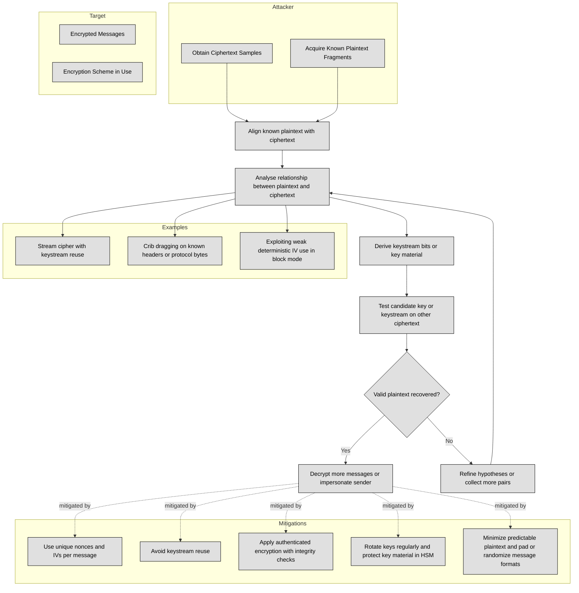

## 3.7.1 Brute force ##

Brute force attacks are one of the simplest and most widely known methods in the field of cryptanalysis used to break encryption schemes. In the context of cryptanalytic attacks, brute force refers to a technique where an attacker systematically checks all possible keys or combinations until the correct one is found. This method relies on the power of computational resources, which have increased exponentially in recent years, to try every potential key or solution until the cipher is decrypted.

:brain: In a brute force attack, the attacker does not rely on any shortcuts or weaknesses in the encryption algorithm but simply attempts every possible key or combination until the correct one is discovered. The idea is to exhaustively search through the keyspace of a cryptographic system by testing each possible key and checking if it produces a valid or readable plaintext.

The process of a brute force attack can be broken down into the following steps:

| Step | Description |
|------|-------------|
| Identify the encryption algorithm | The attacker must determine which encryption algorithm is used (e.g., AES, DES, RSA). Some algorithms are more vulnerable to brute-force attacks depending on the key length. |
| Gather the ciphertext | The attacker needs access to the encrypted message (ciphertext) or password. |
| Generate possible keys | The attack tries all keys in the cipher's keyspace. For example, with a 128-bit key, there are 2^128 possibilities. Larger keys make brute-force attacks far harder. |
| Decrypt using each key | For every generated key, the attacker attempts decryption. If the output is valid plaintext, the correct key has been found. |
| Repeat until success | The process continues until the correct key is discovered or computational resources run out. Success depends on key length, decryption speed, and available computing power. |

Several factors influence the feasibility and effectiveness of a brute force attack:

| Factor                | Description |
|-----------------------|-------------|
| Key Length            | The most critical factor. More bits mean more possible keys to try.   • **56-bit (DES):** 2^56 possible keys, brute-force feasible with modern computing.  • **128-bit:** 2^128 possible keys, computationally infeasible with current technology.  • **256-bit (AES-256):** 2^256 possible keys, brute force is effectively impossible today. |
| Computational Power   | Attack speed depends on available hardware. Modern GPUs can attempt billions or trillions of key guesses per second, dramatically improving brute force efficiency. |
| Time and Feasibility  | Larger key sizes make brute force attacks impractical. For example, breaking a 128-bit key could take centuries or longer with current technology. |
| Parallel Processing   | Using distributed computing or cloud services, attackers can split the key space into smaller segments, increasing attack speed through parallelization. |
| Encryption Algorithm  | Some algorithms are inherently more resistant to brute force due to design. AES-256 is highly secure, while DES is weak because of its shorter 56-bit key. |

:bulb: One of the classic examples of brute force attacks is the breaking of the DES (Data Encryption Standard) algorithm. DES uses a 56-bit key, which was considered secure when it was developed in the 1970s. However, by the late 1990s, computational power had advanced enough that a brute force attack could break DES encryption in a reasonable amount of time. In fact, in 1997, the Electronic Frontier Foundation (EFF) built a machine called the DES Cracker that was capable of trying all 2^56 keys in just a few days, proving that DES was no longer secure.

There are several ways to defend against brute force attacks:

1. **Use Stronger Key Lengths**: The most effective countermeasure is to use longer keys. For example, AES-128 is considered secure, but AES-256 provides a much higher level of security and would require far more computational power to break through brute force.

2. **Key Stretching**: Key stretching is a technique used to make the decryption process more computationally expensive for attackers. This involves applying a hashing function multiple times to the key, making brute force attacks slower and more resource-intensive. Examples of key stretching algorithms include PBKDF2, bcrypt, and scrypt.

3. **Salting**: Adding random data (a salt) to the encryption process can help defend against brute force attacks, especially in the context of password encryption. By using a unique salt for each password, attackers cannot use precomputed tables (like rainbow tables) to guess passwords efficiently.

4. **Rate Limiting**: Limiting the number of decryption attempts an attacker can make within a certain time frame can help slow down brute force attacks. This is especially important in online systems like password-protected websites.

5. **Multi-factor Authentication (MFA)**: Even if an attacker manages to crack a password or encryption key, requiring additional authentication factors (such as a token or biometric data) can thwart brute force attacks.

### Open Questions ###

1. What is a brute force attack, and how does it work in cryptanalysis?

  
Show answer

A brute force attack systematically tries every possible key or password combination until the correct one is found. Unlike other cryptanalytic methods, it doesn’t exploit weaknesses in the algorithm—it simply exhausts the keyspace by testing each key, decrypting the ciphertext, and checking if the result is valid plaintext.

2. Why is key length the most critical factor in preventing brute force attacks?

  
Show answer

Key length determines the size of the keyspace an attacker must search. A 56-bit DES key has 2^56 possibilities and can be broken with modern computing in days, whereas a 128-bit AES key has 2^128 possibilities, requiring computational resources beyond current capabilities. A 256-bit AES key is effectively unbreakable using brute force today.

3. How did the DES Cracker prove that DES encryption was no longer secure?

  
Show answer

In 1997, the Electronic Frontier Foundation (EFF) built a special-purpose machine capable of testing all 2^56 DES keys in a matter of days. This demonstration showed that DES encryption could no longer withstand brute force attacks, prompting a shift toward stronger encryption standards like AES.

4. What techniques can make brute force attacks less practical or effective?

  
Show answer

Defensive measures include using longer keys (AES-256 instead of AES-128), key stretching (PBKDF2, bcrypt, scrypt), salting passwords to prevent precomputed attacks, implementing rate-limiting to slow attackers, and adding multi-factor authentication to protect even if a password or key is compromised.

5. How does parallel processing increase the speed of brute force attacks?

  
Show answer

Parallel processing allows attackers to split the keyspace among many machines or use GPU clusters to test billions or trillions of keys per second. Distributed networks and cloud resources make brute force faster by dividing the workload, drastically reducing the time needed to try all possible keys.

---

## 3.7.2 Ciphertext only ##

Ciphertext-only attacks are a type of cryptanalytic attack where the attacker has access to the ciphertext but does not have any information about the plaintext or the encryption key. In this attack scenario, the attacker tries to deduce the encryption algorithm, the encryption key, or the plaintext from the ciphertext alone, often using statistical techniques, patterns, or other clues inherent in the ciphertext.
This form of attack is challenging because the attacker has no direct information about the plaintext, making it harder to reverse-engineer the encryption. However, even without knowledge of the plaintext or key, attackers can still attempt to exploit weaknesses in the encryption method and gain valuable insights from the ciphertext.

How Ciphertext-Only Attacks Work:

| Concept | Description |
|---------|-------------|
| **Access to Ciphertext** | The attacker has access to the encrypted data but does not know the key or plaintext. This may occur by intercepting messages during transmission or obtaining encrypted records from a database. |
| **Exploiting Patterns and Statistical Weaknesses** | Even with only ciphertext, attackers can analyze patterns to infer information:   • **Frequency Analysis:** In classical ciphers (e.g., Caesar, substitution), letters like "e" appear frequently and can reveal mappings.  • **Known Plaintext Assumptions:** Predictable message headers (e.g., "Dear Sir", "Hello") give clues.  • **Block or Stream Cipher Weaknesses:** Poor key selection or weak randomization may expose patterns. |
| **Cryptanalysis Techniques** | Advanced methods used to deduce keys or plaintext:   • **Differential Cryptanalysis:** Examines how changes in ciphertext relate to plaintext to guess the key.  • **Linear Cryptanalysis:** Finds linear relationships between plaintext and ciphertext to predict key bits.  • **Exploiting Weak Randomization:** Predictable IVs or nonces can help infer key or plaintext patterns. |
| **Known Cipher Properties** | Attackers leverage known characteristics of encryption algorithms (e.g., AES block structure, predictable dependencies within ciphertext blocks) to assist cryptanalysis. |

Examples of Ciphertext-Only Attacks are:

1. Classical Ciphers: In classical ciphers, such as the Caesar cipher or substitution cipher, the ciphertext is often vulnerable to frequency analysis because of the predictable nature of the plaintext language. For instance, in English, the letter "e" appears most frequently, and this frequency pattern is often preserved in the ciphertext. In such cases, an attacker can deduce potential character mappings by comparing the frequency of letters in the ciphertext with the expected frequency distribution of the language.

2. Enigma Machine: During World War II, the German Enigma machine was initially thought to be secure due to its complex encryption method. However, the allies were able to break Enigma messages by analyzing ciphertext patterns and exploiting weaknesses in the machine's configuration, including predictable settings and repeated key usage.

3. Early Modern Cryptanalysis: In the early days of modern cryptography, DES (Data Encryption Standard) was susceptible to ciphertext-only attacks because the algorithm had a relatively small key size (56 bits). Even though brute force was not an option, patterns in the ciphertext could sometimes be exploited.

4. Attacks on Block Ciphers: Modern block ciphers like AES are generally resistant to ciphertext-only attacks. However, certain weak implementations or side-channel vulnerabilities (like improper padding or poor random number generation) can provide clues that lead to successful attacks. An attacker might leverage patterns in the ciphertext to reverse-engineer the encryption key or plaintext.

### Open Questions ###

1. What makes ciphertext-only attacks fundamentally more difficult than other cryptanalytic attacks?

  
Show answer

Ciphertext-only attacks are challenging because the attacker has no access to plaintext, keys, or intermediate information—only the encrypted output. Without known plaintext–ciphertext pairs or chosen inputs, the attacker must rely solely on statistical analysis, frequency patterns, or weaknesses in the cipher’s structure. Modern algorithms like AES are specifically designed to eliminate such exploitable patterns, making ciphertext-only attacks impractical when implemented correctly.

2. How can statistical analysis, like frequency analysis, be applied in ciphertext-only attacks?

  
Show answer

In classical ciphers (e.g., Caesar or substitution), the distribution of letters in the plaintext is often preserved in the ciphertext. For example, in English, the letter “e” is the most common, and this statistical regularity can leak into ciphertext. By comparing the frequency of ciphertext characters with known language frequency profiles, attackers can guess potential mappings and gradually reconstruct the plaintext without knowing the key.

3. Why were historical encryption systems like Enigma and DES vulnerable to ciphertext-only attacks?

  
Show answer

Enigma: Weak operational practices (e.g., repeated keys, predictable message headers like “Heil Hitler”) combined with known structural properties of the machine allowed cryptanalysts to detect patterns and reduce key search space.

DES: Its 56-bit key space was small by modern standards, and while ciphertext-only cryptanalysis was rare, statistical weaknesses in certain implementations could reveal partial key information without brute force.

4. What role do weak implementations play in making modern ciphers susceptible to ciphertext-only attacks?

  
Show answer

Even secure algorithms like AES can be undermined by poor implementations. Examples include:

Predictable IVs or nonces in block or stream ciphers, which expose patterns.

Improper padding or encoding, which leaks information about ciphertext structure.

Key reuse across sessions, which creates correlations attackers can exploit.

These weaknesses allow attackers to perform ciphertext-only analysis despite the strength of the cipher.

5. What defenses make ciphertext-only attacks practically infeasible today?

  
Show answer

Use of strong algorithms with long keys (e.g., AES-256).

Randomized encryption schemes (using unpredictable IVs and nonces).

Key management best practices (never reusing keys).

Padding and salting techniques to ensure ciphertext randomness.

Cryptographic audits and testing to eliminate implementation flaws.

Together, these measures ensure that ciphertext reveals no exploitable patterns, rendering ciphertext-only attacks impractical against modern cryptosystems.

---

## 3.7.2 Known plaintext  ##

Known-plaintext attacks are a type of cryptanalytic attack where **the attacker has access to both the ciphertext (the encrypted message) and the corresponding plaintext (the original, unencrypted message)**. The goal of this attack is to use the known relationship between the plaintext and ciphertext to deduce the encryption key or break the encryption scheme.

:brain: Known plaintext attacks are based on cribs. In cryptography, a crib is a piece of plaintext that the attacker expects or guesses to appear in the encrypted message (ciphertext).

Here's how it works:
1. The Attacker's Knowledge: In a known-plaintext attack, the attacker already knows some part of the plaintext and has access to the corresponding ciphertext (the encrypted version of that plaintext). For example, the attacker might know that part of a message is a common greeting like "Hello," and they can also see the encrypted version of that greeting.

2. Using the Known Relationship: The attacker compares the known plaintext to the ciphertext to analyze how the encryption system transformed the plaintext into ciphertext. If the encryption algorithm has patterns or weaknesses, the attacker may be able to use these to figure out the encryption key or uncover more about how the cipher works.

3. Finding the Encryption Key: By analyzing multiple pairs of known plaintext and ciphertext, the attacker can start to make educated guesses about the encryption key. Once the key is discovered, the attacker can decrypt any other ciphertext that was encrypted with the same key.

1. What is the main requirement for carrying out a known-plaintext attack?

  
Show answer

The attacker must have access to both the plaintext (the original unencrypted message) and the corresponding ciphertext. This pairing allows them to study how the encryption algorithm transforms plaintext into ciphertext and potentially reveal weaknesses or parts of the encryption key.

2. How do cribs support a known-plaintext attack?

  
Show answer

A crib is a piece of plaintext that the attacker expects or guesses will appear in the ciphertext, such as common greetings or predictable headers. By aligning these cribs with the ciphertext, attackers can deduce how the cipher operates and reduce the effort needed to find the encryption key.

3. Why are multiple plaintext-ciphertext pairs valuable in a known-plaintext attack?

  
Show answer

With several known pairs, attackers can look for consistent patterns in how plaintext is transformed into ciphertext. These patterns can reveal structural weaknesses in the algorithm and help the attacker reconstruct the encryption key more quickly and reliably.

4. What is the ultimate goal of a known-plaintext attack?

  
Show answer

The goal is to determine the encryption key or uncover enough information about the encryption process to decrypt other ciphertexts encrypted with the same key. Once the key is recovered, the attacker can read all messages secured with it.

5. How do modern encryption algorithms resist known-plaintext attacks?

  
Show answer

Modern algorithms like AES are designed to prevent patterns between plaintext and ciphertext from being exploited. Techniques such as using strong key sizes, random initialization vectors (IVs), and proper padding ensure that even with known plaintext, it is computationally infeasible to deduce the encryption key.

