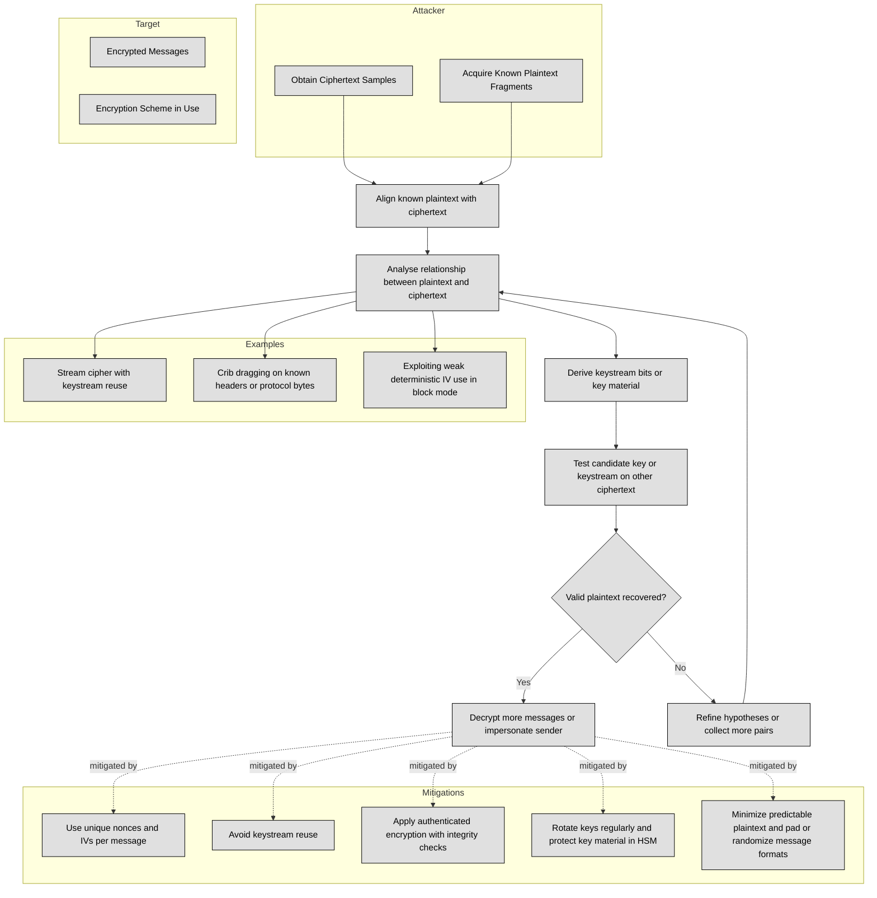

## 3.7.1 Brute force ##

Brute force attacks are one of the simplest and most widely known methods in the field of cryptanalysis used to break encryption schemes. In the context of cryptanalytic attacks, brute force refers to a technique where an attacker systematically checks all possible keys or combinations until the correct one is found. This method relies on the power of computational resources, which have increased exponentially in recent years, to try every potential key or solution until the cipher is decrypted.

:brain: In a brute force attack, the attacker does not rely on any shortcuts or weaknesses in the encryption algorithm but simply attempts every possible key or combination until the correct one is discovered. The idea is to exhaustively search through the keyspace of a cryptographic system by testing each possible key and checking if it produces a valid or readable plaintext.

The process of a brute force attack can be broken down into the following steps:

| Step | Description |
|------|-------------|
| Identify the encryption algorithm | The attacker must determine which encryption algorithm is used (e.g., AES, DES, RSA). Some algorithms are more vulnerable to brute-force attacks depending on the key length. |
| Gather the ciphertext | The attacker needs access to the encrypted message (ciphertext) or password. |
| Generate possible keys | The attack tries all keys in the cipher's keyspace. For example, with a 128-bit key, there are 2^128 possibilities. Larger keys make brute-force attacks far harder. |
| Decrypt using each key | For every generated key, the attacker attempts decryption. If the output is valid plaintext, the correct key has been found. |
| Repeat until success | The process continues until the correct key is discovered or computational resources run out. Success depends on key length, decryption speed, and available computing power. |

Several factors influence the feasibility and effectiveness of a brute force attack:

| Factor                | Description |
|-----------------------|-------------|
| Key Length            | The most critical factor. More bits mean more possible keys to try.   • **56-bit (DES):** 2^56 possible keys, brute-force feasible with modern computing.  • **128-bit:** 2^128 possible keys, computationally infeasible with current technology.  • **256-bit (AES-256):** 2^256 possible keys, brute force is effectively impossible today. |
| Computational Power   | Attack speed depends on available hardware. Modern GPUs can attempt billions or trillions of key guesses per second, dramatically improving brute force efficiency. |
| Time and Feasibility  | Larger key sizes make brute force attacks impractical. For example, breaking a 128-bit key could take centuries or longer with current technology. |
| Parallel Processing   | Using distributed computing or cloud services, attackers can split the key space into smaller segments, increasing attack speed through parallelization. |
| Encryption Algorithm  | Some algorithms are inherently more resistant to brute force due to design. AES-256 is highly secure, while DES is weak because of its shorter 56-bit key. |

:bulb: One of the classic examples of brute force attacks is the breaking of the DES (Data Encryption Standard) algorithm. DES uses a 56-bit key, which was considered secure when it was developed in the 1970s. However, by the late 1990s, computational power had advanced enough that a brute force attack could break DES encryption in a reasonable amount of time. In fact, in 1997, the Electronic Frontier Foundation (EFF) built a machine called the DES Cracker that was capable of trying all 2^56 keys in just a few days, proving that DES was no longer secure.

There are several ways to defend against brute force attacks:

1. **Use Stronger Key Lengths**: The most effective countermeasure is to use longer keys. For example, AES-128 is considered secure, but AES-256 provides a much higher level of security and would require far more computational power to break through brute force.

2. **Key Stretching**: Key stretching is a technique used to make the decryption process more computationally expensive for attackers. This involves applying a hashing function multiple times to the key, making brute force attacks slower and more resource-intensive. Examples of key stretching algorithms include PBKDF2, bcrypt, and scrypt.

3. **Salting**: Adding random data (a salt) to the encryption process can help defend against brute force attacks, especially in the context of password encryption. By using a unique salt for each password, attackers cannot use precomputed tables (like rainbow tables) to guess passwords efficiently.

4. **Rate Limiting**: Limiting the number of decryption attempts an attacker can make within a certain time frame can help slow down brute force attacks. This is especially important in online systems like password-protected websites.

5. **Multi-factor Authentication (MFA)**: Even if an attacker manages to crack a password or encryption key, requiring additional authentication factors (such as a token or biometric data) can thwart brute force attacks.

### Open Questions ###

1. What is a brute force attack, and how does it work in cryptanalysis?

  
Show answer

A brute force attack systematically tries every possible key or password combination until the correct one is found. Unlike other cryptanalytic methods, it doesn’t exploit weaknesses in the algorithm—it simply exhausts the keyspace by testing each key, decrypting the ciphertext, and checking if the result is valid plaintext.

2. Why is key length the most critical factor in preventing brute force attacks?

  
Show answer

Key length determines the size of the keyspace an attacker must search. A 56-bit DES key has 2^56 possibilities and can be broken with modern computing in days, whereas a 128-bit AES key has 2^128 possibilities, requiring computational resources beyond current capabilities. A 256-bit AES key is effectively unbreakable using brute force today.

3. How did the DES Cracker prove that DES encryption was no longer secure?

  
Show answer

In 1997, the Electronic Frontier Foundation (EFF) built a special-purpose machine capable of testing all 2^56 DES keys in a matter of days. This demonstration showed that DES encryption could no longer withstand brute force attacks, prompting a shift toward stronger encryption standards like AES.

4. What techniques can make brute force attacks less practical or effective?

  
Show answer

Defensive measures include using longer keys (AES-256 instead of AES-128), key stretching (PBKDF2, bcrypt, scrypt), salting passwords to prevent precomputed attacks, implementing rate-limiting to slow attackers, and adding multi-factor authentication to protect even if a password or key is compromised.

5. How does parallel processing increase the speed of brute force attacks?

  
Show answer

Parallel processing allows attackers to split the keyspace among many machines or use GPU clusters to test billions or trillions of keys per second. Distributed networks and cloud resources make brute force faster by dividing the workload, drastically reducing the time needed to try all possible keys.

---

## 3.7.2 Ciphertext only ##

Ciphertext-only attacks are a type of cryptanalytic attack where the attacker has access to the ciphertext but does not have any information about the plaintext or the encryption key. In this attack scenario, the attacker tries to deduce the encryption algorithm, the encryption key, or the plaintext from the ciphertext alone, often using statistical techniques, patterns, or other clues inherent in the ciphertext.
This form of attack is challenging because the attacker has no direct information about the plaintext, making it harder to reverse-engineer the encryption. However, even without knowledge of the plaintext or key, attackers can still attempt to exploit weaknesses in the encryption method and gain valuable insights from the ciphertext.

How Ciphertext-Only Attacks Work:

| Concept | Description |
|---------|-------------|
| **Access to Ciphertext** | The attacker has access to the encrypted data but does not know the key or plaintext. This may occur by intercepting messages during transmission or obtaining encrypted records from a database. |
| **Exploiting Patterns and Statistical Weaknesses** | Even with only ciphertext, attackers can analyze patterns to infer information:   • **Frequency Analysis:** In classical ciphers (e.g., Caesar, substitution), letters like "e" appear frequently and can reveal mappings.  • **Known Plaintext Assumptions:** Predictable message headers (e.g., "Dear Sir", "Hello") give clues.  • **Block or Stream Cipher Weaknesses:** Poor key selection or weak randomization may expose patterns. |
| **Cryptanalysis Techniques** | Advanced methods used to deduce keys or plaintext:   • **Differential Cryptanalysis:** Examines how changes in ciphertext relate to plaintext to guess the key.  • **Linear Cryptanalysis:** Finds linear relationships between plaintext and ciphertext to predict key bits.  • **Exploiting Weak Randomization:** Predictable IVs or nonces can help infer key or plaintext patterns. |
| **Known Cipher Properties** | Attackers leverage known characteristics of encryption algorithms (e.g., AES block structure, predictable dependencies within ciphertext blocks) to assist cryptanalysis. |

Examples of Ciphertext-Only Attacks are:

1. Classical Ciphers: In classical ciphers, such as the Caesar cipher or substitution cipher, the ciphertext is often vulnerable to frequency analysis because of the predictable nature of the plaintext language. For instance, in English, the letter "e" appears most frequently, and this frequency pattern is often preserved in the ciphertext. In such cases, an attacker can deduce potential character mappings by comparing the frequency of letters in the ciphertext with the expected frequency distribution of the language.

2. Enigma Machine: During World War II, the German Enigma machine was initially thought to be secure due to its complex encryption method. However, the allies were able to break Enigma messages by analyzing ciphertext patterns and exploiting weaknesses in the machine's configuration, including predictable settings and repeated key usage.

3. Early Modern Cryptanalysis: In the early days of modern cryptography, DES (Data Encryption Standard) was susceptible to ciphertext-only attacks because the algorithm had a relatively small key size (56 bits). Even though brute force was not an option, patterns in the ciphertext could sometimes be exploited.

4. Attacks on Block Ciphers: Modern block ciphers like AES are generally resistant to ciphertext-only attacks. However, certain weak implementations or side-channel vulnerabilities (like improper padding or poor random number generation) can provide clues that lead to successful attacks. An attacker might leverage patterns in the ciphertext to reverse-engineer the encryption key or plaintext.

### Open Questions ###

1. What makes ciphertext-only attacks fundamentally more difficult than other cryptanalytic attacks?

  
Show answer

Ciphertext-only attacks are challenging because the attacker has no access to plaintext, keys, or intermediate information—only the encrypted output. Without known plaintext–ciphertext pairs or chosen inputs, the attacker must rely solely on statistical analysis, frequency patterns, or weaknesses in the cipher’s structure. Modern algorithms like AES are specifically designed to eliminate such exploitable patterns, making ciphertext-only attacks impractical when implemented correctly.

2. How can statistical analysis, like frequency analysis, be applied in ciphertext-only attacks?

  
Show answer

In classical ciphers (e.g., Caesar or substitution), the distribution of letters in the plaintext is often preserved in the ciphertext. For example, in English, the letter “e” is the most common, and this statistical regularity can leak into ciphertext. By comparing the frequency of ciphertext characters with known language frequency profiles, attackers can guess potential mappings and gradually reconstruct the plaintext without knowing the key.

3. Why were historical encryption systems like Enigma and DES vulnerable to ciphertext-only attacks?

  
Show answer

Enigma: Weak operational practices (e.g., repeated keys, predictable message headers like “Heil Hitler”) combined with known structural properties of the machine allowed cryptanalysts to detect patterns and reduce key search space.

DES: Its 56-bit key space was small by modern standards, and while ciphertext-only cryptanalysis was rare, statistical weaknesses in certain implementations could reveal partial key information without brute force.

4. What role do weak implementations play in making modern ciphers susceptible to ciphertext-only attacks?

  
Show answer

Even secure algorithms like AES can be undermined by poor implementations. Examples include:

Predictable IVs or nonces in block or stream ciphers, which expose patterns.

Improper padding or encoding, which leaks information about ciphertext structure.

Key reuse across sessions, which creates correlations attackers can exploit.

These weaknesses allow attackers to perform ciphertext-only analysis despite the strength of the cipher.

5. What defenses make ciphertext-only attacks practically infeasible today?

  
Show answer

Use of strong algorithms with long keys (e.g., AES-256).

Randomized encryption schemes (using unpredictable IVs and nonces).

Key management best practices (never reusing keys).

Padding and salting techniques to ensure ciphertext randomness.

Cryptographic audits and testing to eliminate implementation flaws.

Together, these measures ensure that ciphertext reveals no exploitable patterns, rendering ciphertext-only attacks impractical against modern cryptosystems.

---

## 3.7.2 Known plaintext  ##

Known-plaintext attacks are a type of cryptanalytic attack where **the attacker has access to both the ciphertext (the encrypted message) and the corresponding plaintext (the original, unencrypted message)**. The goal of this attack is to use the known relationship between the plaintext and ciphertext to deduce the encryption key or break the encryption scheme.

:brain: Known plaintext attacks are based on cribs. In cryptography, a crib is a piece of plaintext that the attacker expects or guesses to appear in the encrypted message (ciphertext).

Here's how it works:
1. The Attacker's Knowledge: In a known-plaintext attack, the attacker already knows some part of the plaintext and has access to the corresponding ciphertext (the encrypted version of that plaintext). For example, the attacker might know that part of a message is a common greeting like "Hello," and they can also see the encrypted version of that greeting.

2. Using the Known Relationship: The attacker compares the known plaintext to the ciphertext to analyze how the encryption system transformed the plaintext into ciphertext. If the encryption algorithm has patterns or weaknesses, the attacker may be able to use these to figure out the encryption key or uncover more about how the cipher works.

3. Finding the Encryption Key: By analyzing multiple pairs of known plaintext and ciphertext, the attacker can start to make educated guesses about the encryption key. Once the key is discovered, the attacker can decrypt any other ciphertext that was encrypted with the same key.

### Open Questions ###

1. What is the main requirement for carrying out a known-plaintext attack?

  
Show answer

The attacker must have access to both the plaintext (the original unencrypted message) and the corresponding ciphertext. This pairing allows them to study how the encryption algorithm transforms plaintext into ciphertext and potentially reveal weaknesses or parts of the encryption key.

2. How do cribs support a known-plaintext attack?

  
Show answer

A crib is a piece of plaintext that the attacker expects or guesses will appear in the ciphertext, such as common greetings or predictable headers. By aligning these cribs with the ciphertext, attackers can deduce how the cipher operates and reduce the effort needed to find the encryption key.

3. Why are multiple plaintext-ciphertext pairs valuable in a known-plaintext attack?

  
Show answer

With several known pairs, attackers can look for consistent patterns in how plaintext is transformed into ciphertext. These patterns can reveal structural weaknesses in the algorithm and help the attacker reconstruct the encryption key more quickly and reliably.

4. What is the ultimate goal of a known-plaintext attack?

  
Show answer

The goal is to determine the encryption key or uncover enough information about the encryption process to decrypt other ciphertexts encrypted with the same key. Once the key is recovered, the attacker can read all messages secured with it.

5. How do modern encryption algorithms resist known-plaintext attacks?

  
Show answer

Modern algorithms like AES are designed to prevent patterns between plaintext and ciphertext from being exploited. Techniques such as using strong key sizes, random initialization vectors (IVs), and proper padding ensure that even with known plaintext, it is computationally infeasible to deduce the encryption key.

---

## 3.7.4 Frequency analysis ##

Frequency analysis is a cryptanalytic technique used to break ciphers, particularly substitution ciphers, by analyzing the frequency of letters or groups of letters in the ciphertext. It is based on the idea that in any given language, certain letters or combinations of letters appear more frequently than others. For example, in English, the letter "E" is the most common letter, and combinations like "TH" or "ER" are very frequent.
Here’s how frequency analysis works:

An attacker using frequency analysis starts by looking at the ciphertext, which is the encrypted version of the message. The attacker doesn't know the plaintext, but they can make educated guesses about it based on patterns in the ciphertext. The first thing they do is count how often each letter or combination of letters appears in the ciphertext. In many languages, certain letters will appear more often than others, so the attacker can use this information to make guesses about which letters in the ciphertext correspond to which letters in the plaintext.
For example, if the letter "X" appears very frequently in the ciphertext, the attacker might guess that "X" corresponds to the letter "E" in the plaintext, since "E" is the most common letter in English. Similarly, if the pair of letters "SZ" appears frequently in the ciphertext, the attacker might guess that "SZ" corresponds to the most common pair of letters in the language, like "ER" or "TH."
The attacker may continue this process by looking for other common patterns in the ciphertext, such as single letters or common letter pairs, and making educated guesses about the plaintext. Over time, as more and more of the ciphertext is matched with the correct plaintext letters, the attacker may be able to decipher the entire message, or at least large portions of it.

:brain: Frequency analysis is particularly effective against simple ciphers, like the Caesar cipher or monoalphabetic substitution cipher, because these ciphers have predictable patterns that can be exploited. 

For instance, in a monoalphabetic substitution cipher, each letter in the plaintext is replaced with another letter in the ciphertext, and this substitution is consistent throughout the message. This consistency allows the attacker to use the frequency of letters in the ciphertext to figure out which letter in the ciphertext corresponds to which letter in the plaintext.
Modern encryption techniques, such as those used in algorithms like AES, are designed to resist frequency analysis by using complex methods of substitution and permutation that do not leave obvious patterns in the ciphertext. These methods make it much harder for an attacker to apply frequency analysis effectively.

### Open Questions ###

1. What is the principle behind frequency analysis in cryptography?

  
Show answer

Frequency analysis relies on the fact that certain letters or letter combinations appear more frequently than others in a given language. For example, in English, "E" is the most common letter, while pairs like "TH" or "ER" occur very often. By comparing these statistical patterns in ciphertext with expected frequencies in plaintext, attackers can make educated guesses about the substitutions used.

2. Which types of ciphers are most vulnerable to frequency analysis?

  
Show answer

Simple substitution-based ciphers, such as the Caesar cipher or monoalphabetic substitution cipher, are highly vulnerable. These ciphers consistently replace one plaintext letter with the same ciphertext letter, preserving the statistical frequency patterns of the language.

3. Why is frequency analysis less effective against modern encryption algorithms?

  
Show answer

Modern algorithms like AES use complex mathematical transformations (substitution, permutation, key mixing, and randomization) that remove detectable patterns from ciphertext. As a result, the frequency distribution of ciphertext symbols appears nearly uniform, making statistical analysis ineffective.

---

## 3.7.5 Chosen ciphertext  ##

Chosen-ciphertext attack (CCA) is a type of cryptanalytic attack where the attacker can choose specific ciphertexts to be decrypted and analyze the resulting plaintexts in order to gain information that can help break the encryption scheme. Unlike other attacks where the attacker only has access to ciphertexts (encrypted messages) and sometimes plaintexts (the original messages), in a chosen-ciphertext attack, the attacker has the ability to choose the ciphertexts they want to decrypt and can examine the decrypted versions of those ciphertexts.

In a chosen-ciphertext attack, the attacker has access to an encryption system and can submit chosen ciphertexts for decryption. These ciphertexts are typically manipulated by the attacker in an attempt to gather information about the encryption key or the encryption process. The attacker may submit a ciphertext they created and receive the corresponding decrypted plaintext in return. This allows the attacker to analyze the plaintext and ciphertext pair and attempt to discern any patterns or weaknesses in the encryption system. The attack works because the attacker can experiment with different ciphertexts and observe how the system responds. By observing how small changes in the ciphertext affect the decrypted output, the attacker can potentially deduce information about the key or the encryption algorithm itself. This method can be used iteratively, with the attacker refining their guesses as they get more information from the system.

For example, in an encryption system where the attacker can submit ciphertexts for decryption, the attacker might choose a ciphertext that corresponds to a specific word or pattern. They can then analyze the decrypted output to see how the system handles that specific ciphertext. By submitting a variety of different ciphertexts and analyzing the decrypted messages, the attacker can gradually learn more about how the encryption works and potentially break the cipher.

:bulb: One of the dangers of chosen-ciphertext attacks is that they are more powerful than simpler attacks, such as ciphertext-only attacks, because the attacker has the ability to control which ciphertexts are chosen for decryption. This additional control allows the attacker to experiment and gather more information to eventually break the system.

### Open Questions ###

1. What makes a chosen-ciphertext attack more powerful than a ciphertext-only attack?

  
Show answer

In a ciphertext-only attack, the attacker can only observe encrypted messages without knowing their plaintexts. In contrast, in a chosen-ciphertext attack, the attacker can submit ciphertexts of their choice for decryption and analyze the resulting plaintexts. This extra control gives attackers deeper insight into how the encryption system works, making it easier to uncover the key or structural weaknesses.

2. How does an attacker exploit decryption behavior in a chosen-ciphertext attack?

  
Show answer

The attacker manipulates ciphertexts and observes how small changes affect the decrypted plaintext. By analyzing these differences, they can deduce relationships between ciphertext and plaintext, learn about the encryption key, or identify algorithmic flaws. Over multiple iterations, this feedback loop allows attackers to refine their strategy until they can break or weaken the encryption scheme.

3. What are some real-world examples of systems vulnerable to chosen-ciphertext attacks?

  
Show answer

Early versions of RSA without padding (textbook RSA) were vulnerable to CCA because attackers could craft ciphertexts and learn information from decrypted outputs. Another example is the Bleichenbacher attack against RSA with PKCS#1 v1.5 padding, where carefully chosen ciphertexts allowed attackers to recover session keys. These attacks highlight the importance of modern protections like CCA-secure padding schemes (e.g., OAEP for RSA).

---

## 3.7.6 Implementation attacks  ##

Implementation attacks refer to the attacks targeting vulnerabilities that arise from the way cryptographic algorithms or systems are implemented rather than weaknesses in the algorithms themselves. These attacks exploit flaws in the actual deployment or execution of cryptographic protocols, making them potentially more dangerous than attacks aimed at breaking the underlying algorithm. In simpler terms, an attacker takes advantage of errors in how encryption or decryption processes are programmed or executed. In an implementation attack, the attacker does not need to break the cryptographic algorithm's theory or structure. Instead, they focus on how the algorithm is implemented in software or hardware. Cryptographic algorithms are complex and often require precise implementation details, and any mistakes or oversights in how they are programmed can create weaknesses that an attacker can exploit.

These are common types of implementation attacks:

1. Side-channel attacks: These attacks target physical or timing aspects of a system’s execution, such as electromagnetic leaks, power consumption, or even the time it takes to perform cryptographic operations. For example, an attacker could measure how long it takes to perform a decryption and use that timing information to guess the key.

2. Timing attacks: In a timing attack, the attacker measures the time taken by a system to perform certain operations and uses this data to extract information about the encryption key or the plaintext. For instance, if a system takes longer to process certain cryptographic operations based on specific input values, the attacker can infer useful details.

3. Fault injection attacks: This type of attack involves deliberately introducing faults or errors into a system (for example, by manipulating the hardware or the environment in which it operates) to force the system into an incorrect state. This can allow an attacker to recover cryptographic keys or plaintext data by analyzing how the system behaves under these manipulated conditions.

4. Implementation bugs: Even with a theoretically secure algorithm, software or hardware bugs can introduce vulnerabilities. For example, buffer overflow vulnerabilities, improper key storage, or failure to handle edge cases securely can give an attacker an entry point.

5. Weak random number generation: Cryptographic systems often rely on random numbers for key generation or other critical operations. If the random number generator is weak or predictable, it can make the cryptographic system vulnerable. For instance, if an attacker can guess the random numbers being used to generate keys, they can break the encryption.

:bulb: Organizations can mitigate implementation attacks by:

- Using constant-time algorithms to avoid timing leaks.

- Implementing secure random number generators for key material.

- Applying secure padding schemes correctly to avoid padding oracle attacks.

- Using hardware security modules (HSMs) or secure enclaves to protect keys.

- Performing regular security audits and penetration tests to identify potential leaks in the implementation.

### Open Questions ###

1. What are cryptographic implementation attacks, and how do they differ from attacks on the underlying algorithms?

  
Show answer

Cryptographic implementation attacks target flaws or weaknesses in how cryptographic algorithms are implemented, rather than attacking the theoretical strength of the algorithm itself. Examples include side-channel attacks (like timing or power analysis), poor random number generation, or incorrect use of padding. Unlike attacks on the algorithm (which exploit mathematical weaknesses), implementation attacks exploit real-world mistakes in coding, configuration, or hardware.

2. How can side-channel attacks compromise a cryptographic system even if the encryption algorithm is mathematically strong?

  
Show answer

Side-channel attacks gather information from the physical or operational characteristics of a cryptosystem, such as timing information, electromagnetic leaks, or power consumption, to deduce keys or plaintext. For example, if a system performs encryption faster when certain key bits are set to 1, an attacker can measure the execution time to infer the key. These attacks are effective even against strong algorithms like AES or RSA if the implementation leaks measurable signals.

3. What measures can organizations take to mitigate cryptographic implementation attacks?

  
Show answer

Organizations can mitigate implementation attacks by:

Using constant-time algorithms to avoid timing leaks.

Implementing secure random number generators for key material.

Applying secure padding schemes correctly to avoid padding oracle attacks.

Using hardware security modules (HSMs) or secure enclaves to protect keys.

Performing regular security audits and penetration tests to identify potential leaks in the implementation.

---

## 3.7.7 Side-channel   ##

Side-channel attacks are cryptographic attacks that exploit physical or behavioral characteristics of a system during cryptographic operations, rather than breaking the algorithm itself. These attacks focus on indirect information such as power consumption, electromagnetic radiation, or even the time it takes to perform encryption or decryption.

For example, an attacker could measure the power consumption or timing variations during the execution of a cryptographic algorithm. By analyzing this data, the attacker may be able to infer secret information, such as the cryptographic key being used. Side-channel attacks are effective because they don’t require breaking the cryptographic algorithm but instead rely on the physical properties of the system.

These attacks are particularly dangerous because even if a cryptographic algorithm is strong, side-channel leaks can still provide attackers with the means to extract sensitive data. To defend against side-channel attacks, it is essential to implement countermeasures like constant-time algorithms, shielding against physical leaks, and ensuring that systems are resistant to timing and power analysis.

## 3.7.8 Fault injection ## 

Fault injection attacks involve deliberately introducing errors or faults into a system to disrupt its normal operation and reveal sensitive information. In the context of cryptography, attackers can manipulate the hardware or the environment (such as temperature or voltage) to cause malfunctions in cryptographic operations. These induced faults can lead to incorrect calculations or system behavior, which the attacker can analyze to deduce secret information, such as cryptographic keys.

For example, an attacker might cause a fault during the decryption process, hoping that the system will produce incorrect plaintext that reveals part of the key or other sensitive data. Fault injection attacks are dangerous because they can bypass strong cryptographic algorithms by exploiting vulnerabilities in the implementation, rather than the algorithm itself.

To mitigate fault injection attacks, systems should be designed with robust error detection and correction mechanisms, and cryptographic operations should be protected against environmental variations. Additionally, using secure hardware and physical protections can help reduce the risk of such attacks.

## 3.7.9 Timing  ## 

Timing attacks are a type of cryptographic attack where an attacker analyzes the time it takes for a system to perform cryptographic operations, such as encryption or decryption. These attacks exploit variations in the time it takes to process different inputs, with the goal of extracting sensitive information, such as cryptographic keys or plaintext.

In a timing attack, the attacker does not need to break the encryption algorithm itself. Instead, they focus on measuring how long it takes for the system to respond to different inputs. For example, if the system takes a different amount of time to perform encryption depending on the value of the key or the data being processed, the attacker can use this timing information to deduce parts of the key or uncover patterns in the data.

A common example of a timing attack involves a system performing an operation like comparing two values (such as a key or plaintext). If the system checks each bit of the value one by one, it may take longer to compare values that are more similar or require more bits to be checked. By measuring these time differences, the attacker can gradually learn about the structure of the secret value, such as identifying which bits of a key are correct.

:bulb: These attacks are particularly effective when the system does not take precautions to ensure that its operations take constant time, regardless of the input. Insecure implementations that process data in variable times based on its content are more vulnerable to timing attacks.

To protect against timing attacks, cryptographic implementations should be designed to ensure constant-time operations. This means that the system should perform the same amount of computation regardless of the values being processed. Additionally, avoiding data-dependent branches, loops, or memory access patterns that can vary with the input helps reduce the risk of these attacks.

### Open Questions ###

1. What is the main principle behind a timing attack in cryptography?

  
Show answer

A timing attack exploits variations in the time a system takes to perform cryptographic operations. By carefully measuring how long operations like encryption, decryption, or key comparison take for different inputs, an attacker can infer sensitive information such as cryptographic keys or patterns in plaintext. The attack targets implementation weaknesses rather than the algorithm itself.

2. Why are variable-time implementations of cryptographic operations vulnerable to timing attacks?

  
Show answer

Variable-time implementations process different inputs in different amounts of time, often due to data-dependent branches, loops, or bit-by-bit comparisons. These time variations leak information about the processed data or key. An attacker can analyze the timing differences to gradually reconstruct secret keys or plaintext, making the system vulnerable despite using a strong cryptographic algorithm.

3. What countermeasures can be implemented to defend against timing attacks?

  
Show answer

To protect against timing attacks, cryptographic implementations should:

Ensure constant-time operations, performing the same amount of computation regardless of input.

Avoid data-dependent branches, loops, or memory access patterns.

Use cryptographic libraries or hardware designed with side-channel resistance.

These measures prevent attackers from inferring sensitive information from timing variations.

---

## 3.7.10 Man-in-the-middle (MITM)  ##

Man-in-the-Middle (MITM) attacks in the context of cryptographic attacks occur when an attacker intercepts and potentially alters the communication between two parties who are using cryptographic protocols to secure their data. In a MITM cryptographic attack, the attacker can manipulate the cryptographic keys or the encrypted data being transmitted between the two parties, even though the parties may believe they are securely communicating with each other.

For instance, in a typical cryptographic protocol like SSL/TLS, an attacker may intercept the key exchange process and replace the public keys of the legitimate parties with their own. This allows the attacker to decrypt and re-encrypt the data before forwarding it to the intended recipient. The attacker can also alter the communication in transit, such as modifying messages, injecting malicious data, or even impersonating one of the communicating parties.

:brain: MITM attacks can be particularly dangerous in cryptographic systems that rely on key exchange mechanisms, such as public key cryptography. If an attacker successfully intercepts and manipulates the keys during the key exchange process, they can decrypt all subsequent communications, potentially compromising sensitive data like passwords, financial transactions, or personal information.

To defend against MITM attacks in cryptographic systems, it is essential to **use strong authentication methods and secure key exchange protocols**. For example, using digital certificates to verify the authenticity of public keys during the key exchange process, employing public key infrastructure (PKI), and implementing mutual authentication can prevent attackers from successfully impersonating one of the parties. Additionally, ensuring that communications are protected by robust encryption, such as with SSL/TLS, can mitigate the risk of interception and alteration by a MITM attacker.

### Open Questions ###

1. How does a MITM attack compromise a cryptographic communication?

  
Show answer

In a MITM attack, the attacker intercepts the communication between two parties and can manipulate the cryptographic keys or encrypted data. By replacing public keys or decrypting and re-encrypting messages, the attacker can read, modify, or inject data without the parties realizing their communication is compromised.

2. Why are key exchange mechanisms particularly vulnerable to MITM attacks?

  
Show answer

Key exchange protocols, especially in public key cryptography, rely on parties trusting each other’s public keys. If an attacker intercepts the key exchange and substitutes their own public keys, they can decrypt all subsequent messages. This makes key exchanges a critical point of vulnerability for MITM attacks.

3. What are effective defenses against MITM attacks in cryptographic systems?

  
Show answer

Strong authentication and secure key exchange protocols are essential. Using digital certificates, public key infrastructure (PKI), mutual authentication, and robust encryption like SSL/TLS ensures that public keys are verified and communications remain confidential, integrity-protected, and resistant to interception or manipulation.

---

