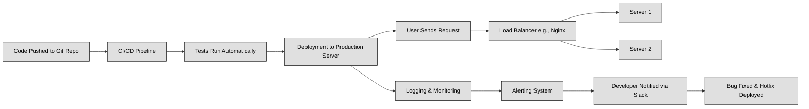

## 3.D.1 System Design Basics ##

### How a Computer Runs Your Code ###

Let’s break down how the different parts of a computer work together to run your code.

At the most basic level, computers understand only 0s and 1s — this is called binary. A bit is the smallest piece of data (it’s either a 0 or 1), and 8 bits make 1 byte. A byte can store something like the letter "A" or the number "5".

To store all this information, we use disk storage. It comes in two main types:

- HDD (Hard Disk Drive) — slower but cheaper.

- SSD (Solid State Drive) — much faster, but more expensive.

SSDs are great when speed matters. For example, an SSD can read data at around 500–3,500 MB/s, while an HDD only hits about 80–160 MB/s. Also, both types keep your data even when the power is off — we call this non-volatile storage.

But when you're actively using apps or running code, the computer doesn't use the disk directly. Instead, it loads data into RAM (Random Access Memory). RAM is much faster than disk storage but is volatile, meaning it loses all data when you restart the computer.

Still not fast enough? That’s where cache memory comes in. Cache is even smaller and faster than RAM — it sits very close to the CPU. It’s used to store the most frequently accessed data, so the CPU can grab it instantly without waiting.

Finally, we have the CPU (Central Processing Unit) — this is the brain that runs your code. It fetches, decodes, and executes instructions. But remember: your code in Java or Python is not directly understood by the CPU. It first gets compiled into machine code — that’s the 0s and 1s — and then executed.

Holding it all together is the motherboard, which connects every component, letting them communicate.

### From Code to Live Application: How Modern Systems Work ###

Once your code is written and tested, it’s time to deploy it — that means making it live and usable by people. This process has become super streamlined thanks to a concept called CI/CD:

*CI/CD Pipeline*
CI/CD stands for:

Continuous Integration: Automatically testing new code when it's pushed to the repo.

Continuous Deployment: Automatically sending that tested code to production (the live version).

With tools like GitHub Actions or Jenkins, your code can go from Git to the server without manual work.

*Serving Users at Scale*

When your app is live, it’s going to receive requests from users. Here's how we handle them efficiently:

- Load Balancers & Reverse Proxies (e.g., Nginx):
They sit in front of your servers and distribute incoming traffic, so one server doesn’t get overloaded.

- External Storage Servers:
Data isn’t always stored on the same machine that runs your app. Often, we use remote storage servers to handle that.

- Services Talking to Services:
Apps are often made of multiple services that talk to each other — this is called microservices.

- Logging and Monitoring:
Tools like PM2 (for back end) or Sentry (for front end) track your app's health and catch bugs or errors.

- Alerts & Notifications:
If something breaks, developers get alerts (often in Slack). You might also notify users:

General: “Something went wrong.”

Specific: “Payment failed.”

- Debugging & Fixing Bugs:
Devs check logs, try to replicate the issue in a safe testing environment, debug it, and then release a hotfix — a quick patch to stabilize things.

### What Makes a System Well-Designed? ###
When engineers talk about a “good” system, they don’t just mean it works. A good system is designed with the future and failure in mind.

Key Qualities of Good System Design
-Scalability
Can the system handle more users and data as it grows?

-Maintainability
Will other developers be able to understand, fix, or improve it later?

-Efficiency
Does it use memory, CPU, and bandwidth wisely?

-Resilience
Will it still work when something fails? Can it recover?

*The 3 Core Actions in System Design*. At its heart, every system does 3 things:

- Moves Data
Example: A user's request goes to a server. Data goes from one service to another.

- Stores Data
Not just about picking a database — it includes backups, how fast you can get data back, and how often it's accessed.

- Transforms Data
Taking raw input and turning it into something meaningful (like calculating the total price in a shopping cart).

| Core Principle  | What It Means                              |
| --------------- | ------------------------------------------ |
| Scalability     | Grows with users/data without breaking     |
| Maintainability | Easy to fix, improve, and understand       |
| Efficiency      | Uses resources smartly                     |
| Resilience      | Stays strong when things go wrong          |
| Move Data       | Handles requests and communication         |
| Store Data      | Saves, retrieves, and backs up information |
| Transform Data  | Processes raw input into useful output     |
