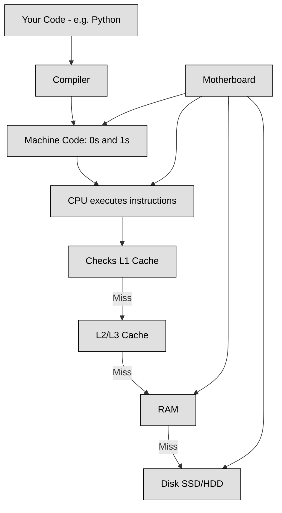

## 3.D.1 System Design Basics ##

### How a Computer Runs Your Code ###

Let’s break down how the different parts of a computer work together to run your code.

At the most basic level, computers understand only 0s and 1s — this is called binary. A bit is the smallest piece of data (it’s either a 0 or 1), and 8 bits make 1 byte. A byte can store something like the letter "A" or the number "5".

To store all this information, we use disk storage. It comes in two main types:

- HDD (Hard Disk Drive) — slower but cheaper.

- SSD (Solid State Drive) — much faster, but more expensive.

SSDs are great when speed matters. For example, an SSD can read data at around 500–3,500 MB/s, while an HDD only hits about 80–160 MB/s. Also, both types keep your data even when the power is off — we call this non-volatile storage.

But when you're actively using apps or running code, the computer doesn't use the disk directly. Instead, it loads data into RAM (Random Access Memory). RAM is much faster than disk storage but is volatile, meaning it loses all data when you restart the computer.

Still not fast enough? That’s where cache memory comes in. Cache is even smaller and faster than RAM — it sits very close to the CPU. It’s used to store the most frequently accessed data, so the CPU can grab it instantly without waiting.

Finally, we have the CPU (Central Processing Unit) — this is the brain that runs your code. It fetches, decodes, and executes instructions. But remember: your code in Java or Python is not directly understood by the CPU. It first gets compiled into machine code — that’s the 0s and 1s — and then executed.

Holding it all together is the motherboard, which connects every component, letting them communicate.

