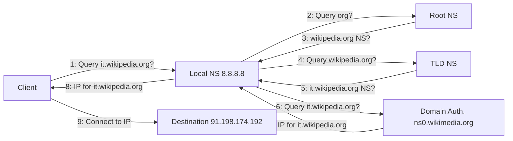
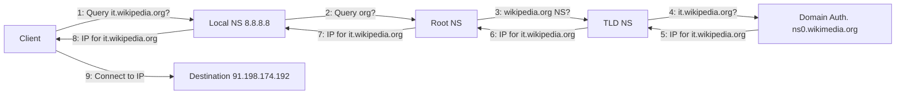

The **Domain Name System** is a system (client‑server architecture) used to `translate human‑friendly domain names (e.g., example.com) into IP addresses (e.g., 93.184.216.34) and vice‑versa`.  It lives at the **application layer of the TCP/IP stack** and uses **UDP on port 53** to communicate.  It is built on a hierarchical distributed database, where many **name servers (NS)** cooperate.

A **domain name** identifies one or more resources (servers, services). It is a string made of parts separated by dots (.). The rightmost part is the most significant and is called the Top Level Domain (TLD).

For example:
- mysite.com → 2 levels
- it.mysite.com → 3 levels
- mail.google.com → 3 levels
- admin.it.mysite.com → 4 levels

In all cases above the TLD is *com*.

The hierarchical division of domains also applies to DNS. A **Zone** (also called an RRSet — **Resource Record Set**) is a subtree in the DNS hierarchy administered as a unit. Each zone has an **authoritative name server (NS)** that is responsible for it.

There are two main **categories of Name Servers**:

- Primary (Master): the NS that hosts the original database and where you add/remove records. 
- Secondary (Slave): a copy of the primary NS that receives replicated data. 

An NS may also play one or more of these **roles**:

- **Caching**: store records temporarily to speed up queries. 
- **Forwarding**: ask other NSs on behalf of the client. 
- **Stealth**: an authoritative NS not listed publicly for queries

When you query DNS, the name server returns one or more **records**, each belonging to a particular type. Some of the main types of resource records are:

| Type  | Meaning / Use                                              |
| ----- | ---------------------------------------------------------- |
| A     | IPv4 address associated with a domain                      |
| AAAA  | IPv6 address associated with a domain                      |
| MX    | Mail Exchange server record (for email)                    |
| CNAME | Canonical Name — alias for another domain                  |
| TXT   | Text — arbitrary free‑text, often for verification         |
| PTR   | Pointer — usually for reverse DNS lookup                   |
| HINFO | Hardware/Software info of the server                       |
| NS    | Name Server record — points to another NS                  |
| SOA   | Start Of Authority — indicates authoritative NS, zone info |

A Record is made with this format: `domain`, `TTL`, `class`, `type`, `value`.

where:

- Domain: the domain to which the record applies
- TTL (Time To Live): how long (in seconds) the record is considered valid
- Class: typically “IN” (Internet)
- Type: one of the types above
- Value: the data for the record

You can view the results of a DNS query using the nslookup command. For example, this is what currently appears when running nslookup (on Windows) for the domain wikipedia.org:

| RR Type | Value Content                                                          |
| ------- | ---------------------------------------------------------------------- |
| A       | 91.198.174.192                                                         |
| AAAA    | 2620:0:862:ed1a::1                                                     |
| NS      | ns1.wikimedia.org, ns2.wikimedia.org                                   |
| SOA     | ns0.wikimedia.org                                                      |
| MX      | priority: 10, polonium.wikimedia.org; priority: 50, lead.wikimedia.org |
| TXT     | google-site-verification=AMHkgs-4ViEvIJf5znZle-BSE2EPNFqM1nDJGRyn2qk   |

When a client (e.g., your computer) wants to reach a domain name, **DNS resolution** comes into play. In general:

1. The client asks a local (or configured) NS for the address of a domain.
2. DNS returns the relevant record.
3. The client uses that address to connect to the destination. 

More in detail , there are two main **query types**: iterative and recursive.

**Iterative Resolution**: in this mode:

- The client asks the local NS for the domain’s address.
- The local NS asks the Root NS for the address of the TLD’s NS.
- The local NS asks the TLD NS for the address of the authoritative NS of the domain.
- The local NS asks the authoritative NS for the required resource’s address.
- The local NS returns the address to the client. 

In other words, the local NS does each lookup step itself until reaching the authoritative NS.

**Recursive Resolution**: in this mode:

- The client asks the local NS for the domain’s address.
- The local NS passes/delegates the request to the Root NS (recursive).
- Root NS passes to TLD NS.
- TLD NS queries the domain’s authoritative NS.
- The authoritative NS returns the answer to TLD NS → then to Root NS → then to Local NS → then to client

The **Local NS** (often your ISP’s NS or one you configure like Google Public DNS 8.8.8.8) is the NS your machine uses by default. You can change this in your network settings. 

The client also has a DNS resolver which:

1. First checks the hosts file (a static mapping of domain → IP on your PC).
2. Then checks its own cache of previously‐resolved records.
3. If the record is not found locally, then it queries the Local NS
