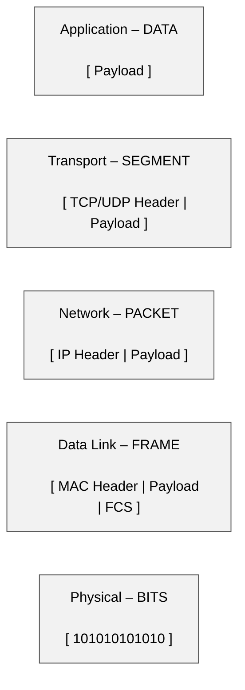
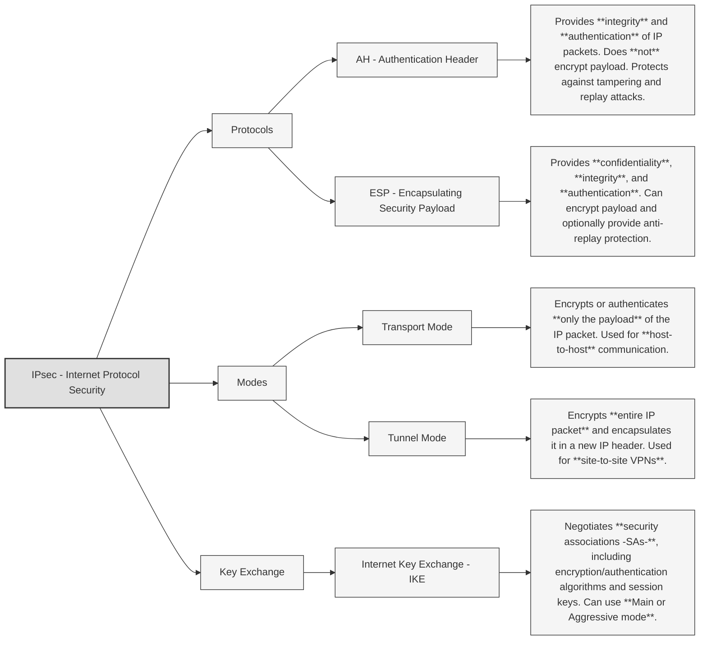
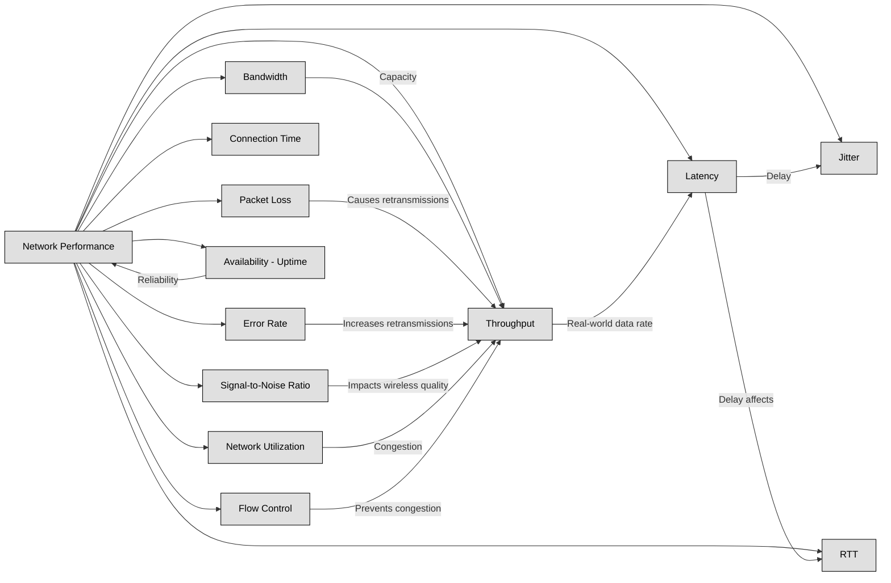

## Preface ##

Imagine a castle without walls, gates, or guards—completely exposed to intruders. Would you store your most valuable treasures there? Nope. The same principle applies to information security—without strong network security, even the best data protection strategies can be rendered useless.

Today, every organization relies on networks to connect employees, customers, and systems. Whether you're sending an email, accessing cloud applications, or managing remote servers, network security is the invisible shield that protects your data from cyber threats. Attackers don’t just target endpoints; they exploit network vulnerabilities to intercept sensitive information, disrupt services, or gain unauthorized access to critical systems.

Networks come in different sizes and serve different purposes. Here’s a quick breakdown of the most common ones:

| Network Type | Scope / Size | Typical Use Case | Example |
|--------------|-------------|------------------|---------|
| **PAN** (Personal Area Network) | Very small, a few meters | Connects personal devices like smartphones, smartwatches, Bluetooth headsets | Your phone connected to wireless earbuds |
| **LAN** (Local Area Network) | Small area, such as a home, office, or school | Connects devices with Ethernet or Wi-Fi | Office Wi-Fi network |
| **MAN** (Metropolitan Area Network) | City or large campus | Connects multiple LANs across a metro area, often via telecom providers | City-wide university network |
| **WAN** (Wide Area Network) | Regional, national, or global | Connects multiple locations over long distances | The internet |
| **CAN** (Campus Area Network) | Larger than LAN, smaller than MAN | Connects buildings within a campus, enterprise, or base | Corporate HQ or military base network |
| **SAN** (Storage Area Network) | Specialized network | Provides fast, secure access to shared data storage | Data center storage systems |

In networking, layered security is built using two key concepts:

1. **Layering (The OSI Model & TCP/IP Model)**
Networks are structured in layers, like a cake with multiple security checks at each level. The OSI model has seven layers (from physical cables to application data), while the TCP/IP model simplifies it to four layers. Each layer plays a role, ensuring secure data transmission and preventing unauthorized access.

2. **Domain Separation (Network Segmentation)**
Not everyone should have access to everything. Domain separation isolates sensitive resources—for example, an HR system shouldn’t be accessible from the public Wi-Fi network. This approach minimizes damage in case of a breach. Techniques like VLANs (Virtual LANs) and subnetting help enforce domain separation.

:necktie: As businesses continue to adopt cloud computing, remote work, and IoT devices, network security must evolve to keep up with new threats and attack vectors.

## 4.1.1 Open System Interconnection (OSI) and Transmission Control Protocol/Internet Protocol (TCP/IP) models ##

The Open Systems Interconnection (OSI) model is a conceptual framework that standardizes how computer systems communicate over a network. It provides a structured approach to understanding network interactions and is particularly useful for cybersecurity professionals when analyzing vulnerabilities, securing data transmission, and troubleshooting network issues. While modern protocols often align more closely with the TCP/IP model, the OSI model remains an essential foundation for understanding network security, segmentation, and attack vectors.

At its core, the OSI model is layered, with each layer representing a different function in the communication process. These layers ensure that complex network interactions can be broken down into manageable components, making it easier to design, secure, and troubleshoot networks. The OSI model serves as a roadmap for security controls, as threats often target specific layers in different ways. Understanding these layers allows for the implementation of layered security (defense in depth) to mitigate risks effectively.

The ISO-OSI model can be understood as a structured process similar to how a letter is sent from one company to another. The table below provides an analogy where each OSI layer is represented by a corresponding role in a business and postal service.

| OSI Layer            | Analogy Role                        | Function in Networking |
|-----------------------|-------------------------------------|-------------------------|
| **Application Layer** | Manager (dictates or writes message) | Creates the data using applications like email or web browsers |
| **Presentation Layer**| Assistant (refines the message)      | Formats, encrypts, and compresses data for proper representation |
| **Session Layer**     | Secretary (addresses and organizes)  | Establishes, manages, and terminates communication sessions |
| **Transport Layer**   | Driver (delivers to post office)     | Ensures reliable delivery using TCP/UDP and manages flow control |
| **Network Layer**     | Sorting & Distribution (post office) | Routes data packets across different networks to reach destination |
| **Data Link Layer**   | Packaging & Unpacking (prepares letter) | Ensures error-free transmission between directly connected nodes |
| **Physical Layer**    | Delivery Truck (actual transport)    | Transmits raw bits over cables, fiber optics, or wireless signals |

Upon arrival, the process is reversed, with the recipient's company handling the letter in the same layered fashion until it reaches the intended manager, just as network data is received, processed, and presented to the user.

**Encapsulation and decapsulation** are key processes that allow data to travel across networks while maintaining structure and security. When a user sends data (like an email or a webpage request), the message starts at the Application Layer and moves down through the OSI layers. Each layer adds its own information (headers, footers, addressing) to the data before passing it to the next layer.

For example:
1. Application Layer – The message is created (e.g., an email).
2. Transport Layer – Adds TCP/UDP headers for reliable delivery.
3. Network Layer – Adds IP addresses for routing.
4. Data Link Layer – Adds MAC addresses for local delivery.
5. Physical Layer – Converts everything into electrical signals or radio waves.

At the end of this process, what started as simple data has become a structured network packet, ready to be transmitted over the network.
When the data reaches its destination, the process reverses:

1. Physical Layer – Receives raw signals.
2. Data Link Layer – Extracts the data from frames.
3. Network Layer – Reads IP addresses and routes the packet.
4. Transport Layer – Reassembles the message and checks integrity.
5. Application Layer – Finally delivers the message to the user (e.g., displaying the email).

With decapsulation, each layer removes its added information, ensuring that the receiver gets the original data in its intended form.

Now, let's dive a bit deeper into the technical details of each OSI layer and its function in network communication.

The lowest layer, known as the **Physical Layer**, deals with the actual transmission of electrical, optical, or radio signals that carry data across networks. Cybersecurity concerns at this layer revolve around physical security, cable tapping, and electromagnetic interference (EMI). Attackers with physical access to networking hardware can engage in activities such as wiretapping, hardware tampering, or signal jamming. Countermeasures include tamper-proof enclosures, network segmentation, and monitoring for unauthorized physical access.

Moving up, the **Data Link Layer** is responsible for MAC (Media Access Control) addressing, error detection, and handling data frames between devices on the same network segment. Attackers at this layer often exploit weaknesses in switching, MAC address spoofing, and VLAN hopping to intercept or redirect network traffic. Techniques such as ARP (Address Resolution Protocol) poisoning allow attackers to manipulate MAC address tables, enabling them to launch Man-in-the-Middle (MITM) attacks. Mitigation strategies include port security, dynamic ARP inspection (DAI), and VLAN segmentation to prevent unauthorized traffic manipulation.

:bulb: A MAC (Media Access Control) address is a unique identifier assigned to the network interface of a device for communication on a network. It is used in data link layer protocols (like Ethernet and Wi-Fi) to ensure that data packets are correctly addressed to devices on a local network.

Here are some key characteristics of a MAC address:

**Format:** A MAC address is typically written as a 12-digit hexadecimal number, often displayed in 6 groups of two digits separated by colons or hyphens (e.g., 00:1A:2B:3C:4D:5E).

**Uniqueness:** Each MAC address is designed to be globally unique, with the first 3 bytes identifying the manufacturer (assigned by the IEEE) and the last 3 bytes being a serial number assigned to the device by the manufacturer.

**Function:** The MAC address is used for local network communication. It helps devices identify each other within a local network, such as between a computer and a router or between devices on a wireless network.

**Static:** Unlike IP addresses, which can change depending on the network, the MAC address is generally static and hardcoded into the network interface hardware (like a Wi-Fi card or Ethernet port).

**Role in Networking:** The MAC address is used in protocols like ARP (Address Resolution Protocol) to map IP addresses to their corresponding MAC addresses, ensuring the correct destination for network traffic.

At the **Network Layer**, IP addresses are used to route data between devices across different networks. Security challenges at this layer include IP spoofing, route hijacking, and Denial-of-Service (DoS) attacks. Attackers may manipulate routing protocols to redirect traffic or overwhelm network resources. Firewalls, intrusion detection/prevention systems (IDS/IPS), and Network Access Control (NAC) policies help secure this layer by filtering malicious traffic and enforcing segmentation policies.

The **Transport Layer** is where end-to-end communication is managed, ensuring that data is properly sequenced and delivered without corruption or loss. This layer uses TCP (Transmission Control Protocol) and UDP (User Datagram Protocol), both of which introduce security risks. Attackers frequently exploit TCP-based attacks, such as SYN floods, session hijacking, and port scanning, to disrupt or intercept communications. Rate limiting, deep packet inspection (DPI), and Transport Layer Security (TLS) encryption are commonly used to protect against these threats.

Before two computers start sending data using TCP, they perform a short “handshake” to make sure both sides are ready and can communicate reliably. The table below shows the three simple steps they follow to set up the connection.

| Step | Name    | Who Sends       | What It Means          | Flags     |
| ---- | ------- | --------------- | ---------------------- | --------- |
| 1️⃣  | SYN     | Client → Server | “Let’s start talking”  | SYN       |
| 2️⃣  | SYN-ACK | Server → Client | “Okay, I’m ready too”  | SYN + ACK |
| 3️⃣  | ACK     | Client → Server | “Confirmed, let’s go!” | ACK       |

:bulb: A **socket** is an endpoint for communication between two machines over a network. It serves as an interface between the application and the transport layer. A socket allows an application to send or receive data across a network. Each socket is uniquely identified by a combination of the following:
- IP address: The unique address assigned to a device on the network (e.g., 192.168.1.1).
- Port number: A numeric identifier that helps differentiate different services or processes on the same machine (e.g., 80 for HTTP, 443 for HTTPS).
- Transport protocol: The protocol being used, typically either TCP (Transmission Control Protocol) or UDP (User Datagram Protocol).

In simple terms, a socket is a combination of:
- The IP address of the host machine.
- The port number used to identify the specific service or application.
- The protocol (TCP or UDP) that specifies the connection type.

A **port** is a 16-bit number (ranging from 0 to 65535) used by the transport layer to direct data to the correct application or process running on a device. Ports are logically associated with the services running on a machine, helping the operating system manage multiple applications using the same network interface.

Ports are divided into three categories:
- **Well-known ports (0–1023):** These are reserved for common services and protocols. For example:
Port 80: HTTP (Hypertext Transfer Protocol) – used by web browsers.
Port 443: HTTPS (HTTP Secure) – used for encrypted web traffic.
Port 25: SMTP (Simple Mail Transfer Protocol) – used for sending emails.
- **Registered ports (1024–49151):** These are used by software applications for communication, but they are not as commonly associated with standardized services. Developers can register these ports with the IANA (Internet Assigned Numbers Authority) for their specific services.
- **Dynamic or Private ports (49152–65535):** These are ephemeral ports used for short-lived communications. They are often assigned temporarily by the operating system for client-side connections, such as when your browser connects to a website. These ports are not assigned to any particular service and are typically used for the duration of the session.

The following table recaps the most common ports:

| Port | Protocol | Service                | Description                              |
|-------|----------|------------------------|------------------------------------------|
| 20    | TCP      | FTP Data               | File Transfer Protocol (data transfer)   |
| 21    | TCP      | FTP Control            | File Transfer Protocol (commands)        |
| 22    | TCP      | SSH                    | Secure Shell for remote login             |
| 23    | TCP      | Telnet                 | Unencrypted text communications           |
| 25    | TCP      | SMTP                   | Simple Mail Transfer Protocol (email)     |
| 53    | TCP/UDP  | DNS                    | Domain Name System (queries and zone transfer) |
| 67    | UDP      | DHCP Server            | Dynamic Host Configuration Protocol server|
| 68    | UDP      | DHCP Client            | Dynamic Host Configuration Protocol client|
| 69    | UDP      | TFTP                   | Trivial File Transfer Protocol             |
| 80    | TCP      | HTTP                   | HyperText Transfer Protocol                |
| 110   | TCP      | POP3                   | Post Office Protocol v3 (email retrieval)  |
| 123   | UDP      | NTP                    | Network Time Protocol                      |
| 143   | TCP      | IMAP                   | Internet Message Access Protocol           |
| 161   | UDP      | SNMP                   | Simple Network Management Protocol         |
| 194   | TCP      | IRC                    | Internet Relay Chat                        |
| 443   | TCP      | HTTPS                  | HTTP over TLS/SSL (secure web browsing)    |
| 445   | TCP      | SMB                    | Server Message Block (file sharing)        |
| 465   | TCP      | SMTPS                  | SMTP over SSL                              |
| 514   | UDP/TCP  | Syslog                 | System logging                             |
| 520   | UDP      | RIP                    | Routing Information Protocol               |
| 587   | TCP      | SMTP (submission)      | Mail submission                            |
| 993   | TCP      | IMAPS                  | IMAP over SSL                             |
| 995   | TCP      | POP3S                  | POP3 over SSL                             |
| 1433  | TCP      | Microsoft SQL Server   | Database server                            |
| 3389  | TCP      | RDP                    | Remote Desktop Protocol                    |
| 5060  | UDP/TCP  | SIP                    | Session Initiation Protocol (VoIP signaling) |
| 5061  | TCP      | SIP over TLS           | Secure SIP                                |

When a device communicates over the network, it uses a combination of the IP address and port number to ensure that data is sent to the correct application. This is what makes it possible for multiple applications on the same machine to use the same network interface.
- **Client-side (Outbound connection)**:
The client application (e.g., a web browser) creates a socket on a local port and sends data to a remote server using the server's IP address and the target service's port number (e.g., port 80 for HTTP).
The operating system assigns a random source port from the dynamic range (49152–65535) for the communication. This allows multiple outgoing connections from the same client device without conflicts.
- **Server-side (Inbound connection)**:
The server listens for incoming connections on a specific port. For instance, a web server will typically listen on port 80 (HTTP) or 443 (HTTPS).
When a connection request arrives, the server uses the destination port to determine which application (service) should handle the data.

The **Session Layer** manages establishing, maintaining, and terminating connections between applications. While this layer is less frequently targeted directly, weaknesses in session management can lead to session hijacking, replay attacks, and unauthorized session resumption. Attackers may steal session tokens or manipulate session state information to gain unauthorized access to applications. Secure authentication mechanisms, proper session expiration policies, and encrypted session tokens help mitigate risks at this layer.

:bulb: In the OSI Session Layer, communication between devices can happen in three different modes:
- **Simplex:** Data flows in one direction only. One device sends, and the other only receives, like a radio broadcast or TV transmission.
- **Half-Duplex:** Data flows in both directions, but one at a time. Think of a walkie-talkie, where only one person speaks at a time while the other listens.
- **Full-Duplex:** Data flows in both directions simultaneously, like a phone call, where both people can talk and listen at the same time.
The Session Layer helps establish, manage, and synchronize these communication modes, ensuring that devices communicate efficiently and without conflicts.

At the **Presentation Layer**, data is formatted for proper interpretation, which includes encryption, compression, and character encoding. This layer is where cryptographic protocols such as SSL/TLS operate, ensuring secure data transmission. Attacks at this layer often involve SSL stripping, downgrade attacks, and improper encryption implementations. The use of strong encryption standards, proper certificate validation, and secure cipher suites is critical to maintaining the confidentiality and integrity of transmitted data.

Finally, the **Application Layer** is where end-user applications interact with the network, including protocols like HTTP, HTTPS, FTP, SMTP, and DNS. The most high-profile security threats occur at this layer, including phishing attacks, malware distribution, injection attacks (SQL injection, cross-site scripting), and API exploitation. Web application firewalls (WAFs), secure coding practices, and multi-factor authentication (MFA) are among the most effective countermeasures at this level.

The OSI model is not just a theoretical framework but a practical guide to identifying and mitigating security threats at every stage of network communication. Understanding which layers are being targeted by attackers helps in deploying the right security controls at the right points. Network-based attacks often traverse multiple layers, requiring an approach that integrates firewalls, intrusion detection systems, endpoint protection, and access controls to build a truly resilient security architecture.

The OSI model remains valuable for understanding attack surfaces, segmentation strategies, and security best practices. For example, Zero Trust Security (ZTS) frameworks leverage layered security models to ensure continuous verification and strict access controls across different network layers.

By applying defense-in-depth principles, organizations can reduce exposure to threats at each layer, ensuring that even if one layer is compromised, the attacker does not gain unrestricted access to critical assets. From physical security at the hardware level to encryption at the application level, a thorough understanding of the OSI model empowers cybersecurity professionals to design, implement, and maintain robust security postures against ever-evolving cyber threats.

:brain: *All People Seem To Need Data Protection* … will help you remember the 7 layers of the OSI model.

:bulb: Non-IP Legacy Protocols refer to older networking protocols that were used before the widespread adoption of the Internet Protocol (IP). These protocols were often designed for specific network architectures or industries and are still found in legacy systems. Here are a few key ones:
- IPX/SPX (Internetwork Packet Exchange/Sequenced Packet Exchange) – Used in Novell NetWare networks, IPX handled addressing while SPX ensured reliable communication.
- AppleTalk – Developed by Apple for Macintosh networks, it provided automatic addressing and name resolution but was replaced by TCP/IP in modern macOS.
- NetBEUI (NetBIOS Extended User Interface) – A simple protocol used for small LANs, primarily in early Windows networking, but lacked scalability.
- DECnet – Created by Digital Equipment Corporation (DEC), it was used for connecting DEC systems before TCP/IP became standard.
- SNA (Systems Network Architecture) – Developed by IBM for mainframes, it was used for enterprise data exchange and is still found in some legacy environments.
While these protocols are mostly obsolete, they may still exist in older systems, requiring special handling for integration or migration to modern IP-based networks.

:bulb: The TCP/IP model is a simplified framework that describes how data moves through a network. It consists of four layers, each handling specific tasks to ensure reliable communication. Unlike the ISO OSI model, which has seven layers, TCP/IP is more practical and widely used in modern networking.
- Application Layer – This is where user applications interact with the network. It includes protocols like HTTP (web browsing), SMTP (email), and FTP (file transfer).
- Transport Layer – Ensures reliable communication between devices. The main protocols here are TCP (connection-oriented, reliable data transfer) and UDP (connectionless, faster but less reliable).
- Internet Layer – Handles addressing and routing. The key protocol is IP (Internet Protocol), which ensures data packets reach the correct destination. It also includes ICMP (error messages) and ARP (address resolution).
- Network Access Layer – Also called the Link Layer, this layer manages physical network connections. It includes Ethernet, Wi-Fi, and other data link protocols that define how devices communicate on a local network.

The OSI model (7 layers) and the TCP/IP model (4 layers) describe how data moves across networks, but the TCP/IP model is a simpler, real-world version of the OSI model.
Here's how they match:
- The top three layers of OSI (Application, Presentation, and Session) are merged into one layer in TCP/IP: These deal with apps, file formats, and session management (like web browsing or video calls).
- The Transport Layer stays the same: Handles how data is split into chunks and sent reliably (or quickly).
- The Network Layer stays the same: Manages IP addresses and routing.
- The Data Link and Physical Layers are combined into one in TCP/IP: Handles actual data transmission over cables, Wi-Fi, etc.

| **OSI Model**     | **TCP/IP Model**       | **Function**                                   |
|--------------------|-------------------------|------------------------------------------------|
| **Application**    | Application             | Apps like browsers, emails, video streaming    |
| **Presentation**   | —                       | Translates data formats (JPEG, encryption)     |
| **Session**        | —                       | Manages sessions (e.g., keeping you logged in) |
| **Transport**      | Transport               | Ensures reliable (TCP) or fast (UDP) delivery  |
| **Network**        | Internet                | Handles IP addresses & routing                 |
| **Data Link**      | Link (Network Access)   | Manages MAC addresses & switches               |
| **Physical**       | — (part of Link layer)  | Deals with actual wires, Wi-Fi, fiber, etc.    |

### Open Questions ###

1. What is the OSI model, and why is it important in networking and cybersecurity?

  
Show answer

The OSI model is a conceptual framework that standardizes how computer systems communicate. It helps network professionals troubleshoot issues, implement security controls, and understand data flow across a network.

2. How does the concept of encapsulation work in the OSI model, and why is it essential?

  
Show answer

Encapsulation occurs when data moves down the OSI layers, with each layer adding its own header information. This ensures proper delivery, error checking, and security, making communication structured and reliable.

3. What are the key differences between the OSI model and the TCP/IP model?

  
Show answer

The OSI model has seven layers, providing a detailed framework for networking, while the TCP/IP model has four layers and is more practical for real-world internet communication. TCP/IP focuses more on protocols used in modern networks.

4. What security risks are associated with the Physical Layer, and how can they be mitigated?

  
Show answer

Security risks at the Physical Layer include cable tapping, hardware tampering, and electromagnetic interference. Countermeasures include tamper-proof enclosures, physical access controls, and signal encryption.

5. How does the Data Link Layer manage MAC addresses, and why is this important for network security?

  
Show answer

The Data Link Layer manages MAC addresses, which uniquely identify network devices. This ensures proper local network communication and security, but attackers can exploit it through MAC spoofing and ARP poisoning.

6. What role does the Transport Layer play in ensuring reliable communication, and how do TCP and UDP differ?

  
Show answer

The Transport Layer ensures reliable communication through TCP, which guarantees delivery and sequencing, while UDP is faster but does not provide error correction. Choosing the right protocol depends on the application’s needs.

7. What are the main functions of the Presentation Layer, and how does it relate to encryption and compression?

  
Show answer

The Presentation Layer ensures that data is correctly formatted, encrypted, and compressed for transmission. It plays a key role in data security, as SSL/TLS encryption operates at this layer to protect sensitive information.

8. How does the Session Layer manage communication between devices, and what are the three communication modes it supports?

  
Show answer

The Session Layer manages connections between devices using simplex (one-way), half-duplex (alternating), and full-duplex (simultaneous) communication modes. It ensures sessions remain active and properly synchronized.

9. Why is the Application Layer often the most vulnerable to cyberattacks, and what security measures can be implemented at this layer?

  
Show answer

The Application Layer is most vulnerable to attacks like phishing, malware, and injection attacks (SQL injection, cross-site scripting). Security measures include web application firewalls (WAFs), authentication controls, and secure coding practices

10. How does the OSI model support the implementation of layered security (defense in depth) in network security strategies?

  
Show answer

The OSI model supports layered security by addressing threats at each level. For example, firewalls protect the Network Layer, encryption secures the Presentation Layer, and endpoint security tools protect the Application Layer, creating a defense-in-depth strategy.

---

## 4.1.2 Internet Protocol (IP) version 4 and 6 (IPv6) (e.g., unicast, broadcast, multicast, anycast) ##

An IP (Internet Protocol) address is a unique identifier assigned to devices connected to a network, allowing them to communicate with each other. Just like a mailing address helps postal services deliver letters, an IP address ensures that network traffic reaches the correct destination.
Each IP address consists of two main parts:
- Network portion – Identifies the network to which a device belongs.
- Host portion – Identifies the specific device within that network.

Think of it like a street address:
- The Network Portion is the street name (e.g., "Main Street").
- The Host Portion is the house number (e.g., "123").

Together, they form a complete address so data can be delivered to the right location.

The subnet mask defines how much of the IP address belongs to the network and how much belongs to the host. Let’s take for example a  Class C Network (192.168.1.100/24), it has
- IP Address: 192.168.1.100
- Subnet Mask: 255.255.255.0 (/24)
- The first 24 bits (192.168.1) are the Network Portion.
- The last 8 bits (100) are the Host Portion.

This means all devices in the 192.168.1.0/24 network have the same first three numbers (192.168.1), but different last numbers (host IDs).

The two major versions of IP in use today are **IPv4** (Internet Protocol version 4) and **IPv6** (Internet Protocol version 6).

IPv4 is the fourth version of the Internet Protocol and remains widely used despite IPv6 adoption. It uses a 32-bit address space, meaning it supports 2³² (about 4.3 billion) unique addresses.
IPv4 addresses are written in dotted decimal notation, where four 8-bit (or octet) values are separated by dots. Each octet represents a number between 0 and 255.
IPv4 addresses are divided into five classes (A to E) to allocate network sizes effectively.

Not all IPv4 addresses are meant for internet use. Some are reserved for private networks.
Private addresses are used within local networks and not routable on the public internet. Devices using these addresses require NAT (Network Address Translation) to communicate externally.

For example, Your home router has one public IP (e.g., 203.0.113.5) but assigns private IPs (192.168.1.x) to devices inside your network. NAT (Network Address Translation) translates internal requests to external ones using the router's public IP.

Public IPs are globally routable on the internet. They are assigned by the Internet Assigned Numbers Authority (IANA) and Regional Internet Registries (RIRs).

:link: [Iana](https://www.iana.org/numbers) is responsible for global coordination of the Internet Protocol addressing systems, as well as the Autonomous System Numbers used for routing Internet traffic.  

**Subnetting** is the process of dividing a larger network into smaller, more manageable sub-networks, called subnets. It helps improve network performance and security by organizing IP addresses more efficiently. Subnetting also allows you to use the available IP addresses more effectively and helps to isolate network segments.

When you subnet a network, you're essentially borrowing bits from the host portion of an IP address and using them for the network portion. This changes the subnet mask, which determines how many bits are used for the network and host parts of the address.

How Subnetting Works ? An IP address is divided into two parts, as we said, the network portion and the host portion. The subnet mask helps to determine which part is the network portion and which part is the host portion. For example, with the IP address 192.168.1.0 and the subnet mask 255.255.255.0, the first 24 bits (the "255.255.255" part) are the network portion, and the remaining 8 bits (the "0" part) are for host addresses within that network.
Subnetting borrows bits from the host portion and uses them to extend the network portion. This increases the number of available subnets but reduces the number of hosts that can be assigned in each subnet.

:bulb: Let's try a simple example. You have the network 192.168.1.0/24 (subnet mask 255.255.255.0), which means you have 256 total IP addresses (0-255). You want to subnet this network into 4 smaller subnets.
1. Determine how many bits to borrow: To create 4 subnets, you need 2 bits (since 2^2 = 4).
2. Update the subnet mask: The original subnet mask was 255.255.255.0 (or /24), and we borrowed 2 bits for the subnets. This changes the subnet mask to 255.255.255.192 (or /26).
3. New Subnets: With a /26 subnet mask, each subnet has 64 addresses (including the network and broadcast addresses). The 4 subnets will look like this:
- Subnet 1: 192.168.1.0/26 (addresses from 192.168.1.0 to 192.168.1.63)
- Subnet 2: 192.168.1.64/26 (addresses from 192.168.1.64 to 192.168.1.127)
- Subnet 3: 192.168.1.128/26 (addresses from 192.168.1.128 to 192.168.1.191)
- Subnet 4: 192.168.1.192/26 (addresses from 192.168.1.192 to 192.168.1.255)

Each of these subnets can have 62 usable IP addresses (after excluding the network address and the broadcast address).

:link: You don’t need to calculate subnets manually, but you must understand how subnetting impacts security policies, access control, and network architecture. A detailed explanation of subnetting is available [here] (https://en.wikipedia.org/wiki/Subnet)

.link: You can learn more about IP addressing and subnetting [here](https://github.com/lorenzoleonelli/CISSP-Zero-to-Hero/blob/main/DOMAIN4%3A%20Communication%20and%20Network%20Security/4.D.1%20IPv4%20Addressing%20and%20Subnetting.md#4d1-ipv4-addressing-and-subnetting)

**IPv6** was introduced to solve IPv4 exhaustion. It uses a 128-bit address space, providing 2¹²⁸ addresses (more than enough for every device on Earth).
IPv6 addresses are written in hexadecimal notation and divided into 8 groups of 16 bits, separated by colons.
An Example of an IPv6 Address is: 2001:0db8:85a3:0000:0000:8a2e:0370:7334

IPv6 allows omitting leading zeros and compressing consecutive zero blocks:
Full Address: 2001:0db8:0000:0000:0000:0000:8a2e:0370
Shortened: 2001:db8::8a2e:370

The following table depicts the differences between IPv4 and IPv6:
| Feature         | IPv4                       | IPv6                       |
|-----------------|----------------------------|----------------------------|
| Address Length  | 32-bit                     | 128-bit                    |
| Address Format  | Dotted Decimal             | Hexadecimal                |
| NAT Usage       | Required due to exhaustion | Not needed                 |
| Security        | IPSec optional             | IPSec built-in             |
| Broadcast       | Yes                        | No (replaced by multicast) |

Why IPv6 is Important for Cybersecurity ?
- Eliminates NAT: Reduces the attack surface.
- Built-in IPSec: Provides encryption and authentication.
- Better address management: Prevents IP conflicts.

And what are the challenges in IPv6 Adoption ?
- Slow transition from IPv4: Many networks still use dual-stack (IPv4 & IPv6).
- Compatibility issues: Some legacy systems do not support IPv6.
- IPv6 Security: New attack vectors (e.g., rogue Router Advertisements).

The primary objective of any network is to transmit data efficiently and reliably between devices. The Internet Protocol (IP) supports several communication methods to direct data packets between devices, each suited to different network requirements and use cases. These methods include unicast, broadcast, multicast, and anycast, which differ in the number of devices involved and the nature of the data transmission. Let’s take a closer look at each of these methods.

**Unicast** refers to one-to-one communication, where a single sender sends data to a specific destination device, identified by a unique IP address. In unicast communication, the sender specifies the destination address in the packet, and only that device receives the data.
Unicast Characteristics:
- One-to-One: Data is transmitted from one sender to one receiver.
- Point-to-Point Communication: There is a direct, exclusive communication channel between the sender and the receiver.
- Unique IP Address: Each device involved in unicast communication has a unique IP address.

For example, when you visit a website, your computer sends a request to the server hosting the website. The server replies to your computer specifically. This is a typical unicast communication, where the web server sends the response only to your device.
Unicast is most commonly used in situations where communication needs to occur between specific devices:
- Web browsing (HTTP/HTTPS)
- File transfers (FTP)
- Email exchanges
- VoIP calls Unicast ensures that only the intended device receives the data, providing privacy and security in communication.

**Broadcast** refers to one-to-all communication, where a sender sends data to all devices within a specific network. In this mode, the data is transmitted to every device on the network, regardless of whether they need it.
Broadcast Characteristics are:
- One-to-All: Data is sent to all devices within a specified network.
- IP Addressing: Broadcasts use a special broadcast address that all devices on the network can recognize.
- Network-Wide Transmission: Every device within the local network receives and processes the broadcasted data.

Types of Broadcasts:
- Limited Broadcast: This type of broadcast is limited to the local network and uses the address 255.255.255.255. It does not get routed to other networks.
- Directed Broadcast: Directed broadcasts target all devices on a specific network. A directed broadcast uses the network’s address (e.g., 192.168.1.255) to communicate with all devices on that network.

For example when a device wants to discover the MAC address of another device within the same network, it broadcasts an ARP request. Every device on the network will receive the ARP request, but only the device with the matching IP address will reply.

Broadcast is generally used for tasks that require all devices on a local network to process the same message, for example in the following cases:
- ARP (Address Resolution Protocol)
- DHCP Discover (for obtaining an IP address in a local network)
- Service announcements (such as network printers broadcasting their availability)

Limitations of Broadcast are:
- Network Congestion: Broadcasting to all devices in a network can lead to unnecessary network traffic and can be inefficient.
- Limited to Local Networks: Broadcasts are usually confined to a single network. Routers typically do not forward broadcast packets to other networks, limiting the scalability.

**Multicast** refers to one-to-many communication, where data is sent from a sender to multiple specific devices in a network or across networks, but not to all devices. Unlike broadcast, multicast communication only targets a defined group of receivers, known as a multicast group.
Multicast Characteristics are:
- One-to-Many: Data is sent to a selected group of devices (known as multicast group members) instead of all devices.
- IP Addressing: Multicast uses special IP address ranges within IPv4 (224.0.0.0 to 239.255.255.255) and IPv6 (ff00::/8).
- Efficient Bandwidth Use: Since the data is sent only to the members of the group, it conserves bandwidth and reduces network congestion compared to broadcast.
- Group Membership: Devices must explicitly join a multicast group to receive the data being sent to that group.

When a device wants to receive multicast traffic, it sends an IGMP (Internet Group Management Protocol) message to its local router requesting to join a multicast group. Once the router receives this request, it ensures that multicast traffic destined for that group is forwarded to the device.

For example a server can stream live video to multiple clients (e.g., an online webinar) using multicast. Only the clients who have joined the multicast group receive the stream, unlike broadcast where all clients would receive the same stream. Multicast is used in applications where a single data stream needs to be delivered to multiple devices without consuming excessive bandwidth.

**Anycast** refers to a one-to-nearest communication model, where data is sent from a sender to the nearest member of a group of devices, typically based on network topology or routing algorithms. Anycast allows data to be routed to the closest available server or device that is part of the anycast group.

Anycast Characteristics are:
- One-to-Nearest: Data is routed to the nearest member of an anycast group based on routing protocols.
- Routing-Based Decision: The “nearest” device is determined based on network topology and routing algorithms (e.g., BGP – Border Gateway Protocol).
- IP Addressing: Anycast uses a single IP address shared by multiple devices, typically deployed for services like DNS.

For example a DNS query for www.example.com can be routed to the nearest DNS server in the network, improving response time and reliability. If one DNS server goes down, others can take over the responsibility without interruption.
CDNs (Content Delivery Networks) use anycast to route user requests to the nearest server that can deliver the requested content (e.g., videos, images), optimizing performance and reducing latency.
Anycast is commonly used in scenarios where low-latency access to services is required and multiple servers are available to handle requests:
- DNS Servers
- Content Delivery Networks (CDNs)
- Distributed Services like cloud-based applications

Here a comparison table of the different communications type seen so far:
| Communication Type | Target            | Addressing                        | Efficiency             | Example use                               |
|--------------------|------------------|-----------------------------------|------------------------|-------------------------------------------|
| Unicast            | One device       | Unique IP Address                 | Direct and Secure      | Web browsing, VoIP calls, File transfer   |
| Broadcast          | All devices      | Broadcast IP (e.g., 255.255.255.255) | Inefficient, congestion | ARP, DHCP Discover                        |
| Multicast          | Selected group   | Multicast IP Range (224.x.x.x)    | Efficient, scalable    | Live video/audio streaming, IPTV          |
| Anycast            | Nearest device   | Shared IP Address                 | Fast, scalable         | DNS, CDN, load balancing                  |

**ICMP (Internet Control Message Protocol)** is a core protocol used by network devices to communicate error messages and diagnostic information about network operations. It is essential for managing and troubleshooting network connectivity.

ICMP Characteristics are:
- Error Reporting: ICMP helps in reporting errors such as unreachable destinations or time exceeded in routing.
- Diagnostics: ICMP is used in utilities like ping and traceroute, which help in diagnosing network connectivity issues.

Common ICMP Messages:
- Echo Request & Echo Reply: Used by the ping command to test connectivity between devices.
- Destination Unreachable: Indicates that a router or destination device is unreachable.
- Time Exceeded: Sent when a packet’s TTL (Time to Live) reaches zero, indicating that the packet has been circulating too long in the network.
- Redirect: Informs a device that a better route is available.

ICMP is used primarily for network diagnostics, allowing administrators to check if devices are reachable, measure round-trip time, and identify network issues.

**IGMP (Internet Group Management Protocol)** is used by hosts and adjacent routers to establish multicast group memberships. It operates at the network layer and enables devices to inform their local routers about their multicast group memberships.
How IGMP Works:
- Devices that want to join a multicast group send an IGMP report to the local router.
- The router then ensures that multicast traffic for that group is forwarded to the device.

IGMP is used to control the group memberships for multicast communication, ensuring that only the necessary devices receive the multicast data. IGMP Versions:
- IGMPv1: Basic functionality to report multicast group membership.
- IGMPv2: Introduced the ability for hosts to leave multicast groups.
- IGMPv3: Allows for source-specific multicast (SSM), where a device can join a multicast group from a specific source.

Understanding the security risks associated with IP protocols is crucial. There are several common network-based attacks that threaten the integrity, availability, and confidentiality of network communications. Here are some of the most common ones:

1. **IP Hijacking (BGP Hijacking)**
IP hijacking occurs when an attacker takes control of a portion of an IP address block. This can lead to traffic being misdirected to malicious systems, often used for surveillance or data theft. 
- How it works: Attackers advertise a block of IP addresses they do not own through the Border Gateway Protocol (BGP), causing traffic to be routed through their malicious systems.
- Impact: Data interception, denial of service (DoS), or man-in-the-middle (MitM) attacks.

2. **Packet Sniffing**
Packet sniffing is the practice of capturing and inspecting data packets transmitted across a network. This can be done by malicious users to gather sensitive information, such as login credentials or credit card numbers.
- How it works: Tools like Wireshark can capture and analyze network traffic, including unencrypted data.
- Impact: Exposure of sensitive data, identity theft, or credential theft.

:bulb: Wireshark is a network protocol analyzer that captures and inspects data packets traveling through a network. It allows users to see the detailed contents of these packets, which can help troubleshoot network issues, monitor traffic, or analyze security incidents. The Key Steps of Wireshark Functionality are:

Packet Capture:
- Wireshark listens to network traffic on a specific network interface (like Wi-Fi or Ethernet).
- It collects packets as they are sent or received by devices on the network.

Packet Decoding:
- Wireshark decodes these packets based on various network protocols (e.g., TCP, HTTP, DNS).
- It displays detailed information, such as headers, payload, and protocol-specific data.

Filtering and Analysis:
- Users can apply filters to narrow down the captured data, focusing on specific traffic or protocols (e.g., HTTP, DNS).

3. **Man-in-the-Middle (MitM) Attack**
A MitM attack occurs when an attacker intercepts and potentially alters communication between two parties without their knowledge. The attacker may impersonate one or both parties.
- How it works: An attacker may intercept traffic between a user and a server, such as during a DNS query or a login request.
- Impact: Data theft, session hijacking, or altered data.

4. **Distributed Denial of Service (DDoS) Attack**
A DDoS attack is an attempt to overwhelm a target with a flood of internet traffic, often by utilizing a botnet of compromised devices.
- How it works: Attackers direct massive amounts of traffic to a server, causing it to crash or become unresponsive.
- Impact: Service disruption, downtime, loss of revenue.

5. **SYN Flood Attack**
A SYN flood is a type of Denial of Service (DoS) attack where an attacker sends a flood of SYN requests (part of the TCP handshake) to a target server, but never completes the handshake.
- How it works: The server waits for the completion of the handshake, which consumes server resources, leading to exhaustion of available connections.
- Impact: Server crashes, unavailability of services.

### Open Questions ###

1. What is an IP address, and why is it important?

  
Show answer

An IP address is a unique identifier assigned to devices on a network, enabling communication. It ensures data is sent to the correct destination, much like a mailing address for postal services.

2. What are the two main parts of an IP address?

  
Show answer

The network portion identifies the network, while the host portion identifies the specific device within that network. For example, in 192.168.1.100/24, "192.168.1" is the network, and "100" is the host.

3. What is subnetting, and why is it useful?

  
Show answer

Subnetting divides a large network into smaller sub-networks, improving performance and security. It allows efficient IP address allocation and isolates network segments to reduce congestion.

4. What is the difference between IPv4 and IPv6?

  
Show answer

IPv4 uses a 32-bit address space, allowing about 4.3 billion addresses, while IPv6 uses 128-bit addresses, providing an almost unlimited number of unique IPs. IPv6 also has built-in security features like IPSec.

5. What is NAT (Network Address Translation), and why is it needed?

  
Show answer

NAT allows multiple devices in a private network to share a single public IP address when accessing the internet. It helps conserve IPv4 addresses and adds a layer of security by masking internal IPs.

6. What is the purpose of ICMP?

  
Show answer

ICMP (Internet Control Message Protocol) is used for network diagnostics and error reporting. Tools like ping and traceroute rely on ICMP to check connectivity and track packet paths.

7. How does multicast differ from broadcast?

  
Show answer

Broadcast sends data to all devices in a network, causing unnecessary traffic, while multicast sends data only to selected group members, reducing bandwidth usage. Examples include IPTV and video streaming.

8. What is anycast, and how does it improve network efficiency?

  
Show answer

Anycast routes data to the nearest server in a group using the same IP, improving speed and reliability. It is used in DNS services and content delivery networks (CDNs) to reduce latency.

9. What is the role of IGMP in multicast communication?

  
Show answer

IGMP (Internet Group Management Protocol) allows devices to join and leave multicast groups. Routers use IGMP to forward multicast traffic only to interested devices, optimizing bandwidth usage.

10. What are the security risks associated with IP protocols?

  
Show answer

Attackers can exploit network protocols using techniques like IP spoofing, ICMP flooding, and rogue router advertisements in IPv6. Proper security configurations, such as firewalls and filtering rules, help mitigate these risks.

---

## 4.1.3 Secure protocols (e.g., Internet Protocol Security (IPSec), Secure Shell (SSH), Secure Sockets Layer (SSL)/ Transport Layer Security (TLS)) ##

There are several protocols designed to safeguard data, prevent unauthorized access, and ensure confidentiality and integrity during transmission. These secure protocols provide varying levels of security services and are used in different contexts, depending on the application and requirements.

**Internet Protocol Security (IPSec)**

IPSec is a framework of open standards used to secure Internet Protocol (IP) communications by authenticating and encrypting each IP packet in a communication session. It operates at the network layer (Layer 3) of the OSI model and is primarily used to protect IP traffic over an IP network, ensuring that data exchanged between devices remains secure. IPSec is commonly used for Virtual Private Networks (VPNs) and is integral in providing a secure connection over untrusted networks like the internet.

IPSec operates in two modes: Transport Mode and Tunnel Mode. In **Transport Mode**, only the payload of the IP packet (the actual data) is encrypted and/or authenticated, while the header remains intact. This mode is typically used for end-to-end communications between two hosts. On the other hand, **Tunnel Mode** encrypts both the payload and the header of the IP packet. This mode is more commonly used in site-to-site VPNs where entire packets are encrypted, thus ensuring that both the sender’s and receiver’s IP addresses are hidden, making the data secure as it traverses between networks.

The security services provided by IPSec include confidentiality (through encryption), integrity (by using hashing algorithms such as SHA), and authentication (via protocols like ISAKMP and IKE). These services are achieved through two main protocols: Authentication Header (AH), which provides data integrity and authentication, and Encapsulating Security Payload (ESP), which offers encryption for confidentiality.

:bulb: How IPsec Works:
Security Associations (SA): IPsec uses Security Associations to define the parameters for the secure communication between two devices. Each SA has a unique identifier and specifies how the data will be encrypted and authenticated.

Protocols:
- AH (Authentication Header): Ensures data integrity and authenticity by providing a checksum of the packet data.
- ESP (Encapsulating Security Payload): Provides encryption for data confidentiality along with optional data integrity and authentication.

Modes:
- Transport Mode: Encrypts only the data portion of the IP packet, leaving the header unchanged. Typically used for end-to-end communication between hosts.
- Tunnel Mode: Encrypts the entire IP packet, including the header, which is then encapsulated in a new IP packet. Used for network-to-network communication, such as site-to-site VPNs.

Key Exchange:
IKE (Internet Key Exchange): A protocol used to securely exchange encryption keys between the two endpoints.

**Secure Shell (SSH)**

Secure Shell (SSH) is a protocol designed to provide a secure method of remote login and other network services over an unsecured network, like the internet. SSH operates at the application layer (Layer 7) and is commonly used for remote administration of network devices and servers, replacing older protocols like Telnet, which transmit data, including usernames and passwords, in plain text.

SSH ensures the confidentiality and integrity of the data through encryption. It uses symmetric encryption (such as AES) for encrypting the communication, asymmetric encryption (such as RSA) for authenticating the client and server, and message authentication codes (MACs) to verify the integrity of the transmitted data. The use of encryption ensures that even if the communication is intercepted, the information cannot be read without the decryption key.

One of the key features of SSH is its public key authentication mechanism. This allows a client to authenticate to a server using a private-public key pair instead of traditional password authentication. The private key remains on the client’s device, while the public key is stored on the server. When a client attempts to connect, the server uses the public key to authenticate the client, ensuring that only the client with the corresponding private key can access the system.
SSH also provides a secure channel for port forwarding, allowing encrypted tunnels to be established for other types of communication, such as remote desktop services or file transfers. Secure Copy (SCP) and Secure File Transfer Protocol (SFTP), both of which operate over SSH, offer secure methods for transferring files between systems.

| Feature                  | Description                                                                                                                                       |
|---------------------------|---------------------------------------------------------------------------------------------------------------------------------------------------|
| **Protocol**              | Secure Shell (SSH)                                                                                                                               |
| **Purpose**               | Provides a secure method of remote login and network services over an unsecured network (like the internet).                                      |
| **OSI Layer**             | Application Layer (Layer 7)                                                                                                                      |
| **Replaces**              | Older protocols like Telnet, which transmitted data in plain text.                                                                                |
| **Encryption**            | - Symmetric encryption (e.g., AES) for communication   - Asymmetric encryption (e.g., RSA) for authentication   - MACs for integrity        |
| **Confidentiality**       | Ensures data confidentiality via encryption, making intercepted data unreadable without the decryption key.                                       |
| **Public Key Authentication** | Uses a private-public key pair for client-server authentication, with the private key on the client’s device and the public key on the server. |
| **Key Authentication Mechanism** | The server authenticates the client using the public key, ensuring only the client with the corresponding private key can access the system.   |
| **Port Forwarding**       | Provides a secure channel for port forwarding, allowing encrypted tunnels for services like remote desktop or file transfers.                      |
| **File Transfer Protocols** | Secure Copy (SCP) and Secure File Transfer Protocol (SFTP) operate over SSH, providing secure methods for file transfers.                        |

**Secure Sockets Layer (SSL) and Transport Layer Security (TLS)**

SSL and its successor, TLS, are cryptographic protocols that provide security for communications over a computer network. While SSL is now considered deprecated due to various vulnerabilities, TLS continues to be the dominant protocol used to secure web traffic. Both SSL and TLS function primarily at the transport layer (Layer 4), securing data exchanged between clients and servers, particularly in web applications, through HTTPS.
The primary function of SSL/TLS is to provide confidentiality and integrity for data in transit. This is achieved through a combination of asymmetric encryption for key exchange, symmetric encryption for encrypting the data, and message authentication codes (MACs) for ensuring integrity. The process begins with the handshake protocol, during which the client and server agree on encryption algorithms, authenticate each other (through public-key certificates), and establish shared keys. Once the handshake is complete, the actual data transfer occurs using symmetric encryption, which is faster than asymmetric encryption and more suited for transmitting large amounts of data.
One of the most critical aspects of SSL/TLS is authentication. The server typically presents a digital certificate to the client, which is issued by a trusted certificate authority (CA). This certificate includes the public key of the server, allowing the client to verify the server's identity and ensure that it is communicating with the intended entity. SSL/TLS also supports **forward secrecy**, ensuring that even if a private key is compromised in the future, past communications cannot be decrypted.
SSL/TLS is used not only for securing web traffic but also for securing other protocols such as email (SMTP, IMAP, POP3) and file transfer (FTPS), making it an essential protocol for safeguarding the vast majority of internet-based communications.

| Feature             | Description                                                                                                                                              |
|----------------------|----------------------------------------------------------------------------------------------------------------------------------------------------------|
| **Protocol**         | Transport Layer Security (TLS)                                                                                                                          |
| **Purpose**          | Provides confidentiality and integrity for data in transit.                                                                                             |
| **Replaces**         | SSL                                                                                                                                                     |
| **Encryption**       | - Asymmetric encryption for key exchange   - Symmetric encryption for encrypting data   - Message Authentication Codes (MACs) for integrity        |
| **Handshake Protocol** | Initial communication where client and server agree on encryption algorithms, authenticate each other, and establish shared keys.                       |
| **Data Transfer**    | After the handshake, symmetric encryption is used for data transfer, providing faster encryption for large amounts of data.                              |
| **Authentication**   | The server presents a digital certificate, issued by a trusted certificate authority (CA), to verify its identity.                                       |
| **Forward Secrecy**  | Ensures that if a private key is compromised in the future, past communications cannot be decrypted.                                                     |
| **Usage**            | - Secures web traffic (HTTPS)   - Secures email protocols (SMTP, IMAP, POP3)   - Secures file transfer (FTPS)                                      |

**Kerberos**

Kerberos is a network authentication protocol designed to provide secure authentication over insecure networks. Unlike the protocols mentioned earlier, which are mainly focused on securing the communication channel itself, Kerberos primarily addresses the need for secure authentication between users and services in a networked environment. It uses a symmetric key cryptography system to enable users and services to prove their identity securely without transmitting passwords over the network.
Kerberos operates on the basis of tickets. When a user logs in, they are authenticated by the Kerberos Key Distribution Center (KDC), which consists of two components: the Authentication Server (AS) and the Ticket Granting Server (TGS). The process begins with the user requesting access to a service. The AS verifies the user’s credentials (such as their password) and issues a Ticket Granting Ticket (TGT). The TGT is then used to request service-specific tickets from the TGS. These service tickets can be presented to the target service to authenticate the user, without needing to transmit passwords.
The use of timestamps and one-time tickets ensures that Kerberos protects against replay attacks, and the session keys provided during authentication help maintain confidentiality and integrity during subsequent communications. Kerberos provides mutual authentication, ensuring both the client and the server prove their identity to each other, which reduces the risk of man-in-the-middle attacks.
Kerberos is widely used in enterprise environments, particularly in Windows-based networks, to manage user authentication in environments like Active Directory. By reducing the need for password transmission and using encrypted tickets, Kerberos helps ensure that sensitive authentication data remains secure.

### Open Questions ###

1. What layer of the OSI model does IPSec operate at?

  
Show answer

IPSec operates at the Network Layer (Layer 3) of the OSI model. It secures IP communications by encrypting and authenticating packets, ensuring data integrity and confidentiality during transmission.

2. What are the two modes of IPSec operation, and how do they differ?

  
Show answer

IPSec has Tunnel Mode and Transport Mode, each providing different levels of security. Tunnel Mode encrypts the entire IP packet, including the header, making it ideal for VPNs, while Transport Mode only encrypts the payload, maintaining the original IP header for end-to-end communication.

3. What is the primary purpose of the Authentication Header (AH) in IPSec?

  
Show answer

The Authentication Header (AH) in IPSec provides authentication, integrity, and anti-replay protection for transmitted packets. However, it does not provide encryption, meaning data remains readable but protected against unauthorized modifications.

4. How does Secure Shell (SSH) ensure confidentiality and integrity of transmitted data?

  
Show answer

Secure Shell (SSH) ensures confidentiality and integrity of transmitted data by using strong encryption algorithms like AES and integrity checks via HMAC. This prevents eavesdropping, tampering, and man-in-the-middle attacks during remote access

5. What encryption methods does SSH use for authentication and data transfer?

  
Show answer

SSH uses public key authentication methods such as RSA, DSA, ECDSA, and Ed25519 for secure access control. For data transfer, it employs symmetric encryption like AES or ChaCha20, ensuring encrypted and tamper-proof communication.

6. What is the primary difference between SSL and TLS?

  
Show answer

The primary difference between SSL and TLS is that TLS is a more secure and modern replacement for SSL. TLS offers stronger encryption algorithms, improved handshake protocols, and better resistance to vulnerabilities like BEAST and POODLE attacks.

7. What role does the handshake protocol play in TLS?

  
Show answer

The TLS handshake protocol plays a critical role in securing communications by authenticating parties, negotiating encryption parameters, and establishing a secure session key. This process ensures that both the client and server trust each other before exchanging sensitive data.

8. How does Kerberos authenticate users without transmitting passwords over the network?

  
Show answer

Kerberos authenticates users without transmitting plaintext passwords by using ticket-based authentication and cryptographic timestamps. This prevents attackers from intercepting credentials and replaying them to gain unauthorized access.

9. What is the function of the Ticket Granting Ticket (TGT) in Kerberos?

  
Show answer

The Ticket Granting Ticket (TGT) in Kerberos acts as a temporary pass that allows users to request service tickets without repeatedly entering their credentials. This improves security and efficiency by reducing password exposure and authentication requests

10. Why is forward secrecy important in TLS, and how does it enhance security?

  
Show answer

Forward secrecy in TLS ensures that even if an attacker compromises a session key, they cannot decrypt past communications. This is achieved through ephemeral key exchanges like Diffie-Hellman, which generate unique session keys for each session, enhancing security against future key leaks.

---

## 4.1.4 Implications of multilayer protocols ##

TCP/IP is a well-established protocol suite that serves as the backbone of modern networking. It exemplifies a multilayer protocol architecture, with each layer dedicated to a specific set of tasks. This division allows multiple protocols to function across different layers of the protocol stack, each handling specific tasks in the data transmission process. A core feature of this architecture is **encapsulation**, which plays a crucial role in ensuring data integrity and secure communication. Encapsulation is the process of wrapping one protocol's data within the payload of another protocol. This method ensures that each layer in the protocol stack operates independently, with its own set of responsibilities. When a communication occurs between two devices, the data moves through multiple protocol layers, with each layer adding its own header, containing information relevant to the layer’s function. This stacking of protocols is what forms the multilayer model.

Consider for example the process of transferring data from a web server to a web browser. The application layer begins with HTTP (Hypertext Transfer Protocol), which is the protocol used for web communication. This HTTP data is then passed to the transport layer, where it is TCP-encapsulated. TCP is a connection-oriented protocol that ensures reliable data transmission by providing error-checking and flow control mechanisms. After the data is encapsulated by TCP, it moves to the network layer, where IP (Internet Protocol) encapsulates the entire packet. At the data link layer, the IP packet is then encapsulated by the Ethernet protocol, which adds the necessary physical addressing information to enable transmission over a local area network.

This process of encapsulation ensures that each layer of the network stack can focus on its specific tasks while maintaining the integrity and security of the communication. For example, SSL/TLS encryption can be added to the data before it is passed through the TCP layer to provide additional confidentiality, especially when transmitting sensitive information such as login credentials or financial data.
While encapsulation is essential for securing communication, it also provides an opportunity for attackers to hide or disguise malicious activity. One such technique is **HTTP tunneling**, where protocols such as FTP (File Transfer Protocol) or Telnet can be hidden within an HTTP packet. This allows unauthorized data to bypass egress filtering systems that are typically designed to restrict certain types of traffic, such as FTP, from leaving a network. By encapsulating non-HTTP traffic inside legitimate HTTP traffic, attackers can evade detection and exploit the network infrastructure for nefarious purposes.

Similarly, encapsulation can be used to carry out more sophisticated network attacks, such as **VLAN hopping**. Virtual Local Area Networks (VLANs) are designed to segment network traffic into separate broadcast domains, improving network performance and security. Each VLAN is identified by a VLAN tag that is added to network frames, following the IEEE 802.1Q standard. These VLAN tags ensure that switches know which VLAN a frame belongs to and how to forward it appropriately.

:bulb: IEEE 802.1Q is a networking standard that defines how VLAN (Virtual Local Area Network) tags are added to Ethernet frames. This standard allows for multiple VLANs to be transmitted over a single physical network link, enabling network segmentation without requiring separate physical infrastructure.

The VLAN tag is inserted into the Ethernet frame between the source MAC address and the EtherType/Length fields, and it includes a VLAN identifier (VLAN ID), which helps switches and other network devices determine which VLAN a frame belongs to. IEEE 802.1Q supports up to 4096 unique VLANs, each identified by a unique 12-bit VLAN ID.

However, attackers can exploit multilayer protocol encapsulation to bypass VLAN segmentation. This is done by using a double-encapsulated VLAN tag, where the first VLAN tag wraps an already encapsulated frame with a second VLAN tag. The first switch in the network removes the outer VLAN tag, but the second switch processes the remaining VLAN tag, which could allow the attacker to access a VLAN they would normally be isolated from. This attack is an example of how encapsulation can be manipulated to disrupt network segmentation and gain unauthorized access to network resources.

Another area where encapsulation and multilayer protocols play a crucial role is in the context of Supervisory Control and Data Acquisition (SCADA) systems, used primarily to monitor and control industrial processes by gathering data from sensors and devices across various locations and sending control commands back to them. These systems traditionally rely on proprietary communication protocols, but with the increasing adoption of IP-based networks, many SCADA systems now use standard transport protocols like TCP/IP for communication.

:bulb: SCADA systems often use the Distributed Network Protocol (DNP3), which is a widely used protocol in the electric and water utility sectors. DNP3, like TCP/IP, is a multilayer protocol, meaning it defines how data is transmitted between devices at both the transport and link layers. The major challenge with SCADA systems is the need to connect these traditionally isolated systems to public or corporate networks, which introduces significant security risks. One common approach to bridging SCADA systems with IP networks is encapsulating DNP3 over TCP/IP.

While this encapsulation enables communication across diverse systems, it also exposes SCADA systems to various cybersecurity threats. Encapsulation can be exploited in man-in-the-middle (MITM) attacks, where an attacker intercepts and manipulates the communication between devices and control centers. Given the critical nature of SCADA systems in managing infrastructure, any compromise could lead to disastrous consequences such as system outages, data tampering, or even physical damage to equipment.

### Open Questions ###

1. What role does encapsulation play in the TCP/IP protocol suite?

  
Show answer

Encapsulation ensures that data is wrapped in protocol-specific headers as it moves through the layers of the network stack. This allows each layer to operate independently while preserving data integrity and enabling secure communication.

2. How does the TCP layer contribute to reliable data transmission?

  
Show answer

TCP ensures reliable data transmission by establishing a connection-oriented session, providing error-checking, and implementing flow control mechanisms. These features help detect lost packets and ensure their retransmission when necessary.

3. Why is HTTP tunneling a security risk in network communication?

  
Show answer

HTTP tunneling allows attackers to disguise unauthorized traffic, such as FTP or Telnet, inside legitimate HTTP packets. This technique enables malicious data to bypass security controls like egress filtering, making detection and prevention more challenging.

4. How does VLAN segmentation enhance network security?

  
Show answer

VLAN segmentation isolates network traffic into separate broadcast domains, reducing congestion and preventing unauthorized access. By assigning VLAN tags to network frames, switches can direct traffic only to intended VLANs, improving overall security.

5. What is VLAN hopping, and how does it exploit encapsulation?

  
Show answer

VLAN hopping is an attack that manipulates VLAN tagging to bypass network segmentation and gain unauthorized access. By using double-encapsulated VLAN tags, an attacker can trick switches into forwarding traffic to restricted VLANs.

6. Why is IEEE 802.1Q important for VLANs?

  
Show answer

IEEE 802.1Q defines the standard for VLAN tagging, allowing multiple VLANs to coexist on a single network link. It enables efficient traffic management and supports up to 4096 unique VLANs, enhancing network flexibility.

7. How do SCADA systems use TCP/IP for communication?

  
Show answer

SCADA systems increasingly use TCP/IP to transmit sensor data and control commands across industrial networks. By encapsulating protocols like DNP3 over TCP/IP, SCADA systems can integrate with modern IT infrastructures but also face heightened cybersecurity risks.

8. What are the security concerns when connecting SCADA systems to IP networks?

  
Show answer

Connecting SCADA systems to IP networks exposes them to cyber threats such as man-in-the-middle (MITM) attacks. Attackers can intercept and manipulate communications, potentially leading to system failures, data corruption, or even physical damage.

9. How does SSL/TLS encryption enhance secure communication?

  
Show answer

SSL/TLS encryption secures data by encrypting it before it reaches the transport layer, preventing unauthorized access. This is especially important for sensitive transactions, such as financial operations or login credentials.

10. Why is encapsulation both beneficial and potentially dangerous in networking?

  
Show answer

Encapsulation enables structured data transmission across multiple layers, improving security and efficiency. However, it can also be exploited by attackers to conceal malicious activities, such as bypassing security controls or conducting VLAN hopping attacks.

---

## 4.1.5 Converged protocols (e.g., Internet Small Computer Systems Interface (iSCSI), Voice over Internet Protocol (VoIP), InfiniBand over Ethernet, Compute Express Link) ##

Converged protocols are networking technologies that integrate multiple types of data traffic—such as voice, video, storage, and computing—over a single network infrastructure. They enable a more efficient use of resources and simplify network management by combining different types of data into a single network system. 

**iSCSI** is a protocol that allows you to send Small Computer Systems Interface (SCSI) commands over a TCP/IP network. In simple terms, iSCSI enables devices on a network to connect to storage systems as if they were directly attached, even if they are far apart. It's primarily used to link servers to storage devices (like SANs, or Storage Area Networks) over Ethernet, which helps businesses consolidate and manage their data storage more efficiently. By using the existing IP network infrastructure, iSCSI reduces the need for separate, dedicated storage networks.

:bulb: The performance of an iSCSI connection largely depends on the underlying network bandwidth. It typically uses standard Ethernet networks, and the bandwidth is determined by the speed of the Ethernet connection (e.g., 1Gbps, 10Gbps, etc.).
If using a standard 1Gbps Ethernet connection, the maximum theoretical bandwidth would be around 1Gbps.
For higher performance, iSCSI can be used with 10Gbps or even 40Gbps Ethernet links, enabling faster data transfer rates.
Latency: Since iSCSI relies on TCP/IP, network latency can impact performance. For best performance, a low-latency, high-speed network is ideal.
Storage Network: In some cases, iSCSI is used in dedicated storage networks to avoid congestion from regular network traffic, which could otherwise affect performance.

**VoIP** is a technology that allows voice communication (phone calls) to be transmitted over the Internet rather than through traditional phone lines. VoIP works by converting voice signals into digital data packets, which are then sent over the Internet using standard networking protocols like TCP/IP. VoIP systems are widely used in businesses and homes because they are cost-effective, flexible, and easy to integrate with other services like video calls and messaging. Services such as Zoom and Google Voice are all examples of VoIP solutions.

:bulb: 
Here's how VoIP works:
1. SIP (Session Initiation Protocol)
SIP is used to set up, manage, and end calls. When you make a call, SIP sends an INVITE to the recipient’s device, and they respond with an OK to accept. SIP handles things like codec selection (how the audio is encoded) and call status.
2. RTP (Real-Time Transport Protocol)
RTP carries the actual voice data during a call. It breaks the audio into small packets and sends them in real-time over the network. The packets are reassembled at the destination based on timestamps and sequence numbers to ensure the call quality.
3. SRTP (Secure Real-Time Transport Protocol)
SRTP adds security to RTP. It encrypts the voice packets to prevent eavesdropping and ensures the integrity of the data, so no one can alter the conversation.
In summary, SIP sets up the call, RTP handles the voice data, and SRTP secures it. 

**InfiniBand** is a high-performance network architecture used primarily in data centers and supercomputing environments. It provides high throughput, low latency, and efficient communication between servers and storage devices. When InfiniBand is used over Ethernet, it means that it leverages Ethernet as the transport layer but still maintains the InfiniBand architecture for high-performance computing applications. This approach allows businesses to take advantage of InfiniBand's high-speed data transfer while using Ethernet, which is ubiquitous and cost-effective.

**Compute Express Link (CXL)** is a high-speed interconnect protocol designed for connecting processors, memory, and other devices in data centers. It is intended to improve the performance of systems by allowing direct memory access and data sharing between processors and memory pools. CXL enables more efficient use of hardware resources, reducing bottlenecks in data transfer and making it possible to optimize workloads across different types of devices. In essence, it is an evolution in the way servers and data centers handle memory and compute power, supporting high-performance computing tasks like artificial intelligence and machine learning.

**MPLS** is a data-carrying technique that uses labels to direct data packets through a network. It operates between the data link layer and the network layer (Layer 2.5) of the OSI model. In a typical network, routers make decisions about where to forward data packets based on IP addresses. In MPLS, instead of examining the packet's IP address, routers use labels that are attached to packets. These labels allow for faster and more efficient routing because the router doesn’t need to perform a complex lookup for each packet. MPLS is commonly used in large-scale networks, especially by service providers, to offer VPNs (Virtual Private Networks), traffic engineering, and Quality of Service (QoS), ensuring that the network can handle various types of data, like video and voice, with the necessary performance and reliability.

:necktie: The main advantage of converged protocols is that they reduce the complexity of network management. Instead of maintaining separate networks for different types of traffic (for example, one network for voice, another for data storage, and yet another for computing), converged protocols allow you to use one network to handle multiple types of traffic. This can lead to cost savings, easier management, and improved performance because the same infrastructure supports more workloads.

### Open Questions ###

1. What are converged protocols, and why are they important in networking?

  
Show answer

Converged protocols integrate multiple types of data traffic—such as voice, video, storage, and computing—over a single network infrastructure. They simplify network management, improve resource efficiency, and reduce costs by eliminating the need for separate networks.

2. How does iSCSI enable efficient storage networking over IP?

  
Show answer

iSCSI (Internet Small Computer Systems Interface) enables devices to send SCSI commands over TCP/IP networks. It allows servers to access remote storage devices as if they were directly attached, facilitating data consolidation and efficient storage management using standard Ethernet infrastructure.

3. What factors influence the performance of an iSCSI connection?

  
Show answer

The performance of an iSCSI connection depends on:
Network Bandwidth: Higher speeds (e.g., 10Gbps, 40Gbps) improve performance.
Latency: Low-latency networks enhance responsiveness.
Storage Network Design: Using a dedicated storage network prevents congestion from other traffic.

4. How does VoIP convert voice communication into digital data?

  
Show answer

VoIP (Voice over Internet Protocol) converts analog voice signals into digital packets and transmits them over the Internet using networking protocols. It enables cost-effective, flexible communication by integrating voice with data services.

5. What are the roles of SIP, RTP, and SRTP in VoIP?

  
Show answer

SIP (Session Initiation Protocol): Establishes, manages, and terminates VoIP calls.
RTP (Real-Time Transport Protocol): Transmits voice data in real time.
SRTP (Secure Real-Time Transport Protocol): Encrypts and secures voice data to prevent eavesdropping.

6. Why is InfiniBand used in high-performance computing, and how does it work over Ethernet?

  
Show answer

InfiniBand is a high-performance network architecture used in supercomputing and data centers due to its low latency and high throughput. When used over Ethernet, it retains InfiniBand’s efficiency while leveraging Ethernet’s cost-effectiveness and widespread availability.

7. How does Compute Express Link (CXL) improve system performance in data centers?

  
Show answer

Compute Express Link (CXL) is a high-speed interconnect protocol that improves data center performance by enabling direct memory access and resource sharing between processors and memory. It reduces bottlenecks, optimizes workloads, and enhances support for AI and machine learning tasks.

8. What is MPLS, and how does it optimize network traffic routing?

  
Show answer

MPLS (Multiprotocol Label Switching) enhances network efficiency by using labels instead of IP addresses to forward data packets. This speeds up routing decisions and supports QoS (Quality of Service) for handling different types of traffic, such as voice and video.

9. Why is MPLS referred to as operating at Layer 2.5 of the OSI model?

  
Show answer

MPLS operates at Layer 2.5 of the OSI model because it combines characteristics of both Layer 2 (Data Link) and Layer 3 (Network). It inserts labels between these layers to enable fast and efficient routing without complex IP lookups.

10. What are the benefits of converged protocols in network management?

  
Show answer

Converged protocols simplify network management by allowing a single network to handle multiple traffic types. Benefits include reduced infrastructure costs, streamlined administration, and improved performance through optimized resource utilization.

---

## 4.1.6 Transport architecture (e.g., topology, data/control/management plane, cut-through/store-and-forward) ##

Network topology is the physical or logical arrangement of devices and how they are connected. It plays a crucial role in performance, reliability, and scalability of the network. Some key topologies are:
- Star Topology: In a star network, all devices are connected to a central device like a hub or a switch. This allows for easy management, but if the central device fails, the whole network can go down.
- Bus Topology: Devices are connected in a linear sequence to a single communication medium. This type is cost-effective but not scalable, as performance decreases as more devices are added.
- Ring Topology: Devices are arranged in a circular configuration where each device connects to two others. It offers better fault tolerance than a bus topology but suffers from performance issues if the ring is broken.
- Mesh Topology: Every device is interconnected with every other device in the network. This topology is highly reliable due to multiple paths for data transmission, but it requires more cabling and is more complex to manage.

:bulb: The physical topology refers to the actual, tangible layout of network devices (such as switches, routers, and computers) and how they are physically connected via cables, fiber optics, or wireless links.
The logical topology describes how data actually flows between devices in a network, regardless of the physical layout. It defines which devices communicate directly and how network protocols operate over the infrastructure.

Three planes work in unison to ensure the network operates efficiently and reliably, each contributing a different layer of functionality to the network’s overall behavior.

- **Data Plane:** The data plane is responsible for the actual transmission of data packets. It makes forwarding decisions based on routing and forwarding tables, which are pre-configured or dynamically updated by control plane protocols. This plane handles the “day-to-day” traffic moving through the network.

- **Control Plane:** The control plane governs the operation of the data plane by determining how data should be forwarded. It uses routing protocols (like OSPF, BGP, RIP) to establish and update routing tables, ensuring packets are directed to the correct destination. The control plane is crucial for maintaining the overall structure and efficiency of the network, as it decides on optimal paths for data transfer, based on factors like network topology, traffic load, and policy rules.

- **Management Plane:** The management plane involves the configuration, monitoring, and maintenance of the network. It handles administrative tasks like setting up devices, tracking performance, logging errors, and enforcing network policies. Management tools like SNMP (Simple Network Management Protocol) and NetFlow provide insights into network health, performance, and security. The management plane is key to the network’s operational oversight and troubleshooting. Find out more here: [4.L.2 Seeing Through the Network: Understanding NetFlow, SNMP, and Syslog](https://github.com/lorenzoleonelli/CISSP-Zero-to-Hero/blob/main/DOMAIN4%3A%20Communication%20and%20Network%20Security/4.L.2%20Seeing%20Through%20the%20Network%3A%20Understanding%20NetFlow%2C%20SNMP%2C%20and%20Syslog.md#4l2-seeing-through-the-network-understanding-netflow-snmp-and-syslog)

When forwarding packets, network devices (like switches) have two primary methods of handling data: cut-through and store-and-forward.

**Cut-through:** In this method, a switch begins forwarding the packet to its next destination as soon as it reads the destination address in the frame header, even before the entire packet is received. The key advantage of cut-through switching is low latency, as there’s no waiting for the full packet. However, this method doesn’t perform any error checking before forwarding, meaning corrupted or incomplete packets could be sent forward, which can lead to issues downstream. Cut-through is most useful in environments where speed is critical, and error checking can be handled elsewhere in the system.

**Store-and-Forward:** With store-and-forward switching, the switch waits until it has received the entire packet and performs error checking (like CRC) before forwarding it. While this increases latency (because the switch must wait to receive the entire packet), it ensures that only valid packets are passed along the network. This method is more reliable because it prevents errors from propagating across the network. It’s commonly used in networks where reliability and data integrity are more important than raw speed.

### Open Questions ###

1. What is Transport Architecture in networking?

  
Show answer

Transport Architecture refers to the design of a network's topology, functional planes (data, control, and management), and packet forwarding methods. It defines how data moves through the network to ensure efficiency, reliability, and scalability.

2. What are the key types of network topologies, and how do they impact performance?

  
Show answer

Star: Centralized management, but failure of the hub/switch disrupts the entire network.
Bus: Cost-effective but becomes inefficient with more devices.
Ring: Good fault tolerance, but a single break can affect performance.
Mesh: Highly reliable with multiple paths, but complex and expensive to implement.

3. How do physical and logical topologies differ in a network?

  
Show answer

Physical topology is the actual layout of devices and cables.
Logical topology defines how data flows between devices, independent of physical connections.
Example: A physically star-wired network using a hub operates as a logical bus since all devices receive the same transmission.

4. What are the three planes in networking, and what role does each play?

  
Show answer

Data Plane: Forwards data packets based on routing/forwarding tables.
Control Plane: Establishes routing tables using protocols like OSPF, BGP, and RIP.
Management Plane: Handles network configuration, monitoring, and security policies using tools like SNMP and NetFlow.

5. How does the data plane handle packet forwarding?

  
Show answer

Responsible for actual data transmission.
Uses routing/forwarding tables to send packets to their destinations.

6. What is the function of the control plane in a network?

  
Show answer

Determines optimal data paths using routing protocols.
Updates routing tables dynamically based on network topology changes.

7. Why is the management plane essential for network operations?

  
Show answer

Manages network configuration, monitoring, and troubleshooting.
Ensures performance, security, and compliance with network policies.

8. What are the differences between cut-through and store-and-forward packet forwarding?

  
Show answer

Cut-Through: Forwards packets as soon as the destination address is read, reducing latency.
Store-and-Forward: Receives the entire packet, performs error checking, and then forwards it, ensuring reliability.

9. What are the advantages and disadvantages of cut-through switching?

  
Show answer

Pros: Low latency, ideal for high-speed environments.
Cons: No error checking, so corrupted packets may be forwarded.

10. Why is store-and-forward switching preferred in some network environments?

  
Show answer

Ensures data integrity by filtering out corrupted packets.
Suitable for environments where reliability is more critical than raw speed.

---

## 4.1.7 Performance metrics (e.g., bandwidth, latency, jitter, throughput, signal-to-noise ratio) ##

Performance metrics are critical for evaluating the efficiency and quality of a network. These metrics help network engineers, analysts, and managers understand how well a network is performing in terms of speed, reliability, and capacity. Here's a breakdown of some of the common network performance metrics:

1. **Bandwidth:** Often referred to as "throughput" or "data rate," bandwidth is the maximum amount of data that can be transmitted through the network in a given period, typically measured in bits per second (bps). High bandwidth means more data can flow through the network at once, which is crucial for activities like video streaming, large file transfers, or real-time communication.

2. **Latency:** Latency is the delay or the time it takes for data to travel from the source to the destination across the network. It’s usually measured in milliseconds (ms). Low latency is essential for time-sensitive applications like voice over IP (VoIP), video conferencing, or online gaming.

3. **Jitter:** Jitter refers to the variability in latency. It is the fluctuation in the time it takes for data packets to travel across the network. Jitter can cause disruptions in real-time communications (e.g., voice calls, streaming), leading to poor user experience. Networks with high jitter may result in choppy or delayed audio and video.

4. **Throughput:** Throughput is a measure of the actual rate at which data is successfully transferred across the network. Unlike bandwidth, which represents the maximum potential capacity, throughput reflects the real-world performance, which can be affected by factors like congestion, errors, or network overhead. It’s usually measured in megabits per second (Mbps) or gigabits per second (Gbps).

5. **Signal-to-Noise Ratio (SNR):** SNR is the ratio of the signal strength to the noise level in the network. A higher SNR means that the network signal is clearer and less affected by interference, which leads to better data transmission quality. It’s crucial in wireless networks, where environmental factors like walls, devices, and other signals can interfere with the transmission.

6. **Packet Loss:** Packet loss occurs when one or more data packets traveling across a network fail to reach their destination. This can happen due to network congestion, hardware failures, or errors in the network. Packet loss impacts the performance of applications like VoIP and online gaming, leading to dropped calls or lag in gameplay.

7. **Round-Trip Time (RTT):** RTT is the time it takes for a signal to travel from the source to the destination and back again. It’s commonly used in tools like ping to measure network responsiveness. A low RTT indicates that the network is responsive and quick, which is vital for real-time communication.

8. **Error Rate:** This metric indicates how often errors occur during data transmission. These errors can be caused by noise, interference, or network congestion. High error rates can slow down the network and may require retransmissions, which further degrade performance

9. **Connection Time:** The time it takes for a connection to be established between two devices or systems on the network. Shorter connection times are typically preferred, especially in environments requiring quick interactions, such as cloud services or web applications.

10. **Network Utilization:** This refers to the percentage of the total available bandwidth being used at any given time. High network utilization can lead to congestion, reducing the available bandwidth for other applications and users.

11. **Network Availability (Uptime):** This metric measures how often the network is accessible and operational. It's usually expressed as a percentage (e.g., 99.9% uptime). High availability is critical for organizations that rely on continuous network access.

12. **Flow Control:** Flow control involves regulating the data rate between two devices to prevent congestion. It's particularly important in networks with limited bandwidth or when transferring large amounts of data.

The picture below tries to simplify and recap the relation between the metrics described:

### Open Questions ###

1. What are network performance metrics, and why are they important?

  
Show answer

Network Performance Metrics are key indicators that help evaluate a network’s efficiency, speed, reliability, and capacity. These metrics guide network engineers in optimizing performance and troubleshooting issues.

2. How does bandwidth affect network performance?

  
Show answer

Bandwidth represents the maximum data transmission capacity of a network, measured in bps. Higher bandwidth allows more data flow, benefiting activities like streaming, file transfers, and VoIP.

3. What is latency, and why is low latency critical for certain applications?

  
Show answer

Latency is the time delay for data to travel from source to destination, measured in milliseconds. Low latency is crucial for VoIP, video conferencing, and gaming, where real-time interaction is required.

4. How does jitter impact real-time communications?

  
Show answer

Jitter refers to variations in latency, causing inconsistent packet arrival. It disrupts real-time communications, leading to lag, choppy audio, and video distortion.

5. What is the difference between bandwidth and throughput?

  
Show answer

Bandwidth vs. Throughput: Bandwidth is the theoretical maximum capacity of a network. Throughput is the actual data transfer rate, influenced by congestion, packet loss, and errors.

6. Why is the signal-to-noise ratio (SNR) important in networking?

  
Show answer

Signal-to-Noise Ratio (SNR) measures signal strength relative to background noise. A higher SNR ensures better transmission quality, reducing errors, especially in wireless networks.

7. What are the causes and effects of packet loss?

  
Show answer

Packet Loss occurs due to congestion, hardware failures, or network errors. It degrades VoIP and gaming experiences, causing dropped calls and lag.

8. How is round-trip time (RTT) measured, and why is it important?

  
Show answer

Round-Trip Time (RTT) is the time taken for a signal to travel to a destination and back. It is measured using tools like ping and indicates network responsiveness.

9. What does error rate indicate about network health?

  
Show answer

Error Rate reflects the frequency of data transmission errors. High error rates slow down networks and require retransmissions, reducing efficiency.

10. Why is connection time important for web applications and cloud services?

  
Show answer

Connection Time is the duration required to establish a connection. Faster connection times improve user experience in web applications and cloud services.

---

## 4.1.8 Traffic flows (e.g., north-south, east-west) ##

Traffic flows in a network describe the direction in which data travels between different parts of the network. The terms north-south and east-west are used to describe the common types of traffic patterns seen in enterprise networks, and each plays a crucial role in how data is handled, routed, and secured.

**North-south traffic** refers to the data that flows between an internal network and the outside world, typically going between client devices (like workstations or servers) and external resources (e.g., data centers, the internet). The directionality is often metaphorical, with “north” representing the internal systems, and “south” representing the external services. For example a user accessing a web page from a browser would be an example of north-south traffic, as the user’s request (data) goes from the internal network (the user’s device) to the external server (web server). Similarly, the response from the server would flow southward back to the user.

:bulb: Key Characteristics of north-south traffic are:
- Security Concerns: North-south traffic typically crosses the network boundary (internal to external), making it a common point for perimeter security controls like firewalls, proxies, and intrusion detection systems (IDS).
- Network Choke Points: Traffic entering or leaving the network tends to concentrate at specific points, such as a gateway or router, which can become bottlenecks under heavy traffic.
- Latency: External communication often experiences higher latency due to longer paths (e.g., routing through the internet) and external factors like network congestion, compared to internal traffic.

**East-west traffic** refers to the data that flows within the internal network, typically between devices or systems that are part of the same network (e.g., between servers, between virtual machines in a data center, or within a cloud environment). The directionality comes from the notion that the devices communicating are “horizontally” aligned in the same network environment.
For example a database server communicating with an application server is an example of east-west traffic. Both servers may reside within the same data center or cloud region, and the data doesn’t leave the internal network.

:bulb: Key Characteristics of east-west traffic are:
- Lower Security Concerns: East-west traffic generally stays within the perimeter of the organization’s network, but this does not mean it should be ignored. Internal threats, such as lateral movement by attackers, exploit east-west traffic to spread within the network.
- Scalability: In modern, highly virtualized, or cloud-based environments, east-west traffic has become more significant because systems like microservices, containers, and serverless architectures communicate mainly through internal service calls, often involving many services running within the same cloud region or data center.
- Minimal Latency: Since the communication happens within the same environment (e.g., same cloud region or local data center), east-west traffic typically experiences much lower latency compared to north-south traffic.
- Challenges with Monitoring: While east-west traffic doesn’t cross the boundary to the outside world, it often remains more challenging to monitor, as it could involve large numbers of devices or microservices operating internally.

### Open Questions ###

1. What is north-south traffic in a network, and how is it typically characterized?

  
Show answer

North-south traffic involves data that flows between an internal network and external resources, such as the internet or data centers. This type of traffic is heavily scrutinized at the network perimeter for security reasons, often passing through firewalls and intrusion detection systems.

2. What is the directionality metaphor of north-south traffic, and how does it apply to data flows?

  
Show answer

The "north" direction indicates data flowing from the internal network to external services, like accessing a website. Conversely, "south" represents data returning from external sources to internal networks, such as when a server responds to a client request.

3. How does east-west traffic differ from north-south traffic in terms of network communication?

  
Show answer

East-west traffic is confined within the internal network, typically involving communication between servers or virtual machines. Unlike north-south traffic, east-west traffic doesn't leave the organization’s network, thus usually avoiding external security measures.

4. What are the security concerns associated with east-west traffic, and why are they significant?

  
Show answer

Although east-west traffic doesn't cross the network perimeter, it poses a security risk due to potential internal threats. Attackers who gain access to the internal network can use east-west traffic to move laterally, accessing other systems and data.

5. Why is east-west traffic experiencing more significance in modern network environments like cloud and microservices architectures?

  
Show answer

As organizations shift to cloud environments and microservices, east-west traffic has surged. These architectures rely on extensive internal communications between services, resulting in increased internal data flows that need to be carefully managed and monitored.

---

## 4.1.9 Physical segmentation (e.g., in-band, out-of-band, air-gapped) ##

Physical segmentation refers to the practice of isolating network resources, systems, or traffic in a way that reduces the risk of unauthorized access and ensures that sensitive data or services are protected. It’s implemented through physical infrastructure and device configurations, meaning the network resources are physically separated, often using dedicated paths or hardware. This helps control the flow of data, improve security, and optimize performance.

**In-band segmentation** involves separating network traffic or systems within the same communication path or network, but using different logical channels or dedicated resources. For instance, a company might use VLANs to segment traffic logically within a single physical network infrastructure. While this doesn’t physically separate the devices, it ensures that the traffic remains isolated through network policies and configurations. However, the risk here is that if an attacker gains access to one segment, they may be able to move laterally into others, which is why strong security controls like firewalls and intrusion detection systems are necessary.

On the other hand, **out-of-band segmentation** takes this a step further by creating dedicated physical paths for specific types of traffic. For example, a network management system might be isolated from general user traffic by using separate network interfaces or cables. This separation ensures that the management traffic doesn’t interfere with the operational network and vice versa. Additionally, it offers enhanced security because even if the primary network is compromised, the out-of-band management network remains isolated, providing secure access to control and monitor systems. However, implementing this kind of segmentation requires additional hardware and can be more costly and complex to manage.

**Air-gapped segmentation** represents the strictest form of physical separation. It involves completely isolating networks so that there is no physical or network connectivity between them. This is typically used for highly sensitive environments, like military or government networks, where the security of the data is paramount. In an air-gapped system, any communication between the isolated network and other networks can only happen manually, such as by transferring data via USB drives. While this provides the highest level of security—since there is no risk of remote attacks or data leaks over the network—it is also highly restrictive and impractical for day-to-day operations. The transfer of data is slow, cumbersome, and often requires manual intervention.

### Open Questions ###

1. What is physical segmentation in a network, and how does it contribute to security?

  
Show answer

Physical segmentation isolates network resources by using dedicated hardware or physical paths, ensuring that sensitive data and systems are protected from unauthorized access. This form of isolation helps to reduce risks and improve overall network security and performance.

2. How does in-band segmentation differ from physical segmentation, and what are its key features?

  
Show answer

In-band segmentation logically isolates traffic within the same physical infrastructure, often using VLANs, while physical segmentation separates devices and systems at the hardware level. In-band segmentation doesn't offer the same level of physical security, making it necessary to implement strict policies and firewalls to prevent lateral attacks.

3. What are the advantages and challenges of out-of-band segmentation in network management?

  
Show answer

Out-of-band segmentation improves security by creating dedicated physical paths, separating management traffic from operational traffic. The main challenge is the higher cost and complexity due to the additional infrastructure needed to manage these separate paths.

4. What is air-gapped segmentation, and why is it used in highly sensitive environments?

  
Show answer

Air-gapped segmentation provides the highest security by completely isolating networks and allowing no connectivity between them. This is ideal for highly sensitive environments like military networks, but it is cumbersome for routine tasks due to manual data transfer and the lack of network connectivity.

5. What are the security risks of in-band segmentation, and how can they be mitigated?

  
Show answer

In-band segmentation may expose the network to lateral movement by attackers once they access one segment. To mitigate this risk, robust security measures like firewalls, intrusion detection systems, and tight segmentation controls are needed to limit the spread of attacks and maintain isolation between network segments.

---

## 4.1.10 Logical segmentation (e.g., virtual local area networks (VLANs), virtual private networks (VPNs), virtual routing and forwarding, virtual domain) ##

Logical segmentation refers to the practice of dividing a network into smaller, isolated segments without physically separating the infrastructure. This segmentation is achieved through software configurations and network policies that create virtual boundaries within a shared physical network. The goal is to improve security, traffic management, and performance while maintaining flexibility and scalability in the network’s design.

**Virtual Local Area Networks (VLANs)** are one of the most common methods of logical segmentation. VLANs allow network administrators to segment a physical network into multiple, isolated broadcast domains. Each VLAN behaves like a separate network, even though it shares the same physical infrastructure. For example, a company might use VLANs to separate traffic between different departments—like HR, sales, and IT—ensuring that broadcast traffic in one department doesn't affect others. Although all the devices are connected to the same physical network, VLANs logically separate them, making it easier to manage and secure network traffic.

**Virtual Private Networks (VPNs)** are another common form of logical segmentation. A VPN allows remote users or branch offices to securely connect to a private network over the public internet. By encrypting traffic and routing it through secure tunnels, VPNs create a private, isolated network for users or systems, even though they might be geographically separated. This logical segmentation is crucial for organizations that need to provide remote access while maintaining the security and integrity of the internal network.

**Virtual Routing and Forwarding (VRF)** is a technique that allows multiple virtual routing tables to coexist on a single physical router. Each VRF creates an isolated routing domain, so different network segments can have their own independent routing policies and path selections. This is particularly useful in multi-tenant environments, such as service providers offering network services to different customers, allowing each customer’s traffic to be kept separate even though it shares the same physical infrastructure.

**Virtual Domains** involve creating isolated environments within a network where administrative policies and configurations are separated. These are often used in large-scale networks or data centers where different applications or services need to operate independently. Virtual domains allow each environment to function as if it were a standalone network, with its own set of rules, permissions, and access controls, even though they are part of the same underlying infrastructure.

:bulb: To implement a virtual domain in Windows, you typically need to use technologies like Active Directory (AD) and DNS to create and manage virtual domains. This setup involves configuring separate domain environments within the same physical infrastructure but with distinct domain controllers, policies, and user/group management. Here’s how to do it:
1. Set Up Active Directory Domain Services (AD DS)
Install the Active Directory Domain Services (AD DS) role on a server.
Use Server Manager to promote the server to a domain controller (DC) by running the Active Directory Domain Services Configuration Wizard.
When setting up, create a new domain in a new forest or add a new domain to an existing forest depending on your requirements.
2. Configure DNS
DNS is crucial for domain name resolution. Ensure that the server hosting the domain controller is running the DNS Server role.
In DNS Manager, create DNS zones for the virtual domain you want to implement. This ensures the domain name resolves correctly within your network.
Set up forwarders to resolve external domains or configure stub zones if needed for cross-domain resolution.
3. Create and Configure Organizational Units (OUs)
Inside Active Directory, create Organizational Units (OUs) to logically separate users, groups, and devices within the virtual domain. These OUs can represent departments, teams, or other segments of the organization.
4. Establish Group Policies
Use Group Policy Management to apply specific security and configuration policies to the virtual domain or OUs.
Define Group Policy Objects (GPOs) that apply only to the virtual domain to control settings like password policies, user restrictions, and more.
5. Trust Relationships (Optional)
If you're setting up multiple virtual domains across different domain controllers, consider creating trust relationships between domains using the Active Directory Domains and Trusts console. This allows resources in one virtual domain to be accessed by users in another, with proper permissions.
6. Create Users and Groups
Use Active Directory Users and Computers (ADUC) to create user accounts and groups for the virtual domain. Assign appropriate permissions based on the virtual domain’s security policies and access requirements.

Logical segmentation is important for several reasons. First, it improves security by isolating traffic within different segments, which makes it harder for attackers to move between them. For example, if a device in one VLAN is compromised, the attacker cannot easily access devices in other VLANs without additional security measures like firewalls or routing policies.
Second, it provides better traffic management by controlling broadcast domains and reducing congestion. For instance, large networks with many devices benefit from VLANs because broadcast traffic (like ARP requests) is confined to the VLAN rather than being sent to all devices on the network.
Additionally, logical segmentation enhances network performance by optimizing how resources are allocated and managed. Virtual segmentation allows for more flexible network architectures, where different network segments can be prioritized or optimized for specific applications or user groups, ensuring efficient resource usage.
Finally, scalability is another key benefit of logical segmentation. As the network grows, new VLANs, VPNs, VRFs, or virtual domains can be created without the need for significant changes to the physical infrastructure. This provides flexibility to scale the network up or down while maintaining security and performance.

### Open Questions ###

1. What is logical segmentation, and how does it improve network security and performance?

  
Show answer

Logical segmentation divides a network into smaller, isolated segments through software configurations. It enhances security by isolating traffic within segments, reducing the risk of lateral movement by attackers. It also improves performance by managing traffic more efficiently and reducing congestion.

2. How do VLANs work in logical segmentation, and what benefits do they provide?

  
Show answer

VLANs allow network administrators to create isolated broadcast domains within a single physical network. This segmentation improves security by limiting broadcast traffic to specific VLANs, preventing network-wide congestion and making management easier.

3. What role do VPNs play in logical segmentation, and why are they important for remote access?

  
Show answer

VPNs enable secure connections for remote users or branch offices to a private network over the internet. They provide logical segmentation by creating isolated, encrypted tunnels for users to access the network, ensuring the integrity of the internal infrastructure.

4. What is Virtual Routing and Forwarding (VRF), and how does it help in multi-tenant environments?

  
Show answer

VRF allows multiple routing tables to coexist on a single router, creating isolated routing domains. In multi-tenant environments, it enables separate routing policies for each customer, ensuring their traffic remains isolated even on the same physical infrastructure.

5. How do virtual domains function within a network, and what are their use cases?

  
Show answer

Virtual domains allow the creation of isolated environments within a network where administrative policies and configurations are separate. They're often used in large networks or data centers to manage distinct applications or services independently, even though they share the same physical infrastructure.

6. What are the steps involved in implementing a virtual domain in a Windows environment?

  
Show answer

To implement a virtual domain in Windows, set up Active Directory Domain Services (AD DS), configure DNS, create Organizational Units (OUs) for logical separation, apply Group Policies, establish trust relationships (if needed), and create users and groups with specific permissions.

7. Why is logical segmentation critical for network traffic management and scalability?

  
Show answer

Logical segmentation is essential for network traffic management because it controls broadcast domains and reduces congestion. It also provides scalability, as new segments can be created (e.g., VLANs, VPNs) without requiring major changes to physical infrastructure, allowing the network to grow efficiently.

8. What security benefits does logical segmentation provide in terms of isolating network traffic?

  
Show answer

Logical segmentation enhances network security by isolating traffic within different segments, preventing unauthorized access between them. This makes it harder for attackers to move laterally and helps control which systems or users can communicate with each other, minimizing the risk of widespread compromise.

---

## 4.1.11 Micro-segmentation (e.g., network overlays/encapsulation; distributed firewalls, routers, intrusion detection system (IDS)/intrusion prevention system (IPS), zero trust) ##

Micro-segmentation is a network security strategy that divides a network into smaller, more isolated segments to better control and monitor traffic. This fine-grained segmentation makes it harder for attackers to move laterally across the network, minimizing the risk of a widespread breach. It’s particularly beneficial in data centers, cloud environments, and other high-security settings.

The core idea of micro-segmentation is to apply strict control over traffic within and between segments using technologies like network overlays, distributed firewalls, and intrusion detection/prevention systems. Network overlays create virtual networks on top of physical infrastructure, allowing for the segmentation of traffic without altering the physical hardware. For example, protocols like VXLAN are used to isolate different workloads even though they share the same physical network.

Another key element in micro-segmentation is distributed firewalls, where firewall policies are applied at the point of traffic entry or exit from each segment. This approach prevents unauthorized lateral movement and helps enforce security rules at a granular level. Rather than relying on a centralized firewall, each device or network segment can have its own firewall configuration, enhancing security and performance.

Intrusion Detection and Prevention Systems (IDS/IPS) are also critical components. These systems monitor traffic for signs of malicious activity and can automatically block harmful traffic. In a micro-segmented network, IDS/IPS are deployed in a way that allows them to monitor traffic in specific segments, providing more detailed visibility and quicker detection of potential threats.

One of the most important principles in micro-segmentation is Zero Trust. In a Zero Trust architecture, no device or user is trusted by default, even if they are inside the network. This means that every interaction, even between devices within the same segment, is authenticated and authorized. Micro-segmentation enforces Zero Trust by requiring strict identity verification and access control for every communication between network segments.

:bulb: To implement micro-segmentation, organizations first define their network segments based on security requirements, such as separating sensitive systems (e.g., databases or finance systems) from less critical ones (e.g., employee workstations). Once these segments are identified, policies are created to govern what traffic is allowed between them, ensuring that only authorized communications take place. These policies are enforced through automation, so that any new device or application added to the network is automatically placed in the appropriate segment with the correct policies applied.

:bulb: Micro-segmentation offers significant security benefits by reducing the attack surface and limiting the impact of a breach. However, it can introduce complexity in terms of deployment and management, particularly in large or distributed environments. It also requires careful monitoring and ongoing adjustment of policies to ensure the network remains secure and compliant with internal and external regulations. 

### Open Questions ###

1. How does micro-segmentation support a Zero Trust security model, and why is this important in modern networks?

  
Show answer

Micro-segmentation enforces Zero Trust by requiring authentication and authorization for every interaction, even inside the internal network. This minimizes the risk of internal threats and lateral movement by attackers.

2. What are the advantages of using network overlays like VXLAN for implementing micro-segmentation in a cloud environment?

  
Show answer

VXLAN and other overlay protocols allow logical segmentation without changing the physical infrastructure. This makes it easier to scale and manage isolated workloads in dynamic environments like the cloud..

3. Why are distributed firewalls more effective than centralized firewalls in a micro-segmented network?

  
Show answer

Distributed firewalls offer policy enforcement at the workload level, ensuring threats are stopped close to the source. This is more efficient than relying on a single, centralized firewall that may not have visibility into internal traffic.

4. Describe how intrusion detection and prevention systems (IDS/IPS) are integrated into a micro-segmented architecture and what benefits they provide.

  
Show answer

IDS/IPS systems in a micro-segmented architecture can monitor specific segments for anomalies. This improves visibility and allows quicker, more accurate threat detection and response.

5. What challenges might an organization face when implementing micro-segmentation, and how can automation help overcome them?

  
Show answer

Organizations may face complexity in defining and managing granular policies for every segment. Automation simplifies this by applying consistent rules as new devices or applications are added.

---

## 4.1.12 Edge networks (e.g., ingress/egress, peering) ##

Edge networks are the points where an organization's network connects to external networks, such as the internet, cloud services, or partner networks. These connection points play a critical role in managing traffic flow, security, and performance.

At the edge, ingress refers to incoming traffic from external sources, while egress refers to outgoing traffic. Controlling ingress and egress traffic is essential for preventing unauthorized access and data leaks. Firewalls, intrusion detection/prevention systems (IDS/IPS), and data loss prevention (DLP) tools are commonly used to filter and monitor this traffic, ensuring that only permitted data enters or leaves the network.

Peering is another key concept in edge networks. It occurs when two networks directly exchange traffic, typically between internet service providers (ISPs) or between an organization and cloud providers. Peering reduces reliance on third-party transit providers, improving network performance and reducing costs. Large enterprises and data centers often establish private peering agreements with major cloud providers to optimize speed and reliability.

Performance optimization is also a major concern in edge networks. Content delivery networks (CDNs) and edge computing help reduce latency by processing data closer to users instead of relying on a central data center. This is especially important for applications requiring real-time responses, such as streaming services, online gaming, and IoT devices.

From a security standpoint, edge networks require strong protections to prevent attacks such as DDoS (Distributed Denial of Service), man-in-the-middle attacks, and data exfiltration. Implementing zero trust principles at the edge ensures that every connection is authenticated and monitored, reducing the risk of unauthorized access.

## 4.1.13 Wireless networks (e.g., Bluetooth, Wi-Fi, Zigbee, satellite) ##

Based on the IEEE 802.11 family of standards, Wi-Fi enables devices to connect to a network without the need for physical cables, offering mobility and flexibility. However, the efficiency, security, and performance of Wi-Fi depend on multiple factors, including frequency bands, wireless standards, encryption mechanisms, authentication protocols, and network design strategies.

Wi-Fi networks operate on different frequency bands, which affect their range, speed, and susceptibility to interference. The primary bands used are 2.4 GHz, 5 GHz, and 6 GHz.

- **2.4 GHz Band**: This is one of the oldest and most widely used frequency bands, offering better coverage and penetration through walls due to its lower frequency. However, because many devices such as Bluetooth devices, microwaves, and cordless phones also use this frequency, interference is a common problem. The 2.4 GHz band has 14 channels, but in most regions, only channels 1, 6, and 11 are non-overlapping, meaning they do not interfere with each other.

- **5 GHz Band**: Provides significantly higher speeds and more channels compared to 2.4 GHz. It experiences less interference but has a shorter range due to higher frequencies. The 5 GHz band includes multiple non-overlapping channels, reducing congestion and improving network performance.

- **6 GHz Band (Wi-Fi 6E)**: Introduced with Wi-Fi 6E, this band offers even more channels, reduced latency, and lower interference. It is specifically designed for high-performance applications and environments with many connected devices, such as large office buildings, stadiums, and smart homes.

The evolution of Wi-Fi has been driven by different 802.11 standards, each introducing improvements in speed, efficiency, and security.

- 802.11a (1999) – 5 GHz, speeds up to 54 Mbps, limited adoption due to high cost.

- 802.11b (1999) – 2.4 GHz, speeds up to 11 Mbps, widely adopted due to lower cost.

- 802.11g (2003) – 2.4 GHz, speeds up to 54 Mbps, backward compatible with 802.11b.

- 802.11n (Wi-Fi 4) (2009) – Introduced MIMO (Multiple Input, Multiple Output) for higher speeds (up to 600 Mbps), supported both 2.4 GHz and 5 GHz bands.

- 802.11ac (Wi-Fi 5) (2014) – Focused on the 5 GHz band, introduced MU-MIMO (Multi-User MIMO) for improved performance in high-density environments, supported Gigabit speeds.

- 802.11ax (Wi-Fi 6 and Wi-Fi 6E) (2019) – Introduced OFDMA (Orthogonal Frequency Division Multiple Access) for improved efficiency, TWT (Target Wake Time) for battery savings, and BSS Coloring to reduce co-channel interference. Wi-Fi 6E extended these benefits to the 6 GHz band.

The SSID (Service Set Identifier) is the name of a Wi-Fi network, which allows users to identify and connect to the correct network. While hiding the SSID (disabling SSID broadcast) can provide minor obscurity, it is not a true security measure, as the SSID remains visible in network packets.

To secure an SSID:
- Use strong encryption (WPA2 or WPA3)
- Disable WPS (Wi-Fi Protected Setup), which is vulnerable to brute-force attacks
- Implement MAC address filtering (though not foolproof, as MAC addresses can be spoofed)
- Use 802.1X authentication for enterprise networks

Wireless security has evolved over time to address vulnerabilities:
- WEP (Wired Equivalent Privacy): Early encryption standard, now obsolete due to weak encryption and easy cracking methods.

- WPA (Wi-Fi Protected Access): Introduced TKIP (Temporal Key Integrity Protocol) to improve WEP security but remained vulnerable.

- WPA2: Introduced AES (Advanced Encryption Standard) with CCMP for strong encryption; still widely used.

- WPA3: Latest standard, enhances security with Simultaneous Authentication of Equals (SAE), protects against offline password attacks, and improves encryption for open networks.

In corporate environments, 802.1X authentication is used alongside EAP (Extensible Authentication Protocol) to enforce strict user authentication before granting network access. Common EAP methods include:
- EAP-TLS (certificate-based, highly secure)
- EAP-PEAP (password-based, commonly used in enterprise networks)
802.1X is typically integrated with RADIUS servers to authenticate users based on certificates, passwords, or smart cards.

WiFi networks provide convenience, but they also introduce security risks. Attackers exploit vulnerabilities in wireless encryption, authentication, and network configurations to gain unauthorized access, steal data, or disrupt services. 

An **Evil Twin attack** involves creating a rogue WiFi network that mimics a legitimate access point (AP). Attackers configure a hotspot with the same SSID (Service Set Identifier) as a trusted network, tricking users into connecting. Once connected, users unknowingly send their login credentials, emails, and other sensitive data through the attacker’s device.
- Attackers use software tools like WiFi Pineapple or Airbase-ng to create fake hotspots.
- Victims may connect automatically if their device is set to "auto-connect" to familiar networks.
- Attackers can perform Man-in-the-Middle (MitM) attacks, intercepting unencrypted traffic or injecting malicious payloads.

Prevention:
- Verify the correct SSID and security settings before connecting to public WiFi.
- Use VPN encryption to protect data from eavesdropping.
- Disable auto-connect for open WiFi networks.

A **Deauthentication attack** exploits the lack of authentication for management frames in WiFi networks, forcing devices to disconnect. Attackers send deauthentication frames to a target device, causing it to lose connection to a legitimate AP. This is commonly used for:
Denial of Service (DoS): Repeated deauthentication packets prevent a victim from staying online.
Capturing Handshakes: Attackers force users to reconnect to capture WPA2 handshakes for offline password cracking.

Tools like aireplay-ng in Kali Linux automate these attacks. The introduction of WPA3 and Protected Management Frames (PMF) helps mitigate deauth attacks, but many networks still use older standards.

Prevention:
- Enable 802.11w (PMF) on routers to protect against deauthentication frames.
- Use WPA3 security instead of WPA2 where possible.
- Monitor network activity for excessive deauth packets using IDS/IPS solutions.

The **Key Reinstallation Attack (KRACK)** exploits weaknesses in WPA2 encryption by manipulating the four-way handshake process used for authentication. By forcing devices to reuse encryption keys, attackers can decrypt transmitted data, even on supposedly secure networks.
This attack affects almost all WPA2-protected networks, allowing hackers to:
- Intercept and read encrypted traffic.
- Inject malicious content into web pages.
- Steal credentials, messages, and other private data.

Prevention:
- Update devices with patches that fix the KRACK vulnerability.
- Use WPA3, which addresses this weakness.
- Always use HTTPS and VPNs to encrypt traffic beyond the WiFi layer.

Attackers use **packet sniffing** tools to capture unencrypted WiFi traffic. This allows them to:
- Read login credentials, emails, and messages sent over unencrypted websites (HTTP instead of HTTPS).
- Extract cookies to hijack authenticated sessions (session hijacking).
- Gather intelligence about connected devices and their communications.

Tools like Wireshark, tcpdump, and Kismet can capture packets on open or poorly secured WiFi networks.

Prevention:
- Use only HTTPS websites (look for the padlock in your browser).
- Encrypt all traffic with VPNs.
- Avoid using public WiFi for sensitive transactions.

A **Rogue AP** is an unauthorized access point connected to a secure network. These can be set up by:
- Employees for convenience, but without proper security.
- Hackers who plug in an AP to infiltrate corporate networks.

Once a rogue AP is active, attackers can intercept internal traffic, perform MitM attacks, and exploit weakly secured endpoints.

Prevention:
- Implement Wireless Intrusion Detection Systems (WIDS) to detect rogue APs.
- Require 802.1X authentication to prevent unauthorized devices from connecting.
- Regularly scan the network for unauthorized SSIDs and rogue APs.

If an attacker captures a **WPA2-PSK (Pre-Shared Key) handshake**, they can attempt to brute-force or dictionary attack the password offline. Tools like hashcat and Aircrack-ng are commonly used to crack weak WiFi passwords.

Prevention:
- Use strong, unique passwords (at least 16+ characters, including symbols and numbers).
- Enable WPA3, which uses Simultaneous Authentication of Equals (SAE) to resist brute-force attacks.
- Implement MAC address filtering (though it is not foolproof).

**WiFi Protected Setup (WPS)** is a feature designed to make it easier to connect devices, but it has a severe vulnerability. Attackers can use tools like Reaver to brute-force the 8-digit WPS PIN, which grants access to WPA2 networks in just a few hours.

Prevention:
- Disable WPS completely in router settings.
- Use strong WPA2/WPA3 passwords.
- Check for unauthorized devices connected to the network.

**Captive portals** are the login pages used by public WiFi hotspots in places like hotels and airports. Attackers create fake captive portals that look legitimate but steal entered credentials.
Users who enter email addresses, passwords, or payment details are exposed.
Attackers can redirect victims to malicious websites.

Prevention:
- Verify the hotspot belongs to a legitimate provider before entering credentials.
- Use VPNs to encrypt traffic before logging in.
- Avoid logging into sensitive accounts on public WiFi.

Attackers can disrupt WiFi networks by jamming signals using high-power transmitters on the same frequency. This can:
- Prevent legitimate devices from connecting.
- Force users to switch to less secure fallback networks (e.g., mobile data, public hotspots).

Prevention:
- Use 5 GHz bands, which are less prone to interference.
- Deploy WiFi intrusion detection systems (WIDS) to monitor signal anomalies.
- Set up redundant communication channels for critical systems.

Implementing best practices can protect against most threats. Here’s a summary of **key security measures**:
- Use WPA3 encryption instead of WPA2.
- Disable WPS to prevent brute-force attacks.
- Enable 802.11w (PMF) to block deauthentication attacks.
- Regularly scan for rogue APs and unauthorized connections.
- Always use VPNs and HTTPS when connecting to public WiFi.
- Set strong, complex passwords and rotate them periodically.

:necktie: Wireless networks are inherently more vulnerable than wired connections, but by staying informed and proactive, you can significantly reduce security risks.

**Bluetooth** is a short-range wireless communication technology designed for device-to-device connectivity. It operates in the 2.4 GHz ISM (Industrial, Scientific, and Medical) band, using frequency-hopping spread spectrum (FHSS) to minimize interference and improve reliability.
The technology is defined under **IEEE 802.15.1** and has evolved through multiple versions, improving speed, range, and power efficiency. Early versions like Bluetooth 2.0 (2004) supported Enhanced Data Rate (EDR) with speeds up to 3 Mbps, while Bluetooth 4.0 (2010) introduced Bluetooth Low Energy (BLE) for power-efficient applications, such as IoT devices. The latest versions, Bluetooth 5.0 and 5.3, enhance long-range communication and data throughput, supporting IoT and smart home applications.
Bluetooth devices form piconets, where a single master device connects with multiple slaves, and scatternets, where multiple piconets interconnect. Pairing and authentication mechanisms such as Simple Secure Pairing (SSP), Just Works, Numeric Comparison, and Passkey Entry improve security, while AES-CCM encryption ensures data protection.
Security threats include bluejacking (unauthorized messages), bluesnarfing (data theft), and man-in-the-middle attacks. Best practices include disabling discoverability, using Bluetooth 5+ for improved encryption, and enforcing two-factor authentication where possible.

**ZigBee** is a wireless protocol built for low-power, low-data-rate applications in IoT, smart homes, and industrial automation. It operates under **IEEE 802.15.4**, primarily in the 2.4 GHz, 900 MHz, and 868 MHz bands.
Unlike Bluetooth, which focuses on device-to-device connections, ZigBee is optimized for mesh networking, allowing devices to relay data across long distances without relying on a central hub. A ZigBee network consists of coordinators, routers, and end devices, where routers extend network coverage and enable communication between multiple nodes.
ZigBee’s data rate is up to 250 kbps, making it ideal for sensor networks, smart meters, and building automation rather than high-bandwidth applications. It supports 128-bit AES encryption but remains vulnerable to jamming and replay attacks. To secure a ZigBee network, best practices include using strong encryption keys, disabling unused device joining, and segmenting networks based on function.
ZigBee competes with technologies like Z-Wave but is widely supported in smart home ecosystems, including Amazon Echo, Google Nest, and Philips Hue. Its low power consumption, ability to scale into large networks, and support for self-healing mesh networking make it a key technology for the future of IoT.

**NFC (Near Field Communication)** is a short-range wireless technology designed for contactless data exchange, working within a range of about 4 cm. Based on RFID (Radio Frequency Identification) standards, NFC operates at 13.56 MHz and enables communication between active and passive devices.
NFC supports three main modes: reader/writer mode, used in access control and payment terminals; peer-to-peer mode, enabling data transfer between smartphones; and card emulation mode, which allows a device to function as an NFC tag for payments and authentication. The most common application is in contactless payments via Google Pay, Apple Pay, and credit cards, leveraging standards like EMVCo for secure transactions.

Security concerns in NFC include eavesdropping, relay attacks, and data interception. To mitigate risks, NFC employs AES encryption, rolling security keys, and tokenization. However, because it requires close physical proximity, interception risks are lower than in Bluetooth and Wi-Fi.
NFC is widely used in public transportation, mobile payments, access control, and electronic ticketing. As IoT expands, NFC is being integrated into smart locks, medical devices, and inventory tracking systems, further increasing its role in secure, seamless communication.

**RFID (Radio Frequency Identification)** is a wireless identification and tracking technology using radio waves to communicate between a reader and an RFID tag. It is widely used in supply chain management, inventory tracking, access control, and contactless payments.
RFID operates across multiple frequency bands, including Low Frequency (LF, 125-134 kHz), High Frequency (HF, 13.56 MHz), and Ultra High Frequency (UHF, 860-960 MHz). LF RFID is used in animal tracking and access badges, HF RFID supports NFC applications, and UHF RFID is prevalent in warehouse logistics and retail due to its longer range.
RFID tags are categorized as passive, active, or semi-passive. Passive tags have no internal power source and rely on the RFID reader's signal, making them cheap but short-range (a few meters). Active tags contain a battery, enabling long-range communication (up to 100 meters), commonly used in vehicle tracking and toll systems.
Security risks include skimming, cloning, and replay attacks, especially in payment cards and access control badges. Countermeasures include AES encryption, frequency hopping, and physical shielding (e.g., RFID-blocking wallets).
RFID continues to expand into healthcare, logistics, and smart manufacturing, enhancing efficiency in real-time asset tracking, automated checkout systems, and counterfeit prevention.

Satellite networks provide long-range communication, enabling global connectivity for voice, data, and internet services where terrestrial networks are unavailable. Satellites operate in different orbits:
Low Earth Orbit (LEO, 500-2,000 km) – Used for Starlink, OneWeb, and Iridium, offering low-latency broadband internet.
Medium Earth Orbit (MEO, 2,000-35,000 km) – Used for GPS, Galileo, and other navigation systems.
Geostationary Orbit (GEO, 35,786 km) – Used for satellite TV, weather monitoring, and military communications, offering consistent coverage over a fixed region.

**Satellite communication** operates in C-band, Ku-band, Ka-band, and L-band, with Ka-band offering high-speed internet but being more susceptible to rain fade. VSAT (Very Small Aperture Terminal) systems allow businesses and governments to deploy private satellite networks for remote operations.
Challenges include high latency, signal degradation due to atmospheric interference, and vulnerability to jamming and cyber threats. Security measures include end-to-end encryption, anti-jamming techniques, and frequency-hopping protocols.
Emerging technologies, such as LEO satellite constellations, laser communication, and AI-driven adaptive networks, are revolutionizing satellite connectivity, enabling low-latency global broadband access and extending coverage to rural and underserved regions.
Satellite networks continue to play a critical role in disaster recovery, military operations, maritime communications, and global internet accessibility, bridging the gap where fiber-optic and mobile networks are impractical.

### Open Questions ###

1. What are the main differences between the 2.4 GHz, 5 GHz, and 6 GHz Wi-Fi bands in terms of coverage, speed, and interference?

  
Show answer

2.4 GHz offers wider coverage and better wall penetration but is prone to interference from Bluetooth, microwaves, and cordless phones.

5 GHz provides faster speeds and more channels with less interference but has shorter range.

6 GHz (Wi-Fi 6E) offers the most channels, lower latency, and high performance, ideal for dense environments like offices or stadiums.

2. How has Wi-Fi evolved through the different IEEE 802.11 standards, and why is this evolution important for security?

  
Show answer

Wi-Fi evolved from 802.11b/g (slow, weak security) → 802.11n (MIMO, dual-band) → 802.11ac (MU-MIMO, gigabit speeds) → 802.11ax (Wi-Fi 6/6E) with OFDMA, BSS coloring, and WPA3 support.
This evolution improved not only speed and efficiency but also security, as older protocols like WEP/WPA are now obsolete.

3. Why is hiding the SSID not a strong security measure, and what should be done instead?

  
Show answer

Hiding the SSID only removes it from broadcast, but it’s still visible in packets, so attackers can easily detect it.
Instead, use WPA3 encryption, disable WPS, enable 802.1X for enterprise, and enforce strong passwords.

4. What security improvements does WPA3 provide compared to WPA2?

  
Show answer

WPA3 introduces SAE (Simultaneous Authentication of Equals) to resist offline dictionary attacks, stronger encryption for open networks, and mandatory Protected Management Frames (PMF). This closes gaps left in WPA2 and prevents common attacks like brute-forcing PSK handshakes.

5. How does 802.1X authentication improve Wi-Fi security in enterprise environments?

  
Show answer

802.1X uses port-based access control with EAP protocols and a RADIUS server. It authenticates users before granting access, supports certificates (EAP-TLS), and integrates with Active Directory. This prevents unauthorized devices from joining the Wi-Fi network.

6. What is an Evil Twin attack, and how can users defend against it?

  
Show answer

An Evil Twin is a rogue access point configured with the same SSID as a legitimate Wi-Fi network. Users connect unknowingly, and attackers perform Man-in-the-Middle attacks.
Prevention: Always verify SSIDs, disable auto-connect, use VPNs, and rely on WPA3 with certificate-based authentication.

7. What is a Wi-Fi deauthentication attack, and what protocols mitigate it?

  
Show answer

A deauthentication attack sends spoofed management frames to disconnect devices, used for DoS or handshake capture.
Mitigation: Enable 802.11w Protected Management Frames (PMF), upgrade to WPA3, and monitor with IDS/IPS.

8. What was the KRACK attack, and what lessons did it teach about Wi-Fi security?

  
Show answer

KRACK exploited the WPA2 four-way handshake to force key reinstallation, allowing attackers to decrypt traffic.
Lesson: Even strong protocols can have implementation flaws, so patching devices and adopting WPA3 is critical.

9. Why is Wi-Fi Protected Setup (WPS) considered insecure, and what should administrators do about it?

  
Show answer

WPS uses an 8-digit PIN that can be brute-forced in hours with tools like Reaver. Once cracked, the attacker gains Wi-Fi access.
Countermeasure: Disable WPS entirely and rely on WPA2/WPA3 with strong passwords.

10. How do rogue access points threaten corporate Wi-Fi security, and how can organizations detect them?

  
Show answer

A rogue AP is any unauthorized Wi-Fi device connected to the network. It can bypass security controls and allow attackers inside.
Prevention: Use Wireless Intrusion Detection Systems (WIDS), perform regular scans for rogue SSIDs, and enforce 802.1X authentication to block unauthorized devices.

---

## 4.1.14 Cellular/mobile networks (e.g., 4G, 5G) ##

Mobile networks have evolved from the early 2G and 3G systems to today’s high-speed 4G and 5G networks. 4G revolutionized mobile internet by enabling smooth HD video streaming, VoIP calls, and online gaming, while 5G takes connectivity to another level with ultra-fast speeds, lower latency, and support for massive IoT deployments.

4G, also known as LTE (Long Term Evolution), operates on a fully packet-switched network, meaning that both voice and data are transmitted using IP-based technology. It uses frequency bands ranging from 600 MHz to 5 GHz, with lower frequencies offering better coverage and penetration, while higher frequencies provide faster speeds. In real-world conditions, 4G speeds range from 10 to 100 Mbps, with peak theoretical speeds reaching 1 Gbps. However, in dense urban environments, network congestion can lead to slower speeds and higher latency, typically around 30–50 milliseconds.

To improve on 4G’s limitations, 5G introduces new technology and spectrum usage. It operates in three bands: low-band (600 MHz to 900 MHz) for extended coverage, mid-band (1 GHz to 6 GHz) for balanced performance, and high-band millimeter wave (24 GHz to 100 GHz) for extremely high speeds but with limited range. Real-world 5G speeds range from 100 Mbps to 2 Gbps, with peak speeds reaching 10 Gbps under ideal conditions. Latency is significantly lower, often under 1 millisecond, making it suitable for applications like remote surgery, autonomous vehicles, and industrial automation.

One of the biggest advantages of 5G is its ability to support millions of devices per square kilometer, making it crucial for the growth of smart cities and IoT networks. It also introduces network slicing, which allows different virtual networks to be created within the same physical infrastructure, optimizing performance for specific applications.

Security is another key improvement in 5G. While 4G uses SIM-based authentication and AES-128 encryption, it is still vulnerable to attacks like IMSI catchers. 5G enhances security with stronger encryption, mutual authentication between devices and networks, and IMSI encryption to protect user identities.

4G remains the dominant network in many regions and will continue to coexist with 5G for years. LTE-Advanced (LTE-A) and LTE-Advanced Pro (LTE-A Pro) offer enhanced speeds and lower latency, keeping 4G relevant while 5G deployment expands. Over time, 5G will become the primary network, especially as industries adopt applications requiring ultra-reliable, low-latency communication.

Looking ahead, 6G is expected around 2030, promising even faster speeds, AI-driven network optimization, and the use of terahertz frequencies. Until then, 4G will serve as a reliable fallback network, while 5G continues to transform mobile connectivity and enable new technological advancements.

| Feature              | 4G                          | 5G                                      |
|----------------------|-----------------------------|------------------------------------------|
| **Speed**            | Up to 1 Gbps                | Up to 10 Gbps                            |
| **Latency**          | 30–50 ms                    | 1 ms                                     |
| **Device Connectivity** | Thousands per km²          | Millions per km²                         |
| **Network Architecture** | Centralized               | Decentralized, with edge computing       |
| **Use cases**        | Video streaming, VoIP, gaming | IoT, autonomous vehicles, remote healthcare |

### Open Questions ###

1. How did the transition from 3G to 4G change the way mobile networks handle voice and data traffic?

  
Show answer

3G networks still relied partly on circuit-switched technology for voice calls, while 4G (LTE) moved entirely to packet-switched IP-based networks. This allowed voice and data to both run over the internet, enabling VoIP calls, HD video streaming, and real-time online gaming with much higher efficiency.

2. What are the main differences in frequency band usage between 4G and 5G, and why do they matter?

  
Show answer

4G operates mainly between 600 MHz and 5 GHz, balancing coverage and speed.
5G introduces three tiers: low-band (wide coverage), mid-band (balanced performance), and high-band millimeter wave (24–100 GHz) for ultra-fast but short-range speeds.
These bands matter because they enable flexibility in performance—from rural connectivity to ultra-high-speed urban networks.

3. Why is 5G considered a breakthrough for IoT and smart cities compared to 4G?

  
Show answer

5G can support millions of devices per square kilometer, thanks to its higher spectrum efficiency and network slicing technology. This makes it ideal for IoT deployments, smart cities, industrial automation, and autonomous vehicles, where massive connectivity and ultra-low latency are essential.

4. How does 5G improve security compared to 4G, and what risks still remain?

  
Show answer

5G enhances security with mutual authentication, stronger encryption, and IMSI encryption to protect user identities from tracking. However, risks like supply chain vulnerabilities, SS7/Diameter protocol weaknesses, and misconfigured network slices remain concerns for CISSP professionals.

5. What role will 4G continue to play as 5G adoption increases, and what can we expect from 6G?

  
Show answer

4G will coexist with 5G for years, acting as a fallback network where 5G isn’t fully deployed. Upgrades like LTE-Advanced and LTE-Advanced Pro keep it relevant with faster speeds and lower latency. Looking forward, 6G (around 2030) is expected to bring terahertz frequencies, AI-driven optimization, and even faster connectivity.

----

## 4.1.15 Content distribution networks (CDN) ##

A Content Distribution Network (CDN) is a system of geographically distributed servers designed to deliver web content, applications, and other digital services to users quickly and efficiently. CDNs are crucial for improving the performance, scalability, and reliability of websites, particularly for global services where users are spread across different locations.
The primary function of a CDN is to reduce latency by caching content on servers located closer to the user, which speeds up the loading time of websites and applications. When a user requests a specific piece of content, such as an image or a video, the request is directed to the nearest CDN server, known as an edge server, rather than the origin server where the content is stored. This reduces the physical distance data needs to travel, thereby minimizing the time it takes for the content to load.

One of the key components of a CDN is its **caching** mechanism. The content is cached at multiple locations, and these caches can be updated regularly to ensure that users get the most current version of the content. For example, when a user requests a popular video, the video can be delivered from a nearby edge server, which may already have a cached copy. This reduces the strain on the origin server and ensures faster response times.
CDNs are not just limited to delivering static content like images and videos. They also help with delivering dynamic content (such as personalized web pages) by utilizing dynamic caching, where personalized elements are cached, or content is fetched from the origin server when necessary.

A CDN also provides **high availability** and **fault tolerance**. Since content is distributed across multiple servers, if one server or data center goes down, the CDN can automatically redirect traffic to the next nearest server. This ensures that the website or service remains available even during high traffic periods or in case of server failure.

Additionally, CDNs improve security by offering protection against distributed denial-of-service (DDoS) attacks. By spreading traffic across many servers, CDNs can absorb a large portion of the attack traffic and mitigate the effects on the origin server. CDNs also often include SSL/TLS encryption and other security protocols to protect data in transit.
The use of CDNs extends beyond just website acceleration. They are also essential in supporting video streaming services, where content delivery needs to be uninterrupted and high-quality, regardless of the user's location. Similarly, CDNs are used in software updates to quickly distribute patches or new versions of software to users around the world.

### Open Questions ###

1. How does a CDN reduce latency and improve loading times for users around the world?

  
Show answer

A CDN reduces latency by caching content closer to the user, often on edge servers. This shortens the distance data must travel, which speeds up website and application loading times.

2. What is the role of edge servers in content delivery networks?

  
Show answer

Edge servers act as local delivery points for users’ requests. They serve cached content directly, avoiding delays from the origin server.

3. How do CDNs handle both static and dynamic content effectively?

  
Show answer

CDNs cache static content like images or videos, and can use dynamic caching or fetch strategies for personalized or real-time content. This balance helps deliver fast and accurate content.

4. What mechanisms do CDNs use to ensure availability during server outages or traffic spikes?

  
Show answer

CDNs ensure high availability by distributing content across multiple servers. If one fails, traffic is rerouted to the next available server without downtime.

5. In what ways do CDNs enhance security for web services and digital content?

  
Show answer

CDNs enhance security by mitigating DDoS attacks, distributing traffic, and securing data through SSL/TLS encryption and threat filtering.

----

## 4.1.16 Software defined networks (SDN), (e.g., application programming interface (API), Software-Defined Wide- Area Network, network functions virtualization) ##

Software-Defined Networking (SDN) is an advanced networking architecture that provides centralized control over network traffic and enables the flexibility to configure, manage, and optimize network resources through software applications. The key idea behind SDN is to decouple the **network control plane** from the **data plane**, allowing network administrators to manage network behavior from a single, programmable interface rather than dealing with individual network devices directly.

SDN is fundamentally different from traditional networking, where network configurations and operations are typically carried out manually through the configuration of network devices like routers, switches, and firewalls. In an SDN architecture, the control and management of the network are abstracted into a software layer, enabling more agile and automated network management.
The central component of an SDN architecture is the SDN controller, a software-based system that communicates with the network devices (like routers and switches) using standardized protocols such as OpenFlow. The controller determines the best path for data to travel across the network, based on real-time conditions, and sends instructions to the network devices to route traffic accordingly. This decoupling of control and data planes makes network management more dynamic, allowing changes to be made on the fly without requiring manual reconfiguration of each device.

:bulb: OpenFlow is a protocol that enables communication between the control plane and the data plane in a Software-Defined Networking (SDN) architecture. It allows an SDN controller to interact with network devices, such as switches and routers, by programming their forwarding behavior. OpenFlow defines a standard way for the controller to send instructions to network devices on how to handle network traffic.
In OpenFlow, network devices are equipped with flow tables, where each flow entry contains a set of rules to match specific traffic (such as IP addresses, MAC addresses, or packet types) and actions (such as forwarding, dropping, or modifying the traffic). When a packet arrives, the device checks the flow table for a matching rule and applies the corresponding action. If no match is found, the packet can be sent to the controller for further processing.

Key Concepts in SDN are:
1. **Application Programming Interface (API):**
SDN enables network programmability through the use of APIs, which allow third-party developers to create custom applications that can control and interact with the network. APIs provide a way for applications to send requests to the SDN controller, such as adjusting bandwidth, configuring virtual networks, or optimizing traffic routing. The API provides a more flexible and efficient method to interact with and manage the network than traditional approaches.
2. **Software-Defined Wide Area Network (SD-WAN):**
SD-WAN is an extension of SDN principles to wide-area networks (WANs). It enables enterprises to centrally manage their WAN infrastructure, including connectivity between remote offices, data centers, and cloud environments. SD-WAN uses software to intelligently route traffic based on factors like application type, performance requirements, and network conditions. SD-WAN can dynamically select the best path for traffic (e.g., MPLS, broadband internet, 4G/5G) to improve performance and reduce costs, all while being centrally managed.
3. **Network Functions Virtualization (NFV):**
NFV is the practice of virtualizing network functions that traditionally ran on proprietary hardware devices, such as firewalls, load balancers, or intrusion detection systems, and running them on virtual machines (VMs) or containers. NFV allows for the flexible scaling of network services by running them on general-purpose servers, reducing reliance on specialized hardware and improving efficiency. When combined with SDN, NFV can enable complete software-driven control over not only data traffic but also the network services that govern that traffic, resulting in improved agility and performance.

Benefits of SDN are
- **Centralized Management:** SDN provides a single point of control to manage the entire network. This makes it easier to implement policies, monitor network health, and make real-time adjustments without having to configure each individual device manually.
- **Scalability:** By abstracting the network control layer, SDN allows for more flexible network scaling. You can quickly add or remove network devices and resources based on demand, without worrying about complex manual configuration.
- **Agility and Flexibility:** Network configurations can be adjusted quickly and dynamically based on real-time traffic, application needs, and changing business requirements. This is especially useful for cloud computing and dynamic environments where traffic patterns can vary greatly.
- **Automation:** SDN supports network automation, reducing the need for manual configuration and maintenance. This also minimizes the risk of human error and speeds up response times to network changes or issues.
- **Cost Efficiency:** With SDN, organizations can leverage commodity hardware (rather than expensive, proprietary network devices) and deploy network services more efficiently. This leads to cost savings in both hardware and operational expenses.

### Open Questions ###

1. How does Software-Defined Networking (SDN) differ from traditional network architectures?

  
Show answer

SDN separates the control plane from the data plane, enabling centralized, software-based control of the network. Traditional networking requires manual configuration of each device individually.

2. What is the role of the SDN controller in managing network traffic?

  
Show answer

The SDN controller is the "brain" of the network, making real-time decisions about traffic routing and sending instructions to switches and routers via protocols like OpenFlow.

3. How does OpenFlow enable communication between SDN controllers and network devices?

  
Show answer

OpenFlow allows controllers to program network devices by defining rules for how traffic should be handled. It standardizes the communication between the controller and devices.

4. What are flow tables in OpenFlow-enabled devices, and how do they function?

  
Show answer

Flow tables contain rules to match traffic patterns (e.g., IPs or protocols) and define actions like forward, drop, or modify. If no rule matches, the packet is forwarded to the controller.

5. How do APIs support programmability and flexibility in SDN environments?

  
Show answer

APIs allow external applications to communicate with the SDN controller, enabling dynamic adjustments to traffic, bandwidth, or network topology without manual configuration.

6. What advantages does SD-WAN offer by extending SDN principles to wide-area networks?

  
Show answer

SD-WAN uses software to optimize traffic routing across WANs, choosing the best path based on performance needs and reducing costs while maintaining central control.

7. How does Network Functions Virtualization (NFV) complement SDN in modern networks?

  
Show answer

NFV virtualizes key network functions, allowing them to run on standard servers instead of dedicated hardware. When combined with SDN, it brings flexibility and scalability to network services.

8. What are the main benefits of adopting SDN for enterprise network management?

  
Show answer

SDN offers centralized management, scalability, automation, and cost efficiency by replacing complex manual configurations with dynamic, software-based control of the network.

---

## 4.1.17 Virtual Private Cloud (VPC) ##

A Virtual Private Cloud (VPC) is a private network that exists within a public cloud infrastructure, offering users complete control over their network environment. VPCs are a key component of cloud services offered by providers such as Amazon Web Services (AWS), Google Cloud Platform (GCP), and Microsoft Azure. VPCs enable organizations to deploy resources like virtual machines, databases, and storage in a secure, isolated network within a public cloud while maintaining the flexibility and scalability of the cloud. This allows users to combine the benefits of cloud computing with the control and security of a private network.

A VPC provides an environment where users can manage their network settings, such as IP address ranges, subnets, routing tables, and network gateways. VPCs are designed to mimic a traditional on-premises data center network but are fully virtualized, providing flexibility, scalability, and cost-efficiency. With a VPC, you can segment your cloud network into smaller subnets, manage traffic flow, and define secure communication paths between different parts of your network.

One of the main advantages of a VPC is its ability to create a secure network for your resources in the cloud, ensuring that data is protected while still being able to interact with other parts of the cloud infrastructure. This is achieved through network isolation, strong access controls, and the ability to create private subnets that are not directly accessible from the internet. As a result, a VPC allows you to extend your data center to the cloud and take advantage of cloud-native services without compromising security or control.

Key Features of a VPC are:
- **Network Isolation:** A VPC allows you to create a private, isolated network within the cloud, ensuring that your resources are not exposed to the public internet unless you explicitly allow it. This isolation is important for securing sensitive data, as it prevents unauthorized access from external sources.

- **Customizable IP Addressing:** In a VPC, you can assign your own private IP address range, typically from the private IP address space defined by RFC 1918 (e.g., 10.0.0.0/16 or 192.168.0.0/16). This allows you to design your network architecture and IP scheme in a way that aligns with your organizational needs and policies.

- **Subnets and Network Segmentation:** Within a VPC, you can divide the network into smaller segments called subnets. Subnets allow you to organize resources and manage their access more effectively. You can create public subnets (which are directly accessible from the internet) and private subnets (which are not accessible from the internet) for added security.

- **Routing and Traffic Control:** VPCs offer granular control over how network traffic flows within and outside the virtual network. You can create route tables that define how traffic is directed between subnets and to the internet. For example, you can set up Internet Gateways to allow communication between the VPC and the public internet or create Virtual Private Gateways for secure communication between your VPC and on-premises networks.

- **Security:** Security is a primary concern in VPCs. You can implement security measures such as security groups (firewalls) and network access control lists (NACLs) to control inbound and outbound traffic to your resources. Security groups work at the instance level, while NACLs work at the subnet level. Both can be used to define rules that restrict access to certain ports or IP addresses.

- **VPN and Private Connectivity:** A VPC can be connected to your on-premises network or other cloud environments through Virtual Private Network (VPN) connections or dedicated Direct Connect links. This enables private, secure communication between your cloud resources and on-premises infrastructure.

Many businesses use VPCs to deploy enterprise applications in the cloud, such as CRM, ERP, or custom-built systems. By using a VPC, they can ensure that these applications are secure and isolated from other parts of the public cloud infrastructure, while still being able to take advantage of the cloud’s scalability and reliability.

VPCs provide an ideal environment for disaster recovery and backup strategies. Organizations can replicate critical systems and data across multiple availability zones (AZs) or even regions, ensuring that they have access to failover resources in the event of a disaster or outage.

While VPCs offer many benefits, there are challenges to consider. One key challenge is the complexity of managing large, multi-subnet VPC environments, especially when dealing with complex routing or multiple connected networks. 

### Open Questions ###

1. What is a Virtual Private Cloud (VPC)?

  
Show answer

A Virtual Private Cloud (VPC) is a private network within a public cloud infrastructure, offering users complete control over their network environment. It allows organizations to deploy resources like virtual machines and databases in a secure, isolated network while maintaining the scalability and flexibility of the cloud.

2. How does a VPC ensure network isolation and security?

  
Show answer

A VPC ensures network isolation by allowing users to create a private network within the cloud that is not exposed to the public internet unless explicitly configured. This isolation helps protect sensitive data by preventing unauthorized external access while still enabling secure communication with other cloud services.

3. What are subnets in a VPC, and why are they important?

  
Show answer

Subnets are smaller segments within a VPC that organize and isolate resources. They are important because they allow for better control of network traffic and access. Subnets can be public (accessible from the internet) or private (isolated from the internet) to enhance security.

4. How does routing and traffic control work in a VPC?

  
Show answer

Routing and traffic control in a VPC involve creating route tables that direct traffic between subnets and to the internet. For instance, an Internet Gateway can be set up for communication with the public internet, or a Virtual Private Gateway can provide secure communication between the VPC and on-premises networks.

5. What security features are available within a VPC?

  
Show answer

VPCs offer several security features, including security groups (firewalls) and network access control lists (NACLs). Security groups control inbound and outbound traffic at the instance level, while NACLs operate at the subnet level, allowing organizations to set granular access control policies for their resources.

6. How can a VPC be connected to an on-premises network?

  
Show answer

A VPC can be connected to an on-premises network through Virtual Private Network (VPN) connections or dedicated Direct Connect links. These options ensure secure, private communication between the cloud resources and the on-premises infrastructure, enhancing overall network security.

7. How do VPCs support disaster recovery strategies?

  
Show answer

VPCs support disaster recovery by allowing critical systems and data to be replicated across multiple availability zones (AZs) or regions. This ensures that in the event of a disaster or outage, failover resources are readily available, ensuring business continuity.

8. What are some challenges associated with managing a VPC?

  
Show answer

One challenge of managing a VPC is dealing with complex, multi-subnet environments. Large VPC setups can require intricate routing configurations and careful management of multiple connected networks, which can become difficult to maintain and troubleshoot.

---

## 4.1.18 Monitoring and management (e.g., network observability, traffic flow/shaping, capacity management, fault detection and handling) ##

Monitoring and management of network infrastructure are vital to ensure the health, security, and efficiency of the network. By implementing effective monitoring strategies, organizations can detect performance issues, optimize resource usage, and ensure that the network operates reliably. Network observability, traffic flow/shaping, capacity management, and fault detection/handling are essential elements of a comprehensive network monitoring and management strategy.

**Network observability** refers to the ability to understand and track the performance, behavior, and health of the network through real-time data. It involves collecting, processing, and analyzing network traffic and performance metrics to gain insights into network operations and troubleshoot potential issues. By deploying tools like network monitoring systems (NMS), packet sniffers, flow collectors, and syslog servers, administrators can gain visibility into various network parameters, such as latency, bandwidth usage, error rates, and packet loss.
The goal of network observability is not only to monitor network performance but also to gain actionable insights that can be used to predict potential failures and optimize network behavior. This is achieved through the use of telemetry and analytics platforms that provide a holistic view of the network. The collected data is often visualized in the form of dashboards, alerts, and reports, enabling administrators to quickly detect anomalies, track performance over time, and take proactive measures to resolve issues before they affect users or critical business operations.

**Traffic flow** refers to the movement of data packets across the network. Understanding traffic flow patterns is essential for diagnosing congestion, optimizing performance, and ensuring proper prioritization of traffic. Traffic shaping is a technique used to control the flow of data across the network by limiting the rate of data transfer. This helps prevent congestion, ensures efficient bandwidth allocation, and improves quality of service (QoS).
**Traffic shaping** allows network administrators to define specific policies for different types of traffic. For example, critical business applications (such as voice or video conferencing) may be given higher priority and allowed more bandwidth, while less critical services (like file downloads) may be limited to reduce their impact on overall network performance. Quality of Service (QoS) mechanisms can be implemented alongside traffic shaping to ensure that specific traffic is consistently prioritized.
Traffic flow monitoring tools analyze patterns of network traffic to identify congestion points, under-utilized links, and inefficient routing. Administrators can use these insights to adjust traffic routing, optimize bandwidth usage, and improve overall network performance. By analyzing flow data, businesses can better manage how traffic is distributed and prioritized across the network to ensure that users and applications receive the necessary resources.

**Capacity management** is the process of planning, monitoring, and controlling network resources to ensure that the infrastructure can handle current and future traffic demands. The goal is to balance supply and demand to prevent network bottlenecks and downtime, especially during peak usage periods. Effective capacity management involves forecasting network usage, analyzing trends, and scaling infrastructure accordingly.
Capacity management tools and strategies are used to track network utilization and predict future demands. By gathering data on bandwidth consumption, device load, and network congestion, administrators can identify when additional capacity is needed. For example, if the network consistently operates at or near full capacity, additional links, devices, or bandwidth may need to be provisioned. Similarly, if network usage is low, businesses may look for opportunities to consolidate resources to reduce costs.
Predictive analytics tools can assist in capacity planning by analyzing historical data to forecast traffic patterns and anticipate potential overages or underutilization. This can help businesses avoid costly network upgrades by identifying areas where optimization or reallocation of resources will improve efficiency.

**Fault detection and handling** are critical components of network management. Faults or failures in the network can disrupt business operations, affect user experience, and lead to downtime. As a result, detecting and resolving faults quickly is essential for maintaining a stable and reliable network environment.
Fault detection involves continuously monitoring the network to identify potential issues, such as hardware failures, misconfigurations, or service interruptions. Tools like ping tests, traceroutes, and network monitoring platforms can detect performance degradation, packet loss, or device failures. These tools can often pinpoint the source of the problem, whether it’s a malfunctioning router, an overloaded switch, or a problematic network link.
Once a fault is detected, the next step is to implement fault handling strategies. Automated network management tools can respond to faults in real-time by rerouting traffic, initiating failover procedures, or activating backup systems. For example, if a primary router goes down, the network may automatically redirect traffic through a backup router to ensure minimal disruption.
More advanced network management systems utilize self-healing mechanisms, where the network can automatically detect and correct certain faults without human intervention. In some cases, administrators may receive alerts or notifications about issues, allowing them to investigate and resolve the problem manually.

To implement effective monitoring and management strategies, businesses rely on a variety of specialized tools and platforms. These tools provide insights into network performance, detect faults, and automate network optimization.
- **Network Performance Monitoring (NPM)**: NPM tools continuously measure various performance metrics such as bandwidth usage, packet loss, latency, and jitter. These tools provide real-time visibility into network health and help identify potential performance bottlenecks.
- **Network Configuration and Change Management (NCCM)**: NCCM tools allow administrators to monitor and manage network device configurations. By tracking changes to configurations and automating backups, NCCM helps ensure that networks remain secure and compliant.
- **Intrusion Detection Systems (IDS) and Intrusion Prevention Systems (IPS)**: IDS and IPS are essential for monitoring network traffic for signs of malicious activity. IDS alerts administrators when it detects suspicious traffic, while IPS can automatically block malicious traffic in real-time.
- **Log Management**: Log management tools aggregate logs from various network devices (routers, switches, firewalls, etc.) and analyze them for patterns or anomalies. These logs can provide crucial information for diagnosing issues, tracking performance, and ensuring compliance.
- **Network Automation and Orchestration**: Automation tools help streamline network management by enabling the automatic configuration of devices, traffic routing, and resource allocation. Orchestration platforms coordinate the execution of various tasks to ensure seamless network operations.

:bulb: With vast amounts of data flowing through the network, it can be difficult to distinguish between meaningful patterns and noise. Administrators need to fine-tune their monitoring systems to focus on the most important metrics and reduce false alarms.

:necktie: Ensuring the security and privacy of monitoring data is crucial. Sensitive network traffic data must be protected from unauthorized access or tampering to maintain the integrity of the monitoring process.

