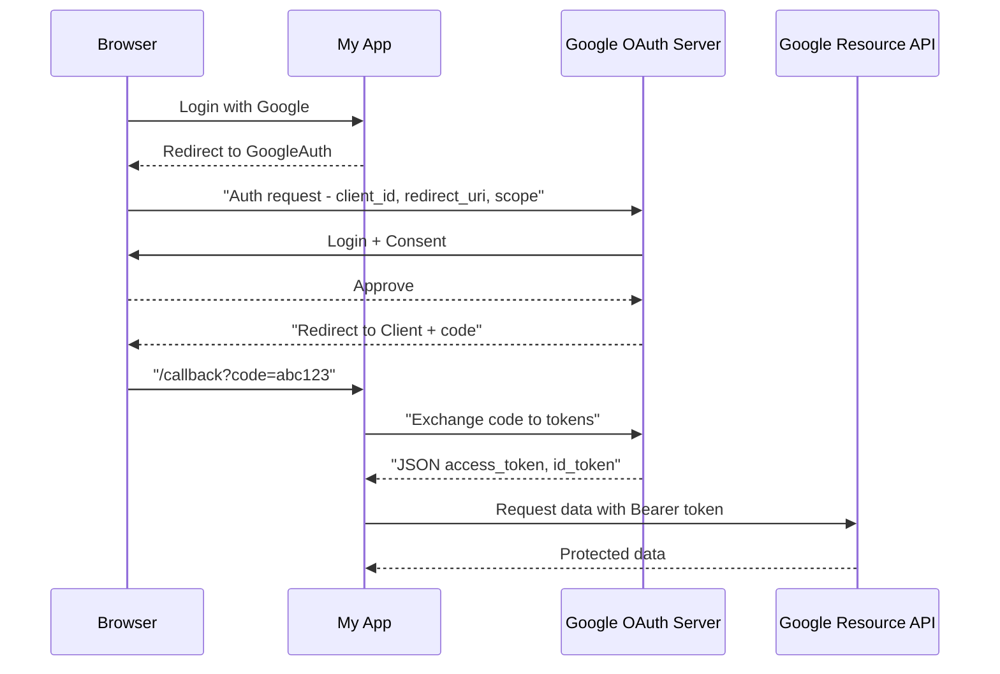

Once credentials are provisioned, they are used by individuals or entities (subjects) to gain access to resources. The credentials presented when access is requested must be authenticated, and various authentication systems are available to support a wide range of use cases. These systems include local authentication methods that provide access to individual computers or specific sets of files, and network-based authentication systems such as LDAP or Identity-as-a-Service (IDaaS), which grant access to resources across a network. Additionally, as users are often remote or may require access across multiple networks, authentication solutions that support remote access or federated identities are essential to meet both access control and security requirements while ensuring users can maintain seamless access.

One common protocol used for authentication and authorization is **Open Authorization (OAuth)**, which is an open standard allowing secure authorization in web, mobile, and desktop applications. OAuth provides a mechanism for delegating authorization from the resource owner (user) to third-party applications without exposing user credentials, making it ideal for federated identity scenarios. OAuth uses four primary roles, one of which is the Identity Provider (IdP), responsible for authenticating the user, providing authorization, and passing the authorization information to relying applications. 

:bulb: OAuth is an authorization framework that enables users to grant third-party applications access to their resources without exposing their credentials. The process begins when a user attempts to access a third-party application that requires access to their data stored on another service, known as the Resource Server. The third-party application redirects the user to an Authorization Server, where the user authenticates and grants permission to the application to access specific resources. Once the user approves, the Authorization Server issues an access token to the third-party application, which is used to authenticate subsequent requests to the Resource Server.
OAuth ensures that the access granted is limited in scope and time, using scope parameters to define which resources the application can access, and an expiration time for the token to ensure limited access duration. The access token is sent with every API request to the Resource Server, which validates the token before allowing access to the resources. The application never receives the user's credentials directly, maintaining the security of the user’s private data. In certain scenarios, OAuth also allows refresh tokens to obtain new access tokens without requiring the user to reauthorize, which facilitates seamless access over extended periods.

The following graph recaps the Oauth2 flow:

Similarly, **OpenID Connect (OIDC)**, built on top of OAuth 2.0, extends OAuth by adding authentication features to provide a Single Sign-On (SSO) experience. It allows users to authenticate using an identity provider (such as Gmail, LinkedIn, or Twitter), reducing the need for multiple logins across platforms.

:bulb: OpenID Connect (OIDC) is an identity layer built on top of OAuth 2.0 that enables authentication, in addition to the authorization features provided by OAuth. The process begins when a user attempts to log in to a third-party application that supports OIDC. The application redirects the user to an Identity Provider (IdP) for authentication, where the user provides their credentials. Upon successful authentication, the Identity Provider issues an ID Token along with an access token to the application.
The ID Token is a JWT (JSON Web Token) containing claims about the user’s identity, such as their name, email, and other profile information, which is used by the application to authenticate the user. The access token is used to access the user’s resources on the Resource Server, similar to OAuth, but it also allows the application to verify the user's identity. The user's authentication data can also be passed using federated identities, where users authenticate via external services like Google or Facebook, improving the user experience. OIDC supports Single Sign-On (SSO) functionality, enabling users to authenticate once and gain access to multiple applications without needing to log in again. In addition, OIDC allows applications to request userinfo endpoints from the Identity Provider, providing further details about the authenticated user.

**Security Assertion Markup Language (SAML)** is another widely used protocol for authentication and authorization, primarily in SSO scenarios. It is an XML-based framework that allows identity and access information to be shared between systems. In a typical SAML exchange, a user requests access to a service provider (SP) application, and the service provider relies on the security assertion made by the identity provider (IdP), which confirms the user’s identity and authorizes access. This makes SAML a crucial part of many enterprise systems, especially when combined with federated identity management solutions. 

:bulb: Security Assertion Markup Language (SAML) is an XML-based framework used for exchanging authentication and authorization data between an Identity Provider (IdP) and a Service Provider (SP). The process begins when a user attempts to access a protected resource or application (the Service Provider) and is redirected to the Identity Provider for authentication. The user enters their credentials on the IdP's login page, and if the authentication is successful, the IdP generates a SAML assertion, which contains the authentication statement and any attributes required by the SP.
This assertion is passed from the IdP to the SP, typically through the user's browser, either as part of a URL or a browser redirect. The Service Provider then validates the SAML assertion to ensure the user's identity and attributes are authentic, granting access to the user based on the information contained in the assertion. The SAML assertion contains important claims such as the user's identity, role, and access rights, which the SP uses to enforce the appropriate access control policies. SAML is often used in Single Sign-On (SSO) scenarios, where users can access multiple applications or services without needing to log in repeatedly. By using SAML, organizations can centralize authentication management and improve security by enforcing a consistent identity verification process across various services.

The following table technically compares OAuth2 and SAML:

| Feature        | OAuth 2.0 / OIDC         | SAML 2.0                       |
| -------------- | ------------------------ | ------------------------------ |
| Message format | JSON, JWT                | XML                            |
| Token type     | Access token, ID token   | SAML Assertion                 |
| Transport      | REST (HTTP, JSON)        | Browser POST/Redirect          |
| Common use     | APIs, mobile, web apps   | Enterprise SSO                 |
| Signature      | JSON Web Signature (JWS) | XML Signature                  |
| Identity layer | OIDC (extension)         | Built-in                       |
| Debug tool     | Chrome DevTools + jwt.io | Chrome DevTools + samltool.com |

Similarly, Kerberos provides secure authentication in networked environments using encrypted tickets for user verification. It enables users to authenticate once and then access multiple services without re-entering credentials, reducing the burden on both users and administrators.

:bulb: Kerberos is a network authentication protocol that uses symmetric key cryptography to enable secure authentication between users and services in a distributed environment. The process begins when a user (the client) requests access to a service by sending an authentication request to the Authentication Server (AS), which is part of the Key Distribution Center (KDC). The Authentication Server validates the user's credentials and, if successful, issues a Ticket-Granting Ticket (TGT), which proves the user's identity.
The client then presents this TGT to the Ticket-Granting Server (TGS), requesting a service ticket for a specific application or service they wish to access. If the user is authorized to access the service, the TGS issues a service ticket that is encrypted with the service's secret key. The client provides the service ticket to the target service, which uses its secret key to decrypt the ticket, authenticate the client, and grant access. This process minimizes the need for users to re-enter passwords repeatedly and ensures that sensitive credentials are never transmitted over the network, reducing the risk of credential theft. Kerberos is widely used in modern systems, such as Microsoft Active Directory, to enable Single Sign-On (SSO) and simplify identity management across a networked environment.

> 🔗 More Info about Kerberos are available in 4.1.3 in [4.1 Apply secure design principles in network architectures](../DOMAIN4%20-%20Communication%20and%20Network%20Security/4.1%20Apply%20secure%20design%20principles%20in%20network%20architectures.md)

### Open Questions ###

1. What is the primary function of authentication in access management, and how is it supported by various systems?  

  
Show answer

Authentication is the process of verifying the identity of individuals or entities before granting access to resources. Various systems, such as local authentication methods for individual computers, network-based systems like LDAP or Identity-as-a-Service (IDaaS), and remote access or federated identity systems, are employed to meet diverse use cases and security requirements.  

2. How does OAuth work in the context of federated identity scenarios, and what are its primary roles?  

  
Show answer

OAuth enables secure authorization for third-party applications without exposing user credentials. In federated identity scenarios, OAuth facilitates the delegation of authorization from the user (resource owner) to the third-party application. The Identity Provider (IdP) authenticates the user and provides authorization information to relying applications.  

3. What is the significance of access tokens in the OAuth process, and how do they ensure secure access to resources?  

  
Show answer

Access tokens in OAuth represent authorization granted to a third-party application to access specific resources on the user's behalf. These tokens ensure secure access by validating each request made by the application to the Resource Server, without exposing the user's credentials.  

4. How does OpenID Connect (OIDC) extend OAuth 2.0 to provide authentication and a Single Sign-On (SSO) experience?  

  
Show answer

OpenID Connect (OIDC) builds on OAuth 2.0 by adding authentication features to provide Single Sign-On (SSO). OIDC allows users to authenticate with an Identity Provider (such as Google or Facebook), simplifying the login process and enabling seamless access to multiple applications with a single login.  

5. What role does the ID Token play in the OIDC process, and how does it contribute to verifying user identity?  

  
Show answer

The ID Token in OIDC is a JWT (JSON Web Token) containing user identity claims, such as name and email. It helps the application authenticate the user, while the access token provides access to the user's resources. The ID Token enables the application to verify the user's identity and ensures a secure and consistent authentication process.  

6. How does Security Assertion Markup Language (SAML) work in Single Sign-On (SSO) scenarios to facilitate authentication and authorization?  

  
Show answer

Security Assertion Markup Language (SAML) is used in SSO scenarios to exchange authentication and authorization data between the Identity Provider (IdP) and the Service Provider (SP). The IdP authenticates the user and issues a SAML assertion, which contains the user's identity and access rights, allowing the SP to grant access without re-authenticating.  

7. What is the purpose of the SAML assertion, and what kind of information does it typically contain?  

  
Show answer

The SAML assertion contains authentication statements and attributes about the user, such as their identity, role, and access rights. This information is used by the Service Provider (SP) to validate the user's identity and authorize access to the requested resources.  

8. How does Kerberos enable secure authentication in networked environments, and what role do tickets play in this process?  

  
Show answer

Kerberos is a network authentication protocol that uses encrypted tickets to securely authenticate users and services in a distributed environment. When a user requests access to a service, Kerberos issues a Ticket-Granting Ticket (TGT), which is later used to obtain a service ticket from the Ticket-Granting Server (TGS). This ensures secure authentication without repeatedly transmitting passwords.  

9. What is the advantage of using Kerberos for Single Sign-On (SSO) in a distributed environment?  

  
Show answer

The advantage of using Kerberos for Single Sign-On (SSO) is that it allows users to authenticate once and then access multiple services without needing to re-enter credentials. This minimizes password entry, reduces administrative burden, and enhances security by ensuring credentials are never transmitted over the network.  

10. What are the key differences between OAuth, OpenID Connect (OIDC), SAML, and Kerberos in terms of authentication and authorization?  

  
Show answer

OAuth is primarily an authorization framework, enabling secure access delegation, while OpenID Connect (OIDC) adds authentication capabilities for a complete solution, including SSO. SAML is an XML-based framework used for SSO and exchanging authentication/authorization data between IdP and SP. Kerberos is a protocol for network authentication using encrypted tickets, providing SSO in distributed systems. Each protocol has different methods for handling authentication and authorization, depending on the specific security needs of the environment.  

