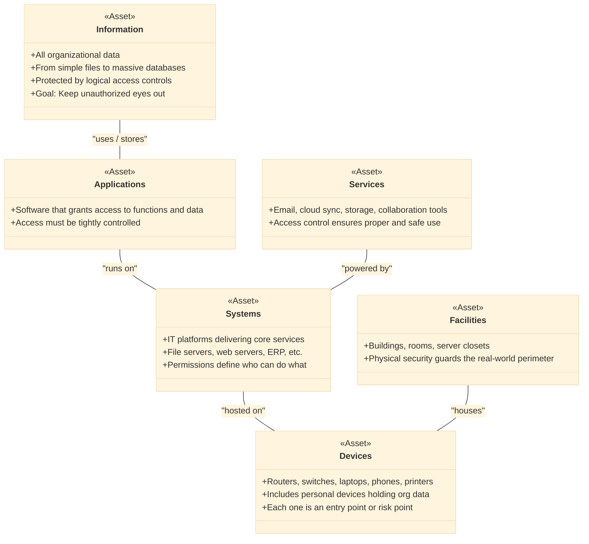

## 5.1 Control Physical and logical access to assets ##

Access control encompasses the systems and processes designed to safeguard an organization’s assets while ensuring that only authorized individuals have the appropriate level of access. Core principles of access control include:
1. **Need-to-know:** restricts access to information or resources based strictly on a user’s necessity to perform their job. Users are only given access to the specific data or systems required to complete their tasks, minimizing exposure to unnecessary or sensitive information.
2. **Least privilege:** ensures that users or systems are granted the minimum level of access necessary to perform their assigned duties. By limiting permissions, it reduces the potential damage caused by accidental misuse or unauthorized access.
3. **Separation of duties:** involves dividing responsibilities and privileges among multiple individuals or systems to prevent conflicts of interest or the misuse of power. No single person should have enough access or control to carry out critical tasks independently, reducing the risk of fraud, errors, or abuse.

:necktie: These controls apply across all organizational levels and to all asset types (both physical and logical), ensuring comprehensive protection and regulated access. Never make the mistake, while approaching your exam and after you'll pass it, to think that managers and C-levels can avoid the 3 controls above mentioned.

Access control systems are designed to regulate who or what (referred to as **subjects**) can interact with specific assets (referred to as **objects**). These objects include data such as files and system resources like networks and computing power. In a physical context, access control involves securing facilities, like offices and server rooms, which are considered critical assets.

Subjects, which can be either human users or automated systems (e.g., devices or software processes), need access to these objects. Access control ensures that these interactions follow specific rules, determining who can read, write, or otherwise use a particular resource. For example, a user may be allowed to read a file but restricted from editing it, while a nonhuman entity like a system process may be permitted access based on the sensitivity of the data involved.

Physical security involves controlling entry into sensitive areas, such as server rooms. For instance, server rooms often employ cipher locks, whereas lower-priority objects like desktop computers may just have basic security measures like physical locks. These protections extend to servers, which house crucial organizational data and applications. Logical access controls, on the other hand, use technical measures—such as authentication and authorization—to regulate access to systems, networks, and sensitive information.

The ultimate goal of access control systems is to prevent the loss of the three core security attributes (CIA Triad):
- Confidentiality: Ensuring only authorized entities can access sensitive data.
- Integrity: Protecting systems and data from unauthorized alterations.
- Availability: Ensuring authorized users can access data and systems when needed.

Sometimes, two more principles are added to the CIA triad: Non-repudiation (ensuring actions can't be denied) and Authenticity (verifying that users and systems are genuine). This is called CIANA, which covers a broader range of security goals.

Access control is fundamentally about regulating interactions between entities (subjects) and resources (objects) within an environment that requires security. The goal is to mediate and enforce access permissions to ensure that only authorized subjects can interact with specific objects based on predefined policies and security requirements.
The following picture recaps some of the concepts above explained and the concepts of labeling and marking taken from Domain 2.

As a security professional you should recognize, assess and protect all the following assets:

- **Information:** This is all the data the organization stores on servers, computers, and smaller devices. It can be simple files or large databases. Logical access controls prevent unauthorized access to this information.

- **Systems:** These are IT systems that provide services, like a file server or a web server supporting e-commerce. Permissions manage access to these systems.

- **Devices:** This includes routers, switches, servers, computers, tablets, smartphones, and printers. Even if employees use personal devices, any organizational data stored on them is still an asset.

- **Facilities:** This refers to the physical locations owned or rented by the organization, like buildings or rooms. Physical security controls protect these spaces.

- **Applications:** Applications offer access to data and services. Managing access to these with permissions adds another layer of security.

- **Services:** These are the activities or functions provided by an organization’s systems, like email or cloud storage. Controlling access to services ensures they’re used properly and securely.

:bulb: In most operating systems, access control rules define the permissions or rights that a user (or subject) has over resources (objects) such as files, directories, or processes. These rules typically fall under various logical access modes that determine the level of interaction a subject can have with an object. The basic access modes are:
- **Create:** Allows a subject to create a new object (e.g., creating a new file).
- **Update:** Allows a subject to modify an existing object (e.g., editing a file).
- **Read:** Allows a subject to view the content of an object (e.g., reading a document).
- **Read/Write:** Allows both reading and modifying an object.
- **Execute:** Allows a subject to run or execute an object (e.g., running a program).
- **Delete:** Allows a subject to remove an object from the system (e.g., deleting a file).

In Windows-based systems, access control is implemented using Access Control Lists (ACLs). These ACLs define which users or groups can perform specific actions on an object. Windows permissions are typically more granular, and permissions like Read, Write, Execute, and Delete can be explicitly set for different users or groups. Windows also allows setting permissions on a file or folder, including special permissions for various administrative tasks.

Unix and Linux systems use a simpler, more straightforward owner-group-other model for access control, where permissions are set for the owner of the file, the group associated with the file, and others (everyone else). Each of these categories can be granted Read (r), Write (w), and Execute (x) permissions. Unix systems use a more numeric approach (e.g., 755) to represent permission settings. Additionally, sudo allows users to elevate their privileges temporarily, giving them higher levels of access based on predefined roles.

One major aspect of IAM implementation is the method of decision-making and enforcement:

- Centralized IAM: Involves a dedicated team and system overseeing all access control activities. This approach ensures rigorous oversight and monitoring but can introduce a single point of failure.
- Decentralized IAM: Distributes access control decisions to system or information owners, allowing for greater flexibility and freedom. However, this can lead to inconsistent enforcement and a lack of unified oversight.
- Hybrid IAM: Combines elements of both centralized and decentralized approaches. It allows certain access control decisions to be made centrally while giving system owners the freedom to manage specific areas. This approach aims to balance oversight with flexibility.

### Open Questions ###

1. What are the core principles of access control and why are they important?

  
Show answer

The core principles of access control include need-to-know, least privilege, and separation of duties. These principles ensure that users or systems are only given access to the data and resources necessary for their work, reducing the risk of unauthorized access and misuse while maintaining control over sensitive information

2. How does the "need-to-know" principle help in safeguarding sensitive information?

  
Show answer

The "need-to-know" principle ensures that users only access the information they need to perform their job functions. This minimizes the risk of exposure to unnecessary or sensitive data, reducing the likelihood of accidental or intentional data breaches.

3. Explain the principle of "least privilege" and its role in reducing security risks.

  
Show answer

"Least privilege" grants users the minimum level of access required to complete their tasks. By limiting access rights, it reduces the chances of users inadvertently or maliciously causing damage to critical systems, data, or applications

4. What is the purpose of "separation of duties" in access control, and how does it prevent misuse?

  
Show answer

"Separation of duties" involves distributing responsibilities among different individuals or systems to avoid conflicts of interest. This principle prevents a single person from having too much control, reducing the likelihood of fraud, errors, or abuse within critical processes.

5. How does access control apply to both physical and logical assets?

  
Show answer

Access control applies to both physical assets (e.g., office spaces or server rooms) and logical assets (e.g., data, systems, and networks). Physical security prevents unauthorized entry to critical locations, while logical security controls regulate digital access to sensitive data and systems.

6. What are the three core attributes of the CIA triad, and how do they relate to access control?

  
Show answer

The CIA triad stands for Confidentiality, Integrity, and Availability. These core attributes represent the foundation of access control: protecting data from unauthorized access (Confidentiality), ensuring its accuracy and consistency (Integrity), and ensuring that authorized users can access the data when needed (Availability).

7. What is the role of physical security in access control, and how does it differ from logical security measures?

  
Show answer

Physical security in access control involves protecting assets like servers, buildings, and network hardware using physical measures like locks, badges, or biometric scanners. Logical security, on the other hand, uses technical measures such as authentication protocols to protect digital assets like data and applications.

8. How do access control systems regulate the interactions between subjects (users or systems) and objects (resources)?

  
Show answer

Access control systems define the rules that determine who (subjects) can interact with what resources (objects). These systems regulate actions such as reading, writing, executing, or deleting data based on predefined permissions, ensuring that only authorized users or systems can perform specific actions on sensitive assets.

9. What are the key differences in access control models between Windows and Unix/Linux systems?

  
Show answer

In Windows, access control is implemented through Access Control Lists (ACLs), which define permissions for users and groups, allowing for granular control over file access. In contrast, Unix/Linux systems use a simpler owner-group-other model, with permissions represented by Read, Write, and Execute rights for different user categories.

10. What are the advantages and challenges of centralized, decentralized, and hybrid IAM approaches?

  
Show answer

Centralized IAM involves a single team or system overseeing all access control decisions, providing unified control but introducing a single point of failure. Decentralized IAM allows system owners to manage access locally, offering flexibility but potentially leading to inconsistent enforcement. Hybrid IAM combines both approaches, balancing oversight with flexibility to accommodate diverse needs.

## 5.1.1 Information ##

An organization's information can be in simple files on servers, computers, or smaller devices, as well as in databases within server farms. To safeguard this information, logical access controls are implemented to prevent unauthorized access. Access control models usually treat information as an object and manage access based on user credentials. For example, to ensure confidentiality, a system verifies a user's credentials before allowing access, thus blocking unauthorized users from viewing the data.

Restricted access also aims to preserve the integrity of information by allowing only authorized and properly trained and aware individuals to make changes. Security policies often integrate access control systems to enforce both confidentiality and integrity: only authorized personnel can access the policies, and only designated users, such as those from specific departments, are allowed to alter them. Moreover, if the system supports logging and version tracking, it enforces non repudiation by recording all changes made.

Different types of information require different levels of protection, which can change over time. For example, while stock ownership information is usually public, stock trades are kept confidential until execution to gain a competitive advantage. Once a trade is executed and becomes public, the need for confidentiality shifts. 

## 5.1.2 Systems ##

The term "system" can be challenging to define, as it generally refers to a combination of hardware, software, personnel, policies, procedures, and other resources. While "system" often pertains to electronic information systems, understanding the full scope of these systems, including analog processes, hard-copy data, and electronic components, is essential for designing effective identity and access management (IAM) controls.

Systems may have various security requirements, including the need to ensure confidentiality, availability, and integrity of critical information, as well as the availability of the system itself and the authenticity and nonrepudiation of its users. Implementing proper access controls is crucial to maintaining the security and privacy of data. These controls support fundamental security principles such as Confidentiality, Integrity, Availability, and Nonrepudiation (CIANA) already mentioned.

## 5.1.3 Devices ##

In access control models, devices can be both objects and subjects. Devices that contain sensitive data or provide access to critical functions require controlled access as objects. They can also act as subjects or non-human users; device identifiers like fingerprints, digital certificates, or cookies can be used to authenticate devices. If a new or untrusted device attempts to access sensitive information, the access control system should enforce additional authentication measures, such as MFA, before granting access. 

Devices are integral components of information systems and, as such, require effective identity and access management (IAM). User workstations such as laptops, desktops, and tablets function as complete information systems with capabilities for storage, processing, and networking, necessitating stringent security measures like restricted logical access. The rise of cloud computing has further expanded the range of devices an organization must manage, as these services can be accessed from any internet-connected device.

A key aspect of device IAM is ensuring that only authorized users can access these devices. 

:bulb: The proliferation of new device types has introduced IAM challenges, such as early smartphones that only supported simple four-digit PINs rather than more complex passwords. However, advancements in technology have brought benefits, including the widespread availability of biometric sensors like fingerprint readers and facial recognition scanners. These technologies, now more affordable and effective, enhance multi factor authentication (MFA) options.

Effective IAM for devices also involves robust endpoint security. Practices like endpoint detection and response (EDR) are crucial for monitoring and managing device security. Access controls should be applied to ensure device security. For instance, an asset inventory in a mobile device management (MDM) system should track the owner or custodian of each device, aiding incident response if a device is compromised.

The portability of modern devices, such as laptops, tablets, and smartphones, presents a challenge to confidentiality. These devices are small and lightweight, making them susceptible to theft, loss, or unauthorized access if left unattended. Tools like MDM can mitigate these risks with features such as:

- **Device Protection:** Enforces security policies like password complexity, software updates, and app restrictions. EDR software can detect suspicious activity and take protective actions like quarantining, locking, or wiping the device.
- **Device Restrictions:** Identifies unsupported hardware or jailbroken systems that bypass standard restrictions. Jailbreaking can compromise device security by removing manufacturer protections.
- **Remote Lock or Wipe:** Allows organizations to lock or erase data from a device if it is stolen or lost. Remote lock can be reversed if the device is recovered, while remote wipe deletes data or renders the device unusable, typically used when recovery is unlikely.
- **Containerization:** Isolates organizational data within a logical container on a personal device, limiting access by other apps. This approach is useful for bring-your-own-device (BYOD) policies, where restrictions are applied to the container rather than the entire device. The container can be locked or wiped if necessary.

Physical access controls also play a crucial role in device security. In an office setting, physical controls protect all devices within the facility. However, portable devices that leave the secure environment pose a challenge. Users must be trained to secure devices appropriately, such as avoiding leaving them unattended in public or securing them in an unmarked bag or hotel safe during travel.

## 5.1.4 Facilities ##

Facilities offer essential security for all the systems, devices, and information they house, making robust protection crucial. Physical security is a key aspect of information system security—if an attacker gains physical access to a device, even the most sophisticated logical security measures may fail to prevent unauthorized data access.

Traditional physical security practices for facilities typically employ a secure perimeter approach, using many layers of defense to enhance security progressively. They are usually a combination of surveillance, detection, and authentication systems to prevent unauthorized entry. Surveillance systems like CCTV cameras provide real-time monitoring and recording of entry points, ensuring visual oversight and deterrence. Intrusion Detection Systems (IDS), such as motion sensors, infrared detectors, and alarm systems, detect unauthorized movement and trigger alerts to security personnel or automated response mechanisms. Physical access control systems (PACS), including RFID badges, biometric scanners, and smart card readers, authenticate individuals and enforce entry restrictions based on predefined access policies. These systems often integrate with security management platforms to provide centralized monitoring, logging, and real-time response to security incidents.

## 5.1.5 Applications ##

Applications often serve as gateways to an organization’s data, making it crucial to control access to these applications to protect sensitive information. Here are three key points explaining why we should protect Applications of our company:

**Data Protection:** Applications frequently handle and process sensitive or critical data. By controlling access to these applications, an organization can prevent unauthorized users from accessing, manipulating, or leaking this data.

**Regulatory Compliance:** Many industries are subject to regulations that require strict data protection measures. Controlling access to applications helps organizations comply with these regulations by ensuring that only authorized personnel can access sensitive information.

**Minimizing Risks:** Applications can be vulnerable to various types of cyber threats, including unauthorized access, data breaches, and malicious attacks. Proper access control mitigates these risks by limiting exposure to only those individuals who need access for their roles.

## 5.1.6 Services ##

Services refer to the various functions or processes provided by an information system, network, or application to support the needs of users or other systems. These services can range from basic functions like file storage and retrieval to more complex ones like data processing, authentication, email delivery, and cloud-based operations. Controlling access to these services is critical to ensuring that only authorized users or systems can use them, safeguarding the organization’s data and infrastructure.

### Open Questions ###

1. Why is access control considered a cornerstone of information security?

 
Show answer
 Access control ensures that only authorized individuals or systems can interact with sensitive assets. Without it, confidentiality, integrity, and availability (CIA) of information could be compromised, leading to breaches, fraud, or service disruptions. 

2. How does the need-to-know principle differ from the least privilege principle?

 
Show answer
 Need-to-know restricts access based on whether a user requires the information to perform their job. Least privilege goes further by ensuring that users have only the minimal rights necessary (e.g., read-only instead of read/write). Together, they minimize unnecessary exposure and limit potential damage. 

3. What risks are reduced by applying separation of duties in access control?

 
Show answer
 Separation of duties reduces risks of fraud, misuse of power, and human error by ensuring that no single individual can perform a critical task alone. For example, one employee approves financial transactions, while another executes them. 

4. How do physical access controls and logical access controls complement each other?

 
Show answer
 Physical controls protect facilities and hardware (e.g., locks, biometrics, CCTV), while logical controls safeguard data and systems (e.g., authentication, ACLs, encryption). Both are needed: a server room lock prevents intruders, while logical access prevents hackers from bypassing the lock digitally. 

5. Why is the CIA triad relevant to access control?

 
Show answer
 Access control enforces **confidentiality** (restricting who can see data), **integrity** (ensuring only authorized changes occur), and **availability** (ensuring access is granted when needed). Without balanced access control, one or more elements of the triad may be compromised. 

6. How do Windows and Unix/Linux systems implement access control differently?

 
Show answer
 Windows uses Access Control Lists (ACLs) for granular user/group permissions. Unix/Linux uses the owner-group-other model with Read/Write/Execute rights, represented numerically (e.g., 755). Unix/Linux also leverages `sudo` for temporary privilege elevation. 

7. Why is device identity management important in modern access control?

 
Show answer
 Devices often act as both subjects (initiating actions) and objects (storing data). With BYOD and cloud access, IAM must verify device identity through certificates, fingerprints, or MDM policies to ensure only trusted devices access sensitive resources. 

8. What role does multi-factor authentication (MFA) play in logical access control?

 
Show answer
 MFA strengthens access control by requiring multiple forms of verification (e.g., password + fingerprint). This makes unauthorized access far harder, especially when passwords are compromised through phishing or brute-force attacks. 

9. What are the main differences between centralized, decentralized, and hybrid IAM?

 
Show answer
 - **Centralized IAM**: Single authority manages all access (high consistency, single point of failure). - **Decentralized IAM**: System owners manage access locally (flexible, but inconsistent). - **Hybrid IAM**: Combines both, balancing oversight with flexibility. 

10. How do access controls protect applications and services in an organization?

 
Show answer
 Applications and services often handle sensitive data (e.g., HR systems, email, cloud storage). Access controls prevent unauthorized users from exploiting vulnerabilities, help meet compliance requirements, and reduce risks of breaches or service abuse. 

