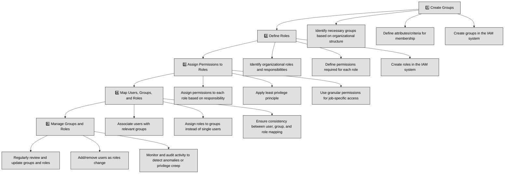
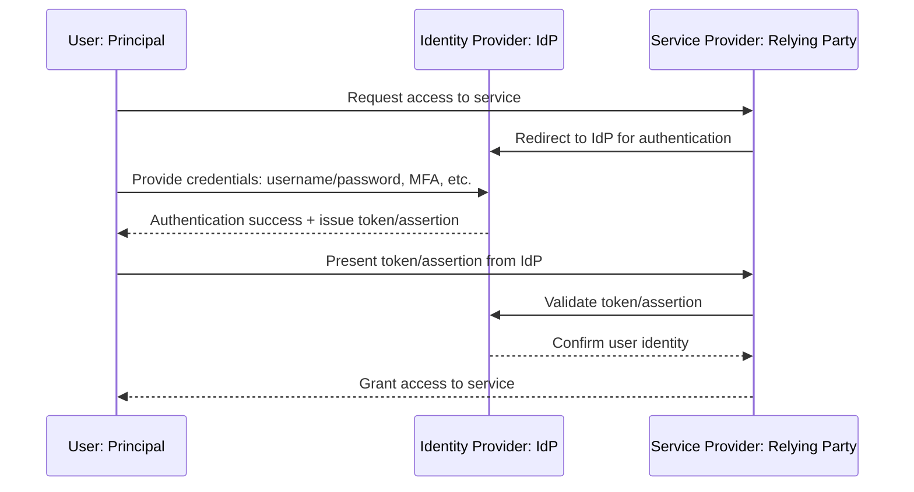
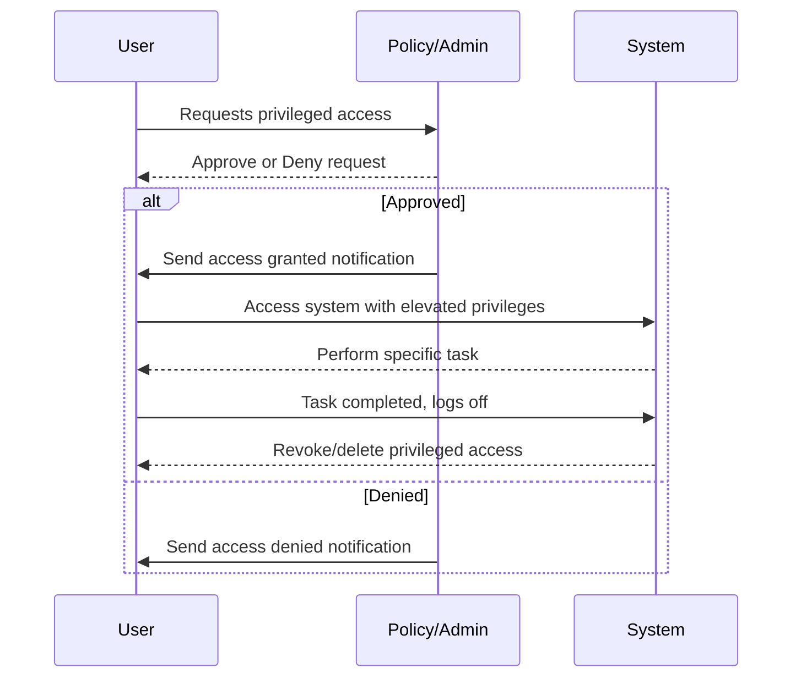

## 5.2.1 Groups and Roles ##

In the field of identity management, groups and roles serve as fundamental building blocks for organizing users and managing their access privileges within an organization. What are groups and roles ?

**Groups:** A group is a collection of users who share common characteristics or require access to the same resources. Groups can be created based on various criteria, such as departments, projects, locations, or job functions. For example, a company might create groups for "Sales," "Engineering," and "Human Resources."

**Roles:** A role represents a set of job functions or responsibilities within an organization. It defines the tasks that a user is authorized to perform and the resources they can access. 

:link: According to [Microsoft](https://learn.microsoft.com/en-us/azure/well-architected/security/identity-access), a role is “A set of permissions that define what a user or group can do”. For instance, a "Sales Manager" role might include permissions to access customer data, create sales orders, and manage sales teams.

:brain: What distinguishes a group from a role ? A role or a user can act as a "principal" - They can be responsible as actors for some actions. A group is a collection of users with shared characteristics or responsibilities that cannot take action. For example, the Sales department cannot take any action, even though we colloquially say so. Action is taken either by a specific person or a person in a role, for example a Sales Manager.

A role can be assigned to:
- A single user: For unique or specialized responsibilities.
- Multiple users: When multiple individuals share the same role within a group.
- A group: To grant a set of permissions to all members of the group, simplifying management.

Assigning roles to groups is often recommended for efficiency, as it allows for centralized management of permissions. However, it's important to consider the specific needs and security requirements of the organization when determining the most appropriate approach.

Now that you have clear what groups and roles are, what do you have to do with them as a security manager ?

1 Create Groups:
- Identify the necessary groups based on organizational structure and requirements.
- Define the attributes or criteria that will determine membership in each group.
- Create the groups in the identity management system.

2 Define Roles:
- Identify the roles within the organization and their associated responsibilities.
- Define the permissions required for each role, considering factors such as data access, system access, and administrative privileges.
- Create the roles in the identity management system.

3 Assign Permissions to Roles:
- Assign the necessary permissions to each role based on its defined responsibilities.
- Use a granular approach to ensure that users only have the privileges they need to perform their job functions.
- Consider the principle of least privilege to minimize the risk of unauthorized access.

4 Map Users to Groups and Groups to Roles:
- Associate Users with Groups: Assign users to relevant groups based on their department, project, or other criteria.
- Assign Roles to Users/groups: Assign appropriate roles to groups. Remember, best practice is to provide roles to users by adding the users to groups and assigning the roles to those groups. (It is suggested to avoid assigning roles to single users)
- Ensure Consistency: Verify that users are assigned to the correct groups and roles to ensure they have the necessary privileges to perform their tasks.

5 Manage Groups and Roles
- Review and Update: Regularly review groups and roles to ensure they remain aligned with the organization's structure and needs.
- Manage Membership: Add or remove users from groups based on their changing roles or assignments.
- Monitor and Audit: Monitor group and role activity to identify any anomalies or potential security breaches. Conduct regular audits to verify that access privileges are being assigned and used appropriately. This will help you in avoiding any form of privilege creep.

### Open Questions ###

1. What is the difference between a group and a role in identity management?

  
Show answer

A group is a collection of users with common characteristics, while a role represents the set of responsibilities and tasks a user is authorized to perform. Groups help organize users, and roles determine what they can do with the resources in the organization.

2. How can you define a group, and why is it important in access control?

  
Show answer

A group is a collection of users that share common attributes or need access to similar resources, such as "Sales" or "Engineering." Groups help simplify the management of access by grouping users with similar needs, ensuring they have appropriate privileges.

3. What is a role, and how does it relate to permissions in an organization?

  
Show answer

A role defines a set of job functions or responsibilities within the organization, specifying what actions a user can perform and what resources they can access. Roles are crucial for enforcing access control policies and ensuring that users can only perform actions relevant to their job functions.

4. Why might it be beneficial to assign roles to groups instead of individual users?

  
Show answer

Assigning roles to groups is beneficial because it streamlines access management. By managing roles at the group level, you can apply consistent permissions to all members of a group, ensuring efficiency and reducing the risk of errors that may occur when assigning roles to individual users.

5. How can a role be assigned to a group, and what are the advantages of doing so?

  
Show answer

A role can be assigned to a group by adding the role to the group and assigning users to the group. This allows all members of the group to inherit the permissions associated with that role, making it easier to manage and maintain access control policies.

6. What responsibilities does a security manager have in creating and managing groups and roles?

  
Show answer

As a security manager, your responsibilities include identifying the necessary groups, defining roles and their associated responsibilities, assigning appropriate permissions to roles, and ensuring that users are properly mapped to groups and roles. You must also review and update groups and roles regularly to ensure they align with organizational needs.

7. How do you create groups and define the criteria for membership in an identity management system?

  
Show answer

To create groups, you must first identify the organizational structure and the resources that need to be protected. Define the attributes or criteria that will determine which users belong to each group, then create the groups in the identity management system and assign users accordingly.

8. What are the key considerations when defining roles and the associated responsibilities within an organization?

  
Show answer

When defining roles, you need to identify the job functions or responsibilities within the organization, along with the permissions necessary to perform them. Ensure that the roles are granular enough to reflect specific tasks and access requirements while minimizing unnecessary permissions.

9. What is the principle of least privilege, and how should it be applied when assigning permissions to roles?

  
Show answer

The principle of least privilege ensures that users only have the minimum necessary access to perform their job duties. When assigning permissions to roles, it's essential to follow this principle by granting only the permissions needed for the role, reducing the risk of unauthorized access.

10. What actions should a security manager take to ensure consistency in group and role assignments, and why is this important?

  
Show answer

To ensure consistency, regularly review and update the assignment of users to groups and roles. Monitor role and group activity, conduct audits, and make sure users' access aligns with their current roles and responsibilities. This helps avoid privilege creep and ensures that users only have access to what is necessary for their work.

---

## 5.2.2 Authentication, Authorization and Accounting (AAA) (e.g. multifactor authentication (MFA), password-less authentication) ##

Authentication, Authorization, and Accounting (AAA) refers to a security framework used to manage and control access to resources within a system. Here's a breakdown of each concept:

1. **Authentication** is the process (happening right after Identification) of verifying the identity of a user, device, or system. It ensures that the entity attempting to gain access is who they claim to be. Examples of authentication methods are:
- Password-Based Authentication: Users enter a secret password to prove their identity.
- Two-Factor Authentication (2FA): Requires two forms of authentication, typically a password and something else (e.g., a one-time code sent to a phone).
- Multi-Factor Authentication (MFA): Extends 2FA by requiring multiple verification methods, such as a password, biometric data (e.g., fingerprint), or a hardware token.
- Passwordless Authentication: Users authenticate without passwords, using methods like biometrics (fingerprint or face ID), magic links sent via email, or hardware keys (e.g., FIDO2 keys).

2. **Authorization:** determines what a user or system can do after they have been authenticated. It grants permissions and access rights based on policies or roles within the system. Some Authorization Methods are:
- Role-Based Access Control (RBAC): Assigns permissions based on user roles (e.g., admin, user), controlling access to systems.
- Attribute-Based Access Control (ABAC): Permissions are granted based on attributes of users and resources (e.g., user location, time of access).
- Access Control Lists (ACLs): Specify which users or system processes are allowed to access specific resources.

3. **Accounting:** involves tracking and recording the actions performed by a user or system, often for auditing, troubleshooting, and security purposes.

Identification and authentication are like a simple yes or no system. Identification answers the question "Who are you?" while authentication checks if that identity is correct. Once someone is authenticated, they can be authorized, which means they get access to certain resources or information based on their verified identity.

Accounting is a bit different; it can start right after identification, even before authentication is complete. It tracks user activities and can provide various outputs, like logs, alerts, or reports, helping organizations keep an eye on who is doing what.

Examples of Accounting (Auditing) are:
- Logging and Monitoring: Tracks user activities and system events to ensure accountability and detect security incidents.
- Audit Trails: Detailed records of access and actions taken by users within a system.
- Session Management: Monitors user sessions and ensures proper termination after inactivity to prevent unauthorized access.

### Open Questions ###

1. What are the three components of the AAA framework in security, and what does each one do?

  
Show answer

The AAA framework consists of Authentication, Authorization, and Accounting. Authentication verifies the identity of a user or system. Authorization grants access based on predefined policies or roles. Accounting tracks user activities to ensure accountability and provides logs for auditing and troubleshooting.

2. How does authentication verify the identity of a user or system?

  
Show answer

Authentication verifies a user's or system's identity by checking credentials, such as a password, biometric data, or security tokens, ensuring that the entity trying to access a system is legitimate.

3. What are the common methods of authentication, and how do they differ from each other?

  
Show answer

- Password-Based Authentication: Users enter a password to verify their identity.
- Two-Factor Authentication (2FA): Requires two forms of verification (e.g., a password and a one-time code).
- Multi-Factor Authentication (MFA): Requires multiple forms of verification, adding an extra layer beyond 2FA (e.g., password, biometric data, and hardware token).
- Passwordless Authentication: Users authenticate using methods like biometrics or hardware keys, bypassing passwords entirely.

4. How does two-factor authentication (2FA) enhance security compared to password-based authentication?

  
Show answer

Two-Factor Authentication (2FA) enhances security by requiring two distinct forms of verification. This makes it harder for attackers to gain unauthorized access because, even if one factor (e.g., a password) is compromised, the attacker would still need the second factor (e.g., a one-time code).

5. What is multi-factor authentication (MFA), and how does it provide an extra layer of security?

  
Show answer

Multi-Factor Authentication (MFA) provides an extra layer of security by requiring multiple forms of verification from different categories, such as something you know (password), something you have (token or phone), or something you are (biometrics). This increases the difficulty for attackers to impersonate the user.

6. What is passwordless authentication, and what methods are commonly used to implement it?

  
Show answer

Passwordless Authentication removes the need for a password by using alternative authentication methods like biometrics (fingerprints, face ID), magic links sent to email, or hardware tokens (e.g., FIDO2 keys). It reduces the risks associated with weak or stolen passwords.

7. How does authorization differ from authentication, and what role does it play in access control?

  
Show answer

Authorization determines what a user or system can do after they are authenticated, whereas authentication only verifies the user's identity. Authorization is essential for granting the appropriate permissions based on the user's role or attributes.

8. What are the main methods of authorization, and how do they work?

  
Show answer

- Role-Based Access Control (RBAC): Assigns permissions based on roles (e.g., admin, user).
- Attribute-Based Access Control (ABAC): Grants access based on attributes (e.g., user location, time of access).
- Access Control Lists (ACLs): Specifies which users or systems can access specific resources.

9. How does role-based access control (RBAC) determine what a user can access in a system?

  
Show answer

Role-Based Access Control (RBAC) assigns users to roles (e.g., admin, manager, user), and each role has specific permissions associated with it. A user is authorized to access resources or perform actions based on their role within the organization.

10. What is accounting in the context of security, and how does it help in auditing and maintaining security?

  
Show answer

Accounting involves tracking user activities and actions within a system, such as logging events and auditing access. It helps identify suspicious activities, maintain records for compliance, and ensure accountability.

---

## 5.2.3 Session Management ##

Session management in information security refers to the process of handling the creation, maintenance, and termination of a user's interaction with a system or application. It ensures that once a user has authenticated, the system can track and control their activity for the duration of the session, while maintaining security, integrity, and privacy.

Key Components of Session Management:

| **Feature**             | **Description** |
|--------------------------|-----------------|
| **Session Creation**     | When a user successfully logs in, the system creates a session identified by a unique session ID. This ID may be stored in cookies or URL parameters and is used to track the user’s interactions with the system. |
| **Session Maintenance**  | During the session, the server maintains the session ID and associated state (user identity, roles, privileges). The session ID is transmitted with each request so the server can recognize the user and maintain stateful interaction. |
| **Session Termination**  | When the user logs out, the session should be terminated and the session ID invalidated. Sessions may also expire after inactivity, reducing misuse risk. Termination can occur in different ways: |
| → Schedule Limitations   | Automatic logouts at a specified time (e.g., 5 p.m.) or restricted access during certain periods (e.g., weekends). |
| → Login Limitation       | Restricts a single user ID to one active session at a time, preventing account sharing or multiple simultaneous logins. |
| → Time-outs              | Sessions automatically expire after inactivity or a fixed duration, requiring re-authentication to continue. |
| → Screensavers           | Trigger after inactivity, requiring re-authentication to regain access. Often used for physical security on endpoints. |

Some examples of Session Management are:

- Web Application:
A user logs into an e-commerce website. The server issues a session ID, which is stored in a cookie on the user’s browser. As the user navigates through the site, their session ID is sent with each request, allowing the server to remember their shopping cart and preferences. When the user logs out or after a set period of inactivity, the session expires.

- API Authentication:
In a RESTful API, after a user authenticates, a session token (or access token) is provided, which the client app stores. For subsequent API requests, the token is included in the request headers to authenticate and authorize the user. Tokens can expire after a certain time, requiring the user to re-authenticate or refresh the token.

- Single Sign-On (SSO):
With SSO, a user logs in once and gains access to multiple systems or applications. Each application or system recognizes the user's session through shared session tokens or cookies, allowing the user to move between them without re-entering credentials.

:bulb: Some Best Practices in Session Management:
- Use Secure and HttpOnly Cookies: Prevent exposure of the session ID to JavaScript and enforce transport over HTTPS.
- Regenerate Session IDs on Login: To prevent session fixation, issue a new session ID upon successful authentication.
- Use Short Expiration Times: Both idle and absolute timeouts reduce the risk of long-lived sessions being exploited.
- Implement Token-based Authentication (JWT): JSON Web Tokens (JWT) are a popular alternative to traditional session cookies, where the user’s state is encoded within the token itself. However, JWTs must also be carefully managed with expiration times and proper invalidation.

:bulb: Session management is crucial for preventing risks like session hijacking, where an unauthorized user gains access to an active session and uses it for malicious purposes, either through negligence or sophisticated techniques. One effective way to prevent session hijacking is frequent re-authentication, which ensures that the user is consistently validated throughout their session. Many VPN solutions incorporate continuous re-authentication as a core feature, along with re-establishing encryption keys at regular intervals. This process, often transparent to the user, significantly increases the difficulty for an attacker to take control of an active session, thus enhancing overall security.

### Open Questions ###

1. What is session management in information security and why is it important?

  
Show answer

Session management refers to the process of creating, maintaining, and terminating a user's interaction with a system or application. It is crucial for securing user sessions and ensuring that access rights, privileges, and user data are protected from unauthorized access, session hijacking, and privilege escalation.

2. How is a session typically created when a user logs into a system?

  
Show answer

A session is created when a user successfully logs in, and the system generates a unique session ID. This session ID is often stored in cookies or URL parameters, which allow the system to recognize the user and maintain the session state across multiple requests.

3. What is the role of session ID in session management?

  
Show answer

The session ID is a unique identifier assigned to each user session. It helps the system track user activity during the session and ensures that the user’s identity, roles, and privileges are maintained throughout their interaction with the system. The session ID is sent with each request to enable a stateful interaction.

4. What are some common ways to terminate a session in an information system?

  
Show answer

- Manual logout: The user explicitly logs out of the system.
- Session expiration: The system automatically ends a session after a period of inactivity.
- Scheduled limitations: User sessions are terminated at a specific time (e.g., after business hours).
- Time-out: Sessions automatically expire after a predefined duration.
- Screensaver: Inactivity triggers a screensaver, requiring re-authentication to regain access.

5. What is the purpose of session expiration in session management?

  
Show answer

Session expiration ensures that inactive sessions are automatically terminated after a certain period, reducing the risk of unauthorized access. It helps prevent attacks like session hijacking by limiting the window of time an attacker could exploit an abandoned session.

6. What are the potential security risks associated with session management?

  
Show answer

- Session hijacking: An attacker gains unauthorized access to an active session.
- Session fixation: An attacker sets a user's session ID to a known value and takes control of the session.
- Privilege escalation: A user might gain more privileges than necessary during a session if not properly managed.

7. What are some best practices for managing sessions securely?

  
Show answer

- Using secure and HttpOnly cookies to store session IDs.
- Regenerating session IDs after login to prevent session fixation.
- Implementing short expiration times for both idle and absolute timeouts.
- Using token-based authentication (e.g., JWT) for better session control.
- Enforcing re-authentication after a certain period or for high-risk actions.

8. How does session hijacking work and how can it be prevented?

  
Show answer

Session hijacking occurs when an attacker steals or guesses a valid session ID and uses it to impersonate a legitimate user. It can be prevented by using secure communication channels (e.g., HTTPS), regenerating session IDs regularly, and employing two-factor authentication (2FA) or token-based authentication.

9. What is the significance of token-based authentication (e.g., JWT) in session management?

  
Show answer

Token-based authentication, such as JSON Web Tokens (JWT), allows the server to issue a token that contains the user's identity and access privileges. This token is then used to authenticate and authorize the user during the session, improving session management by reducing the need to store session IDs on the server and enhancing scalability.

10. How does session management contribute to preventing unauthorized access in a system?

  
Show answer

Session management ensures that only authenticated users with the correct session ID can access resources within the system. By maintaining and securely terminating sessions, implementing timeouts, and following best practices like token-based authentication, session management minimizes the chances of unauthorized users gaining access to sensitive data or systems.

---

## 5.2.4 Registration, proofing, and establishment of identity ##

**Identity proofing**, also known as **registration**, is the process of confirming someone’s identity, playing a critical role in the identity lifecycle and provisioning within organizations. For example, when a new employee joins a company, they must verify their identity by providing official documentation, such as a passport, driver’s license, or birth certificate. Human Resources (HR) verifies the authenticity of these documents and proceeds with the registration, which may be as simple as creating a user account and setting a password. For companies using more advanced authentication like biometrics, the registration may include capturing fingerprints or other biometric data. Modern online identity proofing leverages advanced technologies to confirm a user’s claimed identity securely and accurately. Techniques such as video verification are now widely used. In this process, a user is asked to record a short video holding their government-issued ID next to their face, allowing verification systems to match the ID photo with the live image. This approach uses facial recognition technology to compare facial features, ensuring a higher level of authenticity than still images alone.

:bulb: Online Identity Proofing with **Knowledge-Based Authentication (KBA)**.
In digital contexts, identity proofing often uses knowledge-based authentication (KBA). For example, when setting up an online account, users might be prompted to answer specific questions that only they should know, such as past addresses, car payments, or the make of a recent purchase. These questions are based on independent sources, like credit bureaus, and users are given limited time to answer.

The National Institute of Standards and Technology (NIST) defines three Identity Assurance Levels (IALs) that reflect the confidence in a claimed identity:
- IAL1 (Self-assertion): There’s minimal confidence, as identity proofing depends on the user’s self-assertion without verification. For example, users can enter fictitious names during online registration.
- IAL2 (Proof required): Medium confidence, requiring some verification, such as submitting a scanned government ID or confirming an address.
- IAL3 (In-person verification): High confidence, where the individual provides photo ID and supporting documents in person, often cross-checked against official databases.

Beyond identity proofing, NIST also establishes Authenticator Assurance Levels (AALs), defining the confidence in the user’s control over authenticators:
- AAL1: Low confidence, typically using passwords alone or single-factor authentication.
- AAL2: High confidence, requiring two authentication factors.
- AAL3: Very high confidence, involving two factors, with one being a cryptographic key and physical device for the strongest assurance.

:link: Revision 4 of [SP 800-63](https://pages.nist.gov/800-63-4/) , Digital Identity Guidelines, intends to respond to the changing digital landscape that has emerged

### Open Questions ###

1. What is identity proofing, and why is it essential in the identity lifecycle and provisioning within organizations?

  
Show answer

Identity proofing is the process of confirming a person’s identity before granting them access to systems or services. It ensures that the person claiming an identity is indeed who they say they are, reducing fraud, unauthorized access, and other security risks. It is essential in the identity lifecycle as it verifies that the person registering for an account or service is legitimate and helps in creating secure user accounts for further access.

2. What types of official documentation are typically used in identity proofing during employee onboarding?

  
Show answer

During employee onboarding, common documentation used for identity proofing includes government-issued IDs like passports, driver’s licenses, or birth certificates. These documents serve as evidence of the employee's identity and are verified by Human Resources to ensure accuracy before proceeding with registration and account creation.

3. How does biometric authentication enhance the identity proofing process compared to traditional methods?

  
Show answer

Biometric authentication enhances identity proofing by providing a unique and difficult-to-impersonate verification method. Unlike traditional documents or knowledge-based answers, biometric data such as fingerprints or facial recognition offers a higher level of accuracy and security, reducing the risk of fraud or identity theft.

4. What is video verification, and how does it improve the accuracy and security of identity proofing?

  
Show answer

Video verification is a process where a user records a video holding a government-issued ID next to their face. The system uses facial recognition technology to compare the features in the ID photo with the live image, ensuring a higher level of authenticity. This process adds an extra layer of security, making it more difficult for fraudsters to use stolen or fake IDs.

5. What is knowledge-based authentication (KBA), and how is it used in online identity proofing?

  
Show answer

Knowledge-based authentication (KBA) is a security method used to verify a user's identity by asking them to answer questions that only they should know. These questions are often based on personal history, such as past addresses, financial transactions, or other information obtained from credit bureaus or public records.

6. How do knowledge-based authentication questions get generated, and what role do credit bureaus play in this process?

  
Show answer

KBA questions are typically generated from data that credit bureaus or other independent sources maintain about a person. These questions are designed to be things only the individual would know (e.g., previous addresses, recent car purchases, or mortgage details). Credit bureaus assist by providing accurate, up-to-date data that helps create personalized questions for identity verification.

7. What are the three Identity Assurance Levels (IALs) defined by NIST, and how do they differ in terms of identity verification?

  
Show answer

IAL1: Self-assertion with minimal confidence, where the user can claim an identity without verification (e.g., entering a fictitious name online).
IAL2: Medium confidence, requiring verification like submitting a scanned government ID or confirming personal information.
IAL3: High confidence, requiring in-person verification with photo ID and supporting documents, often cross-referenced against official databases.

8. How does IAL1 (Self-assertion) differ from IAL3 (In-person verification) in terms of confidence level and verification processes?

  
Show answer

IAL1 involves the least confidence because it relies solely on the user's assertion without any verification (e.g., online registration with arbitrary information). In contrast, IAL3 requires in-person verification with official photo ID and supporting documents, offering a much higher confidence level, often validated against official government databases.

9. What are Authenticator Assurance Levels (AALs), and how do they relate to the confidence in user authentication?

  
Show answer

Authenticator Assurance Levels (AALs) define the level of confidence in the security of an authentication process. They assess how securely the user controls the authentication factors (e.g., passwords, tokens). AALs range from low (AAL1) to very high (AAL3), with each level indicating the strength and reliability of the authentication method used.

10. How does AAL3 provide the highest level of confidence in user authentication, and what methods are involved in this process?

  
Show answer

AAL3 provides the highest level of confidence by requiring two factors for authentication, one of which must involve a physical device (e.g., a smart card or cryptographic key) in addition to something the user knows (e.g., a password). This combination ensures strong protection against unauthorized access, making it highly secure and resistant to fraud.

---

## 5.2.5 Federated Identity Management (FIM) ##

Think of **Federated Identity Management (FIM)** like a universal membership card for different organizations. Imagine you have a gym membership that also grants you access to a partnered swimming pool and yoga studio without needing separate registrations. Your gym verifies your identity, and because of a trust agreement between these businesses, the other facilities accept your membership without requiring another sign-up. 

In the digital world, this is how federated identity works—one authentication (like logging in with Google or Facebook) grants access to multiple independent services (like for example reddit or medium), thanks to the trust relationship between the identity provider and the relying parties.

In federated access, authentication responsibilities are split among three key entities, enabling users to access multiple independent systems without needing separate credentials for each.
1. The User (Principal) – This is the individual seeking access to a service. Instead of creating new login credentials for each system, they authenticate once with an identity provider.
2. The Identity Provider (IdP) – This is a trusted entity, like Google or Microsoft, that verifies the user's identity. It holds the user’s authentication details and confirms their identity when requested by other systems.
3. The Relying Party (Service Provider) – This is the system or application the user wants to access, such as Reddit or Medium. Instead of managing its own authentication, it relies on the identity provider to confirm who the user is.

The trust relationship between these three components allows for single authentication to grant access across multiple services, improving security while reducing the need for multiple passwords. This is the foundation of Single Sign-On (SSO) and Federated Identity Management (FIM).

:brain: Remember the names and the roles of the 3 entities involved in federated access: Principal, IdP and Service Provider.

Federated Identity Management (FIM) differs from Single Sign-On (SSO) by allowing a user to authenticate once and gain access not only to systems within the organization but also to external, third-party systems. Unlike SSO, where a user gains access to multiple internal systems after one authentication (such as through Microsoft’s Active Directory), FIM enables access to systems outside the organization's direct control, broadening its scope.

### Open Questions ###

1. What is Federated Identity Management (FIM) and how does it work?  

  
Show answer

Federated Identity Management (FIM) is a system that allows users to authenticate once with an identity provider (IdP) and gain access to multiple independent services or systems without needing separate login credentials for each. It simplifies authentication by establishing a trust relationship between different entities, enabling users to access both internal and third-party systems.

2. How does FIM compare to a gym membership that grants access to partnered services like a swimming pool or yoga studio?  

  
Show answer

FIM is like a gym membership that grants access to additional services (e.g., swimming pool, yoga studio) without requiring separate sign-ups. The gym verifies the user's identity, and because of an agreement with the other facilities, the user can access those services using the same credentials.

3. What are the three key entities involved in Federated Identity Management?  

  
Show answer

The three key entities are:  
- Principal (User)  
- Identity Provider (IdP)  
- Relying Party (Service Provider)  

4. Who is the Principal in the context of Federated Identity Management?  

  
Show answer

The Principal, or User, is the individual who seeks access to a service. Instead of creating new login credentials for each system or service, the Principal authenticates once with an identity provider.

5. What is the role of the Identity Provider (IdP) in Federated Identity Management?  

  
Show answer

The Identity Provider (IdP) is a trusted entity, like Google or Microsoft, responsible for verifying the user's identity. It holds the user’s authentication details and confirms their identity when requested by other systems or services.

6. How does the Relying Party (Service Provider) fit into the Federated Identity Management model?  

  
Show answer

The Relying Party (Service Provider) is the system or application the user wants to access, such as Reddit or Medium. It relies on the identity provider to authenticate and confirm the user’s identity, rather than managing its own authentication process.

7. How does the trust relationship between the Principal, IdP, and Service Provider enable single authentication across multiple services?  

  
Show answer

The trust relationship enables users to authenticate once with the IdP and gain access to multiple services without logging in separately to each one. The IdP confirms the user's identity, and the Service Providers trust that confirmation.

8. What are the key benefits of using Federated Identity Management for users?  

  
Show answer

Key benefits include the convenience of a single set of credentials to access multiple services, improved security by reducing password fatigue, and easier identity management across different platforms.

9. How does Federated Identity Management differ from Single Sign-On (SSO)?  

  
Show answer

SSO provides access to multiple internal systems after a single authentication within one organization. FIM extends this concept to external, third-party systems as well, allowing access beyond the organization’s direct control.

10. In what ways does Federated Identity Management expand the scope of user access compared to Single Sign-On?  

  
Show answer

FIM expands the scope by enabling users to authenticate once and access not only systems within the organization but also external, third-party services. This broadens the authentication process and allows a unified experience across different platforms.

---

## 5.2.6 Credential management systems (e.g., Password vault) ##

Credential management systems are essential for securing authentication mechanisms by storing, retrieving, and managing credentials such as usernames, passwords, and cryptographic keys. These systems ensure strong security controls, reduce password reuse, and help mitigate unauthorized access.

Modern web browsers offer built-in credential management functionalities that store and autofill usernames and passwords. While convenient, these features present security risks if not properly managed.

- Browsers like Google Chrome, Mozilla Firefox, and Microsoft Edge encrypt stored credentials but can be vulnerable to attacks if the master password or system is compromised.
- Web browsers also support password managers that integrate with them for enhanced security and cross-device synchronization.
- Many browsers implement WebAuthn to support passwordless authentication methods, such as FIDO2 security keys and biometrics.

**IDaaS** solutions provide cloud-based identity and access management (IAM), enabling organizations to manage user authentication and access across multiple platforms. IDaaS enhances security by centralizing authentication and reducing reliance on local password storage. Common features are Single Sign-On (SSO), Multi-Factor Authentication (MFA), Role-Based Access Control (RBAC), and adaptive authentication.

**Credential manager applications**, also known as password managers, securely store and encrypt user credentials. They often integrate with browsers and mobile devices for ease of access.
- Popular tools: Bitwarden, 1Password, LastPass, Dashlane, and KeePass.
- These applications offer zero-knowledge encryption, autofill capabilities, password generators, and breach monitoring.
- They mitigate credential reuse and phishing attacks by encouraging the use of strong, unique passwords.

The World Wide Web Consortium (W3C) has introduced standards to improve credential handling on the web:
- Credential Management API (CredMan API): Enables web applications to access stored credentials, reducing friction in authentication.
- Web Authentication API (WebAuthn): A core component of FIDO2, allowing for strong, phishing-resistant authentication through hardware security keys and biometrics.
- Federated Credential Management (FedCM): Enhances federated login systems by improving privacy and security while reducing reliance on third-party cookies.

### Open Questions ###

1. What are credential management systems, and why are they essential for securing authentication mechanisms?  

  
Show answer

Credential management systems are responsible for securely storing, retrieving, and managing authentication credentials such as usernames, passwords, and cryptographic keys. They are essential for ensuring strong security controls, reducing password reuse, and mitigating unauthorized access.

2. How do modern web browsers handle credential management, and what risks are associated with these features?  

  
Show answer

Modern web browsers like Google Chrome, Mozilla Firefox, and Microsoft Edge offer built-in credential management features, which store and autofill usernames and passwords for convenience. However, these features pose security risks, especially if the system is compromised, as attackers could gain access to stored credentials.

3. How do web browsers protect stored credentials, and what vulnerabilities might still exist?  

  
Show answer

Web browsers encrypt stored credentials to protect them, but they can still be vulnerable to attacks if the master password or the system itself is compromised. If an attacker gains access to the user's device or system, they may be able to retrieve the credentials.

4. What are password managers, and how do they enhance security compared to browsers’ built-in credential management?  

  
Show answer

Password managers, or credential manager applications, are tools that securely store and encrypt user credentials. Unlike browsers, they offer stronger security by encouraging the use of unique, strong passwords, and integrating with multiple platforms and devices for convenience.

5. What authentication methods do modern browsers support, such as WebAuthn, and what are their benefits?  

  
Show answer

Modern browsers support passwordless authentication methods through WebAuthn, part of the FIDO2 standard. These methods, such as using security keys and biometrics, provide stronger, phishing-resistant authentication by removing the reliance on passwords altogether.

6. What is IDaaS (Identity as a Service), and how does it enhance security for organizations?  

  
Show answer

IDaaS (Identity as a Service) is a cloud-based identity and access management solution that allows organizations to manage user authentication and access across various platforms. It enhances security by centralizing authentication processes and reducing reliance on local password storage.

7. What are the common features of IDaaS solutions, and how do they contribute to improved security?  

  
Show answer

Common features of IDaaS solutions include Single Sign-On (SSO), Multi-Factor Authentication (MFA), Role-Based Access Control (RBAC), and adaptive authentication. These features enhance security by ensuring that users are properly authenticated, reducing unauthorized access, and improving the overall management of credentials.

8. What are some popular password managers, and what features do they offer to improve security?  

  
Show answer

Popular password managers include Bitwarden, 1Password, LastPass, Dashlane, and KeePass. These tools offer features like zero-knowledge encryption, autofill capabilities, password generators, and breach monitoring to ensure users' credentials are securely stored and managed.

9. How do password managers mitigate risks like credential reuse and phishing attacks?  

  
Show answer

Password managers mitigate credential reuse and phishing attacks by generating and storing strong, unique passwords for each account. They also reduce the risk of users reusing passwords across multiple sites, making it harder for attackers to gain access to multiple services if one password is compromised.

10. What are the main W3C standards for credential management on the web, and what do they aim to improve?  

  
Show answer

The main W3C standards for credential management include the Credential Management API (CredMan API), which allows web applications to access stored credentials, the Web Authentication API (WebAuthn) for phishing-resistant authentication, and Federated Credential Management (FedCM), which improves privacy and security while reducing reliance on third-party cookies in federated login systems.

---

## 5.2.7 Single sign-on (SSO) ##

Single Sign-On (SSO) is an authentication mechanism that allows users to log in once and gain access to multiple systems without needing to re-enter credentials. It enhances security, improves user experience, and simplifies identity management.

SSO operates using authentication protocols like SAML (Security Assertion Markup Language), OAuth, OpenID Connect, and Kerberos. These protocols allow identity providers (IdPs) to verify user credentials and grant access to service providers (SPs) without requiring additional logins, following these steps:

1. User Authentication: The user logs in through an IdP, such as Active Directory or an enterprise IAM (Identity and Access Management) system.
2. Token Generation: The IdP generates an authentication token (e.g., SAML assertion or OAuth token).
3. Access to Services: The token is presented to different service providers, which validate it and grant access without requiring separate authentication.

Security Benefits of SSO are:
- Reduces Password Fatigue – Users only need to remember one strong password.
- Minimizes Phishing Risks – Since users log in fewer times, the attack surface for credential theft is smaller.
- Enhances Access Control – Centralized authentication allows for better policy enforcement and monitoring.
- Improves Incident Response – If a compromise occurs, access can be revoked centrally.

Risks and Mitigations of using SSO systems:
- Single Point of Failure (SPOF): If the IdP is compromised, all linked services are at risk. Mitigation: Use multi-factor authentication (MFA) and redundancy.
- Session Hijacking: Attackers could steal authentication tokens. Mitigation: Implement secure token handling and session expiration policies.
- Credential Theft: A stolen SSO password could grant broad access. Mitigation: Enforce strong passwords, MFA, and user behavior monitoring.

### Open Questions ###

1. What is Single Sign-On (SSO), and how does it improve security and user experience?  

  
Show answer

Single Sign-On (SSO) is an authentication mechanism that allows users to log in once and access multiple systems without needing to re-enter their credentials. It enhances security by reducing the frequency of logins, improves the user experience by simplifying access, and simplifies identity management by centralizing authentication.

2. What authentication protocols are commonly used in Single Sign-On (SSO)?  

  
Show answer

Authentication protocols commonly used in SSO include SAML (Security Assertion Markup Language), OAuth, OpenID Connect, and Kerberos. These protocols enable identity providers (IdPs) to verify user credentials and grant access to service providers (SPs) without requiring additional logins.

3. How does Single Sign-On (SSO) work in terms of user authentication, token generation, and access to services?  

  
Show answer

In Single Sign-On (SSO), a user logs in through an identity provider (IdP), such as Active Directory or an enterprise IAM system. The IdP generates an authentication token (like a SAML assertion or OAuth token), which is presented to various service providers (SPs) for validation. Once validated, the user gains access to the services without needing to authenticate separately.

4. What are the security benefits of using Single Sign-On (SSO)?  

  
Show answer

The security benefits of using SSO include reducing password fatigue by requiring only one password, minimizing phishing risks by reducing the number of login attempts, enhancing access control by centralizing authentication and monitoring, and improving incident response by enabling centralized access revocation.

5. How does Single Sign-On (SSO) help reduce password fatigue for users?  

  
Show answer

Single Sign-On (SSO) reduces password fatigue by requiring users to remember only one strong password for access to multiple services, eliminating the need for numerous passwords for different accounts.

6. How does Single Sign-On (SSO) minimize phishing risks?  

  
Show answer

SSO minimizes phishing risks because users log in fewer times, reducing the opportunities for attackers to intercept credentials. With fewer login prompts, the attack surface for credential theft is smaller.

7. How does Single Sign-On (SSO) enhance access control?  

  
Show answer

SSO enhances access control by allowing centralized authentication, which enables better enforcement of authentication policies, user roles, and permissions across multiple services.

8. How does Single Sign-On (SSO) improve incident response?  

  
Show answer

Single Sign-On (SSO) improves incident response because if an authentication compromise occurs, access can be revoked centrally, preventing further unauthorized access to multiple systems simultaneously.

9. What is the risk of a Single Point of Failure (SPOF) in SSO systems, and how can it be mitigated?  

  
Show answer

The Single Point of Failure (SPOF) risk in SSO systems arises if the identity provider (IdP) is compromised, leading to potential access breaches for all linked services. To mitigate this, organizations can implement multi-factor authentication (MFA) and redundancy for critical infrastructure.

10. What are the risks of session hijacking and credential theft in SSO systems, and how can they be mitigated?  

  
Show answer

The risks of session hijacking and credential theft in SSO systems can lead to unauthorized access. Mitigations include secure token handling, session expiration policies, strong password enforcement, and multi-factor authentication (MFA) to reduce the chances of these risks materializing. Additionally, continuous user behavior monitoring can help detect suspicious activity early.

----

## 5.2.8 Just-In-Time ##

Just-in-time (JIT) means getting what you need only when you need it. In manufacturing, companies receive parts just before production starts, avoiding unnecessary storage and inventory management. 

:necktie: Just-in-time (JIT) is a strategic approach that optimizes resource allocation by providing materials, access, or services **only when needed**, reducing waste and increasing efficiency. In leadership, JIT decision-making ensures that critical choices are made at the most informed moment, balancing agility with risk management. For workforce management, JIT staffing allows companies to scale teams dynamically, ensuring the right talent is available at the right time without unnecessary overhead.

In cybersecurity, JIT works the same way but for access control. Instead of giving users permanent high-level access, JIT grants temporary elevated privileges only when required. For example, if a user needs to run a report once a month on a sensitive database, they get special access only for that task and then lose it immediately after. This reduces security risks, prevents unnecessary privilege escalation, and is often automated for efficiency.

JIT access helps enforce the principle of least privilege, giving users or non-human identities the minimum permissions needed to do their job. It should  also align with an organization’s Identity Access Management (IAM), IT Service Management (ITSM), and Privileged Access Management (PAM) policies, ensuring access is controlled through proper workflows and approvals. Additionally, JIT access must maintain a detailed audit trail of privileged activities, allowing organizations to track who accessed which systems, what actions they took, and for how long. Some privileged access management tools even offer the ability to monitor active sessions and terminate risky behavior in real-time to enhance security further.

:bulb: Types of Just-In-Time (JIT) Access:

1. Broker and Remove Access
In this method, users need to provide a reason for why they need access to a specific system or resource for a set amount of time. Users typically have a shared privileged account, but the credentials for that account are securely managed and rotated in a central system (vault). Access is granted for the required period and then removed afterward.
2. Ephemeral Accounts
These are temporary, one-time-use accounts that are created when needed and automatically deleted or deactivated after the task is completed. This ensures that the account can only be used once, reducing the risk of long-term misuse.
3. Temporary Elevation
This method allows users to temporarily gain higher-level permissions or privileges to perform specific tasks. Access is granted on request and for a limited time, after which the elevated privileges are automatically revoked once the time is up, ensuring the user doesn’t retain unnecessary access.

Here’s a simple workflow for enabling JIT access. The key idea is that users start with no default privileges (zero standing access):

### Open Questions ###

What does Just-in-Time (JIT) mean, and how does it apply in manufacturing, leadership, and workforce management?

 
Show answer
 Just-in-Time (JIT) refers to receiving or providing what is needed only when it is required. In manufacturing, it ensures parts are delivered just before production starts, reducing the need for storage and inventory management. In leadership, JIT decision-making means making critical choices at the most informed moment, balancing agility with risk management. In workforce management, JIT staffing allows companies to scale teams dynamically, ensuring the right talent is available at the right time without unnecessary overhead. 

How does Just-in-Time (JIT) access control work in cybersecurity?

 
Show answer
 JIT access control in cybersecurity grants users temporary elevated privileges only when needed, rather than providing permanent high-level access. For example, a user needing access to a sensitive database to run a report is granted access only for the duration of that task, reducing security risks and preventing unnecessary privilege escalation. 

What is the principle of least privilege, and how does JIT access help enforce it?

 
Show answer
 The principle of least privilege ensures users or systems are granted only the minimum access necessary to perform their tasks. JIT access enforces this by providing privileges only for the time required, ensuring no one retains excessive access beyond their immediate needs. 

How does Just-in-Time (JIT) access align with IAM, ITSM, and PAM policies?

 
Show answer
 JIT access aligns with Identity Access Management (IAM), IT Service Management (ITSM), and Privileged Access Management (PAM) policies by ensuring access is controlled through proper workflows and approvals. Access is granted only after verifying the need, reducing the risk of unauthorized or unnecessary access. 

Why is maintaining an audit trail important for Just-in-Time (JIT) access in cybersecurity?

 
Show answer
 Maintaining an audit trail is crucial because it tracks who accessed systems, what actions they took, and for how long. This transparency ensures accountability, compliance, and security, enabling organizations to detect suspicious activity and respond appropriately. 

How can privileged access management tools enhance security during JIT access?

 
Show answer
 Privileged access management (PAM) tools enhance security by offering real-time monitoring of active sessions, tracking privileged activities, and terminating risky behavior. They also securely manage and rotate credentials, reducing the risk of unauthorized access or misuse. 

What is the "Broker and Remove Access" method of Just-in-Time (JIT) access, and how does it work?

 
Show answer
 Broker and Remove Access is a JIT method where users request access for a specific task and duration. Credentials are securely managed in a central vault, access is granted temporarily, and then automatically removed after the task, reducing long-term misuse risks. 

What are Ephemeral Accounts, and how do they contribute to Just-in-Time (JIT) access control?

 
Show answer
 Ephemeral Accounts are temporary, one-time-use accounts created when needed and automatically deleted after the task is completed. They ensure access exists only for the task duration, minimizing the risk of unauthorized long-term access. 

How does the Temporary Elevation method of Just-in-Time (JIT) access work, and what is its purpose?

 
Show answer
 Temporary Elevation grants users higher-level privileges for a specific task. Access is limited to a defined period and automatically revoked after completion, preventing unnecessary retention of elevated privileges. 

What is the workflow for enabling Just-in-Time (JIT) access, and what are the key steps involved?

 
Show answer
 The JIT access workflow includes: 1. User requests privileged access to a system (e.g., server or network device). 2. Request is reviewed and either approved or denied based on policy or by an administrator. 3. If approved, the user is notified and granted temporary elevated access. 4. User performs the task, and access is automatically revoked or deleted afterward. This process can be automated to improve efficiency and reduce human error. 

---

