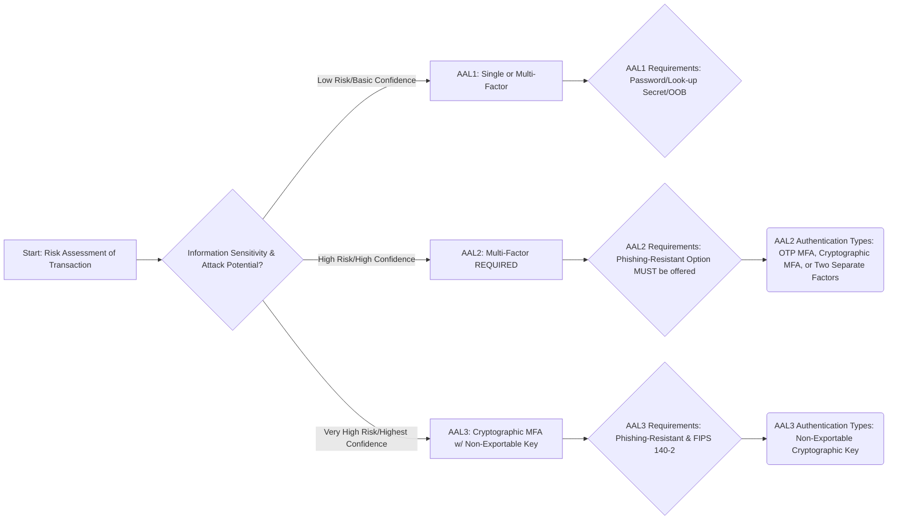
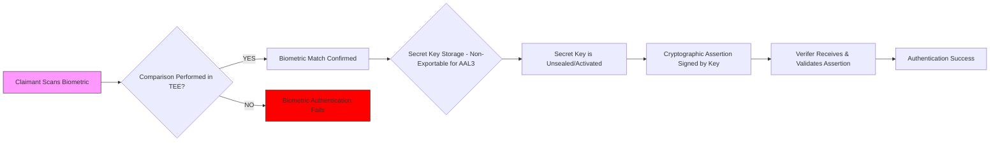

## NIST Special Publication (SP) 800-63B-4, Digital Identity Guidelines: Authentication and Authenticator Management ##

### Authentication Assurance Levels (AALs) ###

The central construct is the Authentication Assurance Level (AAL), a measure of confidence in the claimant's asserted identity. The level is determined by the required attacker effort to compromise the authentication mechanism. Federal information systems are required to utilize a minimum of AAL2 if sensitive personal information is accessible online.

| Requirement             | AAL1 (Basic)              | AAL2 (High)                          | AAL3 (Very High)                    |
|------------------------|---------------------------|------------------------------------|-----------------------------------|
| Factor Requirement      | Single- or Multi-Factor   | REQUIRED Multi-Factor (MFA)        | REQUIRED Multi-Factor (MFA)        |
| Phishing Resistance     | Not Required              | MUST offer a phishing-resistant option | REQUIRED phishing-resistant authenticator |
| Key Exportability       | Exportable                | Exportable                         | REQUIRED Non-Exportable Key        |
| Verifier Crypto Validation | FIPS 140 Level 1       | FIPS 140 Level 1                   | FIPS 140 Level 2                  |
| Session Timeout (Overall) | SHALL be established (e.g., 30 days) | SHALL be established      | SHALL be established              |

The choice of AAL fundamentally drives the selection and deployment requirements for the authentication technology.

**AAL1 (Basic):** Focuses on preventing simple guessing attacks. Permitted authenticators include standard passwords, look-up secrets, and single-factor OTPs. Verifiers must implement rate limiting against online attacks.

**AAL2 (High):** Mandates Multi-Factor Authentication (MFA). The combination must prevent an attacker from successfully completing the authentication process by compromising a single factor. Critically, systems MUST offer a phishing-resistant option, though the claimant is not forced to use it. Acceptable MFA includes combining a physical authenticator ("something you have") with a memorized secret ("something you know") or a biometric comparison ("something you are").

**AAL3 (Very High):** Mandates the use of a phishing-resistant authenticator that employs a public-key cryptographic protocol. The private key used for authentication SHALL BE NON-EXPORTABLE from the device, typically requiring a FIPS 140 Level 2 cryptographic module.

### Authenticator Technology and Requirements ###

| Authenticator Type       | Storage Requirement                                   | Key Security Requirement (if applicable)                            | Mandatory Mitigation(s)                                                                                  |
|--------------------------|------------------------------------------------------|---------------------------------------------------------------------|----------------------------------------------------------------------------------------------------------|
| Memorized Secrets (Passwords) | Stored using a key-stretching function (e.g., PBKDF2, Argon2) | N/A                                                                 | Rate limiting on verifier; Checked against blacklist of known compromised passwords.                      |
| Out-of-Band (OOB)        | N/A                                                  | OOB channel must be verified during enrollment (if not federated)  | SHALL NOT compare secrets sent over primary and OOB channels (to resist MiTM).                            |
| Cryptographic            | N/A                                                  | Public key bound to the subscriber identity. Private key must have 112-bit security strength. | AAL3 keys MUST be non-exportable. Operations must use FIPS-approved algorithms.                          |

**Phishing Resistance:** This is the capability to protect against man-in-the-middle (MiTM) attacks where a user is tricked into supplying credentials to an attacker's site. This is achieved by binding the authentication secret's use to a specific origin (e.g., domain name). FIDO (WebAuthn) is the canonical example of a technology that satisfies this requirement. Its mandate at AAL3 and offering at AAL2 represents a critical security shift.

**Biometrics:** Biometric data (fingerprint, face) is NOT a standalone authentication factor. It serves as a single factor only when used to unseal or activate an authenticator secret that is securely stored on a device.

**Cryptographic Authenticators (AAL3):** These are defined by the required non-exportability of the private key, meaning the private key cannot be read out of the authenticator device, even with administrative access. This requirement ensures the integrity of the "something you have" factor is maintained and limits the attacker's ability to steal the credential for later use.

### Lifecycle Management and Key Updates ###

SP 800-63B-4 specifies strict requirements for managing the entire lifecycle of an authenticator, from initial binding to eventual loss or compromise, and highlights key deviations from the previous SP 800-63B.

| Event                      | Required Action(s)                                    | AAL-Specific Requirement(s)                                                                                     |
|---------------------------|--------------------------------------------------------|------------------------------------------------------------------------------------------------------------------|
| Binding (Enrollment)      | Verifiers must confirm the claimant's identity.        | Binding an additional authenticator SHALL require prior successful authentication at an AAL equal to or higher than the new authenticator's required AAL. |
| Account Recovery          | Recovery methods must be protected against fraud.      | Recovery at AAL2 and AAL3 SHALL be protected by multi-factor authentication. High-risk recovery events MUST trigger fraud monitoring. |
| Loss, Theft, or Compromise | Authenticator must be immediately invalidated.         | The subscriber SHALL be notified upon any high-risk account event (e.g., password change, new authenticator binding, failed recovery attempt). |

#### Session Management and Continuous Authentication ####

- **Session Bindings:** Authentication sessions SHALL be bound to the subscriber to resist session hijacking (e.g., using secure cookies, device-bound session credentials).

- **Reauthentication:** Defines definite overall session timeouts and allows for inactivity timeouts. The maximum session lifespan is determined by the AAL.

- **Session Monitoring (Continuous Authentication):** New guidelines are introduced for session monitoring. This allows RPs to continuously assess the risk profile of an active session (e.g., monitoring location changes, device attributes) and trigger reauthentication or session termination if the risk exceeds a threshold.
