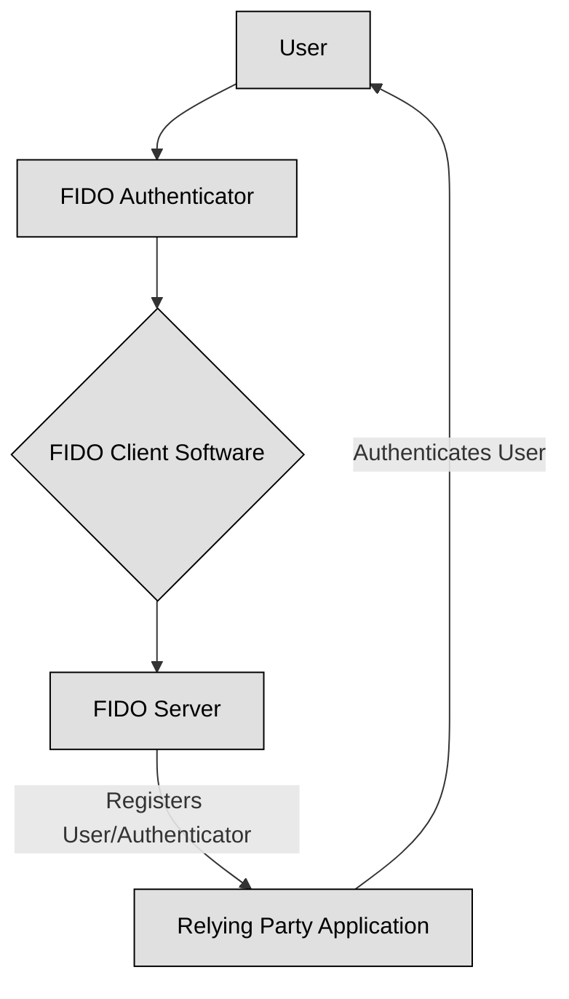

## FIDO and FIDO2: Revolutionizing Authentication ##

Traditional password-based systems are increasingly vulnerable to breaches, phishing, and various other cyber threats. This vulnerability has spurred the development of more secure and user-friendly authentication methods, among which FIDO (Fast IDentity Online) and its successor, FIDO2, stand out.

What are limitations of passwords ?

- Phishing	Tricking users into revealing credentials through fake websites or emails.

- Brute-Force Attacks	Systematically trying all possible password combinations.

- Credential Stuffing	Using compromised credentials from one site to gain access to others.

- Keyloggers	Malicious software that records keystrokes, including passwords.

- Shoulder Surfing	Observing a user entering their password.

The FIDO Alliance, an open industry association, was formed to address the aforementioned password problem. Their primary goal is to develop and promote open, royalty-free standards for simpler, stronger authentication. FIDO standards are designed to reduce reliance on passwords by enabling secure authentication using cryptographic methods, often involving a physical authenticator.

:link: The [FIDO Alliance](https://fidoalliance.org/) is an open industry association with a focused mission: reduce the world’s reliance on passwords. To accomplish this, the FIDO Alliance promotes the development of, use of, and compliance with standards for authentication and device attestation.

At its core, FIDO authentication involves two main components:

1. **FIDO Authenticator:** A device that generates and stores cryptographic keys. This can be a built-in sensor (fingerprint, facial recognition) on a smartphone, a USB security key, or even a Bluetooth device.

2. **FIDO Server:** The relying party's system that verifies the authenticity of the user.

When a user attempts to log in, the FIDO authenticator cryptographically signs a challenge from the FIDO server. This signed challenge is then sent back to the server, which verifies it without ever exchanging the user's actual credentials (like a password).

The Key features of FIDO are:

- Strong Authentication: Utilizes public-key cryptography, making it highly resistant to phishing and man-in-the-middle attacks.

- User Convenience: Eliminates the need to remember complex passwords, often leveraging biometrics for a seamless experience.

- Privacy: No identifiable personal information or biometric data is stored on the server. The authenticator only sends a signed attestation.

- Decentralized: Does not rely on a central identity provider, enhancing security and privacy

Fiso comes in 2 specifications:

    
